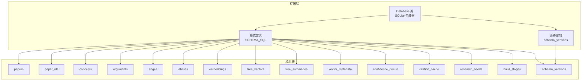
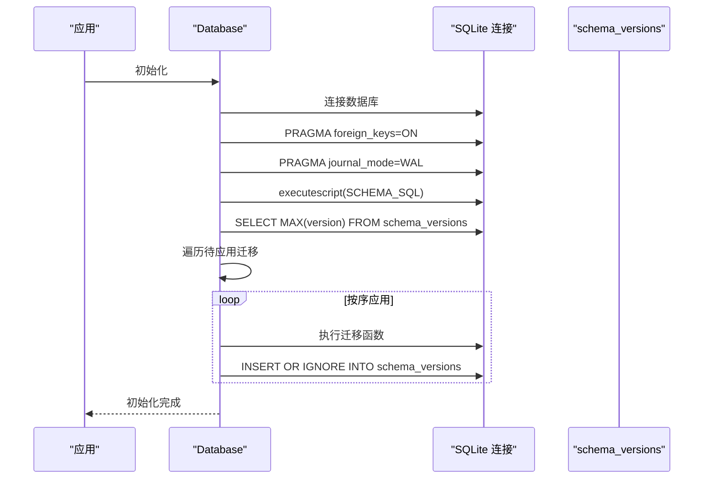
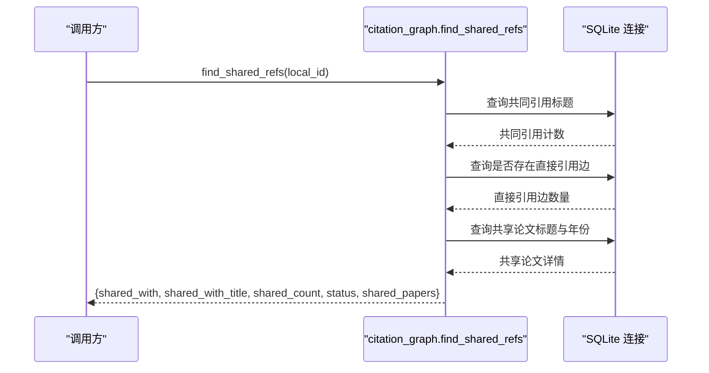

# 数据库设计

<cite>
**本文引用的文件**
- [database.py](file://src/drbrain/storage/database.py)
- [citation_graph.py](file://src/drbrain/storage/citation_graph.py)
- [config.py](file://src/drbrain/config.py)
- [paths.py](file://src/drbrain/storage/paths.py)
- [test_database_extended.py](file://tests/test_database_extended.py)
- [test_layer1_db_schema.py](file://tests/test_layer1_db_schema.py)
</cite>

## 目录
1. [简介](#简介)
2. [项目结构](#项目结构)
3. [核心组件](#核心组件)
4. [架构总览](#架构总览)
5. [详细组件分析](#详细组件分析)
6. [依赖关系分析](#依赖关系分析)
7. [性能考量](#性能考量)
8. [故障排查指南](#故障排查指南)
9. [结论](#结论)
10. [附录](#附录)

## 简介
本文件系统性梳理 DrBrain 的 SQLite 数据库设计，覆盖整体架构、表结构与约束、外键与索引策略、数据完整性保障、初始化与模式管理机制、版本迁移策略，以及查询优化建议。重点围绕 papers、concepts、arguments、edges 等核心表展开，并给出表间关系图与关键流程的时序图，帮助读者快速理解并高效使用该数据库层。

## 项目结构
数据库层位于存储子系统中，采用轻量封装的 SQLite 访问器，负责：
- 自动初始化数据库与模式（含版本迁移）
- 提供论文、概念、论点、边等实体的增删改查接口
- 支持引用缓存、构建阶段状态、置信度队列等辅助表
- 配合检索与推理模块进行向量化与树状结构存储



图表来源
- [database.py:10-156](file://src/drbrain/storage/database.py#L10-L156)
- [database.py:159-200](file://src/drbrain/storage/database.py#L159-L200)

章节来源
- [database.py:10-156](file://src/drbrain/storage/database.py#L10-L156)
- [database.py:159-200](file://src/drbrain/storage/database.py#L159-L200)

## 核心组件
- Database 类：封装 SQLite 连接、自动初始化与迁移、常用 CRUD 操作与查询辅助方法
- 模式定义：集中于 SCHEMA_SQL 常量，声明所有表、主键、外键、检查约束与索引
- 迁移机制：基于 schema_versions 表记录已应用版本，按顺序执行增量迁移
- 辅助工具：路径工具、引用图分析函数等

章节来源
- [database.py:159-200](file://src/drbrain/storage/database.py#L159-L200)
- [database.py:10-156](file://src/drbrain/storage/database.py#L10-L156)

## 架构总览
DrBrain 的知识图谱数据库以“论文-概念-论点-边”为核心，辅以别名、引用缓存、置信度队列、研究种子、构建阶段、向量与树摘要等表，形成从抽取到推理的闭环。

```mermaid
erDiagram
papers {
text local_id PK
text title
text abstract
integer year
text paper_type
text status
text journal
text publisher
integer citation_count
text volume
text pages
text authors
timestamp created_at
}
paper_ids {
text local_id FK
text doi UK
text arxiv UK
text s2_id UK
text openalex_id UK
}
concepts {
integer concept_id PK
text local_id FK
text type
text label
real confidence
text section
text node_id
integer first_seen
integer last_seen
}
arguments {
integer arg_id PK
text source_paper FK
text claim
text claim_type
text target_label
text target_type
text evidence_type
text evidence_detail
text mechanism
text section
text node_id
real confidence
timestamp created_at
}
edges {
text src_id
text dst_id
text relation
text source_paper
real weight
PK src_id,dst_id,relation,source_paper
}
aliases {
text variant PK
text canonical_id
}
embeddings {
text entity PK
blob vec
integer dim
}
tree_vectors {
text node_id PK
text paper_id
blob embedding
text content_hash
text tree_layer
}
tree_summaries {
text node_id PK
text paper_id
text summary_text
text source_node_ids
integer tree_layer
}
vector_metadata {
text key PK
text value
}
confidence_queue {
integer queue_id PK
text source_paper
text item_type
text item_data
real confidence
text status
timestamp created_at
}
citation_cache {
text source_paper
text target_title
integer target_year
text relation
text target_doi
text target_s2_id
timestamp cached_at
PK source_paper,target_title
}
research_seeds {
integer seed_id PK
text pattern_type
text description
real confidence
timestamp created_at
}
build_stages {
text paper_id
text stage
text status
text result_json
timestamp updated_at
PK paper_id,stage
}
schema_versions {
integer version PK
timestamp applied_at
}
papers ||--o{ paper_ids : "拥有"
papers ||--o{ concepts : "包含"
papers ||--o{ arguments : "产生"
concepts ||--|| aliases : "映射"
edges }o--|| concepts : "连接"
edges }o--|| papers : "归属"
arguments }o--|| papers : "来源"
tree_vectors }o--|| papers : "属于"
tree_summaries }o--|| papers : "属于"
confidence_queue }o--|| papers : "来源"
citation_cache }o--|| papers : "关联"
build_stages }o--|| papers : "跟踪"
```

图表来源
- [database.py:10-156](file://src/drbrain/storage/database.py#L10-L156)

## 详细组件分析

### papers 表
- 设计要点
  - 主键：local_id（本地唯一标识）
  - 元数据：标题、摘要、年份、类型、状态、期刊、出版商、引用数、卷期页码、作者
  - 约束：paper_type 与 status 使用 CHECK 限制枚举值；created_at 默认当前时间戳
- 外键与索引
  - 作为其他表的父表，被 concepts、arguments、paper_ids 等引用
  - 未显式定义索引，但查询通常通过 local_id 或联合条件访问
- 典型用途
  - 存储论文基础信息与状态流转（placeholder/uploaded/merged/extracted）
  - 与 paper_ids 表配合实现外部 ID 到本地 ID 的映射

章节来源
- [database.py:11-26](file://src/drbrain/storage/database.py#L11-L26)
- [database.py:279-346](file://src/drbrain/storage/database.py#L279-L346)

### paper_ids 表
- 设计要点
  - 外键：local_id 引用 papers(local_id)，删除级联
  - 唯一约束：各外部 ID 字段唯一，便于去重与查找
- 典型用途
  - 统一管理 DOI、arXiv、S2、OpenAlex 等外部 ID
  - 通过 get_paper_by_external_id 实现反向查找

章节来源
- [database.py:28-34](file://src/drbrain/storage/database.py#L28-L34)
- [database.py:261-269](file://src/drbrain/storage/database.py#L261-L269)

### concepts 表
- 设计要点
  - 主键：自增 concept_id
  - 外键：local_id 引用 papers(local_id)
  - 属性：类型（Problem/Method/Conclusion/Debate/Gap/Actor）、标签、置信度、节区、节点 ID、首次/末次出现年份
  - 约束：type 与 first_seen/last_seen 为整数年份
- 典型用途
  - 存储从论文中抽取的概念及其时间演化信号
  - 支持按类型、标签、年份范围查询

章节来源
- [database.py:36-46](file://src/drbrain/storage/database.py#L36-L46)
- [database.py:350-365](file://src/drbrain/storage/database.py#L350-L365)

### arguments 表
- 设计要点
  - 主键：自增 arg_id
  - 外键：source_paper 引用 papers(local_id)
  - 属性：主张文本、主张类型（supports/challenges/extends/limits/solves/proposes）、目标标签/类型、证据类型/细节、机制描述、节区、节点 ID、置信度、创建时间
  - 约束：claim_type、target_type、evidence_type、status 等枚举校验
- 典型用途
  - 存储论文中的主张及其证据链，支持检索与推理

章节来源
- [database.py:48-62](file://src/drbrain/storage/database.py#L48-L62)
- [database.py:500-532](file://src/drbrain/storage/database.py#L500-L532)

### edges 表
- 设计要点
  - 复合主键：src_id、dst_id、relation、source_paper
  - 属性：权重、节点 ID、节区
- 典型用途
  - 描述概念间的语义关系（如 references、addresses 等），支持图遍历与检索增强
- 去重策略
  - INSERT OR IGNORE，避免重复边

章节来源
- [database.py:64-71](file://src/drbrain/storage/database.py#L64-L71)
- [database.py:367-381](file://src/drbrain/storage/database.py#L367-L381)

### aliases 表
- 设计要点
  - 主键：variant（别名）
  - 外键：canonical_id 指向 concepts.concept_id
- 典型用途
  - 将不同表述映射到同一概念 ID，提升检索一致性

章节来源
- [database.py:73-76](file://src/drbrain/storage/database.py#L73-L76)
- [test_database_extended.py:70-84](file://tests/test_database_extended.py#L70-L84)

### embeddings、tree_vectors、tree_summaries、vector_metadata
- 设计要点
  - embeddings：实体到向量的映射，支持替换写入
  - tree_vectors：树节点向量，包含 paper_id、embedding、content_hash、tree_layer
  - tree_summaries：树节点摘要，包含 source_node_ids 与层级
  - vector_metadata：向量元数据键值对
- 典型用途
  - 支持树状检索与向量化搜索，按需加载

章节来源
- [database.py:78-90](file://src/drbrain/storage/database.py#L78-L90)
- [database.py:398-416](file://src/drbrain/storage/database.py#L398-L416)

### confidence_queue
- 设计要点
  - 主键：queue_id
  - 属性：来源论文、条目类型（concept/alias/relation）、条目数据、置信度、状态（pending/accepted/rejected）、创建时间
- 典型用途
  - 置信度评估与人工审核流程的中间态存储

章节来源
- [database.py:105-113](file://src/drbrain/storage/database.py#L105-L113)
- [test_database_extended.py:128-156](file://tests/test_database_extended.py#L128-L156)

### citation_cache
- 设计要点
  - 复合主键：source_paper、target_title
  - 属性：目标标题/年份、关系（references/citing）、目标 DOI/S2 ID、缓存时间
- 典型用途
  - 引用图分析与共享参考发现的基础缓存

章节来源
- [database.py:132-141](file://src/drbrain/storage/database.py#L132-L141)
- [citation_graph.py:8-56](file://src/drbrain/storage/citation_graph.py#L8-L56)

### research_seeds、build_stages、schema_versions
- 设计要点
  - research_seeds：研究种子的模式类型、描述、置信度
  - build_stages：论文处理阶段的状态与结果
  - schema_versions：记录已应用的模式版本
- 典型用途
  - 种子驱动的知识发现与构建流程追踪；模式演进记录

章节来源
- [database.py:124-130](file://src/drbrain/storage/database.py#L124-L130)
- [database.py:143-150](file://src/drbrain/storage/database.py#L143-L150)
- [database.py:152-155](file://src/drbrain/storage/database.py#L152-L155)

## 依赖关系分析

### 外键与完整性
- papers 是多表父表
  - concepts.local_id → papers.local_id
  - arguments.source_paper → papers.local_id
  - paper_ids.local_id → papers.local_id（ON DELETE CASCADE）
  - edges.source_paper → papers.local_id
- edges 与 concepts 的连接
  - edges.src_id/dst_id 可指向 concepts.label 或内部 ID，具体取决于抽取与规范化策略
- aliases.canonical_id → concepts.concept_id

章节来源
- [database.py:28-34](file://src/drbrain/storage/database.py#L28-L34)
- [database.py:36-46](file://src/drbrain/storage/database.py#L36-L46)
- [database.py:64-71](file://src/drbrain/storage/database.py#L64-L71)
- [database.py:73-76](file://src/drbrain/storage/database.py#L73-L76)

### 索引策略
- 显式索引
  - concepts.type、label、first_seen
  - arguments.source_paper、target_label
  - edges.relation、src_id
  - confidence_queue.status
- 未显式索引但高频查询字段
  - papers.local_id（主键）
  - edges 复合主键（天然索引）
  - paper_ids 外键 local_id（隐式索引）

章节来源
- [database.py:115-122](file://src/drbrain/storage/database.py#L115-L122)

### 查询优化建议
- 为高频过滤字段建立索引
  - concepts: type、label、first_seen、last_seen
  - arguments: source_paper、target_label、claim_type、target_type
  - edges: relation、src_id、dst_id
  - confidence_queue: status、source_paper
- 使用复合主键与唯一约束避免重复插入
  - edges、citation_cache、build_stages
- 对跨表连接查询使用 EXPLAIN QUERY PLAN 分析执行计划
- 对大规模扫描场景考虑分页或限制返回数量

章节来源
- [database.py:115-122](file://src/drbrain/storage/database.py#L115-L122)
- [database.py:367-381](file://src/drbrain/storage/database.py#L367-L381)
- [database.py:132-141](file://src/drbrain/storage/database.py#L132-L141)

## 性能考量
- WAL 模式
  - 开启 PRAGMA journal_mode=WAL，提高并发读写性能
- 外键约束
  - PRAGMA foreign_keys=ON，确保参照完整性，但会带来轻微写入开销
- 向量存储
  - embeddings 使用 BLOB 存储，注意内存占用与序列化成本
- 查询模式
  - 概念与论点的检索常伴随 JOIN papers，建议在 papers 上保持最小必要字段返回
  - 引用图分析依赖 citation_cache，建议定期清理过期缓存

章节来源
- [database.py:165-167](file://src/drbrain/storage/database.py#L165-L167)
- [database.py:398-416](file://src/drbrain/storage/database.py#L398-L416)

## 故障排查指南
- 初始化失败
  - 检查数据库路径权限与目录存在性
  - 确认 schema_versions 是否可写
- 迁移异常
  - 查看 schema_versions 当前版本，确认缺失的迁移步骤
  - 手动执行迁移函数或回滚后重新应用
- 数据不一致
  - 使用 PRAGMA integrity_check 检查完整性
  - 关注外键约束导致的删除/更新行为（如 paper_ids 的 CASCADE）
- 查询缓慢
  - 使用 EXPLAIN QUERY PLAN 分析慢查询
  - 为热点字段添加索引或调整查询条件

章节来源
- [database.py:170-200](file://src/drbrain/storage/database.py#L170-L200)
- [database.py:587-617](file://src/drbrain/storage/database.py#L587-L617)

## 结论
DrBrain 的数据库设计以“论文-概念-论点-边”为核心，辅以别名、引用缓存、置信度队列与向量存储，形成完整的知识抽取与检索基础。通过显式索引与外键约束保证数据一致性，借助 schema_versions 与增量迁移实现平滑演进。建议在生产环境中结合 EXPLAIN QUERY PLAN 与性能监控持续优化查询路径，并根据业务增长逐步完善索引策略。

## 附录

### 数据库初始化与模式管理
- 初始化流程
  - 创建数据库文件与目录
  - 执行 SCHEMA_SQL 定义所有表
  - 应用未应用的迁移版本
  - 提交事务
- 迁移策略
  - 按版本顺序依次应用，记录到 schema_versions
  - 新增列时使用条件判断避免重复迁移
  - 增量迁移函数包括：paper_type、venue_columns、authors、node_id、edge_provenance



图表来源
- [database.py:162-173](file://src/drbrain/storage/database.py#L162-L173)
- [database.py:175-200](file://src/drbrain/storage/database.py#L175-L200)

### 引用图分析流程
- 共享参考发现
  - 基于 citation_cache 的共同引用标题聚合
  - 通过 edges 判断是否已有直接引用边
  - 返回共享论文列表与共享引用详情



图表来源
- [citation_graph.py:8-56](file://src/drbrain/storage/citation_graph.py#L8-L56)

### 配置与路径
- 数据库路径
  - 通过配置项 db.path 指定，默认 data/drbrain.db
- 纸张文件路径
  - paper_dir、raw_md_path、tree_json_path、source_pdf_path、images_dir 等统一管理

章节来源
- [config.py:80-82](file://src/drbrain/config.py#L80-L82)
- [paths.py:6-29](file://src/drbrain/storage/paths.py#L6-L29)

### 测试验证要点
- 基础 CRUD 与事务
  - get_all_papers/get_paper、insert_paper、delete_paper 等
- 概念与别名
  - insert_concept/get_concepts_by_paper、insert_alias
- 论点与队列
  - insert_argument/get_arguments_by_paper、insert_queue_item/accept_queue_item/reject_queue_item
- 边插入去重
  - insert_edge 的 INSERT OR IGNORE 行为
- 时间演化信号
  - detect_evolution_signals、get_concept_signal、get_concept_evolution
- 模式兼容性
  - 通过测试断言新增列与索引的存在性

章节来源
- [test_database_extended.py:7-251](file://tests/test_database_extended.py#L7-L251)
- [test_layer1_db_schema.py:12-161](file://tests/test_layer1_db_schema.py#L12-L161)