# 文件存储

<cite>
**本文引用的文件**
- [src/drbrain/storage/paths.py](file://src/drbrain/storage/paths.py)
- [src/drbrain/storage/database.py](file://src/drbrain/storage/database.py)
- [src/drbrain/storage/workspace.py](file://src/drbrain/storage/workspace.py)
- [src/drbrain/storage/inbox.py](file://src/drbrain/storage/inbox.py)
- [src/drbrain/storage/backup.py](file://src/drbrain/storage/backup.py)
- [src/drbrain/storage/explore.py](file://src/drbrain/storage/explore.py)
- [src/drbrain/storage/export.py](file://src/drbrain/storage/export.py)
- [src/drbrain/storage/proceedings.py](file://src/drbrain/storage/proceedings.py)
- [src/drbrain/storage/citation_graph.py](file://src/drbrain/storage/citation_graph.py)
- [src/drbrain/config.py](file://src/drbrain/config.py)
- [config.yaml](file://config.yaml)
- [src/drbrain/dedup/resolver.py](file://src/drbrain/dedup/resolver.py)
- [src/drbrain/cli/check_commands.py](file://src/drbrain/cli/check_commands.py)
- [src/drbrain/cli/query_commands.py](file://src/drbrain/cli/query_commands.py)
</cite>

## 目录
1. [简介](#简介)
2. [项目结构](#项目结构)
3. [核心组件](#核心组件)
4. [架构总览](#架构总览)
5. [详细组件分析](#详细组件分析)
6. [依赖分析](#依赖分析)
7. [性能考虑](#性能考虑)
8. [故障排查指南](#故障排查指南)
9. [结论](#结论)
10. [附录](#附录)

## 简介
本文件存储技术文档面向 DrBrain 的文件系统与数据层，聚焦以下目标：
- 深入解释文件组织结构与存储策略的实现细节
- 记录数据文件、缓存文件、临时文件的存储路径配置
- 说明文件命名规范与目录结构设计
- 提供文件权限与访问控制的技术实现要点
- 包含文件压缩与去重的优化策略
- 解释文件清理与垃圾回收的自动化机制
- 提供文件存储监控与容量管理的操作指南
- 记录文件迁移与升级的数据处理流程

## 项目结构
DrBrain 的文件存储由“配置驱动 + 多模块协同”的方式组织：
- 配置层：通过类型化配置类集中定义路径与行为（如数据目录、数据库路径、备份目标等）
- 存储层：围绕“论文数据、工作区、探索集合、收件箱、导出格式、会议论文集、备份归档”等子域提供统一接口
- 数据库层：以 SQLite 为核心持久化，内置模式迁移与索引管理
- 去重与解析：提供外部 ID 规范化与模糊匹配能力，支撑入库与合并

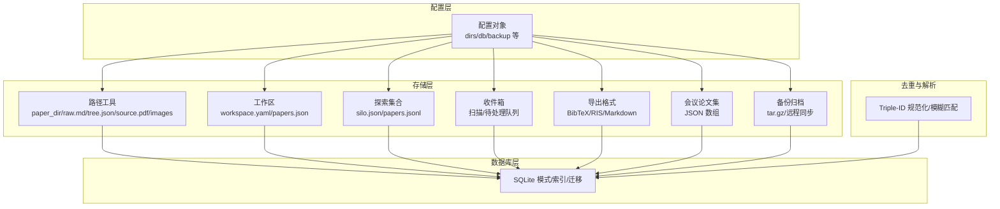

图表来源
- [src/drbrain/config.py:69-82](file://src/drbrain/config.py#L69-L82)
- [src/drbrain/storage/paths.py:6-28](file://src/drbrain/storage/paths.py#L6-L28)
- [src/drbrain/storage/workspace.py:43-52](file://src/drbrain/storage/workspace.py#L43-L52)
- [src/drbrain/storage/explore.py:28-38](file://src/drbrain/storage/explore.py#L28-L38)
- [src/drbrain/storage/inbox.py:9-9](file://src/drbrain/storage/inbox.py#L9-L9)
- [src/drbrain/storage/export.py:68-105](file://src/drbrain/storage/export.py#L68-L105)
- [src/drbrain/storage/proceedings.py:14-14](file://src/drbrain/storage/proceedings.py#L14-L14)
- [src/drbrain/storage/backup.py:18-23](file://src/drbrain/storage/backup.py#L18-L23)
- [src/drbrain/storage/database.py:10-156](file://src/drbrain/storage/database.py#L10-L156)
- [src/drbrain/dedup/resolver.py:20-47](file://src/drbrain/dedup/resolver.py#L20-L47)

章节来源
- [src/drbrain/config.py:69-82](file://src/drbrain/config.py#L69-L82)
- [config.yaml:25-31](file://config.yaml#L25-L31)
- [src/drbrain/storage/paths.py:6-28](file://src/drbrain/storage/paths.py#L6-L28)
- [src/drbrain/storage/workspace.py:43-52](file://src/drbrain/storage/workspace.py#L43-L52)
- [src/drbrain/storage/explore.py:28-38](file://src/drbrain/storage/explore.py#L28-L38)
- [src/drbrain/storage/inbox.py:9-9](file://src/drbrain/storage/inbox.py#L9-L9)
- [src/drbrain/storage/export.py:68-105](file://src/drbrain/storage/export.py#L68-L105)
- [src/drbrain/storage/proceedings.py:14-14](file://src/drbrain/storage/proceedings.py#L14-L14)
- [src/drbrain/storage/backup.py:18-23](file://src/drbrain/storage/backup.py#L18-L23)
- [src/drbrain/storage/database.py:10-156](file://src/drbrain/storage/database.py#L10-L156)
- [src/drbrain/dedup/resolver.py:20-47](file://src/drbrain/dedup/resolver.py#L20-L47)

## 核心组件
- 路径工具：提供论文目录与关键文件的路径拼接函数，确保命名规范与可维护性
- 工作区：轻量级论文子集管理，基于 YAML 元数据与 JSON 列表
- 探索集合：用于探索性文献收集，独立于主库与工作区
- 收件箱：PDF 扫描与失败重试的待处理队列
- 导出：多格式参考导出（BibTeX、RIS、Markdown）
- 会议论文集：JSON 结构存储会议信息与关联论文
- 备份：本地 tar.gz 归档与远程 rsync 同步
- 数据库：SQLite 模式、索引、迁移与查询封装
- 去重：Triple-ID 规范化与模糊匹配，支持入库合并

章节来源
- [src/drbrain/storage/paths.py:6-28](file://src/drbrain/storage/paths.py#L6-L28)
- [src/drbrain/storage/workspace.py:71-100](file://src/drbrain/storage/workspace.py#L71-L100)
- [src/drbrain/storage/explore.py:49-86](file://src/drbrain/storage/explore.py#L49-L86)
- [src/drbrain/storage/inbox.py:12-31](file://src/drbrain/storage/inbox.py#L12-L31)
- [src/drbrain/storage/export.py:68-105](file://src/drbrain/storage/export.py#L68-L105)
- [src/drbrain/storage/proceedings.py:31-64](file://src/drbrain/storage/proceedings.py#L31-L64)
- [src/drbrain/storage/backup.py:26-63](file://src/drbrain/storage/backup.py#L26-L63)
- [src/drbrain/storage/database.py:159-258](file://src/drbrain/storage/database.py#L159-L258)
- [src/drbrain/dedup/resolver.py:50-82](file://src/drbrain/dedup/resolver.py#L50-L82)

## 架构总览
DrBrain 的文件存储采用“配置驱动 + 模块化接口 + SQLite 持久化”的分层架构：
- 配置层：集中定义数据根目录、数据库路径、缓存与日志位置
- 存储层：各子域模块提供统一的 CRUD 与查询接口，避免上层直接操作文件系统
- 数据库层：以 SQLite 为中心，承载论文、概念、论点、边、别名、向量等结构化数据，并维护模式版本
- 去重层：在入库前对 Triple-ID 进行规范化与模糊匹配，减少重复与提升一致性

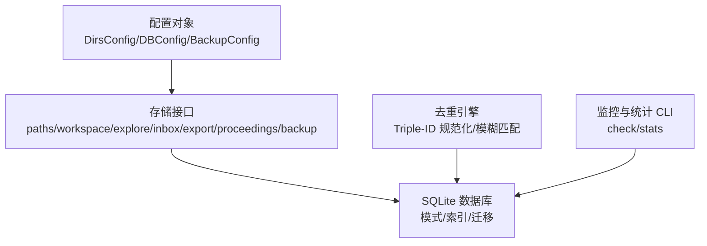

图表来源
- [src/drbrain/config.py:69-82](file://src/drbrain/config.py#L69-L82)
- [src/drbrain/storage/database.py:159-258](file://src/drbrain/storage/database.py#L159-L258)
- [src/drbrain/dedup/resolver.py:50-82](file://src/drbrain/dedup/resolver.py#L50-L82)
- [src/drbrain/cli/check_commands.py:272-307](file://src/drbrain/cli/check_commands.py#L272-L307)
- [src/drbrain/cli/query_commands.py:77-110](file://src/drbrain/cli/query_commands.py#L77-L110)

## 详细组件分析

### 路径与命名规范
- 论文目录：每个论文一个目录，使用本地 ID 作为目录名，保证唯一性与可追溯性
- 关键文件：
  - 原始 Markdown：raw.md
  - 页面树 JSON：tree.json
  - 源 PDF：source.pdf
  - 图片目录：images/
- 命名规范：
  - 目录名仅包含字母数字与连字符/下划线/点，长度限制与正则校验
  - 文件名遵循固定后缀，避免歧义

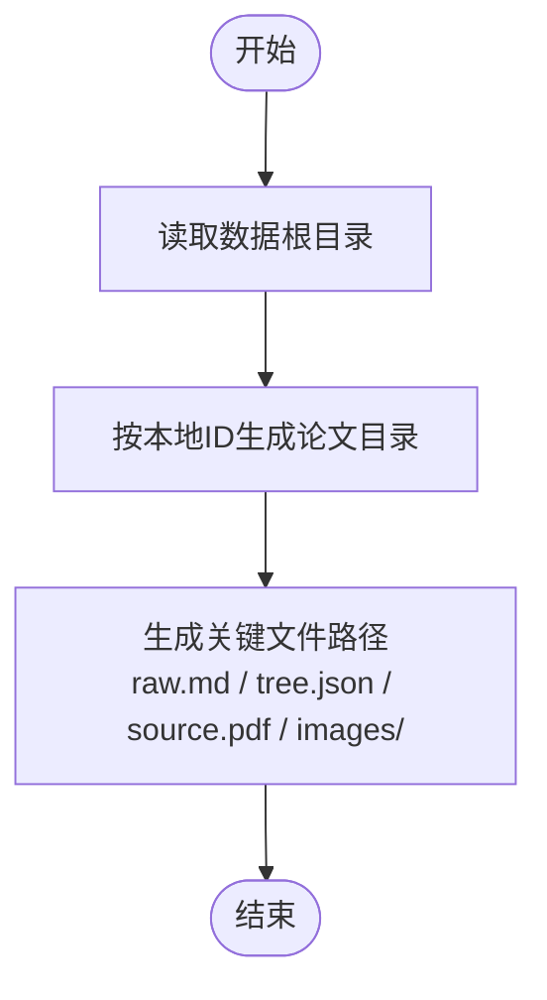

图表来源
- [src/drbrain/storage/paths.py:6-28](file://src/drbrain/storage/paths.py#L6-L28)

章节来源
- [src/drbrain/storage/paths.py:6-28](file://src/drbrain/storage/paths.py#L6-L28)

### 工作区管理
- 元数据：workspace.yaml（名称、描述、创建时间、版本）
- 引用清单：refs/papers.json（论文本地ID列表，带加入时间）
- 操作：
  - 创建：校验名称合法性，初始化元数据与空清单
  - 添加/移除：幂等写入，避免重复
  - 列表/删除/重命名：遍历目录并校验元数据存在性

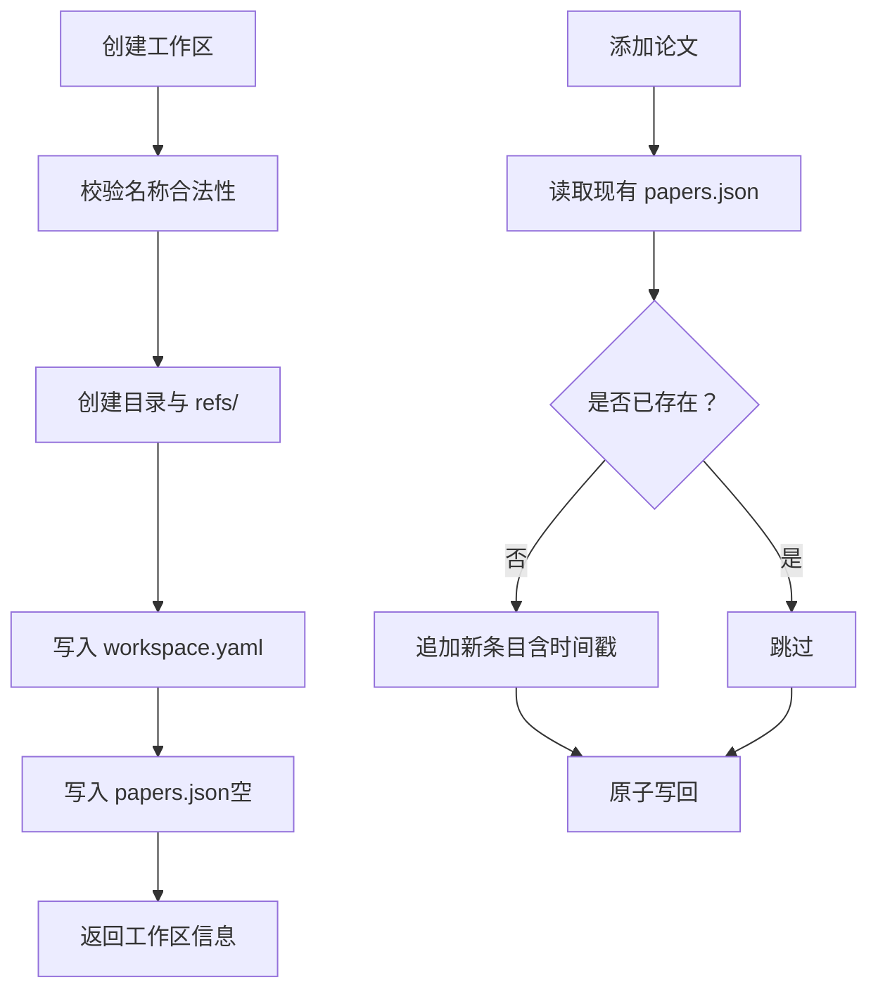

图表来源
- [src/drbrain/storage/workspace.py:71-120](file://src/drbrain/storage/workspace.py#L71-L120)

章节来源
- [src/drbrain/storage/workspace.py:22-120](file://src/drbrain/storage/workspace.py#L22-L120)

### 探索集合（Silos）
- 设计目标：轻量级探索性文献集合，独立于主库与工作区
- 结构：
  - silo.json：元数据（名称、描述、创建时间、论文计数）
  - papers.jsonl：每行一条论文字典，便于增量写入与检索
- 操作：
  - 创建：若不存在则初始化元数据与空文件
  - 添加：追加一行 JSON 字符串
  - 查询：全文关键词检索（大小写不敏感），匹配标题/作者/DOI
  - 列表：遍历目录并读取元数据

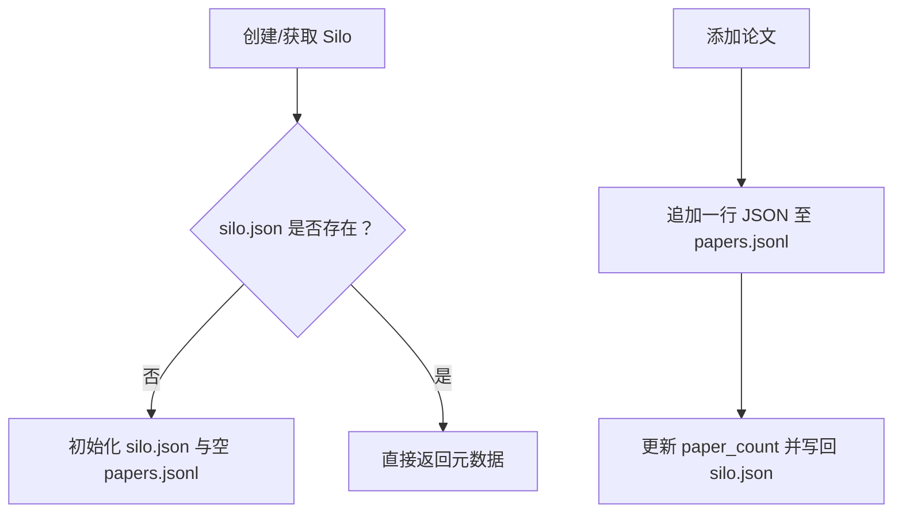

图表来源
- [src/drbrain/storage/explore.py:49-113](file://src/drbrain/storage/explore.py#L49-L113)

章节来源
- [src/drbrain/storage/explore.py:20-113](file://src/drbrain/storage/explore.py#L20-L113)

### 收件箱与待处理队列
- 收件箱扫描：按目录枚举 PDF 文件，排序返回
- 失败转移：将无法处理的 PDF 移动到待处理目录，并记录原因与时间戳至 JSONL 日志
- 待处理日志：每行一条 JSON，包含文件名、原因、时间戳

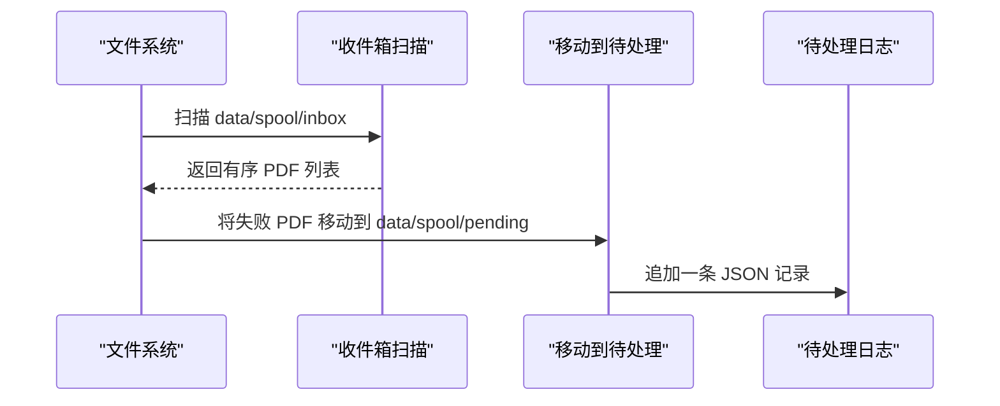

图表来源
- [src/drbrain/storage/inbox.py:12-54](file://src/drbrain/storage/inbox.py#L12-L54)

章节来源
- [src/drbrain/storage/inbox.py:12-54](file://src/drbrain/storage/inbox.py#L12-L54)

### 导出与格式化
- BibTeX：字段转义、条目类型映射、作者姓氏提取、引用键生成
- RIS：条目类型映射、作者拆分、页码区间、DOI 输出
- Markdown：APA 风格摘要输出，支持链接与期刊标注

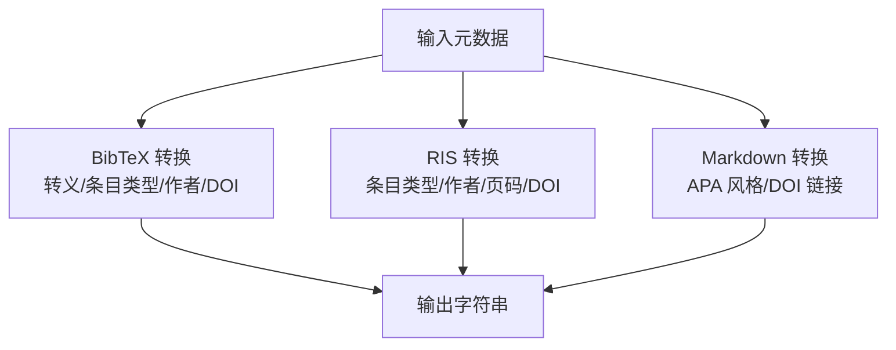

图表来源
- [src/drbrain/storage/export.py:68-105](file://src/drbrain/storage/export.py#L68-L105)
- [src/drbrain/storage/export.py:108-149](file://src/drbrain/storage/export.py#L108-L149)
- [src/drbrain/storage/export.py:152-167](file://src/drbrain/storage/export.py#L152-L167)

章节来源
- [src/drbrain/storage/export.py:68-167](file://src/drbrain/storage/export.py#L68-L167)

### 会议论文集
- 结构：JSON 数组，元素包含 id、name、year、venue、papers[]
- 操作：
  - 创建：去重检查（同名+年份），生成 UUID 前缀
  - 添加：去重插入论文本地ID
  - 查询：按年份倒序、名称排序列出

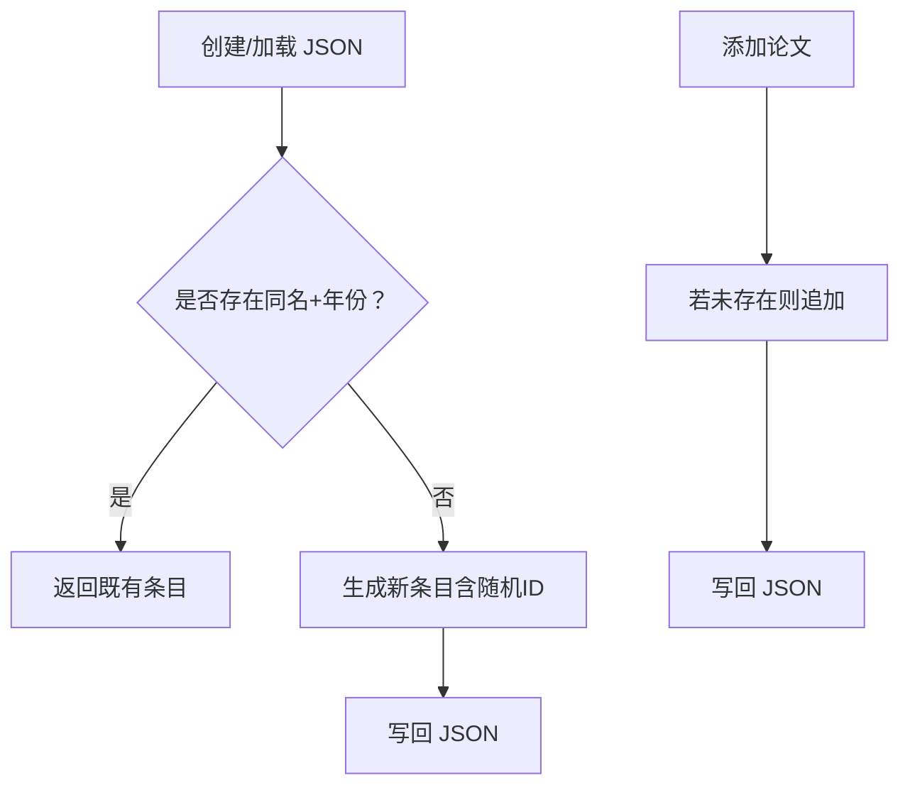

图表来源
- [src/drbrain/storage/proceedings.py:31-87](file://src/drbrain/storage/proceedings.py#L31-L87)

章节来源
- [src/drbrain/storage/proceedings.py:17-100](file://src/drbrain/storage/proceedings.py#L17-L100)

### 备份与远程同步
- 本地备份：打包 papers、数据库、可选 workspace 与 reports，生成带时间戳的 tar.gz
- 远程同步：基于 rsync + ssh，支持压缩、追加模式、排除规则与密码认证
- 结果：命令行、返回码、stdout/stderr 结构化返回，便于脚本化与 CI 集成

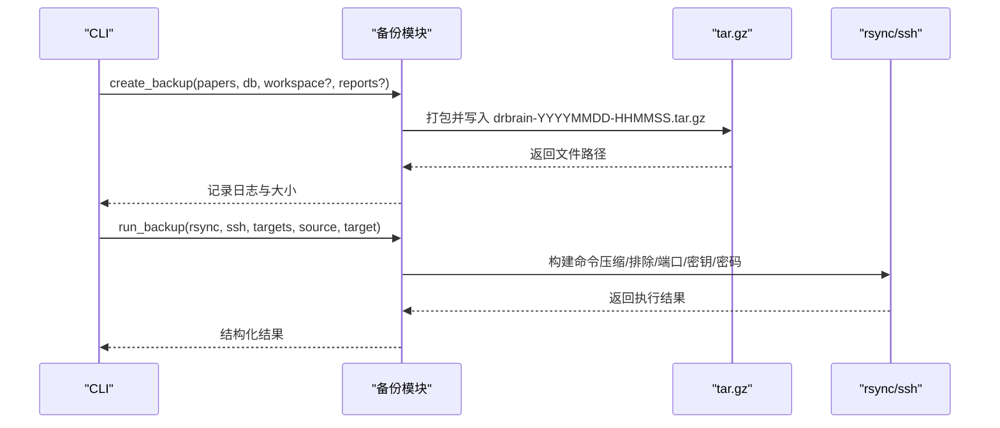

图表来源
- [src/drbrain/storage/backup.py:26-63](file://src/drbrain/storage/backup.py#L26-L63)
- [src/drbrain/storage/backup.py:171-239](file://src/drbrain/storage/backup.py#L171-L239)

章节来源
- [src/drbrain/storage/backup.py:26-63](file://src/drbrain/storage/backup.py#L26-L63)
- [src/drbrain/storage/backup.py:171-239](file://src/drbrain/storage/backup.py#L171-L239)

### 数据库与模式管理
- 模式：论文、外部ID、概念、论点、边、别名、嵌入、树向量/摘要、置信度队列、引用缓存、构建阶段、模式版本
- 索引：针对常用查询建立索引，加速检索
- 迁移：版本化迁移，按顺序应用，记录已应用版本
- 查询：提供增删改查与统计聚合方法

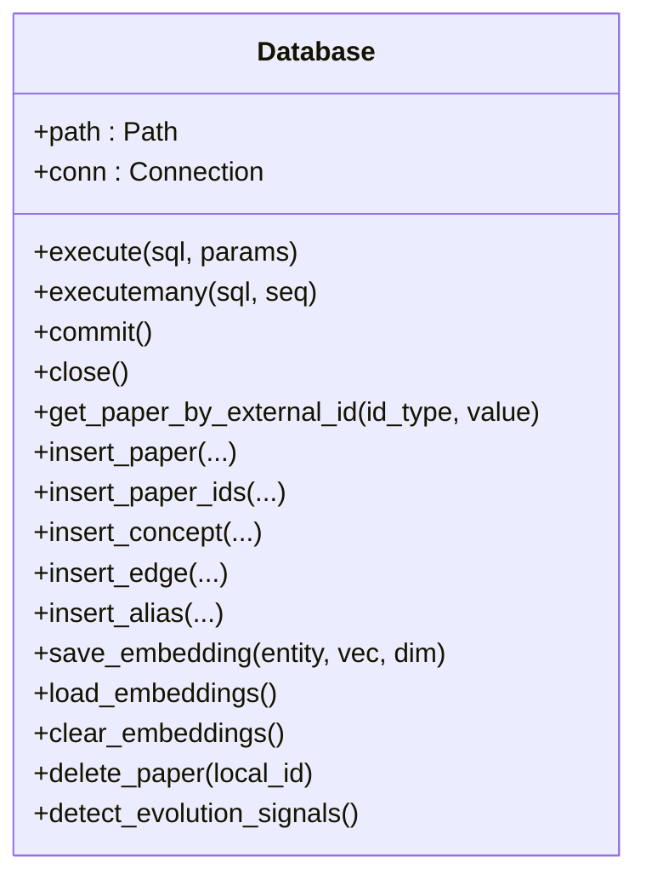

图表来源
- [src/drbrain/storage/database.py:159-258](file://src/drbrain/storage/database.py#L159-L258)
- [src/drbrain/storage/database.py:10-156](file://src/drbrain/storage/database.py#L10-L156)

章节来源
- [src/drbrain/storage/database.py:10-156](file://src/drbrain/storage/database.py#L10-L156)
- [src/drbrain/storage/database.py:159-258](file://src/drbrain/storage/database.py#L159-L258)

### 去重与解析
- Triple-ID 规范化：DOI、arXiv、S2、OpenAlex 统一格式
- 模糊匹配：标题规范化与哈希，辅助 title+year 匹配
- 决策优先级：DOI > arXiv > S2 > OpenAlex > title+year

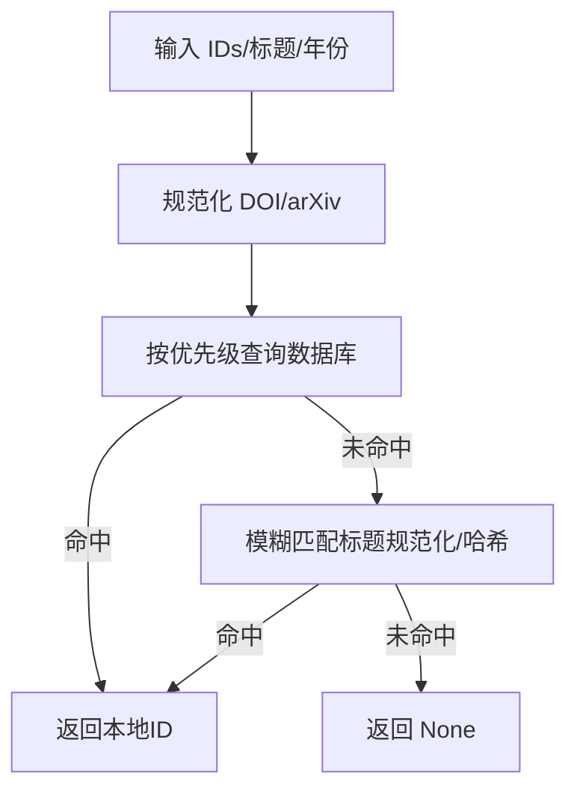

图表来源
- [src/drbrain/dedup/resolver.py:20-47](file://src/drbrain/dedup/resolver.py#L20-L47)
- [src/drbrain/dedup/resolver.py:59-82](file://src/drbrain/dedup/resolver.py#L59-L82)

章节来源
- [src/drbrain/dedup/resolver.py:20-82](file://src/drbrain/dedup/resolver.py#L20-L82)

## 依赖分析
- 配置驱动：所有存储路径与行为由配置类集中定义，便于环境隔离与覆盖
- 模块内聚：各子域模块职责清晰，通过统一接口与数据库交互
- 外部依赖：备份模块依赖 rsync/ssh；导出模块依赖样式服务（Markdown）

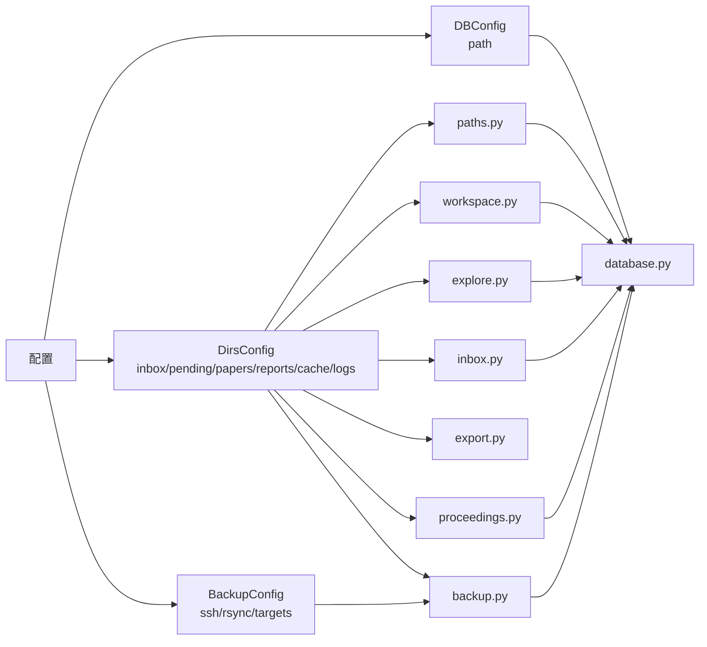

图表来源
- [src/drbrain/config.py:69-82](file://src/drbrain/config.py#L69-L82)
- [src/drbrain/storage/paths.py:6-28](file://src/drbrain/storage/paths.py#L6-L28)
- [src/drbrain/storage/workspace.py:43-52](file://src/drbrain/storage/workspace.py#L43-L52)
- [src/drbrain/storage/explore.py:28-38](file://src/drbrain/storage/explore.py#L28-L38)
- [src/drbrain/storage/inbox.py:9-9](file://src/drbrain/storage/inbox.py#L9-L9)
- [src/drbrain/storage/export.py:68-105](file://src/drbrain/storage/export.py#L68-L105)
- [src/drbrain/storage/proceedings.py:14-14](file://src/drbrain/storage/proceedings.py#L14-L14)
- [src/drbrain/storage/backup.py:18-23](file://src/drbrain/storage/backup.py#L18-L23)
- [src/drbrain/storage/database.py:159-258](file://src/drbrain/storage/database.py#L159-L258)

章节来源
- [src/drbrain/config.py:69-82](file://src/drbrain/config.py#L69-L82)
- [src/drbrain/storage/paths.py:6-28](file://src/drbrain/storage/paths.py#L6-L28)
- [src/drbrain/storage/workspace.py:43-52](file://src/drbrain/storage/workspace.py#L43-L52)
- [src/drbrain/storage/explore.py:28-38](file://src/drbrain/storage/explore.py#L28-L38)
- [src/drbrain/storage/inbox.py:9-9](file://src/drbrain/storage/inbox.py#L9-L9)
- [src/drbrain/storage/export.py:68-105](file://src/drbrain/storage/export.py#L68-L105)
- [src/drbrain/storage/proceedings.py:14-14](file://src/drbrain/storage/proceedings.py#L14-L14)
- [src/drbrain/storage/backup.py:18-23](file://src/drbrain/storage/backup.py#L18-L23)
- [src/drbrain/storage/database.py:159-258](file://src/drbrain/storage/database.py#L159-L258)

## 性能考虑
- 原子写入：工作区与探索集合均采用“写临时文件再替换”的方式，避免部分写入与竞态
- 索引优化：数据库为高频查询建立索引，降低检索成本
- WAL 模式：启用 WAL 提升并发读写性能
- 压缩与归档：备份使用 gzip，远程同步支持压缩传输
- 批量操作：导出批量生成多条记录，减少多次 I/O

章节来源
- [src/drbrain/storage/workspace.py:62-68](file://src/drbrain/storage/workspace.py#L62-L68)
- [src/drbrain/storage/explore.py:45-46](file://src/drbrain/storage/explore.py#L45-L46)
- [src/drbrain/storage/database.py:166-167](file://src/drbrain/storage/database.py#L166-L167)
- [src/drbrain/storage/backup.py:50-62](file://src/drbrain/storage/backup.py#L50-L62)

## 故障排查指南
- 目录缺失：首次运行或迁移后，可通过检查命令确认 data/* 目录是否存在
- 空间不足：检查 data/ 分区剩余空间，低于阈值时给出告警
- 备份失败：查看 rsync/ssh 命令返回码与错误输出，核对目标主机、密钥与排除规则
- 数据库异常：确认 WAL 模式与外键约束开启状态，必要时重建索引或执行迁移

章节来源
- [src/drbrain/cli/check_commands.py:272-307](file://src/drbrain/cli/check_commands.py#L272-L307)
- [src/drbrain/storage/backup.py:208-239](file://src/drbrain/storage/backup.py#L208-L239)
- [src/drbrain/storage/database.py:166-167](file://src/drbrain/storage/database.py#L166-L167)

## 结论
DrBrain 的文件存储体系以“配置驱动 + 模块化接口 + SQLite 持久化”为核心，结合原子写入、索引优化与版本化迁移，提供了稳定、可扩展且易于运维的数据层。通过 Triple-ID 规范化与模糊匹配，有效降低重复与提升一致性；通过本地归档与远程同步，保障数据安全与可恢复性。

## 附录

### 存储路径配置与命名规范
- 数据根目录：由配置类集中定义，包括收件箱、待处理、论文、报告、缓存、日志等
- 命名规范：目录名与文件名严格遵循固定后缀与正则约束，避免跨平台与解析歧义

章节来源
- [src/drbrain/config.py:69-82](file://src/drbrain/config.py#L69-L82)
- [config.yaml:25-31](file://config.yaml#L25-L31)
- [src/drbrain/storage/workspace.py:19-40](file://src/drbrain/storage/workspace.py#L19-L40)
- [src/drbrain/storage/explore.py:17-26](file://src/drbrain/storage/explore.py#L17-L26)

### 权限管理与访问控制
- 文件系统权限：建议将数据目录设置为最小必要权限，避免全局可写
- 备份目标：通过 SSH 密钥或密码进行认证，避免明文口令硬编码
- 日志与缓存：分离日志与缓存目录，便于审计与清理

章节来源
- [src/drbrain/storage/backup.py:115-133](file://src/drbrain/storage/backup.py#L115-L133)
- [src/drbrain/storage/backup.py:136-163](file://src/drbrain/storage/backup.py#L136-L163)

### 压缩与去重策略
- 压缩：本地备份使用 gzip，远程同步支持压缩传输
- 去重：Triple-ID 规范化与模糊匹配，优先使用结构化标识，辅以标题规范化与哈希

章节来源
- [src/drbrain/storage/backup.py:50-62](file://src/drbrain/storage/backup.py#L50-L62)
- [src/drbrain/dedup/resolver.py:20-47](file://src/drbrain/dedup/resolver.py#L20-L47)
- [src/drbrain/dedup/resolver.py:59-82](file://src/drbrain/dedup/resolver.py#L59-L82)

### 清理与垃圾回收
- 收件箱/待处理：定期扫描与清理失败项，保留日志以便复盘
- 工作区/探索集合：按需删除不再使用的集合与论文，释放磁盘空间
- 备份：保留最近 N 份归档，清理历史版本

章节来源
- [src/drbrain/storage/inbox.py:45-54](file://src/drbrain/storage/inbox.py#L45-L54)
- [src/drbrain/storage/workspace.py:158-162](file://src/drbrain/storage/workspace.py#L158-L162)
- [src/drbrain/storage/explore.py:193-202](file://src/drbrain/storage/explore.py#L193-L202)
- [src/drbrain/storage/backup.py:66-76](file://src/drbrain/storage/backup.py#L66-L76)

### 监控与容量管理
- 空间监控：通过检查命令输出 data/ 分区的总容量与可用空间
- 统计查询：通过统计命令输出论文数量、占位状态、概念与边的数量等指标

章节来源
- [src/drbrain/cli/check_commands.py:272-307](file://src/drbrain/cli/check_commands.py#L272-L307)
- [src/drbrain/cli/query_commands.py:77-110](file://src/drbrain/cli/query_commands.py#L77-L110)

### 迁移与升级流程
- 数据库迁移：按版本顺序应用迁移脚本，记录已应用版本，确保向后兼容
- 模式演进：新增列或表时，提供迁移函数并在启动时自动执行
- 备份前置：重大变更前先创建备份，验证后再执行升级

章节来源
- [src/drbrain/storage/database.py:175-200](file://src/drbrain/storage/database.py#L175-L200)
- [src/drbrain/storage/database.py:202-246](file://src/drbrain/storage/database.py#L202-L246)
- [skills/library-maintenance/SKILL.md:85-94](file://skills/library-maintenance/SKILL.md#L85-L94)