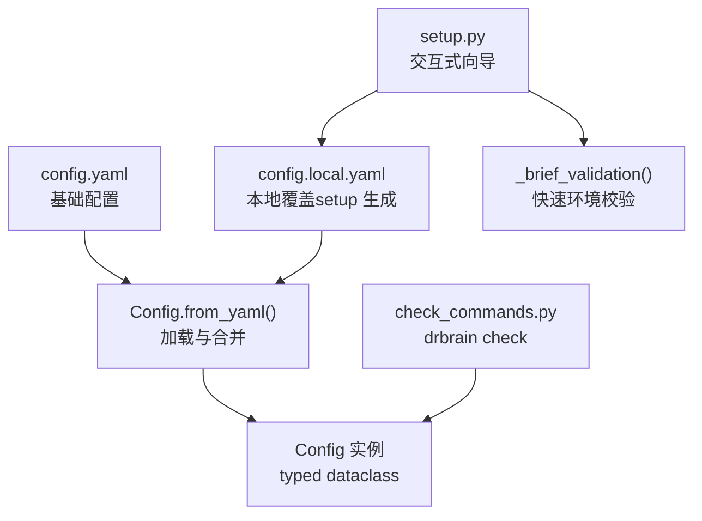
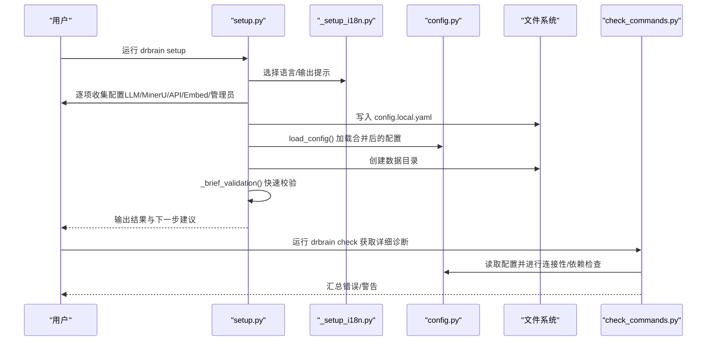
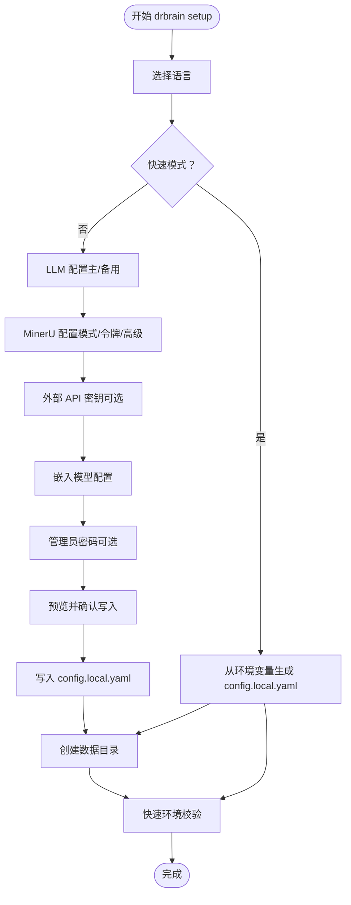
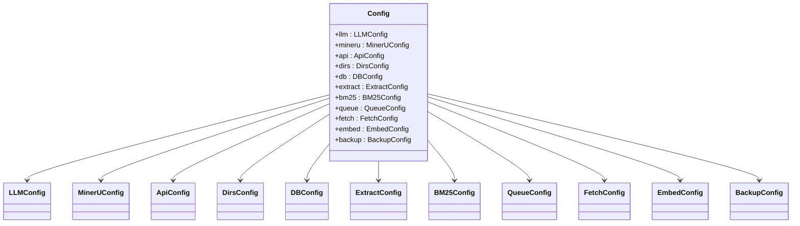
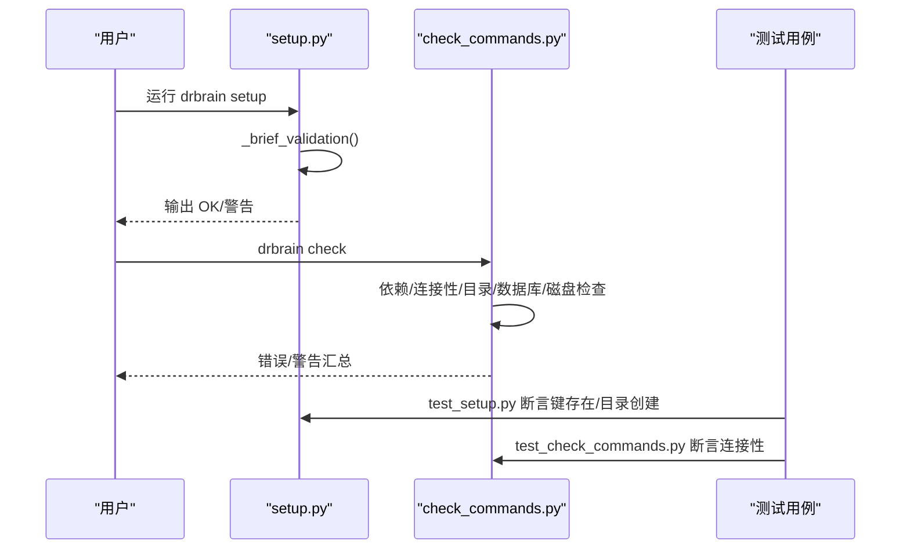
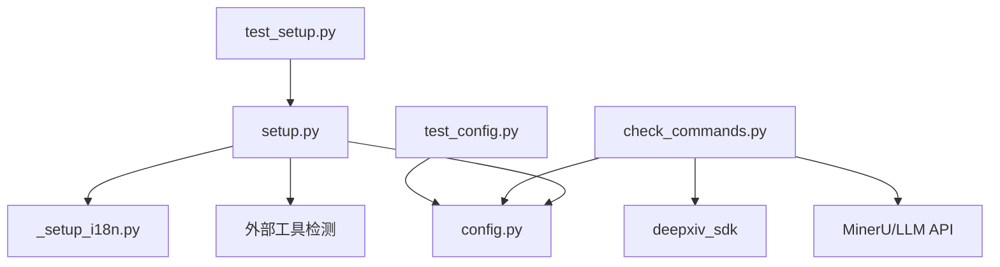

# 初始配置

<cite>
**本文引用的文件**
- [setup.py](file://src/drbrain/cli/setup.py)
- [_setup_i18n.py](file://src/drbrain/cli/_setup_i18n.py)
- [config.py](file://src/drbrain/config.py)
- [config.yaml](file://config.yaml)
- [config.example.yaml](file://config.example.yaml)
- [check_commands.py](file://src/drbrain/cli/check_commands.py)
- [auth.py](file://src/drbrain/auth.py)
- [test_setup.py](file://tests/test_setup.py)
- [test_config.py](file://tests/test_config.py)
</cite>

## 目录
1. [简介](#简介)
2. [项目结构](#项目结构)
3. [核心组件](#核心组件)
4. [架构总览](#架构总览)
5. [详细组件分析](#详细组件分析)
6. [依赖分析](#依赖分析)
7. [性能考虑](#性能考虑)
8. [故障排查指南](#故障排查指南)
9. [结论](#结论)
10. [附录](#附录)

## 简介
本指南面向首次部署 DrBrain 的用户，系统讲解 drbrain setup 命令的交互式配置流程，涵盖语言选择、LLM API 密钥、MinerU 令牌与高级参数、外部 API 密钥、嵌入模型配置、管理员密码设置等，并提供不同使用场景的推荐配置、配置文件结构说明、手动编辑方法以及配置验证与测试步骤，帮助您快速、安全地完成初始化配置。

## 项目结构
DrBrain 的配置体系由“基础配置”和“本地覆盖配置”两层构成：
- 基础配置：config.yaml，包含通用参数与占位符（如 ${ENV_VAR}），适合团队共享或版本控制。
- 本地覆盖：config.local.yaml，存放敏感信息（如 API 密钥、令牌），由 setup 向导生成，不纳入版本控制。
- 类型化配置加载：config.py 提供数据类与 YAML 加载器，支持深合并与环境变量解析。

图表来源
- [config.py:200-244](file://src/drbrain/config.py#L200-L244)
- [setup.py:119-188](file://src/drbrain/cli/setup.py#L119-L188)
- [check_commands.py:24-426](file://src/drbrain/cli/check_commands.py#L24-L426)

章节来源
- [config.yaml:1-72](file://config.yaml#L1-L72)
- [config.example.yaml:1-145](file://config.example.yaml#L1-L145)
- [config.py:182-292](file://src/drbrain/config.py#L182-L292)

## 核心组件
- 交互式配置向导：负责收集用户输入、生成 config.local.yaml、创建数据目录、执行快速环境校验。
- 国际化文案：统一英文/中文提示，贯穿整个 setup 流程。
- 配置加载器：从 YAML 读取、深合并本地覆盖、解析 ${ENV_VAR} 占位符。
- 环境检查：drbrain check 提供更全面的依赖、连接性与目录状态检查。
- 认证模块：支持为破坏性命令设置管理员密码，提升安全性。

章节来源
- [setup.py:207-588](file://src/drbrain/cli/setup.py#L207-L588)
- [_setup_i18n.py:6-342](file://src/drbrain/cli/_setup_i18n.py#L6-L342)
- [config.py:283-292](file://src/drbrain/config.py#L283-L292)
- [check_commands.py:24-426](file://src/drbrain/cli/check_commands.py#L24-L426)
- [auth.py:7-29](file://src/drbrain/auth.py#L7-L29)

## 架构总览
下图展示 setup 向导到配置加载与校验的整体流程：

图表来源
- [setup.py:207-588](file://src/drbrain/cli/setup.py#L207-L588)
- [_setup_i18n.py:6-342](file://src/drbrain/cli/_setup_i18n.py#L6-L342)
- [config.py:283-292](file://src/drbrain/config.py#L283-L292)
- [check_commands.py:24-426](file://src/drbrain/cli/check_commands.py#L24-L426)

## 详细组件分析

### 交互式配置向导（drbrain setup）
- 语言选择：支持 en/zh，所有提示语均来自国际化模块。
- 快速模式（--quick/-q）：从环境变量读取默认值，直接生成 config.local.yaml 并进行快速校验。
- 交互模式：分段引导用户填写以下内容：
  - LLM（主/备用模型）：提供商、模型名、API 密钥、Base URL。
  - MinerU：模式（flash/token）、令牌、高级参数（OCR、公式、表格解析）。
  - 外部 API：DeepXiv、Semantic Scholar、CrossRef、OpenAlex。
  - 嵌入模型：提供商（local/openai-compat/none）、模型、设备、缓存路径等。
  - 管理员密码（可选）：保护破坏性命令。
- 最终确认：汇总配置项，询问是否写入 config.local.yaml；随后创建数据目录并执行快速校验，最后可选择安装技能包。

图表来源
- [setup.py:207-588](file://src/drbrain/cli/setup.py#L207-L588)
- [_setup_i18n.py:6-342](file://src/drbrain/cli/_setup_i18n.py#L6-L342)

章节来源
- [setup.py:207-588](file://src/drbrain/cli/setup.py#L207-L588)
- [_setup_i18n.py:6-342](file://src/drbrain/cli/_setup_i18n.py#L6-L342)

### 配置文件结构与优先级
- config.yaml：基础配置模板，包含数据库、目录、API、BM25、提取并发、队列阈值、抓取策略、嵌入等参数；敏感值以 ${ENV_VAR} 形式占位。
- config.local.yaml：本地覆盖文件，由 setup 生成，优先级高于 config.yaml；适合存放密钥、令牌等敏感信息。
- 类型化配置：config.py 将 YAML 转换为 typed dataclass，支持深合并与环境变量解析，便于命令行与服务端稳定使用。

图表来源
- [config.py:44-193](file://src/drbrain/config.py#L44-L193)

章节来源
- [config.yaml:1-72](file://config.yaml#L1-L72)
- [config.example.yaml:1-145](file://config.example.yaml#L1-L145)
- [config.py:182-292](file://src/drbrain/config.py#L182-L292)

### 配置验证与测试
- 快速校验（setup 内部）：检查 Python 包、外部工具（MinerU CLI）、配置文件存在性、数据目录完整性。
- 详细诊断（drbrain check）：检查依赖、连接性（LLM、MinerU、DeepXiv）、目录、数据库、磁盘空间等，并给出错误/警告汇总。
- 测试保障：单元测试覆盖 generate_local_config 的键存在性、MinerU 模式行为、目录创建与校验逻辑。

图表来源
- [setup.py:119-188](file://src/drbrain/cli/setup.py#L119-L188)
- [check_commands.py:24-426](file://src/drbrain/cli/check_commands.py#L24-L426)
- [test_setup.py:9-159](file://tests/test_setup.py#L9-L159)

章节来源
- [setup.py:119-188](file://src/drbrain/cli/setup.py#L119-L188)
- [check_commands.py:24-426](file://src/drbrain/cli/check_commands.py#L24-L426)
- [test_setup.py:9-159](file://tests/test_setup.py#L9-L159)
- [test_config.py:98-129](file://tests/test_config.py#L98-L129)

## 依赖分析
- setup 依赖国际化模块输出提示，依赖 config 加载器读取最终配置，依赖外部工具检测（MinerU CLI）。
- check_commands 依赖 config 加载器、外部 SDK（如 deepxiv_sdk）、第三方 API（MinerU、LLM）进行连通性测试。
- 测试用例覆盖 setup 生成逻辑与 config 解析行为，保证回归质量。

图表来源
- [setup.py:119-188](file://src/drbrain/cli/setup.py#L119-L188)
- [check_commands.py:302-403](file://src/drbrain/cli/check_commands.py#L302-L403)
- [test_setup.py:9-159](file://tests/test_setup.py#L9-L159)
- [test_config.py:98-129](file://tests/test_config.py#L98-L129)

章节来源
- [setup.py:119-188](file://src/drbrain/cli/setup.py#L119-L188)
- [check_commands.py:302-403](file://src/drbrain/cli/check_commands.py#L302-L403)
- [test_setup.py:9-159](file://tests/test_setup.py#L9-L159)
- [test_config.py:98-129](file://tests/test_config.py#L98-L129)

## 性能考虑
- 嵌入模型：local 模式依赖 sentence-transformers，首次下载模型与缓存可能耗时；openai-compat 模式需网络请求与鉴权。
- PDF 解析：MinerU CLI 优先，若不可用则回退至 PyMuPDF；CLI 可显著提升解析质量与速度。
- 并发与限流：提取并发、抓取并发、S2 速率限制等参数可按硬件与服务配额调优。

## 故障排查指南
- 常见问题与定位
  - 缺少 Python 包：根据快速校验提示安装缺失依赖。
  - 外部工具缺失：MinerU CLI 未安装会回退到 PyMuPDF；建议安装以获得更好解析效果。
  - 配置文件缺失：确保 config.yaml 存在，config.local.yaml 由 setup 生成。
  - 目录不存在：setup 会自动创建；也可手动检查 data/* 路径权限。
  - 数据库未初始化：首次运行 ingest 才会创建数据库文件。
  - API 连接失败：检查 LLM/MinerU/DeepXiv 等密钥与网络连通性。
- 使用 drbrain check 获取详细诊断，查看错误/警告列表并逐项修复。

章节来源
- [setup.py:119-188](file://src/drbrain/cli/setup.py#L119-L188)
- [check_commands.py:24-426](file://src/drbrain/cli/check_commands.py#L24-L426)

## 结论
通过交互式配置向导与类型化配置加载，DrBrain 提供了清晰、可维护的初始化流程。建议在生产环境使用本地覆盖文件保存密钥与令牌，结合 drbrain check 进行持续验证，并根据实际硬件与服务配额调整并发与模型参数。

## 附录

### A. 交互式配置步骤详解
- 语言选择：en/zh，影响所有提示与帮助文本。
- LLM 配置
  - 主模型：提供商（openai/anthropic/ollama 等）、模型名、API 密钥、Base URL。
  - 备用模型：可选，用于主模型不可用时的降级。
- MinerU 配置
  - 模式：flash（免费版）、token（付费版）。
  - 令牌：token 模式必填，flash 模式留空。
  - 高级：OCR、公式、表格解析开关。
- 外部 API 密钥（可选）
  - DeepXiv、Semantic Scholar、CrossRef（邮箱用于礼貌池）、OpenAlex。
- 嵌入模型
  - 提供商：local（本地模型）、openai-compat（云端兼容接口）、none（禁用）。
  - 本地模型：如 Qwen/Qwen3-Embedding-0.6B。
  - 兼容接口：需提供模型名、API Base URL、API Key。
- 管理员密码（可选）
  - 保护破坏性命令，如清理数据目录等。

章节来源
- [setup.py:378-588](file://src/drbrain/cli/setup.py#L378-L588)
- [_setup_i18n.py:6-342](file://src/drbrain/cli/_setup_i18n.py#L6-L342)

### B. 不同使用场景的推荐配置
- 个人开发/小规模研究
  - LLM：主模型使用 gpt-4o 或 claude-sonnet-4-6；备用模型使用本地 Ollama（如 qwen2.5:7b）。
  - MinerU：flash 模式即可满足日常需求。
  - 嵌入：local 模式，模型可选 Qwen/Qwen3-Embedding-0.6B。
  - 外部 API：CrossRef 邮箱可选，OpenAlex 令牌可选。
- 生产/企业环境
  - LLM：主模型使用高吞吐提供商；备用模型使用自建 OpenAI 兼容服务。
  - MinerU：token 模式，开启 OCR、公式、表格解析。
  - 嵌入：openai-compat 模式，配置 API Base URL 与 Key。
  - 外部 API：配置 DeepXiv 与 S2 API Key，提高抓取与检索效率。
- 低资源/离线环境
  - LLM：本地 Ollama 或 vLLM；无需 API Key。
  - MinerU：flash 模式；如需更高精度，安装 PyMuPDF 作为回退。
  - 嵌入：local 模式，注意首次下载模型耗时。

### C. 配置文件结构说明与手动编辑
- 基础配置（config.yaml）
  - llm/mineru/db/dirs/api/bm25/extract/queue/fetch/embed 等字段。
  - 敏感值使用 ${ENV_VAR} 占位，避免提交到仓库。
- 本地覆盖（config.local.yaml）
  - 由 setup 自动生成，包含 llm/mineru/api/embed/admin 等敏感字段。
  - 优先级高于 config.yaml，适合团队内机密信息。
- 类型化配置（config.py）
  - Config.from_yaml() 支持深合并与环境变量解析，返回 typed dataclass。
  - 支持字典式访问（backward compatibility）与点式访问。

章节来源
- [config.yaml:1-72](file://config.yaml#L1-L72)
- [config.example.yaml:1-145](file://config.example.yaml#L1-L145)
- [config.py:182-292](file://src/drbrain/config.py#L182-L292)

### D. 快速校验与详细诊断
- 快速校验（setup 内部）
  - Python 包、外部工具（MinerU CLI）、配置文件存在性、数据目录完整性。
- 详细诊断（drbrain check）
  - 依赖包、外部工具、配置键、目录、数据库、磁盘空间、API 连接性等。
- 测试用例
  - test_setup.py：断言 generate_local_config 写入的键、MinerU 模式行为、目录创建。
  - test_config.py：断言 Config 默认值、环境变量解析、深合并行为。

章节来源
- [setup.py:119-188](file://src/drbrain/cli/setup.py#L119-L188)
- [check_commands.py:24-426](file://src/drbrain/cli/check_commands.py#L24-L426)
- [test_setup.py:9-159](file://tests/test_setup.py#L9-L159)
- [test_config.py:98-129](file://tests/test_config.py#L98-L129)

### E. 管理员密码与安全
- 设置管理员密码可保护破坏性命令（如清理数据目录）。
- 修改密码流程：--change-password 选项，先验证旧密码，再设置新密码并写入 config.local.yaml。

章节来源
- [setup.py:218-250](file://src/drbrain/cli/setup.py#L218-L250)
- [auth.py:7-29](file://src/drbrain/auth.py#L7-L29)