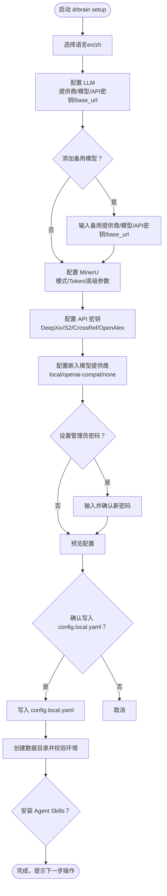

# 安装与配置

<cite>
**本文引用的文件列表**
- [README.md](file://README.md)
- [docs/getting-started.md](file://docs/getting-started.md)
- [docs/configuration.md](file://docs/configuration.md)
- [docs/troubleshooting.md](file://docs/troubleshooting.md)
- [config.example.yaml](file://config.example.yaml)
- [scripts/setup.sh](file://scripts/setup.sh)
- [src/drbrain/cli/setup.py](file://src/drbrain/cli/setup.py)
- [src/drbrain/cli/_setup_i18n.py](file://src/drbrain/cli/_setup_i18n.py)
- [src/drbrain/config.py](file://src/drbrain/config.py)
- [src/drbrain/cli/check_commands.py](file://src/drbrain/cli/check_commands.py)
- [src/drbrain/cli/main.py](file://src/drbrain/cli/main.py)
- [pyproject.toml](file://pyproject.toml)
</cite>

## 目录
1. [简介](#简介)
2. [系统要求与平台支持](#系统要求与平台支持)
3. [安装方式](#安装方式)
4. [首次配置：drbrain setup 交互式向导](#首次配置drbrain-setup-交互式向导)
5. [配置文件结构与关键项说明](#配置文件结构与关键项说明)
6. [数据目录与默认路径](#数据目录与默认路径)
7. [验证环境：drbrain check](#验证环境drbrain-check)
8. [常见问题与故障排除](#常见问题与故障排除)
9. [附录：CLI 命令速览](#附录cli-命令速览)

## 简介
本指南面向首次安装与配置 DrBrain 的用户，覆盖从源码安装到首次配置的完整流程，包括系统要求、依赖安装、环境配置、交互式向导、配置文件结构、平台差异以及常见问题排查。DrBrain 提供 CLI 工具，支持 macOS、Linux、Windows 平台；默认数据目录位于用户主目录下的 DrBrain 文件夹中。

章节来源
- [README.md:24-112](file://README.md#L24-L112)
- [docs/getting-started.md:1-253](file://docs/getting-started.md#L1-L253)

## 系统要求与平台支持
- Python 版本：3.12 或更高版本
- 操作系统：macOS、Linux、Windows（跨平台）
- Git：用于从源码安装
- 可选：Node.js（用于安装 Agent Skills）

章节来源
- [docs/getting-started.md:3-8](file://docs/getting-started.md#L3-L8)
- [pyproject.toml:7](file://pyproject.toml#L7)

## 安装方式
以下提供多种安装路径，推荐优先使用 uv 工具链以获得更一致的依赖管理体验。

- 使用 uv（推荐）
  - 克隆仓库并进入目录
  - 执行依赖同步与可编辑安装
  - 运行交互式配置向导
  - 示例命令：
    - git clone …
    - uv sync
    - uv pip install -e .
    - drbrain setup

- 使用 pip（不推荐作为隔离环境首选）
  - pip install drbrain（待发布）
  - 或在源码目录执行 pip install -e .

- 使用 pipx（推荐用于独立环境）
  - pipx install drbrain（待发布）

- 从源码安装（开发或快速试用）
  - git clone …
  - cd DrBrain
  - uv sync && uv pip install -e .
  - drbrain setup

- 为 AI Agent 安装技能（可选）
  - npx skills add https://github.com/UynajGI/DrBrain/skills

章节来源
- [README.md:26-41](file://README.md#L26-L41)
- [docs/getting-started.md:14-58](file://docs/getting-started.md#L14-L58)

## 首次配置：drbrain setup 交互式向导
drbrain setup 是一个交互式向导，会生成 config.local.yaml（本地覆盖与密钥存放位置），并初始化数据目录、验证环境。

- 语言选择
  - 支持英文（en）与中文（zh），输入 en 或 zh 即可切换。
- LLM 配置
  - 选择提供商（如 openai、anthropic、ollama 等）、模型名称、API 密钥、自定义 base_url。
  - 可添加备用模型（回退链），提升稳定性。
- MinerU PDF 解析器
  - 选择模式：flash（匿名/免费）或 token（付费/更高配额）。
  - 可配置高级参数：是否强制 OCR、是否解析公式与表格、最大页数阈值等。
- API 密钥
  - DeepXiv、Semantic Scholar（S2）、CrossRef 邮箱、OpenAlex Token（可选，提高速率限制）。
- 嵌入模型（Tree 检索）
  - 选择提供商：local（本地模型）、openai-compat（云端兼容接口）、none（禁用）。
  - local 模式需安装 sentence-transformers。
  - openai-compat 模式需配置模型名、API base、API key。
- 管理员密码（可选）
  - 保护高风险命令（如 clean --force）。
- 最终确认
  - 显示汇总信息，确认后写入 config.local.yaml，并创建数据目录，进行基础环境校验。
- 快速模式（--quick）
  - 从环境变量读取配置，跳过交互提示，直接生成 config.local.yaml。

图表来源
- [src/drbrain/cli/setup.py:207-588](file://src/drbrain/cli/setup.py#L207-L588)
- [src/drbrain/cli/_setup_i18n.py:1-342](file://src/drbrain/cli/_setup_i18n.py#L1-L342)

章节来源
- [README.md:93-99](file://README.md#L93-L99)
- [docs/getting-started.md:72-86](file://docs/getting-started.md#L72-L86)
- [src/drbrain/cli/setup.py:207-588](file://src/drbrain/cli/setup.py#L207-L588)
- [src/drbrain/cli/_setup_i18n.py:1-342](file://src/drbrain/cli/_setup_i18n.py#L1-L342)

## 配置文件结构与关键项说明
DrBrain 的配置采用三层合并策略（后覆盖优先）：
- config.yaml：基础模板（纳入版本控制）
- config.local.yaml：本地覆盖与密钥（gitignore）
- 环境变量：${VAR} 语法在加载时解析

核心配置模块与要点：
- LLM 模型
  - models 列表：第一个为主模型，后续为回退链。
  - provider、model、api_key、base_url 字段。
  - 支持 openai、anthropic、ollama、deepseek、zhipu、bailian、moonshot、minimax、vLLM、SGLang、local 等。
- MinerU
  - token、model、is_ocr、enable_formula、enable_table、max_pages。
  - 无 token 时使用 flash 模式（免费/匿名）。
- 数据库与目录
  - db.path：SQLite 路径（WAL 模式）。
  - dirs.inbox、pending、papers、reports、cache、logs：数据目录。
- 外部 API
  - deepxiv_token、s2_rate_limit、s2_api_key、cache_ttl、crossref_email、openalex_token。
- 搜索（BM25）
  - k1、b：词频饱和与文档长度归一化。
- 提取并发
  - extract.max_concurrent：实体抽取阶段最大并发。
- 嵌入（Tree 检索）
  - provider：local/openai-compat/none。
  - local：model、device、source、cache_dir、hf_endpoint、batch_size。
  - openai-compat：api_base、api_key、model、batch_size。
- 质量控制队列
  - queue.weak_threshold、auto_accept：置信度阈值。
- 备份（rsync）
  - backup.ssh_bin、rsync_bin、targets.<name>：host、user、path、port、identity_file、password、mode、compress、enabled、exclude。
- 获取 PDF（fetch）
  - max_concurrent、timeout_per_fetch、user_agent、fallback_order、unpaywall_email、institutional_proxy、proxy_type。

章节来源
- [docs/configuration.md:5-18](file://docs/configuration.md#L5-L18)
- [docs/configuration.md:21-75](file://docs/configuration.md#L21-L75)
- [docs/configuration.md:78-100](file://docs/configuration.md#L78-L100)
- [docs/configuration.md:103-115](file://docs/configuration.md#L103-L115)
- [docs/configuration.md:118-138](file://docs/configuration.md#L118-L138)
- [docs/configuration.md:141-161](file://docs/configuration.md#L141-L161)
- [docs/configuration.md:164-176](file://docs/configuration.md#L164-L176)
- [docs/configuration.md:179-191](file://docs/configuration.md#L179-L191)
- [docs/configuration.md:194-247](file://docs/configuration.md#L194-L247)
- [docs/configuration.md:250-264](file://docs/configuration.md#L250-L264)
- [docs/configuration.md:267-303](file://docs/configuration.md#L267-L303)
- [docs/configuration.md:306-328](file://docs/configuration.md#L306-L328)
- [docs/configuration.md:331-342](file://docs/configuration.md#L331-L342)
- [config.example.yaml:1-145](file://config.example.yaml#L1-L145)
- [src/drbrain/config.py:182-292](file://src/drbrain/config.py#L182-L292)

## 数据目录与默认路径
默认数据根目录为用户主目录下的 DrBrain 文件夹，不同平台路径如下：
- Linux/macOS：~/DrBrain/
- Windows：%USERPROFILE%\DrBrain\

内部子目录（默认）：
- data/spool/inbox：等待处理的 PDF
- data/spool/pending：失败的 PDF
- data/papers：每篇论文的目录（含 source.pdf、raw.md、tree.json、images/）
- data/drbrain.db：知识图谱数据库（SQLite，WAL）
- data/metrics.db：LLM 调用与行为统计
- data/cache：API 缓存（可安全删除）
- data/reports：JSON 分析报告
- data/backups：tar.gz 备份
- data/citation_styles：自定义引用样式
- data/explore/<name>：发现集合（silo.json + papers.jsonl）
- data/proceedings.json：会议记录
- workspace/<name>：工作区（workspace.yaml + refs/papers.json）

章节来源
- [docs/getting-started.md:60-71](file://docs/getting-started.md#L60-L71)
- [docs/getting-started.md:224-242](file://docs/getting-started.md#L224-L242)

## 验证环境：drbrain check
drbrain check 用于诊断依赖、外部工具、配置与网络连通性，输出分组如下：
- Python 包：pymupdf、litellm、typer、rich、pyyaml、pydantic 等
- 外部工具：mineru-open-api（PDF 解析 CLI）、PyMuPDF（备选）
- 配置文件：config.yaml、config.local.yaml 存在性与关键字段（LLM、MinerU、CrossRef、OpenAlex、嵌入）
- 目录：data/* 子目录是否存在或自动创建
- 数据库：db.path 是否存在
- 库规模：统计论文与概念数量
- 磁盘空间：data/ 剩余空间
- API 连通性：MinerU API、DeepXiv、LLM API
- 总结：错误与警告汇总

章节来源
- [docs/getting-started.md:217-222](file://docs/getting-started.md#L217-L222)
- [src/drbrain/cli/check_commands.py:24-427](file://src/drbrain/cli/check_commands.py#L24-L427)

## 常见问题与故障排除
- 模块未找到（ModuleNotFoundError: No module named 'drbrain'）
  - 未执行可编辑安装。在 uv sync 后执行 uv pip install -e .。
- 命令未找到（drbrain: command not found）
  - 确认已安装 CLI 并在 PATH 中可见（uv pip install -e . 后检查 which drbrain）。
- 未运行 setup 导致配置缺失
  - 复制模板为 config.yaml，再运行 drbrain setup --quick。
- PDF 解析失败
  - MinerU 不可达：检查 mineru.token 与网络；若无 token，将回退至 PyMuPDF。
  - PDF 加密/损坏：先移除 DRM 或修复；drbrain check 默认包含 PDF 校验。
  - 解析成功但内容为空：查看 data/papers/<id>/raw.md 与日志 data/logs/drbrain.log；尝试开启 OCR。
- LLM API 失败/超时
  - 使用 drbrain check 检查 LLM 连通性；核对 llm.models 配置与 API 密钥；必要时增加超时。
  - 速率限制（429）：增加备用模型、降低并发、调低 S2 请求频率或添加 S2 API Key。
  - LLM 返回 JSON 解析异常：更换模型或切换到云模型。
- 数据库锁定
  - SQLite WAL 模式应避免锁冲突；若仍出现，检查是否有进程持有写锁；不要删除 WAL/SHM 文件。
- 嵌入模型下载卡住/显存不足
  - local 模式：切换下载源（modelscope/huggingface），或设置 device: cpu；GPU OOM 时减小 batch_size。
  - openai-compat：确保 api_base 以 /v1 结尾，检查 api_key。
  - 维度不匹配：切换模型后需重新训练向量（drbrain embed --tree）。
- 工作区不存在/重命名失败
  - 使用 drbrain ws list/show 检查；工作区名称需为合法目录名。
- 日志定位与调试
  - 应用日志：data/logs/drbrain.log；会话 ID：UUID4；LLM 计费：data/metrics.db；API 缓存：data/cache/。
  - 提升日志级别：设置 LOGURU_LEVEL=DEBUG 再运行命令。
- 恢复与重建
  - 备份：drbrain backup；恢复：解压 tar.gz。
  - 重建索引：drbrain index。
  - 重置：drbrain clean（需管理员密码），随后 drbrain setup --quick 与 drbrain index。

章节来源
- [docs/troubleshooting.md:5-198](file://docs/troubleshooting.md#L5-L198)
- [src/drbrain/cli/check_commands.py:24-427](file://src/drbrain/cli/check_commands.py#L24-L427)

## 附录：CLI 命令速览
- 初始化与配置
  - drbrain setup [--quick]：交互式配置，生成 config.local.yaml，创建目录，校验环境
  - drbrain check：环境诊断与 API 连通性检查
- 管道与处理
  - drbrain ingest：解析 PDF、提取元数据、构建章节树
  - drbrain build：概念与关系抽取（多阶段）
  - drbrain embed --tree：训练树节点文本嵌入
  - drbrain closure：符号推理闭包（可混合）
  - drbrain pipeline --preset full/quick：一键全流程
- 查询与分析
  - drbrain query：关键词 BM25 检索，支持图增强与过滤
  - drbrain analyze：知识前沿分析（种子、因果链、假设等）
  - drbrain reason：基于知识图谱的自然语言问答
- 导出与备份
  - drbrain export：导出为 BibTeX/RIS/Markdown
  - drbrain backup：本地压缩备份
- 维护与审计
  - drbrain audit：数据质量扫描
  - drbrain clean：清理数据目录（需管理员密码）

章节来源
- [src/drbrain/cli/main.py:77-147](file://src/drbrain/cli/main.py#L77-L147)
- [docs/getting-started.md:88-210](file://docs/getting-started.md#L88-L210)