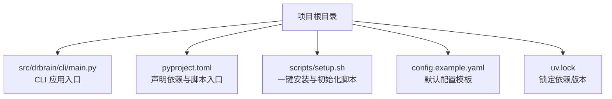
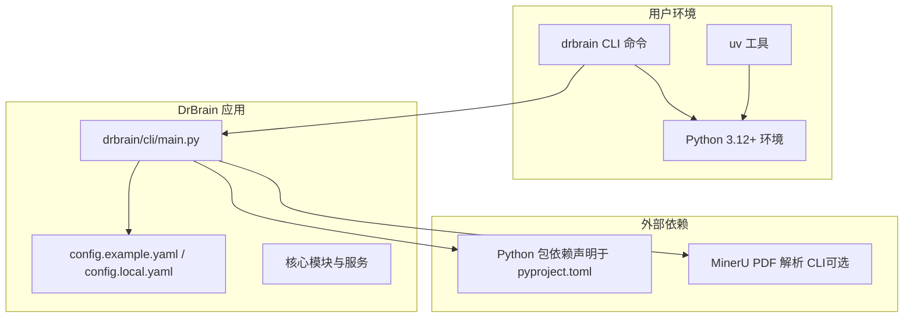

# 安装方法

<cite>
**本文引用的文件**
- [README.md](file://README.md)
- [docs/getting-started.md](file://docs/getting-started.md)
- [docs/troubleshooting.md](file://docs/troubleshooting.md)
- [docs/configuration.md](file://docs/configuration.md)
- [pyproject.toml](file://pyproject.toml)
- [scripts/setup.sh](file://scripts/setup.sh)
- [config.example.yaml](file://config.example.yaml)
- [src/drbrain/cli/check_commands.py](file://src/drbrain/cli/check_commands.py)
- [uv.lock](file://uv.lock)
</cite>

## 目录
1. [简介](#简介)
2. [项目结构与入口](#项目结构与入口)
3. [核心安装方式概览](#核心安装方式概览)
4. [架构总览](#架构总览)
5. [详细安装方式解析](#详细安装方式解析)
6. [依赖与环境要求](#依赖与环境要求)
7. [安装验证与常见问题排查](#安装验证与常见问题排查)
8. [性能与最佳实践建议](#性能与最佳实践建议)
9. [结论](#结论)
10. [附录：环境变量与配置要点](#附录环境变量与配置要点)

## 简介
本章节面向首次接触 DrBrain 的用户，提供从零开始的安装方法与注意事项。DrBrain 是一个面向学术研究的知识图谱系统，具备符号驱动的推理能力与轻量级向量检索，支持通过 CLI 完成论文入库、概念抽取、知识图谱构建、检索与分析等全流程。

## 项目结构与入口
- 项目以 CLI 工具为主，命令入口由项目元数据定义，安装后可通过命令直接运行。
- 源码位于 src/drbrain，CLI 入口在 drbrain/cli/main.py；同时提供兼容的旧版入口 main.py。
- 项目使用 uv 作为依赖与虚拟环境管理工具，并通过 pyproject.toml 声明依赖与脚本入口。

图表来源
- [pyproject.toml:69-70](file://pyproject.toml#L69-L70)
- [main.py:1-6](file://main.py#L1-L6)
- [scripts/setup.sh:1-24](file://scripts/setup.sh#L1-L24)
- [config.example.yaml:1-145](file://config.example.yaml#L1-L145)
- [uv.lock:392-457](file://uv.lock#L392-L457)

章节来源
- [pyproject.toml:69-70](file://pyproject.toml#L69-L70)
- [main.py:1-6](file://main.py#L1-L6)
- [scripts/setup.sh:1-24](file://scripts/setup.sh#L1-L24)
- [config.example.yaml:1-145](file://config.example.yaml#L1-L145)
- [uv.lock:392-457](file://uv.lock#L392-L457)

## 核心安装方式概览
- 源码安装（推荐用于开发或需要最新功能）
  - 使用 uv 同步依赖并进行可编辑安装，随后执行交互式初始化。
- 包管理器安装（推荐用于日常使用）
  - pipx 或 uv tool 安装，创建隔离环境，避免污染系统 Python。
- Docker 安装（可选）
  - 可通过容器化方式运行 DrBrain，便于在受限环境中快速部署。
- 依赖安装与外部工具
  - 脚本会自动安装 Python 依赖，并尝试安装 MinerU PDF 解析 CLI（可选）。

章节来源
- [README.md:24-36](file://README.md#L24-L36)
- [docs/getting-started.md:9-42](file://docs/getting-started.md#L9-L42)
- [scripts/setup.sh:6-19](file://scripts/setup.sh#L6-L19)

## 架构总览
下图展示了 DrBrain 的安装与运行关系：CLI 命令通过入口脚本调用应用逻辑，应用依赖 Python 包与外部工具（如 MinerU），并通过配置文件进行行为控制。

图表来源
- [pyproject.toml:32-51](file://pyproject.toml#L32-L51)
- [pyproject.toml:69-70](file://pyproject.toml#L69-L70)
- [config.example.yaml:1-145](file://config.example.yaml#L1-L145)
- [scripts/setup.sh:6-19](file://scripts/setup.sh#L6-L19)

## 详细安装方式解析

### 方式一：源码安装（uv sync && uv pip install -e .）
- 适用场景
  - 需要使用最新代码或参与开发
  - 希望在本地进行调试与修改
- 步骤
  - 克隆仓库并进入目录
  - 执行依赖同步与可编辑安装
  - 运行交互式初始化
- 优点
  - 最新功能与修复即时可用
  - 便于贡献与二次开发
- 缺点
  - 需要手动处理依赖与外部工具
  - 不如包管理器安装便捷
- 注意事项
  - 安装后需执行初始化以生成配置与数据目录
  - 如需高质量 PDF 解析，建议安装 MinerU CLI

章节来源
- [README.md:26-31](file://README.md#L26-L31)
- [docs/getting-started.md:35-42](file://docs/getting-started.md#L35-L42)
- [scripts/setup.sh:6-19](file://scripts/setup.sh#L6-L19)

### 方式二：包管理器安装（pipx、uv tool）
- 适用场景
  - 日常使用 DrBrain，希望获得隔离环境与便捷升级
- 步骤
  - 使用 pipx 或 uv tool 安装 DrBrain
  - 运行交互式初始化
- 优点
  - 隔离性强，不污染系统 Python
  - 升级与卸载方便
- 缺点
  - 当前尚未上架官方渠道（文档中注明“beta 未上线”）
  - 需要网络可达安装源
- 注意事项
  - 若安装源不可达，可考虑源码安装回退方案

章节来源
- [docs/getting-started.md:11-33](file://docs/getting-started.md#L11-L33)
- [README.md:33-35](file://README.md#L33-L35)

### 方式三：Docker 安装（可选）
- 适用场景
  - 在受限环境或需要完全隔离的场景部署 DrBrain
- 步骤
  - 使用容器镜像运行 DrBrain CLI
  - 挂载数据卷以持久化知识库与缓存
- 优点
  - 环境隔离彻底，跨平台一致
  - 易于迁移与备份
- 缺点
  - 需要 Docker 环境
  - 外部工具（如 MinerU CLI）需在容器内单独安装或通过卷挂载
- 注意事项
  - 确保容器内可访问外部 API（如 LLM、学术数据库）
  - 数据持久化路径需映射到宿主机

章节来源
- [docs/getting-started.md:44-58](file://docs/getting-started.md#L44-L58)

### 依赖安装与外部工具
- Python 依赖
  - 通过 uv 同步依赖，确保版本与锁定文件一致
- 外部工具
  - MinerU PDF 解析 CLI（可选）：脚本会尝试自动安装，若失败可手动安装
- 环境变量
  - 配置文件支持从环境变量读取敏感信息（如 API Key）

章节来源
- [scripts/setup.sh:6-19](file://scripts/setup.sh#L6-L19)
- [config.example.yaml:6-7](file://config.example.yaml#L6-L7)
- [docs/configuration.md:13-14](file://docs/configuration.md#L13-L14)

## 依赖与环境要求
- Python 版本
  - 项目要求 Python 3.12+
- 关键依赖
  - LLM 接入：litellm
  - PDF 解析：pymupdf（内置）、pymupdf4llm（内置）、mineru-open-api（可选）
  - 检索与图计算：rank-bm25、networkx、scikit-learn、umap-learn
  - CLI 与配置：typer、pyyaml、pydantic、rich、loguru
- 可选依赖
  - 办公文档支持：python-docx、python-pptx、openpyxl
- 依赖锁定
  - 通过 uv.lock 固定版本，保证一致性

章节来源
- [pyproject.toml:32-51](file://pyproject.toml#L32-L51)
- [pyproject.toml:53-54](file://pyproject.toml#L53-L54)
- [uv.lock:392-457](file://uv.lock#L392-L457)

## 安装验证与常见问题排查

### 安装验证步骤
- 基础检查
  - 使用诊断命令检查 Python 包与外部工具是否就绪
- 初始化与配置
  - 运行初始化向导生成配置与数据目录
- 环境健康度
  - 使用检查命令验证 LLM 连接、API 可达性与缓存状态

章节来源
- [docs/getting-started.md:217-222](file://docs/getting-started.md#L217-L222)
- [src/drbrain/cli/check_commands.py:30-64](file://src/drbrain/cli/check_commands.py#L30-L64)

### 常见问题与解决方案
- 模块未找到
  - 可能是可编辑安装缺失，需重新执行可编辑安装
- 命令未找到
  - 检查 CLI 是否正确安装并处于 PATH 中
- 配置缺失
  - 通过初始化向导生成本地配置文件
- PDF 解析异常
  - MinerU 不可达时自动回退至内置解析；若解析结果为空，检查日志并调整 OCR 设置
- LLM 连接失败
  - 使用检查命令验证连接，确认 API Key 与网络可达性
- 数据库锁或迁移错误
  - 检查进程占用与 WAL 文件状态，必要时恢复备份

章节来源
- [docs/troubleshooting.md:7-32](file://docs/troubleshooting.md#L7-L32)
- [docs/troubleshooting.md:38-58](file://docs/troubleshooting.md#L38-L58)
- [docs/troubleshooting.md:61-84](file://docs/troubleshooting.md#L61-L84)
- [docs/troubleshooting.md:89-104](file://docs/troubleshooting.md#L89-L104)

## 性能与最佳实践建议
- 优先使用隔离安装（pipx/uv tool），避免全局污染
- 在生产环境建议固定版本并配合依赖锁定
- 对于大体量 PDF 处理，合理设置并发与缓存策略
- 定期备份知识库与配置，以便快速恢复

[本节为通用建议，无需特定文件引用]

## 结论
- 源码安装适合开发者与需要最新功能的用户
- 包管理器安装适合日常使用，具备良好的隔离性与可维护性
- Docker 安装适合需要完全隔离与跨平台一致性的场景
- 安装后务必完成初始化与基础检查，确保 LLM、PDF 解析与外部 API 正常工作

[本节为总结性内容，无需特定文件引用]

## 附录：环境变量与配置要点
- 环境变量读取
  - 配置文件支持以占位符形式从环境变量注入敏感信息
- 关键配置项
  - LLM 提供商与模型列表、API Key、Base URL
  - MinerU Token、模型类型、OCR 开关、表格/公式解析开关
  - 数据目录、缓存 TTL、搜索参数、提取并发数、嵌入模型与设备选择
- 初始化流程
  - 自动生成本地配置文件，创建数据目录，可选安装技能包

章节来源
- [docs/configuration.md:13-14](file://docs/configuration.md#L13-L14)
- [config.example.yaml:12-66](file://config.example.yaml#L12-L66)
- [config.example.yaml:67-121](file://config.example.yaml#L67-L121)
- [docs/getting-started.md:72-86](file://docs/getting-started.md#L72-L86)