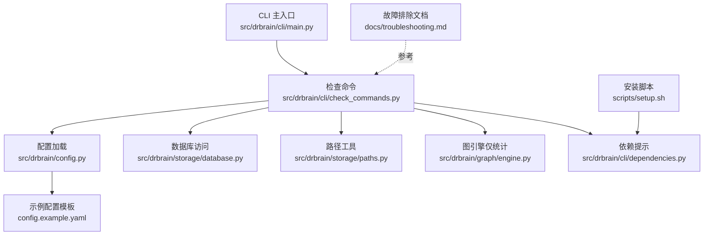
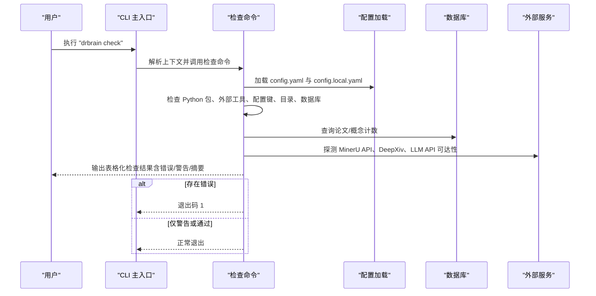
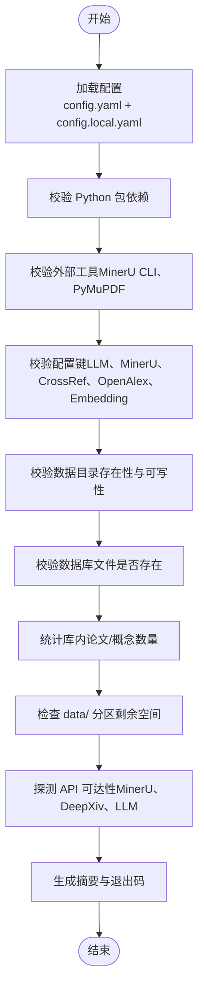
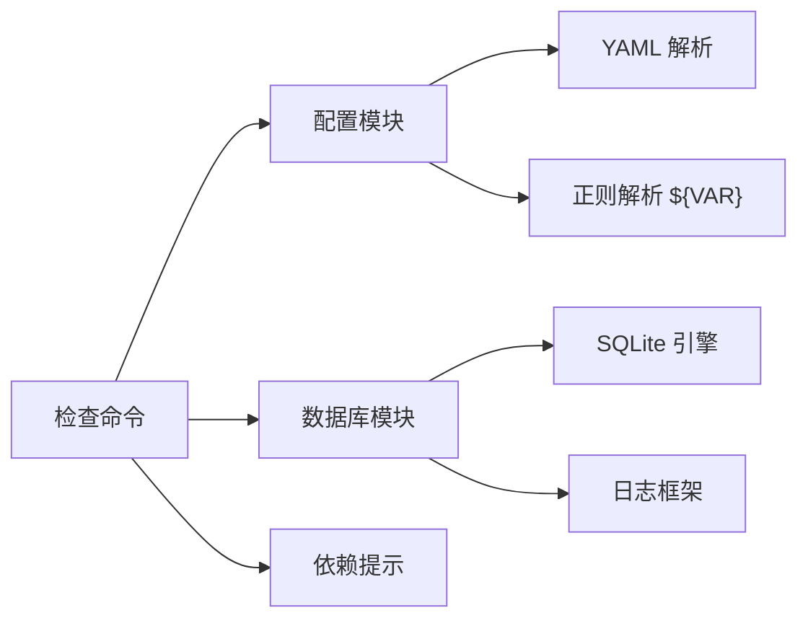

# 环境验证

<cite>
**本文引用的文件**
- [check_commands.py](file://src/drbrain/cli/check_commands.py)
- [main.py](file://src/drbrain/cli/main.py)
- [config.py](file://src/drbrain/config.py)
- [database.py](file://src/drbrain/storage/database.py)
- [paths.py](file://src/drbrain/storage/paths.py)
- [engine.py](file://src/drbrain/graph/engine.py)
- [config.example.yaml](file://config.example.yaml)
- [dependencies.py](file://src/drbrain/cli/dependencies.py)
- [setup.sh](file://scripts/setup.sh)
- [troubleshooting.md](file://docs/troubleshooting.md)
- [exceptions.py](file://src/drbrain/exceptions.py)
</cite>

## 目录
1. [简介](#简介)
2. [项目结构](#项目结构)
3. [核心组件](#核心组件)
4. [架构总览](#架构总览)
5. [详细组件分析](#详细组件分析)
6. [依赖分析](#依赖分析)
7. [性能考虑](#性能考虑)
8. [故障排除指南](#故障排除指南)
9. [结论](#结论)
10. [附录](#附录)

## 简介
本指南面向 DrBrain 用户与运维人员，系统讲解如何使用 drbrain check 命令进行环境验证，确保安装与配置正确、依赖齐全、API 可连通、存储可用且空间充足。文档覆盖检查项的含义、常见问题的诊断与修复步骤，并提供自动化脚本与手动验证方法，帮助快速定位并解决问题。

## 项目结构
DrBrain 的 CLI 入口在主模块中注册命令；check 命令的具体逻辑集中在检查命令模块；配置加载由配置模块负责；数据库与图引擎用于读取库内数据与统计信息；示例配置文件提供默认模板与字段说明；故障排除文档汇总了常见问题与解决路径。

图表来源
- [main.py](file://src/drbrain/cli/main.py)
- [check_commands.py](file://src/drbrain/cli/check_commands.py)
- [config.py](file://src/drbrain/config.py)
- [database.py](file://src/drbrain/storage/database.py)
- [paths.py](file://src/drbrain/storage/paths.py)
- [engine.py](file://src/drbrain/graph/engine.py)
- [config.example.yaml](file://config.example.yaml)
- [dependencies.py](file://src/drbrain/cli/dependencies.py)
- [setup.sh](file://scripts/setup.sh)
- [troubleshooting.md](file://docs/troubleshooting.md)

章节来源
- [main.py](file://src/drbrain/cli/main.py)
- [check_commands.py](file://src/drbrain/cli/check_commands.py)
- [config.py](file://src/drbrain/config.py)
- [config.example.yaml](file://config.example.yaml)

## 核心组件
- 检查命令模块：集中执行所有验证逻辑，输出表格化报告，收集错误与警告，最终根据错误数量决定退出码。
- 配置模块：加载 config.yaml 与 config.local.yaml，解析环境变量占位符，提供类型化配置对象。
- 数据库模块：提供 SQLite 访问、表结构初始化与迁移、查询统计（如论文数、概念数）。
- 图引擎：用于加载知识图谱边到内存，支持后续分析命令；在 check 中仅用于统计库内条目。
- 路径工具：统一管理 per-paper 目录布局，辅助检查输出。
- 示例配置：提供字段说明与默认值，指导用户填写密钥与路径。
- 依赖提示：为缺失的可选依赖提供安装建议。
- 安装脚本：一键安装 Python 依赖与 MinerU CLI。
- 故障排除：汇总常见问题与修复步骤。

章节来源
- [check_commands.py](file://src/drbrain/cli/check_commands.py)
- [config.py](file://src/drbrain/config.py)
- [database.py](file://src/drbrain/storage/database.py)
- [paths.py](file://src/drbrain/storage/paths.py)
- [engine.py](file://src/drbrain/graph/engine.py)
- [config.example.yaml](file://config.example.yaml)
- [dependencies.py](file://src/drbrain/cli/dependencies.py)
- [setup.sh](file://scripts/setup.sh)
- [troubleshooting.md](file://docs/troubleshooting.md)

## 架构总览
下图展示 drbrain check 命令从调用到输出的端到端流程，以及与配置、数据库、外部 API 的交互。

图表来源
- [main.py](file://src/drbrain/cli/main.py)
- [check_commands.py](file://src/drbrain/cli/check_commands.py)
- [config.py](file://src/drbrain/config.py)
- [database.py](file://src/drbrain/storage/database.py)

## 详细组件分析

### 检查命令工作流
检查命令按模块分组执行，逐项验证并汇总结果。主要流程如下：

图表来源
- [check_commands.py](file://src/drbrain/cli/check_commands.py)

章节来源
- [check_commands.py](file://src/drbrain/cli/check_commands.py)

### 配置加载与解析
- 优先级：config.local.yaml > config.yaml > 环境变量占位符。
- 支持递归解析 ${ENV_VAR} 占位符，未知变量将被替换为空字符串。
- 类型化配置对象提供字段访问与向后兼容的字典接口。

章节来源
- [config.py](file://src/drbrain/config.py)
- [config.example.yaml](file://config.example.yaml)

### 数据库与库统计
- 初始化时自动创建表与索引，必要时执行迁移。
- 统计 papers 与 concepts 数量，用于检查库是否已初始化或已有内容。
- 提供 WAL 模式与外键约束，提升并发与一致性。

章节来源
- [database.py](file://src/drbrain/storage/database.py)

### 外部 API 连接性检查
- MinerU API：若配置 token，则发起状态请求以验证可达性与配额状态。
- MinerU CLI：检测全局可执行文件，若不可用则回退至 PyMuPDF。
- DeepXiv：若配置 token，则尝试简短查询以验证服务可用性。
- LLM API：遍历配置中的模型列表，逐一发起轻量请求以验证鉴权与网络。

章节来源
- [check_commands.py](file://src/drbrain/cli/check_commands.py)

### 目录与磁盘空间检查
- 默认目录：inbox、pending、papers、reports、cache、logs。
- 若目录不存在则自动创建；若不可写则记录警告。
- 检查 data/ 分区剩余空间，低于阈值给出警告。

章节来源
- [check_commands.py](file://src/drbrain/cli/check_commands.py)
- [paths.py](file://src/drbrain/storage/paths.py)

### 结果解读与退出策略
- 错误：导致命令以非零退出码终止，需立即修复。
- 警告：不影响使用，但建议尽快处理（如补齐 API 密钥、安装缺失依赖）。
- 通过：所有检查项均通过，可正常使用 DrBrain。

章节来源
- [check_commands.py](file://src/drbrain/cli/check_commands.py)

## 依赖分析
- 检查命令直接依赖配置加载、数据库访问、外部 API 与系统工具。
- 配置模块依赖 YAML 解析与正则表达式进行环境变量解析。
- 数据库模块依赖 SQLite 与日志框架。
- 图引擎在检查中不直接参与，仅在分析命令中使用。
- 依赖提示模块提供缺失包的安装建议，便于自动化修复。

图表来源
- [check_commands.py](file://src/drbrain/cli/check_commands.py)
- [config.py](file://src/drbrain/config.py)
- [database.py](file://src/drbrain/storage/database.py)
- [dependencies.py](file://src/drbrain/cli/dependencies.py)

章节来源
- [check_commands.py](file://src/drbrain/cli/check_commands.py)
- [config.py](file://src/drbrain/config.py)
- [database.py](file://src/drbrain/storage/database.py)
- [dependencies.py](file://src/drbrain/cli/dependencies.py)

## 性能考虑
- 检查命令以“最小代价”验证为主，避免长耗时操作。
- API 可达性测试采用短连接与短超时，减少阻塞。
- 目录与磁盘检查为本地 IO，开销极低。
- 建议在 CI 或部署流水线中定期运行检查，尽早发现环境问题。

## 故障排除指南
以下为常见问题与修复步骤，结合检查命令输出与故障排除文档：

- Python 包缺失
  - 现象：Python Packages 表格中显示缺失。
  - 修复：参考依赖提示安装缺失包，或使用安装脚本一键安装。
  - 参考：依赖提示模块与安装脚本。

- 外部工具缺失
  - 现象：MinerU CLI 未找到，回退至 PyMuPDF。
  - 修复：安装 MinerU CLI 或确保 PyMuPDF 可用。
  - 参考：安装脚本与检查命令中的工具检测。

- 配置文件缺失或键未设置
  - 现象：配置文件未找到、API 密钥未设置、Embedding provider 未配置。
  - 修复：复制示例配置并填写密钥，或使用环境变量占位符。
  - 参考：示例配置模板与配置加载逻辑。

- 目录不可写或不存在
  - 现象：目录创建失败或显示缺失。
  - 修复：赋予写权限或手动创建目录。
  - 参考：检查命令中的目录校验。

- 数据库文件不存在
  - 现象：数据库文件未创建。
  - 修复：先执行导入或初始化流程后再检查。
  - 参考：数据库模块初始化与迁移。

- 磁盘空间不足
  - 现象：data/ 分区剩余空间过低。
  - 修复：清理缓存或释放空间。
  - 参考：检查命令中的磁盘空间检测。

- API 不可达
  - 现象：MinerU API、DeepXiv、LLM API 显示不可达。
  - 修复：检查 token、网络、速率限制；必要时更换备用模型或服务。
  - 参考：检查命令中的 API 探测与故障排除文档。

- 日志定位
  - 现象：需要更详细的错误信息。
  - 修复：查看应用日志与会话 ID，或提高日志级别。
  - 参考：故障排除文档中的日志位置与调试方法。

章节来源
- [check_commands.py](file://src/drbrain/cli/check_commands.py)
- [dependencies.py](file://src/drbrain/cli/dependencies.py)
- [setup.sh](file://scripts/setup.sh)
- [config.example.yaml](file://config.example.yaml)
- [troubleshooting.md](file://docs/troubleshooting.md)

## 结论
drbrain check 命令提供了系统化的环境验证能力，覆盖 Python 依赖、外部工具、配置键、目录与磁盘、数据库与库统计、以及各类外部 API 的连通性。通过清晰的结果分类与丰富的修复建议，用户可以快速定位并解决环境问题，确保 DrBrain 的稳定运行。

## 附录

### 使用 drbrain check 的完整流程
- 准备阶段
  - 确保已安装 DrBrain 并完成基础配置。
  - 如需安装依赖与 MinerU CLI，可运行安装脚本。
- 执行检查
  - 在项目根目录执行检查命令，观察输出表格与摘要。
- 问题修复
  - 根据错误/警告逐项修复，必要时参考故障排除文档。
- 再次验证
  - 修复后重新运行检查，直至全部通过。

章节来源
- [setup.sh](file://scripts/setup.sh)
- [check_commands.py](file://src/drbrain/cli/check_commands.py)
- [troubleshooting.md](file://docs/troubleshooting.md)