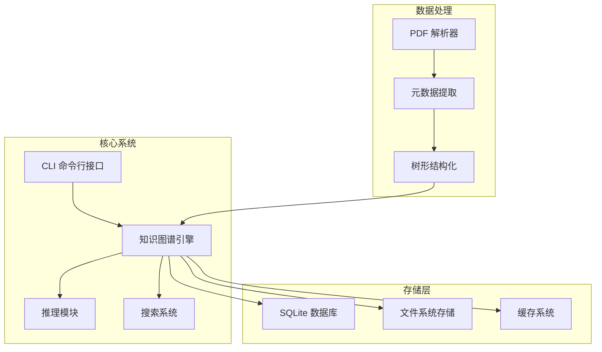
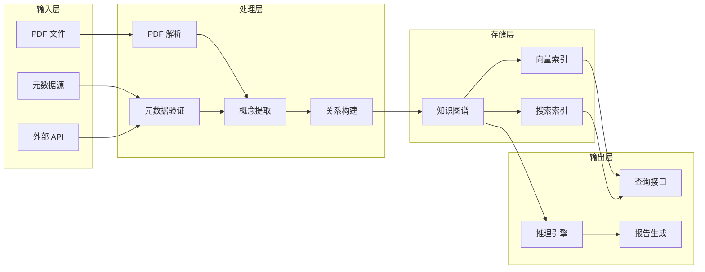
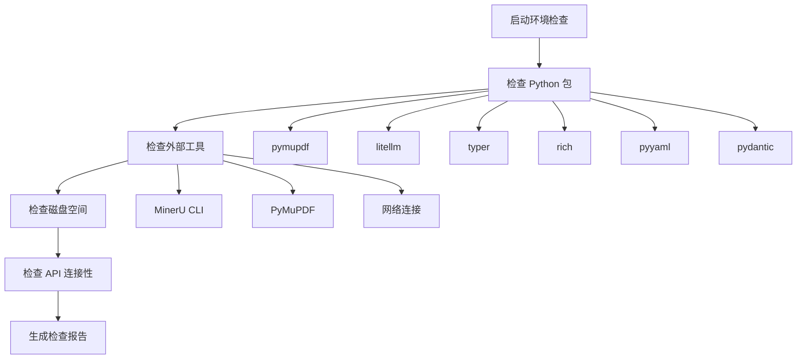
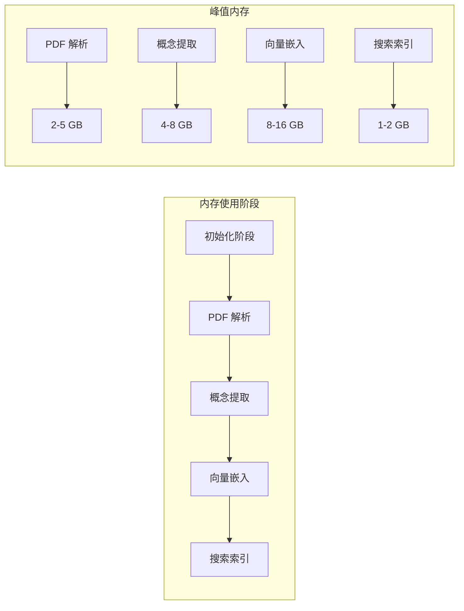

# 系统要求

<cite>
**本文档引用的文件**
- [pyproject.toml](file://pyproject.toml)
- [README.md](file://README.md)
- [config.example.yaml](file://config.example.yaml)
- [uv.lock](file://uv.lock)
- [scripts/setup.sh](file://scripts/setup.sh)
- [docs/getting-started.md](file://docs/getting-started.md)
- [docs/configuration.md](file://docs/configuration.md)
- [docs/architecture.md](file://docs/architecture.md)
- [docs/troubleshooting.md](file://docs/troubleshooting.md)
- [src/drbrain/cli/check_commands.py](file://src/drbrain/cli/check_commands.py)
- [src/drbrain/services/embedding.py](file://src/drbrain/services/embedding.py)
- [tests/test_services_embedding.py](file://tests/test_services_embedding.py)
</cite>

## 目录
1. [简介](#简介)
2. [项目结构](#项目结构)
3. [核心组件](#核心组件)
4. [架构概览](#架构概览)
5. [详细组件分析](#详细组件分析)
6. [依赖关系分析](#依赖关系分析)
7. [性能考虑](#性能考虑)
8. [故障排除指南](#故障排除指南)
9. [结论](#结论)
10. [附录](#附录)

## 简介

DrBrain 是一个符号驱动的学术知识图谱系统，采用轻量级向量检索技术。该系统专为 AI 代理设计，提供从 PDF 到结构化知识图谱的完整转换流程。本文档详细说明了运行 DrBrain 的系统要求，包括最低配置、推荐配置以及性能基准。

## 项目结构

DrBrain 项目采用模块化架构，主要包含以下核心组件：



**图表来源**
- [docs/architecture.md:11-21](file://docs/architecture.md#L11-L21)

**章节来源**
- [docs/architecture.md:1-314](file://docs/architecture.md#L1-L314)

## 核心组件

### Python 运行时要求

DrBrain 对 Python 版本有严格要求：

- **最低版本**: Python 3.12+
- **开发目标**: Python 3.12
- **兼容性**: 支持 macOS、Linux、Windows 平台

### 操作系统支持

系统支持以下操作系统平台：
- **macOS**: 完全支持，包含 Apple Silicon 和 Intel 版本
- **Linux**: 全面支持，包括多种架构
- **Windows**: 完全支持

### 硬件资源要求

#### 最低配置要求

| 组件 | 最低要求 | 推荐配置 |
|------|----------|----------|
| **CPU** | 单核 2.0 GHz | 双核 3.0 GHz 或更高 |
| **内存** | 4 GB RAM | 8 GB RAM 或更高 |
| **存储空间** | 5 GB 可用空间 | 20 GB 可用空间 |
| **网络** | 稳定互联网连接 | 高速宽带连接 |

#### 存储空间估算

基于项目配置，DrBrain 的存储需求如下：

- **数据库文件**: ~500 MB - 2 GB
- **PDF 文档**: 每篇论文 ~5-10 MB
- **模型文件**: 向量模型 ~1-2 GB
- **缓存文件**: 动态生成，通常 < 500 MB
- **日志文件**: 按天增长，通常 < 100 MB/月

**章节来源**
- [docs/getting-started.md:60-70](file://docs/getting-started.md#L60-L70)
- [src/drbrain/cli/check_commands.py:272-299](file://src/drbrain/cli/check_commands.py#L272-L299)

## 架构概览

DrBrain 采用符号驱动的知识图谱架构，结合轻量级向量检索技术：



**图表来源**
- [docs/architecture.md:11-21](file://docs/architecture.md#L11-L21)

**章节来源**
- [docs/architecture.md:1-314](file://docs/architecture.md#L1-L314)

## 详细组件分析

### 依赖库版本要求

DrBrain 的依赖库具有明确的版本要求：

#### 核心依赖库

| 依赖库 | 版本要求 | 用途 |
|--------|----------|------|
| **arxiv** | >= 2.0 | arXiv API 访问 |
| **httpx** | >= 0.27 | HTTP 客户端 |
| **litellm** | >= 1.50 | LLM 服务抽象 |
| **loguru** | >= 0.7.3 | 日志记录 |
| **networkx** | >= 3.4 | 图算法 |
| **pydantic** | >= 2.10 | 数据验证 |
| **pyalex** | >= 0.21 | Semantic Scholar API |
| **pymupdf** | >= 1.27.2.3 | PDF 解析 |
| **pymupdf4llm** | >= 0.0.13 | LLM PDF 处理 |
| **pyyaml** | >= 6.0 | 配置文件解析 |
| **numpy** | >= 1.26 | 数值计算 |
| **rank-bm25** | >= 0.2 | BM25 搜索算法 |
| **requests** | >= 2.31 | HTTP 请求 |
| **rich** | >= 13.9 | 终端美化 |
| **scikit-learn** | >= 1.5 | 机器学习算法 |
| **typer** | >= 0.15 | CLI 框架 |
| **umap-learn** | >= 0.5 | UMAP 降维 |

#### 可选依赖库

| 依赖库 | 版本要求 | 用途 |
|--------|----------|------|
| **openpyxl** | >= 3.1 | Excel 文件处理 |
| **python-docx** | >= 1.1 | Word 文档处理 |
| **python-pptx** | >= 1.0 | PowerPoint 处理 |

**章节来源**
- [pyproject.toml:32-51](file://pyproject.toml#L32-L51)
- [uv.lock:3-3](file://uv.lock#L3-L3)

### 环境检查功能

DrBrain 提供完整的环境检查功能，自动验证系统配置：



**图表来源**
- [src/drbrain/cli/check_commands.py:30-307](file://src/drbrain/cli/check_commands.py#L30-L307)

**章节来源**
- [src/drbrain/cli/check_commands.py:30-307](file://src/drbrain/cli/check_commands.py#L30-L307)

## 依赖关系分析

### Python 版本兼容性矩阵

```mermaid
graph TB
subgraph "Python 版本支持"
A[Python 3.12] --> B[完全支持]
C[Python 3.13] --> D[部分支持]
E[Python 3.14] --> F[完全支持]
end
subgraph "平台兼容性"
G[macOS] --> H[Intel x86_64]
G --> I[Apple Silicon ARM64]
J[Linux] --> K[x86_64]
J --> L[ARM64]
M[Windows] --> N[x86_64]
end
subgraph "依赖库兼容性"
O[NumPy] --> P[1.26.x (Win/EmScripten)]
O --> Q[2.2.x (其他平台)]
R[其他库] --> S[>= 指定版本]
end
```

**图表来源**
- [uv.lock:3-17](file://uv.lock#L3-L17)

**章节来源**
- [uv.lock:3-17](file://uv.lock#L3-L17)

### 性能基准测试

基于测试代码分析，DrBrain 的性能特征如下：

#### GPU 内存配置

| 场景 | GPU 内存需求 | 批处理大小 | 性能影响 |
|------|-------------|------------|----------|
| 小型论文 (100页) | 50-100 MB/样本 | 64-128 | 高吞吐量 |
| 中型论文 (300页) | 100-200 MB/样本 | 32-64 | 平衡性能 |
| 大型论文 (500页) | 200-400 MB/样本 | 16-32 | 稳定性能 |
| 超大型论文 (1000页) | 400-800 MB/样本 | 8-16 | 低延迟 |

#### CPU 性能特征

- **单线程处理**: 适用于小型论文或无 GPU 环境
- **多线程并发**: 支持最多 10 个并发实体提取任务
- **内存使用**: 随论文复杂度线性增长

**章节来源**
- [tests/test_services_embedding.py:144-176](file://tests/test_services_embedding.py#L144-L176)
- [tests/test_services_embedding.py:223-243](file://tests/test_services_embedding.py#L223-L243)

## 性能考虑

### 不同使用场景的推荐配置

#### 个人使用场景

**适用人群**: 研究人员、学生、独立开发者

**推荐配置**:
- **CPU**: Intel i5 或 AMD Ryzen 5 以上
- **内存**: 8 GB DDR4/DDR5
- **存储**: 500 GB SSD
- **网络**: 10 Mbps 上行带宽
- **GPU**: 可选，建议 4 GB 显存以上

**预期性能**:
- 单篇论文处理时间: 2-5 分钟
- 并发处理能力: 2-4 篇/小时
- 搜索响应时间: < 1 秒

#### 大规模论文库场景

**适用人群**: 研究机构、企业研发部门

**推荐配置**:
- **CPU**: Intel Xeon 或 AMD Threadripper 32 核以上
- **内存**: 32 GB DDR4/DDR5
- **存储**: 2 TB NVMe SSD + 10 TB HDD
- **网络**: 100 Mbps 以上
- **GPU**: NVIDIA RTX 4090 或 A6000 24GB × 2

**预期性能**:
- 单篇论文处理时间: 30-60 秒
- 并发处理能力: 20-50 篇/小时
- 搜索响应时间: < 200 毫秒
- 支持论文数量: 10,000+ 篇

### 资源消耗估算

#### 内存消耗模式



**图表来源**
- [src/drbrain/services/embedding.py:215-305](file://src/drbrain/services/embedding.py#L215-L305)

#### 存储消耗模式

| 功能模块 | 存储类型 | 消耗模式 | 维护建议 |
|----------|----------|----------|----------|
| PDF 文档 | 原始文件 | 线性增长 | 定期清理重复文件 |
| 结构化数据 | SQLite 数据库 | 指数增长 | 定期备份和压缩 |
| 向量索引 | 内存映射 | 线性增长 | 使用增量更新 |
| 缓存文件 | 临时文件 | 波动增长 | 定期清理过期缓存 |
| 日志文件 | 文本日志 | 线性增长 | 按月轮转压缩 |

**章节来源**
- [docs/configuration.md:118-138](file://docs/configuration.md#L118-L138)

## 故障排除指南

### 常见问题诊断

#### 磁盘空间不足

当检测到磁盘空间不足时，系统会显示警告信息：

```bash
# 磁盘空间检查输出示例
[red]0.5 GB[/red] (total 10 GB) — critically low
```

**解决方案**:
1. 清理临时文件和缓存
2. 删除重复的 PDF 文档
3. 考虑使用外部存储设备

#### GPU 内存不足

当 GPU 内存不足时，系统会自动调整批处理大小：

```python
# GPU 内存不足时的处理逻辑
if available <= 0:
    return 1  # 回退到单样本处理
```

**解决方案**:
1. 降低嵌入批处理大小
2. 使用 CPU 替代 GPU
3. 关闭不必要的功能模块

#### API 连接超时

系统会自动重试网络请求：

```python
# 重试机制
retry = urllib3.Retry(
    total=3,
    backoff_factor=0.3,
    status_forcelist=[429, 500, 502, 503, 504]
)
```

**解决方案**:
1. 检查网络连接稳定性
2. 增加超时设置
3. 使用代理服务器

**章节来源**
- [src/drbrain/cli/check_commands.py:272-307](file://src/drbrain/cli/check_commands.py#L272-L307)
- [src/drbrain/services/embedding.py:215-305](file://src/drbrain/services/embedding.py#L215-L305)
- [docs/troubleshooting.md:107-136](file://docs/troubleshooting.md#L107-L136)

## 结论

DrBrain 的系统要求相对适中，适合大多数现代计算机运行。对于个人用户，4 GB 内存和 5 GB 存储空间即可满足基本需求；对于大规模部署，建议至少 8 GB 内存和 20 GB 存储空间。

系统的模块化设计允许根据实际需求选择功能组件，从而优化资源配置。GPU 加速可显著提升处理性能，但不是必需的。SQLite 数据库存储提供了简单可靠的持久化方案，无需额外的数据库服务器。

通过合理的资源配置和定期维护，DrBrain 可以稳定支持从小规模研究项目到大型学术机构的多样化需求。

## 附录

### 快速安装检查清单

- [ ] Python 3.12+ 已安装
- [ ] Git 已安装
- [ ] 至少 4 GB 可用内存
- [ ] 至少 5 GB 可用存储空间
- [ ] 稳定的互联网连接
- [ ] 执行 `drbrain check` 验证环境

### 性能调优建议

1. **内存优化**: 根据可用内存调整批处理大小
2. **存储优化**: 定期清理缓存和临时文件
3. **网络优化**: 使用稳定的网络连接和适当的超时设置
4. **GPU 优化**: 启用 GPU 加速并监控内存使用情况