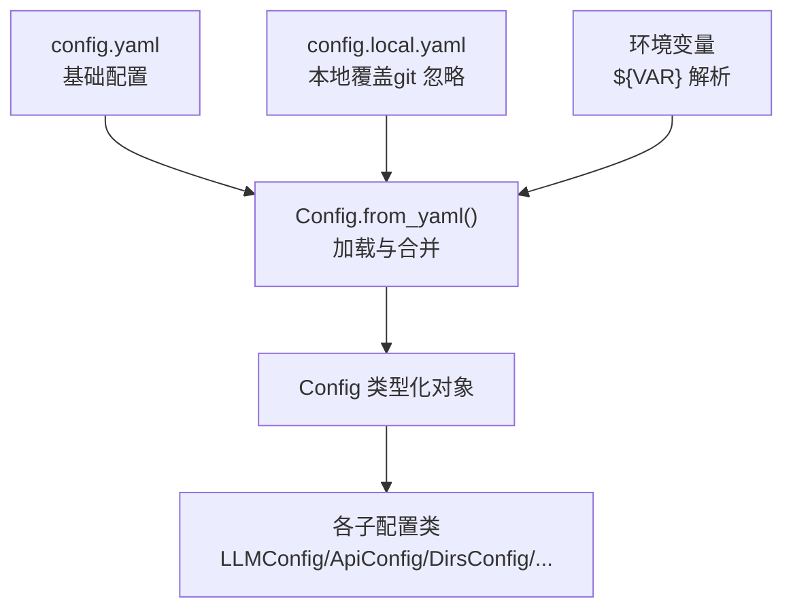
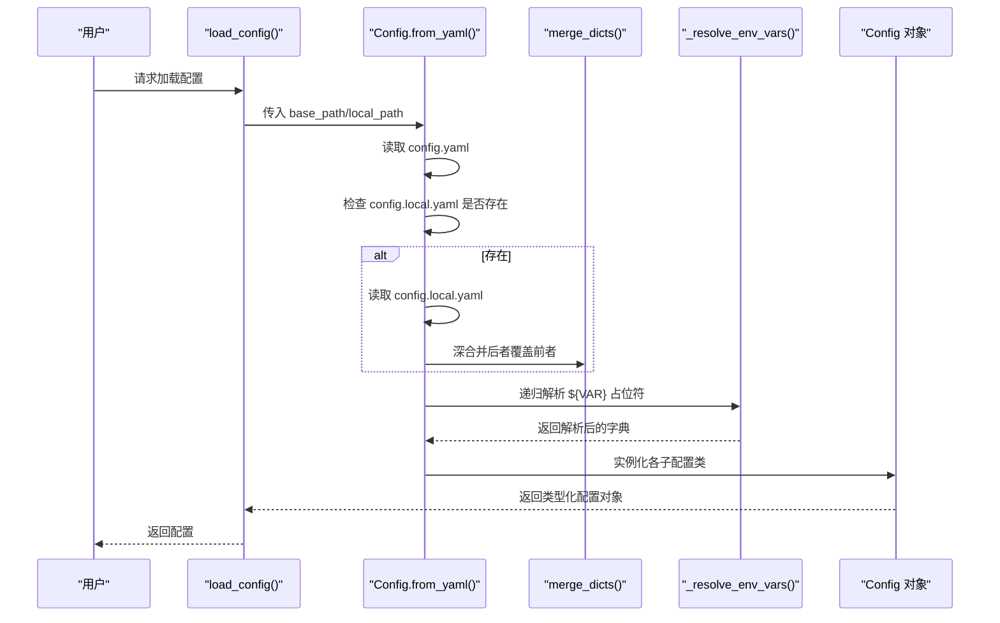
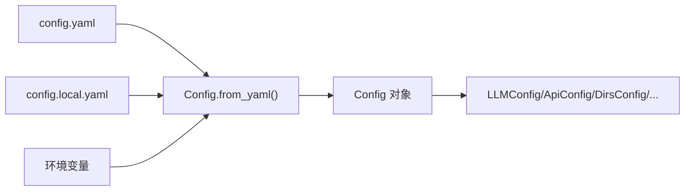

# 配置文件详解

<cite>
**本文引用的文件**
- [config.yaml](file://config.yaml)
- [config.example.yaml](file://config.example.yaml)
- [config.py](file://src/drbrain/config.py)
- [configuration.md](file://docs/configuration.md)
- [setup.py](file://src/drbrain/cli/setup.py)
- [test_config.py](file://tests/test_config.py)
- [SECURITY.md](file://SECURITY.md)
</cite>

## 目录
1. [简介](#简介)
2. [项目结构](#项目结构)
3. [核心组件](#核心组件)
4. [架构总览](#架构总览)
5. [详细组件分析](#详细组件分析)
6. [依赖关系分析](#依赖关系分析)
7. [性能考量](#性能考量)
8. [故障排查指南](#故障排查指南)
9. [结论](#结论)
10. [附录](#附录)

## 简介
本文件面向 DrBrain 用户与运维人员，系统性说明配置文件 config.yaml 的完整结构与所有配置项，涵盖 LLM 设置、数据库配置、API 密钥、存储路径、缓存与检索参数、质量控制阈值、备份目标等。文档同时解释配置加载优先级、继承与覆盖机制，并提供配置模板、示例与最佳实践，特别强调 API 密钥的安全存储与管理。

## 项目结构
DrBrain 的配置体系由三部分组成：基础配置、本地覆盖与环境变量解析，按“基础 > 本地覆盖 > 环境变量”的顺序合并，后者覆盖前者。配置类通过类型化数据类实现强类型访问，并保留字典式兼容接口。

图表来源
- [config.py:195-244](file://src/drbrain/config.py#L195-L244)
- [config.py:283-291](file://src/drbrain/config.py#L283-L291)

章节来源
- [config.py:195-244](file://src/drbrain/config.py#L195-L244)
- [config.py:283-291](file://src/drbrain/config.py#L283-L291)

## 核心组件
- 配置加载器：从 YAML 文件读取，支持深合并本地覆盖层，并递归解析字符串中的 ${VAR} 占位符。
- 类型化配置：以 dataclass 表达各子配置域，提供属性访问与字典兼容访问。
- 优先级与覆盖：config.yaml 基础配置；config.local.yaml 本地覆盖；环境变量最终解析。

章节来源
- [config.py:195-244](file://src/drbrain/config.py#L195-L244)
- [config.py:250-258](file://src/drbrain/config.py#L250-L258)
- [config.py:264-277](file://src/drbrain/config.py#L264-L277)

## 架构总览
下图展示配置加载与解析的关键流程：读取基础配置、合并本地覆盖、递归解析环境变量占位符，最终构造类型化配置对象。

图表来源
- [config.py:195-244](file://src/drbrain/config.py#L195-L244)
- [config.py:250-258](file://src/drbrain/config.py#L250-L258)
- [config.py:264-277](file://src/drbrain/config.py#L264-L277)
- [config.py:283-291](file://src/drbrain/config.py#L283-L291)

## 详细组件分析

### LLM 模型配置（llm.models）
- 作用：定义 LLM 提供商、模型名称、API 密钥与自定义 base_url。第一个模型为主模型，失败时按顺序回退。
- 关键字段
  - provider：提供商（如 openai、anthropic、ollama 等，支持 litellm 兼容生态）
  - model：模型标识（如 gpt-4o、claude-sonnet-4-6、deepseek-v4-pro 等）
  - api_key：API 密钥，建议通过 ${ENV_VAR} 从环境变量注入
  - base_url：自定义 API 基地址，默认 null 使用提供商默认地址
- 默认与范围
  - provider：必填
  - model：必填
  - api_key：默认 null
  - base_url：默认 null
- 示例与模板
  - 参考示例模板中多提供商样例与注释说明
- 安全建议
  - 将密钥放入 config.local.yaml 或通过环境变量注入，避免提交到版本控制

章节来源
- [config.yaml:7-12](file://config.yaml#L7-L12)
- [config.example.yaml:12-65](file://config.example.yaml#L12-L65)
- [configuration.md:21-75](file://docs/configuration.md#L21-L75)

### MinerU PDF 解析器（mineru）
- 作用：作为首选 PDF 解析器，支持 OCR、公式与表格解析；不可用时回退至 PyMuPDF。
- 关键字段
  - token：MinerU API 访问令牌（免费版无需 token）
  - model：解析管线类型（pipeline、vlm、MinerU-HTML）
  - is_ocr：是否强制 OCR（忽略嵌入文本）
  - enable_formula：是否解析 LaTeX 公式
  - enable_table：是否解析表格
  - max_pages：超过该页数的 PDF 将被拆分（MinerU 限制约 200）
- 默认与范围
  - token：默认空字符串
  - model：默认 vlm
  - is_ocr：默认 false
  - enable_formula：默认 true
  - enable_table：默认 true
  - max_pages：默认 150
- 示例与模板
  - 参考示例模板中的 mineru 配置段落与注释

章节来源
- [config.yaml:14-21](file://config.yaml#L14-L21)
- [config.example.yaml:69-76](file://config.example.yaml#L69-L76)
- [configuration.md:78-100](file://docs/configuration.md#L78-L100)

### 数据库（db）
- 作用：指定 SQLite 数据库存储路径（WAL 模式启用）。
- 关键字段
  - path：数据库文件路径
- 默认与范围
  - path：默认 data/drbrain.db
- 注意
  - 指标数据单独存储于 data/metrics.db

章节来源
- [config.yaml:22-23](file://config.yaml#L22-L23)
- [config.example.yaml:77-80](file://config.example.yaml#L77-L80)
- [configuration.md:103-115](file://docs/configuration.md#L103-L115)

### 数据目录（dirs）
- 作用：定义工作空间与数据目录位置，用于存放待处理 PDF、解析产物、报告、缓存与日志。
- 关键字段
  - inbox：待处理 PDF 放置目录
  - pending：解析失败的 PDF 目录
  - papers：每篇论文的独立目录
  - reports：JSON 分析报告目录
  - cache：API 响应缓存目录（可重建）
  - logs：日志目录
- 默认与用途
  - 各字段均有默认值，详见表

章节来源
- [config.yaml:25-31](file://config.yaml#L25-L31)
- [config.example.yaml:81-89](file://config.example.yaml#L81-L89)
- [configuration.md:118-138](file://docs/configuration.md#L118-L138)

### 外部 API（api）
- 作用：配置外部服务访问令牌与速率限制、缓存 TTL、CrossRef 邮箱等。
- 关键字段
  - deepxiv_token：DeepXiv 访问令牌（TLDR 与关键词）
  - s2_rate_limit：Semantic Scholar 每分钟请求数
  - s2_api_key：S2 API Key（提高配额）
  - cache_ttl：API 缓存 TTL（秒）
  - crossref_email：CrossRef 慷慨池联系邮箱（User-Agent）
  - openalex_token：OpenAlex 访问令牌（提高配额）
- 默认与范围
  - deepxiv_token：默认空字符串
  - s2_rate_limit：默认 100
  - s2_api_key：默认空字符串
  - cache_ttl：默认 86400（24 小时）
  - crossref_email：默认空字符串
  - openalex_token：默认空字符串

章节来源
- [config.yaml:33-39](file://config.yaml#L33-L39)
- [config.example.yaml:91-98](file://config.example.yaml#L91-L98)
- [configuration.md:141-161](file://docs/configuration.md#L141-L161)

### 搜索（BM25）
- 作用：设置 BM25 文档检索参数，影响关键词匹配与排序。
- 关键字段
  - k1：词频饱和度（范围 0.5–2.0）
  - b：文档长度归一化（范围 0–1）
- 默认与范围
  - k1：默认 1.5
  - b：默认 0.75

章节来源
- [config.yaml:41-43](file://config.yaml#L41-L43)
- [config.example.yaml:99-103](file://config.example.yaml#L99-L103)
- [configuration.md:164-176](file://docs/configuration.md#L164-L176)

### 抽取（extract）
- 作用：控制实体抽取阶段的最大并发 LLM 调用数量。
- 关键字段
  - max_concurrent：最大并发数
- 默认与范围
  - max_concurrent：默认 10

章节来源
- [config.yaml:45-46](file://config.yaml#L45-L46)
- [config.example.yaml:104-107](file://config.example.yaml#L104-L107)
- [configuration.md:179-191](file://docs/configuration.md#L179-L191)

### 获取（fetch）
- 作用：控制 PDF 下载并发、超时、User-Agent、回退顺序以及代理设置。
- 关键字段
  - max_concurrent：最大并发下载
  - timeout_per_fetch：单次下载超时（秒）
  - user_agent：HTTP User-Agent
  - fallback_order：回退源优先级列表
  - unpaywall_email：Unpaywall API 邮箱
  - institutional_proxy：机构代理主机
  - proxy_type：代理类型（ezproxy 或 url_prefix）
- 默认与范围
  - max_concurrent：默认 3
  - timeout_per_fetch：默认 60
  - user_agent：默认 DrBrain/0.1
  - fallback_order：默认 [openalex, arxiv, unpaywall, doi_direct]
  - unpaywall_email：默认空字符串
  - institutional_proxy：默认空字符串
  - proxy_type：默认空字符串

章节来源
- [config.yaml:52-60](file://config.yaml#L52-L60)
- [config.example.yaml:306-328](file://config.example.yaml#L306-L328)
- [configuration.md:306-328](file://docs/configuration.md#L306-L328)

### 嵌入（embed）
- 作用：设置文本嵌入（树节点）提供商、模型、设备、下载源、缓存目录、批量大小等。
- 提供商与默认值
  - local（默认）：本地 sentence-transformers 模型，无需 API Key
  - openai-compat：调用任意 OpenAI 兼容 /v1/embeddings 接口
  - none：禁用嵌入，仅使用 BM25 + 树检索
- 关键字段
  - provider：local/openai-compat/none
  - model：模型名称或 HuggingFace ID（1024 维输出）
  - device：auto/cpu/cuda
  - top_k：向量检索默认返回条数
  - source：modelscope/huggingface
  - cache_dir：本地模型缓存目录
  - hf_endpoint：HuggingFace 镜像地址（可选）
  - api_base：OpenAI 兼容 API 基地址
  - api_key：云嵌入 API Key（建议通过 ${ENV_VAR} 注入）
  - batch_size：每次编码的文本数量
- 默认与范围
  - provider：默认 local
  - model：默认 Qwen/Qwen3-Embedding-0.6B
  - device：默认 auto
  - top_k：默认 10
  - source：默认 modelscope
  - cache_dir：默认 ~/.cache/modelscope/hub/models
  - hf_endpoint：默认空字符串
  - api_base：默认空字符串
  - api_key：默认空字符串
  - batch_size：默认 64

章节来源
- [config.yaml:61-72](file://config.yaml#L61-L72)
- [config.example.yaml:108-121](file://config.example.yaml#L108-L121)
- [configuration.md:194-247](file://docs/configuration.md#L194-L247)

### 质量控制（queue）
- 作用：设置抽取结果的质量阈值，决定是否进入人工复核队列或自动接受。
- 关键字段
  - weak_threshold：弱阈值（低于此值进入复核队列）
  - auto_accept：强阈值（高于此值自动接受）
- 默认与范围
  - weak_threshold：默认 0.7
  - auto_accept：默认 0.9

章节来源
- [config.yaml:48-50](file://config.yaml#L48-L50)
- [config.example.yaml:122-126](file://config.example.yaml#L122-L126)
- [configuration.md:250-264](file://docs/configuration.md#L250-L264)

### 备份（backup）
- 作用：配置基于 rsync 的远程备份目标，支持 SSH 二进制路径、传输模式、压缩与排除规则。
- 关键字段
  - ssh_bin：SSH 二进制路径
  - rsync_bin：Rsync 二进制路径
  - targets.<name>：目标配置（host、user、path、port、identity_file、password、mode、compress、enabled、exclude）
- 默认与范围
  - ssh_bin：默认 ssh
  - rsync_bin：默认 rsync
  - targets.<name>.mode：默认 default（可选 default/append/append-verify）
  - targets.<name>.compress：默认 true
  - targets.<name>.enabled：默认 true
  - targets.<name>.port：默认 22
  - 其余字段见表

章节来源
- [config.example.yaml:127-145](file://config.example.yaml#L127-L145)
- [configuration.md:267-303](file://docs/configuration.md#L267-L303)

## 依赖关系分析
配置加载链路清晰，耦合度低，主要依赖关系如下：
- 配置加载器依赖 YAML 解析与正则表达式解析环境变量
- 类型化配置依赖 dataclass 字段定义与深合并逻辑
- CLI 初始化依赖配置加载器与目录创建逻辑

图表来源
- [config.py:195-244](file://src/drbrain/config.py#L195-L244)
- [config.py:283-291](file://src/drbrain/config.py#L283-L291)

章节来源
- [config.py:195-244](file://src/drbrain/config.py#L195-L244)
- [config.py:283-291](file://src/drbrain/config.py#L283-L291)

## 性能考量
- 并发与成本平衡：extract.max_concurrent 与 fetch.max_concurrent 影响吞吐与 API 成本，需结合提供商配额与预算权衡。
- 设备选择：embed.device 为 cuda 时可显著提升嵌入速度，但需确保 GPU 可用。
- 批量大小：embed.batch_size 在 GPU 上可适当增大，遇到 OOM 会自动下调。
- 缓存策略：api.cache_ttl 控制外部 API 缓存有效期，合理设置可减少重复请求。
- 回退顺序：fetch.fallback_order 决定 PDF 获取的可靠性与成功率，建议根据网络与机构代理情况调整。

## 故障排查指南
- 配置加载失败
  - 确认 config.yaml 存在且格式正确
  - 若存在 config.local.yaml，检查其键名与类型是否与基础配置一致
  - 使用 drbrain check 进行快速校验
- 环境变量未生效
  - 检查 ${VAR} 占位符是否拼写正确
  - 确认对应环境变量已导出
  - 未知变量将被解析为空字符串，注意潜在错误
- API 密钥问题
  - 将密钥放入 config.local.yaml 或通过环境变量注入
  - 避免将密钥提交到版本控制
- 目录缺失
  - 使用 drbrain setup 自动创建所需目录
  - 确保 data/ 与配置目录具有读写权限

章节来源
- [configuration.md:13-14](file://docs/configuration.md#L13-L14)
- [setup.py:158-188](file://src/drbrain/cli/setup.py#L158-L188)
- [test_config.py:262-297](file://tests/test_config.py#L262-L297)

## 结论
DrBrain 的配置体系以类型化、可覆盖、可解析环境变量为核心，既保证了灵活性，又兼顾了安全性与易用性。遵循“基础配置 + 本地覆盖 + 环境变量”的优先级，配合合理的并发与缓存策略，可在不同部署环境中稳定运行。

## 附录

### 配置优先级与覆盖机制
- 加载顺序：config.yaml（基础） > config.local.yaml（本地覆盖） > 环境变量（最终解析）
- 合并策略：深合并，后者覆盖前者叶子值
- 环境变量解析：对字符串中的 ${VAR} 进行递归替换，未知变量解析为空字符串

章节来源
- [configuration.md:5-14](file://docs/configuration.md#L5-L14)
- [config.py:250-258](file://src/drbrain/config.py#L250-L258)
- [config.py:264-277](file://src/drbrain/config.py#L264-L277)

### 配置模板与示例
- 基础模板：参考 config.example.yaml，包含各模块注释与示例
- 常用示例：LLM 多提供商模板、MinerU 配置、嵌入提供商切换、备份目标配置等

章节来源
- [config.example.yaml:1-145](file://config.example.yaml#L1-L145)

### 安全最佳实践（API 密钥）
- 将密钥放入 config.local.yaml（已加入 .gitignore），避免提交到版本控制
- 在 CI/CD 环境中使用环境变量注入，避免硬编码
- 定期轮换密钥，最小权限原则
- 不要共享 config.local.yaml 或环境文件

章节来源
- [SECURITY.md:21-34](file://SECURITY.md#L21-L34)
- [configuration.md:6-7](file://docs/configuration.md#L6-L7)