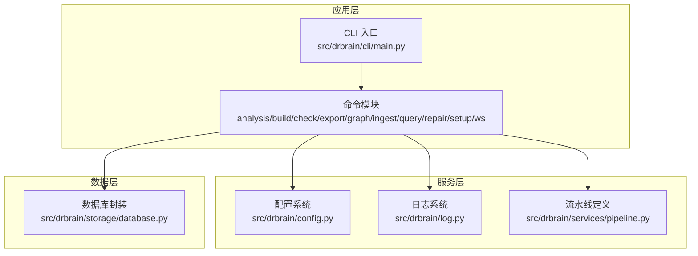
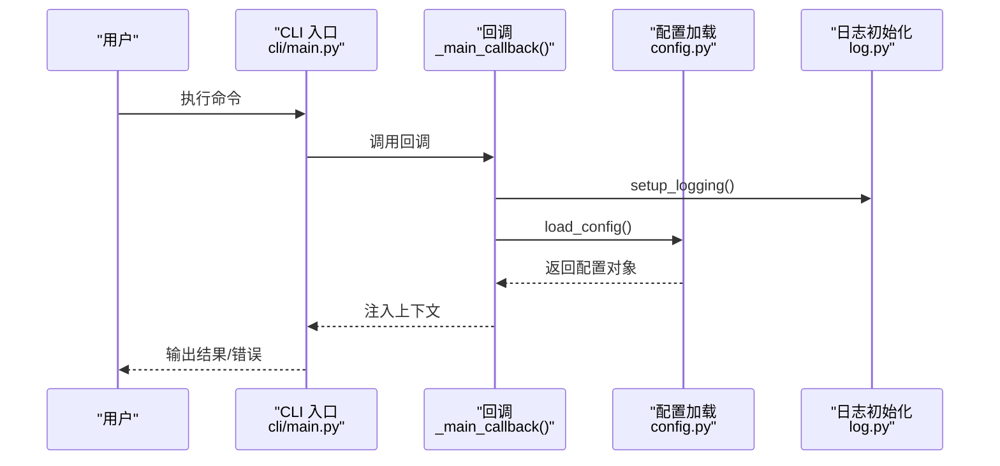
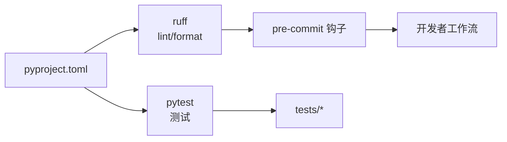

# 代码规范

<cite>
**本文引用的文件**
- [CONTRIBUTING.md](file://CONTRIBUTING.md)
- [CODE_OF_CONDUCT.md](file://CODE_OF_CONDUCT.md)
- [pyproject.toml](file://pyproject.toml)
- [.pre-commit-config.yaml](file://.pre-commit-config.yaml)
- [README.md](file://README.md)
- [src/drbrain/__init__.py](file://src/drbrain/__init__.py)
- [src/drbrain/cli/main.py](file://src/drbrain/cli/main.py)
- [src/drbrain/config.py](file://src/drbrain/config.py)
- [src/drbrain/log.py](file://src/drbrain/log.py)
- [src/drbrain/services/pipeline.py](file://src/drbrain/services/pipeline.py)
- [src/drbrain/storage/database.py](file://src/drbrain/storage/database.py)
- [tests/test_config.py](file://tests/test_config.py)
- [tests/test_cli_main.py](file://tests/test_cli_main.py)
- [.github/PULL_REQUEST_TEMPLATE.md](file://.github/PULL_REQUEST_TEMPLATE.md)
</cite>

## 目录
1. [简介](#简介)
2. [项目结构](#项目结构)
3. [核心组件](#核心组件)
4. [架构总览](#架构总览)
5. [详细组件分析](#详细组件分析)
6. [依赖分析](#依赖分析)
7. [性能考虑](#性能考虑)
8. [故障排查指南](#故障排查指南)
9. [结论](#结论)
10. [附录](#附录)

## 简介
本文件为 DrBrain 项目的代码规范与最佳实践指南，面向贡献者与维护者，系统阐述 Python 编码标准（类型注解、命名约定、代码组织）、文档字符串规范（Google 风格）、代码格式化工具 ruff 的配置与使用、Git 提交信息规范（Conventional Commits）、代码审查流程与质量检查标准，并结合仓库现有实现给出正反面示例与改进建议，帮助团队统一风格、提升可读性与可维护性。

## 项目结构
DrBrain 采用“包 + CLI + 测试 + 文档”的清晰分层：
- 包与模块：位于 src/drbrain 下，按功能域拆分（如 cli、services、storage、extractor、graph 等）
- 命令行入口：通过 Typer 暴露命令，集中注册在主入口
- 配置与日志：配置以数据类承载，日志通过 loguru 统一管理
- 数据库：SQLite 后端，含模式管理与迁移
- 测试：pytest 驱动，覆盖配置加载、CLI 行为等
- 工具链：ruff 作为 linter/format；pre-commit 自动化；pyproject.toml 管理依赖与工具配置

图表来源
- [src/drbrain/cli/main.py:1-150](file://src/drbrain/cli/main.py#L1-L150)
- [src/drbrain/config.py:1-292](file://src/drbrain/config.py#L1-L292)
- [src/drbrain/log.py:1-68](file://src/drbrain/log.py#L1-L68)
- [src/drbrain/services/pipeline.py:1-109](file://src/drbrain/services/pipeline.py#L1-L109)
- [src/drbrain/storage/database.py:1-775](file://src/drbrain/storage/database.py#L1-L775)

章节来源
- [README.md:1-112](file://README.md#L1-L112)
- [src/drbrain/cli/main.py:1-150](file://src/drbrain/cli/main.py#L1-L150)

## 核心组件
- 类型注解与数据模型
  - 使用 dataclass 定义配置子系统，提供类型安全与默认值，支持字典兼容访问
  - 示例路径：[配置数据类定义:44-194](file://src/drbrain/config.py#L44-L194)
- 日志与会话标识
  - 使用 loguru 统一日志输出，带会话 ID 与滚动文件
  - 示例路径：[日志初始化与会话 ID:18-68](file://src/drbrain/log.py#L18-L68)
- CLI 命令注册
  - 主入口集中注册命令与子应用，统一回调处理配置加载
  - 示例路径：[命令注册与回调:80-146](file://src/drbrain/cli/main.py#L80-L146)
- 数据库封装
  - SQLite 连接、表结构、索引与迁移逻辑内聚于单类
  - 示例路径：[数据库类与迁移:159-246](file://src/drbrain/storage/database.py#L159-L246)

章节来源
- [src/drbrain/config.py:1-292](file://src/drbrain/config.py#L1-L292)
- [src/drbrain/log.py:1-68](file://src/drbrain/log.py#L1-L68)
- [src/drbrain/cli/main.py:1-150](file://src/drbrain/cli/main.py#L1-L150)
- [src/drbrain/storage/database.py:1-775](file://src/drbrain/storage/database.py#L1-L775)

## 架构总览
DrBrain 的运行时由 CLI 驱动，命令在执行前通过回调加载配置并设置日志；业务逻辑分布在 services 与 storage 层，数据持久化基于 SQLite。整体遵循“命令入口 → 配置/日志 → 服务 → 存储”的调用链。

图表来源
- [src/drbrain/cli/main.py:80-92](file://src/drbrain/cli/main.py#L80-L92)
- [src/drbrain/config.py:283-292](file://src/drbrain/config.py#L283-L292)
- [src/drbrain/log.py:32-60](file://src/drbrain/log.py#L32-L60)

## 详细组件分析

### Python 编码标准
- 类型注解
  - 推荐为函数参数、返回值、属性添加明确类型注解，便于静态检查与 IDE 支持
  - 参考现有实现：[配置数据类字段类型:44-194](file://src/drbrain/config.py#L44-L194)
- 命名约定
  - 模块与包：小写、下划线分隔
  - 类：PascalCase；方法/函数：snake_case；常量：UPPER_CASE
  - 私有成员：前缀下划线
  - 参考现有实现：[CLI 命令注册与回调命名:80-146](file://src/drbrain/cli/main.py#L80-L146)
- 代码组织
  - 功能域内聚：services、storage、extractor 等按职责划分
  - 导出公共 API：在模块 __all__ 或显式导出处保持一致
  - 参考现有实现：[服务层模块组织:1-109](file://src/drbrain/services/pipeline.py#L1-L109)

章节来源
- [src/drbrain/config.py:44-194](file://src/drbrain/config.py#L44-L194)
- [src/drbrain/cli/main.py:80-146](file://src/drbrain/cli/main.py#L80-L146)
- [src/drbrain/services/pipeline.py:1-109](file://src/drbrain/services/pipeline.py#L1-L109)

### 文档字符串规范（Google 风格）
- 函数/方法
  - 简要描述 + 参数列表 + 返回值 + 异常说明
  - 参考现有实现：[配置类 from_yaml 文档字符串:196-244](file://src/drbrain/config.py#L196-L244)
- 类
  - 类级文档字符串用于概述用途与关键行为
  - 参考现有实现：[数据库类文档字符串:159-160](file://src/drbrain/storage/database.py#L159-L160)
- 模块
  - 模块顶部文档字符串简述模块职责
  - 参考现有实现：[包级模块文档:1-2](file://src/drbrain/__init__.py#L1-L2)

章节来源
- [src/drbrain/config.py:196-244](file://src/drbrain/config.py#L196-L244)
- [src/drbrain/storage/database.py:159-160](file://src/drbrain/storage/database.py#L159-L160)
- [src/drbrain/__init__.py:1-2](file://src/drbrain/__init__.py#L1-L2)

### 代码格式化与 Lint 规范（ruff）
- 工具与版本
  - ruff 作为 linter 与 formatter，目标 Python 版本为 3.12
  - 参考配置：[pyproject.toml 中 ruff 小节:83-96](file://pyproject.toml#L83-L96)
- 格式化策略
  - 行长限制 100；双引号；空格缩进
  - 参考配置：[pyproject.toml 中 ruff.format 小节:88-91](file://pyproject.toml#L88-L91)
- Lint 规则
  - 选择 E/F/I/N/W/UP；忽略过长行警告（docstrings、SQL、Typer 参数天然较长）
  - 参考配置：[pyproject.toml 中 ruff.lint.ignore:94-96](file://pyproject.toml#L94-L96)
- 本地与提交钩子
  - 本地检查：ruff check、ruff format --check
  - 提交钩子：ruff 与 ruff-format 自动修复与格式检查
  - 参考配置：[pre-commit 配置:1-17](file://.pre-commit-config.yaml#L1-L17)

章节来源
- [pyproject.toml:83-96](file://pyproject.toml#L83-L96)
- [.pre-commit-config.yaml:1-17](file://.pre-commit-config.yaml#L1-L17)

### Git 提交信息规范（Conventional Commits）
- 类型
  - feat：新功能
  - fix：缺陷修复
  - docs：仅文档变更
  - refactor：既不修复缺陷也不新增功能的重构
  - test：新增或更新测试
  - chore：维护类任务（CI、依赖、配置）
- 参考：[贡献指南中的提交信息规范:37-47](file://CONTRIBUTING.md#L37-L47)

章节来源
- [CONTRIBUTING.md:37-47](file://CONTRIBUTING.md#L37-L47)

### 代码审查流程与质量检查标准
- 质量门禁
  - 本地必须通过：ruff 检查、ruff 格式检查、pytest 快测、pytest 全量
  - 参考：[贡献指南中的 PR 步骤:24-36](file://CONTRIBUTING.md#L24-L36)
- PR 模板检查项
  - ruff 检查通过
  - 快速测试通过
  - 新增公共 API 文档
  - 参考：[PR 模板:1-18](file://.github/PULL_REQUEST_TEMPLATE.md#L1-L18)
- 代码审查关注点
  - 行为契约测试优先，避免过度耦合实现细节
  - 使用 pytest fixture 提升隔离性
  - 标记慢测试（网络、LLM）为 integration
  - 参考：[贡献指南中的测试指南:48-54](file://CONTRIBUTING.md#L48-L54)

章节来源
- [CONTRIBUTING.md:24-36](file://CONTRIBUTING.md#L24-L36)
- [.github/PULL_REQUEST_TEMPLATE.md:1-18](file://.github/PULL_REQUEST_TEMPLATE.md#L1-L18)

### 最佳实践示例与反面案例
- 最佳实践
  - 使用 dataclass 定义配置，提供默认值与类型注解，保留字典兼容访问
    - 示例路径：[配置数据类:44-194](file://src/drbrain/config.py#L44-L194)
  - 在 CLI 回调中统一加载配置与设置日志，保证命令一致性
    - 示例路径：[回调与配置注入:80-92](file://src/drbrain/cli/main.py#L80-L92)
  - 将数据库模式与迁移逻辑封装于单一类，便于演进与回滚
    - 示例路径：[数据库类与迁移:159-246](file://src/drbrain/storage/database.py#L159-L246)
- 反面案例（常见问题与规避建议）
  - 过长行导致 E501 警告：可通过合理换行、拆分表达式或接受 docstrings/SQL 的自然长度
    - 参考：[ruff 忽略规则:94-96](file://pyproject.toml#L94-L96)
  - 缺少类型注解：为函数签名与数据类字段补充注解，提升可读性与静态分析能力
    - 参考：[配置数据类字段:44-194](file://src/drbrain/config.py#L44-L194)
  - 文档字符串缺失：为公共 API 添加 Google 风格文档字符串，描述参数、返回与异常
    - 参考：[配置类方法文档:196-244](file://src/drbrain/config.py#L196-L244)

章节来源
- [src/drbrain/config.py:44-194](file://src/drbrain/config.py#L44-L194)
- [src/drbrain/cli/main.py:80-92](file://src/drbrain/cli/main.py#L80-L92)
- [src/drbrain/storage/database.py:159-246](file://src/drbrain/storage/database.py#L159-L246)
- [pyproject.toml:94-96](file://pyproject.toml#L94-L96)

### 代码组织与模块边界
- 模块职责
  - config：配置装载、环境变量解析、字典兼容访问
  - log：日志初始化、会话 ID、UI 输出
  - cli/main：命令注册、回调、上下文注入
  - services/pipeline：步骤定义、预设与解析
  - storage/database：SQLite 封装、模式与迁移
- 测试组织
  - tests/test_config.py：覆盖配置加载、合并、环境变量解析
  - tests/test_cli_main.py：覆盖 CLI 行为与错误处理
- 参考路径
  - [配置测试:1-465](file://tests/test_config.py#L1-L465)
  - [CLI 行为测试:1-182](file://tests/test_cli_main.py#L1-L182)

章节来源
- [tests/test_config.py:1-465](file://tests/test_config.py#L1-L465)
- [tests/test_cli_main.py:1-182](file://tests/test_cli_main.py#L1-L182)

## 依赖分析
- 工具链依赖
  - ruff：lint 与 format
  - pytest：测试框架与标记
  - pre-commit：提交前自动检查
- 项目依赖
  - 业务相关第三方库集中在 pyproject.toml 的 dependencies 与 optional-dependencies
- 参考配置
  - [pyproject.toml 工具与依赖段落:61-67](file://pyproject.toml#L61-L67)
  - [pyproject.toml 项目依赖段落:32-51](file://pyproject.toml#L32-L51)

图表来源
- [pyproject.toml:61-67](file://pyproject.toml#L61-L67)
- [.pre-commit-config.yaml:1-17](file://.pre-commit-config.yaml#L1-L17)

章节来源
- [pyproject.toml:32-51](file://pyproject.toml#L32-L51)
- [pyproject.toml:61-67](file://pyproject.toml#L61-L67)
- [.pre-commit-config.yaml:1-17](file://.pre-commit-config.yaml#L1-L17)

## 性能考虑
- SQLite WAL 模式与外键约束：已在连接时启用，有助于并发与一致性
  - 参考：[数据库连接初始化:162-168](file://src/drbrain/storage/database.py#L162-L168)
- 查询与索引：针对常用查询建立索引，减少全表扫描
  - 参考：[索引定义:115-122](file://src/drbrain/storage/database.py#L115-L122)
- 大对象存储：向量以二进制形式存储，注意序列化/反序列化开销
  - 参考：[嵌入存取:400-416](file://src/drbrain/storage/database.py#L400-L416)

章节来源
- [src/drbrain/storage/database.py:162-168](file://src/drbrain/storage/database.py#L162-L168)
- [src/drbrain/storage/database.py:115-122](file://src/drbrain/storage/database.py#L115-L122)
- [src/drbrain/storage/database.py:400-416](file://src/drbrain/storage/database.py#L400-L416)

## 故障排查指南
- 提交被拒绝（pre-commit）
  - 症状：ruff 报错或格式不合规
  - 处理：运行 ruff fix 与 ruff format --check，确保通过后再提交
  - 参考：[pre-commit 配置:1-17](file://.pre-commit-config.yaml#L1-L17)
- 本地测试失败
  - 症状：pytest 快测或全量测试报错
  - 处理：先修复 ruff 与格式问题，再运行 pytest；对集成测试使用标记跳过
  - 参考：[贡献指南测试步骤:17-22](file://CONTRIBUTING.md#L17-L22)
- CLI 行为异常
  - 症状：命令无响应或报错
  - 处理：确认回调已加载配置与日志；检查命令注册是否正确
  - 参考：[CLI 回调与命令注册:80-146](file://src/drbrain/cli/main.py#L80-L146)

章节来源
- [.pre-commit-config.yaml:1-17](file://.pre-commit-config.yaml#L1-L17)
- [CONTRIBUTING.md:17-22](file://CONTRIBUTING.md#L17-L22)
- [src/drbrain/cli/main.py:80-146](file://src/drbrain/cli/main.py#L80-L146)

## 结论
本规范以现有仓库实践为基础，明确了类型注解、命名约定、文档字符串、ruff 配置与使用、Conventional Commits 提交规范、代码审查流程与质量门禁。建议在日常开发中：
- 严格遵循 Google 风格文档字符串与类型注解
- 使用 ruff 与 pre-commit 保障格式一致性
- 以行为契约驱动测试，避免过度耦合实现
- 在 PR 中逐项核验质量门禁，确保代码可维护性与稳定性

## 附录
- 贡献指南与行为准则
  - [贡献指南:1-81](file://CONTRIBUTING.md#L1-L81)
  - [行为准则:1-57](file://CODE_OF_CONDUCT.md#L1-L57)
- CLI 与命令参考
  - [CLI 入口与命令注册:1-150](file://src/drbrain/cli/main.py#L1-L150)
- 配置与日志
  - [配置系统:1-292](file://src/drbrain/config.py#L1-L292)
  - [日志系统:1-68](file://src/drbrain/log.py#L1-L68)
- 数据库与流水线
  - [数据库封装:1-775](file://src/drbrain/storage/database.py#L1-L775)
  - [流水线定义:1-109](file://src/drbrain/services/pipeline.py#L1-L109)
- 测试样例
  - [配置测试:1-465](file://tests/test_config.py#L1-L465)
  - [CLI 行为测试:1-182](file://tests/test_cli_main.py#L1-L182)