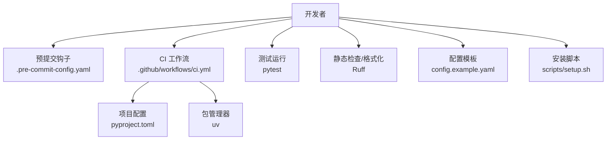
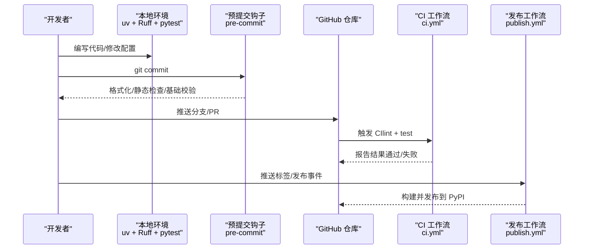
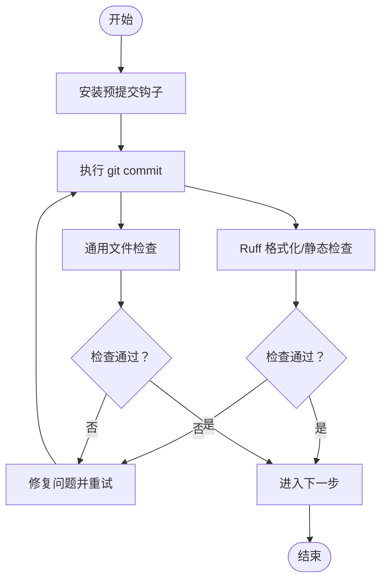
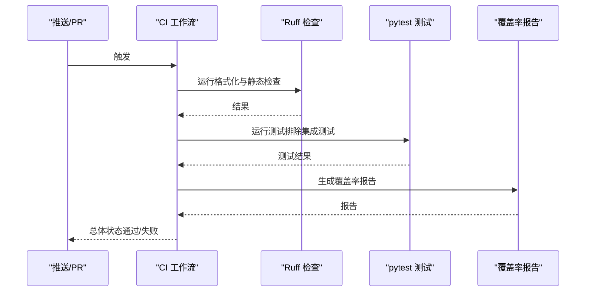
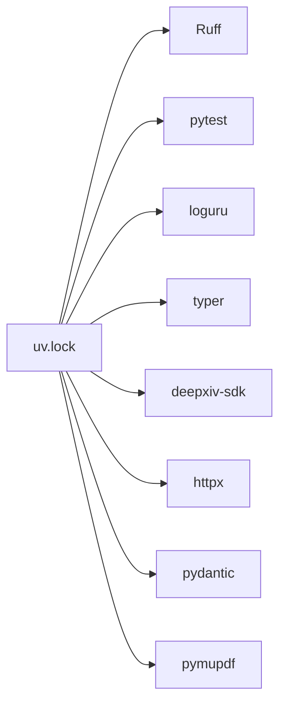

# 开发工具

<cite>
**本文引用的文件**
- [.pre-commit-config.yaml](file://.pre-commit-config.yaml)
- [pyproject.toml](file://pyproject.toml)
- [.github/workflows/ci.yml](file://.github/workflows/ci.yml)
- [.github/workflows/publish.yml](file://.github/workflows/publish.yml)
- [scripts/setup.sh](file://scripts/setup.sh)
- [CONTRIBUTING.md](file://CONTRIBUTING.md)
- [config.example.yaml](file://config.example.yaml)
- [uv.lock](file://uv.lock)
- [main.py](file://main.py)
</cite>

## 目录
1. [简介](#简介)
2. [项目结构](#项目结构)
3. [核心组件](#核心组件)
4. [架构总览](#架构总览)
5. [详细组件分析](#详细组件分析)
6. [依赖分析](#依赖分析)
7. [性能考虑](#性能考虑)
8. [故障排查指南](#故障排查指南)
9. [结论](#结论)
10. [附录](#附录)

## 简介
本指南面向 DrBrain 项目的开发者，系统性介绍开发工具链的配置与使用，覆盖以下主题：
- 预提交钩子：代码格式化、静态检查与提交前校验
- CI/CD 工作流：在 GitHub Actions 上的拉取请求与主分支检查、覆盖率与发布流程
- 调试与测试：本地测试运行、日志与断点调试建议
- 性能分析：可选的性能分析工具与实践建议
- 本地开发与热重载：CLI 运行方式与工作区配置
- 常用脚本与自动化：安装、初始化与一键设置
- 扩展与定制：如何扩展开发工具链以满足团队规范

## 项目结构
DrBrain 的开发工具链主要由以下部分组成：
- 代码质量工具：Ruff（格式化与静态检查）、pytest（测试）
- 版本与包管理：uv（同步依赖、构建与发布）
- 提交前钩子：pre-commit（仓库级钩子）
- CI/CD：GitHub Actions（lint、测试、覆盖率与发布）
- 配置模板：config.example.yaml（示例配置）
- 入口与脚本：main.py、scripts/setup.sh

图表来源
- [.pre-commit-config.yaml](file://.pre-commit-config.yaml)
- [.github/workflows/ci.yml](file://.github/workflows/ci.yml)
- [pyproject.toml](file://pyproject.toml)
- [scripts/setup.sh](file://scripts/setup.sh)
- [config.example.yaml](file://config.example.yaml)

章节来源
- [.pre-commit-config.yaml](file://.pre-commit-config.yaml)
- [.github/workflows/ci.yml](file://.github/workflows/ci.yml)
- [pyproject.toml](file://pyproject.toml)
- [scripts/setup.sh](file://scripts/setup.sh)
- [config.example.yaml](file://config.example.yaml)

## 核心组件
- 预提交钩子
  - 使用 ruff 对 Python 源码进行格式化与静态检查，并自动修复可修复问题
  - 使用 pre-commit-hooks 完成尾随空白、文件末尾换行、YAML/JSON 校验、大文件检测等基础检查
- 测试与覆盖率
  - 使用 pytest 进行单元与集成测试；通过 CI 设置覆盖率阈值与失败策略
- 代码质量与格式化
  - Ruff 在本地与 CI 中统一执行格式化与静态检查，确保风格一致
- 包与环境管理
  - 使用 uv 同步依赖、安装可执行入口、构建与发布
- 配置模板
  - config.example.yaml 提供 LLM、数据库、解析器、嵌入、备份等配置项示例

章节来源
- [.pre-commit-config.yaml](file://.pre-commit-config.yaml)
- [.github/workflows/ci.yml](file://.github/workflows/ci.yml)
- [pyproject.toml](file://pyproject.toml)
- [config.example.yaml](file://config.example.yaml)

## 架构总览
下图展示了从开发者提交到 CI 的整体流程，以及本地与 CI 的一致性保障。

图表来源
- [.github/workflows/ci.yml](file://.github/workflows/ci.yml)
- [.github/workflows/publish.yml](file://.github/workflows/publish.yml)
- [.pre-commit-config.yaml](file://.pre-commit-config.yaml)
- [pyproject.toml](file://pyproject.toml)

## 详细组件分析

### 预提交钩子配置与使用
- 钩子仓库与版本
  - ruff-pre-commit：负责格式化与静态检查，支持自动修复
  - pre-commit-hooks：负责通用文件检查（空白、换行、YAML/JSON、大文件）
- 安装与启用
  - 在本地仓库安装钩子后，每次提交前自动执行
- 常见问题
  - 若提交被拒绝，先在本地运行格式化与静态检查命令，再重新提交
  - 如需跳过钩子（不推荐），请遵循团队规范

图表来源
- [.pre-commit-config.yaml](file://.pre-commit-config.yaml)

章节来源
- [.pre-commit-config.yaml](file://.pre-commit-config.yaml)

### CI/CD 工作流配置与自定义
- CI 工作流（ci.yml）
  - 触发条件：推送到主分支或拉取请求
  - 步骤：安装 Python、设置 uv、同步依赖、安装可编辑包、执行 Ruff 检查与格式检查、运行 pytest 并生成覆盖率报告
  - 覆盖率要求：失败阈值设置为 65%，用于保证测试质量
- 发布工作流（publish.yml）
  - 触发条件：推送标签或发布事件
  - 步骤：构建包并通过 PyPI 发布到 TestPyPI 或正式 PyPI
- 自定义建议
  - 可根据需要增加额外的测试矩阵（不同 Python 版本、操作系统）
  - 可添加安全扫描（如依赖漏洞扫描）或构建产物验证

图表来源
- [.github/workflows/ci.yml](file://.github/workflows/ci.yml)
- [.github/workflows/publish.yml](file://.github/workflows/publish.yml)

章节来源
- [.github/workflows/ci.yml](file://.github/workflows/ci.yml)
- [.github/workflows/publish.yml](file://.github/workflows/publish.yml)

### 调试工具与断点调试技巧
- 日志与 UI 输出
  - 项目使用 loguru 作为日志框架，提供可配置的日志路径与会话 ID
  - 建议在本地开发时开启 INFO 级别以上日志，便于定位问题
- 断点调试
  - 在 IDE 中设置断点，配合 uv run drbrain 执行入口进行调试
  - 对于异步代码，确保测试模式使用 asyncio_mode 自动模式
- 常见场景
  - 解析器与提取器：在关键节点设置断点，观察中间结果
  - LLM 调用：在调用前后断点，记录输入输出与错误信息
  - 数据库与缓存：在读写前后断点，确认数据一致性

章节来源
- [pyproject.toml](file://pyproject.toml)
- [config.example.yaml](file://config.example.yaml)

### 性能分析工具使用指南
- 可选工具
  - cProfile：内置性能分析，适合快速定位热点函数
  - yep/perf：更精细的采样分析，适合长时间运行的任务
  - memory_profiler：内存使用分析，辅助排查内存泄漏
- 实践建议
  - 在本地对关键流程（如批量处理、向量化检索）进行性能测试
  - 将性能指标纳入 CI 的基准测试（可选），持续监控回归

[本节为通用指导，无需特定文件引用]

### 本地开发服务器与热重载
- CLI 运行
  - 项目提供可执行入口 drbrain，可通过 uv run drbrain 直接运行
  - main.py 作为兼容入口，建议优先使用 uv run drbrain
- 热重载
  - 本项目未内置热重载机制；可在本地开发中结合 IDE 的自动保存与测试运行实现“准热重载”
  - 对于服务型组件（如有），可借助外部工具实现文件变更触发重启

章节来源
- [main.py](file://main.py)
- [pyproject.toml](file://pyproject.toml)

### 常用开发脚本与自动化任务
- 安装与初始化
  - 使用 scripts/setup.sh 安装 Python 依赖与 mineru-open-api CLI
  - 该脚本会提示复制配置模板并完成初始设置
- 一键设置
  - 通过 uv sync 安装依赖
  - 通过 uv pip install -e . 安装可编辑模式
- 测试自动化
  - 快速测试：uv run pytest -m "not integration"
  - 全量测试：uv run pytest

章节来源
- [scripts/setup.sh](file://scripts/setup.sh)
- [CONTRIBUTING.md](file://CONTRIBUTING.md)

### 扩展与定制开发工具链
- 预提交钩子扩展
  - 可新增更多语言或规则集（如 Markdown、Shell 脚本检查）
  - 注意保持与 CI 的一致性，避免本地通过而 CI 失败
- CI 工作流扩展
  - 可增加多矩阵测试、安全扫描、构建产物上传等步骤
  - 发布流程可根据需要拆分测试发布与正式发布阶段
- 代码质量规则
  - 在 pyproject.toml 的 Ruff 配置中调整规则选择与忽略项，确保团队风格一致
- 配置模板维护
  - 新增配置项时，同步更新 config.example.yaml、CLI 检查逻辑与测试用例

章节来源
- [.pre-commit-config.yaml](file://.pre-commit-config.yaml)
- [.github/workflows/ci.yml](file://.github/workflows/ci.yml)
- [pyproject.toml](file://pyproject.toml)
- [config.example.yaml](file://config.example.yaml)

## 依赖分析
- 依赖管理
  - 使用 uv 进行依赖同步与锁定，确保本地与 CI 环境一致
  - uv.lock 记录了精确的依赖版本与平台标记，避免漂移
- 关键依赖
  - Ruff：格式化与静态检查
  - pytest：测试框架与覆盖率
  - loguru：日志框架
  - typer：CLI 框架
  - deepxiv-sdk、httpx、pydantic、pymupdf 等：功能模块所需

图表来源
- [uv.lock](file://uv.lock)

章节来源
- [uv.lock](file://uv.lock)

## 性能考虑
- 本地性能优化
  - 使用合适的设备与模型参数，减少不必要的并发
  - 对大文件与长文本进行分块处理，降低内存峰值
- CI 性能优化
  - 合理划分测试套件，优先运行快速测试
  - 利用缓存与依赖复用，缩短构建时间
- 监控与回归
  - 将性能指标纳入 CI 基线，防止回归

[本节为通用指导，无需特定文件引用]

## 故障排查指南
- 提交被拒绝
  - 检查 Ruff 报错并修复；确认文件末尾换行、无多余空白字符
- CI 失败
  - 查看覆盖率报告与测试日志，定位失败用例
  - 确认本地与 CI 的 Python 版本与依赖一致
- 测试异常
  - 使用 pytest 的详细输出模式（-v）查看失败详情
  - 对异步测试确保正确配置 asyncio_mode
- 配置问题
  - 参考 config.example.yaml，核对关键配置项（LLM、数据库、嵌入等）
  - 确保敏感信息通过环境变量注入，避免提交到仓库

章节来源
- [.github/workflows/ci.yml](file://.github/workflows/ci.yml)
- [pyproject.toml](file://pyproject.toml)
- [config.example.yaml](file://config.example.yaml)

## 结论
通过统一的预提交钩子、CI/CD 工作流与一致的依赖管理，DrBrain 的开发工具链能够有效提升代码质量与协作效率。建议团队在遵循现有规范的基础上，按需扩展工具链能力，持续优化本地与 CI 的性能表现，并将性能与稳定性纳入日常开发流程。

[本节为总结，无需特定文件引用]

## 附录
- 快速参考
  - 安装依赖：uv sync
  - 安装可编辑：uv pip install -e .
  - 安装预提交钩子：pre-commit install
  - 运行快速测试：uv run pytest -m "not integration"
  - 运行全量测试：uv run pytest
  - 运行 Ruff 检查：uv run ruff check src/ tests/
  - 运行 Ruff 格式化：uv run ruff format src/ tests/

章节来源
- [CONTRIBUTING.md](file://CONTRIBUTING.md)
- [pyproject.toml](file://pyproject.toml)