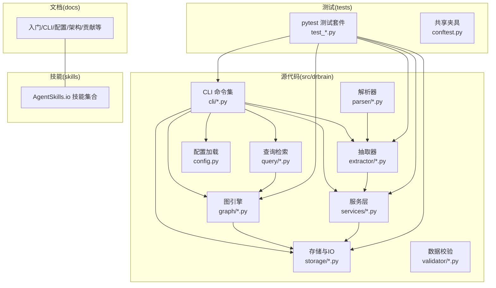
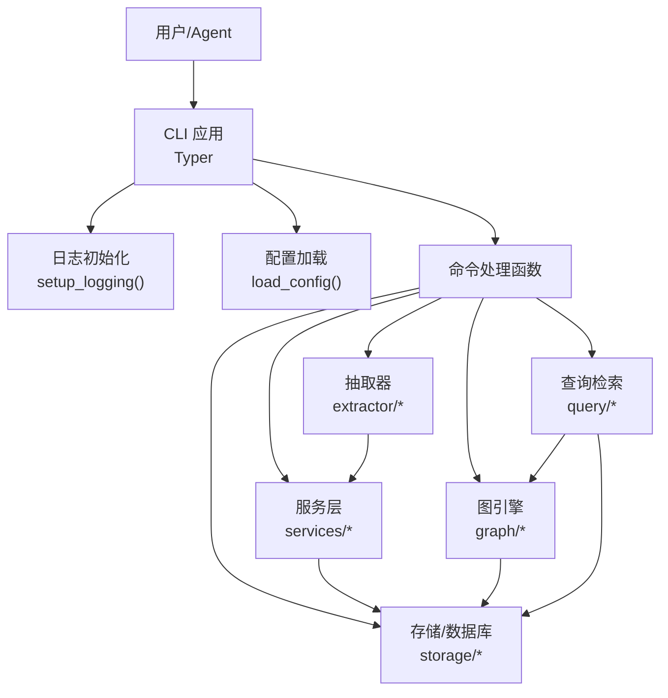
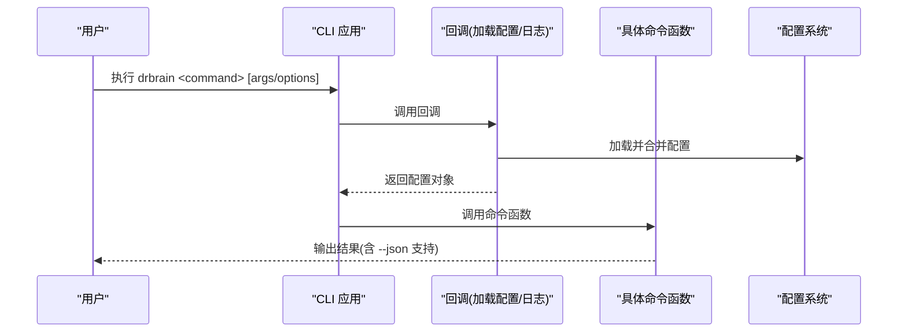
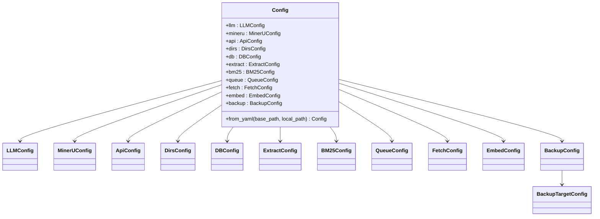
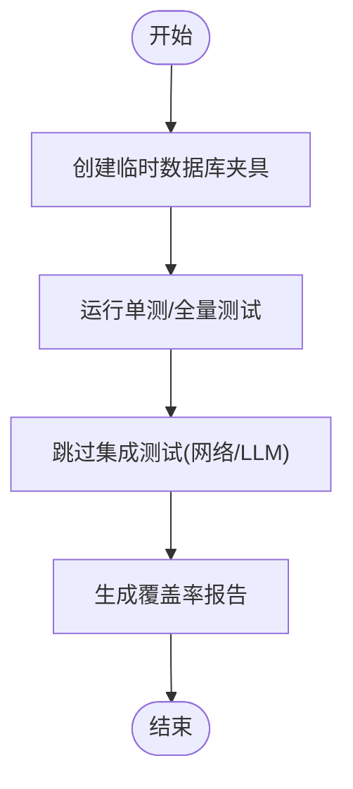
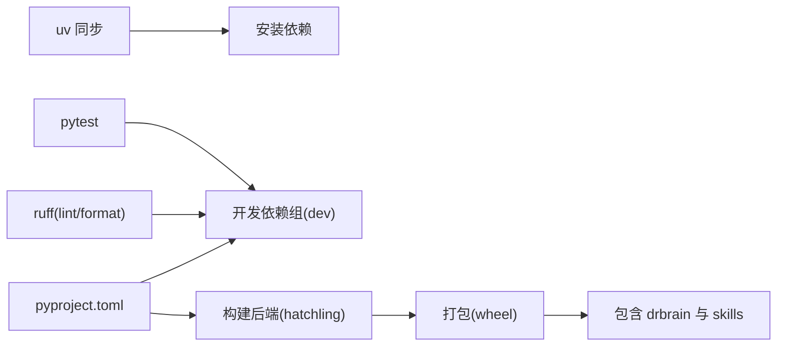
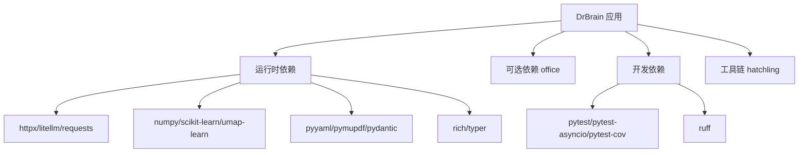

# 开发指南

<cite>
**本文引用的文件**
- [CONTRIBUTING.md](file://CONTRIBUTING.md)
- [README.md](file://README.md)
- [pyproject.toml](file://pyproject.toml)
- [config.example.yaml](file://config.example.yaml)
- [scripts/setup.sh](file://scripts/setup.sh)
- [.pre-commit-config.yaml](file://.pre-commit-config.yaml)
- [docs/contributing.md](file://docs/contributing.md)
- [CODE_OF_CONDUCT.md](file://CODE_OF_CONDUCT.md)
- [SECURITY.md](file://SECURITY.md)
- [src/drbrain/cli/main.py](file://src/drbrain/cli/main.py)
- [src/drbrain/config.py](file://src/drbrain/config.py)
- [src/drbrain/__init__.py](file://src/drbrain/__init__.py)
- [tests/conftest.py](file://tests/conftest.py)
- [.github/PULL_REQUEST_TEMPLATE.md](file://.github/PULL_REQUEST_TEMPLATE.md)
</cite>

## 目录
1. [简介](#简介)
2. [项目结构](#项目结构)
3. [核心组件](#核心组件)
4. [架构总览](#架构总览)
5. [详细组件分析](#详细组件分析)
6. [依赖分析](#依赖分析)
7. [性能考虑](#性能考虑)
8. [故障排查指南](#故障排查指南)
9. [结论](#结论)
10. [附录](#附录)

## 简介
本开发指南面向希望参与 DrBrain 项目的开发者，覆盖开发环境搭建、代码规范、测试策略、贡献流程、依赖与构建、提交与分支管理、代码审查与发布管理、以及社区治理等内容。DrBrain 是一个面向学术研究的知识图谱系统，强调符号驱动的推理与轻量级向量检索，提供从 PDF 到结构化知识的提取、概念抽取、图构建、查询检索、推理分析、导出与备份等能力，并通过 CLI 为 AI Agent 提供统一入口。

## 项目结构
仓库采用“包 + 测试 + 文档 + 技能”的组织方式：
- 源码位于 src/drbrain，包含 CLI、抽取器、图引擎、解析器、查询、服务、存储、验证、模板等模块
- 测试位于 tests，采用真实 SQLite 数据库（不使用模拟）
- 文档位于 docs，包含入门、CLI 参考、配置、架构、嵌入、故障排查、术语表、贡献指南等
- 技能位于 skills，遵循 AgentSkills.io 标准
- 配置示例在 config.example.yaml，实际使用时复制为 config.local.yaml 并由 pyproject.toml 注册为可执行命令

图表来源
- [src/drbrain/cli/main.py:1-150](file://src/drbrain/cli/main.py#L1-L150)
- [src/drbrain/config.py:1-292](file://src/drbrain/config.py#L1-L292)
- [tests/conftest.py:1-41](file://tests/conftest.py#L1-L41)

章节来源
- [README.md:24-36](file://README.md#L24-L36)
- [docs/contributing.md:3-130](file://docs/contributing.md#L3-L130)

## 核心组件
- CLI 应用：基于 Typer 构建，集中注册命令并在回调中加载配置与设置日志；支持子应用（graph、ws）。
- 配置系统：基于 YAML 的类型化配置，支持本地覆盖与环境变量注入，提供字典兼容访问。
- 存储与数据库：SQLite 数据库，支持 WAL、模式版本与 CRUD；路径集中管理。
- 抽取与推理：多阶段抽取（本体扩展、实体/关系抽取、共指消解、迭代精炼）、因果链、置信度传播、反事实分析、同构性检测、规则挖掘等。
- 图引擎与检索：基于 TransE 的链接预测与图闭包，结合 BM25 与树检索的混合排序。
- 服务编排：审计、修复、增强、翻译、导入导出、指标面板、管道编排等。
- 技能生态：遵循 AgentSkills.io 标准的 27 个技能，覆盖导入、查询、分析、导出、备份等。

章节来源
- [src/drbrain/cli/main.py:77-146](file://src/drbrain/cli/main.py#L77-L146)
- [src/drbrain/config.py:182-292](file://src/drbrain/config.py#L182-L292)
- [docs/contributing.md:3-130](file://docs/contributing.md#L3-L130)

## 架构总览
DrBrain 的整体架构围绕“配置驱动 + 模块化服务 + CLI 入口”展开。CLI 负责命令解析与上下文初始化，配置系统负责加载与合并用户本地配置，各模块（抽取、图、查询、服务、存储）按职责分工协作，最终通过 CLI 输出结果或写入存储。

图表来源
- [src/drbrain/cli/main.py:80-92](file://src/drbrain/cli/main.py#L80-L92)
- [src/drbrain/config.py:283-292](file://src/drbrain/config.py#L283-L292)

## 详细组件分析

### CLI 组件分析
- 命令注册：在主应用中集中注册所有命令，并通过子应用扩展 graph 与 ws 子命令空间。
- 上下文初始化：回调中完成日志初始化与配置加载，确保每个命令都能获取到统一的配置对象。
- 约定式输出：命令支持 --json 选项，便于机器消费；错误使用 typer.Exit(1) 退出。

图表来源
- [src/drbrain/cli/main.py:80-92](file://src/drbrain/cli/main.py#L80-L92)
- [src/drbrain/cli/main.py:94-146](file://src/drbrain/cli/main.py#L94-L146)

章节来源
- [src/drbrain/cli/main.py:1-150](file://src/drbrain/cli/main.py#L1-L150)

### 配置组件分析
- 类型化配置：使用 dataclass 定义各子配置（LLM、MinerU、API、目录、数据库、抽取、BM25、队列、抓取、嵌入、备份），并提供 from_yaml 合并本地覆盖与环境变量解析。
- 后向兼容：通过 _ConfigBase 提供字典式访问，保证旧版代码可用。
- 环境变量注入：支持 ${ENV_VAR} 语法，递归解析字符串中的环境变量。

图表来源
- [src/drbrain/config.py:44-194](file://src/drbrain/config.py#L44-L194)
- [src/drbrain/config.py:114-179](file://src/drbrain/config.py#L114-L179)

章节来源
- [src/drbrain/config.py:1-292](file://src/drbrain/config.py#L1-L292)
- [config.example.yaml:1-145](file://config.example.yaml#L1-L145)

### 测试组件分析
- 夹具：提供临时数据库与最小化配置字典，确保测试隔离与快速执行。
- 测试策略：真实 SQLite、不模拟数据库；慢测试标记为 integration；直接调用命令函数进行断言。
- 覆盖率：可通过 pytest --cov=drbrain 生成覆盖率报告。

图表来源
- [tests/conftest.py:13-41](file://tests/conftest.py#L13-L41)
- [pyproject.toml:98-104](file://pyproject.toml#L98-L104)

章节来源
- [tests/conftest.py:1-41](file://tests/conftest.py#L1-L41)
- [docs/contributing.md:269-286](file://docs/contributing.md#L269-L286)

### 依赖与构建分析
- 依赖管理：使用 uv 进行同步安装，开发依赖通过 dependency-groups.dev 管理。
- 构建系统：使用 hatchling，wheel 包含 src/drbrain，并强制包含 skills 与 skills-lock.json。
- 工具链：ruff 作为 linter/format；pytest 作为测试框架；pre-commit 钩子自动格式化与检查。

图表来源
- [pyproject.toml:1-104](file://pyproject.toml#L1-L104)
- [scripts/setup.sh:6-24](file://scripts/setup.sh#L6-L24)

章节来源
- [pyproject.toml:1-104](file://pyproject.toml#L1-L104)
- [scripts/setup.sh:1-24](file://scripts/setup.sh#L1-L24)

## 依赖分析
- 运行时依赖：包括 httpx、litellm、loguru、networkx、pydantic、pyalex、pymupdf、pymupdf4llm、pyyaml、numpy、rank-bm25、requests、rich、scikit-learn、typer、umap-learn、deepxiv-sdk 等。
- 可选依赖：office（python-docx、python-pptx、openpyxl）。
- 开发依赖：pytest、pytest-asyncio、pytest-cov、ruff。
- 工具链：hatchling、ruff、pre-commit。

图表来源
- [pyproject.toml:32-51](file://pyproject.toml#L32-L51)
- [pyproject.toml:53-67](file://pyproject.toml#L53-L67)
- [pyproject.toml:72-78](file://pyproject.toml#L72-L78)

章节来源
- [pyproject.toml:1-104](file://pyproject.toml#L1-L104)

## 性能考虑
- 轻量级向量检索：仅对语义完备的树节点进行嵌入，避免任意切片带来的语义碎片化。
- 检索策略：BM25 关键词检索结合图遍历与复合算子，减少无关结果。
- 并发控制：抽取阶段最大并发可配置，避免外部 API 限流与资源争用。
- 缓存与重试：API 响应缓存与 TTL 控制，降低重复请求成本。
- 数据库优化：SQLite WAL 模式提升并发读写性能，模式版本管理保证迁移安全。

## 故障排查指南
- 环境检查：使用 drbrain check 验证配置与依赖；若失败，优先检查配置文件与 API 密钥。
- 日志定位：CLI 回调中记录会话 ID 与命令参数，便于问题复现与追踪。
- 配置优先级：config.local.yaml > config.yaml > 环境变量，确认密钥未被覆盖。
- 外部服务：MinerU、CrossRef、Semantic Scholar、OpenAlex 等均可能触发速率限制或网络异常，建议开启缓存与重试策略。
- 安全事项：敏感信息不得提交至版本控制，遵循安全策略并通过私有渠道报告漏洞。

章节来源
- [README.md:93-99](file://README.md#L93-L99)
- [src/drbrain/cli/main.py:80-92](file://src/drbrain/cli/main.py#L80-L92)
- [SECURITY.md:1-35](file://SECURITY.md#L1-L35)

## 结论
DrBrain 通过清晰的模块划分、严格的配置与测试策略、完善的工具链与贡献流程，为研究者与 AI Agent 提供了强大的学术知识图谱能力。建议新贡献者从环境搭建与最小测试集入手，逐步熟悉 CLI、配置与核心模块，再参与更复杂的抽取、推理与服务编排工作。

## 附录

### 开发环境搭建
- 使用 uv 同步依赖并安装可编辑模式
- 安装预提交钩子
- 运行快速测试与全量测试
- 使用 drbrain setup 快速生成配置

章节来源
- [CONTRIBUTING.md:7-22](file://CONTRIBUTING.md#L7-L22)
- [docs/contributing.md:132-146](file://docs/contributing.md#L132-L146)
- [scripts/setup.sh:6-24](file://scripts/setup.sh#L6-L24)

### 代码规范与风格
- Lint/格式：ruff（pyproject.toml 中配置）
- 文档字符串：公共 API 使用 Google 风格
- 类型提示：鼓励使用
- 提交信息：Conventional Commits 规范

章节来源
- [CONTRIBUTING.md:55-61](file://CONTRIBUTING.md#L55-L61)
- [docs/contributing.md:287-294](file://docs/contributing.md#L287-L294)

### 测试策略与实践
- 使用真实 SQLite，不模拟数据库
- 慢测试标记为 integration
- 直接调用命令函数进行断言
- 单测/全量测试/覆盖率命令示例

章节来源
- [docs/contributing.md:269-286](file://docs/contributing.md#L269-L286)
- [pyproject.toml:98-104](file://pyproject.toml#L98-L104)

### 提交与分支管理
- 分支策略：从 main 派生特性分支
- 提交信息：Conventional Commits
- PR 流程：本地检查（ruff、格式、快速测试、全量测试）后提交 PR

章节来源
- [CONTRIBUTING.md:24-47](file://CONTRIBUTING.md#L24-L47)
- [.github/PULL_REQUEST_TEMPLATE.md:1-18](file://.github/PULL_REQUEST_TEMPLATE.md#L1-L18)

### 代码审查与发布管理
- 代码审查：遵循 PR 模板与检查项
- 发布管理：版本号与构建配置在 pyproject.toml 中定义，wheel 包含 skills 与锁文件

章节来源
- [.github/PULL_REQUEST_TEMPLATE.md:13-18](file://.github/PULL_REQUEST_TEMPLATE.md#L13-L18)
- [pyproject.toml:76-82](file://pyproject.toml#L76-L82)

### 社区贡献与治理
- 行为准则：采用 Contributor Covenant
- 安全问题：私有渠道报告，不在公开 issue 中披露
- 讨论与问题：使用讨论区或 issue

章节来源
- [CODE_OF_CONDUCT.md:1-57](file://CODE_OF_CONDUCT.md#L1-L57)
- [SECURITY.md:9-19](file://SECURITY.md#L9-L19)
- [CONTRIBUTING.md:72-81](file://CONTRIBUTING.md#L72-L81)