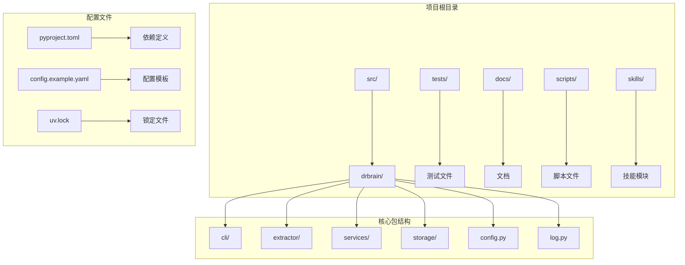
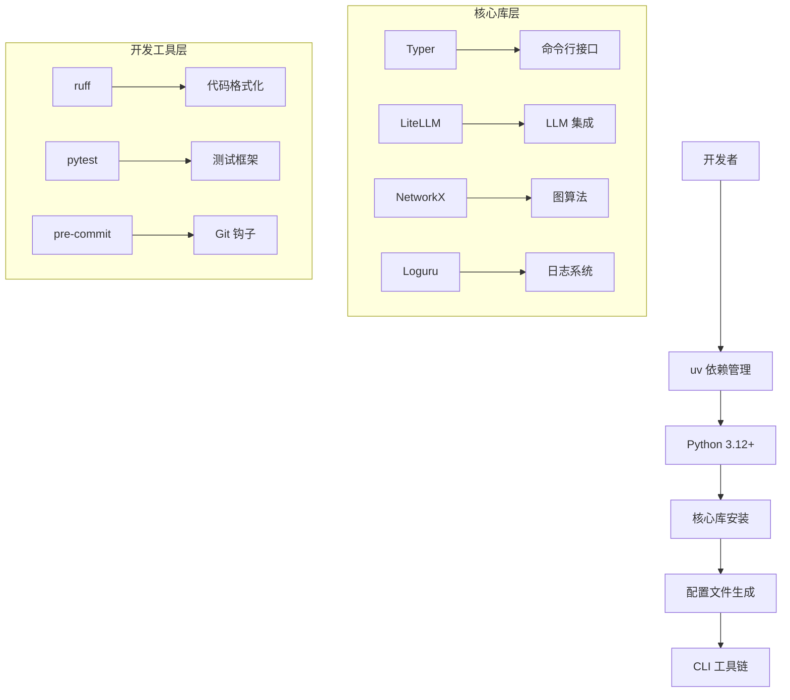
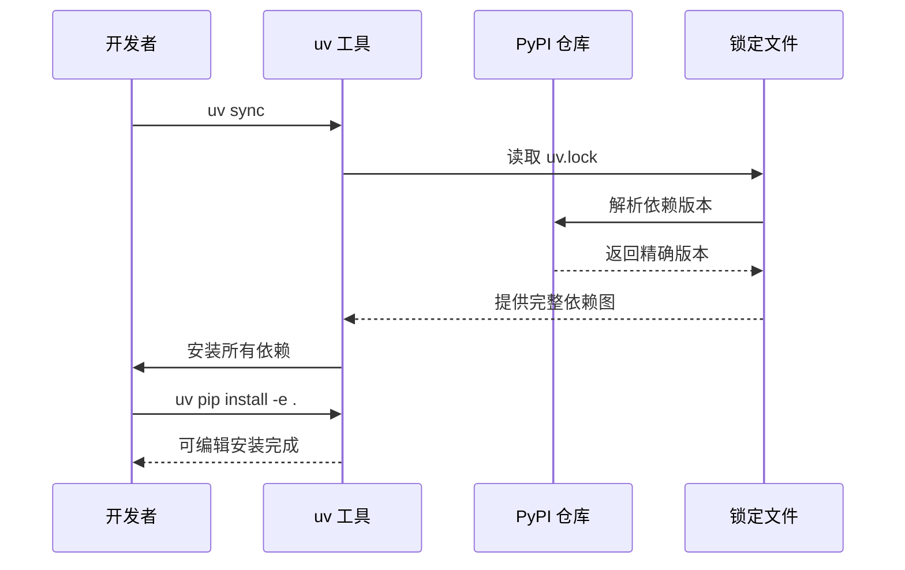
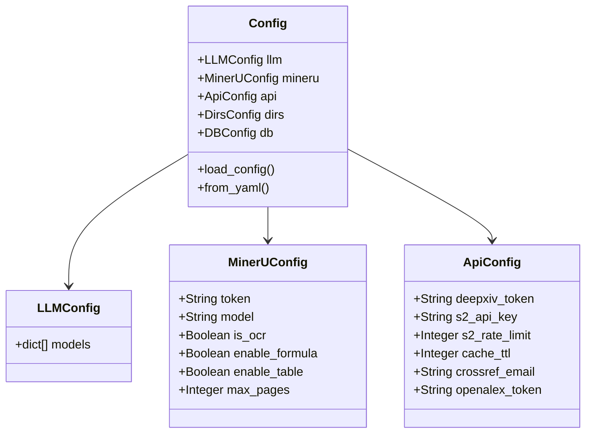
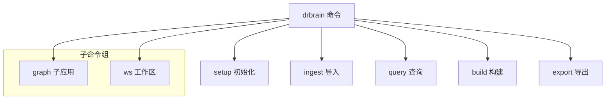
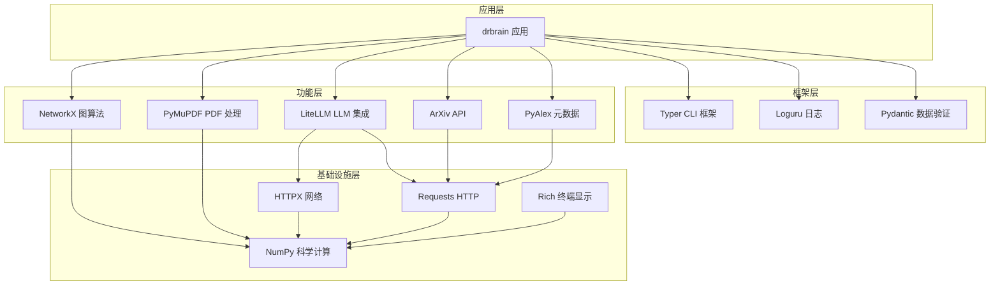
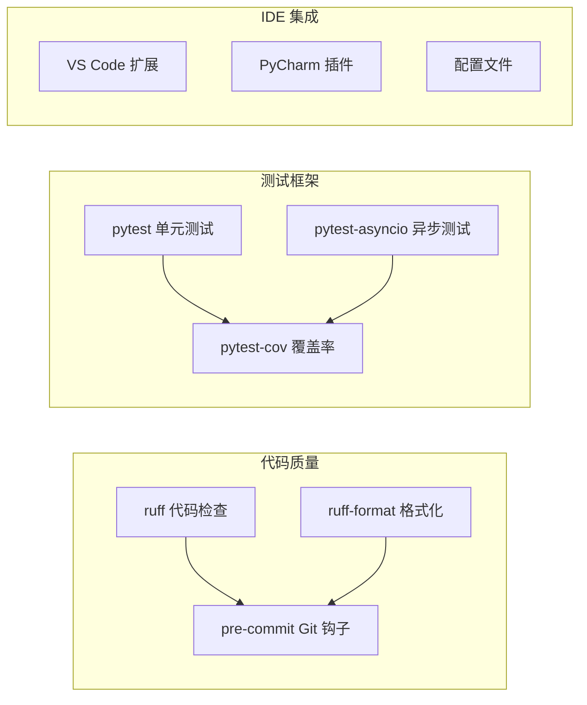
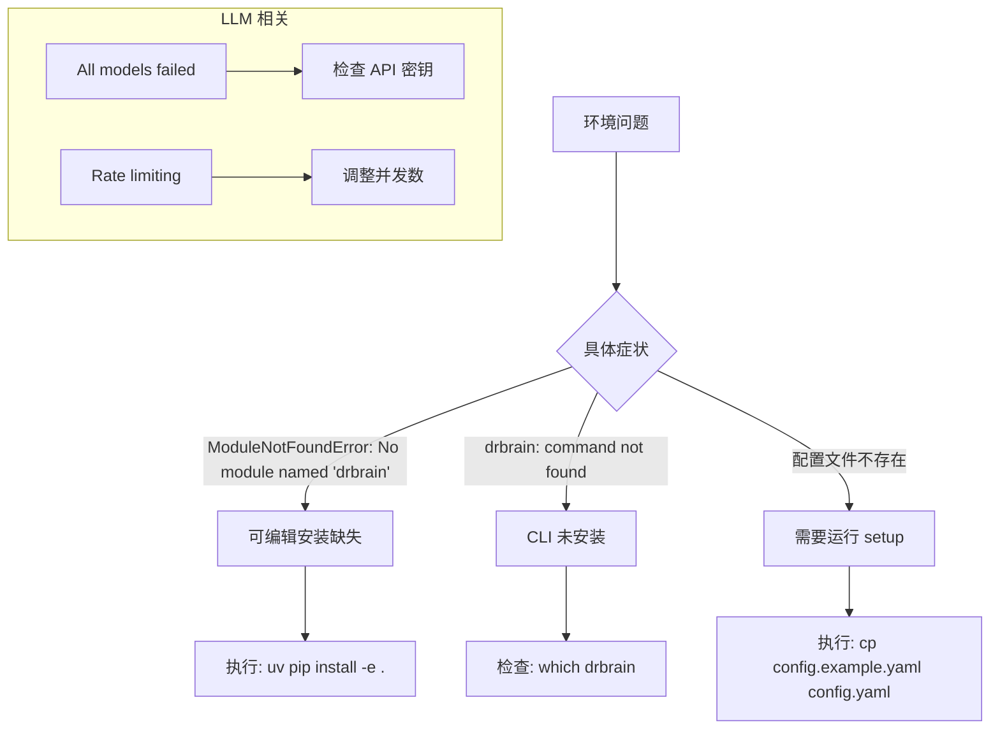

# 开发环境搭建

<cite>
**本文档引用的文件**
- [pyproject.toml](file://pyproject.toml)
- [README.md](file://README.md)
- [scripts/setup.sh](file://scripts/setup.sh)
- [config.example.yaml](file://config.example.yaml)
- [uv.lock](file://uv.lock)
- [.pre-commit-config.yaml](file://.pre-commit-config.yaml)
- [CONTRIBUTING.md](file://CONTRIBUTING.md)
- [docs/troubleshooting.md](file://docs/troubleshooting.md)
- [src/drbrain/cli/main.py](file://src/drbrain/cli/main.py)
- [src/drbrain/config.py](file://src/drbrain/config.py)
- [src/drbrain/cli/setup.py](file://src/drbrain/cli/setup.py)
- [src/drbrain/log.py](file://src/drbrain/log.py)
</cite>

## 目录
1. [简介](#简介)
2. [项目结构](#项目结构)
3. [核心组件](#核心组件)
4. [架构概览](#架构概览)
5. [详细组件分析](#详细组件分析)
6. [依赖关系分析](#依赖关系分析)
7. [性能考虑](#性能考虑)
8. [故障排除指南](#故障排除指南)
9. [结论](#结论)

## 简介

DrBrain 是一个学术知识图谱系统，采用符号驱动的研究发现方法。本指南专注于为开发者提供完整的开发环境搭建方案，涵盖依赖管理工具 uv 的使用、Python 版本要求、核心库安装、开发工具配置以及 LLM API 密钥配置等关键内容。

## 项目结构

DrBrain 项目采用模块化的组织方式，主要包含以下关键目录：

**图表来源**
- [pyproject.toml:1-104](file://pyproject.toml#L1-L104)
- [src/drbrain/cli/main.py:1-150](file://src/drbrain/cli/main.py#L1-L150)

**章节来源**
- [pyproject.toml:1-104](file://pyproject.toml#L1-L104)
- [README.md:1-112](file://README.md#L1-L112)

## 核心组件

### 依赖管理工具 uv

DrBrain 使用 uv 作为主要的依赖管理工具，提供了快速、可靠的包安装和同步功能：

- **安装**: `pipx install uv`
- **同步**: `uv sync`
- **可编辑安装**: `uv pip install -e .`
- **运行命令**: `uv run drbrain`

### Python 版本要求

项目明确要求 Python 3.12+ 版本：

- 最低版本: Python 3.12
- 开发环境: Python 3.12
- 兼容性: 支持多个 Python 版本标记

### 核心依赖库

项目依赖包括以下关键库：

- **CLI 框架**: Typer (0.15+) - 命令行界面构建
- **网络请求**: httpx[socks] (0.27+) - 异步 HTTP 客户端
- **LLM 集成**: LiteLLM (1.50+) - 统一的 LLM API 接口
- **数据处理**: NetworkX (3.4+) - 图论算法
- **日志管理**: Loguru (0.7.3+) - 结构化日志
- **科学计算**: NumPy (1.26+) - 数值计算基础

**章节来源**
- [pyproject.toml:32-51](file://pyproject.toml#L32-L51)
- [pyproject.toml:7-28](file://pyproject.toml#L7-L28)

## 架构概览

DrBrain 的开发环境架构采用分层设计：

**图表来源**
- [pyproject.toml:62-67](file://pyproject.toml#L62-L67)
- [pyproject.toml:83-96](file://pyproject.toml#L83-L96)

## 详细组件分析

### 依赖管理流程

**图表来源**
- [scripts/setup.sh:6-7](file://scripts/setup.sh#L6-L7)
- [CONTRIBUTING.md:11-12](file://CONTRIBUTING.md#L11-L12)

### 配置管理系统

DrBrain 采用分层配置系统：

**图表来源**
- [src/drbrain/config.py:44-193](file://src/drbrain/config.py#L44-L193)

**章节来源**
- [src/drbrain/config.py:195-292](file://src/drbrain/config.py#L195-L292)
- [config.example.yaml:9-145](file://config.example.yaml#L9-L145)

### CLI 命令系统

DrBrain 的 CLI 采用 Typer 框架构建：

**图表来源**
- [src/drbrain/cli/main.py:77-146](file://src/drbrain/cli/main.py#L77-L146)

**章节来源**
- [src/drbrain/cli/main.py:10-150](file://src/drbrain/cli/main.py#L10-L150)

## 依赖关系分析

### 核心依赖层次

**图表来源**
- [pyproject.toml:32-51](file://pyproject.toml#L32-L51)
- [uv.lock:392-416](file://uv.lock#L392-L416)

### 开发工具链

**图表来源**
- [.pre-commit-config.yaml:1-17](file://.pre-commit-config.yaml#L1-L17)
- [pyproject.toml:62-67](file://pyproject.toml#L62-L67)

**章节来源**
- [pyproject.toml:83-103](file://pyproject.toml#L83-L103)
- [.pre-commit-config.yaml:1-17](file://.pre-commit-config.yaml#L1-L17)

## 性能考虑

### 依赖解析优化

- **锁定文件**: 使用 uv.lock 确保依赖版本一致性
- **增量安装**: uv 支持增量安装，避免重复下载
- **缓存机制**: 利用 pip 缓存加速安装过程

### 内存使用优化

- **嵌入模型**: 支持本地和云端两种嵌入模式
- **批量处理**: 可配置批量大小以平衡内存使用
- **设备选择**: 自动选择最佳硬件加速选项

## 故障排除指南

### 常见环境问题

**图表来源**
- [docs/troubleshooting.md:7-32](file://docs/troubleshooting.md#L7-L32)

### LLM API 配置

支持多种 LLM 提供商：

- **OpenAI**: gpt-4o, gpt-4.1, gpt-4.1-mini, o4-mini
- **Anthropic**: claude-opus-4-7, claude-sonnet-4-6, claude-haiku-4-5
- **DeepSeek**: deepseek-v4-pro, deepseek-v4-flash
- **本地部署**: Ollama, vLLM, SGLang, LocalAI

**章节来源**
- [docs/troubleshooting.md:61-84](file://docs/troubleshooting.md#L61-L84)
- [config.example.yaml:14-66](file://config.example.yaml#L14-L66)

## 结论

DrBrain 的开发环境搭建相对简洁，主要依赖于 uv 依赖管理工具和标准的 Python 包管理。通过遵循本文档的步骤，开发者可以快速建立完整的开发环境。关键要点包括：

1. **版本要求**: 确保使用 Python 3.12+
2. **依赖管理**: 使用 uv 进行依赖同步和安装
3. **配置管理**: 通过 config.local.yaml 管理环境配置
4. **开发工具**: 集成 ruff、pytest 和 pre-commit 工具链
5. **LLM 集成**: 支持多种 LLM 提供商和本地部署选项

建议开发者在开始项目开发前，先完成环境搭建并运行 `drbrain check` 命令验证配置正确性。