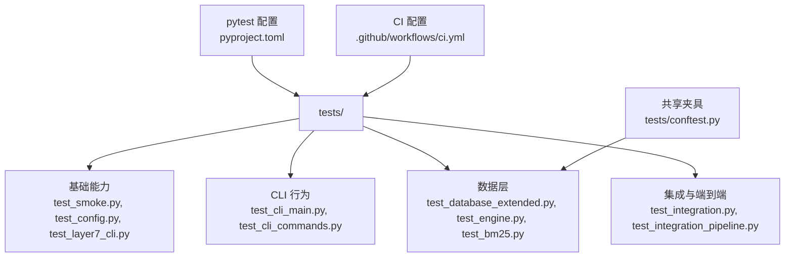
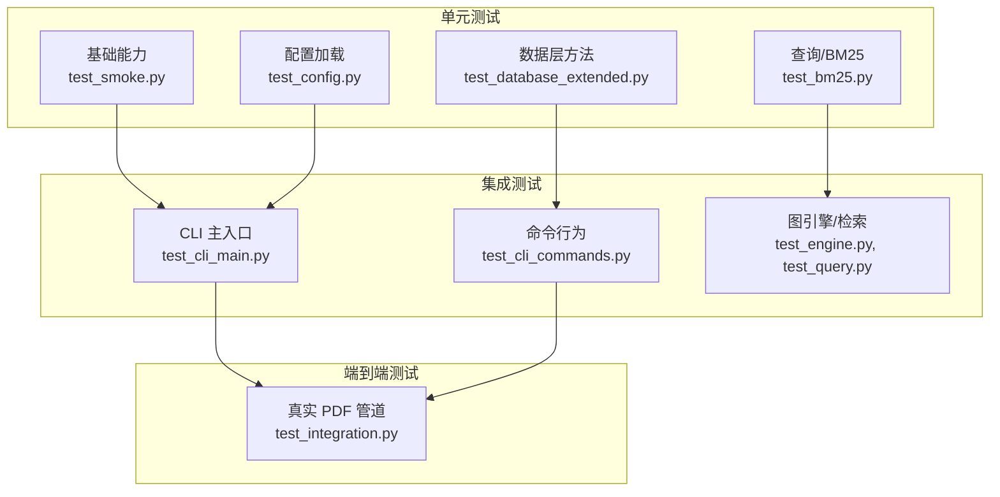
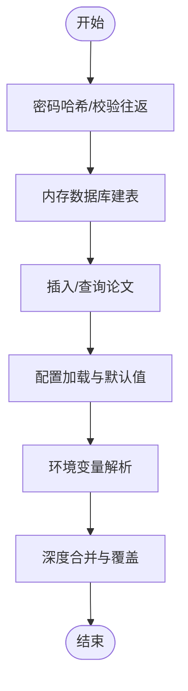
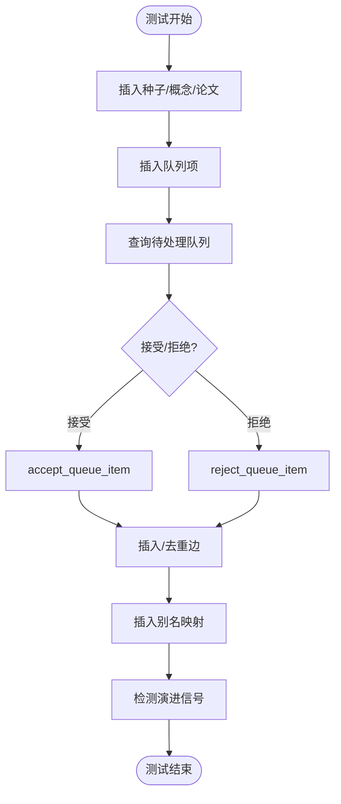
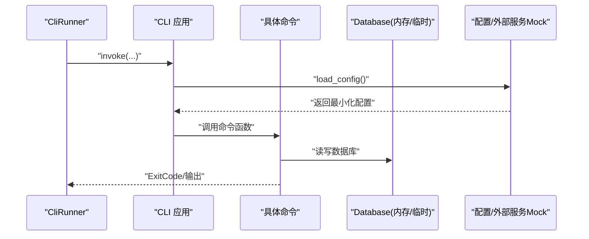
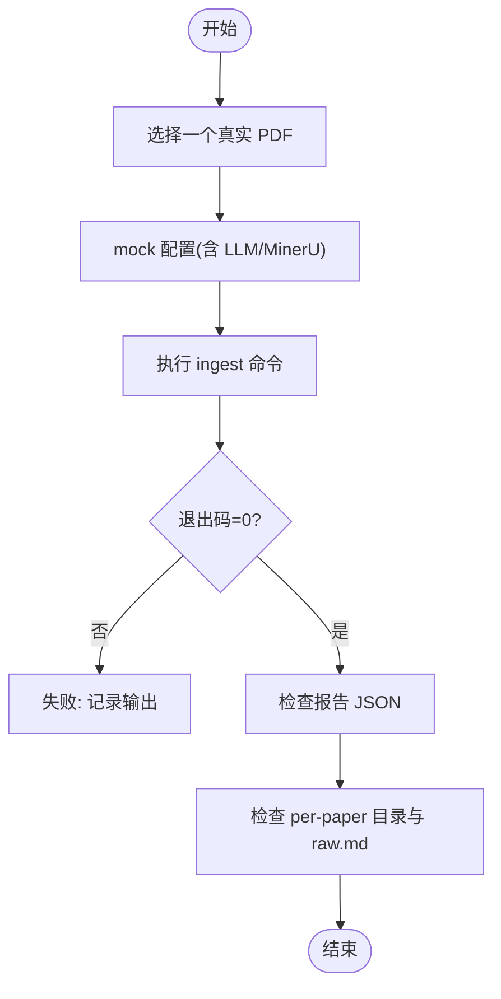
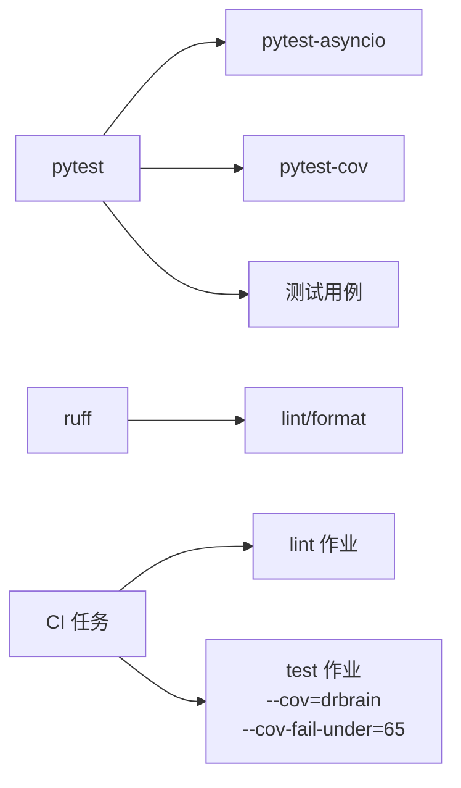

# 测试策略

<cite>
**本文引用的文件**
- [tests/conftest.py](file://tests/conftest.py)
- [pyproject.toml](file://pyproject.toml)
- [.github/workflows/ci.yml](file://.github/workflows/ci.yml)
- [tests/test_smoke.py](file://tests/test_smoke.py)
- [tests/test_cli_main.py](file://tests/test_cli_main.py)
- [tests/test_cli_commands.py](file://tests/test_cli_commands.py)
- [tests/test_integration.py](file://tests/test_integration.py)
- [tests/test_database_extended.py](file://tests/test_database_extended.py)
- [tests/test_config.py](file://tests/test_config.py)
- [tests/test_layer7_cli.py](file://tests/test_layer7_cli.py)
</cite>

## 目录
1. [引言](#引言)
2. [项目结构](#项目结构)
3. [核心组件](#核心组件)
4. [架构总览](#架构总览)
5. [详细组件分析](#详细组件分析)
6. [依赖分析](#依赖分析)
7. [性能考虑](#性能考虑)
8. [故障排查指南](#故障排查指南)
9. [结论](#结论)
10. [附录](#附录)

## 引言
本测试策略文档面向 DrBrain 项目，系统化阐述测试架构与实践，覆盖单元测试、集成测试与端到端测试的组织方式；详解 pytest 框架的使用与标记体系；记录测试数据库（内存数据库与临时文件数据库）的配置与使用；提供测试用例编写指南（测试数据准备、断言模式、测试隔离）；说明如何针对 CLI 命令、服务层与核心模块编写测试；明确测试覆盖率要求与持续集成配置；并给出测试调试技巧与性能测试方法。

## 项目结构
- 测试目录 tests/ 下按功能域分层组织，包含：
  - 基础能力：smoke、config、layer7_cli 等
  - CLI 行为：cli_main、cli_commands、graph_commands 等
  - 数据层：database_extended、engine、query、graph_engine 等
  - 集成与端到端：integration、integration_pipeline 等
- 共享夹具与配置集中在 tests/conftest.py 与 pyproject.toml 的 pytest 配置中。

**图示来源**
- [tests/conftest.py:1-41](file://tests/conftest.py#L1-L41)
- [pyproject.toml:98-104](file://pyproject.toml#L98-L104)
- [.github/workflows/ci.yml:1-38](file://.github/workflows/ci.yml#L1-L38)

**章节来源**
- [tests/conftest.py:1-41](file://tests/conftest.py#L1-L41)
- [pyproject.toml:98-104](file://pyproject.toml#L98-L104)
- [.github/workflows/ci.yml:1-38](file://.github/workflows/ci.yml#L1-L38)

## 核心组件
- 测试运行器与标记
  - 使用 pytest，启用 asyncio 自动模式，支持自定义标记“integration”用于慢速端到端测试。
- 共享夹具
  - tmp_db：自动创建临时目录中的 SQLite 文件库，测试结束后自动关闭，适合数据层与服务层测试。
  - cfg_dict：最小化配置字典，常用于不需要真实外部资源的测试。
- 覆盖率与 CI
  - CI 中通过 pytest 的覆盖率报告与失败阈值（65%）强制质量门禁。

**章节来源**
- [pyproject.toml:98-104](file://pyproject.toml#L98-L104)
- [tests/conftest.py:13-40](file://tests/conftest.py#L13-L40)
- [.github/workflows/ci.yml:27-38](file://.github/workflows/ci.yml#L27-L38)

## 架构总览
下图展示测试金字塔与各层级职责映射：

**图示来源**
- [tests/test_smoke.py:1-44](file://tests/test_smoke.py#L1-L44)
- [tests/test_config.py:1-465](file://tests/test_config.py#L1-L465)
- [tests/test_database_extended.py:1-417](file://tests/test_database_extended.py#L1-L417)
- [tests/test_cli_main.py:1-182](file://tests/test_cli_main.py#L1-L182)
- [tests/test_cli_commands.py:1-800](file://tests/test_cli_commands.py#L1-L800)
- [tests/test_integration.py:1-95](file://tests/test_integration.py#L1-L95)

## 详细组件分析

### 单元测试：基础能力与配置
- 目标
  - 快速验证核心模块基本行为，不依赖外部资源。
- 关键点
  - 密码哈希/校验往返测试，确保鉴权流程可用。
  - 内存数据库建表与 CRUD 行为，确保 schema 正确。
  - 配置类默认值、字典兼容访问、YAML 加载、环境变量替换、合并策略等。
- 断言模式
  - 真值断言、字段存在性断言、类型断言、值相等断言。
- 隔离策略
  - 使用内存数据库或临时文件数据库；必要时使用 mock.patch 替换外部调用。

**图示来源**
- [tests/test_smoke.py:8-44](file://tests/test_smoke.py#L8-L44)
- [tests/test_config.py:26-325](file://tests/test_config.py#L26-L325)

**章节来源**
- [tests/test_smoke.py:1-44](file://tests/test_smoke.py#L1-L44)
- [tests/test_config.py:1-465](file://tests/test_config.py#L1-L465)

### 单元测试：数据层与服务层
- 目标
  - 验证数据库方法、队列生命周期、别名与种子管理、演进信号检测等。
- 关键点
  - 使用 tmp_db 夹具，确保每个测试在独立临时数据库中执行，避免状态污染。
  - 验证去重边、别名映射、种子增删、队列接受/拒绝、体积页字段等。
- 断言模式
  - 计数断言、存在性断言、状态断言、字段断言。
- 隔离策略
  - 每个测试前后清理临时目录与数据库连接；必要时显式 commit/rollback。

**图示来源**
- [tests/test_database_extended.py:7-166](file://tests/test_database_extended.py#L7-L166)
- [tests/test_database_extended.py:168-252](file://tests/test_database_extended.py#L168-L252)
- [tests/test_database_extended.py:254-417](file://tests/test_database_extended.py#L254-L417)

**章节来源**
- [tests/test_database_extended.py:1-417](file://tests/test_database_extended.py#L1-L417)

### 集成测试：CLI 命令与主入口
- 目标
  - 验证 CLI 主入口与各命令的行为边界、错误路径与输出格式。
- 关键点
  - 使用 Typer 的 CliRunner 与 mock.patch 替换配置加载，避免真实外部依赖。
  - 针对 citations、check-citations、report、closure、seed、list、stats、query、export、queue 等命令进行参数校验与错误码断言。
- 断言模式
  - 退出码断言、标准输出/错误断言、JSON 输出断言。
- 隔离策略
  - 每个测试使用独立临时目录与数据库文件；对命令上下文进行最小化 mock。

**图示来源**
- [tests/test_cli_main.py:14-36](file://tests/test_cli_main.py#L14-L36)
- [tests/test_cli_main.py:38-182](file://tests/test_cli_main.py#L38-L182)
- [tests/test_cli_commands.py:13-35](file://tests/test_cli_commands.py#L13-L35)
- [tests/test_cli_commands.py:37-42](file://tests/test_cli_commands.py#L37-L42)

**章节来源**
- [tests/test_cli_main.py:1-182](file://tests/test_cli_main.py#L1-L182)
- [tests/test_cli_commands.py:1-800](file://tests/test_cli_commands.py#L1-L800)

### 端到端测试：真实 PDF 管道
- 目标
  - 使用真实 PDF 进行完整管道验证（解析→抽取→存储→报告），标记为“integration”，需显式运行。
- 关键点
  - 通过标记选择性运行；mock 配置以保留真实 LLM/MinerU 调用，但控制输入源。
  - 断言生成报告内容与产物目录结构。
- 断言模式
  - 退出码断言、报告 JSON 结构断言、产物目录存在性断言。
- 隔离策略
  - 每个 PDF 输入独立临时工作空间；严格清理中间产物。

**图示来源**
- [tests/test_integration.py:27-58](file://tests/test_integration.py#L27-L58)
- [tests/test_integration.py:61-95](file://tests/test_integration.py#L61-L95)

**章节来源**
- [tests/test_integration.py:1-95](file://tests/test_integration.py#L1-L95)

### 层间测试：CLI 增强与图命令
- 目标
  - 验证新增 CLI 命令与图命令的可发现性、参数标志位与上下文增强能力。
- 关键点
  - 函数可调用性验证；图命令对节级溯源的上下文增强。
- 断言模式
  - 可调用性断言、上下文字段断言。

**章节来源**
- [tests/test_layer7_cli.py:1-103](file://tests/test_layer7_cli.py#L1-L103)

## 依赖分析
- 测试框架与工具
  - pytest、pytest-asyncio、pytest-cov、ruff（lint/format）
- 标记与忽略
  - integration 标记用于慢速端到端测试；pytest.ini 中忽略特定目录。
- CI 任务
  - lint：ruff 检查与格式检查
  - test：pytest 运行非 integration 测试，并开启覆盖率统计与失败阈值

**图示来源**
- [pyproject.toml:62-67](file://pyproject.toml#L62-L67)
- [pyproject.toml:98-104](file://pyproject.toml#L98-L104)
- [.github/workflows/ci.yml:14-38](file://.github/workflows/ci.yml#L14-L38)

**章节来源**
- [pyproject.toml:62-67](file://pyproject.toml#L62-L67)
- [pyproject.toml:98-104](file://pyproject.toml#L98-L104)
- [.github/workflows/ci.yml:14-38](file://.github/workflows/ci.yml#L14-L38)

## 性能考虑
- 测试执行顺序与并发
  - 使用 asyncio 自动模式，避免手动事件循环管理；合理拆分测试，避免长串同步阻塞。
- 数据库性能
  - 单元测试优先使用内存数据库；需要持久化时使用临时文件数据库，减少磁盘 IO。
- 外部依赖
  - 尽量通过 mock 控制外部 API/模型调用，避免真实网络与计算开销。
- 覆盖率与回归
  - CI 中设置覆盖率失败阈值，推动高覆盖率与高质量测试。

[本节为通用指导，无需列出具体文件来源]

## 故障排查指南
- 常见问题
  - 配置加载失败：检查最小化配置字典是否包含必需键；确认环境变量替换是否生效。
  - CLI 命令异常：确认使用了正确的上下文对象与最小化配置；检查退出码与输出。
  - 端到端测试失败：确认 PDF 输入路径与权限；检查 mock 配置是否正确注入。
- 调试技巧
  - 在测试中打印关键中间状态（如数据库查询结果、命令输出）。
  - 使用更小的测试集快速定位问题（仅运行相关命令或数据层测试）。
  - 对外部依赖使用细粒度 patch，缩小问题范围。
- 覆盖率分析
  - 在本地运行 pytest 并查看缺失行，补充针对性测试。

**章节来源**
- [tests/test_cli_main.py:38-182](file://tests/test_cli_main.py#L38-L182)
- [tests/test_cli_commands.py:13-800](file://tests/test_cli_commands.py#L13-L800)
- [tests/test_integration.py:61-95](file://tests/test_integration.py#L61-L95)

## 结论
DrBrain 的测试策略采用“单元→集成→端到端”的分层设计，结合 pytest 标记、共享夹具与 CI 覆盖率门禁，确保代码质量与稳定性。建议持续扩展 CLI 与核心模块的测试覆盖面，强化边界条件与错误路径，保持测试执行效率与可维护性。

[本节为总结，无需列出具体文件来源]

## 附录

### 测试数据库使用指南
- 内存数据库
  - 适用于无需持久化的轻量测试；通过内存路径初始化数据库。
- 临时文件数据库
  - 使用 tmp_db 夹具，自动创建临时目录与数据库文件，测试结束后自动关闭。
- 配置要点
  - 在测试中优先使用最小化配置字典，避免真实外部依赖；必要时通过 mock.patch 注入。

**章节来源**
- [tests/conftest.py:13-40](file://tests/conftest.py#L13-L40)
- [tests/test_smoke.py:16-37](file://tests/test_smoke.py#L16-L37)
- [tests/test_database_extended.py:7-166](file://tests/test_database_extended.py#L7-L166)

### 测试用例编写指南
- 测试数据准备
  - 使用最小化配置字典或临时数据库；需要真实数据时，先插入种子数据再断言。
- 断言模式
  - 字段存在性、值相等、计数、状态、异常抛出与退出码。
- 测试隔离
  - 每个测试使用独立临时目录与数据库；避免全局状态共享。
- 针对不同层次
  - CLI：使用 CliRunner 与最小化配置；断言退出码与输出。
  - 服务层：依赖夹具与 mock；断言业务逻辑分支。
  - 核心模块：纯函数与数据结构测试，强调边界与异常路径。

**章节来源**
- [tests/test_cli_main.py:14-36](file://tests/test_cli_main.py#L14-L36)
- [tests/test_cli_commands.py:13-35](file://tests/test_cli_commands.py#L13-L35)
- [tests/test_database_extended.py:7-166](file://tests/test_database_extended.py#L7-L166)

### 持续集成与覆盖率
- CI 任务
  - lint：ruff 检查与格式检查
  - test：运行非 integration 测试，开启覆盖率统计并设置失败阈值
- 覆盖率要求
  - 通过覆盖率失败阈值强制提升整体覆盖率

**章节来源**
- [.github/workflows/ci.yml:14-38](file://.github/workflows/ci.yml#L14-L38)
- [pyproject.toml:98-104](file://pyproject.toml#L98-L104)