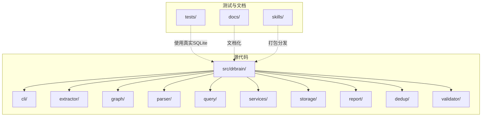
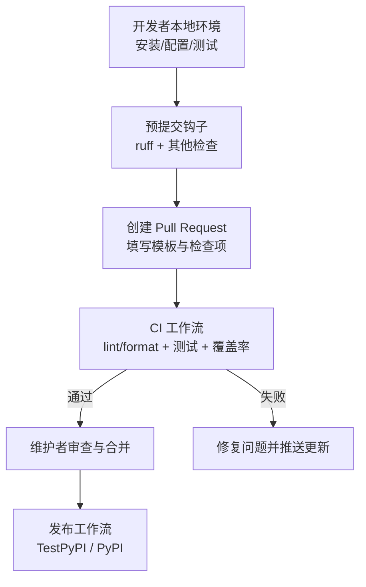
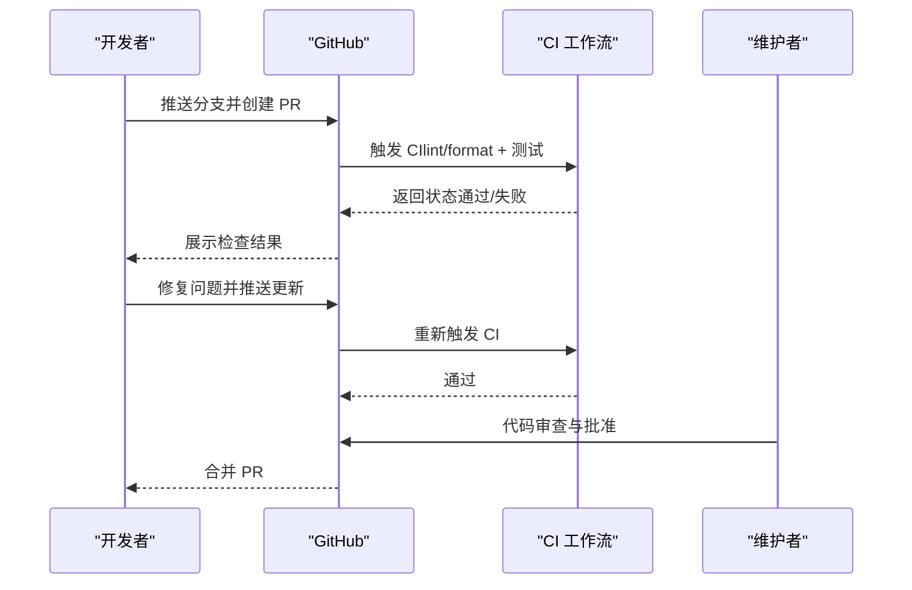
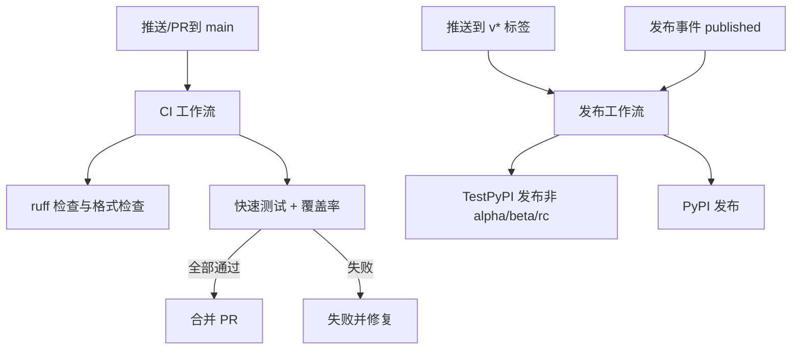
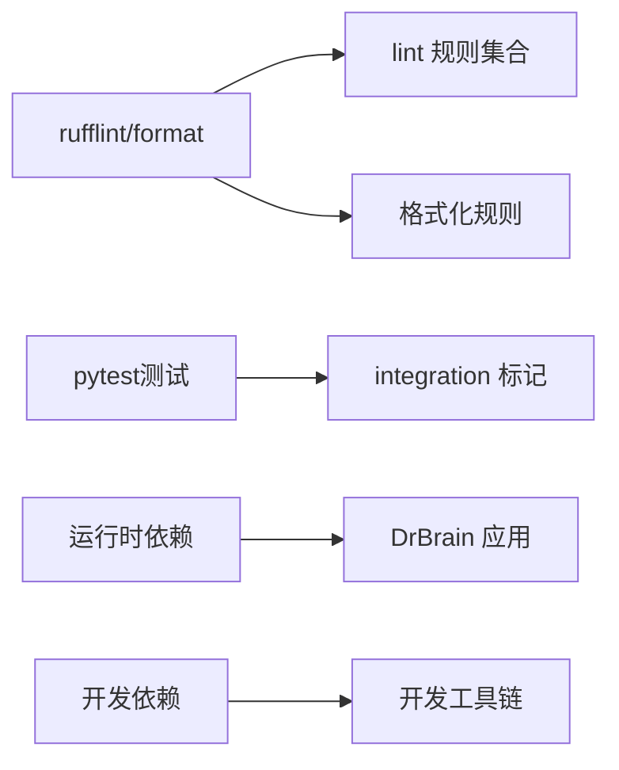

# 贡献流程

<cite>
**本文引用的文件**
- [CONTRIBUTING.md](file://CONTRIBUTING.md)
- [docs/contributing.md](file://docs/contributing.md)
- [docs/getting-started.md](file://docs/getting-started.md)
- [.github/PULL_REQUEST_TEMPLATE.md](file://.github/PULL_REQUEST_TEMPLATE.md)
- [.github/workflows/ci.yml](file://.github/workflows/ci.yml)
- [.github/workflows/publish.yml](file://.github/workflows/publish.yml)
- [pyproject.toml](file://pyproject.toml)
- [.pre-commit-config.yaml](file://.pre-commit-config.yaml)
- [CODE_OF_CONDUCT.md](file://CODE_OF_CONDUCT.md)
- [SECURITY.md](file://SECURITY.md)
- [CHANGELOG.md](file://CHANGELOG.md)
</cite>

## 目录
1. [简介](#简介)
2. [项目结构](#项目结构)
3. [核心组件](#核心组件)
4. [架构总览](#架构总览)
5. [详细组件分析](#详细组件分析)
6. [依赖关系分析](#依赖关系分析)
7. [性能考量](#性能考量)
8. [故障排查指南](#故障排查指南)
9. [结论](#结论)
10. [附录](#附录)

## 简介
本指南面向希望为 DrBrain 做出贡献的新老贡献者，覆盖从 fork 仓库到提交 Pull Request 的完整流程；解释分支管理策略与命名规范；记录 PR 的创建、审查与合并流程；提供代码审查标准与检查清单；说明冲突处理与更新代码的方法；并介绍社区参与方式（问题报告、功能请求、讨论参与）、项目治理与决策流程，以及新贡献者的入门指导与资源链接。

## 项目结构
- 源码位于 src/drbrain/，包含 CLI、抽取器、图引擎、解析器、查询、服务、存储、报告、去重、校验器等模块。
- 测试位于 tests/，使用真实 SQLite 数据库，不进行数据库层模拟。
- 文档位于 docs/，包含入门、CLI 参考、配置、架构、嵌入、故障排查、术语表与贡献指南。
- 技能（AgentSkills.io）位于 skills/，并与主包打包分发。
- 开发工具与质量保障：ruff（lint/format）、pytest（测试）、GitHub Actions（CI/发布）、pre-commit 钩子。

**章节来源**
- [docs/contributing.md:1-130](file://docs/contributing.md#L1-L130)

## 核心组件
- 贡献流程与开发设置：参考贡献指南与入门文档，明确安装、配置、验证步骤与开发命令。
- 提交规范：遵循 Conventional Commits；PR 模板包含类型选择与检查清单。
- 质量门禁：CI 中包含 lint 与格式检查、覆盖率阈值、测试执行；发布工作流支持 TestPyPI 与 PyPI 发布。
- 社区行为准则与安全策略：明确行为标准、举报渠道与漏洞披露流程。

**章节来源**
- [CONTRIBUTING.md:24-81](file://CONTRIBUTING.md#L24-L81)
- [.github/PULL_REQUEST_TEMPLATE.md:1-18](file://.github/PULL_REQUEST_TEMPLATE.md#L1-L18)
- [.github/workflows/ci.yml:1-38](file://.github/workflows/ci.yml#L1-L38)
- [.github/workflows/publish.yml:1-51](file://.github/workflows/publish.yml#L1-L51)
- [CODE_OF_CONDUCT.md:1-57](file://CODE_OF_CONDUCT.md#L1-L57)
- [SECURITY.md:1-35](file://SECURITY.md#L1-L35)

## 架构总览
下图展示贡献者从本地开发到 PR 合并的关键路径，包括本地检查、CI 自动化与发布流程。

**图表来源**
- [.github/workflows/ci.yml:13-38](file://.github/workflows/ci.yml#L13-L38)
- [.github/workflows/publish.yml:9-51](file://.github/workflows/publish.yml#L9-L51)
- [.pre-commit-config.yaml:1-17](file://.pre-commit-config.yaml#L1-L17)

## 详细组件分析

### 分支管理策略与命名规范
- 默认保护分支：main。
- 功能开发建议从 main 分支派生特性分支；未在贡献指南中给出强制命名规范，建议采用清晰语义的前缀（如 feature/、fix/、docs/、chore/），以配合 Conventional Commits 类型使用。
- 合并策略：通过 PR 审查后由维护者合并至 main。

**章节来源**
- [CONTRIBUTING.md:26](file://CONTRIBUTING.md#L26)

### 提交信息与变更日志
- 使用 Conventional Commits 类型：feat、fix、docs、refactor、test、chore 等。
- 变更日志遵循 Keep a Changelog，并与 Conventional Commits 对齐，便于生成版本发布说明。

**章节来源**
- [CONTRIBUTING.md:37-47](file://CONTRIBUTING.md#L37-L47)
- [CHANGELOG.md:1-10](file://CHANGELOG.md#L1-L10)

### Pull Request 创建、审查与合并
- 创建 PR：基于 main 分支创建功能分支，提交 PR 并按模板勾选检查项。
- 审查要点：确保本地已通过 lint/format、快速测试、全量测试；文档与 CLI 参考更新；必要时补充测试。
- 合并条件：CI 通过、覆盖率达标、至少一名维护者批准。

**图表来源**
- [.github/workflows/ci.yml:13-38](file://.github/workflows/ci.yml#L13-L38)
- [.github/PULL_REQUEST_TEMPLATE.md:13-18](file://.github/PULL_REQUEST_TEMPLATE.md#L13-L18)

**章节来源**
- [CONTRIBUTING.md:24-36](file://CONTRIBUTING.md#L24-L36)
- [.github/PULL_REQUEST_TEMPLATE.md:1-18](file://.github/PULL_REQUEST_TEMPLATE.md#L1-L18)

### 代码风格与测试指南
- 代码风格：ruff（lint/format）；Google 风格 docstring；英文注释与文档；类型提示鼓励使用。
- 测试指南：关注行为契约而非实现细节；重构不应破坏测试；使用 pytest fixture；慢测试标记 @pytest.mark.integration；直接调用函数进行测试，避免外部进程。
- 开发命令：uv run ruff check/format、uv run pytest 快速/全量测试、覆盖率统计。

**章节来源**
- [CONTRIBUTING.md:48-61](file://CONTRIBUTING.md#L48-L61)
- [docs/contributing.md:269-286](file://docs/contributing.md#L269-L286)
- [pyproject.toml:83-104](file://pyproject.toml#L83-L104)

### 预提交钩子与本地检查
- 预提交钩子：ruff 检查与格式化、YAML/JSON 校验、尾随空白与文件结尾修正、大文件检测。
- 建议在本地安装并启用钩子，减少 CI 失败概率。

**章节来源**
- [.pre-commit-config.yaml:1-17](file://.pre-commit-config.yaml#L1-L17)
- [CONTRIBUTING.md:14-22](file://CONTRIBUTING.md#L14-L22)

### CI 与发布流程
- CI：在 push 与 pull_request 到 main 时触发；运行 ruff lint/format 检查与快速测试；设置并发组与取消策略；覆盖率阈值与失败门槛。
- 发布：对标签（v*）与发布事件触发；TestPyPI 用于非 alpha/beta/rc 版本；PyPI 发布需发布事件被 published。

**图表来源**
- [.github/workflows/ci.yml:3-11](file://.github/workflows/ci.yml#L3-L11)
- [.github/workflows/ci.yml:13-38](file://.github/workflows/ci.yml#L13-L38)
- [.github/workflows/publish.yml:3-8](file://.github/workflows/publish.yml#L3-L8)
- [.github/workflows/publish.yml:9-51](file://.github/workflows/publish.yml#L9-L51)

**章节来源**
- [.github/workflows/ci.yml:1-38](file://.github/workflows/ci.yml#L1-L38)
- [.github/workflows/publish.yml:1-51](file://.github/workflows/publish.yml#L1-L51)

### 冲突处理与更新代码
- 当本地分支落后于上游 main 时，优先在本地 rebase 或 merge main，解决冲突后再推送。
- 保持每次提交聚焦单一主题，便于审查与回滚。
- 若 CI 失败，先在本地复现并修复，再推送更新。

**章节来源**
- [CONTRIBUTING.md:26](file://CONTRIBUTING.md#L26)

### 社区参与与治理
- 行为准则：遵循 Contributor Covenant，明确正向与不当行为，提供举报渠道。
- 安全策略：禁止在公开 Issue 披露漏洞；通过邮件私下沟通，72 小时内响应。
- 问题与讨论：Bug 报告、功能请求与安全问题分别走不同渠道；讨论可在 Discussions 区域发起。

**章节来源**
- [CODE_OF_CONDUCT.md:1-57](file://CODE_OF_CONDUCT.md#L1-L57)
- [SECURITY.md:1-35](file://SECURITY.md#L1-L35)
- [CONTRIBUTING.md:72-81](file://CONTRIBUTING.md#L72-L81)

### 新贡献者入门
- 安装与配置：使用 uv 同步依赖并可编辑安装；运行 drbrain setup 初始化配置；使用 drbrain check 验证环境。
- 开发命令：快速测试、全量测试、单测执行、覆盖率统计、ruff 检查与格式化。
- 添加 CLI 命令与推理模块：遵循现有模式与约定，注册命令、编写测试、更新文档。

**章节来源**
- [docs/getting-started.md:9-87](file://docs/getting-started.md#L9-L87)
- [docs/contributing.md:132-158](file://docs/contributing.md#L132-L158)
- [docs/contributing.md:159-219](file://docs/contributing.md#L159-L219)
- [docs/contributing.md:220-268](file://docs/contributing.md#L220-L268)

## 依赖关系分析
- 开发依赖：pytest、pytest-asyncio、pytest-cov、ruff。
- 运行时依赖：arxiv、httpx、litellm、loguru、networkx、pydantic、pyalex、pymupdf、pymupdf4llm、pyyaml、numpy、rank-bm25、requests、rich、scikit-learn、typer、umap-learn、deepxiv-sdk 等。
- 工具配置：ruff（lint/format/line-length/排除目录）、pytest 标记 integration、构建目标 wheel、scripts 配置。

**图表来源**
- [pyproject.toml:61-67](file://pyproject.toml#L61-L67)
- [pyproject.toml:83-96](file://pyproject.toml#L83-L96)
- [pyproject.toml:98-104](file://pyproject.toml#L98-L104)

**章节来源**
- [pyproject.toml:1-104](file://pyproject.toml#L1-L104)

## 性能考量
- 测试性能：区分快速测试与集成测试，避免在 PR 中运行耗时的网络或 LLM 调用；使用 @pytest.mark.integration 标记慢测试。
- 代码质量：通过 ruff 统一风格与静态检查，减少审查成本与回归风险。
- CI 并发：利用 GitHub Actions 的并发组与取消策略，缩短等待时间。

**章节来源**
- [CONTRIBUTING.md:48-54](file://CONTRIBUTING.md#L48-L54)
- [.github/workflows/ci.yml:9-11](file://.github/workflows/ci.yml#L9-L11)

## 故障排查指南
- 本地检查失败
  - 确认已安装并启用预提交钩子。
  - 在本地运行 ruff check/format 与 pytest -m "not integration"，定位问题。
- CI 失败
  - 查看 CI 日志中的 lint/format 错误与测试失败详情。
  - 修复后推送更新，触发新的 CI。
- 覆盖率不达标
  - 补充针对新增逻辑的测试，确保关键路径被覆盖。
- 发布失败
  - 检查标签命名是否符合 v* 规范；确认发布事件状态为 published。

**章节来源**
- [.pre-commit-config.yaml:1-17](file://.pre-commit-config.yaml#L1-L17)
- [.github/workflows/ci.yml:13-38](file://.github/workflows/ci.yml#L13-L38)
- [.github/workflows/publish.yml:9-51](file://.github/workflows/publish.yml#L9-L51)

## 结论
本指南提供了 DrBrain 项目的完整贡献流程与最佳实践：从 fork 到 PR，从分支策略到提交规范，从代码审查到 CI/发布，再到社区参与与安全策略。建议新贡献者先完成本地开发与测试验证，再提交 PR；在审查过程中积极回应反馈，确保代码质量与一致性。

## 附录

### 代码审查标准与检查清单
- 代码风格：ruff 检查通过、格式化通过、docstring 符合 Google 风格、类型提示完善。
- 行为契约：测试覆盖新增/修改逻辑的行为契约，避免过度耦合实现细节。
- 性能与稳定性：避免引入慢测试；确保错误处理与边界情况覆盖。
- 文档与 CLI：新增命令更新 CLI 参考；架构变化更新架构文档；变更日志记录重要改动。
- 安全与合规：不提交敏感信息；遵循安全策略，私密披露漏洞。

**章节来源**
- [CONTRIBUTING.md:48-61](file://CONTRIBUTING.md#L48-L61)
- [docs/contributing.md:287-301](file://docs/contributing.md#L287-L301)
- [CHANGELOG.md:1-10](file://CHANGELOG.md#L1-L10)
- [SECURITY.md:9-19](file://SECURITY.md#L9-L19)