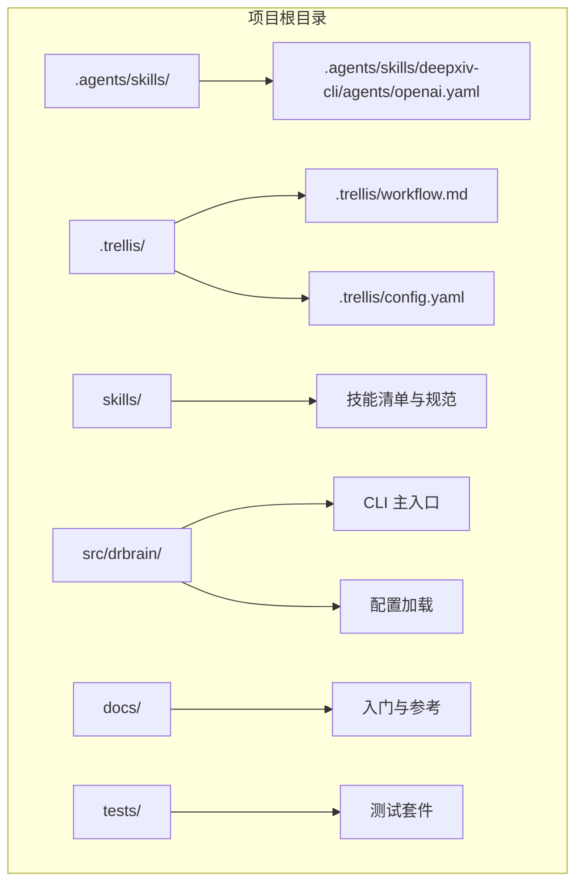
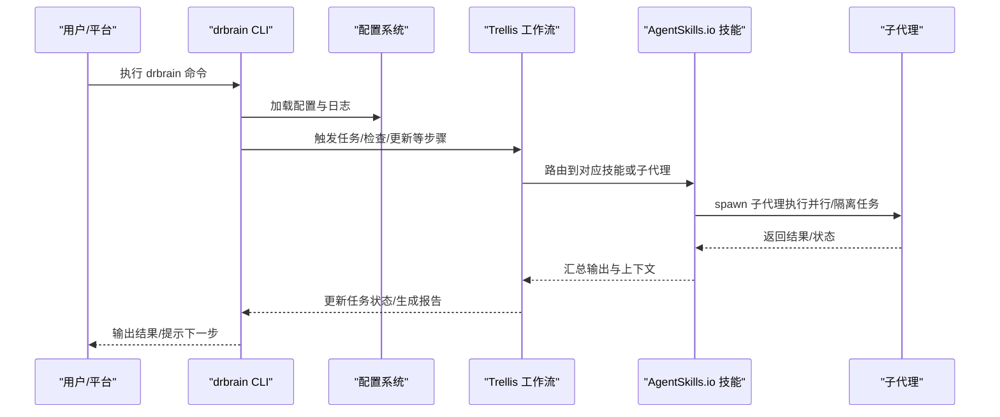
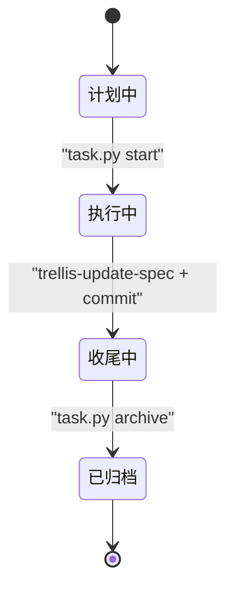
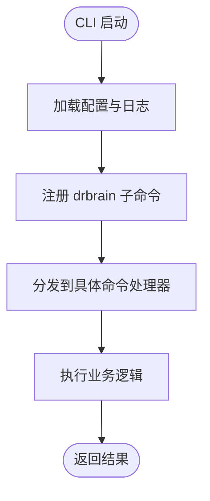
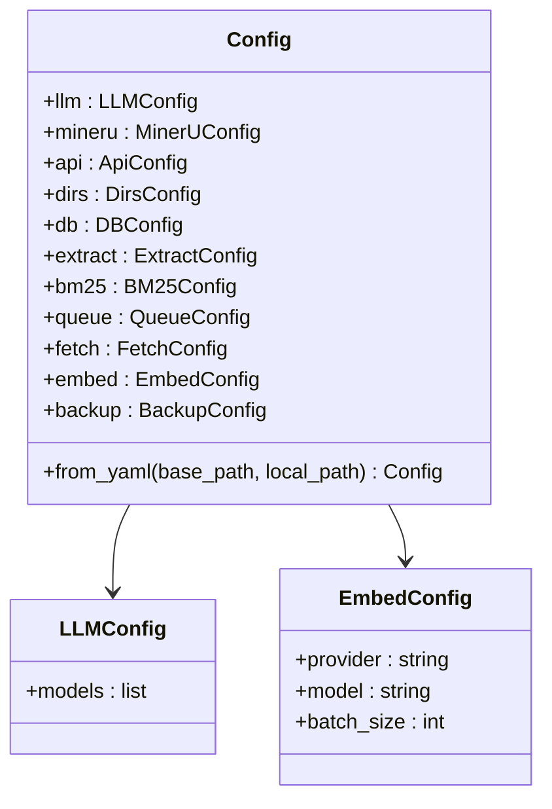
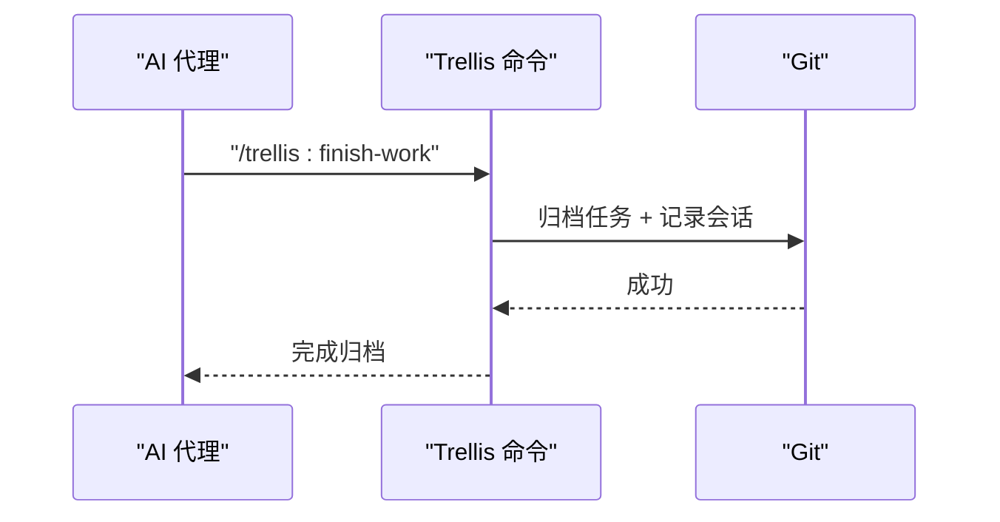
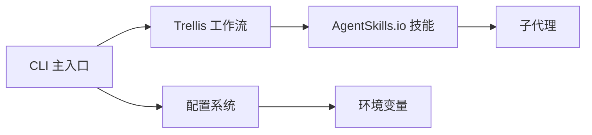

# AgentSkills.io 标准实现

<cite>
**本文档引用的文件**
- [README.md](file://README.md)
- [AGENTS.md](file://AGENTS.md)
- [docs/getting-started.md](file://docs/getting-started.md)
- [docs/cli-reference.md](file://docs/cli-reference.md)
- [docs/configuration.md](file://docs/configuration.md)
- [src/drbrain/config.py](file://src/drbrain/config.py)
- [src/drbrain/cli/main.py](file://src/drbrain/cli/main.py)
- [.trellis/config.yaml](file://.trellis/config.yaml)
- [.trellis/workflow.md](file://.trellis/workflow.md)
- [.agents/skills/deepxiv-cli/agents/openai.yaml](file://.agents/skills/deepxiv-cli/agents/openai.yaml)
</cite>

## 目录
1. [简介](#简介)
2. [项目结构](#项目结构)
3. [核心组件](#核心组件)
4. [架构总览](#架构总览)
5. [详细组件分析](#详细组件分析)
6. [依赖关系分析](#依赖关系分析)
7. [性能考虑](#性能考虑)
8. [故障排除指南](#故障排除指南)
9. [结论](#结论)
10. [附录](#附录)

## 简介
本文件面向 DrBrain 的 AgentSkills.io 标准实现，系统性阐述 Trellis 项目管理框架的工作原理与使用方法，并对 .agents/skills/ 目录下的内置技能进行标准化规范说明。文档覆盖以下要点：
- Trellis 工作流：任务生命周期、技能路由、会话记录与知识沉淀
- 技能标准：配置文件结构、元数据定义、执行流程与并行处理策略
- 命令体系：使用 Trellis 命令完成任务推进（如 /trellis:finish-work、/trellis:continue）
- 子代理机制：spawn 策略、并行化与隔离原则
- 与 DrBrain CLI 的集成：命令注册、参数解析与运行时上下文

## 项目结构
仓库采用“功能模块 + 领域层”的组织方式，配合 Trellis 的任务与工作区系统，形成可被 AI 代理直接使用的工程化基础设施。

图表来源
- [AGENTS.md:1-69](file://AGENTS.md#L1-L69)
- [src/drbrain/cli/main.py:1-150](file://src/drbrain/cli/main.py#L1-L150)
- [.trellis/workflow.md:1-662](file://.trellis/workflow.md#L1-L662)

章节来源
- [AGENTS.md:1-69](file://AGENTS.md#L1-L69)
- [src/drbrain/cli/main.py:1-150](file://src/drbrain/cli/main.py#L1-L150)
- [.trellis/workflow.md:1-662](file://.trellis/workflow.md#L1-L662)

## 核心组件
- Trellis 工作流引擎：通过 .trellis/workflow.md 定义阶段与步骤，结合任务脚本驱动状态机与技能路由
- CLI 命令系统：基于 Typer 注册 drbrain 子命令，统一加载配置与日志上下文
- 配置系统：src/drbrain/config.py 提供类型化配置类，支持多源合并与环境变量注入
- 技能与子代理：.agents/skills/ 下的技能遵循 AgentSkills.io 标准；平台可通过 Trellis 命令调度子代理

章节来源
- [src/drbrain/cli/main.py:77-146](file://src/drbrain/cli/main.py#L77-L146)
- [src/drbrain/config.py:182-292](file://src/drbrain/config.py#L182-L292)
- [.trellis/workflow.md:150-211](file://.trellis/workflow.md#L150-L211)

## 架构总览
DrBrain 的 AgentSkills.io 实现以 Trellis 为“开发与协作编排中枢”，以 CLI 为“用户交互入口”，以技能为“可复用能力单元”。整体交互如下：

图表来源
- [src/drbrain/cli/main.py:80-92](file://src/drbrain/cli/main.py#L80-L92)
- [.trellis/workflow.md:186-190](file://.trellis/workflow.md#L186-L190)

## 详细组件分析

### Trellis 工作流与任务管理
- 阶段划分：计划（Phase 1）→ 执行（Phase 2）→ 收尾（Phase 3）
- 任务生命周期：创建 → 启动 → 完成 → 归档；每个阶段有明确的“必需步骤”与“一次性步骤”
- 技能路由：根据用户意图自动加载相应技能（如 trellis-brainstorm、trellis-implement、trellis-check 等）
- 会话记录：.trellis/workspace/ 记录每次会话摘要与索引，支持跨会话追踪

图表来源
- [.trellis/workflow.md:150-211](file://.trellis/workflow.md#L150-L211)

章节来源
- [.trellis/workflow.md:150-211](file://.trellis/workflow.md#L150-L211)

### CLI 命令体系与上下文注入
- 命令注册：在主入口集中注册 drbrain 子命令，统一回调中初始化日志与加载配置
- 上下文注入：每个命令回调前设置日志与配置对象，便于后续命令链路复用
- 子应用：graph 与 ws 子应用作为独立命名空间承载图分析与工作区管理

图表来源
- [src/drbrain/cli/main.py:80-92](file://src/drbrain/cli/main.py#L80-L92)
- [src/drbrain/cli/main.py:94-146](file://src/drbrain/cli/main.py#L94-L146)

章节来源
- [src/drbrain/cli/main.py:80-92](file://src/drbrain/cli/main.py#L80-L92)
- [src/drbrain/cli/main.py:94-146](file://src/drbrain/cli/main.py#L94-L146)

### 配置系统与环境注入
- 类型化配置：Config 及其子类（LLM、MinerU、DB、Embed 等）提供强类型访问
- 多源合并：config.yaml → config.local.yaml → 环境变量，后者优先级最高
- 环境变量解析：对形如 ${VAR} 的占位符进行运行时替换

图表来源
- [src/drbrain/config.py:182-292](file://src/drbrain/config.py#L182-L292)

章节来源
- [src/drbrain/config.py:182-292](file://src/drbrain/config.py#L182-L292)

### 技能标准与实现规范（AgentSkills.io）
- 目录结构：.agents/skills/<skill-name>/ 下应包含 SKILL.md（技能规范与元数据）、agents/（可选的子代理配置）
- 元数据定义：建议在 SKILL.md 中明确技能目标、输入输出、前置条件、执行约束与错误处理策略
- 配置文件结构：agents/ 下的 YAML 文件用于声明子代理的运行参数（如模型、并发度、超时等）
- 执行流程：遵循 Trellis 路由规则，优先通过子代理执行；复杂场景支持并行化与隔离
- 并行处理策略：当存在可并行、阻塞或风险较高的任务时，自动 spawn 子代理以提升吞吐与稳定性

章节来源
- [AGENTS.md:15-29](file://AGENTS.md#L15-L29)

### 子代理 spawn 机制与并行策略
- spawn 触发条件：可并行工作、长耗时/阻塞任务、需要隔离的风险变更
- 并行化原则：等待所有子代理完成后才继续主线程；避免竞态与状态不一致
- 隔离策略：将高风险或高不确定性的检查/验证放入独立子代理，降低对主流程的影响

章节来源
- [AGENTS.md:21-25](file://AGENTS.md#L21-L25)

### Trellis 命令使用指南
- /trellis:finish-work：在完成代码提交后归档任务并记录会话；要求工作树干净（仅允许 .trellis/workspace/ 与 .trellis/tasks/ 的变更）
- /trellis:continue：在当前会话继续推进任务；需确保已正确设置会话身份与活动任务
- 典型流程：创建任务 → 激活任务 → 实施 → 质量检查 → 更新规范 → 提交 → 结束工作

图表来源
- [.trellis/workflow.md:186-190](file://.trellis/workflow.md#L186-L190)

章节来源
- [.trellis/workflow.md:186-190](file://.trellis/workflow.md#L186-L190)

### .agents/skills/ 内置技能示例与规范
- 示例：deepxiv-cli/agents/openai.yaml 展示了子代理配置模板，可用于声明 LLM 客户端参数（如模型、批大小、超时等）
- 规范建议：
  - 在 SKILL.md 中定义“目标/范围/前置条件/验收标准”
  - 明确输入参数与输出格式，必要时提供样例
  - 对错误与边界情况给出处理策略
  - 与 Trellis 的 implement.jsonl/check.jsonl 对接，确保子代理具备充分上下文

章节来源
- [.agents/skills/deepxiv-cli/agents/openai.yaml](file://.agents/skills/deepxiv-cli/agents/openai.yaml)

## 依赖关系分析
- CLI 依赖配置系统：命令执行前必须加载配置与日志
- Trellis 依赖任务脚本与工作流文档：通过状态机驱动技能路由
- 技能依赖平台能力：AgentSkills.io 技能通过子代理调用外部服务或工具
- 配置系统依赖环境变量：支持在不同环境中动态调整行为

图表来源
- [src/drbrain/cli/main.py:80-92](file://src/drbrain/cli/main.py#L80-L92)
- [src/drbrain/config.py:283-292](file://src/drbrain/config.py#L283-L292)
- [.trellis/workflow.md:186-190](file://.trellis/workflow.md#L186-L190)

章节来源
- [src/drbrain/cli/main.py:80-92](file://src/drbrain/cli/main.py#L80-L92)
- [src/drbrain/config.py:283-292](file://src/drbrain/config.py#L283-L292)
- [.trellis/workflow.md:186-190](file://.trellis/workflow.md#L186-L190)

## 性能考虑
- 并行化：在实体提取等阶段，合理利用并发度（如配置中的最大并发数）以提升吞吐
- 缓存与重试：API 缓存与指数退避重试可减少网络抖动带来的延迟
- 资源隔离：对高风险或长耗时任务使用子代理隔离，避免阻塞主线程
- 配置优化：根据硬件与网络条件调整批大小、并发度与缓存策略

## 故障排除指南
- 环境校验：使用 drbrain check 进行依赖、外部工具与 API 连通性检查
- 配置核验：drbrain setup 与 drbrain check 配合，确保配置正确
- 日志定位：CLI 回调中统一初始化日志，便于追踪命令执行路径
- 任务状态：若 /trellis:finish-work 失败，检查工作树是否干净以及任务是否已归档

章节来源
- [docs/getting-started.md:217-222](file://docs/getting-started.md#L217-L222)
- [src/drbrain/cli/main.py:80-92](file://src/drbrain/cli/main.py#L80-L92)

## 结论
本文件为 DrBrain 的 AgentSkills.io 标准实现提供了从工作流到技能、从命令到配置的全景式技术文档。通过 Trellis 的任务与技能路由机制，结合 CLI 的统一入口与类型化配置，项目实现了可被 AI 代理直接使用的工程化基础设施。建议在实际使用中：
- 严格遵循 Trellis 阶段与步骤，确保质量与可追溯性
- 使用 AgentSkills.io 标准编写技能，明确元数据与执行约束
- 合理运用子代理进行并行与隔离，提升吞吐与稳定性
- 通过配置系统与环境变量实现灵活部署与运维

## 附录
- 快速开始与 CLI 参考：参见 docs/getting-started.md 与 docs/cli-reference.md
- 配置参考：参见 docs/configuration.md 与 src/drbrain/config.py
- Trellis 配置：参见 .trellis/config.yaml 与 .trellis/workflow.md