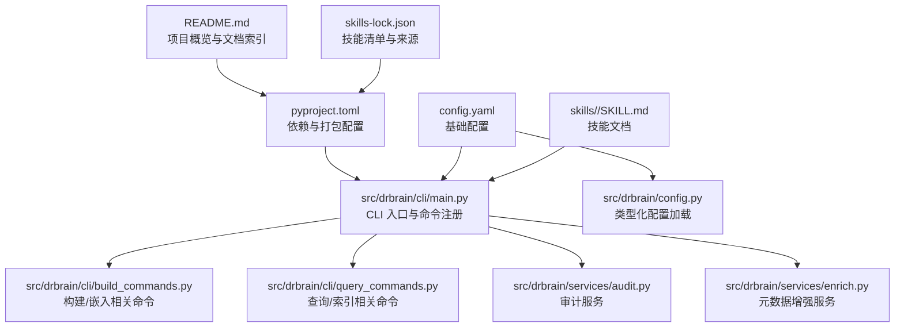
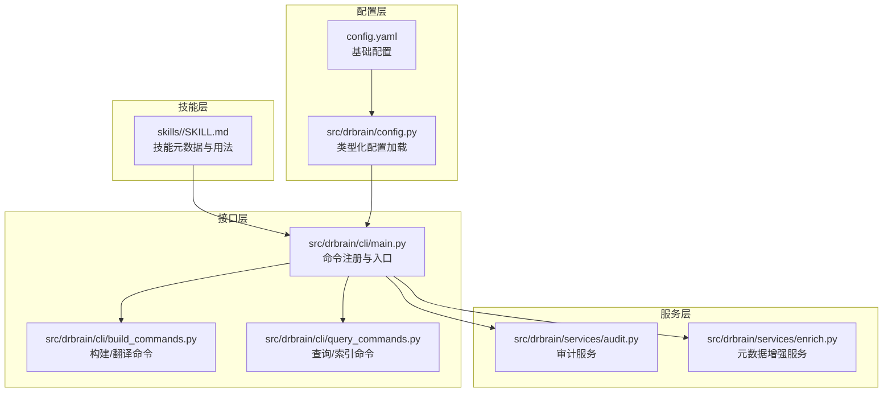
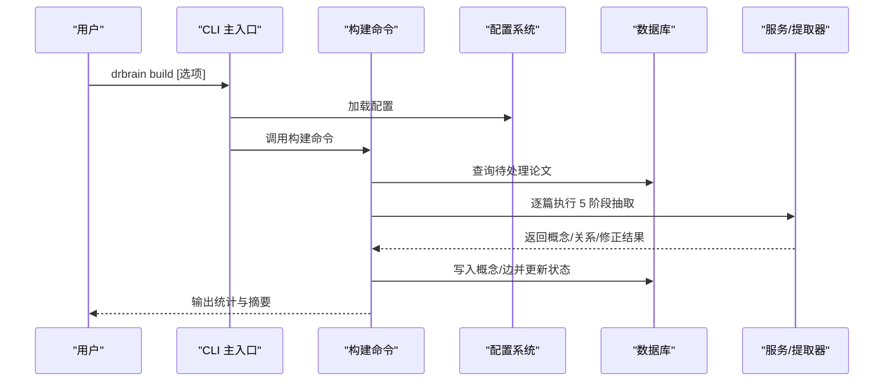
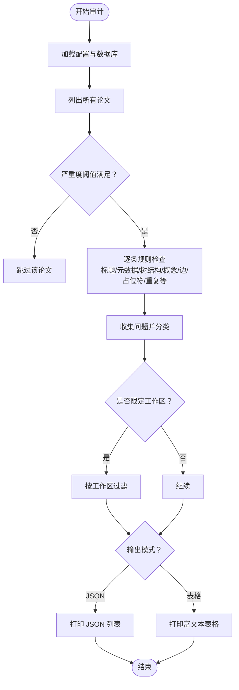
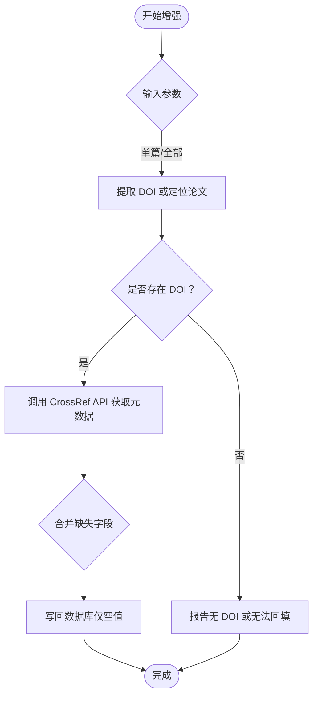
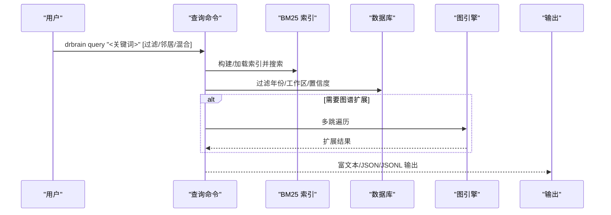
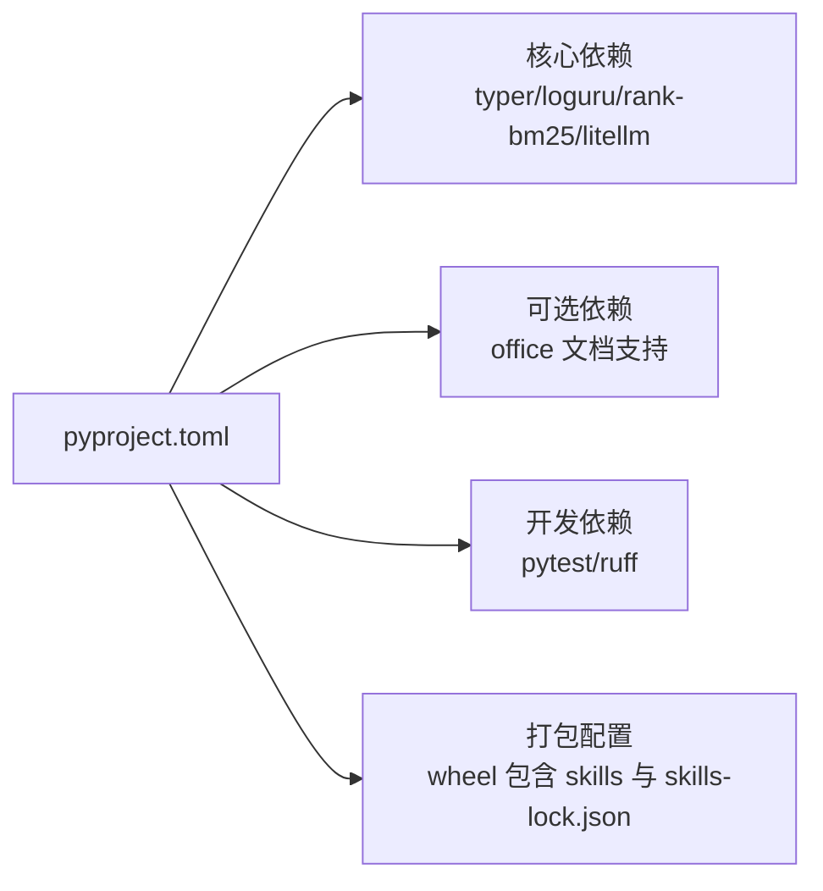

# 技能开发指南

<cite>
**本文引用的文件**
- [README.md](file://README.md)
- [CONTRIBUTING.md](file://CONTRIBUTING.md)
- [pyproject.toml](file://pyproject.toml)
- [config.yaml](file://config.yaml)
- [src/drbrain/config.py](file://src/drbrain/config.py)
- [src/drbrain/cli/main.py](file://src/drbrain/cli/main.py)
- [src/drbrain/cli/build_commands.py](file://src/drbrain/cli/build_commands.py)
- [src/drbrain/cli/query_commands.py](file://src/drbrain/cli/query_commands.py)
- [src/drbrain/services/audit.py](file://src/drbrain/services/audit.py)
- [src/drbrain/services/enrich.py](file://src/drbrain/services/enrich.py)
- [skills/audit/SKILL.md](file://skills/audit/SKILL.md)
- [skills/enrich/SKILL.md](file://skills/enrich/SKILL.md)
- [skills/paper-query/SKILL.md](file://skills/paper-query/SKILL.md)
- [skills-lock.json](file://skills-lock.json)
</cite>

## 目录
1. [简介](#简介)
2. [项目结构](#项目结构)
3. [核心组件](#核心组件)
4. [架构总览](#架构总览)
5. [详细组件分析](#详细组件分析)
6. [依赖分析](#依赖分析)
7. [性能考虑](#性能考虑)
8. [故障排除指南](#故障排除指南)
9. [结论](#结论)
10. [附录](#附录)

## 简介
本指南面向希望为 DrBrain 开发“技能（Skill）”的开发者，系统讲解如何创建符合 DrBrain 标准的技能，涵盖目录结构、配置文件、实现规范与生命周期管理；并提供从需求分析到测试部署的完整流程，以及元数据配置、依赖管理、版本控制、最佳实践、测试策略、打包发布、调试与性能优化、常见问题排查等实用内容。

DrBrain 采用“AgentSkills.io”开放标准，技能以文档形式描述命令、参数与行为，并通过 CLI 注册接入系统。技能开发围绕“元数据 + 命令 + 服务”的模式展开，既可直接调用 CLI 命令，也可封装为独立服务模块。

## 项目结构
DrBrain 的技能生态由以下部分组成：
- 技能文档：位于 skills/<skill-name>/SKILL.md，描述技能名称、用途、前置条件、命令参考与使用示例。
- CLI 命令注册：在主入口中集中注册所有命令，形成统一的 drbrain 子命令体系。
- 配置系统：通过 config.yaml 提供运行时配置，支持环境变量注入与本地覆盖。
- 服务模块：具体业务逻辑封装在 src/drbrain/services/*，供 CLI 或其他模块复用。
- 依赖与打包：pyproject.toml 定义项目依赖与脚本入口，构建时将 skills 与 skills-lock.json 打包进发行包。

图表来源
- [README.md:1-112](file://README.md#L1-L112)
- [pyproject.toml:1-104](file://pyproject.toml#L1-L104)
- [src/drbrain/cli/main.py:1-150](file://src/drbrain/cli/main.py#L1-L150)
- [src/drbrain/config.py:1-292](file://src/drbrain/config.py#L1-L292)
- [config.yaml:1-72](file://config.yaml#L1-L72)
- [skills-lock.json:1-33](file://skills-lock.json#L1-L33)

章节来源
- [README.md:1-112](file://README.md#L1-L112)
- [pyproject.toml:1-104](file://pyproject.toml#L1-L104)
- [src/drbrain/cli/main.py:1-150](file://src/drbrain/cli/main.py#L1-L150)
- [src/drbrain/config.py:1-292](file://src/drbrain/config.py#L1-L292)
- [config.yaml:1-72](file://config.yaml#L1-L72)
- [skills-lock.json:1-33](file://skills-lock.json#L1-L33)

## 核心组件
- CLI 主入口与命令注册
  - 在主入口集中注册所有子命令，包括 ingest、query、build、embed、audit、enrich 等，形成统一的 drbrain 子命令体系。
  - 每个命令通过 Typer 装饰器声明参数与帮助信息，便于生成 CLI 参考与自动补全。
- 类型化配置系统
  - 通过 dataclass 封装各子系统配置（如 LLM、MinerU、API、目录、数据库、提取并发、BM25、队列、抓取、嵌入、备份），并提供 YAML 加载与环境变量解析。
  - 支持 base/local 叠加与深合并，确保默认值与用户覆盖的正确性。
- 服务模块
  - 审计服务：扫描知识图谱质量，输出结构化报告。
  - 元数据增强服务：基于 CrossRef API 回填缺失字段并检测可疑记录。
- 技能文档
  - 以 SKILL.md 描述技能元数据（name、description）、前置条件、快速开始、CLI 参考与示例，遵循 AgentSkills.io 标准。

章节来源
- [src/drbrain/cli/main.py:1-150](file://src/drbrain/cli/main.py#L1-L150)
- [src/drbrain/config.py:1-292](file://src/drbrain/config.py#L1-L292)
- [src/drbrain/services/audit.py:1-396](file://src/drbrain/services/audit.py#L1-L396)
- [src/drbrain/services/enrich.py:1-171](file://src/drbrain/services/enrich.py#L1-L171)
- [skills/audit/SKILL.md:1-88](file://skills/audit/SKILL.md#L1-L88)
- [skills/enrich/SKILL.md:1-44](file://skills/enrich/SKILL.md#L1-L44)
- [skills/paper-query/SKILL.md:1-96](file://skills/paper-query/SKILL.md#L1-L96)

## 架构总览
DrBrain 的技能开发遵循“文档即规范”的理念：技能以 SKILL.md 描述能力边界，CLI 作为统一入口承载命令与参数，服务模块封装可复用的业务逻辑，配置系统贯穿运行期。

图表来源
- [src/drbrain/cli/main.py:1-150](file://src/drbrain/cli/main.py#L1-L150)
- [src/drbrain/cli/build_commands.py:1-361](file://src/drbrain/cli/build_commands.py#L1-L361)
- [src/drbrain/cli/query_commands.py:1-738](file://src/drbrain/cli/query_commands.py#L1-L738)
- [src/drbrain/services/audit.py:1-396](file://src/drbrain/services/audit.py#L1-L396)
- [src/drbrain/services/enrich.py:1-171](file://src/drbrain/services/enrich.py#L1-L171)
- [config.yaml:1-72](file://config.yaml#L1-L72)
- [src/drbrain/config.py:1-292](file://src/drbrain/config.py#L1-L292)

## 详细组件分析

### 组件一：CLI 命令注册与生命周期
- 生命周期要点
  - 初始化：每个命令在主入口集中注册，统一设置日志与加载配置。
  - 参数解析：Typer 负责参数校验与帮助信息生成。
  - 服务调用：命令内部读取配置、访问数据库或外部服务，执行业务逻辑。
  - 输出：支持富文本表格与 JSON/JSONL，便于自动化集成。
- 关键流程（以“构建知识图谱”为例）
  - 解析参数：选择论文集合（全部/指定/未处理）。
  - 校验前置：检查 LLM 配置与树结构存在性。
  - 执行阶段：按 5 阶段抽取（概念/关系/共指/精炼），写入数据库并去重。
  - 结果汇总：统计插入数量并输出摘要。

图表来源
- [src/drbrain/cli/main.py:1-150](file://src/drbrain/cli/main.py#L1-L150)
- [src/drbrain/cli/build_commands.py:1-361](file://src/drbrain/cli/build_commands.py#L1-L361)
- [src/drbrain/config.py:1-292](file://src/drbrain/config.py#L1-L292)

章节来源
- [src/drbrain/cli/main.py:1-150](file://src/drbrain/cli/main.py#L1-L150)
- [src/drbrain/cli/build_commands.py:1-361](file://src/drbrain/cli/build_commands.py#L1-L361)

### 组件二：审计技能（Data Quality Audit）
- 元数据与前置条件
  - 名称与描述：用于健康检查与数据完整性评估。
  - 前置条件：需要已入库论文与已构建知识图谱（若涉及概念/边统计）。
- 功能范围
  - 15 规则扫描：错误级（必须修复）、警告级（建议修复）、信息级（建议关注）。
  - 输出格式：富文本表格与 JSON，支持按严重度过滤与工作区限定。
- 使用场景
  - 分析前的健康检查、批量修复后的验证、工作区质量巡检。

图表来源
- [src/drbrain/services/audit.py:1-396](file://src/drbrain/services/audit.py#L1-L396)
- [skills/audit/SKILL.md:1-88](file://skills/audit/SKILL.md#L1-L88)

章节来源
- [src/drbrain/services/audit.py:1-396](file://src/drbrain/services/audit.py#L1-L396)
- [skills/audit/SKILL.md:1-88](file://skills/audit/SKILL.md#L1-L88)

### 组件三：元数据增强技能（Metadata Enrichment）
- 元数据回填
  - 基于 CrossRef API 回填缺失字段（标题、作者、年份、期刊等）。
  - 仅在原字段为空时填充，避免覆盖已有数据。
- 质量检测
  - 检测空标题、过短标题、疑似文件名、空作者、异常年份等可疑记录。
- CLI 行为
  - 支持单篇检查/回填、批量检查/回填、干跑模式与 JSON 输出。

图表来源
- [src/drbrain/services/enrich.py:1-171](file://src/drbrain/services/enrich.py#L1-L171)
- [skills/enrich/SKILL.md:1-44](file://skills/enrich/SKILL.md#L1-L44)

章节来源
- [src/drbrain/services/enrich.py:1-171](file://src/drbrain/services/enrich.py#L1-L171)
- [skills/enrich/SKILL.md:1-44](file://skills/enrich/SKILL.md#L1-L44)

### 组件四：查询技能（Paper Query）
- 搜索模式
  - BM25 关键词搜索：支持类型过滤、置信度阈值、年份范围、限制返回数。
  - 图谱扩展检索：按关系与方向进行多跳遍历，提升召回。
  - 树结构检索：针对特定论文的 PageIndex 树节点进行段落级检索。
- 后续操作
  - 展示论文详情、自然语言问答、推理分析、导出、保存至工作区等。

图表来源
- [src/drbrain/cli/query_commands.py:1-738](file://src/drbrain/cli/query_commands.py#L1-L738)
- [skills/paper-query/SKILL.md:1-96](file://skills/paper-query/SKILL.md#L1-L96)

章节来源
- [src/drbrain/cli/query_commands.py:1-738](file://src/drbrain/cli/query_commands.py#L1-L738)
- [skills/paper-query/SKILL.md:1-96](file://skills/paper-query/SKILL.md#L1-L96)

## 依赖分析
- 项目依赖
  - CLI 与核心库：typer、loguru、pydantic、rich 等。
  - 数据与检索：sqlite3、rank-bm25、networkx、umap-learn。
  - LLM 与模型：litellm、pymupdf、pymupdf4llm、deepxiv-sdk。
  - 可选办公支持：python-docx、python-pptx、openpyxl。
- 开发依赖
  - 测试与格式化：pytest、ruff。
- 依赖来源
  - pyproject.toml 定义核心依赖与可选依赖；构建时将 skills 与 skills-lock.json 打包进发行包，确保技能清单与来源可追溯。

图表来源
- [pyproject.toml:1-104](file://pyproject.toml#L1-L104)
- [skills-lock.json:1-33](file://skills-lock.json#L1-L33)

章节来源
- [pyproject.toml:1-104](file://pyproject.toml#L1-L104)
- [skills-lock.json:1-33](file://skills-lock.json#L1-L33)

## 性能考虑
- 并发与批处理
  - 提取并发：通过配置项控制 LLM 并发数，平衡吞吐与稳定性。
  - 批量嵌入：嵌入服务支持批量请求与缓存，减少重复计算。
- 索引与检索
  - BM25 索引需定期重建，确保搜索结果时效性。
  - 图谱混合排序通过近似 PageRank 实现，避免重型依赖。
- I/O 与缓存
  - 配置缓存目录与 TTL，合理利用本地缓存降低外部 API 延迟。
- 资源隔离
  - 工作区过滤：在统计与查询中限定论文集合，减少无关扫描与计算。

## 故障排除指南
- 常见问题与定位
  - 缺少 LLM 配置：构建命令会提示未配置模型，请先执行初始化设置。
  - 无可用论文：查询/构建前需先完成入库与树结构生成。
  - 索引陈旧：BM25 索引需重建，确保搜索命中率。
  - 外部 API 失败：CrossRef/Unpaywall 等网络请求失败时，检查代理与凭据。
- 审计辅助
  - 使用审计技能快速定位缺失元数据、空树、低概念数量、占位符过期等问题。
- 日志与会话
  - CLI 在每次命令前记录会话 ID 与参数，便于问题复现与追踪。

章节来源
- [src/drbrain/cli/build_commands.py:1-361](file://src/drbrain/cli/build_commands.py#L1-L361)
- [src/drbrain/services/audit.py:1-396](file://src/drbrain/services/audit.py#L1-L396)
- [src/drbrain/cli/main.py:1-150](file://src/drbrain/cli/main.py#L1-L150)

## 结论
DrBrain 的技能开发以“文档即规范、命令即接口、服务即能力”为核心，结合类型化配置与 CLI 注册，形成清晰、可维护且易于扩展的技能体系。遵循本文提供的目录结构、元数据规范、生命周期流程与最佳实践，可高效交付高质量的技能模块，并通过统一的打包与发布机制融入 DrBrain 生态。

## 附录

### A. 技能开发模板与示例
- 目录结构
  - skills/<skill-name>/SKILL.md：技能元数据与用法说明。
  - 可选：agents/openai.yaml（若技能需要 LLM 配置模板）。
- 示例参考
  - 审计技能：展示严重度分级、工作区过滤与 JSON 输出。
  - 元数据增强技能：展示 CrossRef 回填与可疑记录检测。
  - 论文查询技能：展示 BM25、图谱扩展与树检索组合。

章节来源
- [skills/audit/SKILL.md:1-88](file://skills/audit/SKILL.md#L1-L88)
- [skills/enrich/SKILL.md:1-44](file://skills/enrich/SKILL.md#L1-L44)
- [skills/paper-query/SKILL.md:1-96](file://skills/paper-query/SKILL.md#L1-L96)

### B. 配置与环境变量
- 基础配置
  - config.yaml 定义 LLM、MinerU、API、目录、数据库、提取并发、BM25、队列、抓取、嵌入等参数。
  - 支持环境变量注入（如 OPENAI_API_KEY、MINERU_TOKEN 等）。
- 类型化加载
  - 通过 dataclass 自动校验与默认值，支持本地覆盖与深合并。

章节来源
- [config.yaml:1-72](file://config.yaml#L1-L72)
- [src/drbrain/config.py:1-292](file://src/drbrain/config.py#L1-L292)

### C. 依赖管理与版本控制
- 依赖声明
  - 在 pyproject.toml 中声明核心与可选依赖，开发依赖用于测试与格式化。
- 版本锁定与来源
  - skills-lock.json 记录技能来源、路径与哈希，确保可复现与安全。

章节来源
- [pyproject.toml:1-104](file://pyproject.toml#L1-L104)
- [skills-lock.json:1-33](file://skills-lock.json#L1-L33)

### D. 打包、发布与分发
- 打包
  - 构建时将 skills 与 skills-lock.json 强制包含进 wheel，保证技能清单随发行包分发。
- 发布
  - 使用标准 Python 发行渠道（如 pipx/tool 等）安装 drbrain，技能随包可用。
- 分发
  - 技能遵循 AgentSkills.io 标准，可在多种 AI 编辑器中使用。

章节来源
- [pyproject.toml:76-82](file://pyproject.toml#L76-L82)
- [README.md:79-90](file://README.md#L79-L90)

### E. 最佳实践与测试策略
- 最佳实践
  - 使用 Google 风格 docstring 与类型提示；遵循 Conventional Commits。
  - 服务模块职责单一，CLI 命令只做参数解析与流程编排。
- 测试策略
  - 行为契约测试优先，避免过度耦合实现细节；使用 fixture 隔离。
  - 标记慢测试（网络/LLM）为 integration，便于快速测试与全量回归。

章节来源
- [CONTRIBUTING.md:48-61](file://CONTRIBUTING.md#L48-L61)
- [CONTRIBUTING.md:24-36](file://CONTRIBUTING.md#L24-L36)