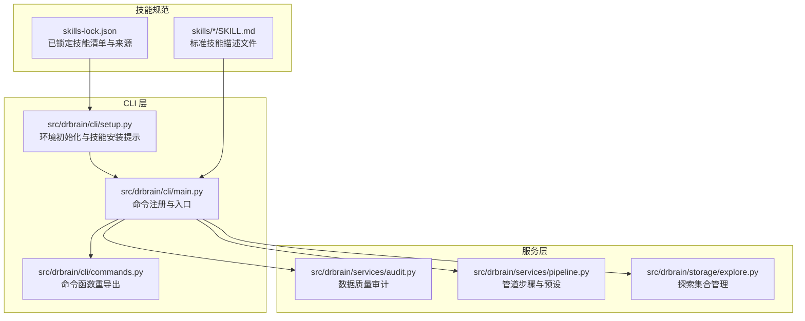
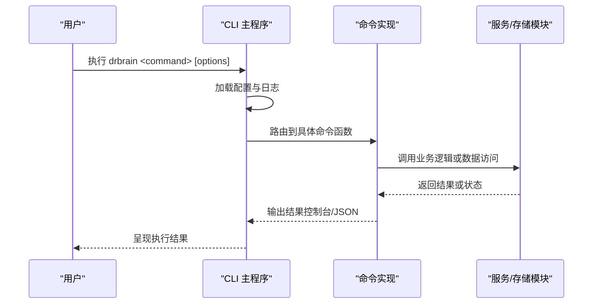
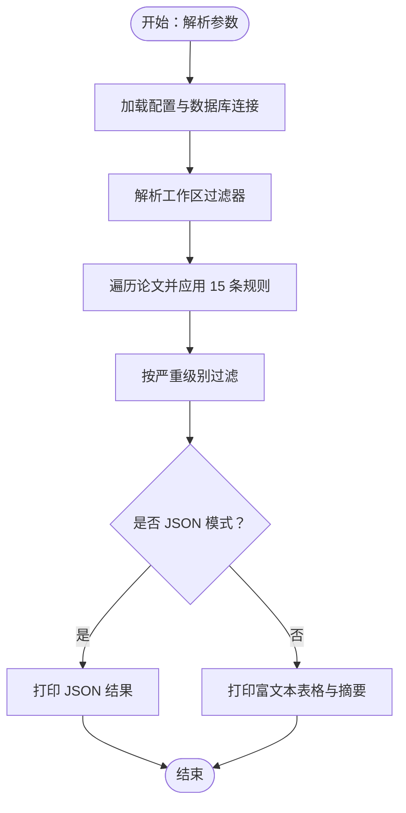
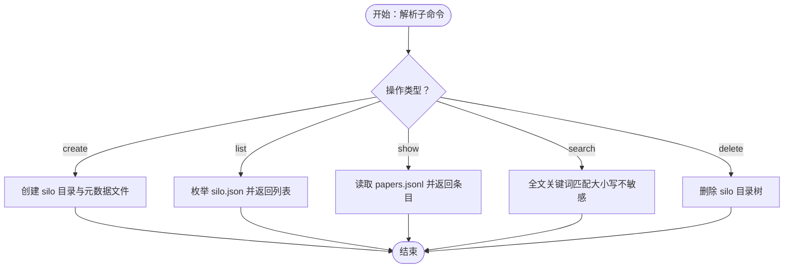
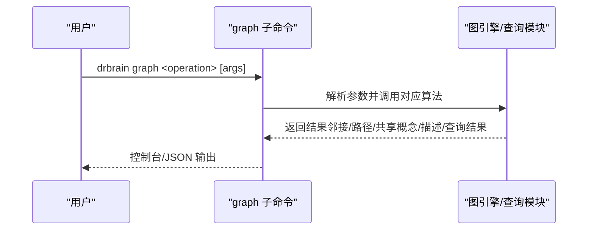
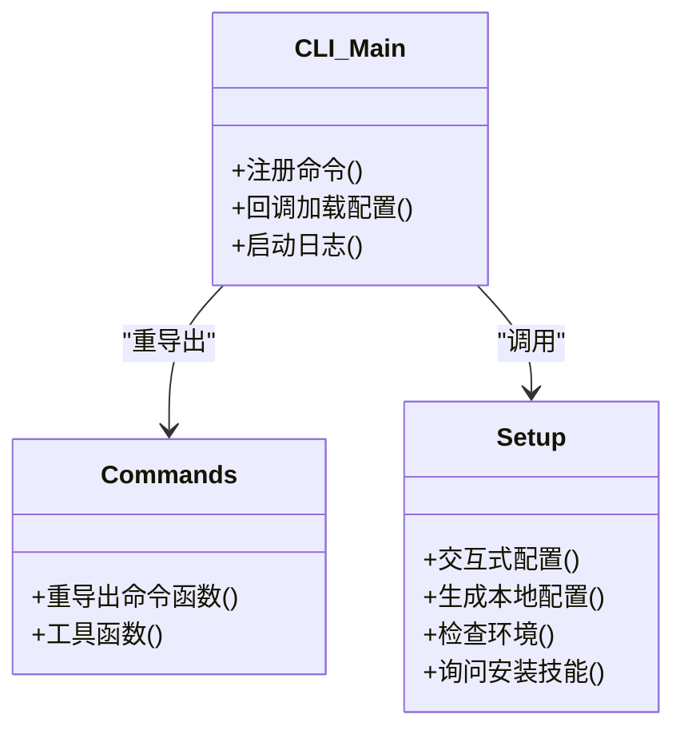
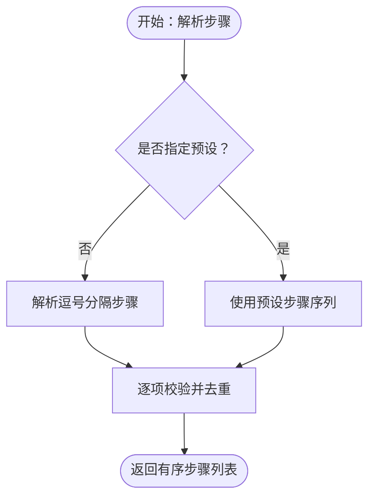
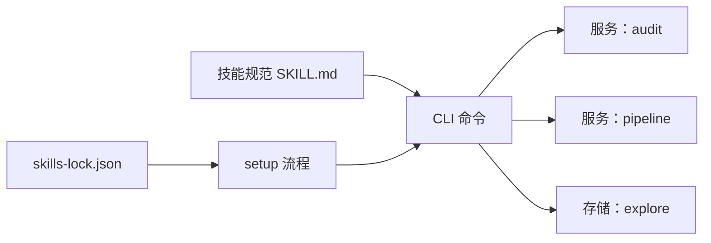

# 技能系统

<cite>
**本文引用的文件**
- [README.md](file://README.md)
- [AGENTS.md](file://AGENTS.md)
- [config.yaml](file://config.yaml)
- [skills-lock.json](file://skills-lock.json)
- [src/drbrain/cli/main.py](file://src/drbrain/cli/main.py)
- [src/drbrain/cli/setup.py](file://src/drbrain/cli/setup.py)
- [src/drbrain/cli/commands.py](file://src/drbrain/cli/commands.py)
- [src/drbrain/services/pipeline.py](file://src/drbrain/services/pipeline.py)
- [src/drbrain/services/audit.py](file://src/drbrain/services/audit.py)
- [src/drbrain/storage/explore.py](file://src/drbrain/storage/explore.py)
- [skills/audit/SKILL.md](file://skills/audit/SKILL.md)
- [skills/explore/SKILL.md](file://skills/explore/SKILL.md)
- [skills/graph/SKILL.md](file://skills/graph/SKILL.md)
</cite>

## 目录
1. [简介](#简介)
2. [项目结构](#项目结构)
3. [核心组件](#核心组件)
4. [架构总览](#架构总览)
5. [详细组件分析](#详细组件分析)
6. [依赖关系分析](#依赖关系分析)
7. [性能考量](#性能考量)
8. [故障排查指南](#故障排查指南)
9. [结论](#结论)
10. [附录](#附录)

## 简介
本文件面向 DrBrain 的技能系统，聚焦于 AgentSkills.io 标准的实现与使用方法，系统性梳理预定义技能的功能与配置选项，提供技能开发指南与扩展机制，并解释技能与 CLI 命令的集成方式。文档同时覆盖技能安装、配置与使用的完整流程，说明技能系统的架构设计与运行机制，并给出自定义技能开发的最佳实践与示例路径。

## 项目结构
DrBrain 将“技能”以独立的 Markdown 文件形式组织在 skills/ 目录下，每个技能通过 SKILL.md 描述其名称、用途、前置条件、参数与示例用法。CLI 层负责注册命令并将用户输入路由到对应的服务模块或存储模块；服务层封装业务逻辑（如审计、探索集合等），存储层提供数据持久化能力（如探索集合的 JSONL 存储）。

图表来源
- [src/drbrain/cli/main.py:1-150](file://src/drbrain/cli/main.py#L1-L150)
- [src/drbrain/cli/setup.py:1-588](file://src/drbrain/cli/setup.py#L1-L588)
- [src/drbrain/cli/commands.py:1-88](file://src/drbrain/cli/commands.py#L1-L88)
- [src/drbrain/services/audit.py:1-396](file://src/drbrain/services/audit.py#L1-L396)
- [src/drbrain/services/pipeline.py:1-109](file://src/drbrain/services/pipeline.py#L1-L109)
- [src/drbrain/storage/explore.py:1-203](file://src/drbrain/storage/explore.py#L1-L203)
- [skills/audit/SKILL.md:1-88](file://skills/audit/SKILL.md#L1-L88)
- [skills/explore/SKILL.md:1-49](file://skills/explore/SKILL.md#L1-L49)
- [skills/graph/SKILL.md:1-126](file://skills/graph/SKILL.md#L1-L126)
- [skills-lock.json:1-33](file://skills-lock.json#L1-L33)

章节来源
- [README.md:1-112](file://README.md#L1-L112)
- [AGENTS.md:1-69](file://AGENTS.md#L1-L69)

## 核心组件
- CLI 注册与路由：主入口集中注册所有命令，回调中加载配置并设置日志，随后将具体命令绑定到各功能模块。
- 服务模块：封装业务能力，如审计（15 规则扫描）、探索集合（轻量文献发现集合）、管道步骤（预设与校验）。
- 存储模块：提供探索集合的目录结构、元数据与 JSONL 数据文件的读写接口。
- 技能规范：以 SKILL.md 为标准，描述技能名称、用途、前置条件、参数与示例，遵循 AgentSkills.io 标准。
- 技能锁定：skills-lock.json 记录已安装技能的来源、路径与哈希，确保可复现与完整性校验。

章节来源
- [src/drbrain/cli/main.py:77-146](file://src/drbrain/cli/main.py#L77-L146)
- [src/drbrain/services/audit.py:312-396](file://src/drbrain/services/audit.py#L312-L396)
- [src/drbrain/storage/explore.py:49-203](file://src/drbrain/storage/explore.py#L49-L203)
- [src/drbrain/services/pipeline.py:14-109](file://src/drbrain/services/pipeline.py#L14-L109)
- [skills/audit/SKILL.md:1-88](file://skills/audit/SKILL.md#L1-L88)
- [skills/explore/SKILL.md:1-49](file://skills/explore/SKILL.md#L1-L49)
- [skills/graph/SKILL.md:1-126](file://skills/graph/SKILL.md#L1-L126)
- [skills-lock.json:1-33](file://skills-lock.json#L1-L33)

## 架构总览
DrBrain 的技能系统围绕 CLI 命令展开，命令解析后调用对应服务或存储模块完成具体任务。技能以 SKILL.md 为契约，描述行为与参数；setup 流程可引导安装官方技能仓库，确保 Agent 工具链可用。

图表来源
- [src/drbrain/cli/main.py:80-146](file://src/drbrain/cli/main.py#L80-L146)
- [src/drbrain/services/audit.py:312-396](file://src/drbrain/services/audit.py#L312-L396)
- [src/drbrain/storage/explore.py:147-203](file://src/drbrain/storage/explore.py#L147-L203)

## 详细组件分析

### 组件 A：审计技能（audit）
- 功能概述：对整个知识库进行 15 条规则的质量扫描，按严重级别（错误/警告/信息）分类输出报告，支持工作区过滤与 JSON 输出。
- 关键参数：
  - 严重级别：error / warning / info
  - 工作区过滤：--workspace
  - 输出格式：--json
- 典型用法：
  - 全量审计：drbrain audit
  - 仅错误：drbrain audit --severity error
  - JSON 输出：drbrain audit --json
  - 工作区审计：drbrain audit --workspace <name>

图表来源
- [src/drbrain/services/audit.py:312-396](file://src/drbrain/services/audit.py#L312-L396)
- [skills/audit/SKILL.md:78-88](file://skills/audit/SKILL.md#L78-L88)

章节来源
- [src/drbrain/services/audit.py:30-396](file://src/drbrain/services/audit.py#L30-L396)
- [skills/audit/SKILL.md:1-88](file://skills/audit/SKILL.md#L1-L88)

### 组件 B：探索集合技能（explore）
- 功能概述：管理轻量级探索集合（silo），用于文献发现而不污染主库与工作区。支持创建、列出、查看、搜索与删除。
- 关键操作：
  - 创建：drbrain explore --create <name>
  - 列表：drbrain explore --list
  - 查看：drbrain explore --name <n> --show
  - 搜索：drbrain explore --name <n> --search <q>
  - 删除：drbrain explore --delete <name>
- 程序化接口：提供 create_explore_silo、add_paper_to_silo、get_silo_papers、search_silo、list_explore_silos、delete_explore_silo 等 API。

图表来源
- [src/drbrain/storage/explore.py:49-203](file://src/drbrain/storage/explore.py#L49-L203)
- [skills/explore/SKILL.md:16-49](file://skills/explore/SKILL.md#L16-L49)

章节来源
- [src/drbrain/storage/explore.py:1-203](file://src/drbrain/storage/explore.py#L1-L203)
- [skills/explore/SKILL.md:1-49](file://skills/explore/SKILL.md#L1-L49)

### 组件 C：图谱技能（graph）
- 功能概述：直接对知识图谱进行查询与分析，包括邻居遍历、最短路径、跨论文概念分析、子图描述、复杂嵌入查询以及混合树+图遍历。
- 关键操作：
  - neighbors：从节点出发进行多跳遍历，支持关系过滤与方向控制
  - path：在无向图上寻找两点间最短路径
  - related：分析两篇或多篇论文共享的概念/边模式
  - describe：生成中心节点的自然语言子图描述
  - query：基于 TransE 的复合查询（交/并/补）
  - traverse-from：从文档段落锚定概念后进行图谱遍历
- 使用前提：需先构建知识图谱；query 需要训练好的嵌入；traverse-from 需要 PageIndex 树存在。

图表来源
- [skills/graph/SKILL.md:25-126](file://skills/graph/SKILL.md#L25-L126)

章节来源
- [skills/graph/SKILL.md:1-126](file://skills/graph/SKILL.md#L1-L126)

### 组件 D：CLI 命令与技能集成
- 命令注册：主入口集中注册所有命令，回调中加载配置并设置日志，随后将具体命令绑定到各功能模块。
- 命令重导出：commands.py 将各模块命令函数与工具函数重导出，便于新代码按模块导入。
- 技能安装：setup 流程在初始化时询问是否安装 DrBrain 官方技能仓库，若用户同意则通过 npx skills add 安装。

图表来源
- [src/drbrain/cli/main.py:77-146](file://src/drbrain/cli/main.py#L77-L146)
- [src/drbrain/cli/commands.py:10-88](file://src/drbrain/cli/commands.py#L10-L88)
- [src/drbrain/cli/setup.py:191-205](file://src/drbrain/cli/setup.py#L191-L205)

章节来源
- [src/drbrain/cli/main.py:1-150](file://src/drbrain/cli/main.py#L1-L150)
- [src/drbrain/cli/commands.py:1-88](file://src/drbrain/cli/commands.py#L1-L88)
- [src/drbrain/cli/setup.py:191-205](file://src/drbrain/cli/setup.py#L191-L205)

### 组件 E：管道与步骤（pipeline）
- 步骤定义：ingest、build、embed、closure 四个阶段，分别负责解析入库、抽取构建、嵌入训练与推理闭包。
- 预设组合：full（含 ingest）、quick（不含 ingest）、embed（仅嵌入相关）。
- 参数解析：支持按预设或逗号分隔步骤名解析，进行去重与校验。

图表来源
- [src/drbrain/services/pipeline.py:53-109](file://src/drbrain/services/pipeline.py#L53-L109)

章节来源
- [src/drbrain/services/pipeline.py:1-109](file://src/drbrain/services/pipeline.py#L1-L109)

## 依赖关系分析
- CLI 对服务/存储模块的依赖：命令函数通过上下文获取配置并调用服务层或存储层。
- 技能与 CLI 的耦合：CLI 通过命令注册与路由与技能解耦；技能以 SKILL.md 为契约，不直接修改 CLI 代码。
- 技能锁定与来源：skills-lock.json 记录技能来源、路径与哈希，保证可复现性与完整性。

图表来源
- [src/drbrain/cli/main.py:77-146](file://src/drbrain/cli/main.py#L77-L146)
- [src/drbrain/services/audit.py:312-396](file://src/drbrain/services/audit.py#L312-L396)
- [src/drbrain/services/pipeline.py:53-109](file://src/drbrain/services/pipeline.py#L53-L109)
- [src/drbrain/storage/explore.py:147-203](file://src/drbrain/storage/explore.py#L147-L203)
- [skills/audit/SKILL.md:1-88](file://skills/audit/SKILL.md#L1-L88)
- [skills/explore/SKILL.md:1-49](file://skills/explore/SKILL.md#L1-L49)
- [skills/graph/SKILL.md:1-126](file://skills/graph/SKILL.md#L1-L126)
- [skills-lock.json:1-33](file://skills-lock.json#L1-L33)
- [src/drbrain/cli/setup.py:191-205](file://src/drbrain/cli/setup.py#L191-L205)

章节来源
- [src/drbrain/cli/main.py:77-146](file://src/drbrain/cli/main.py#L77-L146)
- [skills-lock.json:1-33](file://skills-lock.json#L1-L33)

## 性能考量
- 审计扫描：针对大量论文的规则扫描应结合工作区过滤与 JSON 输出，便于后续脚本处理与增量修复。
- 探索集合：采用 JSONL 追加写入，适合轻量检索；大规模集合建议配合外部搜索引擎或倒排索引。
- 图谱操作：neighbors/path/related 等操作在大型图上可能耗时，建议限制 hops 与 max-length，并优先使用有向/关系过滤降低搜索空间。
- 嵌入查询：TransE 复杂查询涉及向量运算，建议在训练好嵌入后再启用，避免不必要的计算开销。

## 故障排查指南
- 环境检查：setup 流程会检查 Python 包、外部工具（如 MinerU）、配置文件与数据目录是否存在，缺失项会以警告提示。
- 技能安装失败：若 npx skills add 失败，确认系统已安装 Node.js/npx 或改用手动安装方式。
- 审计结果异常：检查知识图谱是否已构建、嵌入是否训练；必要时重新执行 build 与 embed 步骤。
- 探索集合为空：确认 silo 名称合法且存在；检查 papers.jsonl 是否被正确追加写入。

章节来源
- [src/drbrain/cli/setup.py:119-188](file://src/drbrain/cli/setup.py#L119-L188)
- [src/drbrain/cli/setup.py:191-205](file://src/drbrain/cli/setup.py#L191-L205)
- [src/drbrain/storage/explore.py:147-203](file://src/drbrain/storage/explore.py#L147-L203)

## 结论
DrBrain 的技能系统以 AgentSkills.io 标准为契约，通过 CLI 命令与服务/存储模块解耦协作，形成“声明式技能 + 可执行命令”的体系。预置技能覆盖审计、探索、图谱等核心能力；setup 流程提供一键安装与环境验证；skills-lock.json 确保技能来源与一致性。开发者可据此扩展新技能，遵循 SKILL.md 的结构与参数约定，即可无缝接入 CLI 生态。

## 附录

### A. AgentSkills.io 标准实现要点
- 技能描述：每个技能以 SKILL.md 提供统一的 name、description、前置条件、参数与示例。
- CLI 集成：命令注册在主入口集中完成，回调加载配置并设置日志。
- 安装流程：setup 流程可引导安装官方技能仓库，提升 Agent 工具链可用性。

章节来源
- [README.md:81-90](file://README.md#L81-L90)
- [AGENTS.md:31-69](file://AGENTS.md#L31-L69)
- [src/drbrain/cli/main.py:77-146](file://src/drbrain/cli/main.py#L77-L146)
- [src/drbrain/cli/setup.py:191-205](file://src/drbrain/cli/setup.py#L191-L205)

### B. 预定义技能一览与使用指引
- audit：数据质量审计，支持严重级别过滤与工作区限定。
- explore：探索集合管理，支持创建、列出、查看、搜索与删除。
- graph：知识图谱直接查询与分析，支持多种操作与参数组合。

章节来源
- [skills/audit/SKILL.md:1-88](file://skills/audit/SKILL.md#L1-L88)
- [skills/explore/SKILL.md:1-49](file://skills/explore/SKILL.md#L1-L49)
- [skills/graph/SKILL.md:1-126](file://skills/graph/SKILL.md#L1-L126)

### C. 技能开发指南与最佳实践
- 遵循 SKILL.md 结构：明确 name、description、前置条件、参数与示例。
- 保持 CLI 语义一致：命令命名与参数风格与现有技能保持一致。
- 输出格式：支持 JSON 输出以便脚本化与自动化。
- 性能与健壮性：对大图/大批量数据的操作应提供过滤与分页策略。
- 可测试性：为关键逻辑提供清晰的输入输出契约，便于单元测试与集成测试。

### D. 技能安装、配置与使用流程
- 安装技能：drbrain setup 后根据提示安装官方技能仓库。
- 配置环境：drbrain setup 交互式生成 config.local.yaml，检查依赖与目录。
- 使用技能：参考各 SKILL.md 的示例命令与参数，结合 --json 与工作区过滤进行自动化集成。

章节来源
- [src/drbrain/cli/setup.py:191-205](file://src/drbrain/cli/setup.py#L191-L205)
- [config.yaml:1-72](file://config.yaml#L1-L72)
- [README.md:24-36](file://README.md#L24-L36)