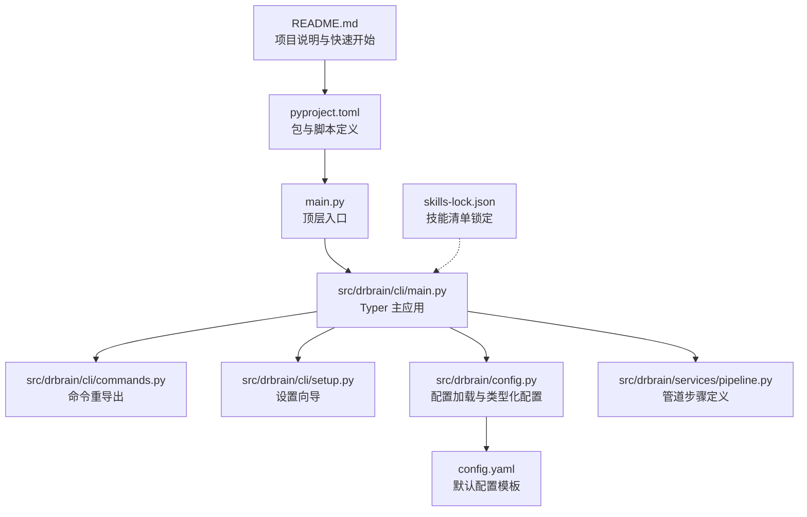
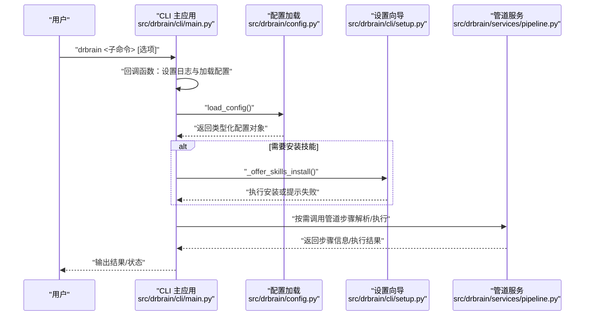
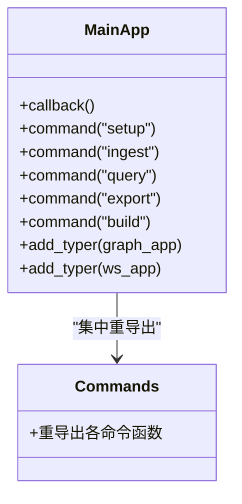
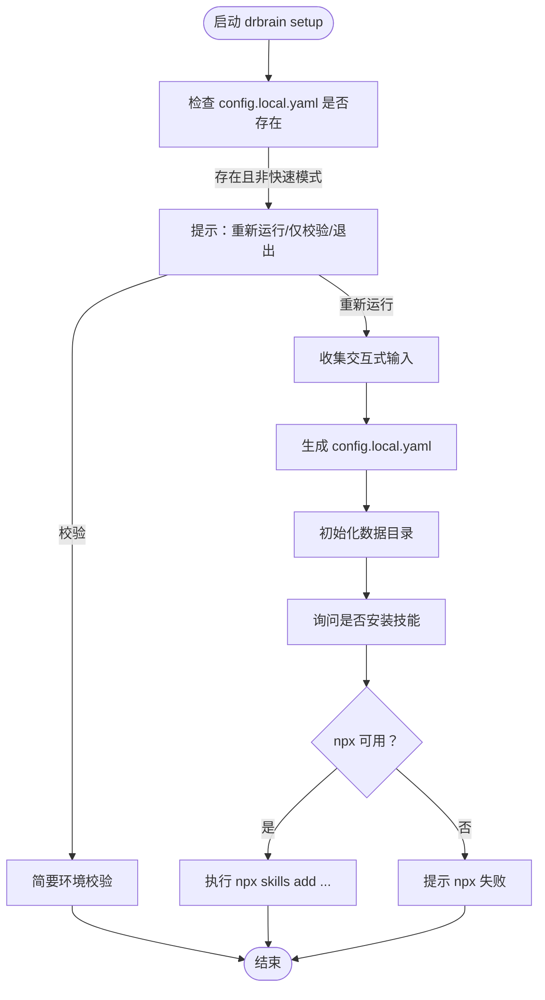
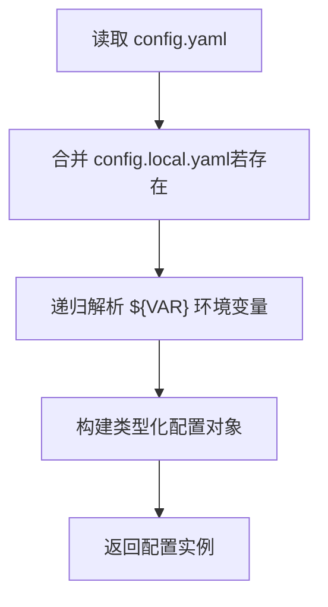
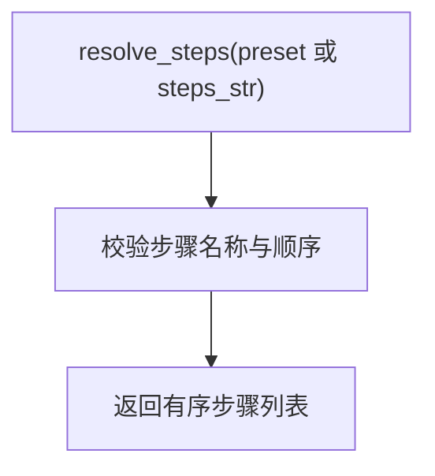
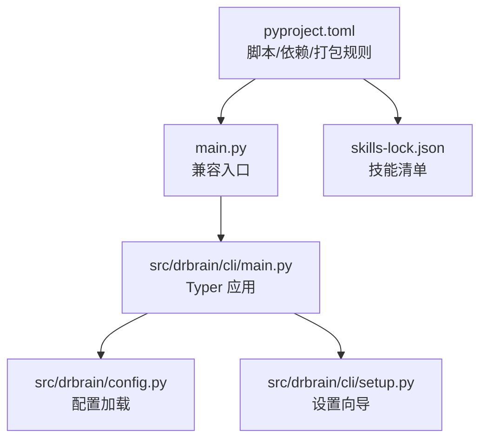

# 技能集成与使用

<cite>
**本文引用的文件**
- [README.md](file://README.md)
- [main.py](file://main.py)
- [pyproject.toml](file://pyproject.toml)
- [config.yaml](file://config.yaml)
- [skills-lock.json](file://skills-lock.json)
- [src/drbrain/cli/main.py](file://src/drbrain/cli/main.py)
- [src/drbrain/cli/commands.py](file://src/drbrain/cli/commands.py)
- [src/drbrain/cli/setup.py](file://src/drbrain/cli/setup.py)
- [src/drbrain/config.py](file://src/drbrain/config.py)
- [src/drbrain/services/pipeline.py](file://src/drbrain/services/pipeline.py)
</cite>

## 目录
1. [简介](#简介)
2. [项目结构](#项目结构)
3. [核心组件](#核心组件)
4. [架构总览](#架构总览)
5. [详细组件分析](#详细组件分析)
6. [依赖关系分析](#依赖关系分析)
7. [性能考虑](#性能考虑)
8. [故障排查指南](#故障排查指南)
9. [结论](#结论)
10. [附录](#附录)

## 简介
本指南面向希望在 DrBrain 系统中安装、配置、激活并使用“技能（Skill）”的用户与开发者。内容涵盖：
- 技能与 CLI 命令的集成方式与调用机制
- 安装、配置与激活流程
- 使用示例：命令行与程序化调用
- 运行时环境与依赖管理
- 配置文件详解与参数设置
- 错误处理与异常情况
- 性能优化与资源管理建议
- 监控、日志与调试技巧
- 升级与维护策略

## 项目结构
DrBrain 采用模块化的 CLI 架构，命令通过 Typer 注册到主应用；技能以独立仓库形式发布并通过统一入口进行安装与管理。核心目录与文件如下：
- CLI 入口与命令注册：src/drbrain/cli/main.py
- 命令分组与重导出：src/drbrain/cli/commands.py
- 设置向导与环境初始化：src/drbrain/cli/setup.py
- 配置加载与类型化配置：src/drbrain/config.py
- 默认配置模板：config.yaml
- 技能清单锁定：skills-lock.json
- 包与脚本定义：pyproject.toml
- 顶层入口（兼容旧入口）：main.py
- 项目说明与快速开始：README.md

**图表来源**
- [README.md:1-112](file://README.md#L1-L112)
- [pyproject.toml:1-104](file://pyproject.toml#L1-L104)
- [main.py:1-6](file://main.py#L1-L6)
- [src/drbrain/cli/main.py:1-150](file://src/drbrain/cli/main.py#L1-L150)
- [src/drbrain/cli/commands.py:1-88](file://src/drbrain/cli/commands.py#L1-L88)
- [src/drbrain/cli/setup.py:1-588](file://src/drbrain/cli/setup.py#L1-L588)
- [src/drbrain/config.py:1-292](file://src/drbrain/config.py#L1-L292)
- [config.yaml:1-72](file://config.yaml#L1-L72)
- [src/drbrain/services/pipeline.py:1-109](file://src/drbrain/services/pipeline.py#L1-L109)
- [skills-lock.json:1-33](file://skills-lock.json#L1-L33)

**章节来源**
- [README.md:1-112](file://README.md#L1-L112)
- [pyproject.toml:1-104](file://pyproject.toml#L1-L104)
- [main.py:1-6](file://main.py#L1-L6)
- [src/drbrain/cli/main.py:1-150](file://src/drbrain/cli/main.py#L1-L150)
- [src/drbrain/cli/commands.py:1-88](file://src/drbrain/cli/commands.py#L1-L88)
- [src/drbrain/cli/setup.py:1-588](file://src/drbrain/cli/setup.py#L1-L588)
- [src/drbrain/config.py:1-292](file://src/drbrain/config.py#L1-L292)
- [config.yaml:1-72](file://config.yaml#L1-L72)
- [src/drbrain/services/pipeline.py:1-109](file://src/drbrain/services/pipeline.py#L1-L109)
- [skills-lock.json:1-33](file://skills-lock.json#L1-L33)

## 核心组件
- CLI 主应用与命令注册：通过 Typer 将各功能命令注册到主应用，并在回调中完成日志与配置加载。
- 设置向导：生成本地配置、初始化数据目录、验证环境，并可引导安装技能。
- 配置系统：提供类型化配置类与 YAML 加载器，支持环境变量替换与本地覆盖合并。
- 技能管理：通过 skills-lock.json 管理已安装技能版本与来源；通过设置向导提供一键安装入口。
- 管道服务：定义标准处理步骤与预设，便于批处理与自动化。

**章节来源**
- [src/drbrain/cli/main.py:77-146](file://src/drbrain/cli/main.py#L77-L146)
- [src/drbrain/cli/setup.py:191-204](file://src/drbrain/cli/setup.py#L191-L204)
- [src/drbrain/config.py:182-292](file://src/drbrain/config.py#L182-L292)
- [skills-lock.json:1-33](file://skills-lock.json#L1-L33)
- [src/drbrain/services/pipeline.py:14-109](file://src/drbrain/services/pipeline.py#L14-L109)

## 架构总览
DrBrain 的技能与 CLI 调用链路如下：
- 用户通过命令行触发 CLI 子命令
- CLI 回调加载配置与日志
- 执行对应命令逻辑（可能涉及服务层）
- 设置向导可辅助安装技能与初始化环境

**图表来源**
- [src/drbrain/cli/main.py:80-92](file://src/drbrain/cli/main.py#L80-L92)
- [src/drbrain/config.py:283-292](file://src/drbrain/config.py#L283-L292)
- [src/drbrain/cli/setup.py:191-204](file://src/drbrain/cli/setup.py#L191-L204)
- [src/drbrain/services/pipeline.py:53-90](file://src/drbrain/services/pipeline.py#L53-L90)

## 详细组件分析

### CLI 主应用与命令注册
- 主应用通过 Typer 注册大量命令，并在回调中完成日志初始化与配置加载。
- 支持子应用（如 graph、ws）的挂载，扩展能力边界。
- 命令函数分布在不同模块，commands.py 提供集中重导出，便于新代码从具体模块导入。

**图表来源**
- [src/drbrain/cli/main.py:77-146](file://src/drbrain/cli/main.py#L77-L146)
- [src/drbrain/cli/commands.py:10-88](file://src/drbrain/cli/commands.py#L10-L88)

**章节来源**
- [src/drbrain/cli/main.py:77-146](file://src/drbrain/cli/main.py#L77-L146)
- [src/drbrain/cli/commands.py:10-88](file://src/drbrain/cli/commands.py#L10-L88)

### 设置向导与技能安装
- 设置向导负责生成本地配置、创建数据目录、环境校验，并在最后询问是否安装技能。
- 技能安装通过 npx skills add 指令从指定源拉取技能清单并写入本地。
- 若 npx 不可用，会提示失败并继续流程。

**图表来源**
- [src/drbrain/cli/setup.py:207-277](file://src/drbrain/cli/setup.py#L207-L277)
- [src/drbrain/cli/setup.py:284-369](file://src/drbrain/cli/setup.py#L284-L369)
- [src/drbrain/cli/setup.py:371-588](file://src/drbrain/cli/setup.py#L371-L588)
- [src/drbrain/cli/setup.py:191-204](file://src/drbrain/cli/setup.py#L191-L204)

**章节来源**
- [src/drbrain/cli/setup.py:191-204](file://src/drbrain/cli/setup.py#L191-L204)
- [src/drbrain/cli/setup.py:207-277](file://src/drbrain/cli/setup.py#L207-L277)
- [src/drbrain/cli/setup.py:284-369](file://src/drbrain/cli/setup.py#L284-L369)
- [src/drbrain/cli/setup.py:371-588](file://src/drbrain/cli/setup.py#L371-L588)

### 配置系统与环境变量解析
- 配置系统提供类型化配置类（如 LLMConfig、MinerUConfig、EmbedConfig 等），支持从 YAML 加载、深合并本地覆盖、递归解析环境变量占位符。
- 默认配置模板位于 config.yaml，本地覆盖文件 config.local.yaml 由设置向导生成。
- 环境变量通过 ${VAR} 语法解析，未设置时为空字符串。

**图表来源**
- [src/drbrain/config.py:195-244](file://src/drbrain/config.py#L195-L244)
- [src/drbrain/config.py:264-277](file://src/drbrain/config.py#L264-L277)
- [config.yaml:1-72](file://config.yaml#L1-L72)

**章节来源**
- [src/drbrain/config.py:182-292](file://src/drbrain/config.py#L182-L292)
- [src/drbrain/config.py:195-244](file://src/drbrain/config.py#L195-L244)
- [src/drbrain/config.py:264-277](file://src/drbrain/config.py#L264-L277)
- [config.yaml:1-72](file://config.yaml#L1-L72)

### 技能清单与来源管理
- skills-lock.json 记录已安装技能的来源、引用与哈希，确保技能版本一致性与完整性校验。
- README 提供通过 npx skills add 安装技能的标准流程，遵循 AgentSkills.io 标准。

**图表来源**
- [skills-lock.json:1-33](file://skills-lock.json#L1-L33)
- [README.md:81-89](file://README.md#L81-L89)
- [src/drbrain/cli/setup.py:191-204](file://src/drbrain/cli/setup.py#L191-L204)

**章节来源**
- [skills-lock.json:1-33](file://skills-lock.json#L1-L33)
- [README.md:81-89](file://README.md#L81-L89)
- [src/drbrain/cli/setup.py:191-204](file://src/drbrain/cli/setup.py#L191-L204)

### 管道步骤与批处理
- 管道服务定义了标准步骤与预设，支持按预设或自定义顺序执行。
- 步骤作用域区分 inbox、papers、global，便于控制处理范围。

**图表来源**
- [src/drbrain/services/pipeline.py:53-90](file://src/drbrain/services/pipeline.py#L53-L90)
- [src/drbrain/services/pipeline.py:23-50](file://src/drbrain/services/pipeline.py#L23-L50)

**章节来源**
- [src/drbrain/services/pipeline.py:14-109](file://src/drbrain/services/pipeline.py#L14-L109)
- [src/drbrain/services/pipeline.py:53-90](file://src/drbrain/services/pipeline.py#L53-L90)

## 依赖关系分析
- CLI 入口与主应用：main.py 作为兼容入口，实际应用由 pyproject.toml 中的脚本条目指向。
- 包与依赖：pyproject.toml 定义核心依赖与可选依赖，以及打包时对 skills 与 skills-lock.json 的强制包含。
- 配置与设置：CLI 回调依赖配置加载模块；设置向导依赖配置模块与外部工具检测。

**图表来源**
- [pyproject.toml:69-81](file://pyproject.toml#L69-L81)
- [main.py:1-6](file://main.py#L1-L6)
- [src/drbrain/cli/main.py:77-146](file://src/drbrain/cli/main.py#L77-L146)
- [src/drbrain/config.py:283-292](file://src/drbrain/config.py#L283-L292)
- [src/drbrain/cli/setup.py:191-204](file://src/drbrain/cli/setup.py#L191-L204)
- [skills-lock.json:1-33](file://skills-lock.json#L1-L33)

**章节来源**
- [pyproject.toml:69-81](file://pyproject.toml#L69-L81)
- [pyproject.toml:32-51](file://pyproject.toml#L32-L51)
- [pyproject.toml:79-81](file://pyproject.toml#L79-L81)
- [main.py:1-6](file://main.py#L1-L6)
- [src/drbrain/cli/main.py:77-146](file://src/drbrain/cli/main.py#L77-L146)
- [src/drbrain/config.py:283-292](file://src/drbrain/config.py#L283-L292)
- [src/drbrain/cli/setup.py:191-204](file://src/drbrain/cli/setup.py#L191-L204)
- [skills-lock.json:1-33](file://skills-lock.json#L1-L33)

## 性能考虑
- 并发与限速
  - 概念提取并发数：可通过配置项控制并行 LLM 调用数量，避免资源争抢。
  - 获取 PDF 的并发与超时：限制并发数量与单次请求超时，平衡吞吐与稳定性。
- 向量嵌入
  - 批大小与设备选择：根据硬件能力调整批大小与设备（自动/显卡/CPU），提升吞吐同时避免 OOM。
  - 提供商选择：本地模型与云兼容提供商各有权衡，结合网络与延迟需求选择。
- 检索与排序
  - BM25 参数：k1 与 b 控制关键词与文档长度的影响程度，按领域语料微调。
- 管道执行
  - 预设与自定义：优先使用预设以获得稳定性能；复杂场景下按需裁剪步骤，减少不必要的计算。

[本节为通用性能建议，不直接分析具体文件，故无“章节来源”标注]

## 故障排查指南
- 环境与依赖
  - 缺失 Python 包：设置向导会列出缺失依赖并给出安装提示；请按提示安装后再试。
  - 外部工具：MinerU CLI 未找到时将回退到 PyMuPDF；建议安装以获得更佳解析质量。
- 配置问题
  - 环境变量未解析：确认 config.yaml 中的 ${VAR} 已正确设置环境变量；未设置时将被替换为空字符串。
  - 本地覆盖未生效：确认 config.local.yaml 存在且可读；设置向导会生成该文件。
- 技能安装
  - npx 不可用：设置向导会提示失败；可手动安装或稍后重试。
  - 技能来源与哈希：skills-lock.json 记录来源与哈希，若校验失败，请清理缓存并重新安装。
- 日志与会话
  - CLI 回调会记录会话 ID 与命令行参数，便于定位问题；查看日志目录下的输出以辅助诊断。

**章节来源**
- [src/drbrain/cli/setup.py:119-188](file://src/drbrain/cli/setup.py#L119-L188)
- [src/drbrain/config.py:264-277](file://src/drbrain/config.py#L264-L277)
- [src/drbrain/cli/main.py:80-92](file://src/drbrain/cli/main.py#L80-L92)
- [skills-lock.json:1-33](file://skills-lock.json#L1-L33)

## 结论
DrBrain 的技能体系通过标准化的安装流程与 CLI 集成，使 AI 代理能够便捷地使用各类技能。配合完善的配置系统、环境校验与日志记录，用户可以快速完成安装、配置与使用，并在需要时进行性能优化与故障排查。建议在生产环境中：
- 使用设置向导完成初始配置与目录初始化
- 通过 skills-lock.json 管理技能版本
- 结合管道预设与自定义步骤进行批处理
- 关注并发与资源限制，按需调整配置参数

[本节为总结性内容，不直接分析具体文件，故无“章节来源”标注]

## 附录

### A. 技能安装与激活流程
- 安装
  - 使用设置向导中的技能安装提示，或直接执行 npx skills add 指令从官方技能源添加。
- 激活
  - 安装后，技能随 CLI 命令一起可用；首次使用前建议运行环境校验以确保依赖齐全。

**章节来源**
- [README.md:81-89](file://README.md#L81-L89)
- [src/drbrain/cli/setup.py:191-204](file://src/drbrain/cli/setup.py#L191-L204)

### B. CLI 命令与技能集成示例
- 命令行调用
  - 通过 drbrain <子命令> [选项] 触发功能；设置向导会在最后提示安装技能。
- 程序化使用
  - 从具体命令模块导入命令函数并在业务代码中调用；commands.py 提供集中重导出，便于新代码从模块直接导入。

**章节来源**
- [src/drbrain/cli/main.py:94-142](file://src/drbrain/cli/main.py#L94-L142)
- [src/drbrain/cli/commands.py:10-88](file://src/drbrain/cli/commands.py#L10-L88)

### C. 配置文件详解与参数设置
- 默认配置模板：config.yaml
  - LLM、MinerU、API、数据库、目录、提取、队列、获取、嵌入等配置项
- 环境变量解析：${VAR}
  - 在字符串值中使用 ${ENV_VAR} 语法，运行时替换为环境变量值
- 本地覆盖：config.local.yaml
  - 由设置向导生成，用于覆盖默认配置中的敏感或特定环境参数

**章节来源**
- [config.yaml:1-72](file://config.yaml#L1-L72)
- [src/drbrain/config.py:195-244](file://src/drbrain/config.py#L195-L244)
- [src/drbrain/config.py:264-277](file://src/drbrain/config.py#L264-L277)

### D. 运行时环境与依赖管理
- 包与脚本
  - 通过 pyproject.toml 定义依赖与可选依赖，脚本入口指向 CLI 主应用
- 打包包含
  - 打包时强制包含 skills 与 skills-lock.json，确保安装后技能可用
- 依赖检查
  - 设置向导会检查 Python 包与外部工具，提示缺失项

**章节来源**
- [pyproject.toml:32-51](file://pyproject.toml#L32-L51)
- [pyproject.toml:69-81](file://pyproject.toml#L69-L81)
- [src/drbrain/cli/setup.py:119-188](file://src/drbrain/cli/setup.py#L119-L188)

### E. 错误处理与异常情况
- 配置加载失败：当基础配置不存在时抛出异常；请确认 config.yaml 存在。
- 环境校验警告：缺失依赖或目录不全时以警告形式提示；请按提示修复。
- 技能安装失败：npx 不可用时提示失败；可手动安装或稍后重试。

**章节来源**
- [src/drbrain/config.py:211-213](file://src/drbrain/config.py#L211-L213)
- [src/drbrain/cli/setup.py:119-188](file://src/drbrain/cli/setup.py#L119-L188)
- [src/drbrain/cli/setup.py:191-204](file://src/drbrain/cli/setup.py#L191-L204)

### F. 监控、日志记录与调试技巧
- 日志初始化：CLI 回调中完成日志设置，记录会话 ID 与命令行参数
- 日志目录：配置中的 logs 目录用于存放运行日志
- 调试建议：结合日志与环境校验输出定位问题；必要时临时提高日志级别

**章节来源**
- [src/drbrain/cli/main.py:80-92](file://src/drbrain/cli/main.py#L80-L92)
- [config.yaml:25-31](file://config.yaml#L25-L31)

### G. 升级与维护策略
- 技能升级
  - 通过更新 skills-lock.json 或重新执行安装流程，确保技能版本与来源一致
- 系统升级
  - 更新依赖与配置项，保持与最新版本兼容；使用设置向导进行环境校验与修复
- 维护建议
  - 定期检查日志与告警，关注并发与资源使用趋势；按需调整配置参数

**章节来源**
- [skills-lock.json:1-33](file://skills-lock.json#L1-L33)
- [src/drbrain/cli/setup.py:119-188](file://src/drbrain/cli/setup.py#L119-L188)