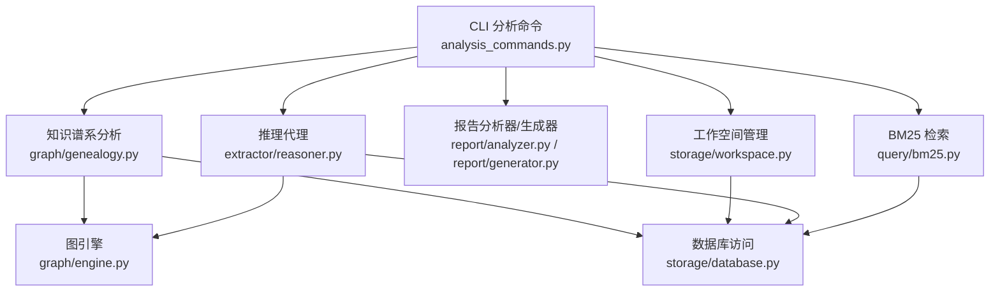
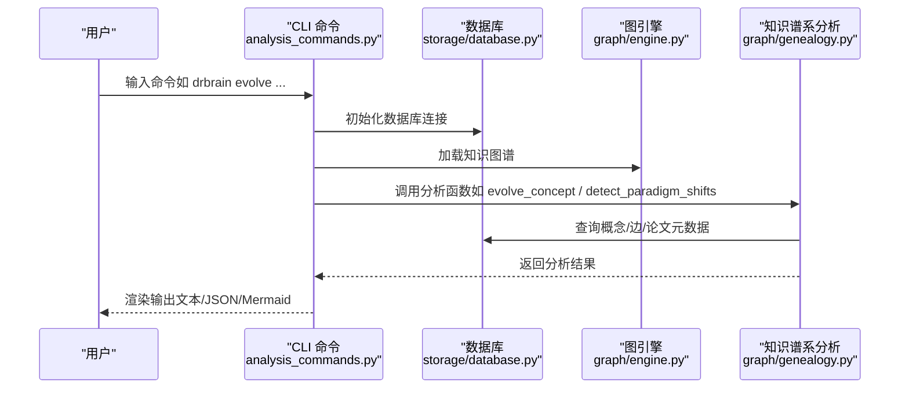
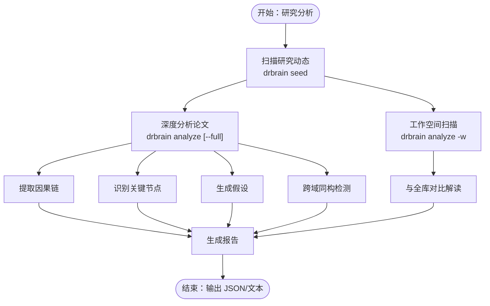
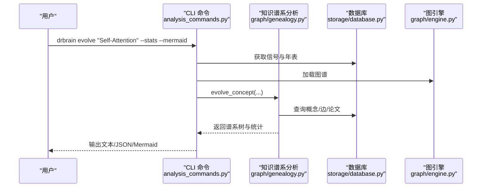
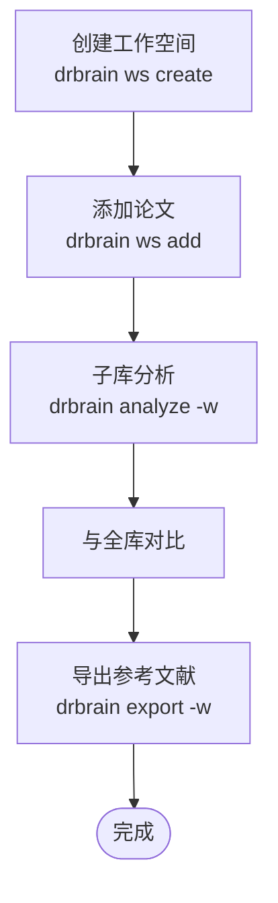
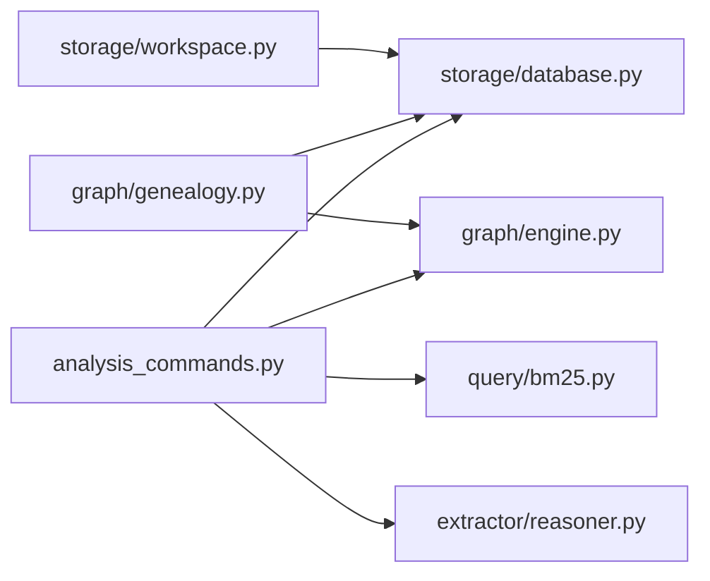

# 分析技能

<cite>
**本文引用的文件**
- [skills/research-analysis/SKILL.md](file://skills/research-analysis/SKILL.md)
- [skills/knowledge-cartography/SKILL.md](file://skills/knowledge-cartography/SKILL.md)
- [skills/workspace-analysis/SKILL.md](file://skills/workspace-analysis/SKILL.md)
- [src/drbrain/cli/analysis_commands.py](file://src/drbrain/cli/analysis_commands.py)
- [src/drbrain/graph/genealogy.py](file://src/drbrain/graph/genealogy.py)
- [src/drbrain/storage/workspace.py](file://src/drbrain/storage/workspace.py)
- [src/drbrain/report/analyzer.py](file://src/drbrain/report/analyzer.py)
- [src/drbrain/report/generator.py](file://src/drbrain/report/generator.py)
- [src/drbrain/extractor/reasoner.py](file://src/drbrain/extractor/reasoner.py)
- [src/drbrain/query/bm25.py](file://src/drbrain/query/bm25.py)
- [src/drbrain/graph/engine.py](file://src/drbrain/graph/engine.py)
- [src/drbrain/storage/database.py](file://src/drbrain/storage/database.py)
</cite>

## 目录
1. [简介](#简介)
2. [项目结构](#项目结构)
3. [核心组件](#核心组件)
4. [架构总览](#架构总览)
5. [详细组件分析](#详细组件分析)
6. [依赖关系分析](#依赖关系分析)
7. [性能考量](#性能考量)
8. [故障排查指南](#故障排查指南)
9. [结论](#结论)
10. [附录](#附录)

## 简介
本文件系统化梳理 DrBrain 的三大分析技能：研究分析（research-analysis）、知识制图（knowledge-cartography）与工作空间分析（workspace-analysis）。围绕每个技能，文档阐述其分析算法、可视化能力、报告生成流程，并给出指标解释、结果解读方法与决策支持应用。同时提供可复现的使用案例，帮助用户开展学术趋势分析、生成知识地图与进行工作空间洞察。

## 项目结构
DrBrain 将“分析”能力以 CLI 命令与后端分析模块协同实现：
- CLI 层：在 analysis_commands.py 中定义各类分析命令（如 evolve、descendants、landscape、paradigm、transfers、isomorphism、difficulty、frontier），负责参数解析、上下文构建与输出渲染。
- 分析引擎层：在 graph/genealogy.py 中实现具体算法（概念谱系、后代追踪、领域时间线、范式转移检测、跨域迁移机会、难度评估、综合前沿等）。
- 工作空间层：在 storage/workspace.py 中管理论文子集（workspace），支持按子库范围运行分析。
- 报告层：在 report/analyzer.py 与 report/generator.py 中组织分析结果并生成报告。
- 推理层：在 extractor/reasoner.py 中提供 LLM-KG 双向推理工具，辅助假设验证与答案生成。
- 检索层：在 query/bm25.py 中提供基于 BM25 的概念检索，为分析提供种子与上下文。

图表来源
- [src/drbrain/cli/analysis_commands.py:1-678](file://src/drbrain/cli/analysis_commands.py#L1-L678)
- [src/drbrain/graph/genealogy.py:1-1001](file://src/drbrain/graph/genealogy.py#L1-L1001)
- [src/drbrain/storage/workspace.py:1-212](file://src/drbrain/storage/workspace.py#L1-L212)
- [src/drbrain/report/analyzer.py](file://src/drbrain/report/analyzer.py)
- [src/drbrain/report/generator.py](file://src/drbrain/report/generator.py)
- [src/drbrain/extractor/reasoner.py](file://src/drbrain/extractor/reasoner.py)
- [src/drbrain/query/bm25.py](file://src/drbrain/query/bm25.py)
- [src/drbrain/graph/engine.py](file://src/drbrain/graph/engine.py)
- [src/drbrain/storage/database.py](file://src/drbrain/storage/database.py)

章节来源
- [src/drbrain/cli/analysis_commands.py:1-678](file://src/drbrain/cli/analysis_commands.py#L1-L678)
- [src/drbrain/graph/genealogy.py:1-1001](file://src/drbrain/graph/genealogy.py#L1-L1001)
- [src/drbrain/storage/workspace.py:1-212](file://src/drbrain/storage/workspace.py#L1-L212)

## 核心组件
- 研究分析（research-analysis）
  - 职责：统一符号推理模块，产出知识前沿报告，覆盖图闭包推理、研究种子检测、因果链、可选的反事实分析、假设生成与跨域同构检测。
  - 关键命令：seed、analyze（含 --full）、citations（共享参考信号）、closure。
  - 输出要点：contested（争议）、emerging（新兴）、resurging（复苏）、declining（衰落）等信号；因果链、关键节点、假设类型（gap_filling、debate_resolution、technology_revival）、跨域同构。

- 知识制图（knowledge-cartography）
  - 职责：从时间演进、结构模式、难度评估与复合前沿四个维度分析知识图谱。
  - 关键命令：seed、evolve、descendants、landscape、paradigm、transfers、isomorphism、difficulty、frontier。
  - 输出要点：概念谱系树、后代追踪、领域时间线、范式转移（替换/爆炸/跨域入侵）、跨域迁移机会、结构同构、难度分类（limitation/future_work/discussion/uncategorized）、综合前沿摘要。

- 工作空间分析（workspace-analysis）
  - 职责：对论文子集（workspace）进行聚焦分析，支持在子库内对比全库结果，提升洞察的针对性与可操作性。
  - 关键命令：ws create/add/remove/list/show/delete；所有分析命令均可配合 --workspace/-w 使用。
  - 输出要点：子库内的研究信号更聚焦；关键节点若同时出现在全库与子库，代表领域中心性更高；子库假设更直接可执行。

章节来源
- [skills/research-analysis/SKILL.md:1-110](file://skills/research-analysis/SKILL.md#L1-L110)
- [skills/knowledge-cartography/SKILL.md:1-182](file://skills/knowledge-cartography/SKILL.md#L1-L182)
- [skills/workspace-analysis/SKILL.md:1-89](file://skills/workspace-analysis/SKILL.md#L1-L89)

## 架构总览
下图展示“知识制图”命令族的调用链路与数据流，体现 CLI 参数到分析算法再到输出渲染的整体过程。

图表来源
- [src/drbrain/cli/analysis_commands.py:214-266](file://src/drbrain/cli/analysis_commands.py#L214-L266)
- [src/drbrain/graph/genealogy.py:14-200](file://src/drbrain/graph/genealogy.py#L14-L200)
- [src/drbrain/storage/database.py](file://src/drbrain/storage/database.py)
- [src/drbrain/graph/engine.py](file://src/drbrain/graph/engine.py)

## 详细组件分析

### 组件一：研究分析（research-analysis）
- 分析算法
  - 图闭包推理：通过 closure 推导逻辑新边，增强种子概念的推理上下文。
  - 研究种子检测：识别 contested/emerging/resurging/declining 等信号，作为前沿扫描基础。
  - 因果链与关键节点：从图中提取多源汇聚的因果链，定位移除后会破坏大量推断的“关键节点”。
  - 假设生成：根据缺口与争议生成 gap_filling、debate_resolution、technology_revival 等假设，附带置信度。
  - 跨域同构：比较不同领域的子图结构相似性，评估方法迁移潜力。
- 可视化与报告
  - JSON 输出便于自动化处理与二次加工。
  - 文本输出强调 active gaps、debates、paradigm shifts 的摘要与示例。
- 指标解释与解读
  - contested：低平均置信度的活跃争议，高价值的新研究目标。
  - emerging/resurging：快速/重启增长，早期介入优势明显。
  - declining：长期停滞，可能已过时或可用现代方法复活。
  - 关键节点：若同时出现在全库与子库，代表领域核心。
  - 假设：子库范围内的假设更具可执行性。
- 决策支持
  - 优先级排序：结合“新兴/复苏”与“关键节点”确定主攻方向。
  - 风险评估：长而脆弱的因果链提示需谨慎验证中间环节。
  - 方法迁移：跨域同构提示可借鉴其他领域的成熟技术路径。

图表来源
- [skills/research-analysis/SKILL.md:22-110](file://skills/research-analysis/SKILL.md#L22-L110)
- [src/drbrain/cli/analysis_commands.py:640-677](file://src/drbrain/cli/analysis_commands.py#L640-L677)

章节来源
- [skills/research-analysis/SKILL.md:1-110](file://skills/research-analysis/SKILL.md#L1-L110)
- [src/drbrain/cli/analysis_commands.py:640-677](file://src/drbrain/cli/analysis_commands.py#L640-L677)

### 组件二：知识制图（knowledge-cartography）
- 分析算法
  - 概念谱系（evolve）：基于 BFS 的祖先/后代追踪，支持统计信号与年表趋势。
  - 后代追踪（descendants）：追踪被引用、扩展、改进的论文后代，支持世代深度与图示化。
  - 领域时间线（landscape）：按时间映射领域演化，标注持久缺口、争议与技术悬崖。
  - 范式转移（paradigm）：检测替换型、爆炸型、跨域入侵型范式变化。
  - 跨域迁移（transfers）：自动或定向识别方法到问题的迁移机会，支持历史时间线与分节溯源。
  - 结构同构（isomorphism）：基于 Jaccard 与标签相似度匹配跨域相似子图。
  - 难度评估（difficulty）：按来源章节类型（limitation/future_work/discussion/uncategorized）分类缺口。
  - 综合前沿（frontier）：整合活跃缺口、争议、范式转移与难度评分。
- 可视化与报告
  - Mermaid 图形：适合概念谱系与后代追踪的树状图。
  - 年表统计：直观显示概念出现趋势与波动。
  - JSON 输出：便于程序化消费与二次可视化。
- 指标解释与解读
  - 信号类型：emerging/established/declining/contested/resurging，反映概念生命周期阶段。
  - 年表趋势：growing/declining/first_appeared，指示上升、下降或首次出现。
  - 迁移机会：置信度越高，跨域迁移可能性越大。
  - 同构：相似结构越强，方法迁移越可行。
- 决策支持
  - 选题规划：结合“新兴/复苏”与“活跃缺口”确定热点与空白。
  - 跨学科借鉴：利用“跨域迁移”与“同构”发现可迁移的技术路径。
  - 风险规避：关注“争议”与“范式转移”，避免已过时的方向。

图表来源
- [src/drbrain/cli/analysis_commands.py:214-266](file://src/drbrain/cli/analysis_commands.py#L214-L266)
- [src/drbrain/graph/genealogy.py:14-200](file://src/drbrain/graph/genealogy.py#L14-L200)

章节来源
- [skills/knowledge-cartography/SKILL.md:1-182](file://skills/knowledge-cartography/SKILL.md#L1-L182)
- [src/drbrain/cli/analysis_commands.py:214-343](file://src/drbrain/cli/analysis_commands.py#L214-L343)
- [src/drbrain/graph/genealogy.py:14-200](file://src/drbrain/graph/genealogy.py#L14-L200)

### 组件三：工作空间分析（workspace-analysis）
- 工作空间管理
  - 创建/添加/移除/列出/显示/删除工作空间，papers.json 存放引用列表（不复制论文）。
  - 支持与分析命令组合：analyze -w、seed -w、query -w、stats -w、closure -w、export -w。
- 分析策略
  - 子库扫描：在工作空间内聚焦研究动态，得到更贴近主题的信号。
  - 对比解读：若某关键节点同时出现在全库与子库，表明其在该领域具有中心地位。
  - 假设可执行性：子库假设更直接指导后续阅读与实验设计。
- 报告与导出
  - 导出子库参考文献至多种格式（如 BibTeX），便于撰写综述或投稿准备。

图表来源
- [skills/workspace-analysis/SKILL.md:24-89](file://skills/workspace-analysis/SKILL.md#L24-L89)
- [src/drbrain/storage/workspace.py:71-200](file://src/drbrain/storage/workspace.py#L71-L200)

章节来源
- [skills/workspace-analysis/SKILL.md:1-89](file://skills/workspace-analysis/SKILL.md#L1-L89)
- [src/drbrain/storage/workspace.py:1-212](file://src/drbrain/storage/workspace.py#L1-L212)

## 依赖关系分析
- 组件耦合
  - CLI 命令依赖图引擎与数据库访问，部分命令还依赖 BM25 检索与推理代理。
  - 知识谱系分析模块是多个命令的共同后端，承担复杂查询与聚合逻辑。
  - 工作空间模块提供论文子集解析，贯穿分析命令的范围控制。
- 外部依赖
  - LLM 模型配置用于自然语言问答与双向推理。
  - 数据库提供概念、论文与边的持久化存储。
- 循环依赖
  - 当前结构清晰，未见循环导入；CLI 仅单向依赖分析模块与存储模块。

图表来源
- [src/drbrain/cli/analysis_commands.py:1-678](file://src/drbrain/cli/analysis_commands.py#L1-L678)
- [src/drbrain/graph/genealogy.py:1-1001](file://src/drbrain/graph/genealogy.py#L1-L1001)
- [src/drbrain/storage/workspace.py:1-212](file://src/drbrain/storage/workspace.py#L1-L212)
- [src/drbrain/extractor/reasoner.py](file://src/drbrain/extractor/reasoner.py)
- [src/drbrain/query/bm25.py](file://src/drbrain/query/bm25.py)
- [src/drbrain/graph/engine.py](file://src/drbrain/graph/engine.py)
- [src/drbrain/storage/database.py](file://src/drbrain/storage/database.py)

章节来源
- [src/drbrain/cli/analysis_commands.py:1-678](file://src/drbrain/cli/analysis_commands.py#L1-L678)
- [src/drbrain/graph/genealogy.py:1-1001](file://src/drbrain/graph/genealogy.py#L1-L1001)
- [src/drbrain/storage/workspace.py:1-212](file://src/drbrain/storage/workspace.py#L1-L212)

## 性能考量
- 复杂度与优化
  - BFS 概念谱系与后代追踪的时间复杂度近似 O(V+E)，可通过限制最大深度与过滤关系集合降低计算量。
  - 年表统计与缺口分类涉及多次 SQL 聚合，建议在构建图谱时预先计算常用统计字段。
  - 跨域迁移与同构检测依赖子图匹配，建议引入索引与缓存机制以加速重复查询。
- I/O 与并发
  - 大规模分析建议批量导出 JSON，避免频繁终端渲染造成的延迟。
  - 双向推理可异步执行，减少等待时间。
- 资源建议
  - 在多核环境下并行化 BM25 检索与 LLM 调用，合理设置并发上限以平衡吞吐与稳定性。

## 故障排查指南
- 常见问题
  - 无 LLM 模型配置：推理命令会提示先执行 setup；请检查配置文件中的模型项。
  - 空知识图谱：frontier/difficulty 等命令在空库上返回空结果，请先执行构建与闭包。
  - 工作空间不存在：确认名称正确且 papers.json 存在；使用 list 显示现有工作空间。
  - 未找到论文：后代追踪或查询命令报错时，检查论文 ID 是否有效。
- 定位手段
  - 使用 --json 输出原始结果，便于进一步诊断。
  - 逐步缩小范围：先在子库运行，再与全库对比，定位异常信号来源。
- 建议流程
  - 先构建图谱（build/embed/closure），再运行分析命令。
  - 若结果为空，检查 seed 命令是否返回信号，确认数据质量与抽取完整性。

章节来源
- [src/drbrain/cli/analysis_commands.py:54-116](file://src/drbrain/cli/analysis_commands.py#L54-L116)
- [src/drbrain/cli/analysis_commands.py:604-637](file://src/drbrain/cli/analysis_commands.py#L604-L637)
- [src/drbrain/storage/workspace.py:130-168](file://src/drbrain/storage/workspace.py#L130-L168)

## 结论
研究分析、知识制图与工作空间分析三者互补：前者聚焦论文级洞察与假设生成，后者从宏观维度刻画知识动态，第三者将分析范围收敛到特定主题，提升决策的针对性与可执行性。通过 CLI 命令与分析模块的协同，DrBrain 提供了从趋势发现、知识地图生成到工作空间洞察的一体化分析能力，适用于学术研究规划、项目选题与文献综述准备。

## 附录
- 实际案例（步骤化）
  - 学术趋势分析
    - 步骤：drbrain seed --json | jq '.[] | {type, label, signal}'，筛选 emerging/resurging，结合 frontier 命令查看活跃缺口与争议。
    - 应用：确定主攻方向与潜在风险点，形成阶段性研究计划。
  - 知识地图生成
    - 步骤：drbrain evolve "Self-Attention" --stats --mermaid，drbrain landscape --top-n 10，drbrain paradigm --workspace gnn-drugs。
    - 应用：绘制概念谱系与时序图，识别范式变化与跨域迁移机会。
  - 工作空间洞察
    - 步骤：drbrain ws create attention-survey -d "注意力机制综述"；drbrain ws add attention-survey p3f8a2 p7b1c4 ...；drbrain analyze --workspace attention-survey --full --json。
    - 应用：在子库内生成更聚焦的假设与关键节点，指导文献阅读与实验设计。

章节来源
- [skills/research-analysis/SKILL.md:76-110](file://skills/research-analysis/SKILL.md#L76-L110)
- [skills/knowledge-cartography/SKILL.md:139-182](file://skills/knowledge-cartography/SKILL.md#L139-L182)
- [skills/workspace-analysis/SKILL.md:63-89](file://skills/workspace-analysis/SKILL.md#L63-L89)