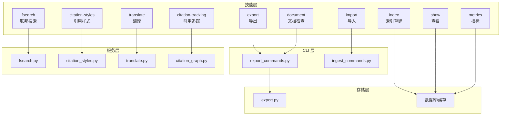
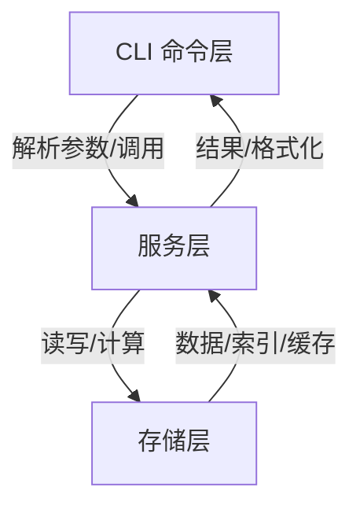
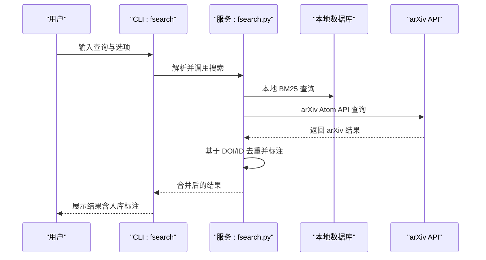
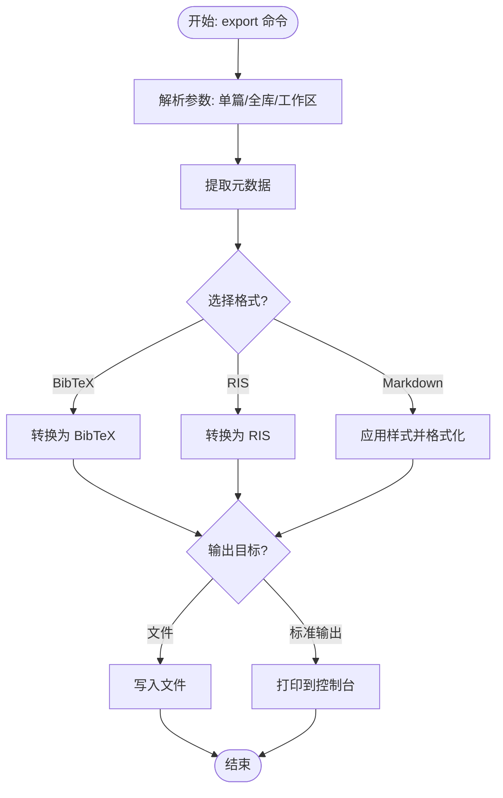
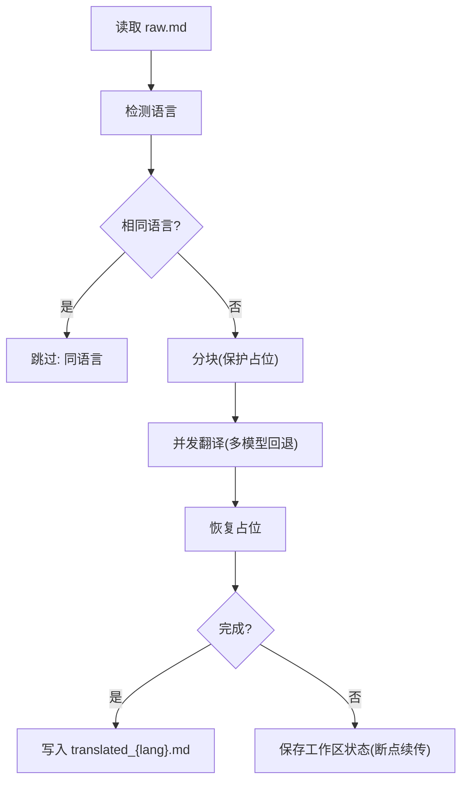
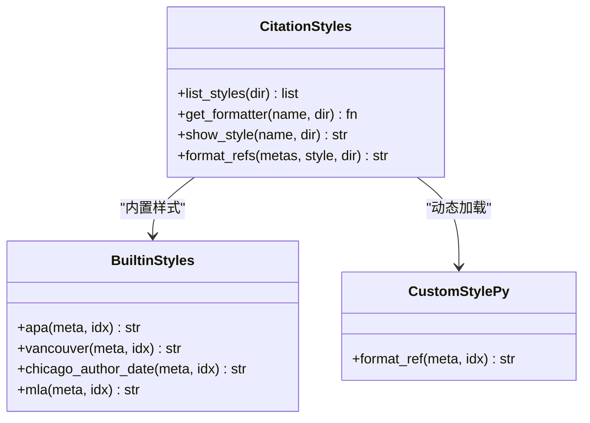
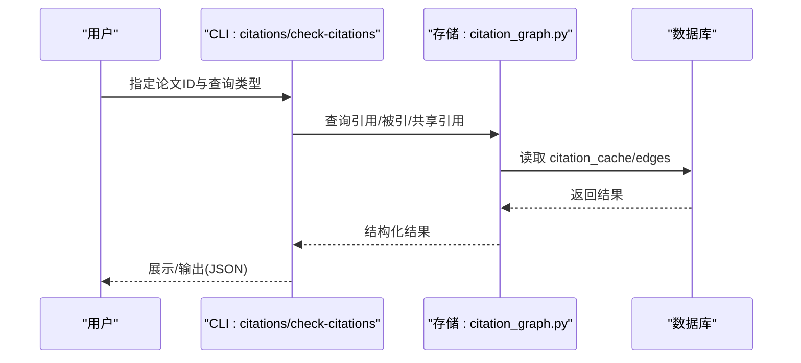
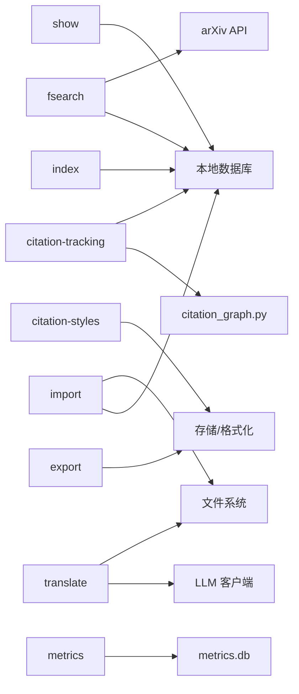

# 工具技能

<cite>
**本文档引用的文件**
- [skills/fsearch/SKILL.md](file://skills/fsearch/SKILL.md)
- [skills/export/SKILL.md](file://skills/export/SKILL.md)
- [skills/import/SKILL.md](file://skills/import/SKILL.md)
- [skills/index/SKILL.md](file://skills/index/SKILL.md)
- [skills/show/SKILL.md](file://skills/show/SKILL.md)
- [skills/metrics/SKILL.md](file://skills/metrics/SKILL.md)
- [skills/translate/SKILL.md](file://skills/translate/SKILL.md)
- [skills/document/SKILL.md](file://skills/document/SKILL.md)
- [skills/citation-styles/SKILL.md](file://skills/citation-styles/SKILL.md)
- [skills/citation-tracking/SKILL.md](file://skills/citation-tracking/SKILL.md)
- [src/drbrain/cli/export_commands.py](file://src/drbrain/cli/export_commands.py)
- [src/drbrain/cli/ingest_commands.py](file://src/drbrain/cli/ingest_commands.py)
- [src/drbrain/services/fsearch.py](file://src/drbrain/services/fsearch.py)
- [src/drbrain/storage/export.py](file://src/drbrain/storage/export.py)
- [src/drbrain/storage/citation_graph.py](file://src/drbrain/storage/citation_graph.py)
- [src/drbrain/services/citation_styles.py](file://src/drbrain/services/citation_styles.py)
- [src/drbrain/services/translate.py](file://src/drbrain/services/translate.py)
</cite>

## 目录
1. [简介](#简介)
2. [项目结构](#项目结构)
3. [核心组件](#核心组件)
4. [架构总览](#架构总览)
5. [详细组件分析](#详细组件分析)
6. [依赖关系分析](#依赖关系分析)
7. [性能考量](#性能考量)
8. [故障排查指南](#故障排查指南)
9. [结论](#结论)
10. [附录](#附录)

## 简介
本文件系统性梳理 DrBrain 的工具技能，覆盖文件搜索（fsearch）、数据导出（export）、数据导入（import）、索引管理（index）、信息显示（show）、指标统计（metrics）、翻译服务（translate）、文档处理（document）、引用样式（citation-styles）与引用追踪（citation-tracking）。文档从功能特性、使用场景、配置选项、批量操作、数据转换与集成技巧等维度展开，并通过图示帮助理解各工具在系统中的位置与交互。

## 项目结构
DrBrain 的工具技能以“技能目录 + CLI 命令 + 服务模块 + 存储模块”的方式组织。技能目录下的 SKILL.md 提供用户视角的使用说明；CLI 命令负责参数解析与调用；服务模块封装业务逻辑；存储模块负责数据持久化与查询。

图表来源
- [skills/fsearch/SKILL.md:1-39](file://skills/fsearch/SKILL.md#L1-L39)
- [skills/export/SKILL.md:1-86](file://skills/export/SKILL.md#L1-L86)
- [skills/import/SKILL.md:1-91](file://skills/import/SKILL.md#L1-L91)
- [skills/index/SKILL.md:1-69](file://skills/index/SKILL.md#L1-L69)
- [skills/show/SKILL.md:1-74](file://skills/show/SKILL.md#L1-L74)
- [skills/metrics/SKILL.md:1-42](file://skills/metrics/SKILL.md#L1-L42)
- [skills/translate/SKILL.md:1-86](file://skills/translate/SKILL.md#L1-L86)
- [skills/document/SKILL.md:1-37](file://skills/document/SKILL.md#L1-L37)
- [skills/citation-styles/SKILL.md:1-57](file://skills/citation-styles/SKILL.md#L1-L57)
- [skills/citation-tracking/SKILL.md:1-88](file://skills/citation-tracking/SKILL.md#L1-L88)
- [src/drbrain/cli/export_commands.py:21-78](file://src/drbrain/cli/export_commands.py#L21-L78)
- [src/drbrain/cli/ingest_commands.py:26-110](file://src/drbrain/cli/ingest_commands.py#L26-L110)
- [src/drbrain/services/fsearch.py:1-178](file://src/drbrain/services/fsearch.py#L1-L178)
- [src/drbrain/storage/export.py:1-180](file://src/drbrain/storage/export.py#L1-L180)
- [src/drbrain/storage/citation_graph.py:1-129](file://src/drbrain/storage/citation_graph.py#L1-L129)
- [src/drbrain/services/citation_styles.py:1-389](file://src/drbrain/services/citation_styles.py#L1-L389)
- [src/drbrain/services/translate.py:1-726](file://src/drbrain/services/translate.py#L1-L726)

章节来源
- [skills/fsearch/SKILL.md:1-39](file://skills/fsearch/SKILL.md#L1-L39)
- [skills/export/SKILL.md:1-86](file://skills/export/SKILL.md#L1-L86)
- [skills/import/SKILL.md:1-91](file://skills/import/SKILL.md#L1-L91)
- [skills/index/SKILL.md:1-69](file://skills/index/SKILL.md#L1-L69)
- [skills/show/SKILL.md:1-74](file://skills/show/SKILL.md#L1-L74)
- [skills/metrics/SKILL.md:1-42](file://skills/metrics/SKILL.md#L1-L42)
- [skills/translate/SKILL.md:1-86](file://skills/translate/SKILL.md#L1-L86)
- [skills/document/SKILL.md:1-37](file://skills/document/SKILL.md#L1-L37)
- [skills/citation-styles/SKILL.md:1-57](file://skills/citation-styles/SKILL.md#L1-L57)
- [skills/citation-tracking/SKILL.md:1-88](file://skills/citation-tracking/SKILL.md#L1-L88)

## 核心组件
- 联邦搜索（fsearch）：本地 + arXiv 联合检索，自动标注已入库状态，支持跨源去重与匹配。
- 导出（export）：将论文元数据导出为 BibTeX、RIS、Markdown 格式，支持单篇、全库与工作区范围导出。
- 导入（import）：从 Zotero、BibTeX、Endnote 等外部参考管理器导入元数据，生成占位论文以便后续补全。
- 索引（index）：基于 BM25 的全文检索索引重建，提升查询准确性与时效性。
- 查看（show）：展示论文元数据、概念类型、论点与知识图谱边，辅助校验入库质量。
- 指标（metrics）：记录搜索与阅读行为，生成周趋势、热词与最读论文等可视化面板。
- 翻译（translate）：对论文原始 Markdown 进行分块保护翻译，支持断点续传、并发与多模型回退。
- 文档（document）：Office 文档结构化检查，输出布局与内容摘要。
- 引用样式（citation-styles）：内置 APA、Vancouver、Chicago、MLA 等样式，支持自定义样式扩展。
- 引用追踪（citation-tracking）：查询参考文献、被引情况、共享引用（前沿信号），并支持文内引用校验。

章节来源
- [skills/fsearch/SKILL.md:11-39](file://skills/fsearch/SKILL.md#L11-L39)
- [skills/export/SKILL.md:14-86](file://skills/export/SKILL.md#L14-L86)
- [skills/import/SKILL.md:13-91](file://skills/import/SKILL.md#L13-L91)
- [skills/index/SKILL.md:13-69](file://skills/index/SKILL.md#L13-L69)
- [skills/show/SKILL.md:14-74](file://skills/show/SKILL.md#L14-L74)
- [skills/metrics/SKILL.md:11-42](file://skills/metrics/SKILL.md#L11-L42)
- [skills/translate/SKILL.md:13-86](file://skills/translate/SKILL.md#L13-L86)
- [skills/document/SKILL.md:11-37](file://skills/document/SKILL.md#L11-L37)
- [skills/citation-styles/SKILL.md:11-57](file://skills/citation-styles/SKILL.md#L11-L57)
- [skills/citation-tracking/SKILL.md:14-88](file://skills/citation-tracking/SKILL.md#L14-L88)

## 架构总览
DrBrain 的工具技能围绕“CLI 命令层 → 服务层 → 存储层”三层组织。CLI 负责参数解析与流程编排；服务层封装算法与业务规则；存储层负责数据库、缓存与文件系统访问。

图表来源
- [src/drbrain/cli/export_commands.py:21-78](file://src/drbrain/cli/export_commands.py#L21-L78)
- [src/drbrain/cli/ingest_commands.py:26-110](file://src/drbrain/cli/ingest_commands.py#L26-L110)
- [src/drbrain/services/fsearch.py:1-178](file://src/drbrain/services/fsearch.py#L1-L178)
- [src/drbrain/storage/export.py:1-180](file://src/drbrain/storage/export.py#L1-L180)
- [src/drbrain/storage/citation_graph.py:1-129](file://src/drbrain/storage/citation_graph.py#L1-L129)
- [src/drbrain/services/citation_styles.py:1-389](file://src/drbrain/services/citation_styles.py#L1-L389)
- [src/drbrain/services/translate.py:1-726](file://src/drbrain/services/translate.py#L1-L726)

## 详细组件分析

### 组件一：联邦搜索（fsearch）
- 功能特性
  - 本地 BM25 检索：基于论文标题、概念标签与论点进行全文匹配。
  - 外部 arXiv 检索：通过 Atom API 查询，自动去重并标注“已入库”。
  - 跨源匹配：基于 DOI 与标准化 arXiv ID 去重。
- 使用场景
  - 快速确认某主题是否已在库中；同时发现外部新论文。
  - 在“本地 + arXiv”或“仅 arXiv”模式间切换。
- 配置与选项
  - 限制每源结果数、JSON 输出、arXiv-only 模式等。
- 批量与集成
  - 可作为“一次性查询”使用；也可与导入/索引流程配合，形成“发现—入库—建索引”的闭环。

图表来源
- [src/drbrain/services/fsearch.py:125-178](file://src/drbrain/services/fsearch.py#L125-L178)
- [src/drbrain/services/fsearch.py:32-95](file://src/drbrain/services/fsearch.py#L32-L95)
- [src/drbrain/services/fsearch.py:98-123](file://src/drbrain/services/fsearch.py#L98-L123)

章节来源
- [skills/fsearch/SKILL.md:11-39](file://skills/fsearch/SKILL.md#L11-L39)
- [src/drbrain/services/fsearch.py:1-178](file://src/drbrain/services/fsearch.py#L1-L178)

### 组件二：导出（export）
- 功能特性
  - 支持 BibTeX、RIS、Markdown 三种格式；Markdown 可选样式。
  - 单篇、全库与工作区范围导出；可直接输出到文件或标准输出。
  - 作者提取自 Actor 类型概念的规范别名，确保引用一致性。
- 使用场景
  - 论文投稿、LaTeX 文献管理、Zotero/Mendeley 导入、阅读清单生成。
- 配置与选项
  - --format、--all、--output、--style、--json。
- 数据转换与集成
  - BibTeX/RIS 字段映射与转义；Markdown 样式由样式引擎统一格式化。

图表来源
- [src/drbrain/cli/export_commands.py:21-78](file://src/drbrain/cli/export_commands.py#L21-L78)
- [src/drbrain/storage/export.py:68-106](file://src/drbrain/storage/export.py#L68-L106)
- [src/drbrain/storage/export.py:108-149](file://src/drbrain/storage/export.py#L108-L149)
- [src/drbrain/storage/export.py:152-168](file://src/drbrain/storage/export.py#L152-L168)
- [src/drbrain/storage/export.py:170-180](file://src/drbrain/storage/export.py#L170-L180)

章节来源
- [skills/export/SKILL.md:14-86](file://skills/export/SKILL.md#L14-L86)
- [src/drbrain/cli/export_commands.py:21-78](file://src/drbrain/cli/export_commands.py#L21-L78)
- [src/drbrain/storage/export.py:1-180](file://src/drbrain/storage/export.py#L1-L180)

### 组件三：导入（import）
- 功能特性
  - 支持 Zotero（本地 SQLite 与 Web API）、BibTeX、Endnote 导入。
  - 自动识别集合/工作区并创建对应工作空间；可预览（dry-run）。
  - 导入后生成占位论文，建议后续执行“抓取/修复”完善元数据。
- 使用场景
  - 从现有参考库迁移；批量合并多个来源的论文集合。
- 配置与选项
  - --list-collections、--collection、--no-pdf、--import-collections、--dry-run、--api-key、--library-id。
- 集成建议
  - 导入 → 抓取 → 修复 → 入库 → 构建 → 索引，形成完整流水线。

章节来源
- [skills/import/SKILL.md:13-91](file://skills/import/SKILL.md#L13-L91)
- [src/drbrain/cli/ingest_commands.py:112-150](file://src/drbrain/cli/ingest_commands.py#L112-L150)

### 组件四：索引（index）
- 功能特性
  - 基于概念与论点的 BM25 全文索引重建；支持加载已有索引或强制重建。
  - 用于加速 drbrain query 的检索效果。
- 使用场景
  - 新增论文后、修复元数据后、查询无结果时。
- 配置与选项
  - --rebuild、--json。
- 验证方法
  - 重建后输出文档计数；随后用关键词验证查询结果。

章节来源
- [skills/index/SKILL.md:13-69](file://skills/index/SKILL.md#L13-L69)
- [src/drbrain/services/fsearch.py:125-178](file://src/drbrain/services/fsearch.py#L125-L178)

### 组件五：信息显示（show）
- 功能特性
  - 展示论文元数据、按类型分组的概念、论点与知识图谱边。
  - 支持 JSON 输出，便于自动化脚本解析。
- 使用场景
  - 校验入库完整性、查找 DOI/期刊/引用数量、快速概览论文内容。
- 配置与选项
  - --json。

章节来源
- [skills/show/SKILL.md:14-74](file://skills/show/SKILL.md#L14-L74)

### 组件六：指标统计（metrics）
- 功能特性
  - 记录搜索事件、阅读事件、周趋势、热词与最读论文。
  - 独立数据库 data/metrics.db，不影响主库。
- 使用场景
  - 分析个人研究习惯、热点主题、阅读偏好。
- 配置与选项
  - --json。

章节来源
- [skills/metrics/SKILL.md:11-42](file://skills/metrics/SKILL.md#L11-L42)

### 组件七：翻译（translate）
- 功能特性
  - 原始 Markdown 保护式分块翻译，保留代码块、公式与图片引用。
  - 并发翻译、指数回退重试、断点续传、支持强制重翻。
- 使用场景
  - 将非母语文献翻译为母语，便于阅读与分享。
- 配置与选项
  - --lang、--force、--json。
- 数据流
  - 检测语言 → 分块 → 保护占位 → LLM 翻译 → 恢复占位 → 写入输出。

图表来源
- [src/drbrain/services/translate.py:562-726](file://src/drbrain/services/translate.py#L562-L726)
- [src/drbrain/services/translate.py:403-470](file://src/drbrain/services/translate.py#L403-L470)
- [src/drbrain/services/translate.py:486-560](file://src/drbrain/services/translate.py#L486-L560)

章节来源
- [skills/translate/SKILL.md:13-86](file://skills/translate/SKILL.md#L13-L86)
- [src/drbrain/services/translate.py:1-726](file://src/drbrain/services/translate.py#L1-L726)

### 组件八：文档处理（document）
- 功能特性
  - Office 文档（DOCX/PPTX/XLSX）结构化检查，输出内容与潜在问题摘要。
- 使用场景
  - 无需打开 GUI 即可预览与校验文档结构。
- 安装提示
  - 需启用可选依赖（office extras）。

章节来源
- [skills/document/SKILL.md:11-37](file://skills/document/SKILL.md#L11-L37)

### 组件九：引用样式（citation-styles）
- 功能特性
  - 内置 APA、Vancouver、Chicago、MLA；支持自定义样式文件。
  - Markdown 导出时可指定样式；样式文件需提供 format_ref(meta, idx)。
- 使用场景
  - 生成符合不同期刊/机构要求的参考文献列表。
- 配置与选项
  - --list、--show、--style。

图表来源
- [src/drbrain/services/citation_styles.py:234-266](file://src/drbrain/services/citation_styles.py#L234-L266)
- [src/drbrain/services/citation_styles.py:268-326](file://src/drbrain/services/citation_styles.py#L268-L326)
- [src/drbrain/services/citation_styles.py:328-365](file://src/drbrain/services/citation_styles.py#L328-L365)
- [src/drbrain/services/citation_styles.py:367-389](file://src/drbrain/services/citation_styles.py#L367-L389)

章节来源
- [skills/citation-styles/SKILL.md:11-57](file://skills/citation-styles/SKILL.md#L11-L57)
- [src/drbrain/services/citation_styles.py:1-389](file://src/drbrain/services/citation_styles.py#L1-L389)

### 组件十：引用追踪（citation-tracking）
- 功能特性
  - 查询参考文献、被引论文、共享引用（前沿信号）。
  - 支持工作区限定与文内引用校验。
- 使用场景
  - 发现未直接引用但共享文献的平行研究；核对写作中的引用清单。
- 配置与选项
  - --type、--workspace、--json、--file。

图表来源
- [src/drbrain/cli/ingest_commands.py:152-247](file://src/drbrain/cli/ingest_commands.py#L152-L247)
- [src/drbrain/cli/ingest_commands.py:249-294](file://src/drbrain/cli/ingest_commands.py#L249-L294)
- [src/drbrain/storage/citation_graph.py:74-129](file://src/drbrain/storage/citation_graph.py#L74-L129)

章节来源
- [skills/citation-tracking/SKILL.md:14-88](file://skills/citation-tracking/SKILL.md#L14-L88)
- [src/drbrain/cli/ingest_commands.py:152-247](file://src/drbrain/cli/ingest_commands.py#L152-L247)
- [src/drbrain/cli/ingest_commands.py:249-294](file://src/drbrain/cli/ingest_commands.py#L249-L294)
- [src/drbrain/storage/citation_graph.py:1-129](file://src/drbrain/storage/citation_graph.py#L1-L129)

## 依赖关系分析
- 组件耦合
  - fsearch 依赖本地数据库与 arXiv API；与 export 的 Markdown 样式解耦。
  - export 依赖存储层的元数据抽取与格式化；与样式系统通过接口解耦。
  - import 与 ingest 流程紧密耦合；后续需执行 build 与 index。
  - translate 依赖 LLM 客户端与工作区状态；与 export 的 Markdown 输出可并行。
  - citation-tracking 依赖 citation_graph 与数据库；与 import/export 为弱耦合。
- 外部依赖
  - arXiv Atom API、LLM 接口、Office 文档解析库（可选）。

图表来源
- [src/drbrain/services/fsearch.py:10-95](file://src/drbrain/services/fsearch.py#L10-L95)
- [src/drbrain/storage/export.py:1-180](file://src/drbrain/storage/export.py#L1-L180)
- [src/drbrain/services/translate.py:1-726](file://src/drbrain/services/translate.py#L1-L726)
- [src/drbrain/storage/citation_graph.py:1-129](file://src/drbrain/storage/citation_graph.py#L1-L129)
- [src/drbrain/services/citation_styles.py:1-389](file://src/drbrain/services/citation_styles.py#L1-L389)

章节来源
- [src/drbrain/services/fsearch.py:1-178](file://src/drbrain/services/fsearch.py#L1-L178)
- [src/drbrain/storage/export.py:1-180](file://src/drbrain/storage/export.py#L1-L180)
- [src/drbrain/services/translate.py:1-726](file://src/drbrain/services/translate.py#L1-L726)
- [src/drbrain/storage/citation_graph.py:1-129](file://src/drbrain/storage/citation_graph.py#L1-L129)
- [src/drbrain/services/citation_styles.py:1-389](file://src/drbrain/services/citation_styles.py#L1-L389)

## 性能考量
- fsearch
  - arXiv 查询默认限制结果数；建议根据需要调整 --limit；本地 BM25 查询受索引质量影响。
- export
  - 全库导出可能产生大量字符串拼接；建议使用 --output 写入文件而非标准输出。
- translate
  - 分块大小与并发度影响吞吐；大块保护内容可能导致恢复后字符数超限，注意日志警告。
- index
  - 重建索引耗时与数据规模相关；建议在维护窗口执行。

## 故障排查指南
- fsearch
  - 若 arXiv 无结果，检查网络与 API 可达性；确认查询词是否包含特殊字符。
- export
  - 缺失作者或字段为空时，先运行审计与修复；确认输出路径权限。
- import
  - Zotero Web API 需要有效 API Key 与 Library ID；本地数据库需具备相邻 PDF。
- index
  - 查询无结果时优先重建索引；确认数据库连接与文件存在。
- translate
  - 若部分分块失败，检查 LLM 模型配置与网络；必要时使用 --force 清理工作区。
- citation-tracking
  - 若共享引用为空，先执行引用扩展；确认论文已入库且有 DOI/arXiv ID。

章节来源
- [skills/fsearch/SKILL.md:23-39](file://skills/fsearch/SKILL.md#L23-L39)
- [skills/export/SKILL.md:19-41](file://skills/export/SKILL.md#L19-L41)
- [skills/import/SKILL.md:35-62](file://skills/import/SKILL.md#L35-L62)
- [skills/index/SKILL.md:33-61](file://skills/index/SKILL.md#L33-L61)
- [skills/translate/SKILL.md:34-64](file://skills/translate/SKILL.md#L34-L64)
- [skills/citation-tracking/SKILL.md:19-58](file://skills/citation-tracking/SKILL.md#L19-L58)

## 结论
DrBrain 的工具技能围绕“发现—入库—构建—检索—导出/翻译—追踪”的完整链路设计，既满足日常研究需求，又提供可扩展的样式与工作流能力。通过合理组合各工具，可实现从文献采集、清洗、结构化到产出与分享的全流程自动化。

## 附录
- 快速命令参考（示例）
  - fsearch：本地/本地+arXiv/arXiv-only 检索，限制结果数与 JSON 输出。
  - export：单篇/全库/工作区导出，指定格式与样式，输出到文件或标准输出。
  - import：Zotero/BibTeX/Endnote 导入，支持预览与集合映射。
  - index：重建索引并验证文档计数。
  - show：查看论文元数据、概念、论点与图谱边，支持 JSON 输出。
  - metrics：查看周趋势、热词与最读论文。
  - translate：按语言分块翻译，支持并发与断点续传。
  - document：Office 文档结构化检查。
  - citation-styles：列出/查看样式，指定样式导出 Markdown。
  - citation-tracking：查询引用/被引/共享引用，校验文内引用。