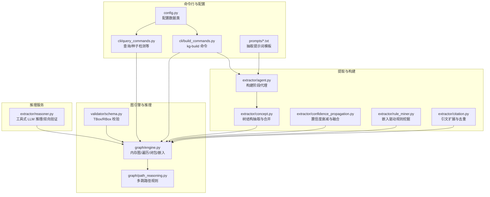
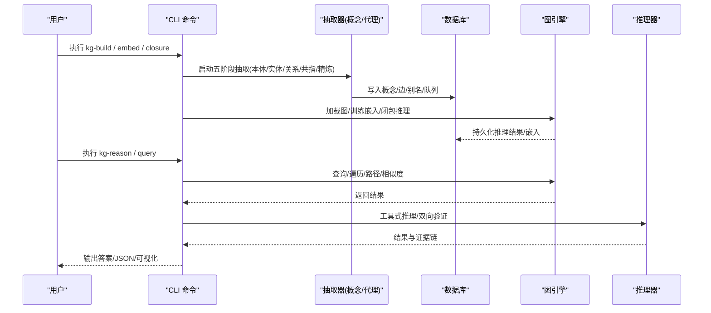
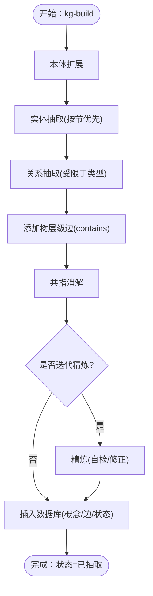
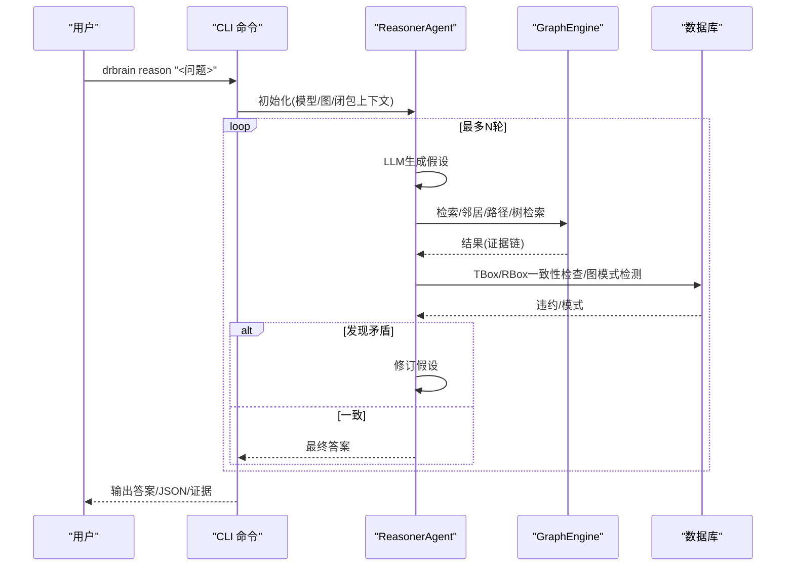
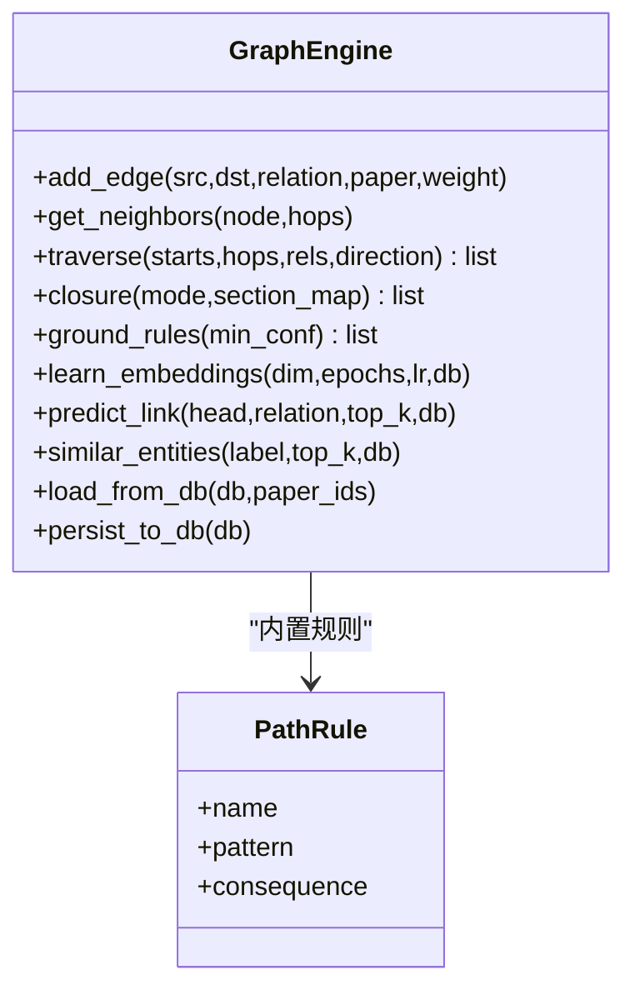
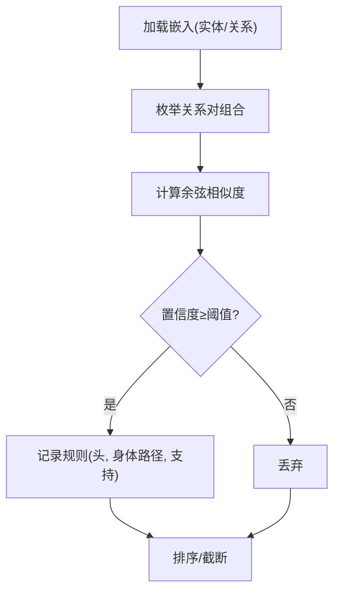
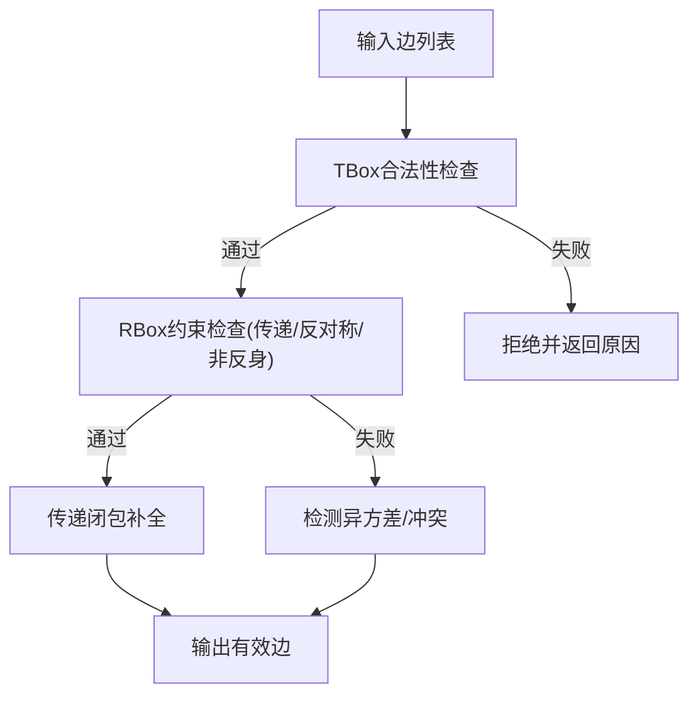
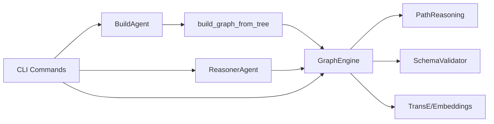

# 知识图谱技能

<cite>
**本文引用的文件**
- [skills/kg-build/SKILL.md](file://skills/kg-build/SKILL.md)
- [skills/kg-reason/SKILL.md](file://skills/kg-reason/SKILL.md)
- [src/drbrain/extractor/concept.py](file://src/drbrain/extractor/concept.py)
- [src/drbrain/extractor/agent.py](file://src/drbrain/extractor/agent.py)
- [src/drbrain/extractor/reasoner.py](file://src/drbrain/extractor/reasoner.py)
- [src/drbrain/extractor/citation.py](file://src/drbrain/extractor/citation.py)
- [src/drbrain/extractor/rule_miner.py](file://src/drbrain/extractor/rule_miner.py)
- [src/drbrain/extractor/confidence_propagation.py](file://src/drbrain/extractor/confidence_propagation.py)
- [src/drbrain/graph/engine.py](file://src/drbrain/graph/engine.py)
- [src/drbrain/graph/path_reasoning.py](file://src/drbrain/graph/path_reasoning.py)
- [src/drbrain/validator/schema.py](file://src/drbrain/validator/schema.py)
- [src/drbrain/cli/build_commands.py](file://src/drbrain/cli/build_commands.py)
- [src/drbrain/cli/query_commands.py](file://src/drbrain/cli/query_commands.py)
- [src/drbrain/config.py](file://src/drbrain/config.py)
- [prompts/ontology.txt](file://prompts/ontology.txt)
- [prompts/entities.txt](file://prompts/entities.txt)
- [prompts/relations.txt](file://prompts/relations.txt)
</cite>

## 目录
1. [简介](#简介)
2. [项目结构](#项目结构)
3. [核心组件](#核心组件)
4. [架构总览](#架构总览)
5. [详细组件分析](#详细组件分析)
6. [依赖分析](#依赖分析)
7. [性能考虑](#性能考虑)
8. [故障排查指南](#故障排查指南)
9. [结论](#结论)
10. [附录](#附录)

## 简介
本文件面向 DrBrain 的“知识图谱技能”，系统化阐述两大核心能力：知识图谱构建（kg-build）与知识图谱推理（kg-reason）。前者通过五阶段 LLM 抽取、TransE 图嵌入训练与规则闭包推理，产出可检索、可分析的学术知识图；后者以自然语言问答与 LLM 工具调用驱动的双向验证机制，实现跨论文的深度推理与假设验证。文档覆盖构建流程、实体关系抽取、图结构优化、推理模式、配置参数、性能优化与实践场景。

## 项目结构
围绕知识图谱技能的关键代码分布在以下模块：
- 提取与构建：extractor 子系统负责概念与关系抽取、多阶段代理执行、树结构引导与置信度传播。
- 图引擎与推理：graph 子系统提供内存图、遍历、闭包推理、路径规则与嵌入查询。
- 推理服务：reasoner 提供工具式 LLM 推理与双向验证。
- 命令行入口：CLI 将上述能力编排为可执行命令，贯穿构建、嵌入与推理链路。
- 配置与提示词：config 定义运行时配置；prompts 提供抽取阶段的系统提示词模板。

图表来源
- [src/drbrain/extractor/agent.py:1-368](file://src/drbrain/extractor/agent.py#L1-L368)
- [src/drbrain/extractor/concept.py:1-901](file://src/drbrain/extractor/concept.py#L1-L901)
- [src/drbrain/extractor/confidence_propagation.py:1-87](file://src/drbrain/extractor/confidence_propagation.py#L1-L87)
- [src/drbrain/extractor/rule_miner.py:1-290](file://src/drbrain/extractor/rule_miner.py#L1-L290)
- [src/drbrain/extractor/citation.py:1-710](file://src/drbrain/extractor/citation.py#L1-L710)
- [src/drbrain/graph/engine.py:1-1118](file://src/drbrain/graph/engine.py#L1-L1118)
- [src/drbrain/graph/path_reasoning.py:1-212](file://src/drbrain/graph/path_reasoning.py#L1-L212)
- [src/drbrain/validator/schema.py:1-211](file://src/drbrain/validator/schema.py#L1-L211)
- [src/drbrain/extractor/reasoner.py:1-677](file://src/drbrain/extractor/reasoner.py#L1-L677)
- [src/drbrain/cli/build_commands.py:1-361](file://src/drbrain/cli/build_commands.py#L1-L361)
- [src/drbrain/cli/query_commands.py:1-738](file://src/drbrain/cli/query_commands.py#L1-L738)
- [src/drbrain/config.py:1-292](file://src/drbrain/config.py#L1-L292)
- [prompts/ontology.txt:1-23](file://prompts/ontology.txt#L1-L23)
- [prompts/entities.txt:1-19](file://prompts/entities.txt#L1-L19)
- [prompts/relations.txt:1-24](file://prompts/relations.txt#L1-L24)

章节来源
- [skills/kg-build/SKILL.md:1-139](file://skills/kg-build/SKILL.md#L1-L139)
- [skills/kg-reason/SKILL.md:1-105](file://skills/kg-reason/SKILL.md#L1-L105)

## 核心组件
- 构建阶段代理（BuildAgent）：封装五阶段抽取（本体扩展、实体、关系、共指消解、迭代精炼），具备幂等性、重试与结果缓存。
- 概念抽取与合并（build_graph_from_tree）：基于 PageIndex 树结构，按节优先级并发抽取，应用树位置置信度加权与跨节论据链接。
- 图引擎（GraphEngine）：内存图（NetworkX）、遍历、闭包（符号规则+嵌入增强）、路径规则、嵌入学习与相似度查询。
- 推理器（ReasonerAgent）：工具式 LLM 推理（检索/邻居/路径/树检索/摘要/章节内容），支持双向验证（Hypothesis → KG 一致性检查）。
- 规则挖掘（rule_miner）：从 TransE 关系向量与图路径中挖掘复合关系规则，指导闭包推理。
- 置信度传播（confidence_propagation）：多跳不确定性衰减与独立路径概率融合。
- 校验（validator/schema）：TBox 类型约束与 RBox 关系约束（传递、反对称、非反身）。

章节来源
- [src/drbrain/extractor/agent.py:53-368](file://src/drbrain/extractor/agent.py#L53-L368)
- [src/drbrain/extractor/concept.py:420-901](file://src/drbrain/extractor/concept.py#L420-L901)
- [src/drbrain/graph/engine.py:33-1118](file://src/drbrain/graph/engine.py#L33-L1118)
- [src/drbrain/extractor/reasoner.py:16-677](file://src/drbrain/extractor/reasoner.py#L16-L677)
- [src/drbrain/extractor/rule_miner.py:33-290](file://src/drbrain/extractor/rule_miner.py#L33-L290)
- [src/drbrain/extractor/confidence_propagation.py:31-87](file://src/drbrain/extractor/confidence_propagation.py#L31-L87)
- [src/drbrain/validator/schema.py:63-211](file://src/drbrain/validator/schema.py#L63-L211)

## 架构总览
下图展示从“构建”到“推理”的端到端流程：CLI 调用构建命令，执行五阶段抽取并将结果写入数据库；随后可选训练嵌入与闭包推理；最终在查询与推理命令中使用图引擎与嵌入能力。

图表来源
- [src/drbrain/cli/build_commands.py:97-361](file://src/drbrain/cli/build_commands.py#L97-L361)
- [src/drbrain/extractor/concept.py:420-901](file://src/drbrain/extractor/concept.py#L420-L901)
- [src/drbrain/graph/engine.py:624-786](file://src/drbrain/graph/engine.py#L624-L786)
- [src/drbrain/extractor/reasoner.py:282-677](file://src/drbrain/extractor/reasoner.py#L282-L677)

## 详细组件分析

### 组件 A：kg-build（知识图谱构建）
- 流程分层
  - 阶段一：本体扩展（基于目录层级映射到六类概念子类别）
  - 阶段二：实体抽取（按节优先级并发，带置信度加权）
  - 阶段三：关系抽取（基于允许关系矩阵）
  - 阶段四：共指消解（统一同义标签）
  - 阶段五：迭代精炼（自检与修正）
- 数据落库
  - 概念：类型、标签、置信度、节与节点 ID
  - 边：关系、来源论文、节与节点 ID
  - 状态：上传 → 抽取
- 可视化：构建命令输出各阶段统计，并进行跨论文概念去重

图表来源
- [src/drbrain/extractor/concept.py:420-901](file://src/drbrain/extractor/concept.py#L420-L901)
- [src/drbrain/extractor/agent.py:198-368](file://src/drbrain/extractor/agent.py#L198-L368)
- [src/drbrain/cli/build_commands.py:97-278](file://src/drbrain/cli/build_commands.py#L97-L278)

章节来源
- [skills/kg-build/SKILL.md:14-109](file://skills/kg-build/SKILL.md#L14-L109)
- [src/drbrain/cli/build_commands.py:97-278](file://src/drbrain/cli/build_commands.py#L97-L278)
- [src/drbrain/extractor/concept.py:420-901](file://src/drbrain/extractor/concept.py#L420-L901)
- [src/drbrain/extractor/agent.py:53-368](file://src/drbrain/extractor/agent.py#L53-L368)

### 组件 B：kg-reason（知识图谱推理）
- 两种模式
  - ask：快速 KGQA（检索→回答），支持 top-k 概念与 JSON 输出
  - reason：LLM 工具式推理（检索/邻居/路径/树检索/摘要/章节内容），支持双向验证（Hypothesis ↔ KG）
- 工具集
  - 检索概念、邻居、路径
  - 文档结构与章节内容读取
  - 跨节语义检索（Collapsed Tree Retrieval）
  - RAPTOR 层次摘要
- 双向验证
  - 基于 TBox/RBox 约束与图模式（争议、缺口、矛盾）反馈给 LLM，迭代修订假设

图表来源
- [src/drbrain/extractor/reasoner.py:282-677](file://src/drbrain/extractor/reasoner.py#L282-L677)
- [src/drbrain/graph/engine.py:624-786](file://src/drbrain/graph/engine.py#L624-L786)

章节来源
- [skills/kg-reason/SKILL.md:15-105](file://skills/kg-reason/SKILL.md#L15-L105)
- [src/drbrain/extractor/reasoner.py:16-677](file://src/drbrain/extractor/reasoner.py#L16-L677)

### 组件 C：图引擎与闭包推理
- 图操作
  - 添加边、N 跳邻居、BFS 遍历（关系过滤/方向控制）
  - 加载/持久化图、增量训练嵌入、相似度查询
- 闭包推理
  - 符号规则：争议引发辩论、方法替换的间接演化、缺口被解决等
  - 多跳路径规则：内置模式匹配与扩展
  - 传递闭包：对声明为传递的关系自动补全
  - 异方差检测：发现反对称关系的双向边
  - 嵌入增强：TransE 分数加权置信度
- 研究种子检测：基于图模式与时间维度的热点/停滞/跨域同构等信号

图表来源
- [src/drbrain/graph/engine.py:33-316](file://src/drbrain/graph/engine.py#L33-L316)
- [src/drbrain/graph/path_reasoning.py:9-56](file://src/drbrain/graph/path_reasoning.py#L9-L56)

章节来源
- [src/drbrain/graph/engine.py:124-316](file://src/drbrain/graph/engine.py#L124-L316)
- [src/drbrain/graph/path_reasoning.py:131-212](file://src/drbrain/graph/path_reasoning.py#L131-L212)

### 组件 D：规则挖掘与置信度传播
- 规则挖掘
  - 基于 TransE 关系向量的路径组合相似度，发现复合关系规则
  - 图游走统计常见路径模式，映射到最接近的关系作为头
- 置信度传播
  - 单跳衰减（默认 0.85），章节感知衰减（方法/结果更稳健）
  - 多路径概率融合（独立路径取 1-∏(1-p_i)）

图表来源
- [src/drbrain/extractor/rule_miner.py:33-106](file://src/drbrain/extractor/rule_miner.py#L33-L106)

章节来源
- [src/drbrain/extractor/rule_miner.py:1-290](file://src/drbrain/extractor/rule_miner.py#L1-L290)
- [src/drbrain/extractor/confidence_propagation.py:31-87](file://src/drbrain/extractor/confidence_propagation.py#L31-L87)

### 组件 E：校验与一致性
- TBox：概念类型允许的关系集合
- RBox：传递、反对称、非反身等关系约束
- 闭包前检测异方差与传递闭包缺口，保证图一致性

图表来源
- [src/drbrain/validator/schema.py:63-211](file://src/drbrain/validator/schema.py#L63-L211)

章节来源
- [src/drbrain/validator/schema.py:1-211](file://src/drbrain/validator/schema.py#L1-L211)

## 依赖分析
- 组件耦合
  - 构建阶段代理与抽取器紧密耦合，确保抽取流程的幂等与可追踪
  - 图引擎与抽取结果强耦合，闭包与嵌入训练依赖图结构
  - 推理器依赖图引擎与数据库，提供工具接口
- 外部依赖
  - LLM 模型（通过配置注入）
  - 嵌入提供者（本地/云兼容）
  - API 缓存与外部引文服务（Semantics Scholar/CrossRef/OpenAlex）

图表来源
- [src/drbrain/extractor/agent.py:53-368](file://src/drbrain/extractor/agent.py#L53-L368)
- [src/drbrain/extractor/concept.py:420-901](file://src/drbrain/extractor/concept.py#L420-L901)
- [src/drbrain/graph/engine.py:33-316](file://src/drbrain/graph/engine.py#L33-L316)
- [src/drbrain/extractor/reasoner.py:16-677](file://src/drbrain/extractor/reasoner.py#L16-L677)
- [src/drbrain/cli/build_commands.py:97-361](file://src/drbrain/cli/build_commands.py#L97-L361)

章节来源
- [src/drbrain/extractor/agent.py:53-368](file://src/drbrain/extractor/agent.py#L53-L368)
- [src/drbrain/extractor/concept.py:420-901](file://src/drbrain/extractor/concept.py#L420-L901)
- [src/drbrain/graph/engine.py:33-316](file://src/drbrain/graph/engine.py#L33-L316)
- [src/drbrain/extractor/reasoner.py:16-677](file://src/drbrain/extractor/reasoner.py#L16-L677)
- [src/drbrain/cli/build_commands.py:97-361](file://src/drbrain/cli/build_commands.py#L97-L361)

## 性能考虑
- 并发与限流
  - 实体抽取采用信号量限制并发（默认 10），避免 LLM 速率限制
  - 引文扩展按速率限制与指数退避，降低外部 API 限流风险
- 嵌入训练
  - TransE 支持增量训练（复用已有实体向量），减少重新训练成本
  - 嵌入维度与训练轮次可调，平衡质量与速度
- 图操作
  - 闭包仅对种子节点的 2 跳子图执行，显著降低复杂度
  - 路径规则匹配预构建关系邻接索引，提升查找效率
- 检索与排序
  - BM25 搜索后可选图中心性混合排序，避免引入重型图算法
  - 树检索结合 LLM 与向量，针对单篇论文实现高效定位

章节来源
- [src/drbrain/extractor/concept.py:284-341](file://src/drbrain/extractor/concept.py#L284-L341)
- [src/drbrain/extractor/citation.py:93-148](file://src/drbrain/extractor/citation.py#L93-L148)
- [src/drbrain/graph/engine.py:787-806](file://src/drbrain/graph/engine.py#L787-L806)
- [src/drbrain/cli/query_commands.py:460-498](file://src/drbrain/cli/query_commands.py#L460-L498)

## 故障排查指南
- 构建阶段
  - 未配置 LLM 模型：构建命令会提示“无 LLM 模型配置”
  - 无 raw.md 或树缺失：需先执行“导入/解析”流程，或重建树
  - 重复/无效边：插入时忽略并记录调试日志
- 推理阶段
  - 无图数据：训练嵌入前需先完成构建
  - LLM 调用失败：检查模型可用性与凭据，推理器具备回退与错误返回
  - 双向验证持续冲突：关注违约与图模式提示，逐步缩小假设范围
- 查询与种子
  - 统计为空：确认工作区过滤条件与论文状态
  - 种子检测：依赖图模式与时间维度，必要时补充闭包推理

章节来源
- [src/drbrain/cli/build_commands.py:142-147](file://src/drbrain/cli/build_commands.py#L142-L147)
- [src/drbrain/cli/build_commands.py:160-184](file://src/drbrain/cli/build_commands.py#L160-L184)
- [src/drbrain/cli/build_commands.py:246-248](file://src/drbrain/cli/build_commands.py#L246-L248)
- [src/drbrain/extractor/reasoner.py:384-387](file://src/drbrain/extractor/reasoner.py#L384-L387)
- [src/drbrain/cli/query_commands.py:77-177](file://src/drbrain/cli/query_commands.py#L77-L177)

## 结论
kg-build 与 kg-reason 形成“抽取—嵌入—闭包—检索—推理”的完整闭环：前者以树结构与多阶段 LLM 抽取构建高质量知识图，后者以工具式推理与双向验证实现可解释、可溯源的智能问答与研究探索。通过规则挖掘、置信度传播与严格校验，系统在准确性与可解释性之间取得平衡，适用于复杂学术场景下的跨论文合成与假设验证。

## 附录

### 配置参数说明（节选）
- LLM 模型：models 列表，用于抽取与推理
- API：S2、CrossRef、OpenAlex 等外部服务密钥与缓存 TTL
- 目录：inbox、pending、papers、cache、logs 等路径
- 数据库：SQLite 路径
- 提取：最大并发（抽取阶段）
- BM25：检索参数 k1/b
- 队列：弱阈值与自动接受阈值
- 获取：并发、超时、回退顺序、代理设置
- 嵌入：provider、模型、设备、top_k、源、批量大小等
- 备份：SSH/rsync 目标与模式

章节来源
- [src/drbrain/config.py:44-292](file://src/drbrain/config.py#L44-L292)

### 提示词模板（节选）
- 本体：限定六类概念与子类别，要求领域特定标签
- 实体：基于本体的标签、类型、置信度
- 关系：基于类型允许的关系集合，强调明确学术连接

章节来源
- [prompts/ontology.txt:1-23](file://prompts/ontology.txt#L1-L23)
- [prompts/entities.txt:1-19](file://prompts/entities.txt#L1-L19)
- [prompts/relations.txt:1-24](file://prompts/relations.txt#L1-L24)