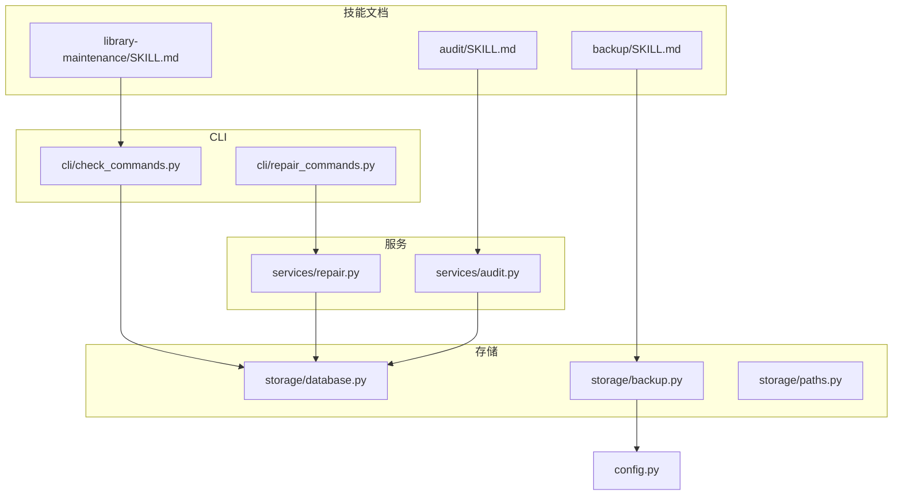
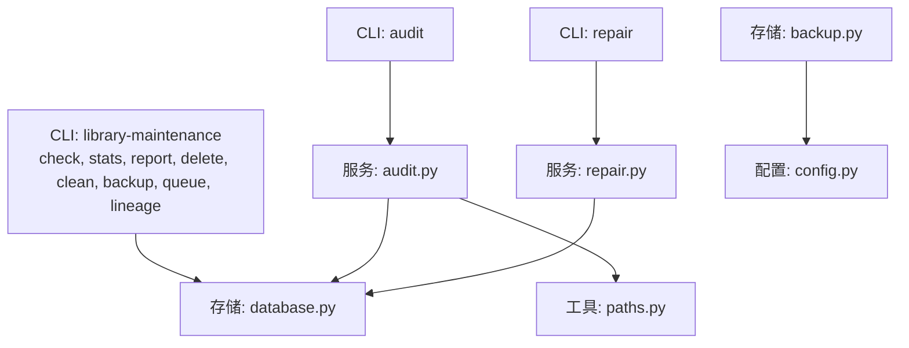
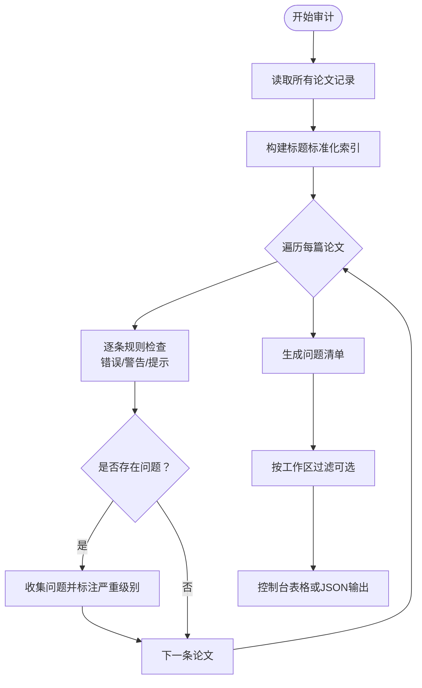
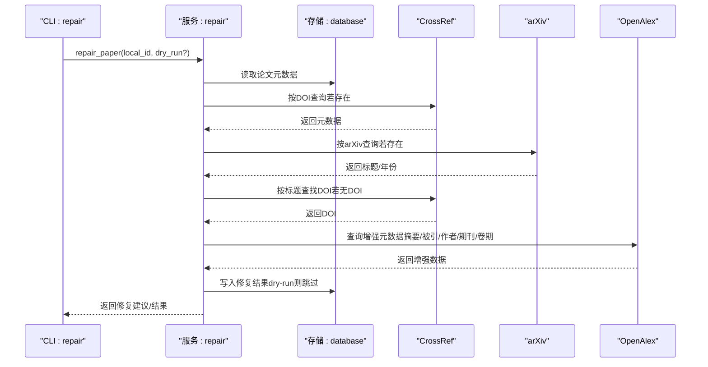
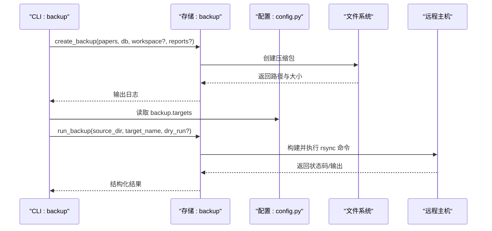
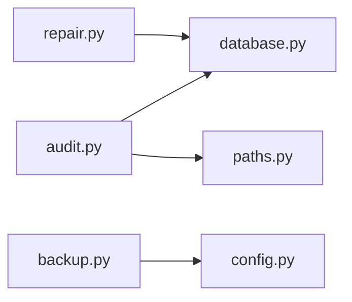

# 维护技能

<cite>
**本文引用的文件**
- [skills/library-maintenance/SKILL.md](file://skills/library-maintenance/SKILL.md)
- [skills/audit/SKILL.md](file://skills/audit/SKILL.md)
- [skills/backup/SKILL.md](file://skills/backup/SKILL.md)
- [src/drbrain/services/audit.py](file://src/drbrain/services/audit.py)
- [src/drbrain/services/repair.py](file://src/drbrain/services/repair.py)
- [src/drbrain/storage/backup.py](file://src/drbrain/storage/backup.py)
- [src/drbrain/storage/database.py](file://src/drbrain/storage/database.py)
- [src/drbrain/storage/paths.py](file://src/drbrain/storage/paths.py)
- [src/drbrain/cli/check_commands.py](file://src/drbrain/cli/check_commands.py)
- [src/drbrain/cli/repair_commands.py](file://src/drbrain/cli/repair_commands.py)
- [src/drbrain/config.py](file://src/drbrain/config.py)
</cite>

## 目录
1. [简介](#简介)
2. [项目结构](#项目结构)
3. [核心组件](#核心组件)
4. [架构总览](#架构总览)
5. [详细组件分析](#详细组件分析)
6. [依赖分析](#依赖分析)
7. [性能考虑](#性能考虑)
8. [故障排查指南](#故障排查指南)
9. [结论](#结论)
10. [附录](#附录)

## 简介
本文件面向 DrBrain 的“维护技能”，系统化阐述三类关键能力：库维护（library-maintenance）、审计（audit）与备份（backup）。内容覆盖数据清理、索引重建、完整性检查等维护操作；解释审计技能如何监控系统状态、追踪变更历史与检测异常行为；详述备份技能的数据保护机制、恢复流程与灾难恢复策略，并提供维护计划制定、自动化配置与故障预防建议。

## 项目结构
DrBrain 将维护相关的功能以“技能”文档与后端服务/存储模块协同实现：
- 技能文档层：skills/library-maintenance、skills/audit、skills/backup 提供用户可读的使用说明与工作流。
- 命令层：CLI 模块负责解析参数、调用服务与存储模块。
- 服务层：审计、修复等业务逻辑封装在 services 子模块。
- 存储层：备份、数据库、路径工具等封装在 storage 子模块。
- 配置层：类型化配置定义与加载在 config 中。

图表来源
- [skills/library-maintenance/SKILL.md:1-166](file://skills/library-maintenance/SKILL.md#L1-L166)
- [skills/audit/SKILL.md:1-88](file://skills/audit/SKILL.md#L1-L88)
- [skills/backup/SKILL.md:1-58](file://skills/backup/SKILL.md#L1-L58)
- [src/drbrain/cli/check_commands.py:24-629](file://src/drbrain/cli/check_commands.py#L24-L629)
- [src/drbrain/cli/repair_commands.py:14-438](file://src/drbrain/cli/repair_commands.py#L14-L438)
- [src/drbrain/services/audit.py:30-396](file://src/drbrain/services/audit.py#L30-L396)
- [src/drbrain/services/repair.py:265-337](file://src/drbrain/services/repair.py#L265-L337)
- [src/drbrain/storage/backup.py:26-240](file://src/drbrain/storage/backup.py#L26-L240)
- [src/drbrain/storage/database.py:10-156](file://src/drbrain/storage/database.py#L10-L156)
- [src/drbrain/storage/paths.py:6-29](file://src/drbrain/storage/paths.py#L6-L29)
- [src/drbrain/config.py:144-179](file://src/drbrain/config.py#L144-L179)

章节来源
- [skills/library-maintenance/SKILL.md:1-166](file://skills/library-maintenance/SKILL.md#L1-L166)
- [skills/audit/SKILL.md:1-88](file://skills/audit/SKILL.md#L1-L88)
- [skills/backup/SKILL.md:1-58](file://skills/backup/SKILL.md#L1-L58)

## 核心组件
- 库维护（library-maintenance）
  - 包含初始化设置、环境诊断、统计信息、单篇报告、删除论文、重置库、备份、置信度队列管理、作者谱系追踪等能力。
  - 关键 CLI：setup、check、stats、report、delete、clean、backup、queue、lineage。
- 审计（audit）
  - 对全库执行 15 条规则扫描，按严重级别（错误/警告/提示）输出问题清单与修复建议。
  - 支持按工作区过滤、JSON 输出、仅查看错误或全部问题。
- 备份（backup）
  - 本地 tar.gz 快照与远程 rsync 同步两种模式，支持列出备份、自定义输出路径、目标预览与实际同步。

章节来源
- [skills/library-maintenance/SKILL.md:17-166](file://skills/library-maintenance/SKILL.md#L17-L166)
- [skills/audit/SKILL.md:14-88](file://skills/audit/SKILL.md#L14-L88)
- [skills/backup/SKILL.md:10-58](file://skills/backup/SKILL.md#L10-L58)

## 架构总览
维护技能围绕“CLI → 服务 → 存储/配置”的分层设计展开。审计与修复服务依赖数据库访问；备份服务依赖配置中的目标定义与外部工具（tar/ssh/rsync）；路径工具统一管理论文目录结构。

图表来源
- [src/drbrain/cli/check_commands.py:24-629](file://src/drbrain/cli/check_commands.py#L24-L629)
- [src/drbrain/cli/repair_commands.py:14-438](file://src/drbrain/cli/repair_commands.py#L14-L438)
- [src/drbrain/services/audit.py:30-396](file://src/drbrain/services/audit.py#L30-L396)
- [src/drbrain/services/repair.py:265-337](file://src/drbrain/services/repair.py#L265-L337)
- [src/drbrain/storage/database.py:10-156](file://src/drbrain/storage/database.py#L10-L156)
- [src/drbrain/storage/backup.py:26-240](file://src/drbrain/storage/backup.py#L26-L240)
- [src/drbrain/storage/paths.py:6-29](file://src/drbrain/storage/paths.py#L6-L29)
- [src/drbrain/config.py:144-179](file://src/drbrain/config.py#L144-L179)

## 详细组件分析

### 审计（audit）组件分析
- 规则范围与严重级别
  - 错误级（必须修复）：缺失标题、缺失原始元数据文件。
  - 警告级（应修复）：缺少 DOI/ArXiv/S2ID、摘要为空、年份缺失、期刊缺失、缺少作者概念、raw.md 过短、树结构缺失或为空、概念数量过少、标题中存在未解析的环境变量占位符。
  - 提示级（建议关注）：无边、占位符状态、超过 30 天的占位符、重复标题（标准化后）。
- 数据来源与处理
  - 从数据库读取论文与概念列表，结合 per-paper 目录下的 raw.md 与 tree.json 文件路径工具进行判定。
  - 使用标题标准化索引识别重复项。
- 输出与过滤
  - 支持按严重级别筛选、按工作区过滤、JSON 输出。
  - 控制台表格展示汇总统计。

图表来源
- [src/drbrain/services/audit.py:30-309](file://src/drbrain/services/audit.py#L30-L309)
- [src/drbrain/storage/paths.py:11-18](file://src/drbrain/storage/paths.py#L11-L18)

章节来源
- [skills/audit/SKILL.md:14-88](file://skills/audit/SKILL.md#L14-L88)
- [src/drbrain/services/audit.py:30-396](file://src/drbrain/services/audit.py#L30-L396)
- [src/drbrain/storage/paths.py:6-29](file://src/drbrain/storage/paths.py#L6-L29)

### 修复（repair）组件分析
- 修复来源与策略
  - CrossRef（DOI）：补全标题、年份、作者、期刊、摘要、被引数。
  - arXiv：基于 arXiv ID 补全标题与年份。
  - 标题+年份：通过 CrossRef 查找 DOI。
  - OpenAlex：补充摘要、被引数、期刊、卷期页码及作者信息。
  - 标题归一化：修正全大写标题大小写格式。
- 执行流程
  - 读取单篇论文元数据，依次尝试各修复源，生成修复建议；dry-run 模式仅返回建议不写入数据库。
  - 实际修复时按字段更新 papers 或 paper_ids 表，并提交事务。

图表来源
- [src/drbrain/cli/repair_commands.py:14-76](file://src/drbrain/cli/repair_commands.py#L14-L76)
- [src/drbrain/services/repair.py:265-337](file://src/drbrain/services/repair.py#L265-L337)

章节来源
- [src/drbrain/services/repair.py:9-337](file://src/drbrain/services/repair.py#L9-L337)
- [src/drbrain/cli/repair_commands.py:14-76](file://src/drbrain/cli/repair_commands.py#L14-L76)

### 备份（backup）组件分析
- 本地 tar.gz 备份
  - 将 papers、数据库、workspace、reports 目录打包为 drbrain-YYYYMMDD-HHMMSS.tar.gz，记录压缩包大小。
- 远程 rsync 同步
  - 依据配置中的 BackupTargetConfig 定义目标主机、用户、路径、端口、密钥/密码、传输模式与排除规则。
  - 支持压缩与 dry-run 预览；失败时抛出配置错误并清理临时 askpass 文件。
- 列表与展示
  - 支持列出本地备份与已配置的远程目标信息。

图表来源
- [src/drbrain/storage/backup.py:26-240](file://src/drbrain/storage/backup.py#L26-L240)
- [src/drbrain/config.py:144-179](file://src/drbrain/config.py#L144-L179)
- [src/drbrain/cli/export_commands.py:283-313](file://src/drbrain/cli/export_commands.py#L283-L313)

章节来源
- [skills/backup/SKILL.md:10-58](file://skills/backup/SKILL.md#L10-L58)
- [src/drbrain/storage/backup.py:26-240](file://src/drbrain/storage/backup.py#L26-L240)
- [src/drbrain/config.py:144-179](file://src/drbrain/config.py#L144-L179)

### 库维护（library-maintenance）组件分析
- 主要能力
  - 初始化设置、环境诊断、统计信息、单篇报告、删除论文、重置库、备份、置信度队列管理、作者谱系追踪。
- 与审计/修复的关系
  - 审计用于发现问题，修复用于自动补全元数据；二者常配合使用于维护流程。
  - 清理与重置用于释放空间与恢复干净状态；备份用于保护数据。

章节来源
- [skills/library-maintenance/SKILL.md:17-166](file://skills/library-maintenance/SKILL.md#L17-L166)

## 依赖分析
- 组件耦合
  - 审计服务依赖数据库与路径工具；修复服务依赖数据库与外部 API；备份服务依赖配置与外部工具。
- 外部依赖
  - 备份：tar、ssh、rsync；修复：CrossRef、arXiv、OpenAlex；审计：SQLite。
- 循环依赖
  - 未发现直接循环依赖；服务层通过存储层访问数据库，避免了 CLI 与服务的直接耦合。

图表来源
- [src/drbrain/services/audit.py:14-15](file://src/drbrain/services/audit.py#L14-L15)
- [src/drbrain/services/repair.py:58-122](file://src/drbrain/services/repair.py#L58-L122)
- [src/drbrain/storage/backup.py:16-18](file://src/drbrain/storage/backup.py#L16-L18)
- [src/drbrain/storage/database.py:10-156](file://src/drbrain/storage/database.py#L10-L156)
- [src/drbrain/storage/paths.py:6-29](file://src/drbrain/storage/paths.py#L6-L29)
- [src/drbrain/config.py:144-179](file://src/drbrain/config.py#L144-L179)

章节来源
- [src/drbrain/services/audit.py:14-15](file://src/drbrain/services/audit.py#L14-L15)
- [src/drbrain/services/repair.py:58-122](file://src/drbrain/services/repair.py#L58-L122)
- [src/drbrain/storage/backup.py:16-18](file://src/drbrain/storage/backup.py#L16-L18)
- [src/drbrain/storage/database.py:10-156](file://src/drbrain/storage/database.py#L10-L156)
- [src/drbrain/storage/paths.py:6-29](file://src/drbrain/storage/paths.py#L6-L29)
- [src/drbrain/config.py:144-179](file://src/drbrain/config.py#L144-L179)

## 性能考虑
- 审计扫描
  - 对每篇论文逐一检查，复杂度近似 O(N)；标题去重索引为 O(N)；注意在大型库上开启 JSON 输出便于后续批处理。
- 修复流程
  - 每个修复源可能触发网络请求，建议批量运行并合理限速；dry-run 可显著降低风险。
- 备份
  - tar.gz 备份受磁盘 I/O 限制；rsync 受网络与远程磁盘 I/O 限制；压缩与排除规则影响传输时间与带宽占用。
- 数据库
  - WAL 模式提升并发写入性能；索引覆盖常见查询场景（如 edges/research_seeds 等），有助于审计与检索效率。

## 故障排查指南
- 环境诊断（check）
  - 检查 Python 包、外部工具（MinerU/PyMuPDF）、配置文件、API 密钥、目录结构、数据库存在性、磁盘空间、API 可达性与 LLM 连通性。
  - 建议首次出现问题先运行诊断命令，定位缺失依赖或配置问题。
- 审计问题
  - 先以 error 级别快速筛查；再逐步放宽至 warning/info；结合工作区过滤缩小范围；必要时导出 JSON 交由脚本处理。
- 修复问题
  - 对缺失元数据的论文优先执行修复；对标题异常可先进行标题归一化；dry-run 验证后再写入。
- 备份问题
  - 本地备份失败检查磁盘空间与权限；远程同步失败检查 SSH 密钥/密码、网络连通性与目标路径权限；使用 dry-run 预览差异。
- 数据库
  - 若出现 schema 版本不匹配，数据库初始化会自动迁移；如需手动干预，确保备份后再执行。

章节来源
- [src/drbrain/cli/check_commands.py:24-629](file://src/drbrain/cli/check_commands.py#L24-L629)
- [src/drbrain/services/audit.py:312-396](file://src/drbrain/services/audit.py#L312-L396)
- [src/drbrain/services/repair.py:265-337](file://src/drbrain/services/repair.py#L265-L337)
- [src/drbrain/storage/backup.py:199-240](file://src/drbrain/storage/backup.py#L199-L240)
- [src/drbrain/storage/database.py:175-200](file://src/drbrain/storage/database.py#L175-L200)

## 结论
维护技能通过“审计—修复—备份—清理/重置”的闭环，保障 DrBrain 知识库的健康与可用性。审计提供系统性质量视图，修复自动补齐关键元数据，备份确保数据安全与可恢复，清理与重置提供可控的环境重建手段。结合配置与自动化脚本，可形成稳定可靠的维护流程。

## 附录
- 维护计划建议
  - 周期性运行审计（默认 warning 级别），在大规模分析前运行 full audit 并修复警告。
  - 在导入/抓取新论文后运行修复，优先补齐缺失元数据。
  - 定期创建本地备份；对重要节点或重大变更前创建远程备份。
  - 按需清理缓存与旧报告，保持磁盘空间充足。
- 自动化配置
  - 使用 config.local.yaml 配置 rsync 目标；在 CI/定时任务中调用 CLI 执行审计与备份。
- 灾难恢复策略
  - 优先使用最近一次本地备份恢复；若本地不可用，使用远程备份；必要时重置库后重新导入。