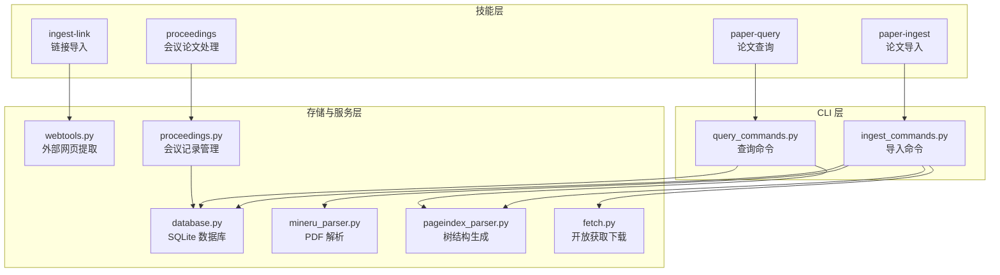
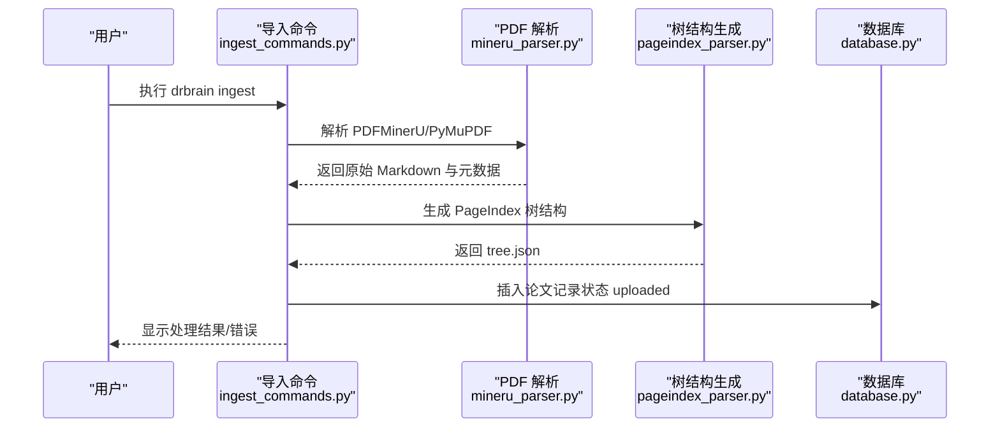
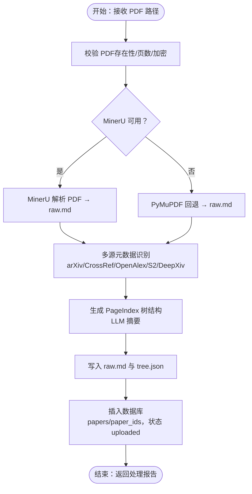
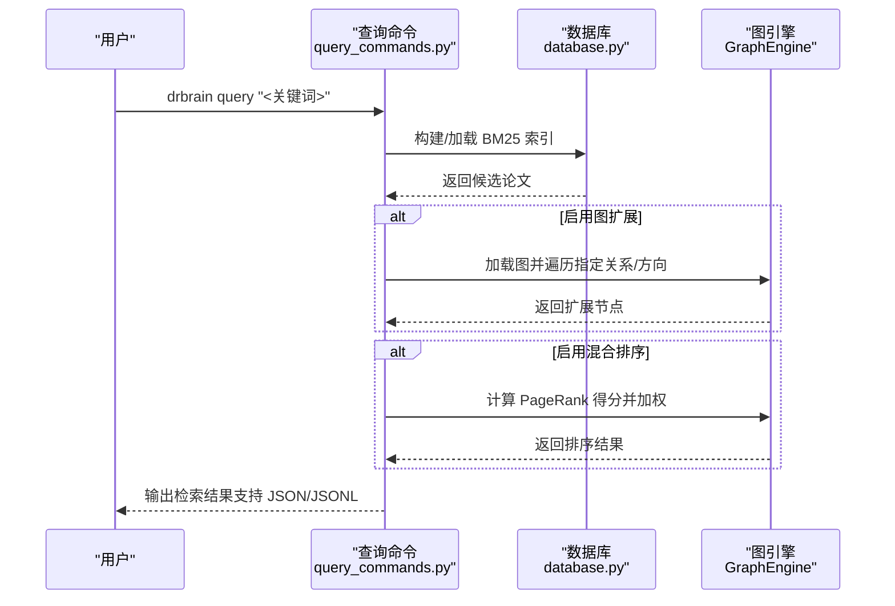
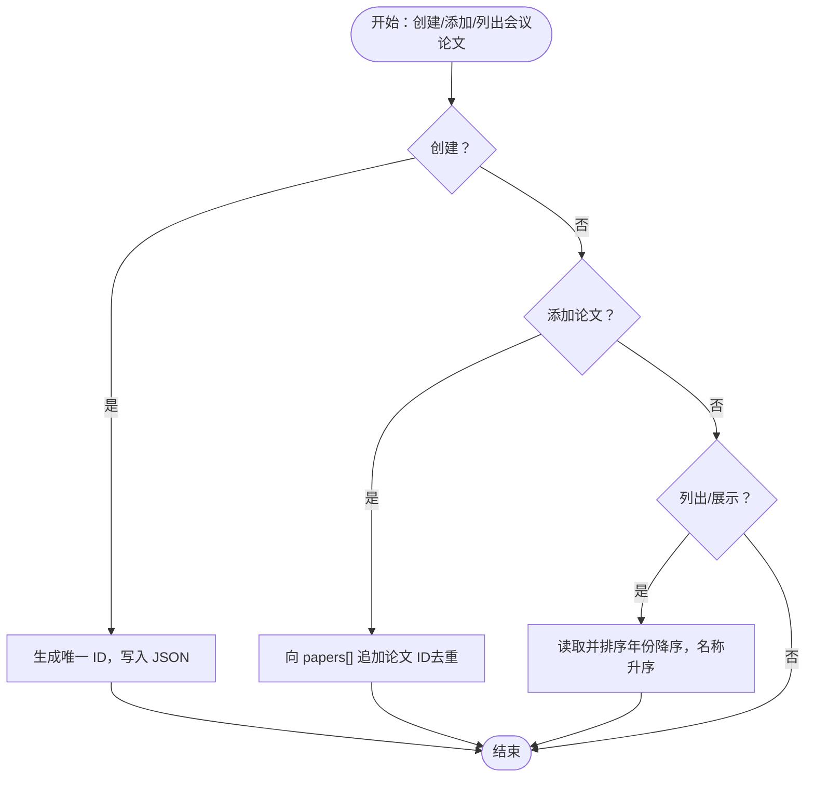
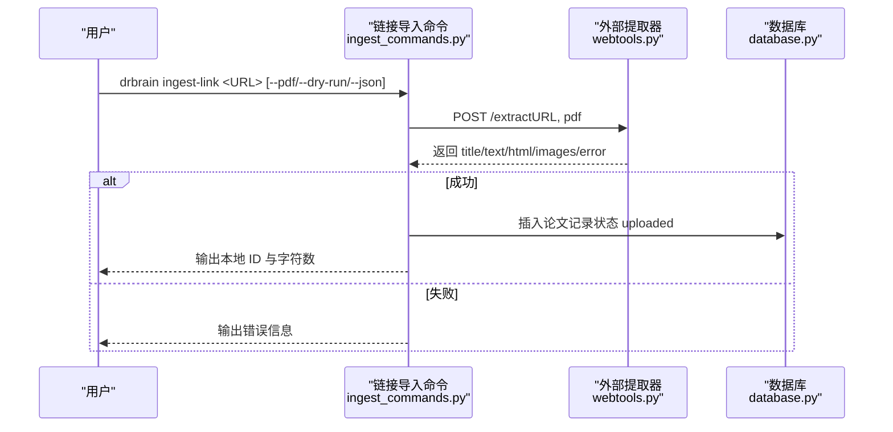
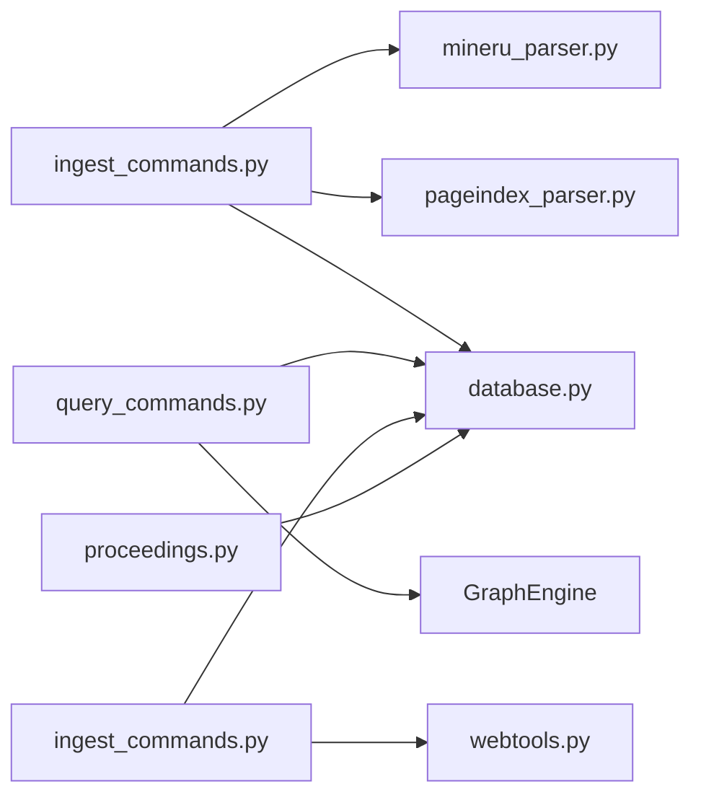

# 论文处理技能

<cite>
**本文档引用的文件**
- [paper-ingest/SKILL.md](file://skills/paper-ingest/SKILL.md)
- [paper-query/SKILL.md](file://skills/paper-query/SKILL.md)
- [proceedings/SKILL.md](file://skills/proceedings/SKILL.md)
- [ingest-link/SKILL.md](file://skills/ingest-link/SKILL.md)
- [ingest_commands.py](file://src/drbrain/cli/ingest_commands.py)
- [query_commands.py](file://src/drbrain/cli/query_commands.py)
- [database.py](file://src/drbrain/storage/database.py)
- [mineru_parser.py](file://src/drbrain/parser/mineru_parser.py)
- [pageindex_parser.py](file://src/drbrain/parser/pageindex_parser.py)
- [fetch.py](file://src/drbrain/services/fetch.py)
- [webtools.py](file://src/drbrain/providers/webtools.py)
- [proceedings.py](file://src/drbrain/storage/proceedings.py)
- [architecture.md](file://docs/architecture.md)
- [2026-05-03-pipeline-refactor-design.md](file://docs/superpowers/specs/2026-05-03-pipeline-refactor-design.md)
- [test_ingest.py](file://tests/test_ingest.py)
</cite>

## 目录
1. [简介](#简介)
2. [项目结构](#项目结构)
3. [核心组件](#核心组件)
4. [架构总览](#架构总览)
5. [详细组件分析](#详细组件分析)
6. [依赖关系分析](#依赖关系分析)
7. [性能考虑](#性能考虑)
8. [故障排除指南](#故障排除指南)
9. [结论](#结论)
10. [附录](#附录)

## 简介
本文件系统性地梳理 DrBrain 的论文处理技能，围绕四大核心能力：论文导入（paper-ingest）、论文查询（paper-query）、会议论文处理（proceedings）与链接导入（ingest-link）。文档从架构设计、数据流、处理逻辑到实际使用场景进行深入说明，并提供可视化图示帮助读者快速理解各技能之间的协作关系与数据流转过程。

## 项目结构
DrBrain 将论文处理技能以“技能文档 + CLI 命令 + 存储与服务模块”的方式组织：
- 技能文档位于 skills/ 目录，定义功能边界、输入输出与使用示例
- CLI 命令位于 src/drbrain/cli/，实现具体操作与工作流编排
- 存储与服务模块位于 src/drbrain/storage/ 与 src/drbrain/services/，负责数据持久化、外部服务集成与业务逻辑

图表来源
- [paper-ingest/SKILL.md:1-98](file://skills/paper-ingest/SKILL.md#L1-L98)
- [paper-query/SKILL.md:1-96](file://skills/paper-query/SKILL.md#L1-L96)
- [proceedings/SKILL.md:1-39](file://skills/proceedings/SKILL.md#L1-L39)
- [ingest-link/SKILL.md:1-45](file://skills/ingest-link/SKILL.md#L1-L45)
- [ingest_commands.py:1-120](file://src/drbrain/cli/ingest_commands.py#L1-L120)
- [query_commands.py:1-120](file://src/drbrain/cli/query_commands.py#L1-L120)
- [database.py:1-160](file://src/drbrain/storage/database.py#L1-L160)
- [mineru_parser.py:1-120](file://src/drbrain/parser/mineru_parser.py#L1-L120)
- [pageindex_parser.py:1-120](file://src/drbrain/parser/pageindex_parser.py#L1-L120)
- [fetch.py:1-60](file://src/drbrain/services/fetch.py#L1-L60)
- [webtools.py:1-60](file://src/drbrain/providers/webtools.py#L1-L60)
- [proceedings.py:1-40](file://src/drbrain/storage/proceedings.py#L1-L40)

章节来源
- [paper-ingest/SKILL.md:1-98](file://skills/paper-ingest/SKILL.md#L1-L98)
- [paper-query/SKILL.md:1-96](file://skills/paper-query/SKILL.md#L1-L96)
- [proceedings/SKILL.md:1-39](file://skills/proceedings/SKILL.md#L1-L39)
- [ingest-link/SKILL.md:1-45](file://skills/ingest-link/SKILL.md#L1-L45)

## 核心组件
- 论文导入（paper-ingest）
  - 功能：将 PDF 转换为可检索的知识图谱条目，包含解析、元数据识别、树结构生成、概念/论点抽取、引用扩展与图闭包推理
  - 关键流程：PDF 解析（MinerU + PyMuPDF 回退）→ 元数据识别（DOI/arXiv 多源交叉验证）→ 树结构（PageIndex）→ 记录入库（状态 uploaded）
  - CLI：drbrain ingest 支持目录批量、单文件指定与 JSON 输出
- 论文查询（paper-query）
  - 功能：基于 BM25 的关键词检索、图增强混合排序、树级深度阅读（PageIndex）
  - CLI：drbrain query 支持类型过滤、置信度阈值、年份范围、邻居扩展、混合排序与树检索
- 会议论文处理（proceedings）
  - 功能：会议论文集合的创建、列出、展示与论文关联
  - CLI：drbrain proceedings 支持创建、添加、列出、JSON 输出
- 链接导入（ingest-link）
  - 功能：通过外部 qt-web-extractor 服务抓取网页或在线 PDF 的渲染内容，保存为论文记录
  - CLI：drbrain ingest-link 支持批量、强制 PDF 模式、预览模式与 JSON 输出

章节来源
- [paper-ingest/SKILL.md:14-98](file://skills/paper-ingest/SKILL.md#L14-L98)
- [paper-query/SKILL.md:13-96](file://skills/paper-query/SKILL.md#L13-L96)
- [proceedings/SKILL.md:11-39](file://skills/proceedings/SKILL.md#L11-L39)
- [ingest-link/SKILL.md:10-45](file://skills/ingest-link/SKILL.md#L10-L45)

## 架构总览
DrBrain 的论文处理采用“轻量导入 + 多阶段构建”的分层架构：
- 导入阶段（drbrain ingest）：仅完成 PDF 到 raw.md 与 tree.json 的结构化，不进行概念抽取，确保快速入库
- 构建阶段（drbrain build）：对已入库的 uploaded 状态论文执行多阶段 LLM 抽取（实体、关系、共指消解、迭代修正），产出知识图谱
- 查询阶段（drbrain query）：支持 BM25 检索、图增强混合排序与树级深度阅读

图表来源
- [ingest_commands.py:26-110](file://src/drbrain/cli/ingest_commands.py#L26-L110)
- [mineru_parser.py:95-320](file://src/drbrain/parser/mineru_parser.py#L95-L320)
- [pageindex_parser.py:412-486](file://src/drbrain/parser/pageindex_parser.py#L412-L486)
- [database.py:279-331](file://src/drbrain/storage/database.py#L279-L331)
- [2026-05-03-pipeline-refactor-design.md:1-60](file://docs/superpowers/specs/2026-05-03-pipeline-refactor-design.md#L1-L60)

章节来源
- [architecture.md:38-63](file://docs/architecture.md#L38-L63)
- [2026-05-03-pipeline-refactor-design.md:1-142](file://docs/superpowers/specs/2026-05-03-pipeline-refactor-design.md#L1-L142)

## 详细组件分析

### 组件一：论文导入（paper-ingest）
- 输入
  - PDF 文件（本地路径或目录）
  - 可选：环境变量 DEEPXIV_TOKEN（用于 DeepXiv 元数据增强）
- 处理流程
  - 解析：MinerU CLI 优先；若不可用则回退至 PyMuPDF
  - 元数据识别：arXiv、CrossRef、OpenAlex、Semantic Scholar、DeepXiv 多源交叉验证
  - 树结构：基于 PageIndex 的 LLM 分段摘要与层级结构
  - 记录入库：写入 papers、paper_ids 表，状态设为 uploaded
- 输出
  - data/papers/<local_id>/raw.md 与 tree.json
  - 数据库中论文记录（状态 uploaded）
- 错误处理
  - PDF 解析失败（加密、损坏）→ 进入 data/spool/pending 并记录错误
  - LLM 提取失败（模型耗尽）→ 保持 uploaded 状态，后续可重试
  - 无 DOI 识别 → 仍可抽取概念，但缺少外部标识符
- 使用示例
  - 单文件导入：drbrain ingest ~/Downloads/attention-is-all-you-need.pdf
  - 批量导入：drbrain ingest ~/Downloads/arxiv-papers/

图表来源
- [mineru_parser.py:28-320](file://src/drbrain/parser/mineru_parser.py#L28-L320)
- [mineru_parser.py:514-692](file://src/drbrain/parser/mineru_parser.py#L514-L692)
- [pageindex_parser.py:412-486](file://src/drbrain/parser/pageindex_parser.py#L412-L486)
- [database.py:279-331](file://src/drbrain/storage/database.py#L279-L331)

章节来源
- [paper-ingest/SKILL.md:14-98](file://skills/paper-ingest/SKILL.md#L14-L98)
- [ingest_commands.py:26-110](file://src/drbrain/cli/ingest_commands.py#L26-L110)
- [mineru_parser.py:95-320](file://src/drbrain/parser/mineru_parser.py#L95-L320)
- [pageindex_parser.py:412-486](file://src/drbrain/parser/pageindex_parser.py#L412-L486)
- [database.py:279-331](file://src/drbrain/storage/database.py#L279-L331)

### 组件二：论文查询（paper-query）
- 检索模式
  - BM25 关键词检索：在概念与论点上进行主题检索，支持类型过滤、置信度阈值、年份范围、限制数量
  - 图增强混合排序：结合 PageRank 中心性提升相关性
  - 树级深度阅读：针对特定论文的 PageIndex 结构进行段落级检索
- CLI 参数要点
  - --type-filter：按概念类型过滤（Problem/Method/Conclusion/Debate/Gap/Actor）
  - --arg-type：按论点类型过滤（supports/challenges/extends 等）
  - --min-confidence：置信度阈值
  - --year-start/--year-end：时间范围
  - --neighbors/-n：图遍历扩展，支持关系类型与方向控制
  - --paper：指定论文 ID 进行树检索
  - --hybrid：启用 PageRank 加权
- 使用示例
  - 主题检索：drbrain query "graph neural networks" --type-filter Method --min-confidence 0.8
  - 图扩展检索：drbrain query "attention mechanism" --neighbors 2
  - 树检索：drbrain query "regularization strategy" --paper p3f8a2

图表来源
- [query_commands.py:283-631](file://src/drbrain/cli/query_commands.py#L283-L631)
- [database.py:419-478](file://src/drbrain/storage/database.py#L419-L478)

章节来源
- [paper-query/SKILL.md:13-96](file://skills/paper-query/SKILL.md#L13-L96)
- [query_commands.py:283-631](file://src/drbrain/cli/query_commands.py#L283-L631)
- [database.py:419-478](file://src/drbrain/storage/database.py#L419-L478)

### 组件三：会议论文处理（proceedings）
- 功能概述
  - 创建会议论文集：名称 + 年份 + 地点
  - 添加论文：将论文 ID 关联到会议论文集中
  - 列出/展示：查看所有会议论文集及其包含的论文
- 数据存储
  - data/proceedings.json：会议论文集列表，每项包含 id、name、year、venue、papers[]
- CLI 使用
  - 创建：drbrain proceedings --create "NeurIPS 2024"
  - 添加：drbrain proceedings --add <proceeding_id> <paper_id>
  - 列表：drbrain proceedings --list
  - JSON 输出：--json

图表来源
- [proceedings.py:31-122](file://src/drbrain/storage/proceedings.py#L31-L122)
- [proceedings/SKILL.md:15-39](file://skills/proceedings/SKILL.md#L15-L39)

章节来源
- [proceedings/SKILL.md:11-39](file://skills/proceedings/SKILL.md#L11-L39)
- [proceedings.py:31-122](file://src/drbrain/storage/proceedings.py#L31-L122)

### 组件四：链接导入（ingest-link）
- 输入
  - Web URL 或在线 PDF 链接
  - 可选：--pdf 强制 PDF 模式；--dry-run 预览模式；--json JSON 输出
- 外部服务
  - 依赖 qt-web-extractor 服务，默认地址 http://127.0.0.1:8766，可通过 WEBEXTRACT_URL 配置
- 流程
  - 调用外部服务提取渲染后的文本（Markdown）、标题与元数据
  - 写入 data/papers/<slug>/raw.md
  - 注册论文记录（状态 uploaded）
- 使用示例
  - 单个链接：drbrain ingest-link https://example.com/page
  - 批量链接：drbrain ingest-link https://a.com https://b.com
  - 预览：drbrain ingest-link https://example.com --dry-run

图表来源
- [ingest_commands.py:464-567](file://src/drbrain/cli/ingest_commands.py#L464-L567)
- [webtools.py:67-106](file://src/drbrain/providers/webtools.py#L67-L106)
- [database.py:279-331](file://src/drbrain/storage/database.py#L279-L331)

章节来源
- [ingest-link/SKILL.md:10-45](file://skills/ingest-link/SKILL.md#L10-L45)
- [ingest_commands.py:464-567](file://src/drbrain/cli/ingest_commands.py#L464-L567)
- [webtools.py:67-106](file://src/drbrain/providers/webtools.py#L67-L106)

## 依赖关系分析
- 组件耦合
  - paper-ingest 依赖 mineru_parser 与 pageindex_parser 完成解析与树结构生成，依赖 database 写入状态为 uploaded
  - paper-query 依赖 database 的 BM25 索引与 GraphEngine 实现图遍历与混合排序
  - ingest-link 依赖 webtools 与 database，不直接参与概念抽取
  - proceedings 依赖本地 JSON 文件与 database 的论文查询能力
- 外部依赖
  - MinerU CLI（可选）与 PyMuPDF（回退）
  - 多个开放获取与元数据服务（OpenAlex、arXiv、Semantic Scholar、Unpaywall 等）
  - 外部 qt-web-extractor 服务（ingest-link）

图表来源
- [ingest_commands.py:1-40](file://src/drbrain/cli/ingest_commands.py#L1-L40)
- [query_commands.py:1-25](file://src/drbrain/cli/query_commands.py#L1-L25)
- [webtools.py:1-40](file://src/drbrain/providers/webtools.py#L1-L40)
- [proceedings.py:1-40](file://src/drbrain/storage/proceedings.py#L1-L40)
- [database.py:1-40](file://src/drbrain/storage/database.py#L1-L40)

章节来源
- [ingest_commands.py:1-40](file://src/drbrain/cli/ingest_commands.py#L1-L40)
- [query_commands.py:1-25](file://src/drbrain/cli/query_commands.py#L1-L25)
- [webtools.py:1-40](file://src/drbrain/providers/webtools.py#L1-L40)
- [proceedings.py:1-40](file://src/drbrain/storage/proceedings.py#L1-L40)
- [database.py:1-40](file://src/drbrain/storage/database.py#L1-L40)

## 性能考虑
- 导入阶段
  - 大型 PDF（>150 页）自动切片处理，减少单次解析负载
  - MinerU 优先，回退到 PyMuPDF，避免长时间等待
- 查询阶段
  - BM25 索引需定期重建（drbrain index），以保证检索时效性
  - 图增强混合排序通过 PageRank 近似实现，避免重型图算法开销
- 存储与并发
  - SQLite WAL 模式提升并发写入稳定性
  - 树结构摘要与向量化缓存（如存在）可显著加速检索

## 故障排除指南
- PDF 解析失败
  - 现象：提示“PDF 打开错误”或“加密”
  - 处理：确认 PDF 可访问且未加密；尝试 PyMuPDF 回退；检查 data/spool/pending 中的错误日志
- LLM 提取失败
  - 现象：模型配额耗尽或服务不可达
  - 处理：检查 API 密钥与配额；稍后重试；保持 uploaded 状态以便后续构建
- 无 DOI 识别
  - 现象：无法通过外部源匹配 DOI
  - 处理：仍可抽取概念；建议手动补充元数据或等待后续引用扩展
- 外部服务不可达（ingest-link）
  - 现象：无法连接 qt-web-extractor
  - 处理：启动服务或设置 WEBEXTRACT_URL；使用 --dry-run 预览

章节来源
- [paper-ingest/SKILL.md:52-64](file://skills/paper-ingest/SKILL.md#L52-L64)
- [ingest-link/SKILL.md:15-19](file://skills/ingest-link/SKILL.md#L15-L19)
- [ingest_commands.py:488-496](file://src/drbrain/cli/ingest_commands.py#L488-L496)

## 结论
DrBrain 的论文处理技能通过清晰的分层设计实现了从“快速入库”到“深度构建”的完整闭环。paper-ingest 保证高吞吐与稳健性，paper-query 提供灵活的检索与探索能力，proceedings 支持会议维度的组织管理，ingest-link 则打通了网页与在线资源的入口。四者协同，既满足日常研究需求，也为后续的图推理与分析奠定坚实基础。

## 附录
- 数据库模式概览（关键表）
  - papers：论文元数据与状态
  - paper_ids：外部标识符映射（DOI/arXiv/S2/OpenAlex）
  - concepts/arguments/edges：知识图谱三元组
  - embeddings/tree_vectors：向量与树摘要
  - aliases/confidence_queue/research_seeds：辅助与种子检测

章节来源
- [database.py:10-156](file://src/drbrain/storage/database.py#L10-L156)