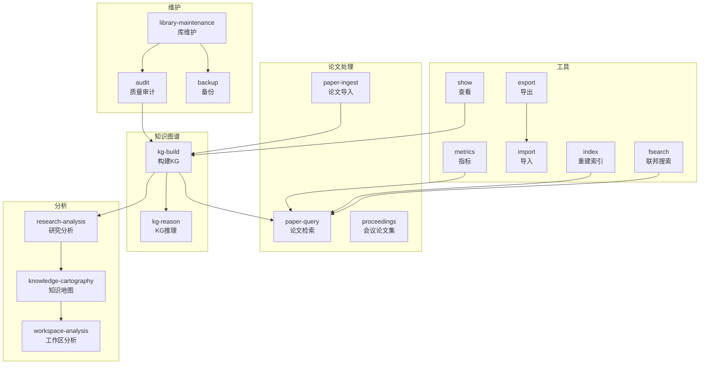
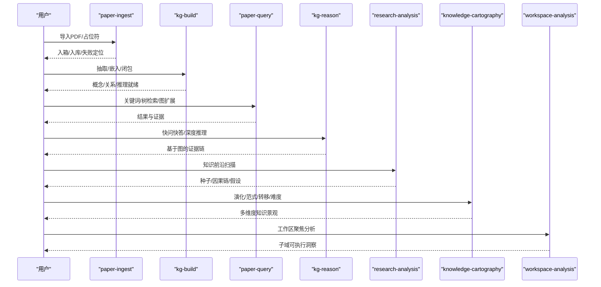
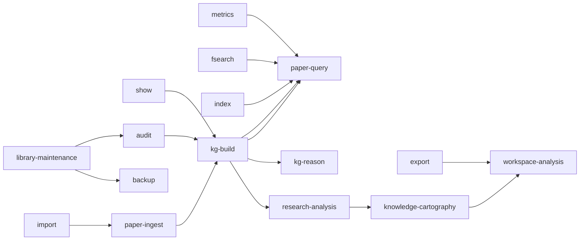

# 项目技能库

<cite>
**本文引用的文件**
- [skills/paper-ingest/SKILL.md](file://skills/paper-ingest/SKILL.md)
- [skills/paper-query/SKILL.md](file://skills/paper-query/SKILL.md)
- [skills/proceedings/SKILL.md](file://skills/proceedings/SKILL.md)
- [skills/kg-build/SKILL.md](file://skills/kg-build/SKILL.md)
- [skills/kg-reason/SKILL.md](file://skills/kg-reason/SKILL.md)
- [skills/research-analysis/SKILL.md](file://skills/research-analysis/SKILL.md)
- [skills/knowledge-cartography/SKILL.md](file://skills/knowledge-cartography/SKILL.md)
- [skills/workspace-analysis/SKILL.md](file://skills/workspace-analysis/SKILL.md)
- [skills/library-maintenance/SKILL.md](file://skills/library-maintenance/SKILL.md)
- [skills/audit/SKILL.md](file://skills/audit/SKILL.md)
- [skills/backup/SKILL.md](file://skills/backup/SKILL.md)
- [skills/fsearch/SKILL.md](file://skills/fsearch/SKILL.md)
- [skills/export/SKILL.md](file://skills/export/SKILL.md)
- [skills/import/SKILL.md](file://skills/import/SKILL.md)
- [skills/index/SKILL.md](file://skills/index/SKILL.md)
- [skills/show/SKILL.md](file://skills/show/SKILL.md)
- [skills/metrics/SKILL.md](file://skills/metrics/SKILL.md)
</cite>

## 目录
1. [简介](#简介)
2. [项目结构](#项目结构)
3. [核心组件](#核心组件)
4. [架构总览](#架构总览)
5. [详细组件分析](#详细组件分析)
6. [依赖关系分析](#依赖关系分析)
7. [性能与稳定性建议](#性能与稳定性建议)
8. [故障排查指南](#故障排查指南)
9. [结论](#结论)
10. [附录](#附录)

## 简介
本文件为 DrBrain 项目技能库的全面功能文档，覆盖 27 个预定义技能。文档按功能类别组织：论文处理技能（paper-ingest、paper-query、proceedings）、知识图谱技能（kg-build、kg-reason）、分析技能（research-analysis、knowledge-cartography、workspace-analysis）、维护技能（library-maintenance、audit、backup）、工具技能（fsearch、export、import、index、show、metrics）。每个技能均包含功能描述、前置条件、配置与参数说明、使用示例与最佳实践，并解释技能间的依赖关系与组合使用方式，帮助用户高效构建、查询、推理与管理个人研究知识库。

## 项目结构
DrBrain 将技能以“技能说明文件”形式组织在 skills 目录下，每个技能文件包含该技能的名称、描述、工作流、CLI 参考等。技能之间通过命令行接口与内部数据状态（如知识图谱构建状态）耦合，形成端到端的研究工作流。

图表来源
- [skills/paper-ingest/SKILL.md:1-98](file://skills/paper-ingest/SKILL.md#L1-L98)
- [skills/kg-build/SKILL.md:1-139](file://skills/kg-build/SKILL.md#L1-L139)
- [skills/paper-query/SKILL.md:1-96](file://skills/paper-query/SKILL.md#L1-L96)
- [skills/kg-reason/SKILL.md:1-105](file://skills/kg-reason/SKILL.md#L1-L105)
- [skills/research-analysis/SKILL.md:1-110](file://skills/research-analysis/SKILL.md#L1-L110)
- [skills/knowledge-cartography/SKILL.md:1-182](file://skills/knowledge-cartography/SKILL.md#L1-L182)
- [skills/workspace-analysis/SKILL.md:1-89](file://skills/workspace-analysis/SKILL.md#L1-L89)
- [skills/library-maintenance/SKILL.md:1-166](file://skills/library-maintenance/SKILL.md#L1-L166)
- [skills/audit/SKILL.md:1-88](file://skills/audit/SKILL.md#L1-L88)
- [skills/backup/SKILL.md:1-58](file://skills/backup/SKILL.md#L1-L58)
- [skills/fsearch/SKILL.md:1-39](file://skills/fsearch/SKILL.md#L1-L39)
- [skills/export/SKILL.md:1-86](file://skills/export/SKILL.md#L1-L86)
- [skills/import/SKILL.md:1-91](file://skills/import/SKILL.md#L1-L91)
- [skills/index/SKILL.md:1-69](file://skills/index/SKILL.md#L1-L69)
- [skills/show/SKILL.md:1-74](file://skills/show/SKILL.md#L1-L74)
- [skills/metrics/SKILL.md:1-42](file://skills/metrics/SKILL.md#L1-L42)

章节来源
- [skills/paper-ingest/SKILL.md:1-98](file://skills/paper-ingest/SKILL.md#L1-L98)
- [skills/paper-query/SKILL.md:1-96](file://skills/paper-query/SKILL.md#L1-L96)
- [skills/proceedings/SKILL.md:1-39](file://skills/proceedings/SKILL.md#L1-L39)
- [skills/kg-build/SKILL.md:1-139](file://skills/kg-build/SKILL.md#L1-L139)
- [skills/kg-reason/SKILL.md:1-105](file://skills/kg-reason/SKILL.md#L1-L105)
- [skills/research-analysis/SKILL.md:1-110](file://skills/research-analysis/SKILL.md#L1-L110)
- [skills/knowledge-cartography/SKILL.md:1-182](file://skills/knowledge-cartography/SKILL.md#L1-L182)
- [skills/workspace-analysis/SKILL.md:1-89](file://skills/workspace-analysis/SKILL.md#L1-L89)
- [skills/library-maintenance/SKILL.md:1-166](file://skills/library-maintenance/SKILL.md#L1-L166)
- [skills/audit/SKILL.md:1-88](file://skills/audit/SKILL.md#L1-L88)
- [skills/backup/SKILL.md:1-58](file://skills/backup/SKILL.md#L1-L58)
- [skills/fsearch/SKILL.md:1-39](file://skills/fsearch/SKILL.md#L1-L39)
- [skills/export/SKILL.md:1-86](file://skills/export/SKILL.md#L1-L86)
- [skills/import/SKILL.md:1-91](file://skills/import/SKILL.md#L1-L91)
- [skills/index/SKILL.md:1-69](file://skills/index/SKILL.md#L1-L69)
- [skills/show/SKILL.md:1-74](file://skills/show/SKILL.md#L1-L74)
- [skills/metrics/SKILL.md:1-42](file://skills/metrics/SKILL.md#L1-L42)

## 核心组件
- 论文处理：从 PDF 到知识图谱的概念抽取与结构化，支持批量导入、失败诊断与后续构建。
- 知识图谱：分阶段抽取、嵌入训练与闭包推理，支撑检索、问答与复杂推理。
- 分析：研究前沿扫描、知识地图绘制、工作区聚焦分析，辅助科研选题与文献综述。
- 维护：环境检查、统计报告、备份恢复、队列审核与作者谱系追踪。
- 工具：本地与 arXiv 联邦搜索、参考文献格式导出、外部库导入、索引重建、内容查看与行为指标。

章节来源
- [skills/paper-ingest/SKILL.md:1-98](file://skills/paper-ingest/SKILL.md#L1-L98)
- [skills/kg-build/SKILL.md:1-139](file://skills/kg-build/SKILL.md#L1-L139)
- [skills/research-analysis/SKILL.md:1-110](file://skills/research-analysis/SKILL.md#L1-L110)
- [skills/library-maintenance/SKILL.md:1-166](file://skills/library-maintenance/SKILL.md#L1-L166)
- [skills/fsearch/SKILL.md:1-39](file://skills/fsearch/SKILL.md#L1-L39)

## 架构总览
DrBrain 的研究工作流遵循“导入—构建—检索/分析—维护”的闭环：paper-ingest 提供输入，kg-build 产出结构化知识，paper-query 与 kg-reason 支持检索与推理，research-analysis 与 knowledge-cartography 提供宏观视角，workspace-analysis 实现子域聚焦，library-maintenance 保障健康运行，backup 与 audit 提供质量与安全保证，fsearch/export/import/index/show/metrics 提供配套工具链。

图表来源
- [skills/paper-ingest/SKILL.md:1-98](file://skills/paper-ingest/SKILL.md#L1-L98)
- [skills/kg-build/SKILL.md:1-139](file://skills/kg-build/SKILL.md#L1-L139)
- [skills/paper-query/SKILL.md:1-96](file://skills/paper-query/SKILL.md#L1-L96)
- [skills/kg-reason/SKILL.md:1-105](file://skills/kg-reason/SKILL.md#L1-L105)
- [skills/research-analysis/SKILL.md:1-110](file://skills/research-analysis/SKILL.md#L1-L110)
- [skills/knowledge-cartography/SKILL.md:1-182](file://skills/knowledge-cartography/SKILL.md#L1-L182)
- [skills/workspace-analysis/SKILL.md:1-89](file://skills/workspace-analysis/SKILL.md#L1-L89)

## 详细组件分析

### 论文处理技能

#### paper-ingest（论文导入）
- 功能描述：将 PDF 解析为结构化概念与论点，完成身份解析、文档树构建、LLM 抽取、引用扩展与图闭包推理，是研究流程的必经第一步。
- 前置条件：运行环境检查；待处理 PDF 放置在入箱目录。
- 关键步骤：
  - 将 PDF 放入入箱目录并执行导入命令，或直接指定文件/目录。
  - 验证结果：列出全部论文、查看特定论文详情。
  - 失败处理：失败项进入待处理目录，查看日志定位问题（解析错误、LLM 调用失败、无 DOI 等）。
  - 后续：构建知识图谱（kg-build），再进行检索与分析。
- 使用示例与最佳实践：
  - 单篇直接导入并校验。
  - 批量导入 arXiv 下载目录后统一列表核对。
- 依赖关系：必须在 kg-build 之前执行；与 show、list 紧密配合。

章节来源
- [skills/paper-ingest/SKILL.md:1-98](file://skills/paper-ingest/SKILL.md#L1-L98)

#### paper-query（论文检索）
- 功能描述：提供 BM25 关键词检索、基于 PageIndex 的树检索与图增强混合排序，支持类型过滤、置信度筛选、年份范围限制、邻居扩展与论文级深读。
- 前置条件：知识图谱已构建；BM25 索引需最新（必要时重建）；树检索需先生成文本嵌入。
- 检索模式与参数：
  - BM25：关键词搜索，支持类型过滤、论证类型、时间范围、置信度阈值、数量限制。
  - 图扩展：通过邻居传播扩大结果。
  - 树检索：针对特定论文的章节级深读。
  - 混合排序：结合 PageRank 提升相关性。
- 使用示例与最佳实践：
  - 结合类型与置信度筛选热点主题。
  - 使用图扩展发现关联研究。
  - 对关键论文进行章节级检索。
- 依赖关系：依赖 kg-build 与 index；与 ask、reason、analyze、citations、workspace 等技能联动。

章节来源
- [skills/paper-query/SKILL.md:1-96](file://skills/paper-query/SKILL.md#L1-L96)

#### proceedings（会议论文集）
- 功能描述：将论文归档至会议论文集，便于按会议维度组织与管理。
- 操作要点：创建、列出、展示、添加论文；支持 JSON 输出。
- 使用示例与最佳实践：
  - 创建 NeurIPS、ICML 等会议论文集。
  - 将相关论文加入对应会议集合并查看详情。
- 依赖关系：依赖 paper-ingest 的论文存在；与 export、show 协同。

章节来源
- [skills/proceedings/SKILL.md:1-39](file://skills/proceedings/SKILL.md#L1-L39)

### 知识图谱技能

#### kg-build（构建知识图谱）
- 功能描述：三阶段流水线：LLM 抽取（本体扩展、实体/关系抽取、共指消解、迭代精炼）、TransE 嵌入训练、规则驱动闭包推理（符号/混合模式）。
- 前置条件：论文已入库（uploaded 状态）。
- 流程与参数：
  - 抽取：支持指定论文、全量重建、跳过精炼。
  - 嵌入：默认维度与轮次，支持重训与文本嵌入（PageIndex+RAPTOR）。
  - 闭包：符号/混合模式、规则选择、预演、路径规则挖掘、规则实例化、工作区限定。
- 使用示例与最佳实践：
  - 从零开始完整流程：导入→抽取→嵌入→闭包。
  - 新增论文后的增量更新：仅抽取新增→重训→重新闭包。
  - 预演推理：先 dry-run 再持久化。
- 依赖关系：paper-ingest → kg-build → paper-query/kg-reason/research-analysis/knowledge-cartography。

章节来源
- [skills/kg-build/SKILL.md:1-139](file://skills/kg-build/SKILL.md#L1-L139)

#### kg-reason（KG 推理）
- 功能描述：自然语言问答（ask）与 LLM 工具调用的深度推理（reason），支持双向验证循环，适合跨论文合成、因果链追踪与假设验证。
- 前置条件：知识图谱已构建；推荐启用嵌入与闭包。
- 操作模式：
  - ask：快速检索→回答，支持返回数量与 JSON。
  - reason：代理工具调用，支持双向循环与最大轮次控制。
- 使用示例与最佳实践：
  - 快速事实查询用 ask。
  - 复杂比较、因果链与假设验证用 reason（尤其开启双向模式）。
- 依赖关系：依赖 kg-build；与 ask/reason 的输出可进一步用于分析与导出。

章节来源
- [skills/kg-reason/SKILL.md:1-105](file://skills/kg-reason/SKILL.md#L1-L105)

### 分析技能

#### research-analysis（研究分析）
- 功能描述：统一的知识前沿报告，涵盖闭包推理、研究种子检测、因果链、可选的反事实分析、假设生成与跨域同构检测。
- 前置条件：库内已有论文；建议先构建知识图谱。
- 工作流：
  - 库评估：列出与统计。
  - 全库扫描：种子检测，识别争议、新兴、复苏、下降信号。
  - 深入单篇：分析因果链、关键节点、假设与同构。
  - 工作区聚焦：对比全库与工作区结果，提升可执行性。
- 使用示例与最佳实践：
  - 快速全库景观扫描。
  - 对关键论文进行完整分析，提取可操作假设。
  - 工作区 Scoped 分析，聚焦子领域机会。
- 依赖关系：依赖 kg-build；与 knowledge-cartography、kg-reason、graph 命令协同。

章节来源
- [skills/research-analysis/SKILL.md:1-110](file://skills/research-analysis/SKILL.md#L1-L110)

#### knowledge-cartography（知识地图）
- 功能描述：多维知识景观分析：研究种子、概念演化、学术后代、领域时间线、范式转移、跨域迁移、结构同构、难度评估与综合前沿报告。
- 前置条件：建议启用嵌入与闭包；部分命令需要闭包。
- 命令与参数：
  - seed：全库信号检测（争议/新兴/稳定/下降/复苏）。
  - evolve：概念谱系（祖先/后代/双向），支持统计与图示。
  - descendants：学术后代追踪，支持图示与章节溯源。
  - landscape：领域时间线与关键节点。
  - paradigm：范式替换/爆炸/跨域入侵检测。
  - transfers：跨域方法迁移，支持自动与定向分析。
  - isomorphism：结构相似性匹配。
  - difficulty：按来源段落类型评估缺口难度。
  - frontier：综合前沿报告。
- 使用示例与最佳实践：
  - 快速全库景观概览。
  - 追踪关键概念的演化与影响。
  - 自动发现跨域迁移机会。
  - 生成综合前沿报告指导选题。
- 依赖关系：依赖 kg-build；与 research-analysis、workspace-analysis、graph 命令互补。

章节来源
- [skills/knowledge-cartography/SKILL.md:1-182](file://skills/knowledge-cartography/SKILL.md#L1-L182)

#### workspace-analysis（工作区分析）
- 功能描述：工作区作为论文子集，限定分析范围，便于文献综述与专题研究；支持创建、增删、显示、Scoped 分析与导出。
- 前置条件：论文已入库并构建；工作区 Scoped 命令需知识图谱可用。
- 工作流：
  - 创建与填充：创建工作区并添加论文。
  - 管理：增删、列出、删除（不删除论文本身）。
  - 分析：analyze/seed/query/stats/closure 等均可 Scoped。
  - 解释：工作区结果更聚焦，关键节点若同时出现在全库，更具领域中心意义。
- 使用示例与最佳实践：
  - 为特定主题创建阅读清单并进行完整分析。
  - 导出工作区参考文献用于投稿。
- 依赖关系：依赖 paper-ingest 与 kg-build；与 export、backup 协同。

章节来源
- [skills/workspace-analysis/SKILL.md:1-89](file://skills/workspace-analysis/SKILL.md#L1-L89)

### 维护技能

#### library-maintenance（库维护）
- 功能描述：初始化设置、环境诊断、统计报告、单篇报告、删除、清理、备份、置信度队列管理、作者谱系追踪。
- 常用工作流：
  - 首次设置：交互式或快速设置，随后进行环境检查。
  - 健康检查：在重大操作前运行审计与统计。
  - 备份：在大规模操作前创建快照。
  - 清理：重置数据目录（保留入箱 PDF）。
  - 队列：低置信度项的审阅与批量解决。
  - 作者谱系：通过 OpenAlex 探索作者/研究谱系。
- 使用示例与最佳实践：
  - 预清理健康检查：先 audit，再 stats。
  - 备份先行：在全量重建前备份。
  - 全量重置：clean + setup。
- 依赖关系：与 audit、backup、stats、report、delete、clean、queue、lineage 等命令协同。

章节来源
- [skills/library-maintenance/SKILL.md:1-166](file://skills/library-maintenance/SKILL.md#L1-L166)

#### audit（质量审计）
- 功能描述：按严重等级扫描全库数据质量问题（错误/警告/提示），输出结构化报告并给出修复建议。
- 规则分类：错误（必须修复）、警告（应修复）、提示（建议关注）。
- 使用示例与最佳实践：
  - 在运行大型分析前先做全量审计，优先修复错误。
  - 使用 JSON 输出便于脚本化统计与过滤。
  - 工作区专项审计，确保提交材料质量。
- 依赖关系：依赖 paper-ingest；与 repair 协同修复。

章节来源
- [skills/audit/SKILL.md:1-88](file://skills/audit/SKILL.md#L1-L88)

#### backup（备份）
- 功能描述：本地 tar.gz 备份与远程 rsync 同步两种模式，支持列出、自定义输出路径与目标。
- 使用示例与最佳实践：
  - 在大规模操作前创建本地备份。
  - 配置远程目标后进行同步，支持预演。
- 依赖关系：与 library-maintenance 的 clean/restore 场景配合。

章节来源
- [skills/backup/SKILL.md:1-58](file://skills/backup/SKILL.md#L1-L58)

### 工具技能

#### fsearch（联邦搜索）
- 功能描述：本地库与 arXiv 的联合搜索，自动标注已入库条目，支持本地/本地+arXiv/arXiv-only。
- 使用示例与最佳实践：
  - 交叉搜索：先本地，再本地+arXiv，最后 arXiv-only。
  - 限制与输出：控制每源结果数与 JSON 输出。
- 依赖关系：与 paper-ingest、index 协同；与 paper-query、proceedings 结合使用。

章节来源
- [skills/fsearch/SKILL.md:1-39](file://skills/fsearch/SKILL.md#L1-L39)

#### export（导出）
- 功能描述：将论文元数据导出为 BibTeX、RIS 或 Markdown，支持单篇、全库与工作区 Scoped。
- 使用示例与最佳实践：
  - LaTeX/Overleaf：导出全库 BibTeX。
  - 引文管理：导出 RIS 至 Zotero/Mendeley。
  - 文献综述：导出 Markdown 阅读清单。
- 依赖关系：依赖 paper-ingest；建议先 audit/repair 提高元数据质量。

章节来源
- [skills/export/SKILL.md:1-86](file://skills/export/SKILL.md#L1-L86)

#### import（导入）
- 功能描述：从 Zotero（本地数据库/Web API）、BibTeX、Endnote 导入元数据，生成占位符；随后可选择 PDF 导入或在线补全元数据。
- 使用示例与最佳实践：
  - 完整迁移：预览集合→导入集合→PDF 导入→在线补全。
  - 共享库导入：预演后再正式导入。
- 依赖关系：导入后通常需要 paper-ingest 与 repair。

章节来源
- [skills/import/SKILL.md:1-91](file://skills/import/SKILL.md#L1-L91)

#### index（重建索引）
- 功能描述：重建 BM25 全文索引，使 query 能正确检索新导入或修改后的概念与论文。
- 使用示例与最佳实践：
  - 导入/构建后立即重建索引并验证。
  - 搜索异常时诊断并重建。
- 依赖关系：依赖 paper-ingest 与 kg-build；与 paper-query 协同。

章节来源
- [skills/index/SKILL.md:1-69](file://skills/index/SKILL.md#L1-L69)

#### show（查看）
- 功能描述：查看论文元数据、按类型分组的概念、论证与知识图谱边，支持 JSON 输出。
- 使用示例与最佳实践：
  - 校验导入是否成功：查看概念/边/摘要数量。
  - 查找 DOI/标题/期刊等元数据。
  - 快速统计概念类型分布。
- 依赖关系：依赖 paper-ingest 与 kg-build；与 research-analysis、knowledge-cartography 的深入分析衔接。

章节来源
- [skills/show/SKILL.md:1-74](file://skills/show/SKILL.md#L1-L74)

#### metrics（指标）
- 功能描述：用户行为指标：搜索关键词、最读论文、周趋势、Top 关键词、最读论文。
- 使用示例与最佳实践：
  - 了解自己的研究模式与热点。
  - 结合查询与阅读事件进行自我优化。
- 依赖关系：独立模块；与 paper-query、show 协同。

章节来源
- [skills/metrics/SKILL.md:1-42](file://skills/metrics/SKILL.md#L1-L42)

## 依赖关系分析
- 数据与状态依赖：
  - paper-ingest → kg-build：导入完成后才能抽取与构建。
  - kg-build → paper-query/kg-reason/research-analysis/knowledge-cartography：知识图谱就绪后才具备检索、问答与分析能力。
  - index：在导入/构建/修复后重建，确保检索有效。
  - show：需要 paper-ingest；KG 构建后可显示更丰富内容。
  - export/import：依赖 paper-ingest；import 后常需 repair/ingest。
  - audit：可在任意阶段运行，但与 kg-build 的统计/计数相关命令更准确。
  - backup/restore：与 library-maintenance 的 clean/setup 配合。
- 工作流耦合：
  - 典型流程：paper-ingest → kg-build → index → paper-query → kg-reason → research-analysis/knowledge-cartography → workspace-analysis → export。
  - 质量保障：library-maintenance → audit → kg-build；backup 在关键节点执行。

图表来源
- [skills/paper-ingest/SKILL.md:1-98](file://skills/paper-ingest/SKILL.md#L1-L98)
- [skills/kg-build/SKILL.md:1-139](file://skills/kg-build/SKILL.md#L1-L139)
- [skills/paper-query/SKILL.md:1-96](file://skills/paper-query/SKILL.md#L1-L96)
- [skills/kg-reason/SKILL.md:1-105](file://skills/kg-reason/SKILL.md#L1-L105)
- [skills/research-analysis/SKILL.md:1-110](file://skills/research-analysis/SKILL.md#L1-L110)
- [skills/knowledge-cartography/SKILL.md:1-182](file://skills/knowledge-cartography/SKILL.md#L1-L182)
- [skills/workspace-analysis/SKILL.md:1-89](file://skills/workspace-analysis/SKILL.md#L1-L89)
- [skills/library-maintenance/SKILL.md:1-166](file://skills/library-maintenance/SKILL.md#L1-L166)
- [skills/audit/SKILL.md:1-88](file://skills/audit/SKILL.md#L1-L88)
- [skills/backup/SKILL.md:1-58](file://skills/backup/SKILL.md#L1-L58)
- [skills/fsearch/SKILL.md:1-39](file://skills/fsearch/SKILL.md#L1-L39)
- [skills/export/SKILL.md:1-86](file://skills/export/SKILL.md#L1-L86)
- [skills/import/SKILL.md:1-91](file://skills/import/SKILL.md#L1-L91)
- [skills/index/SKILL.md:1-69](file://skills/index/SKILL.md#L1-L69)
- [skills/show/SKILL.md:1-74](file://skills/show/SKILL.md#L1-L74)
- [skills/metrics/SKILL.md:1-42](file://skills/metrics/SKILL.md#L1-L42)

## 性能与稳定性建议
- 索引与检索：导入/构建/修复后务必重建索引；定期检查搜索结果有效性。
- 嵌入与闭包：文本嵌入与混合闭包显著提升检索与推理质量，建议在大规模分析前启用。
- 质量优先：先 audit 再分析；修复缺失元数据与低置信度项，避免噪声干扰。
- 备份先行：在全量重建、大规模导出或迁移前创建备份。
- 并行与增量：利用增量抽取与重训策略减少重复计算；合理设置参数（维度、轮次、规则集）平衡质量与速度。

## 故障排查指南
- 搜索无结果或结果异常：
  - 检查索引是否最新（index --rebuild）。
  - 确认论文已入库且已构建（kg-build）。
- 论文无概念/边：
  - 检查抽取是否执行；必要时重建抽取与闭包。
- LLM 调用失败：
  - 运行环境检查（library-maintenance check）；确认 API 密钥与配额。
- 元数据缺失：
  - 使用 repair/repair --all 补全；或通过 import 导入外部库。
- 失败论文定位：
  - 查看入箱/待处理目录日志，按常见原因（解析错误、无 DOI、模型耗尽）逐项修复。
- 备份与恢复：
  - 使用 backup 列表与同步；必要时 clean + setup 重置后恢复。

章节来源
- [skills/library-maintenance/SKILL.md:1-166](file://skills/library-maintenance/SKILL.md#L1-L166)
- [skills/audit/SKILL.md:1-88](file://skills/audit/SKILL.md#L1-L88)
- [skills/index/SKILL.md:1-69](file://skills/index/SKILL.md#L1-L69)
- [skills/paper-ingest/SKILL.md:1-98](file://skills/paper-ingest/SKILL.md#L1-L98)

## 结论
DrBrain 的技能体系围绕“导入—构建—检索/分析—维护—工具”形成闭环，既满足日常检索与问答需求，又支持宏观知识地图绘制与工作区聚焦分析。通过严格的前置条件与稳健的依赖关系设计，用户可以构建高质量、可维护的研究知识库，并借助联邦搜索、导出与备份等工具实现与外部系统的顺畅对接。

## 附录
- 常用组合工作流示例：
  - 新库起步：setup → check → import/ingest → build → index → audit → query。
  - 文献综述：ingest → build → embed --tree → closure --mode hybrid → analyze/evolve → workspace → export。
  - 质量治理：audit → repair → build → index → stats → backup。
- 参数速查：
  - 抽取：--all、--skip-refine；嵌入：--dim、--epochs、--retrain、--tree；闭包：--mode、--dry-run、--mine-rules、--ground、--rule、-w。
  - 检索：--type-filter、--arg-type、--year-start/--year-end、--min-confidence、--limit、--neighbors、--paper、--hybrid。
  - 工作区：--workspace/-w；导出：--format、--output、--all、--workspace；导入：zotero/web api、bibtex、endnote；指标：--json；联邦搜索：--arxiv、--arxiv-only、--limit。