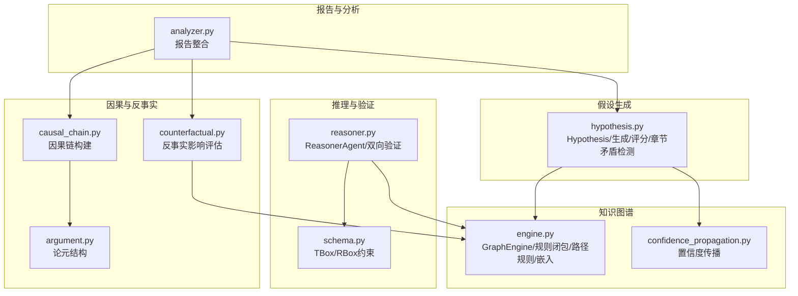
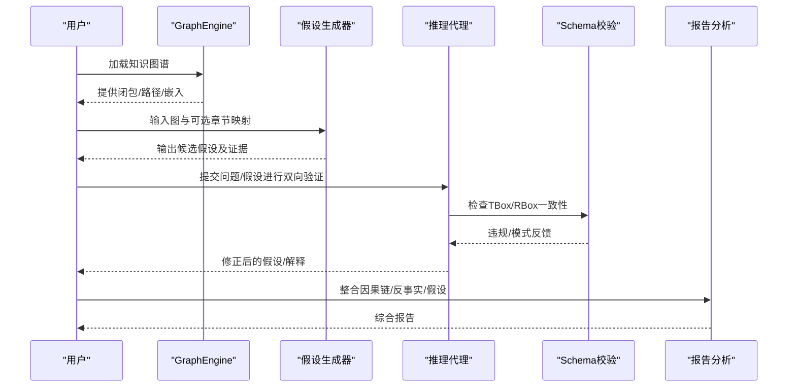
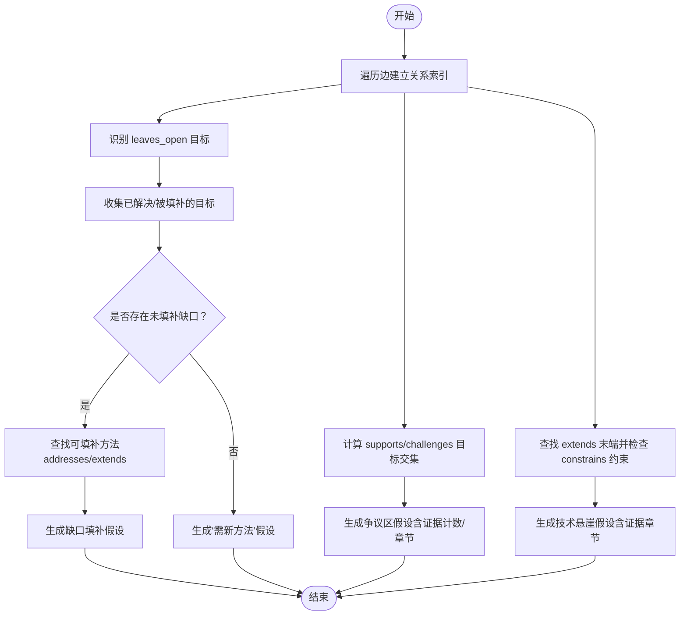
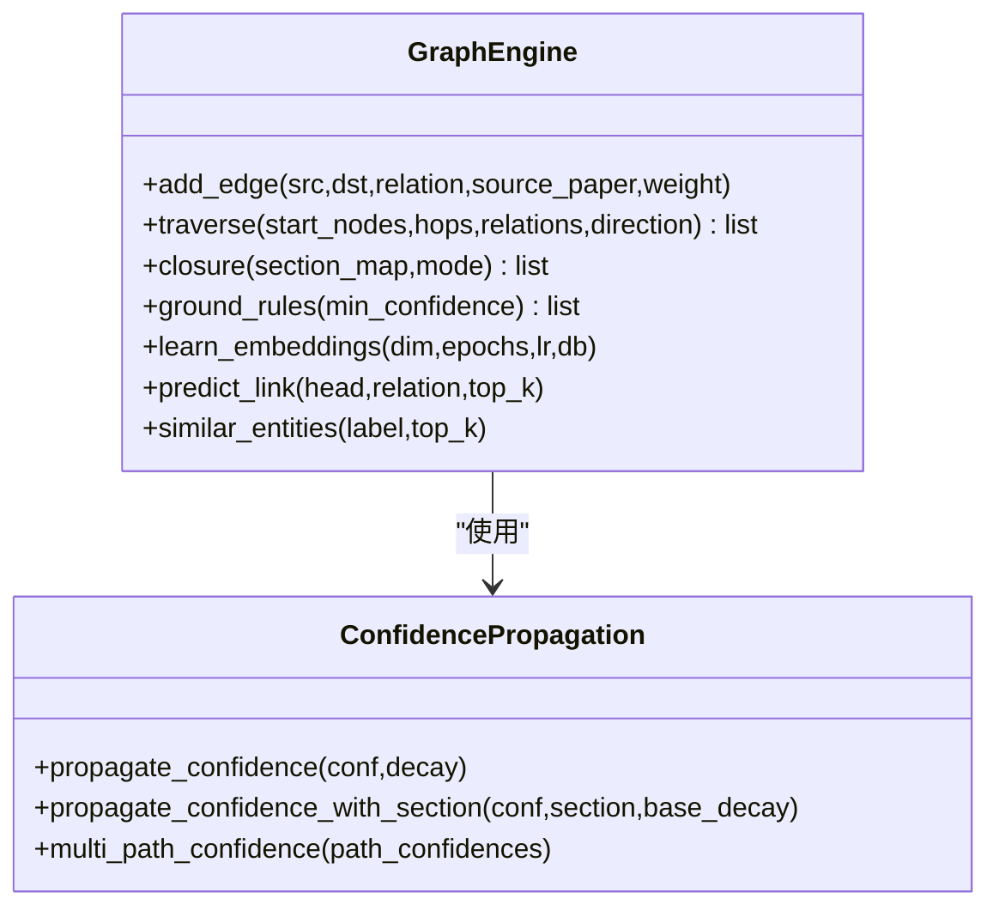
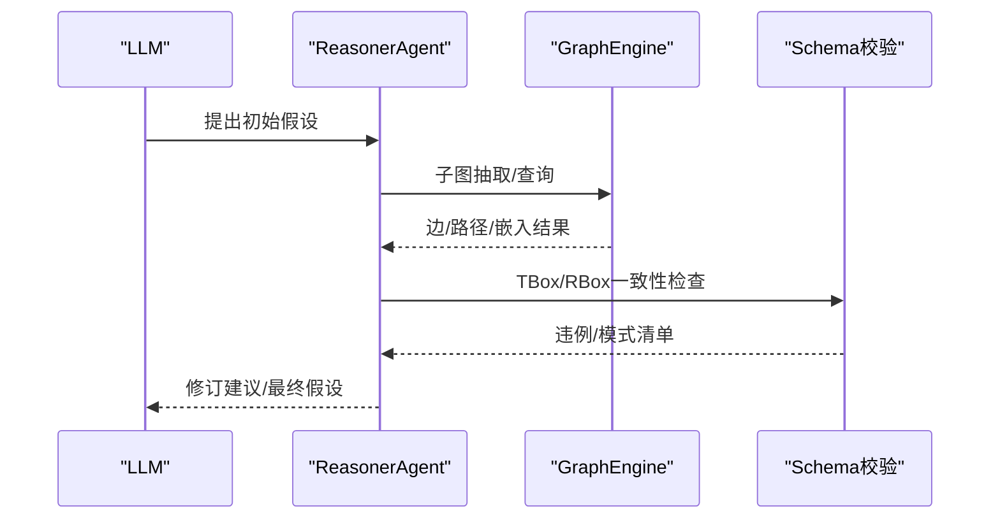
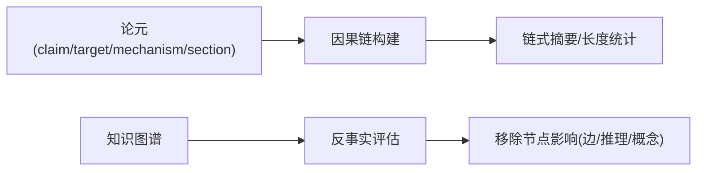
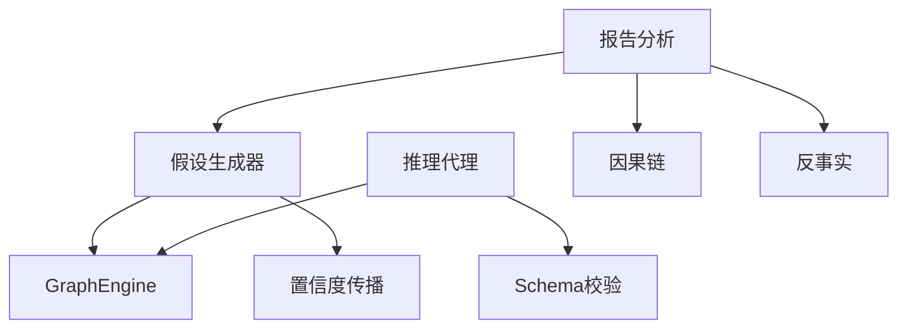

# 假设生成

<cite>
**本文引用的文件**
- [hypothesis.py](file://src/drbrain/extractor/hypothesis.py)
- [test_hypothesis.py](file://tests/test_hypothesis.py)
- [engine.py](file://src/drbrain/graph/engine.py)
- [schema.py](file://src/drbrain/validator/schema.py)
- [reasoner.py](file://src/drbrain/extractor/reasoner.py)
- [causal_chain.py](file://src/drbrain/extractor/causal_chain.py)
- [counterfactual.py](file://src/drbrain/extractor/counterfactual.py)
- [argument.py](file://src/drbrain/extractor/argument.py)
- [confidence_propagation.py](file://src/drbrain/extractor/confidence_propagation.py)
- [2026-05-04-kg-reasoning-design.md](file://docs/superpowers/specs/2026-05-04-kg-reasoning-design.md)
- [2026-05-04-analyze-enhancement-design.md](file://docs/superpowers/specs/2026-05-04-analyze-enhancement-design.md)
- [analyzer.py](file://src/drbrain/report/analyzer.py)
</cite>

## 目录
1. [引言](#引言)
2. [项目结构](#项目结构)
3. [核心组件](#核心组件)
4. [架构总览](#架构总览)
5. [详细组件分析](#详细组件分析)
6. [依赖分析](#依赖分析)
7. [性能考虑](#性能考虑)
8. [故障排查指南](#故障排查指南)
9. [结论](#结论)
10. [附录](#附录)

## 引言
本文件系统化阐述 DrBrain 的“假设生成”能力：如何从现有知识与证据中自动发现新研究假设，并将其与知识图谱推理、因果链分析、反事实分析等能力协同工作。内容覆盖理论基础、算法实现、质量评估、示例与后续步骤，帮助研究人员以数据驱动的方式拓展研究边界。

## 项目结构
与假设生成直接相关的代码主要分布在以下模块：
- 假设生成器：从图模式提取假设（未解决缺口、争议区、技术悬崖、跨域同构）
- 知识图谱引擎：规则闭包、路径规则、嵌入与置信度传播
- 推理代理：LLM 驱动的双向验证与迭代
- 因果链与反事实：辅助定位关键节点与机制
- 报告与分析：将假设与因果链、反事实整合到报告

图表来源
- [hypothesis.py:1-198](file://src/drbrain/extractor/hypothesis.py#L1-L198)
- [engine.py:124-315](file://src/drbrain/graph/engine.py#L124-L315)
- [reasoner.py:16-677](file://src/drbrain/extractor/reasoner.py#L16-L677)
- [schema.py:1-211](file://src/drbrain/validator/schema.py#L1-L211)
- [causal_chain.py:1-238](file://src/drbrain/extractor/causal_chain.py#L1-L238)
- [counterfactual.py:1-144](file://src/drbrain/extractor/counterfactual.py#L1-L144)
- [argument.py:1-87](file://src/drbrain/extractor/argument.py#L1-L87)
- [confidence_propagation.py:1-87](file://src/drbrain/extractor/confidence_propagation.py#L1-L87)
- [analyzer.py:37-76](file://src/drbrain/report/analyzer.py#L37-L76)

章节来源
- [hypothesis.py:1-198](file://src/drbrain/extractor/hypothesis.py#L1-L198)
- [engine.py:124-315](file://src/drbrain/graph/engine.py#L124-L315)
- [reasoner.py:16-677](file://src/drbrain/extractor/reasoner.py#L16-L677)
- [schema.py:1-211](file://src/drbrain/validator/schema.py#L1-L211)
- [causal_chain.py:1-238](file://src/drbrain/extractor/causal_chain.py#L1-L238)
- [counterfactual.py:1-144](file://src/drbrain/extractor/counterfactual.py#L1-L144)
- [argument.py:1-87](file://src/drbrain/extractor/argument.py#L1-L87)
- [confidence_propagation.py:1-87](file://src/drbrain/extractor/confidence_propagation.py#L1-L87)
- [analyzer.py:37-76](file://src/drbrain/report/analyzer.py#L37-L76)

## 核心组件
- 假设模型与评分
  - Hypothesis 数据类：描述、类型、基础置信度、证据列表；提供序列化与评分方法
  - 评分规则：基础置信度 + 证据项加成（每项+0.05，上限+0.15，最高1.0）
- 图模式驱动的假设生成
  - 未解决缺口：从“leaves_open”出发，结合“addresses/extends”推导可填补方法
  - 争议区：目标同时被“supports/challenges”连接，统计支持/挑战数量并标注证据出处
  - 技术悬崖：存在“extends”链且末端受“constrains”约束，提出“放松约束以复活”的假设
  - 可选：跨域同构（由上层工具或报告使用，此处不展开）
- 章节矛盾检测
  - 对同一结论，若来自不同章节的支持/挑战，标记为潜在矛盾，用于报告与审阅
- 质量评估与置信度传播
  - 基于规则闭包与嵌入的置信度融合（混合模式），以及按章节衰减的不确定性传播

章节来源
- [hypothesis.py:18-43](file://src/drbrain/extractor/hypothesis.py#L18-L43)
- [hypothesis.py:82-197](file://src/drbrain/extractor/hypothesis.py#L82-L197)
- [hypothesis.py:46-79](file://src/drbrain/extractor/hypothesis.py#L46-L79)
- [confidence_propagation.py:31-87](file://src/drbrain/extractor/confidence_propagation.py#L31-L87)
- [engine.py:124-315](file://src/drbrain/graph/engine.py#L124-L315)

## 架构总览
假设生成贯穿“模式识别—假设构造—质量评估—报告输出”的闭环，与 LLM 推理、因果链与反事实分析形成互补。

图表来源
- [engine.py:124-315](file://src/drbrain/graph/engine.py#L124-L315)
- [hypothesis.py:82-197](file://src/drbrain/extractor/hypothesis.py#L82-L197)
- [reasoner.py:583-677](file://src/drbrain/extractor/reasoner.py#L583-L677)
- [schema.py:63-94](file://src/drbrain/validator/schema.py#L63-L94)
- [analyzer.py:37-76](file://src/drbrain/report/analyzer.py#L37-L76)

## 详细组件分析

### 组件A：假设生成器（基于知识图谱的模式识别）
- 功能要点
  - 未解决缺口：从“leaves_open”目标出发，检索已存在的“addresses/extends”方法，构造“某方法可填补缺口”的假设
  - 争议区：目标同时被“supports/challenges”指向，统计数量并标注证据章节来源
  - 技术悬崖：若某“extends”方法受“constrains”缺口约束，提出“放松约束以复活”的假设
  - 章节矛盾检测：同一结论在不同章节出现支持/挑战，仅当章节不同才报告
- 复杂度与优化
  - 时间复杂度：O(E)，遍历边建立索引；假设生成为线性扫描
  - 证据溯源：通过章节映射附加“发现于某章节”，提升可追溯性
- 错误处理
  - 空图返回空假设
  - 缺失章节映射时，证据不含章节信息

图表来源
- [hypothesis.py:82-197](file://src/drbrain/extractor/hypothesis.py#L82-L197)

章节来源
- [hypothesis.py:82-197](file://src/drbrain/extractor/hypothesis.py#L82-L197)
- [test_hypothesis.py:19-47](file://tests/test_hypothesis.py#L19-L47)
- [test_hypothesis.py:108-153](file://tests/test_hypothesis.py#L108-L153)
- [test_hypothesis.py:159-196](file://tests/test_hypothesis.py#L159-L196)
- [test_hypothesis.py:202-232](file://tests/test_hypothesis.py#L202-L232)

### 组件B：知识图谱引擎（规则闭包与路径规则）
- 规则闭包
  - 支持“creates_debate/gap_addressed/indirect_evolution/gap_to_debate/shared_actor”等硬规则
  - 可选“混合模式”：将规则置信度与 TransE 嵌入打分融合
- 路径规则
  - 基于多跳路径的规则挖掘与组合，支持向量空间近似合成
- 置信度传播
  - 按章节类型设置衰减因子，合并多路径置信度（概率并）

图表来源
- [engine.py:33-353](file://src/drbrain/graph/engine.py#L33-L353)
- [confidence_propagation.py:31-87](file://src/drbrain/extractor/confidence_propagation.py#L31-L87)

章节来源
- [engine.py:124-315](file://src/drbrain/graph/engine.py#L124-L315)
- [engine.py:354-622](file://src/drbrain/graph/engine.py#L354-L622)
- [confidence_propagation.py:1-87](file://src/drbrain/extractor/confidence_propagation.py#L1-L87)

### 组件C：LLM 推理与双向验证（与假设生成的衔接）
- 设计目标
  - 以工具调用方式在知识图谱上探索，形成并验证研究假设
- 双向验证流程
  - LLM 提出初始假设
  - 知识图谱进行 TBox/RBox 一致性检查与图模式检测（争议/缺口）
  - 将违例与模式反馈给 LLM，迭代修正直至一致或达到轮次上限
- 与假设生成的关系
  - 假设生成器提供“种子假设”，推理代理负责“形式化、验证、扩展”

图表来源
- [reasoner.py:583-677](file://src/drbrain/extractor/reasoner.py#L583-L677)
- [schema.py:63-94](file://src/drbrain/validator/schema.py#L63-L94)

章节来源
- [reasoner.py:16-677](file://src/drbrain/extractor/reasoner.py#L16-L677)
- [schema.py:1-211](file://src/drbrain/validator/schema.py#L1-L211)

### 组件D：因果链与反事实（支撑假设的机制与稳健性）
- 因果链
  - 基于论元机制（mechanism）构建链式推理，支持从特定概念出发的链路搜索
- 反事实
  - 评估移除节点对闭包推理与下游概念的影响，识别关键节点

图表来源
- [argument.py:13-38](file://src/drbrain/extractor/argument.py#L13-L38)
- [causal_chain.py:63-150](file://src/drbrain/extractor/causal_chain.py#L63-L150)
- [counterfactual.py:35-96](file://src/drbrain/extractor/counterfactual.py#L35-L96)

章节来源
- [argument.py:1-87](file://src/drbrain/extractor/argument.py#L1-L87)
- [causal_chain.py:1-238](file://src/drbrain/extractor/causal_chain.py#L1-L238)
- [counterfactual.py:1-144](file://src/drbrain/extractor/counterfactual.py#L1-L144)
- [analyzer.py:37-76](file://src/drbrain/report/analyzer.py#L37-L76)

## 依赖分析
- 假设生成依赖
  - GraphEngine：边遍历、关系索引、闭包（可选）
  - 章节映射：用于证据溯源与置信度衰减
- 推理代理依赖
  - GraphEngine：工具调用（搜索/邻居/路径/嵌入）
  - Schema 校验：TBox/RBox 一致性
- 报告分析依赖
  - 假设生成、因果链、反事实结果的整合

图表来源
- [hypothesis.py:15-15](file://src/drbrain/extractor/hypothesis.py#L15-L15)
- [engine.py:124-315](file://src/drbrain/graph/engine.py#L124-L315)
- [reasoner.py:16-677](file://src/drbrain/extractor/reasoner.py#L16-L677)
- [schema.py:1-211](file://src/drbrain/validator/schema.py#L1-L211)
- [analyzer.py:37-76](file://src/drbrain/report/analyzer.py#L37-L76)

章节来源
- [hypothesis.py:1-198](file://src/drbrain/extractor/hypothesis.py#L1-L198)
- [engine.py:124-315](file://src/drbrain/graph/engine.py#L124-L315)
- [reasoner.py:16-677](file://src/drbrain/extractor/reasoner.py#L16-L677)
- [schema.py:1-211](file://src/drbrain/validator/schema.py#L1-L211)
- [analyzer.py:37-76](file://src/drbrain/report/analyzer.py#L37-L76)

## 性能考虑
- 假设生成
  - 线性时间复杂度 O(E)，适合大规模图谱；建议在已有关系索引基础上运行
- 规则闭包与路径规则
  - 闭包与路径规则涉及多跳搜索，建议限制最大跳数与并行度
- 嵌入与相似度
  - TransE 训练成本较高，建议增量训练与缓存；相似度查询按需加载
- 报告整合
  - 合并因果链与反事实结果时，注意去重与排序开销

## 故障排查指南
- 假设为空
  - 检查图是否为空或缺少关键关系（如 leaves_open/addresses/supports/challenges/extends/constrains）
- 章节映射无效
  - 确认 section_map 的键值与图节点标签一致；否则证据不带章节信息
- LLM 无法收敛
  - 检查工具调用返回；确认 GraphEngine 已加载并具备必要索引
- Schema 校验失败
  - 关注 TBox/RBox 违例提示，修正关系或实体类型

章节来源
- [test_hypothesis.py:44-47](file://tests/test_hypothesis.py#L44-L47)
- [reasoner.py:583-677](file://src/drbrain/extractor/reasoner.py#L583-L677)
- [schema.py:63-94](file://src/drbrain/validator/schema.py#L63-L94)

## 结论
DrBrain 的假设生成以“知识图谱模式识别”为核心，结合“置信度传播”与“LLM 双向验证”，形成从证据到假设再到稳健结论的完整流程。通过因果链与反事实分析，进一步增强假设的机制解释与稳健性评估。该框架既可用于自动化发现研究方向，也可作为人工审阅与实验设计的起点。

## 附录

### 假设生成质量评估标准
- 新颖性
  - 是否针对“未解决缺口”或“争议区”提出新视角或新方法
  - 是否揭示“技术悬崖”下的复活机会
- 可验证性
  - 假设是否可由现有证据支持（证据计数与章节来源）
  - 是否可通过 LLM 与图谱工具进行验证（TBox/RBox 一致性、图模式检测）
- 科学价值
  - 是否与因果链/反事实分析相互印证，提升解释力与稳健性

章节来源
- [hypothesis.py:37-43](file://src/drbrain/extractor/hypothesis.py#L37-L43)
- [reasoner.py:583-677](file://src/drbrain/extractor/reasoner.py#L583-L677)
- [schema.py:63-94](file://src/drbrain/validator/schema.py#L63-L94)

### 典型假设生成示例（路径指引）
- 未解决缺口
  - 输入：存在 leaves_open(Gap_X) 且若干 addresses/extends 方法
  - 输出：某方法可填补缺口的假设（证据含方法与章节溯源）
  - 路径参考：[test_hypothesis.py:19-28](file://tests/test_hypothesis.py#L19-L28)
- 争议区
  - 输入：同一结论被 supports 与 challenges 同时指向
  - 输出：需要新证据以解决争议的假设（证据含支持/挑战计数与章节）
  - 路径参考：[test_hypothesis.py:31-41](file://tests/test_hypothesis.py#L31-L41)
- 技术悬崖
  - 输入：存在 extends 链且末端受 constrains 约束
  - 输出：放松约束以复活方法的假设（证据含章节溯源）
  - 路径参考：[test_hypothesis.py:202-232](file://tests/test_hypothesis.py#L202-L232)

### 与因果链、反事实的集成
- 因果链
  - 通过论元机制构建链式推理，辅助解释假设的中间机制
  - 路径参考：[causal_chain.py:63-150](file://src/drbrain/extractor/causal_chain.py#L63-L150)
- 反事实
  - 评估关键节点移除对推理与下游概念的影响，识别高影响力节点
  - 路径参考：[counterfactual.py:35-96](file://src/drbrain/extractor/counterfactual.py#L35-L96)

### 假设验证与后续实验设计建议
- 验证步骤
  - 使用 LLM 双向验证：先假设，再图谱校验，最后迭代修正
  - 路径参考：[reasoner.py:583-677](file://src/drbrain/extractor/reasoner.py#L583-L677)
- 实验设计建议
  - 基于“争议区”与“技术悬崖”设计对照实验，收集支持/挑战证据
  - 利用“因果链”梳理机制路径，明确控制变量与中介变量
  - 通过“反事实”识别关键节点，设计消融实验评估其贡献

章节来源
- [2026-05-04-kg-reasoning-design.md:91-145](file://docs/superpowers/specs/2026-05-04-kg-reasoning-design.md#L91-L145)
- [2026-05-04-analyze-enhancement-design.md:1-22](file://docs/superpowers/specs/2026-05-04-analyze-enhancement-design.md#L1-L22)
- [analyzer.py:37-76](file://src/drbrain/report/analyzer.py#L37-L76)