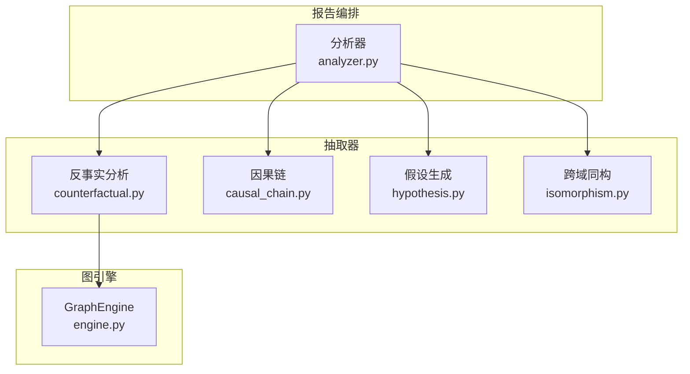
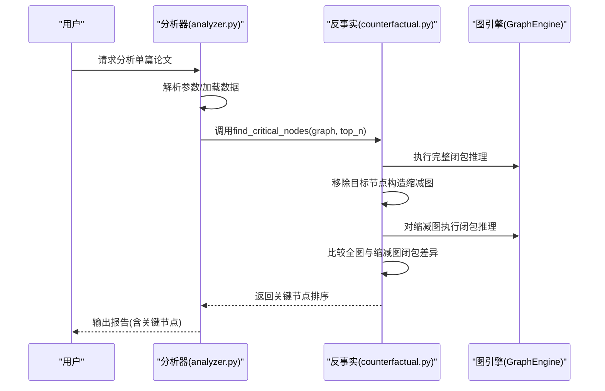
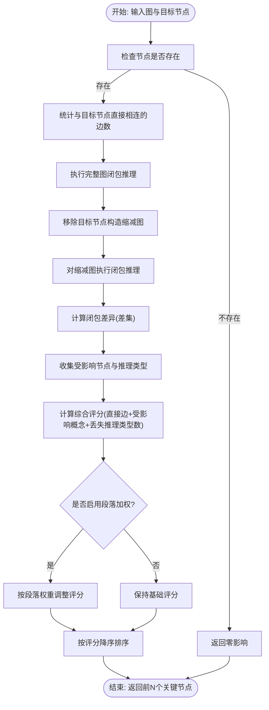
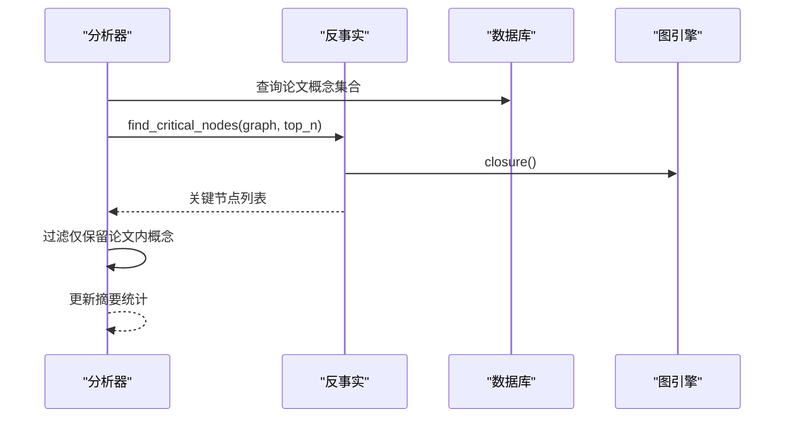
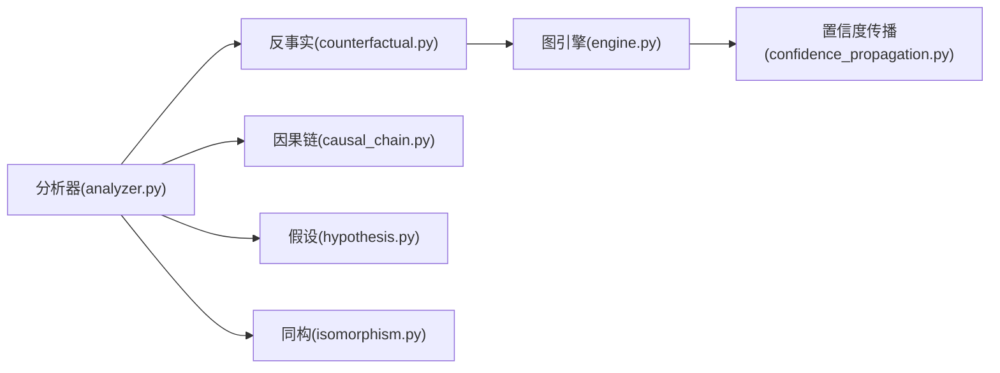
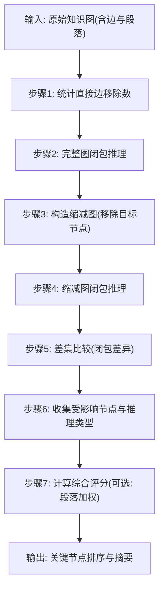

# 反事实分析

<cite>
**本文引用的文件**
- [counterfactual.py](file://src/drbrain/extractor/counterfactual.py)
- [engine.py](file://src/drbrain/graph/engine.py)
- [analyzer.py](file://src/drbrain/report/analyzer.py)
- [test_counterfactual.py](file://tests/test_counterfactual.py)
- [causal_chain.py](file://src/drbrain/extractor/causal_chain.py)
- [argument.py](file://src/drbrain/extractor/argument.py)
- [hypothesis.py](file://src/drbrain/extractor/hypothesis.py)
- [isomorphism.py](file://src/drbrain/extractor/isomorphism.py)
- [confidence_propagation.py](file://src/drbrain/extractor/confidence_propagation.py)
</cite>

## 目录
1. [简介](#简介)
2. [项目结构](#项目结构)
3. [核心组件](#核心组件)
4. [架构总览](#架构总览)
5. [详细组件分析](#详细组件分析)
6. [依赖分析](#依赖分析)
7. [性能考虑](#性能考虑)
8. [故障排查指南](#故障排查指南)
9. [结论](#结论)
10. [附录](#附录)

## 简介
本文件系统化阐述 DrBrain 中“反事实分析”（Counterfactual Analysis）的功能设计与实现，面向研究人员与工程实践者，既提供高层概念说明，也给出代码级实现细节与可视化图示。反事实分析旨在回答“如果某节点不存在会怎样”的问题：通过移除目标节点，比较完整图与缩减图之间的闭包推理差异，量化该节点对知识网络的影响程度，从而识别关键节点、评估研究结论的稳健性，并辅助方法论批判与质量评估。

## 项目结构
反事实分析位于抽取器模块中，围绕图引擎提供的闭包推理能力进行扩展：
- 抽取器层：反事实计算、因果链、假设生成、同构模式等
- 图引擎层：规则驱动的闭包推理、路径规则、置信度传播
- 报告编排层：将多种分析模块整合为统一报告

图表来源
- [counterfactual.py:1-144](file://src/drbrain/extractor/counterfactual.py#L1-L144)
- [engine.py:124-315](file://src/drbrain/graph/engine.py#L124-L315)
- [analyzer.py:9-134](file://src/drbrain/report/analyzer.py#L9-L134)

章节来源
- [counterfactual.py:1-144](file://src/drbrain/extractor/counterfactual.py#L1-L144)
- [engine.py:124-315](file://src/drbrain/graph/engine.py#L124-L315)
- [analyzer.py:9-134](file://src/drbrain/report/analyzer.py#L9-L134)

## 核心组件
- 反事实影响度量：以节点移除为“反事实操作”，统计直接边移除数、受影响的概念数、丢失的闭包推理类型集合，以及受影响的下游节点集合。
- 关键节点排序：基于影响度量的综合评分（直接边+受影响概念+丢失推理类型数），支持按学术段落权重加权。
- 报告集成：在单篇论文分析中可选地输出关键节点列表，用于后续的稳健性与方法论批判。

章节来源
- [counterfactual.py:16-96](file://src/drbrain/extractor/counterfactual.py#L16-L96)
- [analyzer.py:70-85](file://src/drbrain/report/analyzer.py#L70-L85)

## 架构总览
反事实分析的执行流从报告编排器开始，调用抽取器中的关键函数，依赖图引擎的闭包推理能力，最终产出可读的摘要与排序结果。

图表来源
- [analyzer.py:70-85](file://src/drbrain/report/analyzer.py#L70-L85)
- [counterfactual.py:81-96](file://src/drbrain/extractor/counterfactual.py#L81-L96)
- [engine.py:124-315](file://src/drbrain/graph/engine.py#L124-L315)

## 详细组件分析

### 反事实影响度量与关键节点排序
- 影响度量对象：封装移除节点、直接边数量、受影响概念数、丢失推理类型集合、受影响节点集合。
- 计算流程：
  1) 统计与目标节点直接相连的边数作为“直接边移除数”。
  2) 获取完整图的闭包推理集合。
  3) 构造移除目标节点后的缩减图，计算其闭包推理集合。
  4) 通过集合差集确定“丢失推理类型集合”，并收集受影响节点。
  5) 将影响度量汇总为综合评分，用于排序。
- 加权关键节点：根据节点所在学术段落（如 Methods/Results 更具根基，Discussion/Related Work 更具推测性）对基础评分乘以权重，提升稳健性评估的合理性。

图表来源
- [counterfactual.py:35-96](file://src/drbrain/extractor/counterfactual.py#L35-L96)
- [engine.py:124-315](file://src/drbrain/graph/engine.py#L124-L315)

章节来源
- [counterfactual.py:16-96](file://src/drbrain/extractor/counterfactual.py#L16-L96)
- [engine.py:124-315](file://src/drbrain/graph/engine.py#L124-L315)

### 报告编排与集成
- 在单篇论文分析中，若开启 full 模式，则调用 find_critical_nodes 对关键节点进行筛选与排序，并仅保留属于该论文概念集合内的节点，形成“关键节点”报告项。
- 报告摘要统计中包含关键节点数量，便于快速概览。

图表来源
- [analyzer.py:70-85](file://src/drbrain/report/analyzer.py#L70-L85)

章节来源
- [analyzer.py:70-85](file://src/drbrain/report/analyzer.py#L70-L85)

### 因果链与反事实的互补视角
- 因果链从“机制”角度串联论证，强调概念间的因果路径；反事实则从“稳健性”角度评估节点的重要性。
- 二者结合可用于更全面的方法论批判：若某关键节点同时出现在重要因果链上，其移除将显著削弱结论的稳健性。

章节来源
- [causal_chain.py:63-150](file://src/drbrain/extractor/causal_chain.py#L63-L150)
- [argument.py:13-38](file://src/drbrain/extractor/argument.py#L13-L38)

### 假设生成与反事实的关联
- 假设生成关注“未解决的缺口、争议区、技术瓶颈”等，反事实可为这些假设提供稳健性证据：关键节点的缺失是否导致“争议消失”或“缺口被填补”等现象。
- 两者共同服务于研究质量评估与方法论批判。

章节来源
- [hypothesis.py:82-197](file://src/drbrain/extractor/hypothesis.py#L82-L197)

### 同构模式与跨领域迁移
- 同构模式检测关注跨领域结构相似性，反事实可辅助判断某一领域的关键节点在另一领域是否同样具有影响力，从而指导迁移建议。
- 二者结合有助于发现跨学科知识转移机会。

章节来源
- [isomorphism.py:111-170](file://src/drbrain/extractor/isomorphism.py#L111-L170)

## 依赖分析
- 反事实分析依赖图引擎的闭包推理能力，用于比较完整图与缩减图的闭包差异。
- 报告编排器在 full 模式下集成反事实分析，形成统一报告。
- 置信度传播模块为闭包推理提供段落感知的置信度衰减策略，间接影响反事实评分的稳定性。

图表来源
- [counterfactual.py:13-13](file://src/drbrain/extractor/counterfactual.py#L13-L13)
- [engine.py:124-315](file://src/drbrain/graph/engine.py#L124-L315)
- [analyzer.py:70-98](file://src/drbrain/report/analyzer.py#L70-L98)
- [confidence_propagation.py:44-64](file://src/drbrain/extractor/confidence_propagation.py#L44-L64)

章节来源
- [counterfactual.py:13-13](file://src/drbrain/extractor/counterfactual.py#L13-L13)
- [engine.py:124-315](file://src/drbrain/graph/engine.py#L124-L315)
- [analyzer.py:70-98](file://src/drbrain/report/analyzer.py#L70-L98)
- [confidence_propagation.py:44-64](file://src/drbrain/extractor/confidence_propagation.py#L44-L64)

## 性能考虑
- 闭包推理复杂度与边数、节点数及规则数量相关。对于大规模图，建议：
  - 使用增量闭包或子图闭包（仅针对种子节点邻域）以减少计算量。
  - 控制反事实节点数量（top_n），避免对全图逐一运行。
  - 在需要时采用混合模式（symbolic + hybrid）以平衡速度与置信度质量。
- 关键节点排序涉及对每个节点的闭包比较，应限制遍历规模并缓存中间结果（如闭包集合）。

[本节为通用性能讨论，不直接分析具体文件]

## 故障排查指南
- 节点不存在：当目标节点不在图中时，反事实影响度量返回零影响，这是预期行为。
- 空图处理：空图返回空的关键节点列表，确保健壮性。
- 闭包差异为空：若移除节点未触发任何闭包规则变化（例如仅存在简单引用关系），则丢失推理为空，属正常情况。
- 段落加权异常：未知段落使用默认权重，若出现评分异常，检查段落映射是否正确。

章节来源
- [test_counterfactual.py:64-82](file://tests/test_counterfactual.py#L64-L82)
- [counterfactual.py:81-96](file://src/drbrain/extractor/counterfactual.py#L81-L96)

## 结论
反事实分析为 DrBrain 提供了从“稳健性”维度评估知识网络与研究结论的重要工具。通过量化节点移除对闭包推理的影响，它能够：
- 识别关键节点，辅助方法论批判与质量评估；
- 与因果链、假设生成、跨域同构等模块协同，形成多维的知识前沿洞察；
- 在报告编排中以可读形式呈现，便于非技术读者理解研究动态与潜在风险。

[本节为总结性内容，不直接分析具体文件]

## 附录

### 反事实分析执行流程（从原始论证到结果对比）

图表来源
- [counterfactual.py:35-96](file://src/drbrain/extractor/counterfactual.py#L35-L96)
- [engine.py:124-315](file://src/drbrain/graph/engine.py#L124-L315)

### 示例：评估研究结论的鲁棒性与潜在偏差
- 场景：某“争议区”结论在 Methods 段落中被提出，但多个支撑证据来自 Discussion 段落。
- 反事实分析：移除支撑证据节点，观察“creates_debate”推理是否消失；若消失，说明结论对特定证据高度敏感，存在潜在偏差风险。
- 建议：优先补充 Methods 段落中的实证证据，或在 Discussion 段落中明确标注不确定性。

章节来源
- [counterfactual.py:45-78](file://src/drbrain/extractor/counterfactual.py#L45-L78)
- [engine.py:184-197](file://src/drbrain/graph/engine.py#L184-L197)
- [confidence_propagation.py:44-64](file://src/drbrain/extractor/confidence_propagation.py#L44-L64)