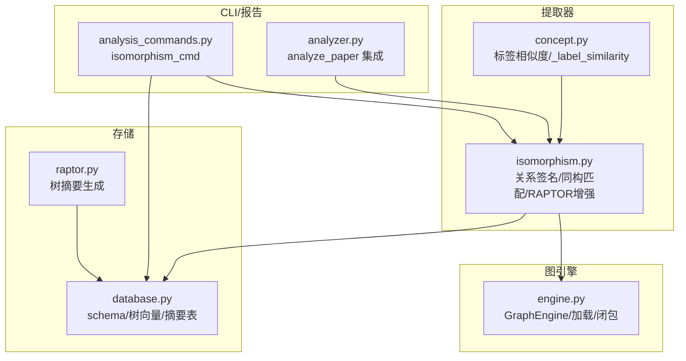
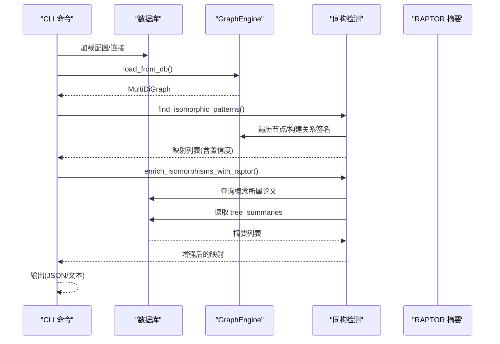
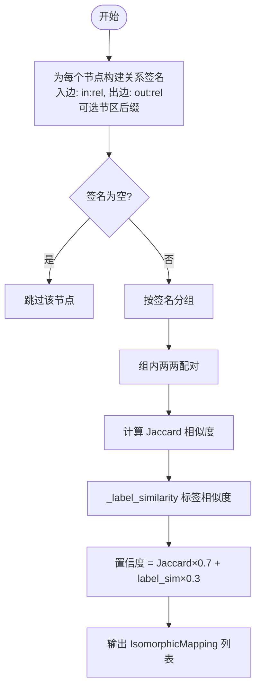
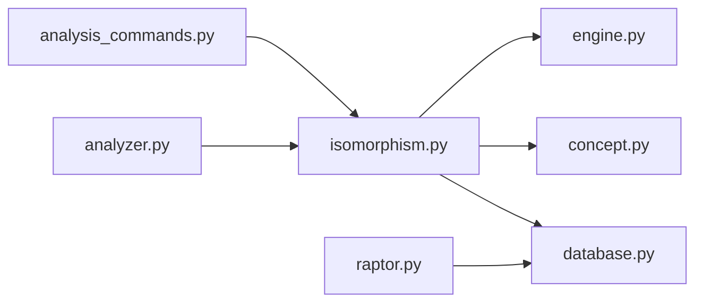

# 同构检测

<cite>
**本文引用的文件**
- [isomorphism.py](file://src/drbrain/extractor/isomorphism.py)
- [engine.py](file://src/drbrain/graph/engine.py)
- [concept.py](file://src/drbrain/extractor/concept.py)
- [analysis_commands.py](file://src/drbrain/cli/analysis_commands.py)
- [analyzer.py](file://src/drbrain/report/analyzer.py)
- [database.py](file://src/drbrain/storage/database.py)
- [raptor.py](file://src/drbrain/extractor/raptor.py)
- [test_isomorphism.py](file://tests/test_isomorphism.py)
</cite>

## 目录
1. [简介](#简介)
2. [项目结构](#项目结构)
3. [核心组件](#核心组件)
4. [架构总览](#架构总览)
5. [详细组件分析](#详细组件分析)
6. [依赖分析](#依赖分析)
7. [性能考虑](#性能考虑)
8. [故障排查指南](#故障排查指南)
9. [结论](#结论)
10. [附录](#附录)

## 简介
本文件系统化阐述 DrBrain 中“同构检测”能力的设计与实现，聚焦于在知识图谱中识别“结构相同但标签不同”的实体关系模式，从而发现跨领域可迁移的知识模式、重复论证结构与相似实体关系，提升知识图谱一致性与可发现性。内容涵盖：
- 图同构检测的理论基础与在知识抽取中的作用
- 关系签名与相似度计算策略
- 算法实现与优化
- CLI 与报告集成
- 复杂度分析与性能优化建议
- 结果解释与后续处理策略

## 项目结构
与同构检测直接相关的模块与文件如下：
- 提取器：关系签名与同构匹配、RAPTOR 上下文增强
- 图引擎：图加载、遍历、闭包推理
- 概念工具：标签相似度计算
- CLI：命令行入口
- 报告：分析报告集成
- 存储：数据库 schema 与 RAPTOR 摘要表
- 测试：覆盖签名构建、相似度阈值、CLI 行为等

图表来源
- [isomorphism.py:1-257](file://src/drbrain/extractor/isomorphism.py#L1-L257)
- [engine.py:1-120](file://src/drbrain/graph/engine.py#L1-L120)
- [concept.py:890-900](file://src/drbrain/extractor/concept.py#L890-L900)
- [analysis_commands.py:550-602](file://src/drbrain/cli/analysis_commands.py#L550-L602)
- [analyzer.py:87-98](file://src/drbrain/report/analyzer.py#L87-L98)
- [database.py:84-98](file://src/drbrain/storage/database.py#L84-L98)
- [raptor.py:271-348](file://src/drbrain/extractor/raptor.py#L271-L348)

章节来源
- [isomorphism.py:1-257](file://src/drbrain/extractor/isomorphism.py#L1-L257)
- [engine.py:760-785](file://src/drbrain/graph/engine.py#L760-L785)
- [concept.py:890-900](file://src/drbrain/extractor/concept.py#L890-L900)
- [analysis_commands.py:550-602](file://src/drbrain/cli/analysis_commands.py#L550-L602)
- [analyzer.py:87-98](file://src/drbrain/report/analyzer.py#L87-L98)
- [database.py:84-98](file://src/drbrain/storage/database.py#L84-L98)
- [raptor.py:271-348](file://src/drbrain/extractor/raptor.py#L271-L348)

## 核心组件
- 关系签名函数：对每个节点统计其入边/出边的关系类型与计数，并支持按节区维度扩展键名，用于衡量“关系模式”。
- 同构匹配：基于签名分组，两两比较 Jaccard 相似度；同时结合标签相似度，综合得到置信度。
- RAPTOR 增强：根据映射涉及的概念所属论文，拉取跨节摘要，提供上下文支撑。
- CLI 与报告：提供命令行查询与报告集成，便于交互式探索与批量分析。

章节来源
- [isomorphism.py:35-170](file://src/drbrain/extractor/isomorphism.py#L35-L170)
- [isomorphism.py:173-257](file://src/drbrain/extractor/isomorphism.py#L173-L257)
- [analysis_commands.py:550-602](file://src/drbrain/cli/analysis_commands.py#L550-L602)
- [analyzer.py:87-98](file://src/drbrain/report/analyzer.py#L87-L98)

## 架构总览
同构检测在 DrBrain 中作为“符号驱动”的模式发现模块，与图引擎、数据库、RAPTOR 摘要系统协同工作，形成从数据到洞察的闭环。

图表来源
- [analysis_commands.py:550-602](file://src/drbrain/cli/analysis_commands.py#L550-L602)
- [isomorphism.py:111-170](file://src/drbrain/extractor/isomorphism.py#L111-L170)
- [isomorphism.py:173-257](file://src/drbrain/extractor/isomorphism.py#L173-L257)
- [database.py:84-98](file://src/drbrain/storage/database.py#L84-L98)

## 详细组件分析

### 组件一：关系签名与相似度计算
- 关系签名：对每个节点统计入边/出边的关系类型计数，可选地附加节区后缀，形成键集合；空签名或无边节点会被忽略。
- 相似度：采用 Jaccard 相似度比较签名集合；同时使用标签相似度（词集 Jaccard）作为权重因子，综合置信度。

图表来源
- [isomorphism.py:35-170](file://src/drbrain/extractor/isomorphism.py#L35-L170)
- [concept.py:890-900](file://src/drbrain/extractor/concept.py#L890-L900)

章节来源
- [isomorphism.py:35-170](file://src/drbrain/extractor/isomorphism.py#L35-L170)
- [concept.py:890-900](file://src/drbrain/extractor/concept.py#L890-L900)

### 组件二：同构映射与置信度
- 数据结构：IsomorphicMapping 包含源域、目标域、共享结构描述、置信度，以及可选的 RAPTOR 上下文。
- 置信度组合：Jaccard 相似度权重 0.7，标签相似度权重 0.3；通过测试验证不同签名组合会得到不同置信度分数。

章节来源
- [isomorphism.py:17-33](file://src/drbrain/extractor/isomorphism.py#L17-L33)
- [isomorphism.py:111-170](file://src/drbrain/extractor/isomorphism.py#L111-L170)
- [test_isomorphism.py:206-224](file://tests/test_isomorphism.py#L206-L224)

### 组件三：RAPTOR 上下文增强
- 功能：根据映射涉及的概念，查询其所属论文，再读取 tree_summaries 中的跨节摘要，填充到映射对象中，便于解释与后续处理。
- 存储：tree_summaries 表包含 node_id、paper_id、summary_text、source_node_ids、tree_layer 字段。

章节来源
- [isomorphism.py:173-257](file://src/drbrain/extractor/isomorphism.py#L173-L257)
- [database.py:84-98](file://src/drbrain/storage/database.py#L84-L98)
- [raptor.py:271-348](file://src/drbrain/extractor/raptor.py#L271-L348)

### 组件四：CLI 与报告集成
- CLI：提供 isomorphism 命令，支持过滤概念、最小置信度阈值、JSON 输出；调用同构检测与 RAPTOR 增强。
- 报告：analyze_paper 在 full 模式下收集同构映射并写入报告摘要。

章节来源
- [analysis_commands.py:550-602](file://src/drbrain/cli/analysis_commands.py#L550-L602)
- [analyzer.py:87-98](file://src/drbrain/report/analyzer.py#L87-L98)

## 依赖分析
- 模块耦合
  - isomorphism 依赖 GraphEngine 进行图遍历与加载；依赖 concept 的标签相似度；依赖 database 的 tree_summaries 表进行 RAPTOR 增强。
  - CLI 与报告模块通过统一接口调用同构检测，形成“命令行—分析—输出”的闭环。
- 外部依赖
  - NetworkX 用于 MultiDiGraph；SQLite 用于持久化；RAPTOR 摘要生成与向量存储。

图表来源
- [isomorphism.py:14-14](file://src/drbrain/extractor/isomorphism.py#L14-L14)
- [engine.py:36-43](file://src/drbrain/graph/engine.py#L36-L43)
- [concept.py:890-900](file://src/drbrain/extractor/concept.py#L890-L900)
- [analysis_commands.py:550-602](file://src/drbrain/cli/analysis_commands.py#L550-L602)
- [analyzer.py:87-98](file://src/drbrain/report/analyzer.py#L87-L98)
- [database.py:84-98](file://src/drbrain/storage/database.py#L84-L98)
- [raptor.py:271-348](file://src/drbrain/extractor/raptor.py#L271-L348)

章节来源
- [isomorphism.py:1-257](file://src/drbrain/extractor/isomorphism.py#L1-L257)
- [engine.py:36-43](file://src/drbrain/graph/engine.py#L36-L43)
- [concept.py:890-900](file://src/drbrain/extractor/concept.py#L890-L900)
- [analysis_commands.py:550-602](file://src/drbrain/cli/analysis_commands.py#L550-L602)
- [analyzer.py:87-98](file://src/drbrain/report/analyzer.py#L87-L98)
- [database.py:84-98](file://src/drbrain/storage/database.py#L84-L98)
- [raptor.py:271-348](file://src/drbrain/extractor/raptor.py#L271-L348)

## 性能考虑
- 时间复杂度
  - 关系签名构建：O(E)，其中 E 为边数。
  - 分组与两两比较：最坏 O(N^2) 对于同一签名组内的节点数 N；整体取决于签名分布。
  - 置信度计算：每对节点 O(S)，S 为签名大小（通常很小）。
  - RAPTOR 增强：查询与聚合开销与映射数量、论文数量、摘要条目数相关。
- 空间复杂度
  - 节点签名字典与分组字典占用 O(N + Σ|sig|)。
  - RAPTOR 增强缓存按论文与映射规模增长。
- 优化建议
  - 签名预处理：仅保留非空签名，避免无效节点参与比较。
  - 分组剪枝：对签名维度较小的组优先处理，减少后续比较次数。
  - 并行化：对不同签名组内的比较可并行（注意线程安全与锁）。
  - 缓存：复用标签相似度与 RAPTOR 摘要查询结果，避免重复访问数据库。
  - 索引：确保 edges、concepts、tree_summaries 的关键列建立索引（已见 schema 定义）。

章节来源
- [isomorphism.py:111-170](file://src/drbrain/extractor/isomorphism.py#L111-L170)
- [database.py:115-122](file://src/drbrain/storage/database.py#L115-L122)

## 故障排查指南
- 空图或单节点图
  - 现象：返回空列表。
  - 原因：无边或无有效签名。
  - 处理：确认图已构建并包含边。
- 无相似模式
  - 现象：Jaccard 相似度低或标签差异大。
  - 原因：关系模式不一致或标签差异显著。
  - 处理：调整阈值或检查节区映射是否正确。
- RAPTOR 上下文缺失
  - 现象：raptor_source_context/raptor_target_context 为空。
  - 原因：数据库中无 tree_summaries 或概念未关联论文。
  - 处理：确认已执行 RAPTOR 摘要生成流程并写入数据库。
- CLI 无输出
  - 现象：命令行显示“未找到同构模式”。
  - 原因：置信度过低或过滤条件导致结果被筛掉。
  - 处理：降低 --min-confidence 或移除 --concept 过滤。

章节来源
- [test_isomorphism.py:65-90](file://tests/test_isomorphism.py#L65-L90)
- [test_isomorphism.py:262-283](file://tests/test_isomorphism.py#L262-L283)
- [isomorphism.py:173-257](file://src/drbrain/extractor/isomorphism.py#L173-L257)

## 结论
DrBrain 的同构检测以“关系签名 + Jaccard 相似度 + 标签相似度”的轻量策略，在知识图谱中高效识别结构相似但标签不同的实体关系模式。通过与 RAPTOR 摘要的结合，不仅提升了结果的可解释性，也为跨领域知识迁移提供了线索。建议在大规模图上结合并行化与缓存策略，进一步提升性能与可用性。

## 附录

### 示例：如何发现与处理结构重复
- 发现重复论证模式
  - 使用 CLI 命令列出所有映射，观察置信度与共享结构描述。
  - 通过 RAPTOR 上下文定位证据来源，判断是否为重复论证。
- 合并相似实体关系
  - 将高置信度映射的源域与目标域视为等价，统一标签与关系方向。
  - 更新图中的边与概念，保持一致性。
- 提升知识图谱一致性
  - 基于映射结果，补充跨领域迁移建议或生成假设，推动知识融合。

章节来源
- [analysis_commands.py:550-602](file://src/drbrain/cli/analysis_commands.py#L550-L602)
- [isomorphism.py:173-257](file://src/drbrain/extractor/isomorphism.py#L173-L257)