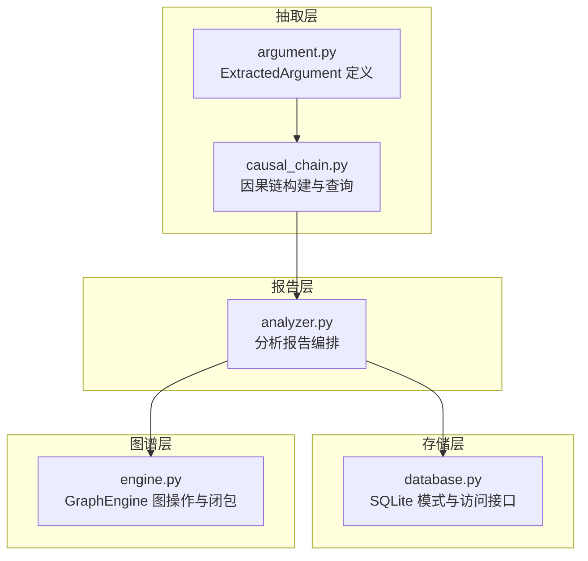
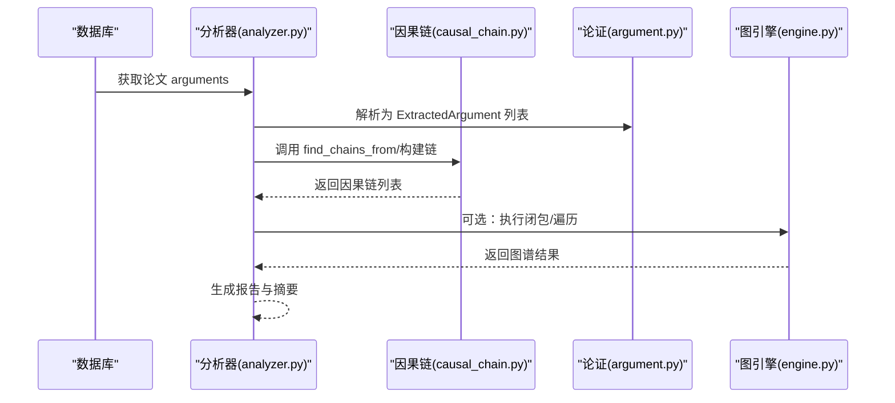
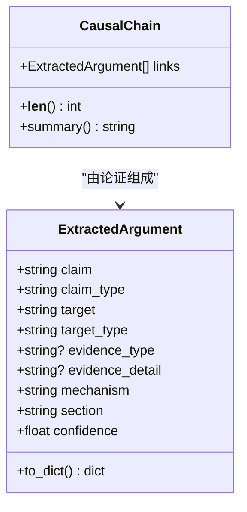
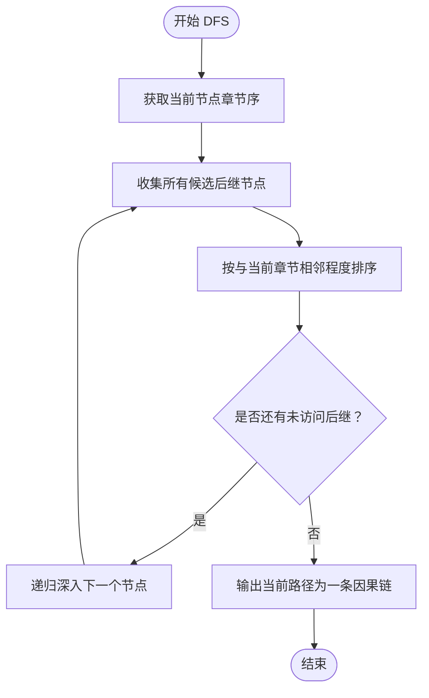
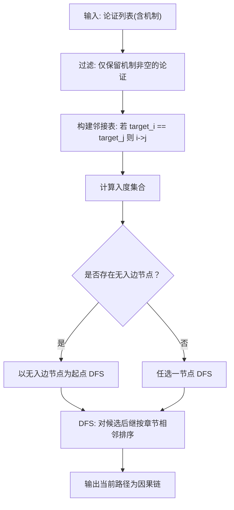
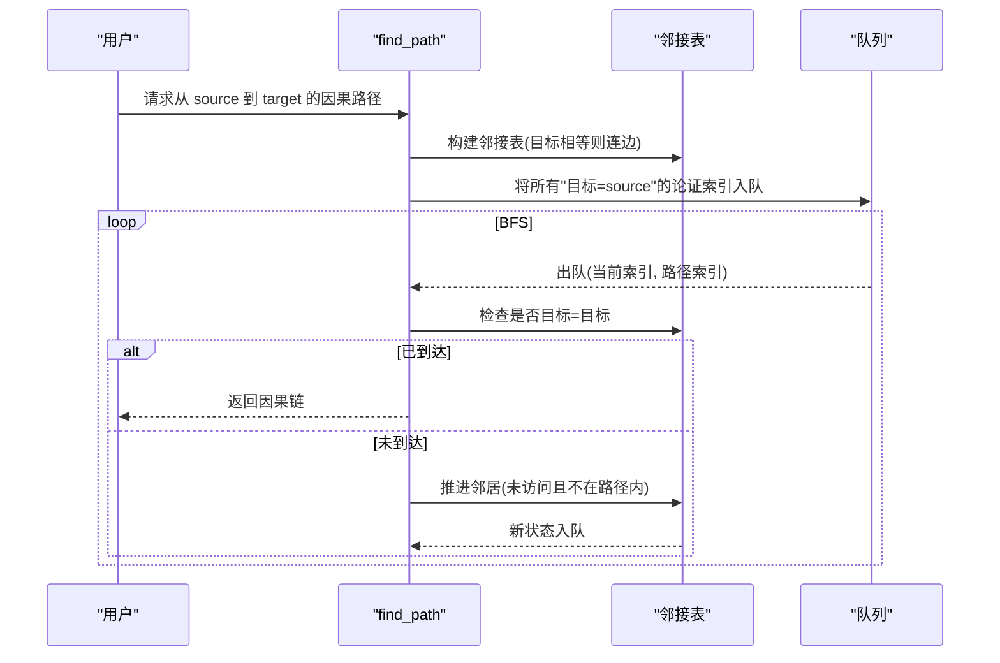
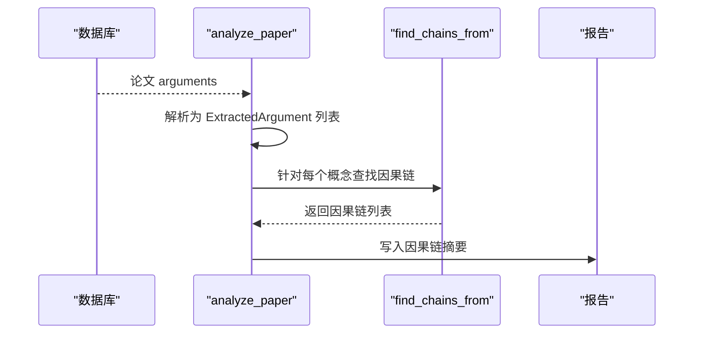
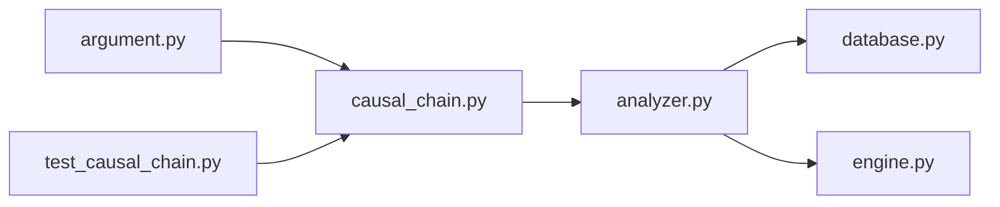

# 因果链分析

<cite>
**本文引用的文件**
- [causal_chain.py](file://src/drbrain/extractor/causal_chain.py)
- [argument.py](file://src/drbrain/extractor/argument.py)
- [analyzer.py](file://src/drbrain/report/analyzer.py)
- [test_causal_chain.py](file://tests/test_causal_chain.py)
- [database.py](file://src/drbrain/storage/database.py)
- [engine.py](file://src/drbrain/graph/engine.py)
- [2026-05-04-kg-reasoning-design.md](file://docs/superpowers/specs/2026-05-04-kg-reasoning-design.md)
- [architecture.md](file://docs/architecture.md)
- [SKILL.md](file://skills/kg-reason/SKILL.md)
</cite>

## 目录
1. [引言](#引言)
2. [项目结构](#项目结构)
3. [核心组件](#核心组件)
4. [架构总览](#架构总览)
5. [详细组件分析](#详细组件分析)
6. [依赖关系分析](#依赖关系分析)
7. [性能考量](#性能考量)
8. [故障排查指南](#故障排查指南)
9. [结论](#结论)
10. [附录](#附录)

## 引言
本文件系统性阐述 DrBrain 中“因果链分析”功能的理论基础、数据结构设计与实现细节，以及在知识图谱中的应用与结果解释方法。重点覆盖：
- 从论证机制中提取因果关系的方法论
- CausalChain 数据结构的设计与实现
- 链接关系建立、链的遍历算法与路径查找机制
- 文档章节顺序对因果链排序的影响机制
- 具体因果链分析示例（来自论文论证）
- 在知识图谱中的应用与结果解释

## 项目结构
因果链分析位于抽取层（extractor），围绕 ExtractedArgument 进行因果链构建，并在报告生成器中被纳入整体分析流程；同时与知识图谱引擎协同，支持更深层的推理与可视化。

图表来源
- [argument.py:13-38](file://src/drbrain/extractor/argument.py#L13-L38)
- [causal_chain.py:40-61](file://src/drbrain/extractor/causal_chain.py#L40-L61)
- [analyzer.py:37-68](file://src/drbrain/report/analyzer.py#L37-L68)
- [database.py:48-62](file://src/drbrain/storage/database.py#L48-L62)
- [engine.py:33-44](file://src/drbrain/graph/engine.py#L33-L44)

章节来源
- [argument.py:13-38](file://src/drbrain/extractor/argument.py#L13-L38)
- [causal_chain.py:40-61](file://src/drbrain/extractor/causal_chain.py#L40-L61)
- [analyzer.py:37-68](file://src/drbrain/report/analyzer.py#L37-L68)
- [database.py:48-62](file://src/drbrain/storage/database.py#L48-L62)
- [engine.py:33-44](file://src/drbrain/graph/engine.py#L33-L44)

## 核心组件
- ExtractedArgument：承载单条论证单元，包含主张、主张类型、目标概念、证据类型与机制、章节位置、置信度等字段。
- CausalChain：由多条 ExtractedArgument 组成的因果链，提供摘要输出与长度统计。
- 因果链构建与查询函数：基于机制字段与目标概念，构建有向图并进行 DFS/BFS 查找，支持按概念起点筛选与最短路径查找。

章节来源
- [argument.py:13-38](file://src/drbrain/extractor/argument.py#L13-L38)
- [causal_chain.py:40-61](file://src/drbrain/extractor/causal_chain.py#L40-L61)
- [causal_chain.py:63-150](file://src/drbrain/extractor/causal_chain.py#L63-L150)
- [causal_chain.py:153-189](file://src/drbrain/extractor/causal_chain.py#L153-L189)
- [causal_chain.py:192-237](file://src/drbrain/extractor/causal_chain.py#L192-L237)

## 架构总览
因果链分析贯穿“抽取—存储—报告—图谱”的完整链路：
- 抽取层：解析 LLM 输出为 ExtractedArgument，保留机制与章节信息
- 存储层：数据库 schema 中 arguments 表保存机制与 section 字段
- 报告层：分析器读取论文的 arguments，调用因果链模块生成因果链摘要
- 图谱层：GraphEngine 提供闭包与遍历能力，支撑更高级的推理与可视化

图表来源
- [analyzer.py:37-68](file://src/drbrain/report/analyzer.py#L37-L68)
- [causal_chain.py:63-150](file://src/drbrain/extractor/causal_chain.py#L63-L150)
- [engine.py:124-200](file://src/drbrain/graph/engine.py#L124-L200)

## 详细组件分析

### 数据模型与关系
- ExtractedArgument 字段：claim、claim_type、target、target_type、evidence_type、evidence_detail、mechanism、section、confidence
- CausalChain 字段：links（ExtractedArgument 列表）
- 关系：因果链通过“相邻论证的目标一致”形成有向边，链即路径

图表来源
- [argument.py:13-38](file://src/drbrain/extractor/argument.py#L13-L38)
- [causal_chain.py:40-61](file://src/drbrain/extractor/causal_chain.py#L40-L61)

章节来源
- [argument.py:13-38](file://src/drbrain/extractor/argument.py#L13-L38)
- [causal_chain.py:40-61](file://src/drbrain/extractor/causal_chain.py#L40-L61)

### 章节顺序影响机制
- 内置标准学术章节序映射，未知章节默认权重较高
- DFS 时对候选后继节点按“与当前节点章节顺序相邻”的程度进行排序，优先选择“紧随其后”的章节，以符合论文阅读顺序

图表来源
- [causal_chain.py:130-144](file://src/drbrain/extractor/causal_chain.py#L130-L144)
- [causal_chain.py:173-183](file://src/drbrain/extractor/causal_chain.py#L173-L183)

章节来源
- [causal_chain.py:15-30](file://src/drbrain/extractor/causal_chain.py#L15-L30)
- [causal_chain.py:33-37](file://src/drbrain/extractor/causal_chain.py#L33-L37)
- [causal_chain.py:130-144](file://src/drbrain/extractor/causal_chain.py#L130-L144)
- [test_causal_chain.py:195-213](file://tests/test_causal_chain.py#L195-L213)

### 链接关系建立与链遍历算法
- 基于机制字段过滤有效论证
- 构建邻接表：若 arg_j 的目标与 arg_i 的目标相同，则在 arg_i 与 arg_j 之间建立有向边
- DFS 寻找极大链：从无入边或任意节点出发，沿边扩展，输出不可再扩展的路径
- 全局去重：避免重复访问同一节点

图表来源
- [causal_chain.py:77-126](file://src/drbrain/extractor/causal_chain.py#L77-L126)
- [causal_chain.py:130-149](file://src/drbrain/extractor/causal_chain.py#L130-L149)

章节来源
- [causal_chain.py:63-150](file://src/drbrain/extractor/causal_chain.py#L63-L150)

### 路径查找机制（BFS 最短路径）
- 输入源/目标概念标签
- 从“目标为源”的论证出发，BFS 扩展到“目标为目标”的论证
- 返回第一条到达目标的路径对应的因果链

图表来源
- [causal_chain.py:192-237](file://src/drbrain/extractor/causal_chain.py#L192-L237)

章节来源
- [causal_chain.py:192-237](file://src/drbrain/extractor/causal_chain.py#L192-L237)

### 报告集成与应用
- 分析器从数据库读取论文 arguments，解析为 ExtractedArgument
- 调用 find_chains_from 对论文前若干概念进行因果链搜索
- 将因果链摘要写入报告，作为“知识前沿分析”的一部分

图表来源
- [analyzer.py:37-68](file://src/drbrain/report/analyzer.py#L37-L68)

章节来源
- [analyzer.py:37-68](file://src/drbrain/report/analyzer.py#L37-L68)

### 在知识图谱中的应用与结果解释
- 层次化推理栈：因果链分析属于“第 1 层推理”的范畴，用于识别论证之间的因果关系
- 与图谱引擎协作：可结合闭包、邻居遍历、路径规则等进一步验证与扩展因果链
- 结果解释：因果链摘要提供“起始概念 → 终止概念（经由机制）”，便于快速理解论文内部的因果脉络

章节来源
- [2026-05-04-kg-reasoning-design.md:15-16](file://docs/superpowers/specs/2026-05-04-kg-reasoning-design.md#L15-L16)
- [2026-05-04-kg-reasoning-design.md:156-157](file://docs/superpowers/specs/2026-05-04-kg-reasoning-design.md#L156-L157)
- [architecture.md:127](file://docs/architecture.md#L127)
- [architecture.md:156-157](file://docs/architecture.md#L156-L157)

## 依赖关系分析
- 抽取层依赖：argument.py 为因果链分析提供数据载体
- 报告层依赖：analyzer.py 读取数据库并调用因果链模块
- 图谱层依赖：engine.py 提供闭包与遍历能力，支持更深层推理
- 测试依赖：test_causal_chain.py 验证核心行为与章节排序

图表来源
- [argument.py:13-38](file://src/drbrain/extractor/argument.py#L13-L38)
- [causal_chain.py:40-61](file://src/drbrain/extractor/causal_chain.py#L40-L61)
- [analyzer.py:37-68](file://src/drbrain/report/analyzer.py#L37-L68)
- [database.py:48-62](file://src/drbrain/storage/database.py#L48-L62)
- [engine.py:33-44](file://src/drbrain/graph/engine.py#L33-L44)
- [test_causal_chain.py:3-10](file://tests/test_causal_chain.py#L3-L10)

章节来源
- [argument.py:13-38](file://src/drbrain/extractor/argument.py#L13-L38)
- [causal_chain.py:40-61](file://src/drbrain/extractor/causal_chain.py#L40-L61)
- [analyzer.py:37-68](file://src/drbrain/report/analyzer.py#L37-L68)
- [database.py:48-62](file://src/drbrain/storage/database.py#L48-L62)
- [engine.py:33-44](file://src/drbrain/graph/engine.py#L33-L44)
- [test_causal_chain.py:3-10](file://tests/test_causal_chain.py#L3-L10)

## 性能考量
- 时间复杂度
  - 构建邻接表：O(N^2)，N 为机制论证数量
  - DFS/BFS：在稀疏图上近似 O(N + E)，E 为边数
- 空间复杂度
  - 邻接表与访问标记：O(N + E)
- 优化建议
  - 使用目标到论证索引的哈希映射，降低邻接表构建成本
  - 对长链采用剪枝策略（如限制最大链长、按置信度降序扩展）

## 故障排查指南
- 无因果链输出
  - 检查机制字段是否为空（仅机制非空的论证参与链构建）
  - 检查目标概念是否一致（链依赖“目标相等”）
- 章节排序异常
  - 确认 section 字段是否正确解析与传入
  - 未知章节将被赋予高权重，可能影响排序
- BFS 无法找到路径
  - 确认源/目标概念是否存在于“目标”字段中
  - 检查是否存在环或重复路径导致死循环

章节来源
- [test_causal_chain.py:60-67](file://tests/test_causal_chain.py#L60-L67)
- [test_causal_chain.py:154-161](file://tests/test_causal_chain.py#L154-L161)
- [causal_chain.py:192-237](file://src/drbrain/extractor/causal_chain.py#L192-L237)

## 结论
因果链分析通过“机制驱动 + 目标对齐”的方式，从论文论证中提取可解释的因果关系序列，并利用章节顺序增强链的可读性与逻辑连贯性。该模块与报告生成器、知识图谱引擎紧密协作，既可用于单篇论文的因果脉络梳理，也可作为更高层推理的基础。

## 附录

### 示例：从论文论证中发现因果关系
- 输入：多条 ExtractedArgument，每条包含 claim、target、mechanism、section
- 步骤：
  1) 仅保留机制非空的论证
  2) 构建邻接表：若 arg_j 的 target 与 arg_i 的 target 相同，则 i→j
  3) DFS 寻找极大链，按章节相邻排序推进
  4) 输出摘要：起始概念 → 终止概念（经由机制）
- 应用：在报告中呈现“因果链”摘要，辅助读者把握论文内部的因果脉络

章节来源
- [test_causal_chain.py:47-104](file://tests/test_causal_chain.py#L47-L104)
- [causal_chain.py:63-150](file://src/drbrain/extractor/causal_chain.py#L63-L150)

### 知识图谱中的应用与结果解释
- 与图谱引擎结合：可对因果链进行跨论文对比、路径规则验证与嵌入相似度打分
- 结果解释：因果链摘要直观表达“概念 A 如何通过机制影响概念 B”，便于生成可读性强的解释性文本

章节来源
- [2026-05-04-kg-reasoning-design.md:156-157](file://docs/superpowers/specs/2026-05-04-kg-reasoning-design.md#L156-L157)
- [SKILL.md:46-67](file://skills/kg-reason/SKILL.md#L46-L67)