# 推理引擎

<cite>
**本文引用的文件**
- [reasoner.py](file://src/drbrain/extractor/reasoner.py)
- [causal_chain.py](file://src/drbrain/extractor/causal_chain.py)
- [confidence_propagation.py](file://src/drbrain/extractor/confidence_propagation.py)
- [counterfactual.py](file://src/drbrain/extractor/counterfactual.py)
- [isomorphism.py](file://src/drbrain/extractor/isomorphism.py)
- [hypothesis.py](file://src/drbrain/extractor/hypothesis.py)
- [rule_miner.py](file://src/drbrain/extractor/rule_miner.py)
- [schema.py](file://src/drbrain/validator/schema.py)
- [path_reasoning.py](file://src/drbrain/graph/path_reasoning.py)
- [engine.py](file://src/drbrain/graph/engine.py)
- [concept.py](file://src/drbrain/extractor/concept.py)
- [argument.py](file://src/drbrain/extractor/argument.py)
- [citation_check.py](file://src/drbrain/extractor/citation_check.py)
- [test_causal_chain.py](file://tests/test_causal_chain.py)
- [test_confidence_propagation.py](file://tests/test_confidence_propagation.py)
- [test_counterfactual.py](file://tests/test_counterfactual.py)
- [test_isomorphism.py](file://tests/test_isomorphism.py)
- [test_hypothesis.py](file://tests/test_hypothesis.py)
- [test_rule_miner.py](file://tests/test_rule_miner.py)
</cite>

## 目录
1. [引言](#引言)
2. [项目结构](#项目结构)
3. [核心组件](#核心组件)
4. [架构总览](#架构总览)
5. [详细组件分析](#详细组件分析)
6. [依赖分析](#依赖分析)
7. [性能考虑](#性能考虑)
8. [故障排查指南](#故障排查指南)
9. [结论](#结论)
10. [附录](#附录)

## 引言
本技术文档系统性阐述 DrBrain 推理引擎的设计与实现，覆盖因果链分析、置信度传播、反事实分析、同构检测、假设生成、规则挖掘与符号驱动推理等关键能力，并说明其与知识图谱的集成方式、质量评估与结果验证方法。文档面向不同背景读者，既提供高层概览也包含代码级细节与可视化图示。

## 项目结构
推理引擎由“抽取层（概念/论证抽取）—图谱层（GraphEngine）—推理层（ReasonerAgent）—规则与校验（路径规则/Schema校验）”构成，形成从论文文本到结构化知识再到可解释推理的完整闭环。

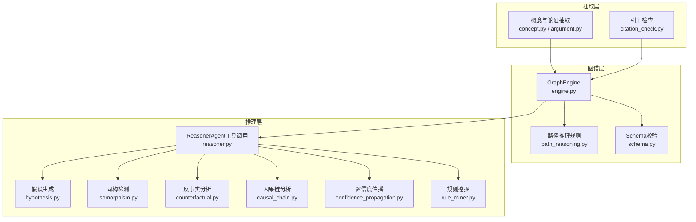

**图表来源**
- [concept.py:1-901](file://src/drbrain/extractor/concept.py#L1-L901)
- [argument.py:1-87](file://src/drbrain/extractor/argument.py#L1-L87)
- [citation_check.py:1-125](file://src/drbrain/extractor/citation_check.py#L1-L125)
- [engine.py:1-1118](file://src/drbrain/graph/engine.py#L1-L1118)
- [path_reasoning.py:1-212](file://src/drbrain/graph/path_reasoning.py#L1-L212)
- [schema.py:1-211](file://src/drbrain/validator/schema.py#L1-L211)
- [reasoner.py:1-677](file://src/drbrain/extractor/reasoner.py#L1-L677)
- [hypothesis.py:1-198](file://src/drbrain/extractor/hypothesis.py#L1-L198)
- [isomorphism.py:1-257](file://src/drbrain/extractor/isomorphism.py#L1-L257)
- [counterfactual.py:1-144](file://src/drbrain/extractor/counterfactual.py#L1-L144)
- [causal_chain.py:1-238](file://src/drbrain/extractor/causal_chain.py#L1-L238)
- [confidence_propagation.py:1-87](file://src/drbrain/extractor/confidence_propagation.py#L1-L87)
- [rule_miner.py:1-290](file://src/drbrain/extractor/rule_miner.py#L1-L290)

**章节来源**
- [engine.py:1-1118](file://src/drbrain/graph/engine.py#L1-L1118)
- [reasoner.py:1-677](file://src/drbrain/extractor/reasoner.py#L1-L677)

## 核心组件
- 知识图谱引擎（GraphEngine）：提供图构建、遍历、闭包推理、路径规则匹配、嵌入学习与预测、研究种子发现等功能。
- 推理代理（ReasonerAgent）：以工具调用循环的方式，结合图谱与树检索能力进行可解释推理，并支持KG一致性校验与双向迭代推理。
- 因果链分析：基于论证机制字段构建跨段落的因果链，支持链查找与最短路径。
- 置信度传播：对多跳推断进行不确定性衰减与多路径合并。
- 反事实分析：模拟移除节点对闭包与下游影响的量化评估。
- 同构检测：跨领域结构相似性识别，辅助知识迁移。
- 假设生成：从图模式中自动生成研究假设并评分。
- 规则挖掘：基于嵌入向量与图游走发现新的路径规则。
- Schema校验：TBox/RBox约束与对称性/传递性检测。

**章节来源**
- [engine.py:1-1118](file://src/drbrain/graph/engine.py#L1-L1118)
- [reasoner.py:1-677](file://src/drbrain/extractor/reasoner.py#L1-L677)
- [causal_chain.py:1-238](file://src/drbrain/extractor/causal_chain.py#L1-L238)
- [confidence_propagation.py:1-87](file://src/drbrain/extractor/confidence_propagation.py#L1-L87)
- [counterfactual.py:1-144](file://src/drbrain/extractor/counterfactual.py#L1-L144)
- [isomorphism.py:1-257](file://src/drbrain/extractor/isomorphism.py#L1-L257)
- [hypothesis.py:1-198](file://src/drbrain/extractor/hypothesis.py#L1-L198)
- [rule_miner.py:1-290](file://src/drbrain/extractor/rule_miner.py#L1-L290)
- [schema.py:1-211](file://src/drbrain/validator/schema.py#L1-L211)

## 架构总览
推理引擎采用“符号驱动 + 规则增强 + 多模态工具”的混合范式：先通过抽取层获得结构化三元组，经 GraphEngine 执行符号推理与路径规则，再由 ReasonerAgent 调用工具（图谱查询、树检索、文档结构/内容）进行可解释问答与假设生成；同时引入置信度传播与反事实分析保障推理稳健性。

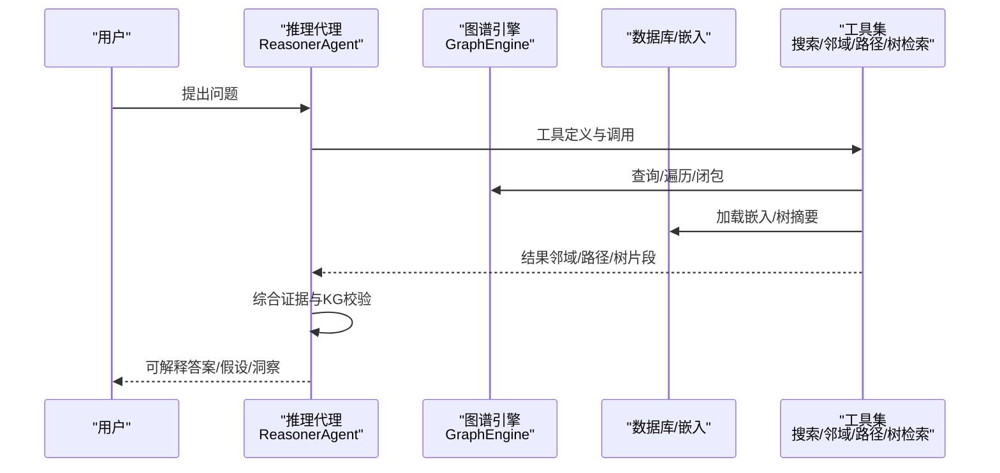

**图表来源**
- [reasoner.py:25-390](file://src/drbrain/extractor/reasoner.py#L25-L390)
- [engine.py:62-122](file://src/drbrain/graph/engine.py#L62-L122)
- [path_reasoning.py:131-153](file://src/drbrain/graph/path_reasoning.py#L131-L153)

## 详细组件分析

### 符号驱动推理与规则执行
- 图闭包与路径规则
  - 闭包规则包括：争议生成、缺口填补、间接演化、缺口到争议、作者网络、传递闭包、路径规则等。
  - 路径规则通过预定义模式在图上匹配并推断新边，如“扩展→挑战”链推导“争议链”。
- Schema校验
  - TBox：类型允许的关系集合；RBox：传递性、非对称性、反身性等约束。
  - 对称性违规检测与传递闭包补全，确保图的一致性与完备性。

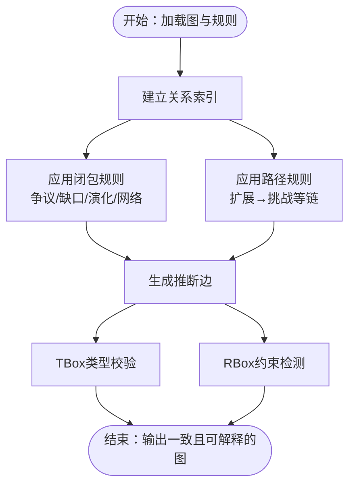

**图表来源**
- [engine.py:124-315](file://src/drbrain/graph/engine.py#L124-L315)
- [path_reasoning.py:24-55](file://src/drbrain/graph/path_reasoning.py#L24-L55)
- [schema.py:7-51](file://src/drbrain/validator/schema.py#L7-L51)

**章节来源**
- [engine.py:124-315](file://src/drbrain/graph/engine.py#L124-L315)
- [path_reasoning.py:24-55](file://src/drbrain/graph/path_reasoning.py#L24-L55)
- [schema.py:63-94](file://src/drbrain/validator/schema.py#L63-L94)

### 因果链分析
- 输入：论证单元（ExtractedArgument），要求具备机制字段（mechanism）。
- 方法：按目标概念聚合，构建有向边（目标相同即连边），DFS/BFS寻找最长链；按段落顺序排序优先连接相邻段落。
- 输出：CausalChain 序列，支持从特定概念出发的链查找与最短路径。

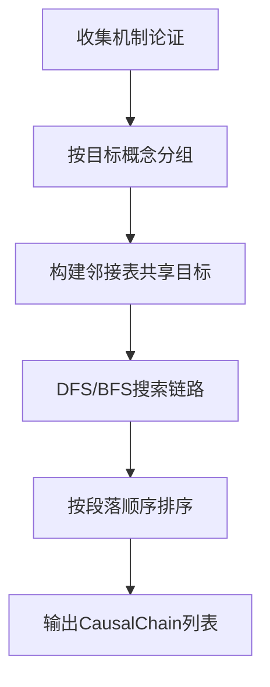

**图表来源**
- [causal_chain.py:63-150](file://src/drbrain/extractor/causal_chain.py#L63-L150)
- [causal_chain.py:153-189](file://src/drbrain/extractor/causal_chain.py#L153-L189)
- [causal_chain.py:192-237](file://src/drbrain/extractor/causal_chain.py#L192-L237)

**章节来源**
- [causal_chain.py:40-61](file://src/drbrain/extractor/causal_chain.py#L40-L61)
- [argument.py:13-38](file://src/drbrain/extractor/argument.py#L13-L38)

### 置信度传播
- 单跳衰减：按衰减因子乘积计算。
- 分段感知衰减：方法/结果段落衰减更高（保留更多），讨论/综述段落衰减更低（更易退化）。
- 多路径合并：独立路径采用概率“或”合并（1-Π(1-p_i)），提升稳健性。

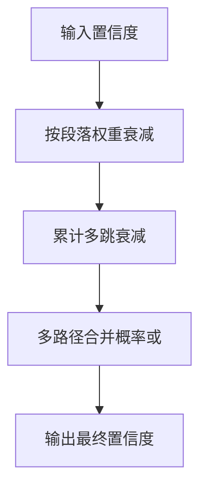

**图表来源**
- [confidence_propagation.py:31-41](file://src/drbrain/extractor/confidence_propagation.py#L31-L41)
- [confidence_propagation.py:44-64](file://src/drbrain/extractor/confidence_propagation.py#L44-L64)
- [confidence_propagation.py:67-86](file://src/drbrain/extractor/confidence_propagation.py#L67-L86)

**章节来源**
- [confidence_propagation.py:11-28](file://src/drbrain/extractor/confidence_propagation.py#L11-L28)

### 反事实分析
- 目标：评估移除某节点对图的影响，包括直接边移除数、受影响概念数、丢失的闭包推断关系。
- 方法：比较含/不含该节点的闭包差异，统计受影响节点集合与丢失关系集合。
- 关键函数：find_critical_nodes/find_critical_nodes_weighted，按边/概念/关系丢失数量加权打分。

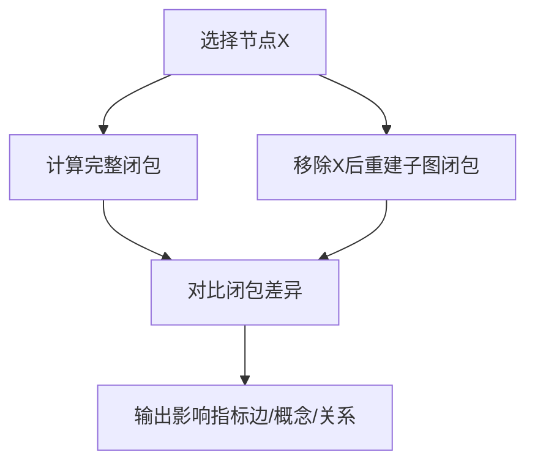

**图表来源**
- [counterfactual.py:35-78](file://src/drbrain/extractor/counterfactual.py#L35-L78)
- [counterfactual.py:81-96](file://src/drbrain/extractor/counterfactual.py#L81-L96)
- [counterfactual.py:116-143](file://src/drbrain/extractor/counterfactual.py#L116-L143)

**章节来源**
- [counterfactual.py:16-33](file://src/drbrain/extractor/counterfactual.py#L16-L33)

### 同构检测
- 目标：在不相连领域间发现结构相似的子图，提示知识迁移机会。
- 方法：节点关系签名（入/出关系计数，可带段落维度）+ Jaccard 相似度；结合标签相似度综合评分；可选 RAPTOR 摘要增强语义上下文。
- 输出：IsomorphicMapping 列表，包含源/目标域、共享结构描述、置信度及可选上下文。

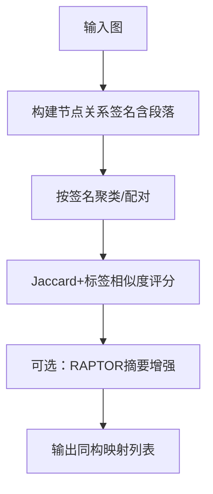

**图表来源**
- [isomorphism.py:35-65](file://src/drbrain/extractor/isomorphism.py#L35-L65)
- [isomorphism.py:111-170](file://src/drbrain/extractor/isomorphism.py#L111-L170)
- [isomorphism.py:173-256](file://src/drbrain/extractor/isomorphism.py#L173-L256)

**章节来源**
- [isomorphism.py:17-33](file://src/drbrain/extractor/isomorphism.py#L17-L33)

### 假设生成
- 来源模式：
  - 未解决缺口：建议“方法可能填补缺口”
  - 争议区：建议“需要进一步证据以解决结论”
  - 技术悬崖：建议“在约束放松条件下可复活旧方法”
- 评分：基础置信度 + 证据项加成（上限封顶），证据越多越可信。
- 可选：根据段落映射在证据中标注来源段落。

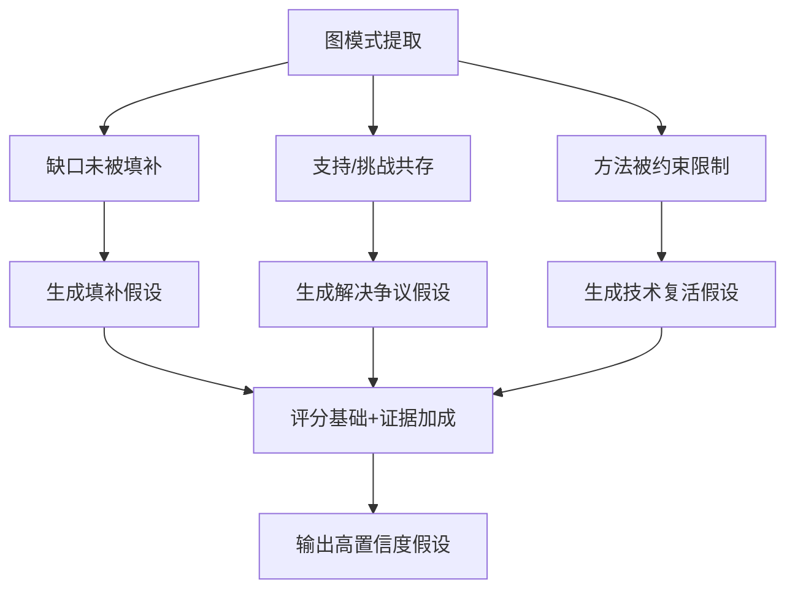

**图表来源**
- [hypothesis.py:82-197](file://src/drbrain/extractor/hypothesis.py#L82-L197)
- [hypothesis.py:37-43](file://src/drbrain/extractor/hypothesis.py#L37-L43)

**章节来源**
- [hypothesis.py:18-34](file://src/drbrain/extractor/hypothesis.py#L18-L34)

### 规则挖掘
- 嵌入驱动：利用 TransE 向量加法近似关系组合，cos_sim(r_head, r_body1 + r_body2) 作为置信度阈值筛选。
- 图游走驱动：枚举图中路径模式，统计出现频次（支持），可选将路径向量合成与关系向量比对确定头关系。
- 输出：规则列表（head、body_path、confidence、support），可用于后续路径规则应用。

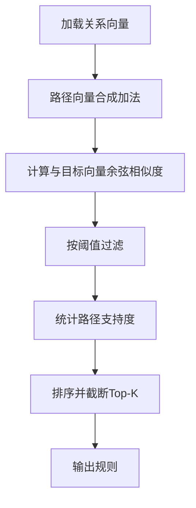

**图表来源**
- [rule_miner.py:33-105](file://src/drbrain/extractor/rule_miner.py#L33-L105)
- [rule_miner.py:137-197](file://src/drbrain/extractor/rule_miner.py#L137-L197)

**章节来源**
- [rule_miner.py:18-31](file://src/drbrain/extractor/rule_miner.py#L18-L31)

### 推理代理与工具调用
- 工具集：概念检索、邻居遍历、两点最短路径、论文树结构、章节内容、跨篇树检索、RAPTOR摘要。
- 迭代推理：ReasonerAgent 通过 LLM 逐步探索图谱与文档，生成可解释答案；KG一致性校验用于纠偏；双向迭代推理支持反复修正与反馈。
- KG校验：从假设中抽取实体提及，构建子图，进行 TBox/RBox 一致性检查与图模式识别（争议、缺口）。

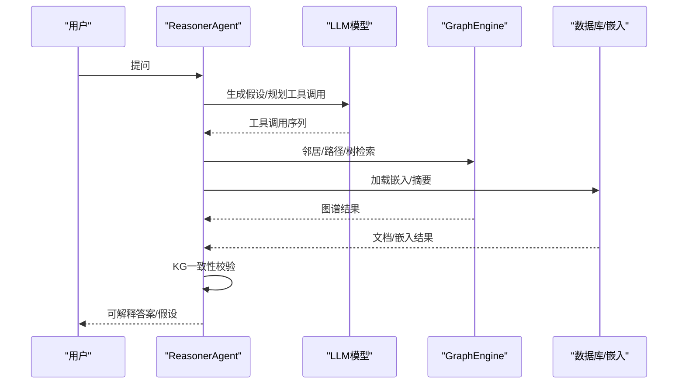

**图表来源**
- [reasoner.py:25-142](file://src/drbrain/extractor/reasoner.py#L25-L142)
- [reasoner.py:282-390](file://src/drbrain/extractor/reasoner.py#L282-L390)
- [reasoner.py:439-581](file://src/drbrain/extractor/reasoner.py#L439-L581)
- [reasoner.py:583-677](file://src/drbrain/extractor/reasoner.py#L583-L677)

**章节来源**
- [reasoner.py:16-43](file://src/drbrain/extractor/reasoner.py#L16-L43)

## 依赖分析
- 组件耦合
  - GraphEngine 是核心枢纽，被路径规则、Schema校验、推理代理广泛依赖。
  - 推理代理依赖工具定义与图谱/文档接口，形成“工具-图谱-文档”的闭环。
  - 因果链/同构/反事实/假设/规则挖掘均以 GraphEngine 为基础进行模式匹配与统计。
- 外部依赖
  - NetworkX：图存储与遍历。
  - LLM 客户端：工具调用与假设生成。
  - 嵌入系统：TransE 向量空间与相似度计算。

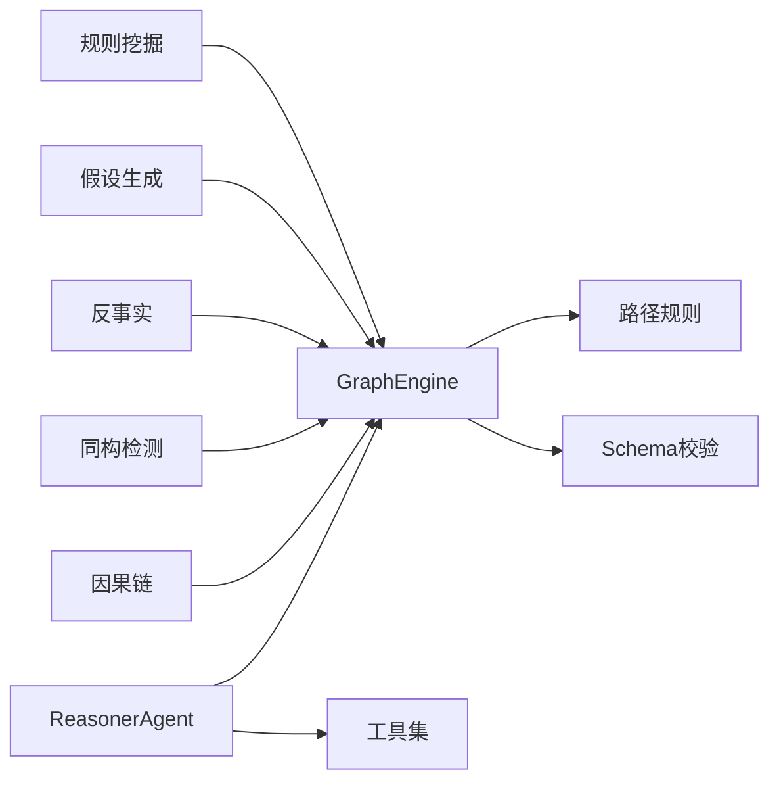

**图表来源**
- [engine.py:1-1118](file://src/drbrain/graph/engine.py#L1-L1118)
- [reasoner.py:1-677](file://src/drbrain/extractor/reasoner.py#L1-L677)
- [path_reasoning.py:1-212](file://src/drbrain/graph/path_reasoning.py#L1-L212)
- [schema.py:1-211](file://src/drbrain/validator/schema.py#L1-L211)
- [causal_chain.py:1-238](file://src/drbrain/extractor/causal_chain.py#L1-L238)
- [isomorphism.py:1-257](file://src/drbrain/extractor/isomorphism.py#L1-L257)
- [counterfactual.py:1-144](file://src/drbrain/extractor/counterfactual.py#L1-L144)
- [hypothesis.py:1-198](file://src/drbrain/extractor/hypothesis.py#L1-L198)
- [rule_miner.py:1-290](file://src/drbrain/extractor/rule_miner.py#L1-L290)

## 性能考虑
- 图遍历与闭包
  - 使用多跳遍历与子图闭包增量计算，避免全图扫描。
  - 路径规则匹配采用关系索引与递归扩展，复杂度与边密度相关。
- LLM 工具调用
  - 限制最大轮次与温度参数，控制响应长度与稳定性。
  - 工具调用结果缓存与去重，减少重复请求。
- 嵌入与相似度
  - TransE 向量加载与缓存，避免重复训练；相似度计算采用向量内积与归一化。
- 并发与限流
  - 树结构抽取与 LLM 调用采用信号量并发限制，防止资源争用。

[本节为通用指导，无需具体文件引用]

## 故障排查指南
- LLM 无法调用
  - 检查模型配置（provider/model/api_key/base_url）、超时设置与降级回退。
  - 参考：[reasoner.py:391-437](file://src/drbrain/extractor/reasoner.py#L391-L437)
- 工具调用失败
  - 校验工具定义与参数格式；确认图谱/数据库连接可用。
  - 参考：[reasoner.py:25-142](file://src/drbrain/extractor/reasoner.py#L25-L142)
- 闭包/路径规则异常
  - 检查 TBox/RBox 约束是否触发；核对关系类型与方向。
  - 参考：[schema.py:63-94](file://src/drbrain/validator/schema.py#L63-L94)，[path_reasoning.py:131-153](file://src/drbrain/graph/path_reasoning.py#L131-L153)
- 反事实分析无影响
  - 确认节点存在、闭包规则是否涉及该关系；检查段落权重与影响阈值。
  - 参考：[counterfactual.py:35-78](file://src/drbrain/extractor/counterfactual.py#L35-L78)
- 假设生成为空
  - 检查图中是否存在缺口/争议/技术悬崖模式；确认段落映射正确。
  - 参考：[hypothesis.py:82-197](file://src/drbrain/extractor/hypothesis.py#L82-L197)
- 规则挖掘无结果
  - 检查嵌入是否加载；调整阈值与Top-K；确认关系向量命名前缀。
  - 参考：[rule_miner.py:56-105](file://src/drbrain/extractor/rule_miner.py#L56-L105)

**章节来源**
- [reasoner.py:391-437](file://src/drbrain/extractor/reasoner.py#L391-L437)
- [schema.py:140-190](file://src/drbrain/validator/schema.py#L140-L190)
- [path_reasoning.py:131-153](file://src/drbrain/graph/path_reasoning.py#L131-L153)
- [counterfactual.py:35-78](file://src/drbrain/extractor/counterfactual.py#L35-L78)
- [hypothesis.py:82-197](file://src/drbrain/extractor/hypothesis.py#L82-L197)
- [rule_miner.py:56-105](file://src/drbrain/extractor/rule_miner.py#L56-L105)

## 结论
DrBrain 推理引擎以 GraphEngine 为核心，融合符号驱动规则、路径规则、Schema 校验与 LLM 工具调用，形成从文本抽取到知识图谱再到可解释推理的完整流水线。因果链、置信度传播、反事实、同构检测与假设生成等模块协同工作，既保证了推理的可解释性，又提升了稳健性与实用性。通过嵌入驱动的规则挖掘与段落感知的置信度建模，系统能够自动发现隐含知识并评估其可靠性。

[本节为总结性内容，无需具体文件引用]

## 附录

### 推理示例与结果解释
- 示例场景：某缺口长期未被解决，且存在多个方法与其相关但未形成闭环。
- 推理流程：
  1) 概念抽取与论证解析，构建初始图谱。
  2) GraphEngine 执行闭包与路径规则，识别“缺口未填补”模式。
  3) ReasonerAgent 通过工具检索相关段落与摘要，生成可解释答案。
  4) KG一致性校验确保假设与图谱一致，必要时进行双向迭代修正。
- 结果解释：
  - 假设生成模块给出“方法可能填补缺口”的高置信度建议，并标注证据来源段落。
  - 置信度传播体现多路径支撑与段落衰减对最终置信度的影响。
  - 反事实分析指出关键方法节点的移除将导致哪些闭包关系消失，帮助识别脆弱点。

[本节为概念性示例，无需具体文件引用]

### 推理质量评估与结果验证
- 内部一致性
  - TBox/RBox 校验：类型与关系合法性检查。
  - 传递闭包补全：自动补齐缺失的传递关系。
  - 对称性违规检测：识别相互关系同时存在的矛盾。
- 外部一致性
  - KG一致性校验：从假设中抽取实体，构建子图，检查TBox/RBox与图模式（争议/缺口）。
  - 反事实分析：量化关键节点移除的影响，评估图谱稳定性。
- 可解释性
  - 工具调用日志与路径追踪，便于复现与审计。
  - 假设评分与证据来源标注，支持人工复核。

**章节来源**
- [schema.py:140-210](file://src/drbrain/validator/schema.py#L140-L210)
- [reasoner.py:439-581](file://src/drbrain/extractor/reasoner.py#L439-L581)
- [counterfactual.py:35-78](file://src/drbrain/extractor/counterfactual.py#L35-L78)