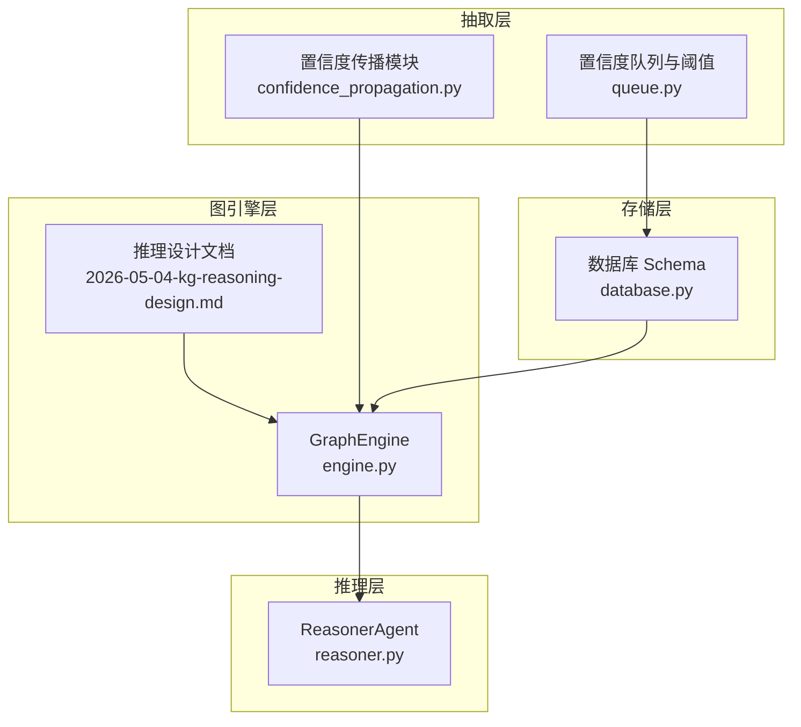
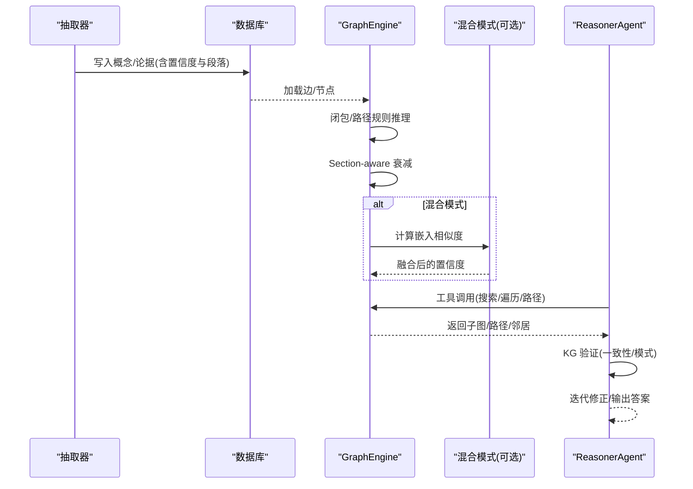
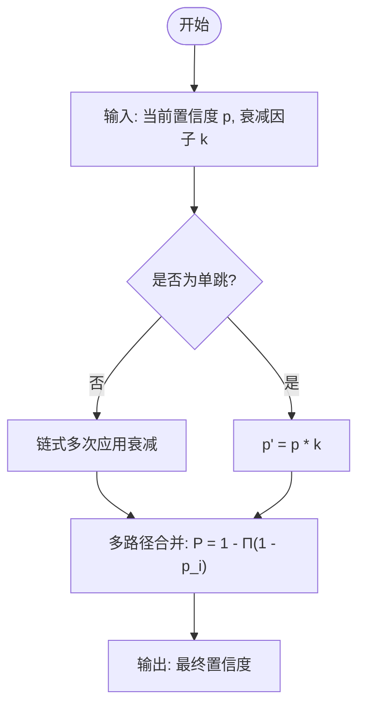
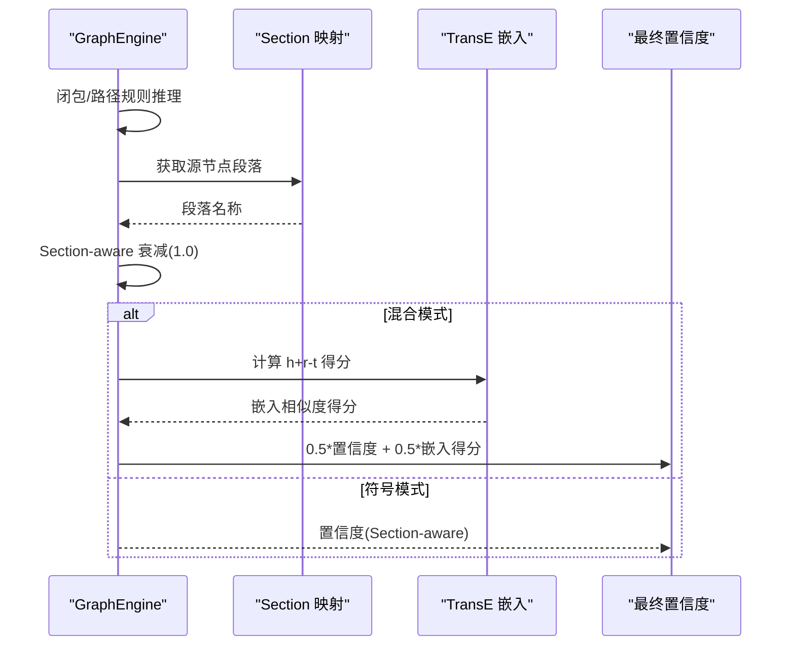
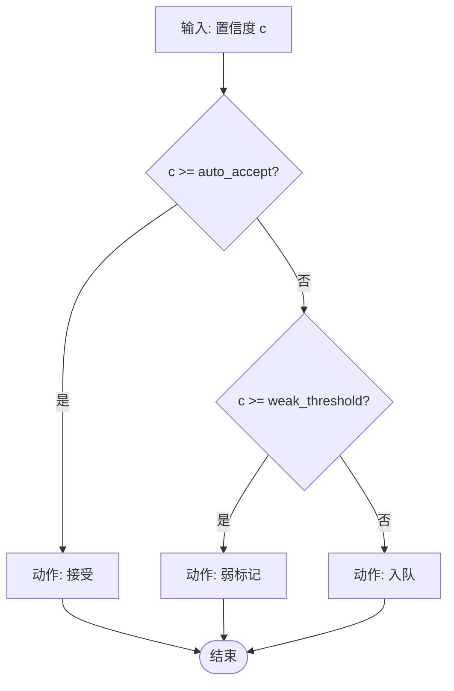
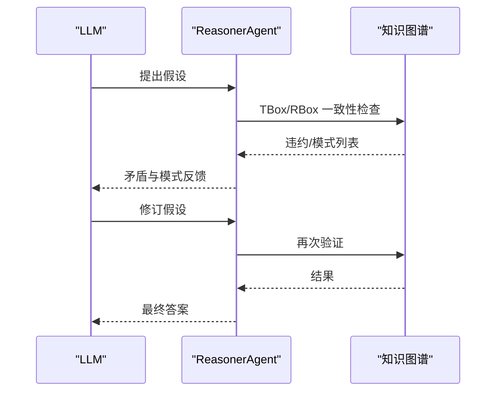
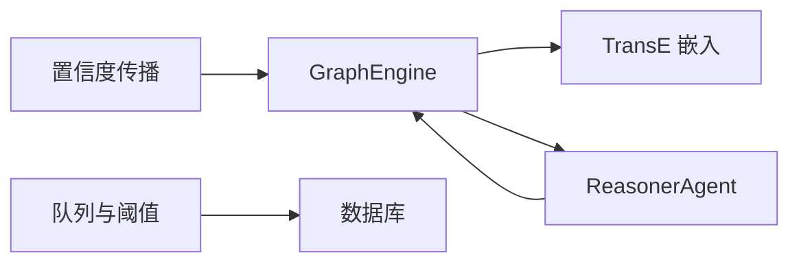

# 置信度传播

<cite>
**本文引用的文件**
- [confidence_propagation.py](file://src/drbrain/extractor/confidence_propagation.py)
- [test_confidence_propagation.py](file://tests/test_confidence_propagation.py)
- [engine.py](file://src/drbrain/graph/engine.py)
- [reasoner.py](file://src/drbrain/extractor/reasoner.py)
- [queue.py](file://src/drbrain/extractor/queue.py)
- [database.py](file://src/drbrain/storage/database.py)
- [exceptions.py](file://src/drbrain/exceptions.py)
- [2026-05-04-kg-reasoning-design.md](file://docs/superpowers/specs/2026-05-04-kg-reasoning-design.md)
- [extract_concepts.txt](file://prompts/extract_concepts.txt)
</cite>

## 目录
1. [简介](#简介)
2. [项目结构](#项目结构)
3. [核心组件](#核心组件)
4. [架构总览](#架构总览)
5. [详细组件分析](#详细组件分析)
6. [依赖分析](#依赖分析)
7. [性能考虑](#性能考虑)
8. [故障排查指南](#故障排查指南)
9. [结论](#结论)
10. [附录](#附录)

## 简介
本文件面向 DrBrain 的置信度传播系统，系统性阐述其理论基础与实现细节，覆盖以下关键点：
- 置信度在知识图谱中的传播与更新：单跳衰减、多跳累积衰减、多路径合并（概率 OR）。
- 不同证据类型的置信度衰减与增强策略：基于段落类型（Section-aware）的差异化衰减；嵌入相似度与逻辑闭包的融合加权。
- 传播路径与收敛条件：通过闭包规则与路径规则生成新边，结合阈值与一致性检测进行收敛。
- 具体示例：从原始证据到最终置信度的计算流程。
- 推理质量评估与结果验证：KG 验证、模式检测、异常处理与阈值配置。
- 置信度阈值设置与异常处理机制：路由、共识检测、错误分类与降级策略。

## 项目结构
置信度传播贯穿抽取、存储、图引擎与推理四个层面：
- 抽取层：置信度传播函数与多路径合并。
- 存储层：概念与边的置信度字段，队列与阈值控制。
- 图引擎层：闭包规则、路径规则、Section-aware 衰减、嵌入融合。
- 推理层：LLM-KG 双向验证与模式识别。

图表来源
- [confidence_propagation.py:1-87](file://src/drbrain/extractor/confidence_propagation.py#L1-L87)
- [queue.py:1-45](file://src/drbrain/extractor/queue.py#L1-L45)
- [database.py:36-71](file://src/drbrain/storage/database.py#L36-L71)
- [engine.py:124-315](file://src/drbrain/graph/engine.py#L124-L315)
- [2026-05-04-kg-reasoning-design.md:63-87](file://docs/superpowers/specs/2026-05-04-kg-reasoning-design.md#L63-L87)
- [reasoner.py:1-677](file://src/drbrain/extractor/reasoner.py#L1-L677)

章节来源
- [confidence_propagation.py:1-87](file://src/drbrain/extractor/confidence_propagation.py#L1-L87)
- [engine.py:124-315](file://src/drbrain/graph/engine.py#L124-L315)
- [queue.py:1-45](file://src/drbrain/extractor/queue.py#L1-L45)
- [database.py:36-71](file://src/drbrain/storage/database.py#L36-L71)
- [2026-05-04-kg-reasoning-design.md:63-87](file://docs/superpowers/specs/2026-05-04-kg-reasoning-design.md#L63-L87)
- [reasoner.py:1-677](file://src/drbrain/extractor/reasoner.py#L1-L677)

## 核心组件
- 置信度传播函数族
  - 单跳衰减：按固定或分段衰减因子乘法衰减。
  - 多路径合并：使用概率 OR 规则合并独立路径置信度。
- 图引擎闭包与路径规则
  - 基于规则生成新边，赋予初始置信度（1.0 或 Section-aware 衰减）。
  - 混合模式：以嵌入相似度对置信度进行二次加权。
- 队列与阈值
  - 基于置信度的路由策略：高置信度直接接受、中等置信度弱标记、低置信度进入队列。
  - 共识检测：跨论文的置信度平均与数量阈值判断。
- 推理与验证
  - LLM-KG 双向验证：先假设后校验，迭代修正。
  - 模式检测：争议区、未解决缺口、技术悬崖等种子模式。

章节来源
- [confidence_propagation.py:31-86](file://src/drbrain/extractor/confidence_propagation.py#L31-L86)
- [engine.py:124-315](file://src/drbrain/graph/engine.py#L124-L315)
- [queue.py:10-45](file://src/drbrain/extractor/queue.py#L10-L45)
- [reasoner.py:439-677](file://src/drbrain/extractor/reasoner.py#L439-L677)

## 架构总览
置信度传播在 DrBrain 中的端到端流程如下：
- 原始证据（概念/论据）经抽取器标注置信度与段落信息。
- 图引擎执行闭包与路径规则，为新边赋初值置信度（Section-aware 衰减）。
- 在混合模式下，嵌入相似度对置信度进行加权融合。
- LLM 推理阶段调用工具探索图谱，KG 验证假设的一致性与模式。
- 队列与阈值用于质量门控与人工复核。

图表来源
- [engine.py:124-315](file://src/drbrain/graph/engine.py#L124-L315)
- [2026-05-04-kg-reasoning-design.md:63-87](file://docs/superpowers/specs/2026-05-04-kg-reasoning-design.md#L63-L87)
- [reasoner.py:282-390](file://src/drbrain/extractor/reasoner.py#L282-L390)

## 详细组件分析

### 置信度传播函数族
- 单跳衰减
  - 输入：当前置信度与衰减因子。
  - 输出：衰减后的置信度。
  - 特性：乘法衰减，支持自定义衰减因子。
- 分段落衰减（Section-aware）
  - 不同段落类型对应不同衰减因子，方法/结果类更“稳健”，讨论/相关工作类更“推测性强”。
  - 未知段落回退至默认衰减因子。
- 多路径合并（概率 OR）
  - 将多个独立路径的置信度合并为更高置信度，体现“多源佐证”的增益效应。
  - 空路径返回 0.0。

图表来源
- [confidence_propagation.py:31-86](file://src/drbrain/extractor/confidence_propagation.py#L31-L86)

章节来源
- [confidence_propagation.py:11-28](file://src/drbrain/extractor/confidence_propagation.py#L11-L28)
- [confidence_propagation.py:31-86](file://src/drbrain/extractor/confidence_propagation.py#L31-L86)
- [test_confidence_propagation.py:12-100](file://tests/test_confidence_propagation.py#L12-L100)

### 图引擎中的置信度传播与融合
- 闭包与路径规则
  - 生成新边并赋予初始置信度（1.0）。
  - 若提供段落映射，使用 Section-aware 衰减为新边赋值。
- 混合模式（Hybrid）
  - 使用 TransE 嵌入评分，将嵌入相似度转换为 [0,1] 区间得分。
  - 对现有置信度与嵌入得分做加权平均（示例采用 0.5:0.5 权重），得到最终置信度。
- 收敛与统计
  - 统计各关系类型的推断数量，便于监控与调试。

图表来源
- [engine.py:281-307](file://src/drbrain/graph/engine.py#L281-L307)
- [2026-05-04-kg-reasoning-design.md:63-87](file://docs/superpowers/specs/2026-05-04-kg-reasoning-design.md#L63-L87)

章节来源
- [engine.py:124-315](file://src/drbrain/graph/engine.py#L124-L315)
- [2026-05-04-kg-reasoning-design.md:63-87](file://docs/superpowers/specs/2026-05-04-kg-reasoning-design.md#L63-L87)

### 队列与阈值：置信度门控与共识检测
- 路由策略
  - 置信度 ≥ auto_accept：直接接受。
  - 置信度 ∈ [weak_threshold, auto_accept)：标记为弱。
  - 置信度 < weak_threshold：进入队列等待人工复核。
- 共识检测
  - 跨论文的同一标签需满足“论文数量阈值 + 平均置信度阈值”。

图表来源
- [queue.py:10-32](file://src/drbrain/extractor/queue.py#L10-L32)

章节来源
- [queue.py:10-45](file://src/drbrain/extractor/queue.py#L10-L45)
- [database.py:105-113](file://src/drbrain/storage/database.py#L105-L113)

### 推理质量评估与结果验证
- KG 验证
  - TBox：检查关系是否与概念类型匹配。
  - RBox：检查反身性/对称性等约束。
  - 图模式：识别争议区、缺口等。
- LLM-KG 双向推理
  - LLM 提出假设，KG 校验并反馈矛盾与模式，LLM 再次修正，直至一致或达到轮次上限。

图表来源
- [reasoner.py:439-677](file://src/drbrain/extractor/reasoner.py#L439-L677)

章节来源
- [reasoner.py:439-677](file://src/drbrain/extractor/reasoner.py#L439-L677)

## 依赖分析
- 模块耦合
  - 置信度传播模块被图引擎闭包与混合模式调用，耦合度低、内聚度高。
  - 队列模块依赖数据库表结构，提供门控与人工复核入口。
  - 推理模块依赖图引擎工具集，形成“工具-图谱-验证”的闭环。
- 外部依赖
  - 嵌入模型（TransE）训练与评分接口。
  - LLM 客户端（如 litellm）用于双向推理。

图表来源
- [confidence_propagation.py:1-87](file://src/drbrain/extractor/confidence_propagation.py#L1-L87)
- [engine.py:292-307](file://src/drbrain/graph/engine.py#L292-L307)
- [queue.py:1-45](file://src/drbrain/extractor/queue.py#L1-L45)
- [reasoner.py:1-677](file://src/drbrain/extractor/reasoner.py#L1-L677)

章节来源
- [engine.py:292-307](file://src/drbrain/graph/engine.py#L292-L307)
- [reasoner.py:1-677](file://src/drbrain/extractor/reasoner.py#L1-L677)

## 性能考虑
- 时间复杂度
  - 闭包与路径规则：与边数线性相关，通常 O(E)。
  - Section-aware 衰减：常数时间映射查找。
  - 多路径合并：与路径数线性相关。
  - 混合模式：嵌入评分引入额外开销，但可缓存 TransE 实例。
- 空间复杂度
  - 嵌入向量与 TransE 缓存占用内存，可通过持久化与增量训练优化。
- 收敛与稳定性
  - 通过阈值与共识检测避免噪声传播。
  - 双向推理减少不一致假设的传播。

## 故障排查指南
- 常见异常与处理
  - API 错误与限流：统一捕获并降级，避免中断主流程。
  - 存储错误：检查数据库连接与外键约束，确保 schema 版本迁移完成。
  - 推理错误：记录超时与工具调用失败，返回可读提示。
- 置信度异常
  - 队列堆积：检查阈值设置是否过严，或共识阈值过高。
  - 置信度塌缩：关注“置信度塌缩”种子模式，定位段落证据变化。
- 验证失败
  - TBox/RBox 违约：修正关系类型或删除冲突边。
  - 模式误报：调整阈值或增加人工复核环节。

章节来源
- [exceptions.py:1-28](file://src/drbrain/exceptions.py#L1-L28)
- [engine.py:574-622](file://src/drbrain/graph/engine.py#L574-L622)
- [reasoner.py:384-389](file://src/drbrain/extractor/reasoner.py#L384-L389)

## 结论
DrBrain 的置信度传播体系以“单跳衰减 + 多路径合并 + Section-aware 衰减 + 嵌入融合”为核心，结合队列阈值与 KG 验证，形成从证据到结论的稳健推理闭环。通过混合模式与双向推理，系统在不确定性环境下仍能产出高质量、可解释的图谱结论。

## 附录

### 置信度传播示例（从原始证据到最终置信度）
- 步骤 1：抽取器为“方法 A → 解决问题 B”标注置信度 0.9，并标注段落“Methods”。
- 步骤 2：图引擎闭包生成新边“方法 A → 方法 C”（若存在间接演化规则），初始置信度 1.0。
- 步骤 3：Section-aware 衰减：因“Methods”段落较稳健，衰减因子较高，得到 1.0 × 0.90 = 0.90。
- 步骤 4：混合模式（可选）：TransE 嵌入相似度得分为 0.8，最终置信度 = 0.5×0.90 + 0.5×0.8 = 0.85。
- 步骤 5：队列与阈值：若置信度低于 0.7，则进入队列等待人工复核；若高于 0.9 则直接接受。

章节来源
- [confidence_propagation.py:44-64](file://src/drbrain/extractor/confidence_propagation.py#L44-L64)
- [engine.py:281-307](file://src/drbrain/graph/engine.py#L281-L307)
- [queue.py:10-32](file://src/drbrain/extractor/queue.py#L10-L32)

### 置信度阈值设置建议
- auto_accept：建议 0.9，确保高置信度直接入库。
- weak_threshold：建议 0.7，平衡自动化与人工复核。
- 共识阈值（check_consensus）：论文数量 ≥ 3，平均置信度 ≥ 0.8。
- 段落衰减因子：依据段落类型选择，方法/结果类更高，讨论/相关工作类更低。

章节来源
- [queue.py:16-17](file://src/drbrain/extractor/queue.py#L16-L17)
- [queue.py:34-45](file://src/drbrain/extractor/queue.py#L34-L45)
- [confidence_propagation.py:14-28](file://src/drbrain/extractor/confidence_propagation.py#L14-L28)

### 推理质量评估与结果验证方法
- KG 验证：TBox 关系合法性、RBox 对称/反身性、争议与缺口模式。
- 双向推理：LLM 提出假设 → KG 校验 → 反馈修正 → 再验证。
- 种子模式：技术悬崖、跨域同构、置信度塌缩等，辅助发现研究机会与风险。

章节来源
- [reasoner.py:439-677](file://src/drbrain/extractor/reasoner.py#L439-L677)
- [engine.py:354-454](file://src/drbrain/graph/engine.py#L354-L454)