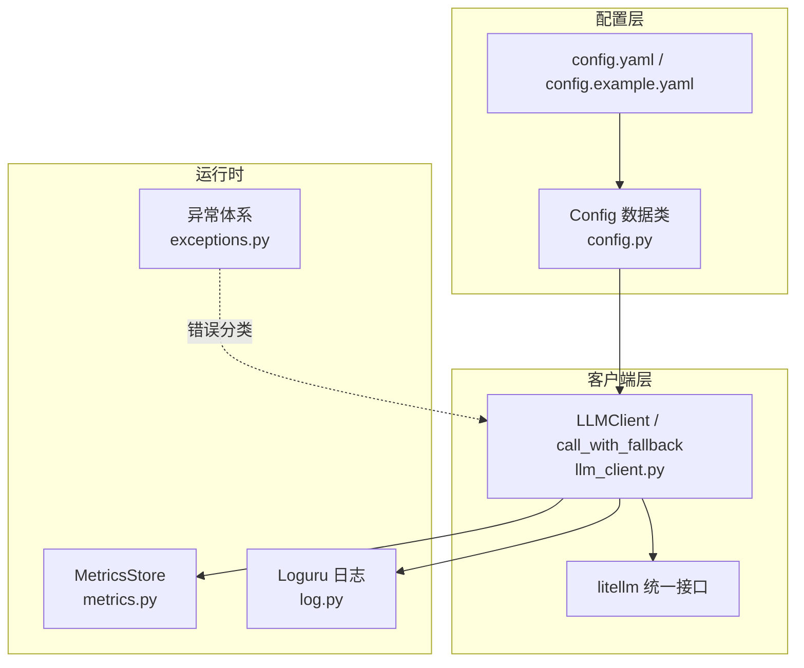
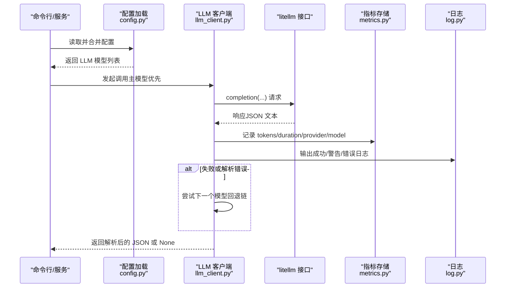
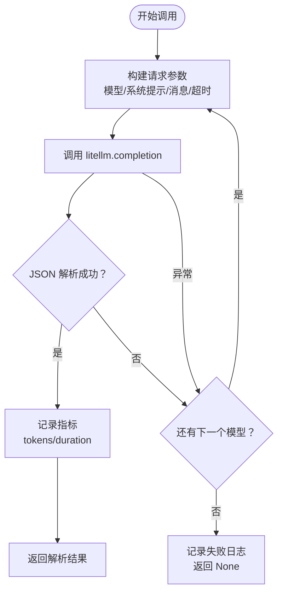
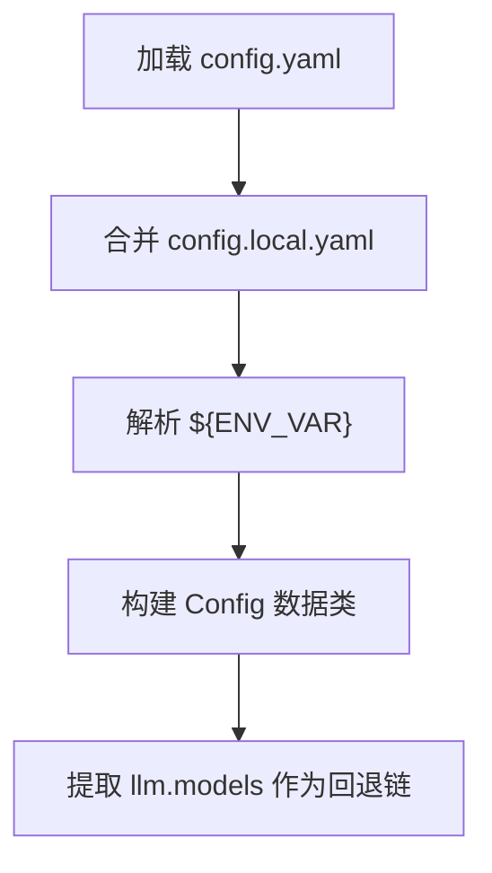
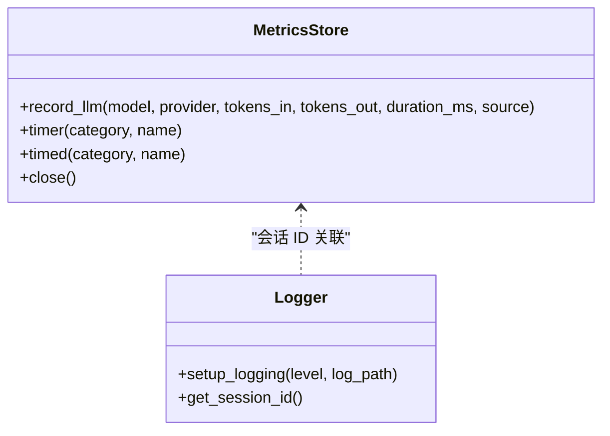
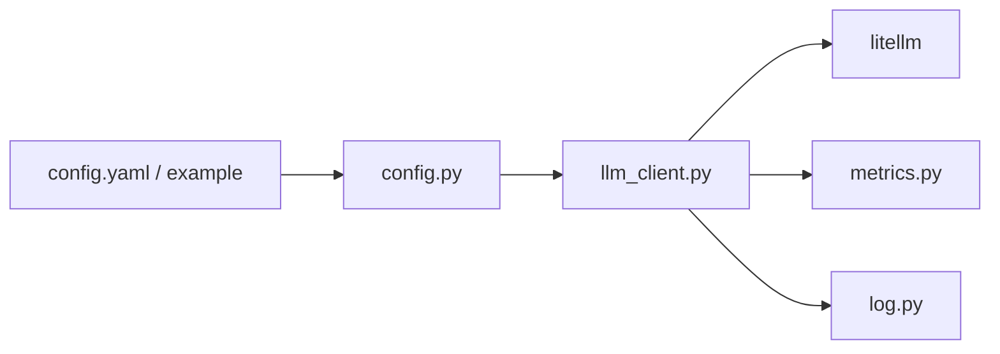

# LLM API 问题

<cite>
**本文引用的文件**
- [llm_client.py](file://src/drbrain/extractor/llm_client.py)
- [config.py](file://src/drbrain/config.py)
- [config.yaml](file://config.yaml)
- [config.example.yaml](file://config.example.yaml)
- [exceptions.py](file://src/drbrain/exceptions.py)
- [metrics.py](file://src/drbrain/metrics.py)
- [log.py](file://src/drbrain/log.py)
- [troubleshooting.md](file://docs/troubleshooting.md)
- [configuration.md](file://docs/configuration.md)
- [test_llm_client.py](file://tests/test_llm_client.py)
- [README.md](file://README.md)
</cite>

## 目录
1. [简介](#简介)
2. [项目结构](#项目结构)
3. [核心组件](#核心组件)
4. [架构总览](#架构总览)
5. [详细组件分析](#详细组件分析)
6. [依赖分析](#依赖分析)
7. [性能考虑](#性能考虑)
8. [故障排除指南](#故障排除指南)
9. [结论](#结论)

## 简介
本指南聚焦 DrBrain 的 LLM API 使用与故障排除，覆盖模型连接失败、超时、速率限制、JSON 解析错误等常见问题，并提供针对不同提供商（如 OpenAI、Anthropic、DeepSeek、本地 Ollama 等）的排查步骤与修复建议。同时给出并发控制、网络连通性检查、模型回退链、API 密钥配置、性能优化与稳定性改进建议。

## 项目结构
围绕 LLM 调用与配置的关键文件组织如下：
- 配置层：通过数据类与 YAML 合并加载，支持环境变量注入与本地覆盖
- 客户端层：基于 litellm 的统一调用封装，内置回退链与指标记录
- 异常层：自定义异常类型，便于区分配置、外部 API、速率限制等错误
- 指标与日志：SQLite 持久化指标表与会话级日志，便于定位耗时与用量

图表来源
- [config.py:182-244](file://src/drbrain/config.py#L182-L244)
- [config.yaml:7-13](file://config.yaml#L7-L13)
- [config.example.yaml:12-66](file://config.example.yaml#L12-L66)
- [llm_client.py:12-154](file://src/drbrain/extractor/llm_client.py#L12-L154)
- [metrics.py:49-203](file://src/drbrain/metrics.py#L49-L203)
- [log.py:32-68](file://src/drbrain/log.py#L32-L68)
- [exceptions.py:6-28](file://src/drbrain/exceptions.py#L6-L28)

章节来源
- [config.py:182-244](file://src/drbrain/config.py#L182-L244)
- [config.yaml:7-13](file://config.yaml#L7-L13)
- [config.example.yaml:12-66](file://config.example.yaml#L12-L66)
- [llm_client.py:12-154](file://src/drbrain/extractor/llm_client.py#L12-L154)
- [metrics.py:49-203](file://src/drbrain/metrics.py#L49-L203)
- [log.py:32-68](file://src/drbrain/log.py#L32-L68)
- [exceptions.py:6-28](file://src/drbrain/exceptions.py#L6-L28)

## 核心组件
- LLM 客户端与回退链
  - 支持按顺序尝试多个模型配置，自动回退到下一个模型
  - 统一构建请求参数（模型名、系统提示、消息、响应格式、温度、最大令牌、超时）
  - 记录使用指标（输入/输出令牌数、耗时、提供商、模型名）
- 配置加载与合并
  - 三源合并：基础 YAML → 本地覆盖 → 环境变量
  - LLM 模型列表作为回退链，首项为主模型
- 指标与日志
  - SQLite WAL 模式持久化 LLM 调用记录
  - 会话级 ID 用于关联日志与指标
- 异常体系
  - 分层异常类型，便于区分配置错误、外部 API 错误、速率限制等

章节来源
- [llm_client.py:12-154](file://src/drbrain/extractor/llm_client.py#L12-L154)
- [config.py:182-244](file://src/drbrain/config.py#L182-L244)
- [metrics.py:49-203](file://src/drbrain/metrics.py#L49-L203)
- [log.py:18-68](file://src/drbrain/log.py#L18-L68)
- [exceptions.py:6-28](file://src/drbrain/exceptions.py#L6-L28)

## 架构总览
下图展示 LLM 调用在 DrBrain 中的端到端流程：从配置加载到回退链执行、指标记录与日志输出。

图表来源
- [llm_client.py:66-114](file://src/drbrain/extractor/llm_client.py#L66-L114)
- [metrics.py:74-96](file://src/drbrain/metrics.py#L74-L96)
- [log.py:32-68](file://src/drbrain/log.py#L32-L68)

## 详细组件分析

### LLM 客户端与回退链
- 关键点
  - 回退策略：按顺序尝试模型，遇到异常即切换到下一个；全部失败返回空
  - 参数构建：统一设置响应格式为 JSON 对象、较低温度、固定超时
  - 指标记录：捕获使用统计并写入 SQLite
  - 日志记录：成功/失败/耗时均有日志输出
- 并发与异步
  - 提供同步与异步版本，异步版本同样遵循回退链逻辑
- 测试验证
  - 单模型成功、首个模型失败回退至第二个、全部失败返回空的行为均被测试覆盖

图表来源
- [llm_client.py:66-114](file://src/drbrain/extractor/llm_client.py#L66-L114)
- [metrics.py:74-96](file://src/drbrain/metrics.py#L74-L96)

章节来源
- [llm_client.py:12-154](file://src/drbrain/extractor/llm_client.py#L12-L154)
- [test_llm_client.py:6-67](file://tests/test_llm_client.py#L6-L67)

### 配置加载与环境变量解析
- 配置来源与优先级
  - 基础 YAML（受控于仓库）→ 本地覆盖（不提交到仓库）→ 环境变量（${VAR} 替换）
- LLM 模型配置
  - models 列表即回退链；首项为主模型
  - 支持 provider、model、api_key、base_url 等字段
- 示例模板
  - config.example.yaml 提供多提供商模板（OpenAI、Anthropic、DeepSeek、本地 Ollama 等）

图表来源
- [config.py:195-244](file://src/drbrain/config.py#L195-L244)
- [config.yaml:7-13](file://config.yaml#L7-L13)
- [config.example.yaml:12-66](file://config.example.yaml#L12-L66)

章节来源
- [config.py:195-244](file://src/drbrain/config.py#L195-L244)
- [config.yaml:7-13](file://config.yaml#L7-L13)
- [config.example.yaml:12-66](file://config.example.yaml#L12-L66)

### 指标与日志
- 指标
  - 表结构包含模型、提供商、输入/输出令牌、耗时、来源、会话 ID 等
  - WAL 模式提升并发写入稳定性
- 日志
  - 会话 ID 绑定，便于跨模块关联
  - 文件轮转与标准错误输出分离

图表来源
- [metrics.py:49-203](file://src/drbrain/metrics.py#L49-L203)
- [log.py:18-68](file://src/drbrain/log.py#L18-L68)

章节来源
- [metrics.py:49-203](file://src/drbrain/metrics.py#L49-L203)
- [log.py:18-68](file://src/drbrain/log.py#L18-L68)

## 依赖分析
- 组件耦合
  - LLM 客户端依赖 litellm 进行统一调用
  - 指标记录依赖 SQLite，避免阻塞主流程
  - 日志与指标共享会话 ID，便于追踪
- 外部依赖
  - litellm：支持多提供商（OpenAI、Anthropic、DeepSeek、Ollama 等）
  - loguru：结构化日志与文件轮转
  - sqlite3：WAL 模式持久化指标

图表来源
- [llm_client.py:8-154](file://src/drbrain/extractor/llm_client.py#L8-L154)
- [metrics.py:49-203](file://src/drbrain/metrics.py#L49-L203)
- [log.py:32-68](file://src/drbrain/log.py#L32-L68)
- [config.py:182-244](file://src/drbrain/config.py#L182-L244)

章节来源
- [llm_client.py:8-154](file://src/drbrain/extractor/llm_client.py#L8-L154)
- [metrics.py:49-203](file://src/drbrain/metrics.py#L49-L203)
- [log.py:32-68](file://src/drbrain/log.py#L32-L68)
- [config.py:182-244](file://src/drbrain/config.py#L182-L244)

## 性能考虑
- 超时与并发
  - 默认超时为 60 秒；可通过调整模型配置中的超时参数缓解长上下文场景
  - 并发控制：概念抽取阶段默认最大并发为 10；翻译等模块也采用线程池并发，可根据资源调整
- 指标与监控
  - 通过指标表查看平均耗时、令牌用量，识别慢模型或高成本调用
- 模型选择
  - 在需要稳定 JSON 输出时，优先选择云端模型；本地模型可作为回退或低成本替代

章节来源
- [llm_client.py:37-38](file://src/drbrain/extractor/llm_client.py#L37-L38)
- [config.yaml:46](file://config.yaml#L46)
- [metrics.py:74-96](file://src/drbrain/metrics.py#L74-L96)

## 故障排除指南

### 通用排查步骤
- 使用健康检查命令验证环境与配置
- 检查配置文件与环境变量是否正确加载
- 查看应用日志与指标数据库，定位耗时与失败原因

章节来源
- [troubleshooting.md:67-72](file://docs/troubleshooting.md#L67-L72)
- [log.py:32-68](file://src/drbrain/log.py#L32-L68)
- [metrics.py:14-42](file://src/drbrain/metrics.py#L14-L42)

### 模型连接失败
- 症状
  - 所有模型尝试后仍失败，返回空
- 可能原因
  - API 密钥未设置或无效
  - 网络无法访问提供商基础地址
  - 配置中 provider/model 不匹配或不存在
- 修复建议
  - 确认配置中各模型的 api_key 与 base_url 设置
  - 使用交互式 setup 或示例模板补充缺失字段
  - 逐个尝试回退链中的模型，确认网络可达性

章节来源
- [troubleshooting.md:63-72](file://docs/troubleshooting.md#L63-L72)
- [config.example.yaml:12-66](file://config.example.yaml#L12-L66)
- [llm_client.py:66-114](file://src/drbrain/extractor/llm_client.py#L66-L114)

### 超时问题
- 症状
  - 调用超时，日志显示耗时接近默认超时值
- 可能原因
  - 上下文过长、网络延迟高、模型响应慢
- 修复建议
  - 增加模型配置中的超时参数
  - 减少提示词长度或拆分任务
  - 降低并发或切换到更快的模型

章节来源
- [llm_client.py:37-38](file://src/drbrain/extractor/llm_client.py#L37-L38)
- [troubleshooting.md:71](file://docs/troubleshooting.md#L71)

### 速率限制（429）
- 症状
  - 外部 API 返回 429
- 可能原因
  - 外部服务限速（如 Semantic Scholar）
  - 并发过高导致触发限流
- 修复建议
  - 增加回退链中的模型数量
  - 降低并发（如减少概念抽取阶段的最大并发）
  - 为外部服务配置更高限额的密钥或令牌

章节来源
- [troubleshooting.md:73-78](file://docs/troubleshooting.md#L73-L78)
- [config.yaml:46](file://config.yaml#L46)
- [config.yaml:63](file://config.yaml#L63)

### JSON 解析错误
- 症状
  - 模型返回非 JSON 文本，回退链自动切换下一个模型
- 可能原因
  - 某些模型不稳定或对 JSON 输出要求敏感
- 修复建议
  - 优先使用更稳定的云端模型
  - 若所有模型均出现解析错误，检查提示词格式与系统提示

章节来源
- [troubleshooting.md:79-84](file://docs/troubleshooting.md#L79-L84)
- [llm_client.py:84-86](file://src/drbrain/extractor/llm_client.py#L84-L86)

### API 密钥配置
- 建议
  - 使用环境变量占位符 ${ENV_VAR}，在本地覆盖文件中设置实际值
  - 通过交互式 setup 填写密钥，确保生成 config.local.yaml
- 验证
  - 使用健康检查命令确认密钥有效

章节来源
- [config.yaml:11](file://config.yaml#L11)
- [config.example.yaml:17](file://config.example.yaml#L17)
- [troubleshooting.md:69](file://docs/troubleshooting.md#L69)

### 网络连接检查
- 建议
  - 逐个验证各模型的 base_url 是否可达
  - 如使用代理或自托管服务，请确保端口与路径正确
- 验证
  - 通过回退链逐一尝试，观察日志中的失败模型

章节来源
- [config.example.yaml:55-66](file://config.example.yaml#L55-L66)
- [llm_client.py:100-114](file://src/drbrain/extractor/llm_client.py#L100-L114)

### 模型回退机制
- 建议
  - 将最可靠的云端模型置于首位，本地或备用模型作为回退
  - 根据业务需求调整回退顺序与数量
- 验证
  - 观察日志中的回退次数与耗时，评估回退效果

章节来源
- [config.example.yaml:10](file://config.example.yaml#L10)
- [llm_client.py:74-89](file://src/drbrain/extractor/llm_client.py#L74-L89)

### 并发控制
- 建议
  - 控制概念抽取阶段的最大并发（默认 10），避免触发外部服务限流
  - 对翻译等模块根据资源情况调整线程池大小
- 验证
  - 通过指标表观察并发峰值与平均耗时

章节来源
- [config.yaml:46](file://config.yaml#L46)
- [metrics.py:74-96](file://src/drbrain/metrics.py#L74-L96)

### 不同提供商的特定问题与修复
- OpenAI
  - 确保 api_key 正确，必要时启用 base_url 指向官方网关
- Anthropic（Claude）
  - 检查 api_key 有效性与模型名称
- OpenAI 兼容提供商（DeepSeek、Zhipu、Bailian、Moonshot、MiniMax、vLLM）
  - 设置正确的 base_url 与 api_key
- 本地 Ollama
  - 确保本地服务运行且端口可达，通常无需 api_key

章节来源
- [config.example.yaml:14-66](file://config.example.yaml#L14-L66)

### 性能优化与稳定性改进建议
- 优化
  - 适当增加超时、减少提示词长度、降低并发
  - 优先使用稳定云端模型，本地模型作为回退
- 稳定性
  - 使用回退链与日志/指标监控，快速定位瓶颈
  - 通过健康检查命令定期验证环境

章节来源
- [troubleshooting.md:67-84](file://docs/troubleshooting.md#L67-L84)
- [llm_client.py:37-38](file://src/drbrain/extractor/llm_client.py#L37-L38)
- [metrics.py:74-96](file://src/drbrain/metrics.py#L74-L96)

## 结论
通过配置层的三源合并、客户端层的统一回退链与指标日志体系，DrBrain 能够在多提供商环境下稳定地进行 LLM 调用。遇到连接失败、超时、速率限制与 JSON 解析错误时，建议按“密钥与网络检查—回退链验证—并发与超时调整—指标与日志分析”的顺序逐步排查，并结合不同提供商的特性进行针对性修复。长期运行中，持续监控指标与日志，有助于发现性能瓶颈并优化稳定性。