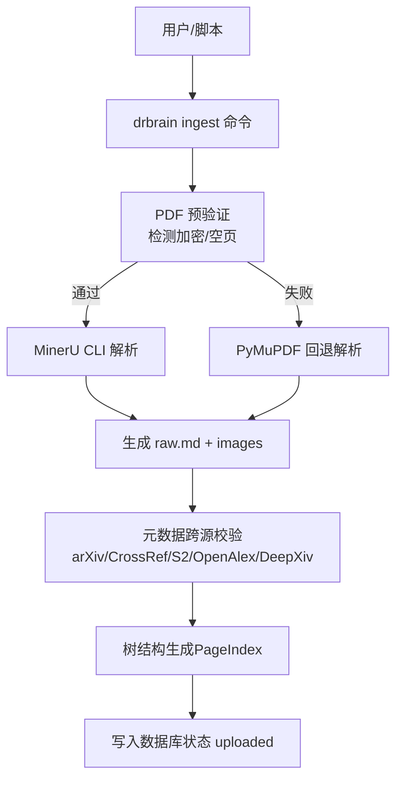
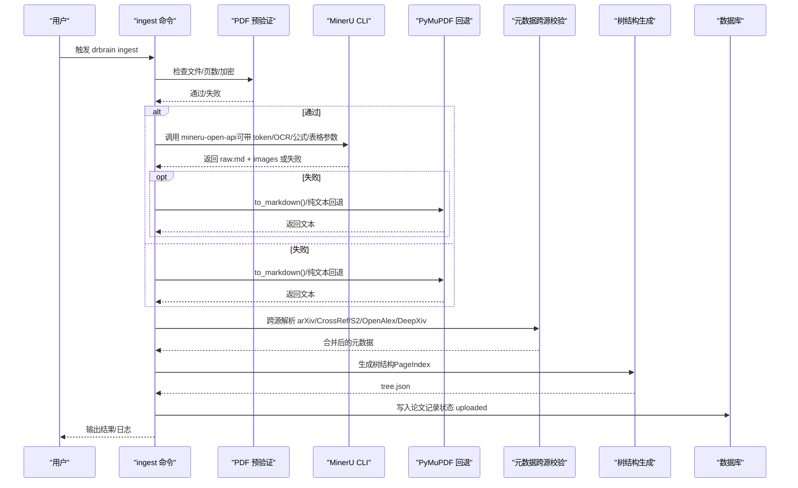
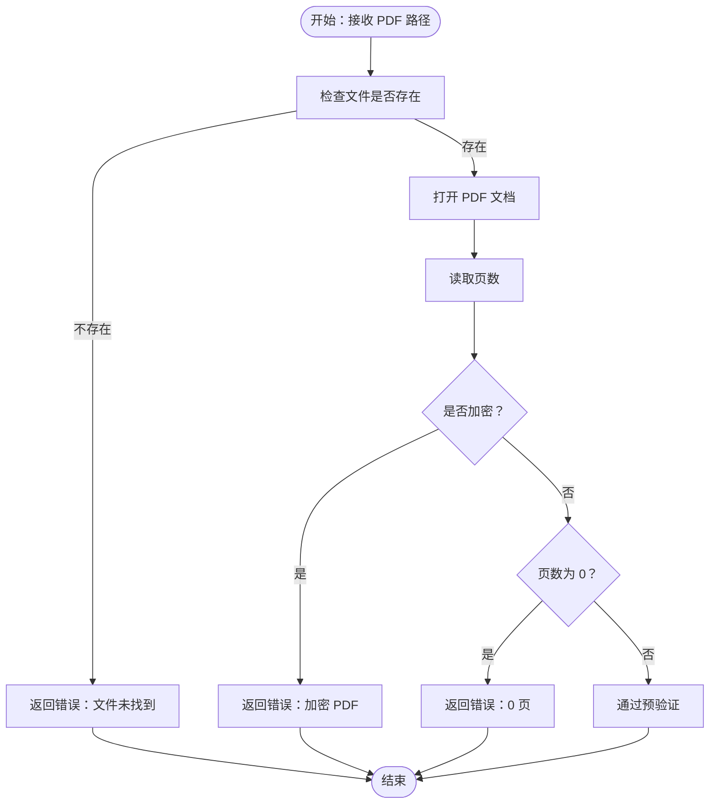
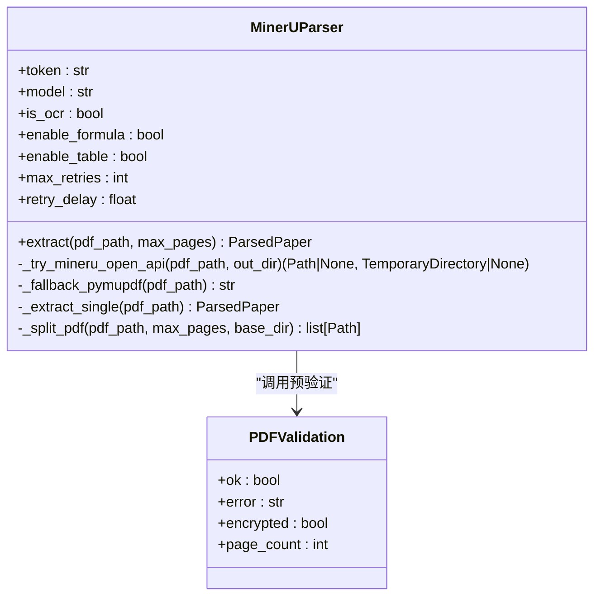
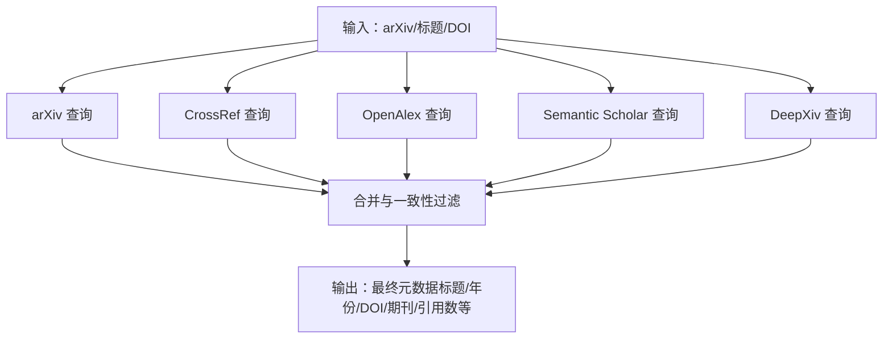
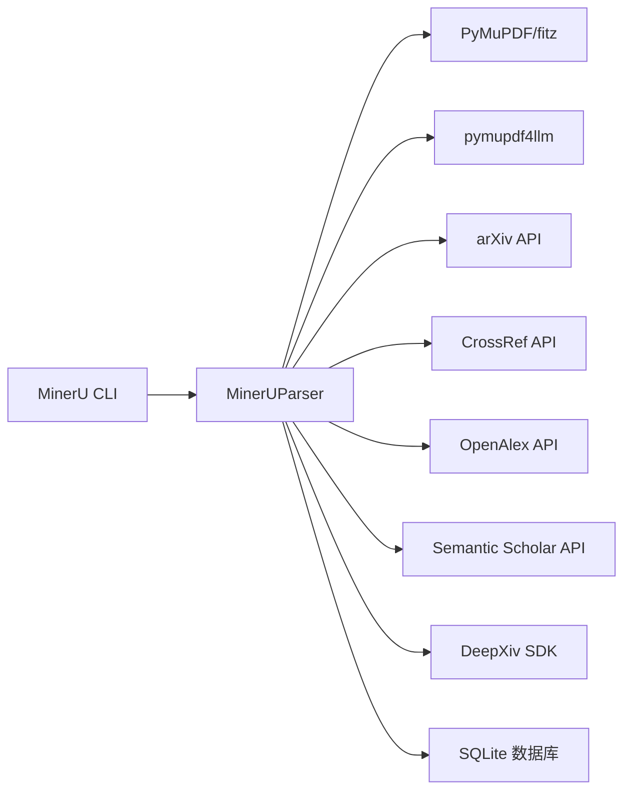

# PDF 处理问题

<cite>
**本文引用的文件**
- [README.md](file://README.md)
- [docs/troubleshooting.md](file://docs/troubleshooting.md)
- [src/drbrain/parser/mineru_parser.py](file://src/drbrain/parser/mineru_parser.py)
- [src/drbrain/parser/__init__.py](file://src/drbrain/parser/__init__.py)
- [src/drbrain/cli/check_commands.py](file://src/drbrain/cli/check_commands.py)
- [src/drbrain/config.py](file://src/drbrain/config.py)
- [src/drbrain/services/repair.py](file://src/drbrain/services/repair.py)
- [src/drbrain/services/fetch.py](file://src/drbrain/services/fetch.py)
- [src/drbrain/log.py](file://src/drbrain/log.py)
- [.trellis/spec/backend/logging-guidelines.md](file://.trellis/spec/backend/logging-guidelines.md)
- [.trellis/spec/backend/error-handling.md](file://.trellis/spec/backend/error-handling.md)
- [src/drbrain/cli/ingest_commands.py](file://src/drbrain/cli/ingest_commands.py)
- [src/drbrain/services/parser_benchmark.py](file://src/drbrain/services/parser_benchmark.py)
- [tests/test_audit.py](file://tests/test_audit.py)
- [tests/test_parser.py](file://tests/test_parser.py)
- [tests/test_fetch.py](file://tests/test_fetch.py)
- [tests/test_repair.py](file://tests/test_repair.py)
- [docs/architecture.md](file://docs/architecture.md)
- [docs/getting-started.md](file://docs/getting-started.md)
- [skills/paper-ingest/SKILL.md](file://skills/paper-ingest/SKILL.md)
</cite>

## 目录
1. [简介](#简介)
2. [项目结构](#项目结构)
3. [核心组件](#核心组件)
4. [架构总览](#架构总览)
5. [详细组件分析](#详细组件分析)
6. [依赖关系分析](#依赖关系分析)
7. [性能考量](#性能考量)
8. [故障排除指南](#故障排除指南)
9. [结论](#结论)
10. [附录](#附录)

## 简介
本指南聚焦 DrBrain 的 PDF 处理问题，覆盖 PDF 解析失败、MinerU API 连接问题、加密 PDF 处理、OCR 识别失败、扫描版 PDF 处理、公式与表格识别优化等场景。内容基于代码实现与官方文档，提供症状描述、诊断步骤、修复方法与最佳实践，并给出日志分析与排障流程图。

## 项目结构
DrBrain 将 PDF 处理分为“轻量解析 + 元数据 + 树结构”阶段（由 ingest 命令完成），以及后续的“多阶段概念抽取”构建阶段（由 build 命令完成）。PDF 解析主要通过 MinerU CLI 优先执行，若不可用则回退到 PyMuPDF；同时内置 PDF 预验证以提前发现加密或空页等问题。

图表来源
- [docs/architecture.md:38-63](file://docs/architecture.md#L38-L63)
- [src/drbrain/parser/mineru_parser.py:28-51](file://src/drbrain/parser/mineru_parser.py#L28-L51)
- [src/drbrain/parser/mineru_parser.py:347-423](file://src/drbrain/parser/mineru_parser.py#L347-L423)

章节来源
- [README.md:43-66](file://README.md#L43-L66)
- [docs/architecture.md:38-63](file://docs/architecture.md#L38-L63)

## 核心组件
- PDF 解析器（MinerU + PyMuPDF 回退）
  - MinerU CLI 可选 token 模式与闪存模式；支持 OCR、公式/表格开关；超时与重试策略；分页切片与合并。
  - 预验证：检查文件存在、页数、加密状态。
- 元数据解析与跨源校验
  - 从 arXiv、CrossRef、OpenAlex、Semantic Scholar、DeepXiv 获取并融合元数据，提升准确性。
- 日志与错误处理
  - 使用 loguru 统一记录，模块前缀规范，异常统一记录并返回安全回退值。
- CLI 与环境检查
  - drbrain check 检测 MinerU CLI、API 可达性、配置项、目录与磁盘空间等。

章节来源
- [src/drbrain/parser/mineru_parser.py:95-318](file://src/drbrain/parser/mineru_parser.py#L95-L318)
- [src/drbrain/parser/mineru_parser.py:28-51](file://src/drbrain/parser/mineru_parser.py#L28-L51)
- [src/drbrain/parser/mineru_parser.py:514-692](file://src/drbrain/parser/mineru_parser.py#L514-L692)
- [src/drbrain/cli/check_commands.py:301-402](file://src/drbrain/cli/check_commands.py#L301-L402)
- [src/drbrain/log.py:32-68](file://src/drbrain/log.py#L32-L68)

## 架构总览
下图展示 PDF 处理的关键路径：从 ingest 命令入口到解析、预验证、回退、元数据校验与树结构生成。

图表来源
- [src/drbrain/cli/ingest_commands.py:26-49](file://src/drbrain/cli/ingest_commands.py#L26-L49)
- [src/drbrain/parser/mineru_parser.py:347-423](file://src/drbrain/parser/mineru_parser.py#L347-L423)
- [src/drbrain/parser/mineru_parser.py:514-692](file://src/drbrain/parser/mineru_parser.py#L514-L692)
- [docs/architecture.md:38-63](file://docs/architecture.md#L38-L63)

## 详细组件分析

### PDF 预验证与回退机制
- 预验证检查文件是否存在、页数是否为 0、是否加密。
- 若验证失败，直接回退到 PyMuPDF（pymupdf4llm 或纯文本）。
- 分页超过阈值（默认 150 页）自动切片，逐片解析后合并。

图表来源
- [src/drbrain/parser/mineru_parser.py:28-51](file://src/drbrain/parser/mineru_parser.py#L28-L51)

章节来源
- [src/drbrain/parser/mineru_parser.py:28-51](file://src/drbrain/parser/mineru_parser.py#L28-L51)
- [src/drbrain/parser/mineru_parser.py:211-227](file://src/drbrain/parser/mineru_parser.py#L211-L227)
- [tests/test_audit.py:382-443](file://tests/test_audit.py#L382-L443)

### MinerU 解析器与回退策略
- 支持参数：模型选择（vlm/pipeline/MinerU-HTML）、OCR 开关、公式/表格开关、重试次数与延迟。
- CLI 调用：根据 token 是否存在决定使用 token 模式或闪存模式；超时控制与重试。
- 回退：当 CLI 不可用或输出缺失 images 目录时，使用 pymupdf4llm.to_markdown；仍失败则转纯文本。

图表来源
- [src/drbrain/parser/mineru_parser.py:95-318](file://src/drbrain/parser/mineru_parser.py#L95-L318)
- [src/drbrain/parser/mineru_parser.py:28-51](file://src/drbrain/parser/mineru_parser.py#L28-L51)

章节来源
- [src/drbrain/parser/mineru_parser.py:95-318](file://src/drbrain/parser/mineru_parser.py#L95-L318)
- [src/drbrain/parser/mineru_parser.py:347-423](file://src/drbrain/parser/mineru_parser.py#L347-L423)
- [src/drbrain/parser/mineru_parser.py:432-456](file://src/drbrain/parser/mineru_parser.py#L432-L456)

### 元数据跨源校验与修复
- 跨源策略：arXiv（权威）、CrossRef（DOI 一致性校验）、OpenAlex（引用计数、期刊信息）、Semantic Scholar（引用计数）、DeepXiv（arXiv 论文 TLDR/关键词/引用数）。
- 年份一致性过滤：以 PDF 文本提取年份为锚点，过滤不一致结果。
- 修复服务：对标题大小写、作者、摘要、期刊、卷期、引用数等进行修复与增强。

图表来源
- [src/drbrain/parser/mineru_parser.py:514-692](file://src/drbrain/parser/mineru_parser.py#L514-L692)
- [src/drbrain/services/repair.py:58-146](file://src/drbrain/services/repair.py#L58-L146)

章节来源
- [src/drbrain/parser/mineru_parser.py:514-692](file://src/drbrain/parser/mineru_parser.py#L514-L692)
- [src/drbrain/services/repair.py:148-242](file://src/drbrain/services/repair.py#L148-L242)

### 日志与错误处理规范
- 日志：统一使用 loguru，文件轮转（10MB，保留 5 份），stderr 输出 WARNING 及以上级别。
- 错误：自定义异常基类与子类，API 客户端异常必须先记录异常再返回回退值。
- 模块前缀：[parse]、[repair]、[db] 等，便于 grep 定位。

章节来源
- [src/drbrain/log.py:32-68](file://src/drbrain/log.py#L32-L68)
- [.trellis/spec/backend/logging-guidelines.md:1-130](file://.trellis/spec/backend/logging-guidelines.md#L1-L130)
- [.trellis/spec/backend/error-handling.md:1-94](file://.trellis/spec/backend/error-handling.md#L1-L94)

## 依赖关系分析
- 组件耦合
  - MinerUParser 依赖 PyMuPDF（fitz）与 pymupdf4llm；可选依赖 deepxiv_sdk、pyalex、arxiv 库。
  - 元数据解析依赖多个外部 API，需网络访问与令牌配置。
- 外部依赖
  - mineru-open-api CLI（可选）；PyMuPDF（必需回退）；网络可达性（MinerU、DeepXiv、OpenAlex、CrossRef、Semantic Scholar）。
- 配置项
  - mineru.token、mineru.model、mineru.is_ocr、mineru.enable_formula、mineru.enable_table、mineru.max_pages；
  - api.deepxiv_token、api.s2_api_key、api.crossref_email、api.openalex_token；
  - dirs.papers、dirs.cache、dirs.logs 等。

图表来源
- [src/drbrain/parser/mineru_parser.py:514-692](file://src/drbrain/parser/mineru_parser.py#L514-L692)
- [src/drbrain/config.py:44-112](file://src/drbrain/config.py#L44-L112)

章节来源
- [src/drbrain/config.py:44-112](file://src/drbrain/config.py#L44-L112)
- [src/drbrain/cli/check_commands.py:301-402](file://src/drbrain/cli/check_commands.py#L301-L402)

## 性能考量
- 大文档分页切片：默认每片不超过 150 页，避免单次解析超时或内存压力。
- 回退路径：MinerU 不可用时自动回退 PyMuPDF，保证吞吐。
- OCR/公式/表格：开启会增加解析时间与资源消耗，按需启用。
- 批量基准测试：提供解析器对比工具，便于评估不同解析器在目标 PDF 上的耗时与输出大小。

章节来源
- [src/drbrain/parser/mineru_parser.py:211-227](file://src/drbrain/parser/mineru_parser.py#L211-L227)
- [src/drbrain/services/parser_benchmark.py:107-153](file://src/drbrain/services/parser_benchmark.py#L107-L153)

## 故障排除指南

### 通用诊断步骤
- 确认环境与依赖
  - 运行 drbrain check，检查：
    - Python 包安装情况
    - 外部工具：mineru-open-api、PyMuPDF（fitz）
    - 配置文件：config.yaml、config.local.yaml
    - API 密钥与令牌：LLM、MinerU、CrossRef、OpenAlex、DeepXiv
    - 目录与磁盘空间
- 查看日志
  - 日志位置：data/logs/drbrain.log
  - 提升日志级别：设置 LOGURU_LEVEL=DEBUG
- 定位失败样本
  - 失败的 PDF 会被移动到 data/spool/pending/，查看 pending.jsonl 获取失败原因

章节来源
- [src/drbrain/cli/check_commands.py:24-427](file://src/drbrain/cli/check_commands.py#L24-L427)
- [docs/troubleshooting.md:154-173](file://docs/troubleshooting.md#L154-L173)
- [src/drbrain/log.py:32-68](file://src/drbrain/log.py#L32-L68)
- [skills/paper-ingest/SKILL.md:52-59](file://skills/paper-ingest/SKILL.md#L52-L59)

### PDF 解析失败
- 症状
  - ingest 挂起或出现“MinerU API 超时”日志
  - raw.md 为空或内容极少
- 排查
  - 检查 mineru.token 与网络连通性
  - 若无 MinerU CLI，确认 PyMuPDF 已安装
  - 对于超大文档，确认已启用分页切片（默认 150 页）
- 修复
  - 补充有效 MinerU token 或保持回退路径可用
  - 如为扫描版 PDF，启用 OCR（见“OCR 识别失败”）

章节来源
- [docs/troubleshooting.md:36-58](file://docs/troubleshooting.md#L36-L58)
- [src/drbrain/parser/mineru_parser.py:347-423](file://src/drbrain/parser/mineru_parser.py#L347-L423)
- [src/drbrain/parser/mineru_parser.py:211-227](file://src/drbrain/parser/mineru_parser.py#L211-L227)

### MinerU API 连接问题
- 症状
  - “MinerU API 不可达”警告
  - 日志中出现超时或连接错误
- 排查
  - drbrain check 中查看 MinerU API 与 CLI 状态
  - 检查 mineru.token 是否配置且未被环境变量占位
- 修复
  - 更新有效 token
  - 确保网络可达 mineru API
  - 若持续失败，系统将自动回退至 PyMuPDF

章节来源
- [src/drbrain/cli/check_commands.py:301-342](file://src/drbrain/cli/check_commands.py#L301-L342)
- [docs/troubleshooting.md:38-44](file://docs/troubleshooting.md#L38-L44)

### 加密 PDF 处理
- 症状
  - 预验证返回“加密”错误
  - 解析直接失败
- 排查
  - 使用 _validate_pdf 检查加密状态
- 修复
  - 在导入前移除 PDF DRM
  - 使用支持解密的 PDF 阅读器或工具处理后再导入

章节来源
- [src/drbrain/parser/mineru_parser.py:28-51](file://src/drbrain/parser/mineru_parser.py#L28-L51)
- [tests/test_audit.py:411-435](file://tests/test_audit.py#L411-L435)

### OCR 识别失败（扫描版 PDF）
- 症状
  - 解析后内容为空或仅有少量文本
  - 系统提示可能是扫描版图像 PDF
- 排查
  - 检查 mineru.is_ocr 配置
  - 确认 MinerU CLI 可用且返回 images 目录
- 修复
  - 在配置中启用 is_ocr
  - 确保网络与 token 正常，必要时提高超时
  - 对高分辨率或低质量扫描件，建议先做去噪/二值化预处理

章节来源
- [docs/troubleshooting.md:53-57](file://docs/troubleshooting.md#L53-L57)
- [src/drbrain/config.py:50-57](file://src/drbrain/config.py#L50-L57)
- [src/drbrain/cli/_setup_i18n.py:98-109](file://src/drbrain/cli/_setup_i18n.py#L98-L109)

### 公式与表格识别优化
- 症状
  - 公式/表格缺失或错位
- 修复
  - 在配置中启用 enable_formula 与 enable_table
  - 若效果不佳，尝试更换模型（mineru.model）或启用 OCR
  - 对复杂公式/表格，建议先人工校正后再导入

章节来源
- [src/drbrain/config.py:50-57](file://src/drbrain/config.py#L50-L57)
- [src/drbrain/parser/mineru_parser.py:378-388](file://src/drbrain/parser/mineru_parser.py#L378-L388)

### PDF 验证与预处理
- 建议
  - 在 ingest 前运行 drbrain check，确保 PDF 文件存在、非空、非加密
  - 对批量导入，先用小样本验证解析质量
- 工具
  - _validate_pdf 可用于单元测试与集成测试中的验证

章节来源
- [src/drbrain/parser/mineru_parser.py:28-51](file://src/drbrain/parser/mineru_parser.py#L28-L51)
- [tests/test_audit.py:382-443](file://tests/test_audit.py#L382-L443)

### DRM 移除与合规性
- 建议
  - 仅对拥有合法权限的 PDF 进行 DRM 移除
  - 使用可信工具链（如 qpdf、LibreOffice）进行脱敏处理
- 注意
  - 本指南不提供具体工具命令，仅强调合规性

[本节为通用建议，不直接分析特定文件]

### 日志分析与定位
- 关键日志位置
  - data/logs/drbrain.log：结构化应用日志，包含 session_id
  - data/metrics.db：LLM 调用统计
  - data/cache/：API 缓存（可安全删除）
- 提示
  - 使用 LOGURU_LEVEL=DEBUG 提升日志级别
  - 按模块前缀（如 [parse]、[repair]）筛选日志
  - 异常使用 logger.exception() 记录完整堆栈

章节来源
- [docs/troubleshooting.md:154-173](file://docs/troubleshooting.md#L154-L173)
- [.trellis/spec/backend/logging-guidelines.md:1-130](file://.trellis/spec/backend/logging-guidelines.md#L1-L130)
- [.trellis/spec/backend/error-handling.md:1-94](file://.trellis/spec/backend/error-handling.md#L1-L94)

### 解析器切换与基准评估
- 建议
  - 使用解析器基准工具对比不同解析器在目标 PDF 上的耗时与输出大小
  - 根据公式/表格/OCR 需求选择合适模型与参数
- 流程
  - 准备一组代表性 PDF
  - 运行基准测试，记录结果
  - 结合业务需求（速度 vs 质量）选择最优组合

章节来源
- [src/drbrain/services/parser_benchmark.py:107-153](file://src/drbrain/services/parser_benchmark.py#L107-L153)
- [tests/test_parser_benchmark.py:52-76](file://tests/test_parser_benchmark.py#L52-L76)

### 元数据修复与增强
- 场景
  - 标题大小写不规范、缺少摘要/引用数/期刊信息
- 方法
  - 使用 repair 服务对单一论文进行修复
  - 通过 OpenAlex、CrossRef 等源补充缺失字段
- 注意
  - dry_run 模式可先预览修复建议

章节来源
- [src/drbrain/services/repair.py:265-337](file://src/drbrain/services/repair.py#L265-L337)
- [src/drbrain/services/repair.py:148-242](file://src/drbrain/services/repair.py#L148-L242)

### PDF 获取与来源验证
- 场景
  - 无 PDF 文件但有 DOI/arXiv 标识
- 方法
  - 使用 fetch 服务按顺序尝试：OpenAlex、arXiv、Unpaywall、DOI 直链
  - 支持机构代理与邮箱配置（CrossRef）
- 注意
  - 优先使用开放获取渠道，遵守版权与许可协议

章节来源
- [src/drbrain/services/fetch.py:81-122](file://src/drbrain/services/fetch.py#L81-L122)
- [tests/test_fetch.py:1-43](file://tests/test_fetch.py#L1-L43)

## 结论
DrBrain 的 PDF 处理以 MinerU 优先、PyMuPDF 回退为核心设计，配合严格的预验证、跨源元数据校验与完善的日志体系，能够稳定处理大多数学术 PDF。针对加密、扫描版、公式/表格等挑战，建议结合配置项与回退策略，并通过基准测试与修复服务持续优化质量。遇到问题时，遵循“检查环境—查看日志—定位样本—调整配置—重试”的流程，通常可快速恢复。

[本节为总结，不直接分析特定文件]

## 附录

### 常用命令与配置要点
- drbrain check：检查依赖、配置、API 可达性
- drbrain ingest：默认扫描 data/spool/inbox/，也可指定文件/目录
- 配置项（关键）
  - mineru.token、mineru.model、mineru.is_ocr、mineru.enable_formula、mineru.enable_table、mineru.max_pages
  - api.deepxiv_token、api.s2_api_key、api.crossref_email、api.openalex_token
  - dirs.papers、dirs.cache、dirs.logs

章节来源
- [src/drbrain/cli/check_commands.py:24-427](file://src/drbrain/cli/check_commands.py#L24-L427)
- [src/drbrain/cli/ingest_commands.py:26-49](file://src/drbrain/cli/ingest_commands.py#L26-L49)
- [src/drbrain/config.py:44-112](file://src/drbrain/config.py#L44-L112)
- [docs/getting-started.md:72-114](file://docs/getting-started.md#L72-L114)