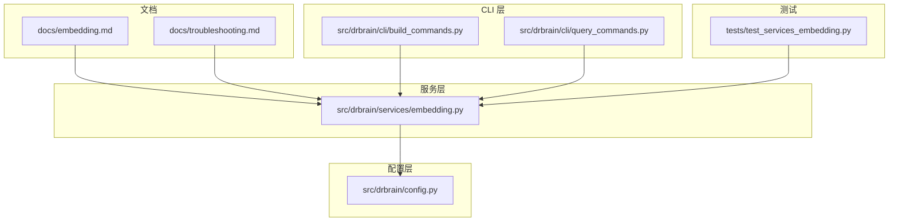
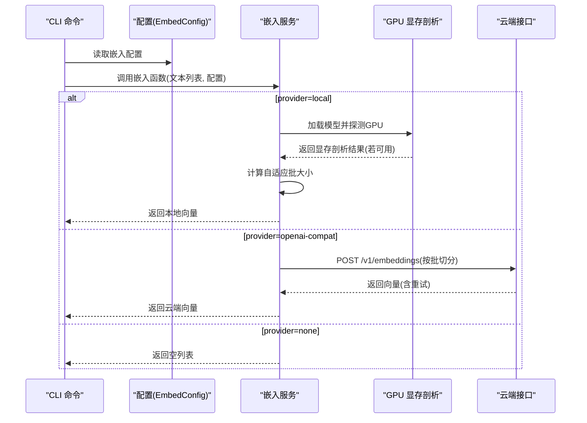
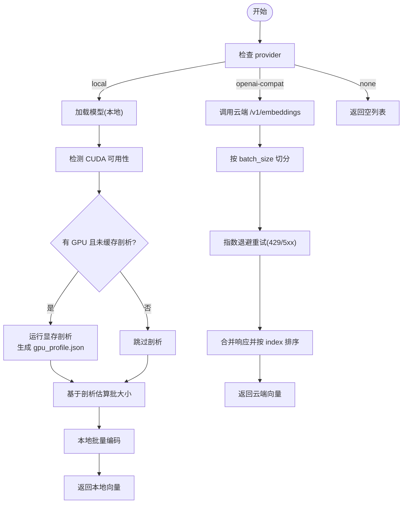
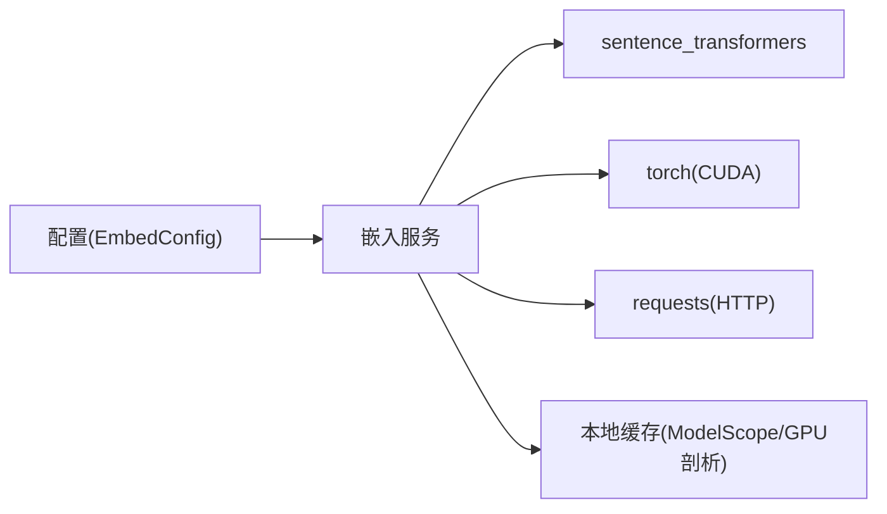
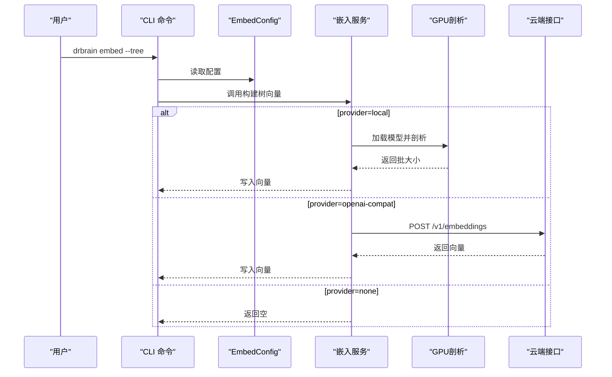

# 嵌入模型问题

<cite>
**本文引用的文件**
- [docs/troubleshooting.md](file://docs/troubleshooting.md)
- [docs/embedding.md](file://docs/embedding.md)
- [src/drbrain/services/embedding.py](file://src/drbrain/services/embedding.py)
- [src/drbrain/config.py](file://src/drbrain/config.py)
- [src/drbrain/cli/build_commands.py](file://src/drbrain/cli/build_commands.py)
- [src/drbrain/cli/query_commands.py](file://src/drbrain/cli/query_commands.py)
- [src/drbrain/exceptions.py](file://src/drbrain/exceptions.py)
- [tests/test_services_embedding.py](file://tests/test_services_embedding.py)
</cite>

## 目录
1. [简介](#简介)
2. [项目结构](#项目结构)
3. [核心组件](#核心组件)
4. [架构总览](#架构总览)
5. [详细组件分析](#详细组件分析)
6. [依赖分析](#依赖分析)
7. [性能考虑](#性能考虑)
8. [故障排除指南](#故障排除指南)
9. [结论](#结论)
10. [附录](#附录)

## 简介
本指南聚焦 DrBrain 的嵌入模型相关问题与排障，覆盖以下主题：
- 模型下载卡住：国内/海外网络差异、镜像源切换、本地缓存路径
- CUDA 内存不足：GPU 自适应批大小、显存剖析缓存、CPU 回退
- OpenAI 兼容接口问题：端点格式、鉴权、重试策略、部分失败处理
- 维度不匹配：模型切换后的向量重建
- 配置项与调优：模型源、设备选择（GPU/CPU）、批大小、缓存清理、网络代理

本指南以代码实现为依据，结合官方文档与测试用例，提供可操作的定位与修复步骤。

## 项目结构
与嵌入相关的模块主要分布在以下位置：
- 文档：嵌入使用与排障说明
- 服务层：本地/云端嵌入执行、GPU 显存剖析、批大小自适应
- 配置层：嵌入配置数据类与加载逻辑
- CLI 层：构建与查询命令中对嵌入的调用
- 测试：覆盖 GPU 批大小计算、显存估算、OpenAI 兼容接口行为

图表来源
- [docs/embedding.md](file://docs/embedding.md)
- [docs/troubleshooting.md](file://docs/troubleshooting.md)
- [src/drbrain/services/embedding.py](file://src/drbrain/services/embedding.py)
- [src/drbrain/config.py](file://src/drbrain/config.py)
- [src/drbrain/cli/build_commands.py](file://src/drbrain/cli/build_commands.py)
- [src/drbrain/cli/query_commands.py](file://src/drbrain/cli/query_commands.py)
- [tests/test_services_embedding.py](file://tests/test_services_embedding.py)

章节来源
- [docs/embedding.md:1-188](file://docs/embedding.md#L1-L188)
- [docs/troubleshooting.md:107-137](file://docs/troubleshooting.md#L107-L137)
- [src/drbrain/services/embedding.py:1-786](file://src/drbrain/services/embedding.py#L1-L786)
- [src/drbrain/config.py:114-141](file://src/drbrain/config.py#L114-L141)
- [src/drbrain/cli/build_commands.py:280-329](file://src/drbrain/cli/build_commands.py#L280-L329)
- [src/drbrain/cli/query_commands.py:283-401](file://src/drbrain/cli/query_commands.py#L283-L401)
- [tests/test_services_embedding.py:1-451](file://tests/test_services_embedding.py#L1-L451)

## 核心组件
- 嵌入服务（本地/云端）：负责模型解析与加载、批量编码、GPU 显存剖析与自适应批大小、OpenAI 兼容接口调用与重试
- 配置对象：EmbedConfig 定义 provider、model、device、source、hf_endpoint、api_base、api_key、batch_size 等字段
- CLI 构建与查询：在构建流程中生成树节点向量，在查询流程中进行向量检索与后过滤

章节来源
- [src/drbrain/services/embedding.py:417-498](file://src/drbrain/services/embedding.py#L417-L498)
- [src/drbrain/services/embedding.py:504-546](file://src/drbrain/services/embedding.py#L504-L546)
- [src/drbrain/services/embedding.py:707-785](file://src/drbrain/services/embedding.py#L707-L785)
- [src/drbrain/config.py:114-141](file://src/drbrain/config.py#L114-L141)
- [src/drbrain/cli/build_commands.py:280-329](file://src/drbrain/cli/build_commands.py#L280-L329)
- [src/drbrain/cli/query_commands.py:283-401](file://src/drbrain/cli/query_commands.py#L283-L401)

## 架构总览
嵌入子系统由“配置—服务—CLI”三层构成，核心流程如下：
- 配置加载：从 YAML 合并本地覆盖，解析环境变量
- 服务执行：根据 provider 路由到本地或云端；本地模式下自动探测 GPU 并进行显存剖析；云端模式按批切分并重试
- 结果返回：向量写入数据库或用于查询

图表来源
- [src/drbrain/services/embedding.py:504-546](file://src/drbrain/services/embedding.py#L504-L546)
- [src/drbrain/services/embedding.py:441-498](file://src/drbrain/services/embedding.py#L441-L498)
- [src/drbrain/services/embedding.py:215-356](file://src/drbrain/services/embedding.py#L215-L356)
- [src/drbrain/config.py:114-141](file://src/drbrain/config.py#L114-L141)

## 详细组件分析

### 组件一：嵌入服务（本地/云端）
- 模型解析与加载
  - 优先从 ModelScope 缓存目录查找本地模型；未找到则通过 snapshot_download 下载；失败回退至 HuggingFace
  - 支持设置 MODELSCOPE_CACHE 环境变量控制缓存目录
- 设备选择
  - device="auto"：检测 CUDA 可用性，否则回退 CPU
  - device="cuda"/"cpu"：强制指定
- GPU 显存剖析与自适应批大小
  - 首次在某 GPU+模型组合上运行时，生成显存剖析缓存文件 ~/.cache/drbrain/gpu_profile.json
  - 基于“峰值增量内存/样本”估算与二次规划外推，计算安全批大小
  - 安全系数默认 0.85，上限 128
- OpenAI 兼容接口
  - 将大批次拆分为 chunk_size，支持指数退避重试（429/5xx）
  - 首个 chunk 失败直接抛出异常；后续 chunk 失败记录警告并返回已成功部分
  - 请求头 Authorization: Bearer $API_KEY，endpoint 末尾拼接 /embeddings
- 查询与后过滤
  - 向量检索时对存储向量与查询向量维度进行校验，不一致则跳过并告警
  - 默认最小分数阈值 0.0，可按需提升

图表来源
- [src/drbrain/services/embedding.py:155-209](file://src/drbrain/services/embedding.py#L155-L209)
- [src/drbrain/services/embedding.py:215-356](file://src/drbrain/services/embedding.py#L215-L356)
- [src/drbrain/services/embedding.py:441-498](file://src/drbrain/services/embedding.py#L441-L498)
- [src/drbrain/services/embedding.py:504-546](file://src/drbrain/services/embedding.py#L504-L546)
- [src/drbrain/services/embedding.py:707-785](file://src/drbrain/services/embedding.py#L707-L785)

章节来源
- [src/drbrain/services/embedding.py:107-149](file://src/drbrain/services/embedding.py#L107-L149)
- [src/drbrain/services/embedding.py:155-209](file://src/drbrain/services/embedding.py#L155-L209)
- [src/drbrain/services/embedding.py:215-356](file://src/drbrain/services/embedding.py#L215-L356)
- [src/drbrain/services/embedding.py:441-498](file://src/drbrain/services/embedding.py#L441-L498)
- [src/drbrain/services/embedding.py:504-546](file://src/drbrain/services/embedding.py#L504-L546)
- [src/drbrain/services/embedding.py:707-785](file://src/drbrain/services/embedding.py#L707-L785)

### 组件二：配置对象（EmbedConfig）
- 关键字段
  - provider: "local" | "openai-compat" | "none"
  - model: 模型名或 HuggingFace ID
  - device: "auto" | "cpu" | "cuda"
  - source: "modelscope" | "huggingface"
  - hf_endpoint: HuggingFace 镜像地址（防火墙场景）
  - api_base: 云端 /v1 基础地址
  - api_key: 云端鉴权密钥（建议使用 ${ENV_VAR}）
  - batch_size: 批大小
- 加载流程
  - 从 config.yaml 与 config.local.yaml 深度合并
  - 解析 ${ENV_VAR} 占位符
  - 构造 EmbedConfig 实例供服务层使用

章节来源
- [src/drbrain/config.py:114-141](file://src/drbrain/config.py#L114-L141)
- [src/drbrain/config.py:195-244](file://src/drbrain/config.py#L195-L244)

### 组件三：CLI 集成（构建与查询）
- 构建命令
  - embed --tree：为每个论文生成 PageIndex + RAPTOR 树节点向量
  - 当 provider=none 时，该命令返回空
- 查询命令
  - 在混合检索中调用嵌入服务生成查询向量，并与数据库中的向量做余弦相似度比较
  - 对结果进行后过滤（最小分数、空节点过滤）

章节来源
- [src/drbrain/cli/build_commands.py:280-329](file://src/drbrain/cli/build_commands.py#L280-L329)
- [src/drbrain/cli/query_commands.py:283-401](file://src/drbrain/cli/query_commands.py#L283-L401)
- [src/drbrain/cli/query_commands.py:350-358](file://src/drbrain/cli/query_commands.py#L350-L358)

## 依赖分析
- 服务层依赖
  - 第三方库：sentence_transformers（本地模型）、torch（CUDA 检测与显存统计）、requests（云端接口）
  - 本地缓存：ModelScope 缓存目录、显存剖析缓存 ~/.cache/drbrain/gpu_profile.json
- 配置层依赖
  - YAML 解析与环境变量替换
- CLI 层依赖
  - 通过 EmbedConfig 注入服务层，避免硬编码

图表来源
- [src/drbrain/services/embedding.py:155-209](file://src/drbrain/services/embedding.py#L155-L209)
- [src/drbrain/services/embedding.py:215-356](file://src/drbrain/services/embedding.py#L215-L356)
- [src/drbrain/services/embedding.py:441-498](file://src/drbrain/services/embedding.py#L441-L498)
- [src/drbrain/config.py:114-141](file://src/drbrain/config.py#L114-L141)

章节来源
- [src/drbrain/services/embedding.py:155-209](file://src/drbrain/services/embedding.py#L155-L209)
- [src/drbrain/services/embedding.py:215-356](file://src/drbrain/services/embedding.py#L215-L356)
- [src/drbrain/services/embedding.py:441-498](file://src/drbrain/services/embedding.py#L441-L498)
- [src/drbrain/config.py:114-141](file://src/drbrain/config.py#L114-L141)

## 性能考虑
- GPU 自适应批大小
  - 通过显存剖析缓存避免重复剖析
  - 安全系数与上限限制防止越界
- 云端批处理
  - 按 batch_size 切分请求，减少单次超时风险
  - 指数退避降低瞬时压力
- 查询性能
  - 存储向量与查询向量维度一致性检查，避免无效匹配
  - 后过滤降低噪声结果

章节来源
- [src/drbrain/services/embedding.py:215-356](file://src/drbrain/services/embedding.py#L215-L356)
- [src/drbrain/services/embedding.py:441-498](file://src/drbrain/services/embedding.py#L441-L498)
- [src/drbrain/services/embedding.py:707-785](file://src/drbrain/services/embedding.py#L707-L785)

## 故障排除指南

### 1) 模型下载卡住
- 症状
  - 首次运行或缓存缺失导致下载缓慢或中断
- 可能原因
  - 网络受限（防火墙/代理）
  - 源选择不当（默认 ModelScope 在部分地区较慢）
- 解决方案
  - 切换源：将 source 设置为 huggingface，并配置 hf_endpoint 为镜像地址
  - 使用本地缓存：确保 MODELSCOPE_CACHE 指向稳定磁盘，避免频繁重试
  - 代理配置：在系统或网络层面配置 HTTP/HTTPS 代理
- 验证方法
  - 查看日志中是否出现 “downloading model … from ModelScope/HuggingFace”
  - 确认缓存目录存在对应模型文件夹

章节来源
- [docs/troubleshooting.md:109-116](file://docs/troubleshooting.md#L109-L116)
- [docs/embedding.md:66-80](file://docs/embedding.md#L66-L80)
- [src/drbrain/services/embedding.py:107-149](file://src/drbrain/services/embedding.py#L107-L149)

### 2) CUDA 内存不足
- 症状
  - 运行本地嵌入时报 OutOfMemory 错误
- 可能原因
  - 文本长度较长或批大小过大
  - 显存剖析缓存缺失导致批大小估算不准
- 解决方案
  - 强制 CPU：将 device 设置为 cpu
  - 减小批大小：降低 batch_size 或等待自动剖析缓存生成
  - 清理显存剖析缓存：删除 ~/.cache/drbrain/gpu_profile.json 后重启，重新生成缓存
- 验证方法
  - 观察日志中 GPU 峰值内存与增量内存记录
  - 确认自适应批大小是否生效

章节来源
- [docs/troubleshooting.md:117-122](file://docs/troubleshooting.md#L117-L122)
- [docs/embedding.md:54-65](file://docs/embedding.md#L54-L65)
- [src/drbrain/services/embedding.py:215-356](file://src/drbrain/services/embedding.py#L215-L356)

### 3) OpenAI 兼容接口问题
- 症状
  - 返回空向量或报错
- 可能原因
  - api_base 未以 /v1 结尾或包含多余斜杠
  - api_key 未设置或环境变量未解析
  - 网络不可达或被限流
- 解决方案
  - 确保 api_base 以 /v1 结尾（不带尾随斜杠）
  - 使用 ${ENV_VAR} 形式在配置中注入密钥
  - 使用 curl 验证端点连通性与模型列表
  - 适当提高 batch_size 以减少请求次数
- 行为说明
  - 首个 chunk 失败会直接抛出异常
  - 后续 chunk 失败仅记录警告并返回已成功部分
  - 429/5xx 自动重试 3 次，指数退避

章节来源
- [docs/troubleshooting.md:123-127](file://docs/troubleshooting.md#L123-L127)
- [docs/embedding.md:83-124](file://docs/embedding.md#L83-L124)
- [src/drbrain/services/embedding.py:441-498](file://src/drbrain/services/embedding.py#L441-L498)

### 4) 维度不匹配
- 症状
  - 搜索结果为空或出现维度不一致告警
- 可能原因
  - 切换了不同的嵌入模型（如从本地模型切换到云端模型）
- 解决方案
  - 重新生成所有向量：运行 drbrain embed --tree
  - 确保数据库中 tree_vectors 的维度与当前模型输出一致

章节来源
- [docs/troubleshooting.md:129-135](file://docs/troubleshooting.md#L129-L135)
- [docs/embedding.md:185-187](file://docs/embedding.md#L185-L187)
- [src/drbrain/services/embedding.py:756-764](file://src/drbrain/services/embedding.py#L756-L764)

### 5) 模型缓存清理
- 本地模型缓存
  - ModelScope 缓存目录：可通过 MODELSCOPE_CACHE 控制
  - 删除缓存后需重新下载模型
- 显存剖析缓存
  - 删除 ~/.cache/drbrain/gpu_profile.json 后，下次运行会重新剖析

章节来源
- [src/drbrain/services/embedding.py:174-176](file://src/drbrain/services/embedding.py#L174-L176)
- [src/drbrain/services/embedding.py:308-356](file://src/drbrain/services/embedding.py#L308-L356)

### 6) 设备驱动问题
- 症状
  - CUDA 不可用或版本不兼容
- 解决方案
  - 将 device 设置为 cpu，绕过 GPU
  - 确认 torch.cuda.is_available() 可用性
  - 如需 GPU，请安装与模型匹配的 CUDA/torch 版本

章节来源
- [docs/troubleshooting.md:115](file://docs/troubleshooting.md#L115)
- [docs/embedding.md:56-65](file://docs/embedding.md#L56-L65)
- [src/drbrain/services/embedding.py:179-187](file://src/drbrain/services/embedding.py#L179-L187)

### 7) 网络代理配置
- 说明
  - 本地模型下载与云端接口均可能受代理影响
- 建议
  - 在系统级或容器内设置 HTTP/HTTPS 代理
  - 云端接口建议使用稳定的镜像端点（配合 hf_endpoint）

章节来源
- [docs/embedding.md:73-79](file://docs/embedding.md#L73-L79)
- [src/drbrain/services/embedding.py:441-498](file://src/drbrain/services/embedding.py#L441-L498)

## 结论
- 模型下载卡住：优先切换源与镜像，确保缓存稳定
- CUDA 内存不足：回退 CPU 或减小批大小，必要时清理显存剖析缓存
- OpenAI 兼容接口：严格校验端点与鉴权，利用重试机制与部分结果返回
- 维度不匹配：切换模型后重建向量
- 其他：设备驱动、网络代理、缓存清理均属于常见可操作项

## 附录

### A. 常见配置要点
- 本地模式
  - provider: "local"
  - device: "auto" 或 "cpu"
  - source: "modelscope" 或 "huggingface"
  - hf_endpoint: 镜像地址（可选）
- 云端模式
  - provider: "openai-compat"
  - api_base: 以 /v1 结尾
  - api_key: ${ENV_VAR}
  - model: 与服务端一致
- 禁用嵌入
  - provider: "none"

章节来源
- [src/drbrain/config.py:114-141](file://src/drbrain/config.py#L114-L141)
- [docs/embedding.md:42-100](file://docs/embedding.md#L42-L100)

### B. 关键流程图（代码级）

图表来源
- [src/drbrain/cli/build_commands.py:280-329](file://src/drbrain/cli/build_commands.py#L280-L329)
- [src/drbrain/services/embedding.py:504-546](file://src/drbrain/services/embedding.py#L504-L546)
- [src/drbrain/services/embedding.py:441-498](file://src/drbrain/services/embedding.py#L441-L498)