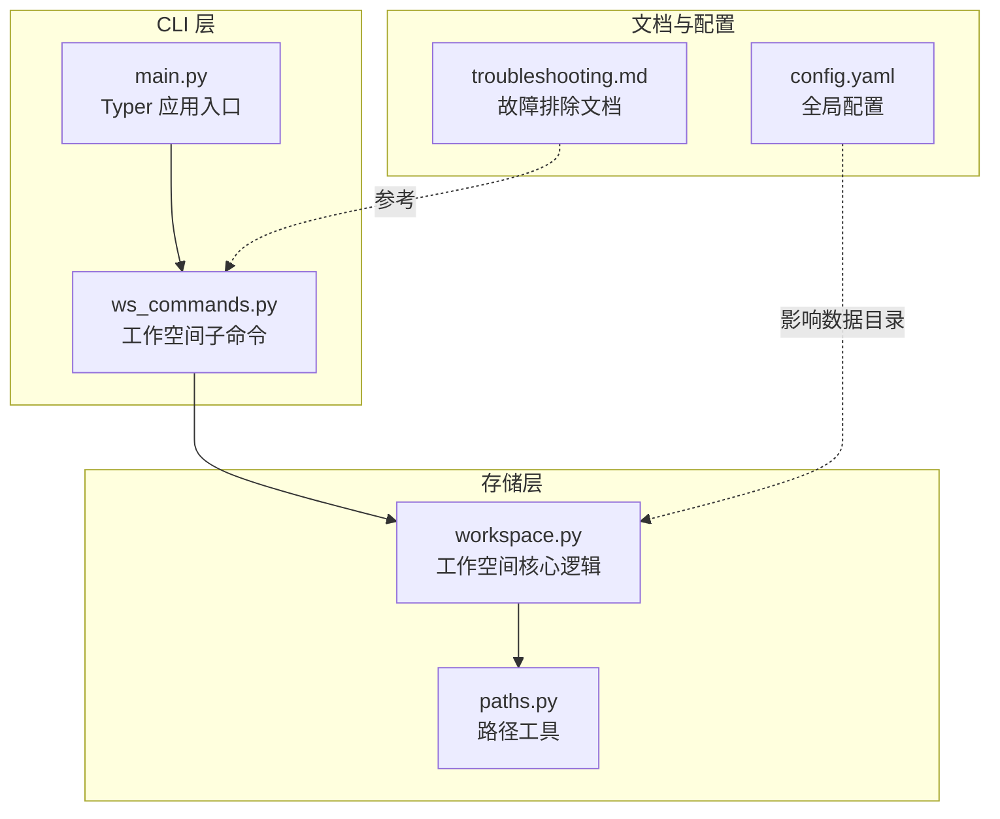
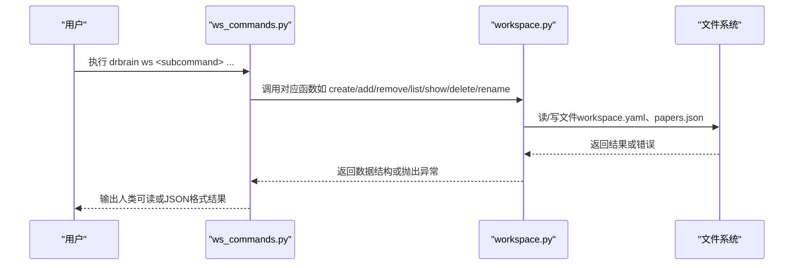
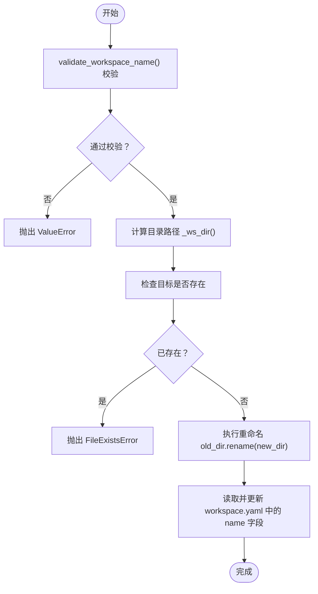
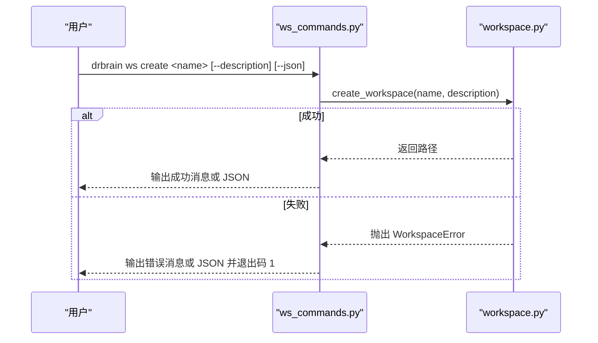
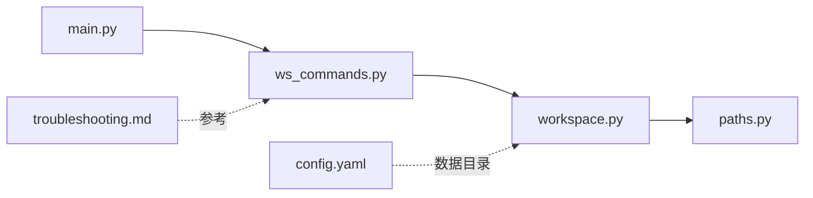

# 工作空间问题

<cite>
**本文引用的文件**
- [workspace.py](file://src/drbrain/storage/workspace.py)
- [ws_commands.py](file://src/drbrain/cli/ws_commands.py)
- [main.py](file://src/drbrain/cli/main.py)
- [troubleshooting.md](file://docs/troubleshooting.md)
- [paths.py](file://src/drbrain/storage/paths.py)
- [exceptions.py](file://src/drbrain/exceptions.py)
- [test_workspace.py](file://tests/test_workspace.py)
- [getting-started.md](file://docs/getting-started.md)
- [config.yaml](file://config.yaml)
</cite>

## 目录
1. [简介](#简介)
2. [项目结构](#项目结构)
3. [核心组件](#核心组件)
4. [架构总览](#架构总览)
5. [详细组件分析](#详细组件分析)
6. [依赖关系分析](#依赖关系分析)
7. [性能考量](#性能考量)
8. [故障排除指南](#故障排除指南)
9. [结论](#结论)
10. [附录](#附录)

## 简介
本指南聚焦于 DrBrain 工作空间（workspace）在实际使用中可能遇到的问题与排错方法，覆盖以下主题：
- 常见问题：工作空间不存在、重命名失败、权限问题等
- 操作方法：查看工作空间列表、检查工作空间状态、名称规范
- 完整流程：创建工作空间、添加/移除论文、删除工作空间、重命名工作空间
- 故障排除：错误定位、日志查看、恢复策略

## 项目结构
工作空间功能由两部分组成：
- 存储层：负责工作空间的创建、读取、写入、删除、重命名等文件系统操作
- CLI 层：提供命令行入口，封装存储层操作并输出结果或错误

图表来源
- [main.py:73-146](file://src/drbrain/cli/main.py#L73-L146)
- [ws_commands.py:1-171](file://src/drbrain/cli/ws_commands.py#L1-L171)
- [workspace.py:1-212](file://src/drbrain/storage/workspace.py#L1-L212)
- [paths.py:1-29](file://src/drbrain/storage/paths.py#L1-L29)
- [troubleshooting.md:139-152](file://docs/troubleshooting.md#L139-L152)
- [config.yaml:25-31](file://config.yaml#L25-L31)

章节来源
- [main.py:73-146](file://src/drbrain/cli/main.py#L73-L146)
- [ws_commands.py:1-171](file://src/drbrain/cli/ws_commands.py#L1-L171)
- [workspace.py:1-212](file://src/drbrain/storage/workspace.py#L1-L212)
- [paths.py:1-29](file://src/drbrain/storage/paths.py#L1-L29)
- [troubleshooting.md:139-152](file://docs/troubleshooting.md#L139-L152)
- [config.yaml:25-31](file://config.yaml#L25-L31)

## 核心组件
- 工作空间存储模块：提供工作空间的创建、读取、写入、删除、重命名等能力，并包含名称校验与原子写入保障
- CLI 子命令模块：封装存储层操作，处理用户输入、输出格式化以及错误传播
- 异常体系：统一的异常类型便于区分不同类型的错误场景
- 路径工具：提供论文目录与文件路径的标准化访问

章节来源
- [workspace.py:15-212](file://src/drbrain/storage/workspace.py#L15-L212)
- [ws_commands.py:12-171](file://src/drbrain/cli/ws_commands.py#L12-L171)
- [exceptions.py:6-28](file://src/drbrain/exceptions.py#L6-L28)
- [paths.py:6-29](file://src/drbrain/storage/paths.py#L6-L29)

## 架构总览
工作空间的调用链从 CLI 到存储层，再到文件系统，最终返回结果或抛出异常。

图表来源
- [ws_commands.py:12-171](file://src/drbrain/cli/ws_commands.py#L12-L171)
- [workspace.py:71-212](file://src/drbrain/storage/workspace.py#L71-L212)

## 详细组件分析

### 存储层：workspace.py
- 名称校验规则：拒绝空名、点名、绝对路径、包含路径分隔符、包含冒号、包含“..”、首尾空白等
- 文件结构：每个工作空间包含 workspace.yaml（元数据）与 refs/papers.json（论文清单）
- 原子写入：临时文件写入后替换，避免中间态损坏
- 错误类型：WorkspaceError（自定义异常基类）、FileNotFoundError、FileExistsError、ValueError

图表来源
- [workspace.py:171-212](file://src/drbrain/storage/workspace.py#L171-L212)
- [workspace.py:22-40](file://src/drbrain/storage/workspace.py#L22-L40)

章节来源
- [workspace.py:22-40](file://src/drbrain/storage/workspace.py#L22-L40)
- [workspace.py:43-53](file://src/drbrain/storage/workspace.py#L43-L53)
- [workspace.py:62-69](file://src/drbrain/storage/workspace.py#L62-L69)
- [workspace.py:171-212](file://src/drbrain/storage/workspace.py#L171-L212)

### CLI 层：ws_commands.py
- 子命令：create、add、remove、list、show、delete、rename
- 输出：支持人类可读与 JSON 两种格式；错误时以 JSON 或标准错误输出
- 错误处理：捕获存储层异常并转换为退出码与输出

图表来源
- [ws_commands.py:12-33](file://src/drbrain/cli/ws_commands.py#L12-L33)
- [workspace.py:71-100](file://src/drbrain/storage/workspace.py#L71-L100)

章节来源
- [ws_commands.py:12-171](file://src/drbrain/cli/ws_commands.py#L12-L171)
- [workspace.py:71-100](file://src/drbrain/storage/workspace.py#L71-L100)

### 异常体系与测试验证
- 异常类型：WorkspaceError 继承自 DrBrainError；其他异常类型用于不同领域
- 测试覆盖：名称校验、原子写入、重命名行为、重复创建、非存在操作等

章节来源
- [exceptions.py:6-28](file://src/drbrain/exceptions.py#L6-L28)
- [test_workspace.py:133-277](file://tests/test_workspace.py#L133-L277)

## 依赖关系分析
- CLI 入口将 ws 子应用注册到主 Typer 应用
- ws 子命令依赖存储层函数
- 存储层依赖路径工具与 YAML/JSON 序列化库
- 文档与配置为运行环境提供参考

图表来源
- [main.py:73-146](file://src/drbrain/cli/main.py#L73-L146)
- [ws_commands.py:19-154](file://src/drbrain/cli/ws_commands.py#L19-L154)
- [workspace.py:43-53](file://src/drbrain/storage/workspace.py#L43-L53)
- [paths.py:6-29](file://src/drbrain/storage/paths.py#L6-L29)
- [troubleshooting.md:139-152](file://docs/troubleshooting.md#L139-L152)
- [config.yaml:25-31](file://config.yaml#L25-L31)

章节来源
- [main.py:73-146](file://src/drbrain/cli/main.py#L73-L146)
- [ws_commands.py:19-154](file://src/drbrain/cli/ws_commands.py#L19-L154)
- [workspace.py:43-53](file://src/drbrain/storage/workspace.py#L43-L53)
- [paths.py:6-29](file://src/drbrain/storage/paths.py#L6-L29)
- [troubleshooting.md:139-152](file://docs/troubleshooting.md#L139-L152)
- [config.yaml:25-31](file://config.yaml#L25-L31)

## 性能考量
- 原子写入：通过临时文件写入后替换，避免并发写入导致的数据不一致
- 列表与详情：仅扫描 workspace 目录并读取必要文件，复杂度与工作空间数量线性相关
- I/O 最小化：批量写入 papers.json，减少多次磁盘写入

章节来源
- [workspace.py:62-69](file://src/drbrain/storage/workspace.py#L62-L69)
- [workspace.py:130-155](file://src/drbrain/storage/workspace.py#L130-L155)

## 故障排除指南

### 一、工作空间不存在
- 现象
  - 使用 show、delete、rename 等命令时报“未找到工作空间”
  - add/remove 操作提示工作空间不存在
- 排查步骤
  - 查看所有工作空间：使用列表命令
  - 检查工作空间目录结构是否完整（workspace.yaml 与 refs/papers.json）
  - 确认工作空间根目录位置（默认 data/workspace，可通过配置调整）
- 处理建议
  - 重新创建工作空间
  - 检查文件系统权限与磁盘空间
  - 如需迁移，请先备份再进行重命名

章节来源
- [ws_commands.py:94-121](file://src/drbrain/cli/ws_commands.py#L94-L121)
- [ws_commands.py:123-144](file://src/drbrain/cli/ws_commands.py#L123-L144)
- [workspace.py:103-128](file://src/drbrain/storage/workspace.py#L103-L128)
- [workspace.py:142-155](file://src/drbrain/storage/workspace.py#L142-L155)
- [troubleshooting.md:141-146](file://docs/troubleshooting.md#L141-L146)

### 二、重命名失败
- 现象
  - 重命名命令报错，提示无效名称或目标已存在
- 可能原因
  - 新名称不符合校验规则（包含非法字符、绝对路径、首尾空白等）
  - 目标工作空间已存在
  - 源工作空间不存在
- 排查步骤
  - 使用名称校验规则逐项检查新名称
  - 确认旧名称拼写正确且存在
  - 检查目标名称是否已被占用
- 处理建议
  - 修改为符合规则的新名称
  - 删除或改名冲突目标后再试
  - 使用 JSON 输出模式获取更详细的错误信息

章节来源
- [workspace.py:171-212](file://src/drbrain/storage/workspace.py#L171-L212)
- [ws_commands.py:147-168](file://src/drbrain/cli/ws_commands.py#L147-L168)
- [troubleshooting.md:148-152](file://docs/troubleshooting.md#L148-L152)

### 三、权限问题
- 现象
  - 创建/删除/重命名工作空间时报权限错误
- 排查步骤
  - 确认工作空间根目录的读写权限
  - 检查父级目录权限（如 data/）
  - 确认当前用户对目标路径有足够权限
- 处理建议
  - 使用 sudo 或切换到有权限的用户
  - 更改工作空间根目录到有权限的位置
  - 清理临时文件（.tmp）后重试

章节来源
- [workspace.py:62-69](file://src/drbrain/storage/workspace.py#L62-L69)
- [workspace.py:158-163](file://src/drbrain/storage/workspace.py#L158-L163)

### 四、名称规范
- 合法名称示例
  - 包含字母、数字、下划线、点、连字符、空格
  - 长度大于 0
- 非法名称示例
  - 空字符串、仅点或双点
  - 绝对路径、包含路径分隔符
  - 包含冒号（Windows 驱动器标识）
  - 包含“..”
  - 首尾空白
- 建议
  - 使用清晰、简洁的英文或拼音命名
  - 避免特殊字符，保持跨平台兼容

章节来源
- [workspace.py:22-40](file://src/drbrain/storage/workspace.py#L22-L40)
- [test_workspace.py:133-189](file://tests/test_workspace.py#L133-L189)

### 五、操作方法与流程

#### 1) 查看工作空间列表
- 命令：drbrain ws list
- 输出：工作空间名称列表或 JSON
- 注意：若为空，提示使用创建命令

章节来源
- [ws_commands.py:76-92](file://src/drbrain/cli/ws_commands.py#L76-L92)

#### 2) 检查工作空间状态
- 命令：drbrain ws show <name>
- 输出：名称、描述、创建时间、论文总数、论文清单
- JSON 模式：便于自动化脚本解析

章节来源
- [ws_commands.py:94-121](file://src/drbrain/cli/ws_commands.py#L94-L121)
- [workspace.py:142-155](file://src/drbrain/storage/workspace.py#L142-L155)

#### 3) 创建工作空间
- 命令：drbrain ws create <name> [--description] [--json]
- 行为：创建目录、生成 workspace.yaml、初始化 papers.json
- 错误：名称已存在时抛出 WorkspaceError

章节来源
- [ws_commands.py:12-33](file://src/drbrain/cli/ws_commands.py#L12-L33)
- [workspace.py:71-100](file://src/drbrain/storage/workspace.py#L71-L100)

#### 4) 添加/移除论文
- 命令：drbrain ws add <name> <local_id...> [--json]
- 命令：drbrain ws remove <name> <local_id...> [--json]
- 行为：去重添加、按 ID 移除
- 错误：工作空间不存在时抛出 WorkspaceError

章节来源
- [ws_commands.py:35-74](file://src/drbrain/cli/ws_commands.py#L35-L74)
- [workspace.py:103-128](file://src/drbrain/storage/workspace.py#L103-L128)

#### 5) 删除工作空间
- 命令：drbrain ws delete <name> [--json]
- 行为：删除整个工作空间目录
- 注意：此操作不可逆

章节来源
- [ws_commands.py:123-144](file://src/drbrain/cli/ws_commands.py#L123-L144)
- [workspace.py:158-163](file://src/drbrain/storage/workspace.py#L158-L163)

#### 6) 重命名工作空间
- 命令：drbrain ws rename <old_name> <new_name> [--json]
- 行为：原子重命名目录并更新 workspace.yaml 中的 name 字段
- 错误：名称非法、源不存在、目标已存在

章节来源
- [ws_commands.py:147-168](file://src/drbrain/cli/ws_commands.py#L147-L168)
- [workspace.py:171-212](file://src/drbrain/storage/workspace.py#L171-L212)

### 六、日志与恢复
- 日志位置
  - 结构化日志：data/logs/drbrain.log
  - 会话 ID：日志中包含 session_id
- 提升日志级别
  - 设置 LOGURU_LEVEL=DEBUG
- 恢复策略
  - 备份与还原：drbrain backup 与 tar 解压
  - 重建索引：drbrain index
  - 重置环境：drbrain clean + drbrain setup --quick + drbrain index

章节来源
- [troubleshooting.md:154-197](file://docs/troubleshooting.md#L154-L197)

## 结论
- 工作空间管理围绕“名称校验—文件系统—原子写入—CLI 输出”展开
- 出错时优先使用 JSON 模式获取结构化错误信息
- 重命名与删除属于高风险操作，务必先备份
- 若仍无法解决，结合日志与文档进行深入排查

## 附录

### A. 常用命令速查
- 查看列表：drbrain ws list [--json]
- 查看详情：drbrain ws show <name> [--json]
- 创建：drbrain ws create <name> [--description] [--json]
- 添加论文：drbrain ws add <name> <local_id...> [--json]
- 移除论文：drbrain ws remove <name> <local_id...> [--json]
- 删除：drbrain ws delete <name> [--json]
- 重命名：drbrain ws rename <old_name> <new_name> [--json]

章节来源
- [ws_commands.py:12-171](file://src/drbrain/cli/ws_commands.py#L12-L171)

### B. 数据目录与路径
- 默认数据目录：data/
- 论文目录：data/papers/<id>/
- 工作空间目录：data/workspace/<name>/
- 关键文件：workspace.yaml、refs/papers.json

章节来源
- [config.yaml:25-31](file://config.yaml#L25-L31)
- [getting-started.md:241](file://docs/getting-started.md#L241)