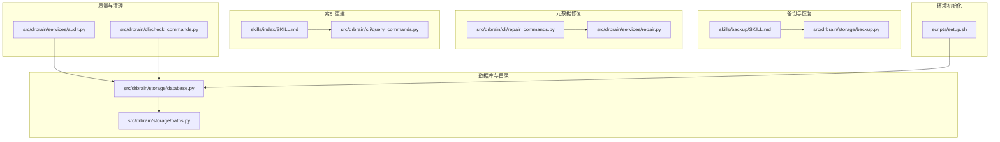
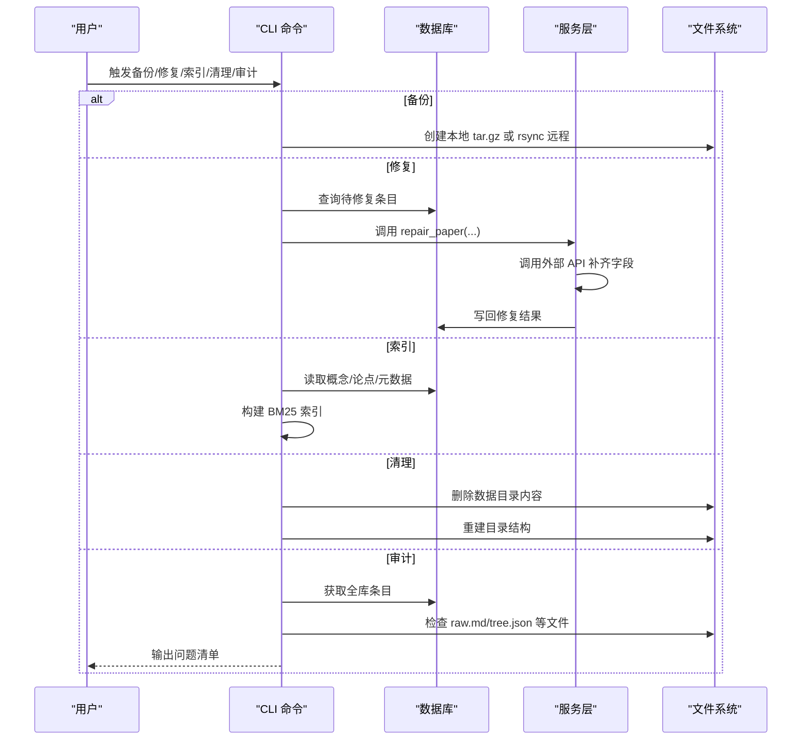
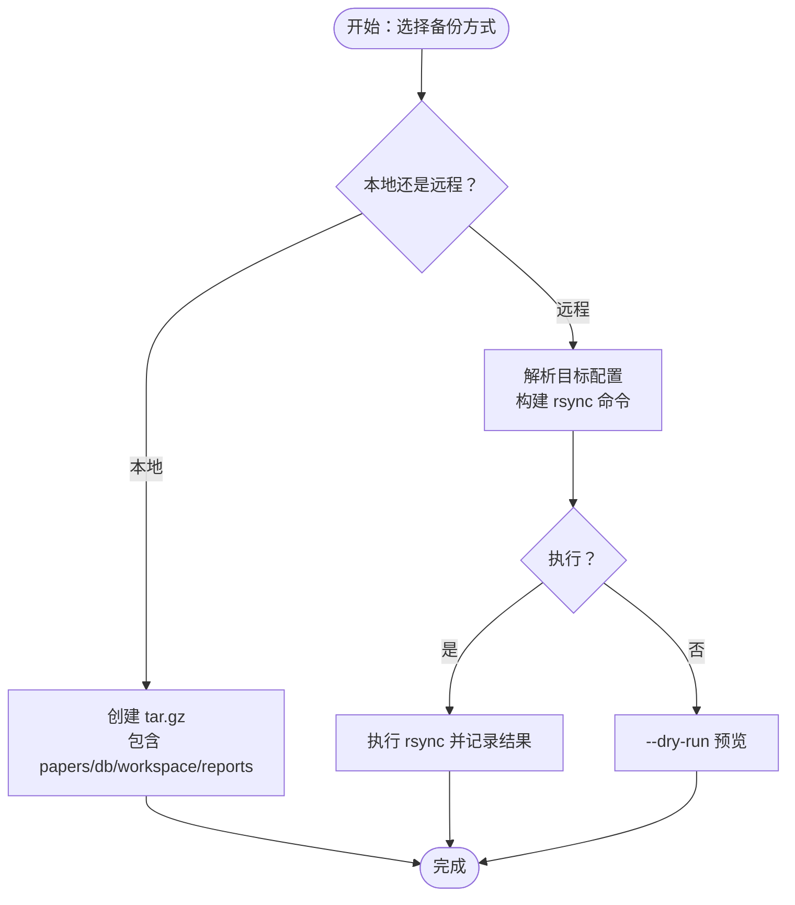
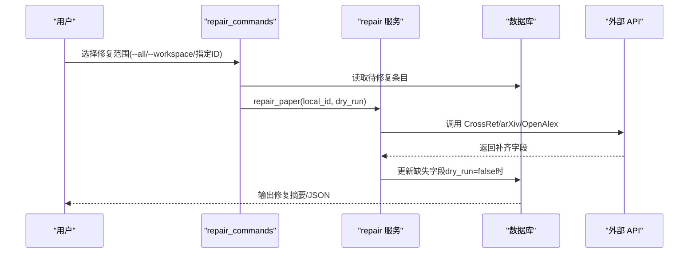
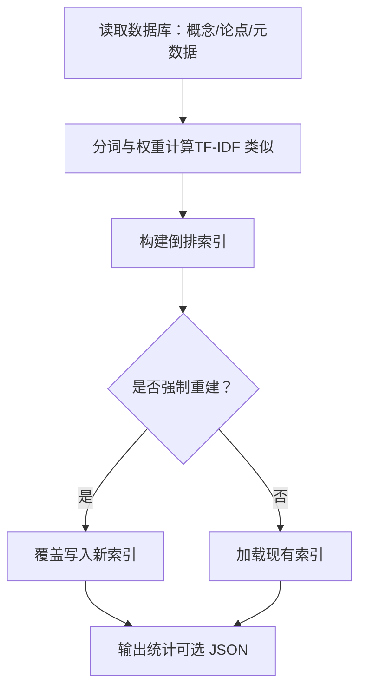
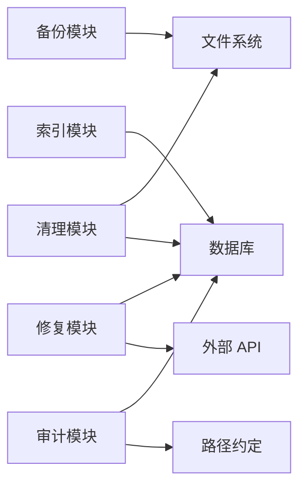

# 恢复与重建

<cite>
**本文引用的文件**
- [skills/backup/SKILL.md](file://skills/backup/SKILL.md)
- [src/drbrain/storage/backup.py](file://src/drbrain/storage/backup.py)
- [src/drbrain/cli/repair_commands.py](file://src/drbrain/cli/repair_commands.py)
- [src/drbrain/services/repair.py](file://src/drbrain/services/repair.py)
- [skills/index/SKILL.md](file://skills/index/SKILL.md)
- [src/drbrain/cli/query_commands.py](file://src/drbrain/cli/query_commands.py)
- [src/drbrain/storage/database.py](file://src/drbrain/storage/database.py)
- [src/drbrain/cli/check_commands.py](file://src/drbrain/cli/check_commands.py)
- [src/drbrain/services/audit.py](file://src/drbrain/services/audit.py)
- [src/drbrain/storage/paths.py](file://src/drbrain/storage/paths.py)
- [scripts/setup.sh](file://scripts/setup.sh)
- [tests/test_backup.py](file://tests/test_backup.py)
- [tests/test_repair.py](file://tests/test_repair.py)
</cite>

## 目录
1. [简介](#简介)
2. [项目结构](#项目结构)
3. [核心组件](#核心组件)
4. [架构总览](#架构总览)
5. [详细组件分析](#详细组件分析)
6. [依赖分析](#依赖分析)
7. [性能考虑](#性能考虑)
8. [故障排查指南](#故障排查指南)
9. [结论](#结论)
10. [附录](#附录)

## 简介
本指南面向 DrBrain 系统在发生数据丢失、索引损坏或数据库异常时的“恢复与重建”场景，提供从备份管理到搜索索引重建、再到系统级重置的全流程操作手册。内容覆盖：
- 备份文件管理与验证
- 数据完整性检查与审计
- 搜索索引重建流程
- 完整重置与最小化环境初始化
- 预防性维护与灾难恢复最佳实践

## 项目结构
围绕恢复与重建的关键模块包括：备份与远程同步、元数据修复、索引重建、数据库与目录结构、质量审计与清理命令。

图表来源
- [skills/backup/SKILL.md:1-58](file://skills/backup/SKILL.md#L1-L58)
- [src/drbrain/storage/backup.py:1-240](file://src/drbrain/storage/backup.py#L1-L240)
- [src/drbrain/cli/repair_commands.py:1-438](file://src/drbrain/cli/repair_commands.py#L1-L438)
- [src/drbrain/services/repair.py:1-337](file://src/drbrain/services/repair.py#L1-L337)
- [skills/index/SKILL.md:1-69](file://skills/index/SKILL.md#L1-L69)
- [src/drbrain/cli/query_commands.py:260-280](file://src/drbrain/cli/query_commands.py#L260-L280)
- [src/drbrain/storage/database.py:1-775](file://src/drbrain/storage/database.py#L1-L775)
- [src/drbrain/storage/paths.py:1-29](file://src/drbrain/storage/paths.py#L1-L29)
- [src/drbrain/services/audit.py:1-396](file://src/drbrain/services/audit.py#L1-L396)
- [src/drbrain/cli/check_commands.py:565-629](file://src/drbrain/cli/check_commands.py#L565-L629)
- [scripts/setup.sh:1-24](file://scripts/setup.sh#L1-L24)

章节来源
- [skills/backup/SKILL.md:1-58](file://skills/backup/SKILL.md#L1-L58)
- [src/drbrain/storage/backup.py:1-240](file://src/drbrain/storage/backup.py#L1-L240)
- [src/drbrain/cli/repair_commands.py:1-438](file://src/drbrain/cli/repair_commands.py#L1-L438)
- [src/drbrain/services/repair.py:1-337](file://src/drbrain/services/repair.py#L1-L337)
- [skills/index/SKILL.md:1-69](file://skills/index/SKILL.md#L1-L69)
- [src/drbrain/cli/query_commands.py:260-280](file://src/drbrain/cli/query_commands.py#L260-L280)
- [src/drbrain/storage/database.py:1-775](file://src/drbrain/storage/database.py#L1-L775)
- [src/drbrain/storage/paths.py:1-29](file://src/drbrain/storage/paths.py#L1-L29)
- [src/drbrain/services/audit.py:1-396](file://src/drbrain/services/audit.py#L1-L396)
- [src/drbrain/cli/check_commands.py:565-629](file://src/drbrain/cli/check_commands.py#L565-L629)
- [scripts/setup.sh:1-24](file://scripts/setup.sh#L1-L24)

## 核心组件
- 备份与远程同步：支持本地 tar.gz 备份与 rsync 远程同步，提供目标校验、命令构建与执行结果封装。
- 元数据修复：通过 CrossRef、arXiv、OpenAlex 等外部源自动修复缺失字段；支持干运行预览。
- 搜索索引重建：基于 BM25 的概念与论点全文检索索引重建，支持强制全量重建与 JSON 输出。
- 数据库与目录：SQLite 主库、模式迁移、目录结构与路径约定。
- 质量审计与清理：15 规则审计扫描、按工作区过滤、清理命令带口令保护。
- 环境初始化：安装依赖与 MinerU CLI，生成最小可用配置指引。

章节来源
- [src/drbrain/storage/backup.py:26-240](file://src/drbrain/storage/backup.py#L26-L240)
- [src/drbrain/cli/repair_commands.py:14-341](file://src/drbrain/cli/repair_commands.py#L14-L341)
- [src/drbrain/services/repair.py:265-337](file://src/drbrain/services/repair.py#L265-L337)
- [src/drbrain/cli/query_commands.py:263-280](file://src/drbrain/cli/query_commands.py#L263-L280)
- [src/drbrain/storage/database.py:159-201](file://src/drbrain/storage/database.py#L159-L201)
- [src/drbrain/services/audit.py:30-396](file://src/drbrain/services/audit.py#L30-L396)
- [src/drbrain/cli/check_commands.py:565-629](file://src/drbrain/cli/check_commands.py#L565-L629)
- [scripts/setup.sh:1-24](file://scripts/setup.sh#L1-L24)

## 架构总览
DrBrain 的恢复与重建涉及以下关键流程：
- 备份：本地打包与远程同步两条路径，确保数据与索引文件的可移植性。
- 修复：读取数据库中缺失元数据的条目，调用外部 API 补齐并写回数据库。
- 索引：从数据库读取概念、论点与论文元信息，构建 BM25 索引以支撑查询。
- 清理：在确认口令后清空数据目录，保留收件箱 PDF，便于重新导入。
- 审计：扫描全库规则，输出问题清单，辅助判断是否需要修复或重建。

图表来源
- [src/drbrain/storage/backup.py:26-240](file://src/drbrain/storage/backup.py#L26-L240)
- [src/drbrain/services/repair.py:265-337](file://src/drbrain/services/repair.py#L265-L337)
- [src/drbrain/cli/query_commands.py:263-280](file://src/drbrain/cli/query_commands.py#L263-L280)
- [src/drbrain/cli/check_commands.py:565-629](file://src/drbrain/cli/check_commands.py#L565-L629)
- [src/drbrain/services/audit.py:30-396](file://src/drbrain/services/audit.py#L30-L396)

## 详细组件分析

### 备份与恢复（本地与远程）
- 本地备份
  - 使用 tar.gz 将 papers、数据库、workspace、reports 打包，默认输出至 data/backups。
  - 支持自定义输出路径与列出现有备份。
- 远程同步
  - 在配置中定义备份目标（主机、用户、路径、端口、密钥、压缩、排除模式等）。
  - 通过 rsync 命令构建与执行，支持 dry-run 预览。
- 结果封装
  - 返回命令、返回码、stdout/stderr，便于脚本化与 CI 集成。

图表来源
- [skills/backup/SKILL.md:14-47](file://skills/backup/SKILL.md#L14-L47)
- [src/drbrain/storage/backup.py:26-240](file://src/drbrain/storage/backup.py#L26-L240)

章节来源
- [skills/backup/SKILL.md:1-58](file://skills/backup/SKILL.md#L1-L58)
- [src/drbrain/storage/backup.py:26-240](file://src/drbrain/storage/backup.py#L26-L240)
- [tests/test_backup.py:18-170](file://tests/test_backup.py#L18-L170)

### 元数据修复与导入
- 修复流程
  - 支持单篇、全部或按工作区修复；支持干运行预览。
  - 修复来源：CrossRef（DOI/title/year）、arXiv（arXiv 标识）、标题+年份推导 DOI、OpenAlex 补充摘要/引用数/作者/期刊/卷期页码。
  - 写回数据库：按字段更新，事务提交。
- 导入流程
  - 支持 Zotero（本地 SQLite/Web API）、BibTeX、Endnote（.ris/.xml）。
  - 支持干运行预览、去重（基于 DOI）、复制 PDF 到 papers/<pid> 目录。
  - 导入后建议运行修复或增量抓取以完善元数据。

图表来源
- [src/drbrain/cli/repair_commands.py:14-341](file://src/drbrain/cli/repair_commands.py#L14-L341)
- [src/drbrain/services/repair.py:265-337](file://src/drbrain/services/repair.py#L265-L337)

章节来源
- [src/drbrain/cli/repair_commands.py:14-341](file://src/drbrain/cli/repair_commands.py#L14-L341)
- [src/drbrain/services/repair.py:1-337](file://src/drbrain/services/repair.py#L1-L337)
- [tests/test_repair.py:1-748](file://tests/test_repair.py#L1-L748)

### 搜索索引重建
- 触发方式：drbrain index [--rebuild] [--json]
- 工作原理：从数据库读取概念标签、类型、章节、论点与论文元数据，构建 BM25 索引；默认加载已有索引，强制重建时从数据库重建。
- 验证方法：--json 输出文档数量，用于确认重建成功。

图表来源
- [skills/index/SKILL.md:25-31](file://skills/index/SKILL.md#L25-L31)
- [src/drbrain/cli/query_commands.py:263-280](file://src/drbrain/cli/query_commands.py#L263-L280)

章节来源
- [skills/index/SKILL.md:1-69](file://skills/index/SKILL.md#L1-L69)
- [src/drbrain/cli/query_commands.py:263-280](file://src/drbrain/cli/query_commands.py#L263-L280)

### 数据库与目录结构
- 数据库
  - SQLite 主库，包含 papers、paper_ids、concepts、arguments、edges、aliases、embeddings、tree_vectors、tree_summaries、vector_metadata、confidence_queue、research_seeds、citation_cache、build_stages、schema_versions 等表。
  - 自动模式迁移，按版本顺序应用。
- 目录与路径
  - papers/<local_id> 下包含 raw.md、tree.json、source.pdf、images 等文件。
  - 清理命令会删除 db、cache、logs、papers、reports 等目录内容，并重建目录结构。

章节来源
- [src/drbrain/storage/database.py:10-156](file://src/drbrain/storage/database.py#L10-L156)
- [src/drbrain/storage/database.py:159-201](file://src/drbrain/storage/database.py#L159-L201)
- [src/drbrain/storage/paths.py:1-29](file://src/drbrain/storage/paths.py#L1-L29)
- [src/drbrain/cli/check_commands.py:565-629](file://src/drbrain/cli/check_commands.py#L565-L629)

### 质量审计与清理
- 质量审计
  - 15 条规则，分为 error/warning/info 三级，覆盖标题、Markdown、DOI、摘要、年份、期刊、作者、树结构、概念/边数量、占位状态、旧占位、重复标题等。
  - 支持按工作区过滤与 JSON 输出。
- 清理命令
  - 可交互确认或强制执行（需口令保护），删除 db、metrics.db、cache、logs、papers、reports，重建目录；保留收件箱 PDF。

章节来源
- [src/drbrain/services/audit.py:30-396](file://src/drbrain/services/audit.py#L30-L396)
- [src/drbrain/cli/check_commands.py:565-629](file://src/drbrain/cli/check_commands.py#L565-L629)

### 环境初始化与最小化重置
- 初始化脚本
  - 安装 Python 依赖与 MinerU CLI，提示后续配置与首次导入。
- 最小化重置
  - 通过清理命令清空数据目录并重建，随后使用初始化脚本与导入流程恢复。

章节来源
- [scripts/setup.sh:1-24](file://scripts/setup.sh#L1-L24)
- [src/drbrain/cli/check_commands.py:565-629](file://src/drbrain/cli/check_commands.py#L565-L629)

## 依赖分析
- 组件耦合
  - 备份模块独立于业务逻辑，仅依赖配置与文件系统。
  - 修复模块依赖数据库与外部 API，写回数据库。
  - 索引模块依赖数据库读取能力。
  - 审计模块依赖数据库与路径约定。
  - 清理模块依赖配置与文件系统。
- 外部依赖
  - rsync/ssh 用于远程备份；MinerU CLI/PyMuPDF 用于 PDF 解析；各类 LLM/知识图谱服务用于增强与推理。

图表来源
- [src/drbrain/storage/backup.py:1-240](file://src/drbrain/storage/backup.py#L1-L240)
- [src/drbrain/services/repair.py:1-337](file://src/drbrain/services/repair.py#L1-L337)
- [src/drbrain/cli/query_commands.py:263-280](file://src/drbrain/cli/query_commands.py#L263-L280)
- [src/drbrain/services/audit.py:1-396](file://src/drbrain/services/audit.py#L1-L396)
- [src/drbrain/cli/check_commands.py:565-629](file://src/drbrain/cli/check_commands.py#L565-L629)
- [src/drbrain/storage/paths.py:1-29](file://src/drbrain/storage/paths.py#L1-L29)

## 性能考虑
- 备份
  - 本地 tar.gz 适合离线归档；远程 rsync 支持压缩与排除模式，减少传输开销。
  - 建议定期进行增量备份，结合本地与远程策略。
- 修复
  - 外部 API 调用存在速率限制，建议批量处理并控制并发。
  - 干运行可避免写回，先评估修复范围。
- 索引
  - 强制重建成本较高，建议在数据量变化较大或查询异常时触发。
  - 可通过 --json 输出快速验证重建结果。
- 清理
  - 清理前建议先备份，避免误删；口令保护降低误操作风险。

## 故障排查指南
- 备份失败
  - 检查 rsync/ssh 可用性与目标配置；使用 --dry-run 预览命令；查看返回码与错误输出。
  - 参考测试用例中的命令构建与错误处理。
- 修复未生效
  - 确认外部 API 可达且配额充足；检查干运行输出；核对数据库字段更新。
- 索引为空或结果异常
  - 确认已执行重建；检查数据库中概念/论点是否存在；使用 --json 输出验证文档数。
- 清理误操作
  - 立即停止后续操作，优先进行备份恢复；若已强制执行，先恢复备份再重新导入。
- 数据质量差
  - 使用审计命令生成问题清单，逐项修复后再重建索引。

章节来源
- [tests/test_backup.py:351-390](file://tests/test_backup.py#L351-L390)
- [src/drbrain/services/repair.py:265-337](file://src/drbrain/services/repair.py#L265-L337)
- [src/drbrain/cli/query_commands.py:263-280](file://src/drbrain/cli/query_commands.py#L263-L280)
- [src/drbrain/cli/check_commands.py:565-629](file://src/drbrain/cli/check_commands.py#L565-L629)
- [src/drbrain/services/audit.py:312-396](file://src/drbrain/services/audit.py#L312-L396)

## 结论
DrBrain 提供了从备份、修复、索引重建到清理与审计的完整恢复与重建能力。建议在日常运维中：
- 定期执行本地与远程备份；
- 使用审计命令持续监控数据质量；
- 在大规模变更后重建索引；
- 通过干运行与口令保护降低误操作风险；
- 发生灾难时优先恢复备份并按流程重建索引与元数据。

## 附录
- 操作清单（示例）
  - 备份：drbrain backup；drbrain backup --list；drbrain backup --target <name> [--dry-run]
  - 修复：drbrain repair --all；drbrain repair --workspace <ws>；drbrain repair <local_id> --dry-run
  - 索引：drbrain index --rebuild；drbrain index --rebuild --json
  - 清理：drbrain clean --force（需口令）
  - 审计：drbrain audit；drbrain audit --workspace <ws>；drbrain audit --json
  - 初始化：./scripts/setup.sh