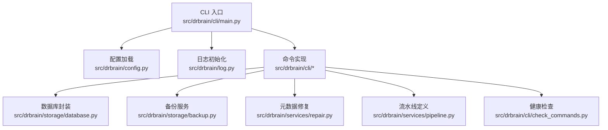
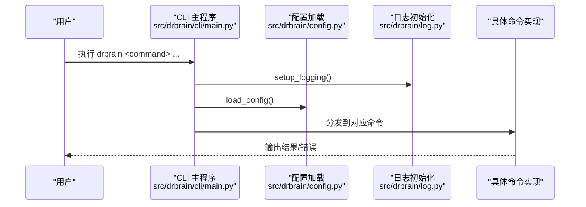
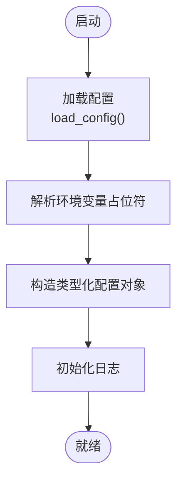
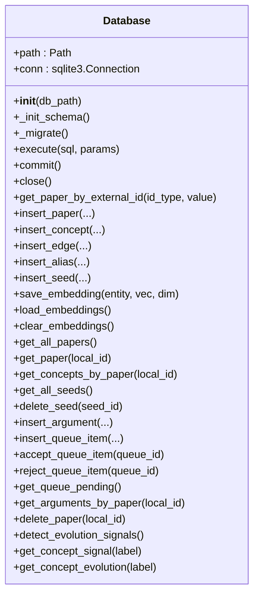
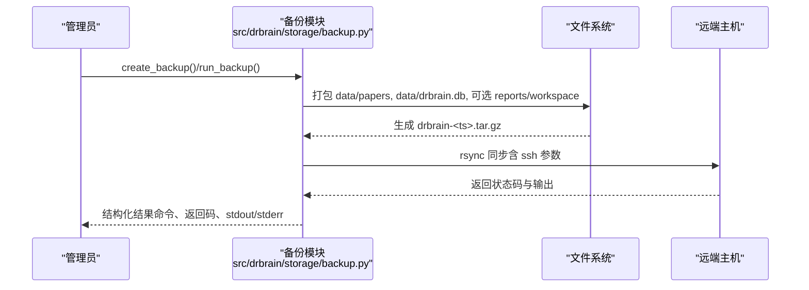
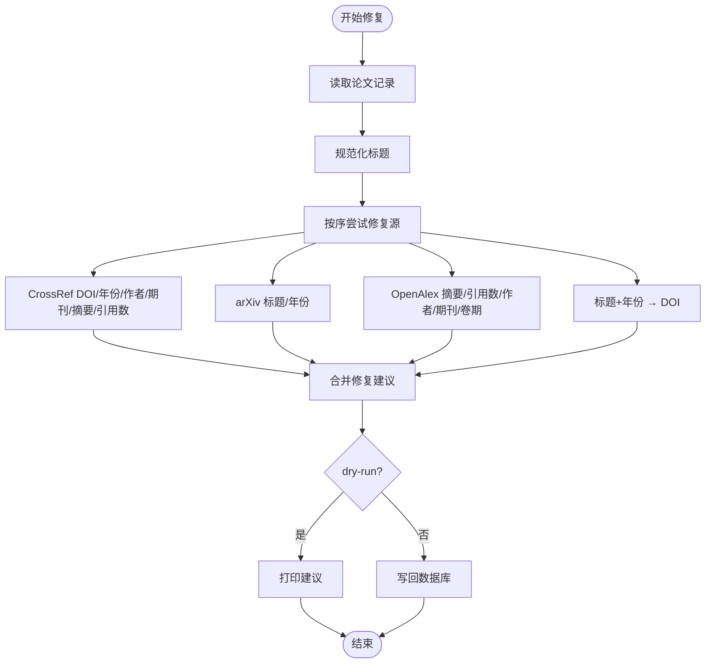
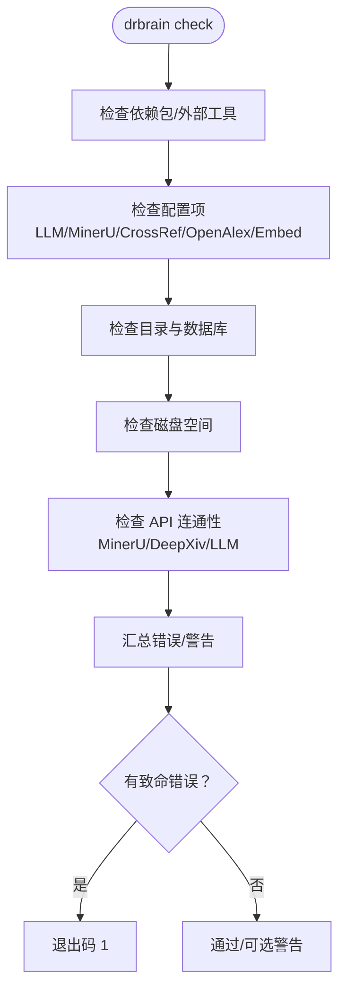
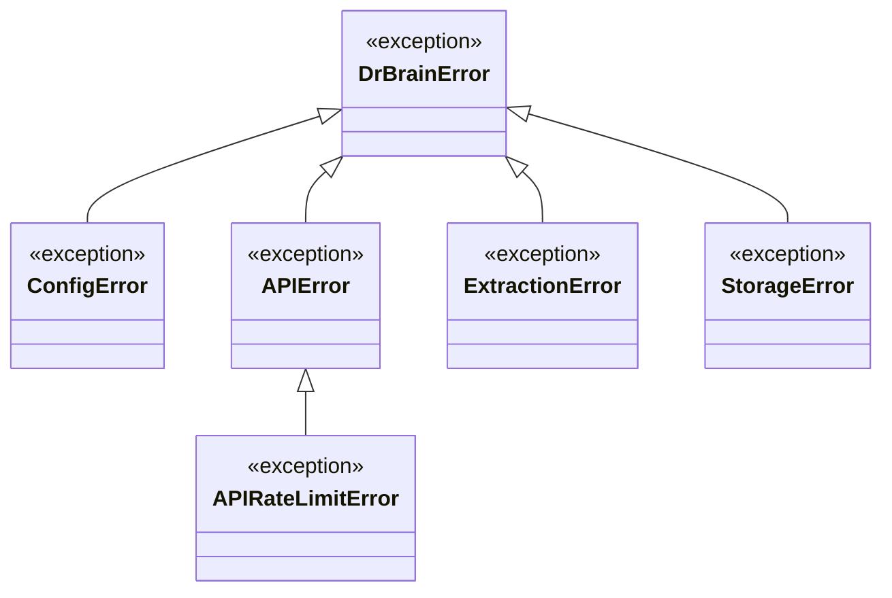
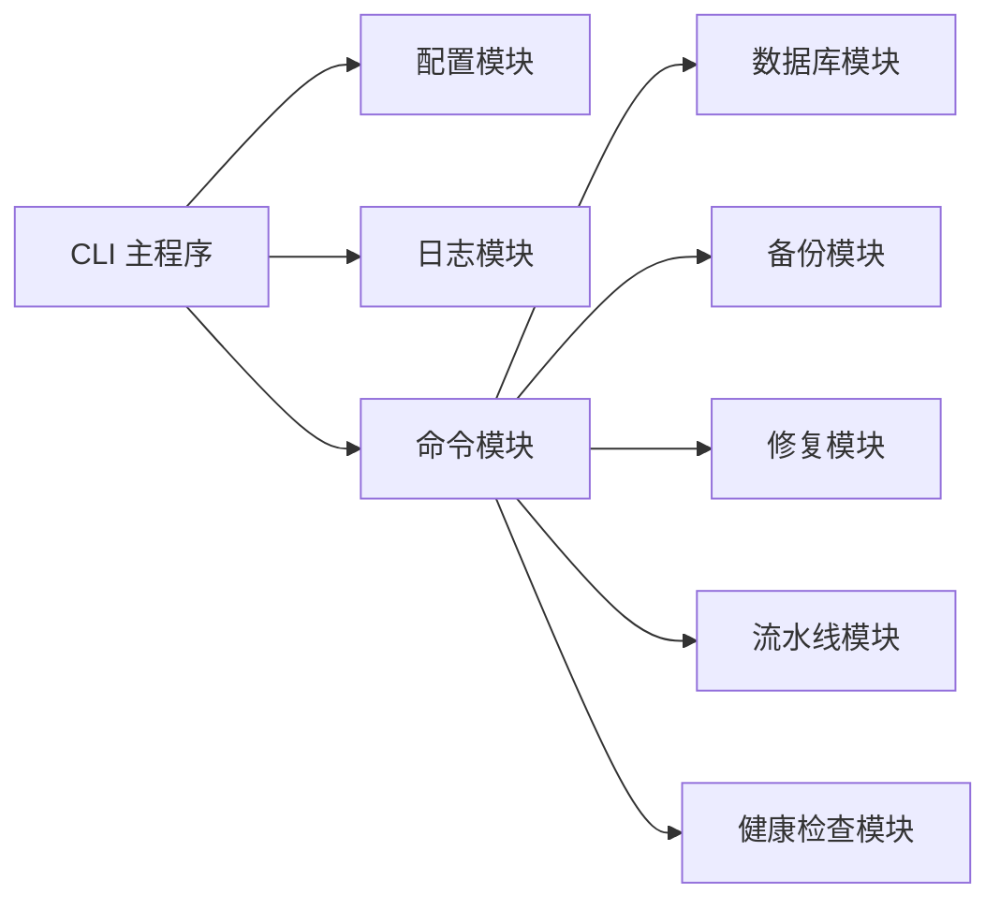

# 故障排除

<cite>
**本文引用的文件**
- [README.md](file://README.md)
- [docs/troubleshooting.md](file://docs/troubleshooting.md)
- [src/drbrain/cli/main.py](file://src/drbrain/cli/main.py)
- [src/drbrain/config.py](file://src/drbrain/config.py)
- [config.yaml](file://config.yaml)
- [config.example.yaml](file://config.example.yaml)
- [src/drbrain/log.py](file://src/drbrain/log.py)
- [src/drbrain/exceptions.py](file://src/drbrain/exceptions.py)
- [src/drbrain/storage/database.py](file://src/drbrain/storage/database.py)
- [src/drbrain/storage/backup.py](file://src/drbrain/storage/backup.py)
- [src/drbrain/services/repair.py](file://src/drbrain/services/repair.py)
- [src/drbrain/services/pipeline.py](file://src/drbrain/services/pipeline.py)
- [src/drbrain/cli/check_commands.py](file://src/drbrain/cli/check_commands.py)
- [scripts/setup.sh](file://scripts/setup.sh)
- [scripts/batch_ingest.sh](file://scripts/batch_ingest.sh)
</cite>

## 目录
1. [简介](#简介)
2. [项目结构](#项目结构)
3. [核心组件](#核心组件)
4. [架构总览](#架构总览)
5. [详细组件分析](#详细组件分析)
6. [依赖关系分析](#依赖关系分析)
7. [性能考虑](#性能考虑)
8. [故障排除指南](#故障排除指南)
9. [结论](#结论)
10. [附录](#附录)

## 简介
本指南面向 DrBrain 用户与运维人员，聚焦于安装、配置、运行时异常、性能问题、日志与调试、恢复与数据修复、监控与分析、以及紧急处置与技术支持流程。文档基于仓库内实际实现与官方故障排除文档整理，提供可操作的诊断步骤与修复建议。

## 项目结构
DrBrain 采用命令行驱动的模块化架构：CLI 负责入口与参数解析，配置加载与环境初始化在回调中完成；各功能通过子命令组织（如 ingest、build、embed、repair、backup 等）；底层由数据库与文件系统承载数据持久化；日志统一由 loguru 管理；异常体系提供清晰的错误分类。

**图表来源**
- [src/drbrain/cli/main.py:1-150](file://src/drbrain/cli/main.py#L1-L150)
- [src/drbrain/config.py:1-292](file://src/drbrain/config.py#L1-L292)
- [src/drbrain/log.py:1-68](file://src/drbrain/log.py#L1-L68)
- [src/drbrain/storage/database.py:1-775](file://src/drbrain/storage/database.py#L1-L775)
- [src/drbrain/storage/backup.py:1-240](file://src/drbrain/storage/backup.py#L1-L240)
- [src/drbrain/services/repair.py:1-337](file://src/drbrain/services/repair.py#L1-L337)
- [src/drbrain/services/pipeline.py:1-109](file://src/drbrain/services/pipeline.py#L1-L109)
- [src/drbrain/cli/check_commands.py:1-629](file://src/drbrain/cli/check_commands.py#L1-L629)

**章节来源**
- [src/drbrain/cli/main.py:1-150](file://src/drbrain/cli/main.py#L1-L150)
- [src/drbrain/config.py:1-292](file://src/drbrain/config.py#L1-L292)
- [src/drbrain/log.py:1-68](file://src/drbrain/log.py#L1-L68)

## 核心组件
- 配置系统：支持 base/local 叠加、环境变量占位符解析、类型化配置对象，覆盖 LLM、MinerU、API、目录、数据库、提取并发、检索参数、抓取、嵌入、备份等。
- 日志系统：loguru 统一输出，控制台与文件轮转，会话级标识，支持 DEBUG 级别。
- 数据库：SQLite 封装，自动建表与迁移，提供论文、概念、论元、边、别名、向量、队列、种子等表与常用查询。
- 备份：本地 tar.gz 归档与 rsync 远程同步，支持目标配置校验、免交互密码、压缩与模式选择。
- 元数据修复：多源回填（CrossRef、arXiv、OpenAlex、标题年份），规范化标题，批量更新数据库。
- 健康检查：依赖包、外部工具、配置项、目录、数据库、磁盘空间、API 连通性、LLM 可达性等。
- 流水线：预设与自定义步骤，按作用域（收件箱/论文/全局）执行。

**章节来源**
- [src/drbrain/config.py:182-292](file://src/drbrain/config.py#L182-L292)
- [src/drbrain/log.py:32-68](file://src/drbrain/log.py#L32-L68)
- [src/drbrain/storage/database.py:159-258](file://src/drbrain/storage/database.py#L159-L258)
- [src/drbrain/storage/backup.py:26-240](file://src/drbrain/storage/backup.py#L26-L240)
- [src/drbrain/services/repair.py:265-337](file://src/drbrain/services/repair.py#L265-L337)
- [src/drbrain/cli/check_commands.py:24-427](file://src/drbrain/cli/check_commands.py#L24-L427)
- [src/drbrain/services/pipeline.py:53-109](file://src/drbrain/services/pipeline.py#L53-L109)

## 架构总览
DrBrain 的命令行入口在主程序中注册所有子命令，并在每次调用前完成日志与配置初始化。命令根据职责分层：数据处理（导入/构建/嵌入/闭包）、查询与索引、导出与报告、维护（清理/备份/修复/审计）、工作区管理等。

**图表来源**
- [src/drbrain/cli/main.py:80-92](file://src/drbrain/cli/main.py#L80-L92)
- [src/drbrain/config.py:283-292](file://src/drbrain/config.py#L283-L292)
- [src/drbrain/log.py:32-60](file://src/drbrain/log.py#L32-L60)

**章节来源**
- [src/drbrain/cli/main.py:77-147](file://src/drbrain/cli/main.py#L77-L147)

## 详细组件分析

### 配置加载与环境初始化
- 配置优先级：config.local.yaml > config.yaml > 环境变量（${VAR} 占位符解析）。
- 关键配置项：LLM 模型链、MinerU 参数、API 密钥、目录路径、数据库路径、提取并发、检索 BM25 参数、抓取并发与超时、嵌入模型与设备、备份目标等。
- 初始化：CLI 回调中加载配置并记录会话 ID，便于日志关联。

**图表来源**
- [src/drbrain/config.py:195-244](file://src/drbrain/config.py#L195-L244)
- [src/drbrain/config.py:264-278](file://src/drbrain/config.py#L264-L278)
- [src/drbrain/cli/main.py:80-92](file://src/drbrain/cli/main.py#L80-L92)

**章节来源**
- [src/drbrain/config.py:182-292](file://src/drbrain/config.py#L182-L292)
- [src/drbrain/cli/main.py:80-92](file://src/drbrain/cli/main.py#L80-L92)

### 数据库与迁移
- 自动建表与 WAL 模式，启用外键约束。
- 迁移版本表 schema_versions，按序号顺序应用迁移，失败时可回滚或从备份恢复。
- 提供论文、概念、论元、边、别名、向量、队列、种子等表的增删改查与统计接口。

**图表来源**
- [src/drbrain/storage/database.py:159-258](file://src/drbrain/storage/database.py#L159-L258)
- [src/drbrain/storage/database.py:259-775](file://src/drbrain/storage/database.py#L259-L775)

**章节来源**
- [src/drbrain/storage/database.py:159-258](file://src/drbrain/storage/database.py#L159-L258)

### 备份与远程同步
- 本地备份：打包 papers、db、可选 workspace 与 reports，生成带时间戳的 tar.gz。
- 远程同步：基于 rsync + ssh，支持压缩、追加模式、排除规则、凭据注入与免交互密码。
- 目标校验：缺失 host/path 或禁用目标将抛出配置错误。

**图表来源**
- [src/drbrain/storage/backup.py:26-64](file://src/drbrain/storage/backup.py#L26-L64)
- [src/drbrain/storage/backup.py:171-240](file://src/drbrain/storage/backup.py#L171-L240)

**章节来源**
- [src/drbrain/storage/backup.py:26-240](file://src/drbrain/storage/backup.py#L26-L240)

### 元数据修复
- 多源回填：CrossRef（DOI）、arXiv（标题/年份）、OpenAlex（摘要/引用数/作者/期刊/卷期）、标题+年份反查 DOI。
- 规范化：统一大小写、去除 arXiv 前缀、缩写处理。
- 应用：dry-run 模式先展示修复建议，再按需写回数据库。

**图表来源**
- [src/drbrain/services/repair.py:265-337](file://src/drbrain/services/repair.py#L265-L337)
- [src/drbrain/services/repair.py:58-242](file://src/drbrain/services/repair.py#L58-L242)

**章节来源**
- [src/drbrain/services/repair.py:265-337](file://src/drbrain/services/repair.py#L265-L337)

### 健康检查与诊断
- 依赖包与外部工具：检查 Python 包、MinerU CLI、PyMuPDF 可用性。
- 配置项：LLM 模型链、MinerU Token、CrossRef/OpenAlex Token、嵌入提供商与密钥。
- 目录与数据库：存在性与创建、首次使用提示。
- 磁盘空间：data/ 空间阈值告警。
- API 连通性：MinerU API、DeepXiv、LLM completion 可达性测试。
- 总结：错误/警告分级汇总，必要时退出非零码。

**图表来源**
- [src/drbrain/cli/check_commands.py:24-427](file://src/drbrain/cli/check_commands.py#L24-L427)

**章节来源**
- [src/drbrain/cli/check_commands.py:24-427](file://src/drbrain/cli/check_commands.py#L24-L427)

### 异常与错误类型
- DrBrainError：所有 DrBrain 错误的基类。
- ConfigError：配置加载或校验错误。
- APIError：外部 API 调用失败。
- APIRateLimitError：外部 API 限流。
- ExtractionError：抽取阶段失败。
- StorageError：数据库或文件存储错误。

**图表来源**
- [src/drbrain/exceptions.py:6-28](file://src/drbrain/exceptions.py#L6-L28)

**章节来源**
- [src/drbrain/exceptions.py:6-28](file://src/drbrain/exceptions.py#L6-L28)

## 依赖关系分析
- CLI 依赖配置与日志初始化，再分发到具体命令。
- 命令实现依赖数据库、备份、修复、流水线与检查模块。
- 配置模块负责类型化与环境变量解析。
- 日志模块提供统一输出与会话标识。

**图表来源**
- [src/drbrain/cli/main.py:1-150](file://src/drbrain/cli/main.py#L1-L150)
- [src/drbrain/config.py:1-292](file://src/drbrain/config.py#L1-L292)
- [src/drbrain/log.py:1-68](file://src/drbrain/log.py#L1-L68)
- [src/drbrain/storage/database.py:1-775](file://src/drbrain/storage/database.py#L1-L775)
- [src/drbrain/storage/backup.py:1-240](file://src/drbrain/storage/backup.py#L1-L240)
- [src/drbrain/services/repair.py:1-337](file://src/drbrain/services/repair.py#L1-L337)
- [src/drbrain/services/pipeline.py:1-109](file://src/drbrain/services/pipeline.py#L1-L109)
- [src/drbrain/cli/check_commands.py:1-629](file://src/drbrain/cli/check_commands.py#L1-L629)

**章节来源**
- [src/drbrain/cli/main.py:1-150](file://src/drbrain/cli/main.py#L1-L150)

## 性能考虑
- 并发与批处理：提取并发、抓取并发、嵌入批大小、向量搜索 top_k。
- 设备与内存：嵌入设备选择（CPU/GPU），OOM 时降低批大小或切换 CPU。
- 网络与速率限制：LLM/外部 API 限流，增加备用模型与重试策略。
- 索引与检索：BM25 参数调整，树形向量检索减少无关片段。
- I/O 与缓存：合理设置 API 缓存 TTL，清理过期缓存。

[本节为通用指导，无需特定文件引用]

## 故障排除指南

### 安装与环境问题
- 模块未找到（ModuleNotFoundError: No module named 'drbrain'）
  - 现象：Python 导入失败。
  - 排查：确认已执行可编辑安装。
  - 处理：重新执行可编辑安装。
  - 参考：[docs/troubleshooting.md:7-13](file://docs/troubleshooting.md#L7-L13)

- CLI 命令不可用（drbrain: command not found）
  - 现象：终端找不到 drbrain 命令。
  - 排查：确认安装与 PATH 设置。
  - 处理：重新安装并检查可执行路径。
  - 参考：[docs/troubleshooting.md:15-22](file://docs/troubleshooting.md#L15-L22)

- 配置文件缺失
  - 现象：启动时报配置不存在。
  - 排查：确认 config.yaml 是否存在，必要时复制示例配置并运行 setup。
  - 处理：复制示例配置并执行交互式 setup。
  - 参考：[docs/troubleshooting.md:24-32](file://docs/troubleshooting.md#L24-L32)

- 安装脚本与批量处理
  - 使用仓库提供的安装脚本进行依赖与 MinerU CLI 安装。
  - 使用批量脚本对目录内 PDF 批量执行导入与统计。
  - 参考：[scripts/setup.sh:1-24](file://scripts/setup.sh#L1-L24)，[scripts/batch_ingest.sh:1-17](file://scripts/batch_ingest.sh#L1-L17)

**章节来源**
- [docs/troubleshooting.md:7-32](file://docs/troubleshooting.md#L7-L32)
- [scripts/setup.sh:1-24](file://scripts/setup.sh#L1-L24)
- [scripts/batch_ingest.sh:1-17](file://scripts/batch_ingest.sh#L1-L17)

### 配置错误
- LLM 模型链与密钥
  - 现象：All models failed/超时。
  - 排查：检查配置中的模型列表、API 密钥是否使用环境变量占位符、网络可达性、超时设置。
  - 处理：补充密钥、增加备用模型、提高超时。
  - 参考：[docs/troubleshooting.md:63-72](file://docs/troubleshooting.md#L63-L72)，[config.yaml:7-12](file://config.yaml#L7-L12)，[config.example.yaml:12-66](file://config.example.yaml#L12-L66)

- API 限流（429）
  - 现象：外部 API 返回 429。
  - 排查：检查速率限制与配额。
  - 处理：增加备用模型、降低并发、配置更高限额或令牌。
  - 参考：[docs/troubleshooting.md:73-78](file://docs/troubleshooting.md#L73-L78)

- MinerU 令牌与网络
  - 现象：MinerU API 不可达或超时。
  - 排查：检查 MinerU token、网络访问。
  - 处理：修正 token、网络代理或降级至 PyMuPDF。
  - 参考：[docs/troubleshooting.md:38-44](file://docs/troubleshooting.md#L38-L44)，[config.yaml:14-20](file://config.yaml#L14-L20)

- 嵌入模型下载与设备
  - 现象：模型下载卡住、CUDA OOM。
  - 排查：下载源、GPU 驱动、显存。
  - 处理：切换下载源、设置设备为 CPU、降低批大小。
  - 参考：[docs/troubleshooting.md:109-122](file://docs/troubleshooting.md#L109-L122)，[config.yaml:61-72](file://config.yaml#L61-L72)

- 环境变量与占位符
  - 现象：配置中出现 ${ENV_VAR} 未解析。
  - 排查：确认环境变量是否设置。
  - 处理：在 shell 中导出相应变量或在本地配置中填写。
  - 参考：[config.example.yaml:5-7](file://config.example.yaml#L5-L7)，[src/drbrain/config.py:264-278](file://src/drbrain/config.py#L264-L278)

**章节来源**
- [docs/troubleshooting.md:38-78](file://docs/troubleshooting.md#L38-L78)
- [config.yaml:7-72](file://config.yaml#L7-L72)
- [config.example.yaml:5-145](file://config.example.yaml#L5-L145)
- [src/drbrain/config.py:264-278](file://src/drbrain/config.py#L264-L278)

### 运行时异常
- 数据库被锁
  - 现象：SQLite 被锁。
  - 排查：确认无其他进程持有写锁，WAL 文件正常。
  - 处理：终止挂起进程，避免删除 WAL/SHM 文件。
  - 参考：[docs/troubleshooting.md:89-96](file://docs/troubleshooting.md#L89-L96)

- 模式迁移失败
  - 现象：迁移版本表异常或迁移中断。
  - 排查：查看 schema_versions 当前版本。
  - 处理：从备份恢复，提交问题时附上版本与日志。
  - 参考：[docs/troubleshooting.md:97-104](file://docs/troubleshooting.md#L97-L104)，[src/drbrain/storage/database.py:175-201](file://src/drbrain/storage/database.py#L175-L201)

- LLM JSON 解析错误
  - 现象：模型返回非标准 JSON。
  - 排查：查看日志中的原始响应。
  - 处理：更换模型或优化提示词，确保结构化输出。
  - 参考：[docs/troubleshooting.md:79-84](file://docs/troubleshooting.md#L79-L84)

**章节来源**
- [docs/troubleshooting.md:89-104](file://docs/troubleshooting.md#L89-L104)
- [src/drbrain/storage/database.py:175-201](file://src/drbrain/storage/database.py#L175-L201)

### 日志记录与调试
- 日志位置与会话
  - 应用日志：data/logs/drbrain.log，包含 session_id。
  - LLM 调用指标：data/metrics.db 的 llm_calls 表。
  - API 缓存：data/cache/（可安全删除）。
  - 参考：[docs/troubleshooting.md:154-164](file://docs/troubleshooting.md#L154-L164)

- 提高日志级别
  - 使用环境变量 LOGURU_LEVEL=DEBUG 运行命令以获取更详细日志。
  - 参考：[docs/troubleshooting.md:165-172](file://docs/troubleshooting.md#L165-L172)

- 日志初始化
  - CLI 回调中调用 setup_logging，输出到文件与 stderr，包含会话标识。
  - 参考：[src/drbrain/cli/main.py:80-92](file://src/drbrain/cli/main.py#L80-L92)，[src/drbrain/log.py:32-60](file://src/drbrain/log.py#L32-L60)

**章节来源**
- [docs/troubleshooting.md:154-172](file://docs/troubleshooting.md#L154-L172)
- [src/drbrain/cli/main.py:80-92](file://src/drbrain/cli/main.py#L80-L92)
- [src/drbrain/log.py:32-60](file://src/drbrain/log.py#L32-L60)

### 恢复与数据修复
- 从备份恢复
  - 本地备份：drbrain backup 生成 tar.gz，解压即可恢复。
  - 参考：[docs/troubleshooting.md:177-184](file://docs/troubleshooting.md#L177-L184)

- 重建搜索索引
  - 使用 drbrain index 重建索引。
  - 参考：[docs/troubleshooting.md:185-189](file://docs/troubleshooting.md#L185-L189)

- 清理并重置
  - drbrain clean 删除 DB、缓存、日志、论文、报告，保留收件箱；随后 drbrain setup --quick 初始化，再 drbrain index。
  - 参考：[docs/troubleshooting.md:191-198](file://docs/troubleshooting.md#L191-L198)

- 元数据修复
  - 使用 repair 服务对单篇或多篇论文进行多源回填与规范化，支持 dry-run。
  - 参考：[src/drbrain/services/repair.py:265-337](file://src/drbrain/services/repair.py#L265-L337)

**章节来源**
- [docs/troubleshooting.md:177-198](file://docs/troubleshooting.md#L177-L198)
- [src/drbrain/services/repair.py:265-337](file://src/drbrain/services/repair.py#L265-L337)

### 系统监控与性能分析
- 健康检查
  - drbrain check 检查依赖、配置、目录、数据库、磁盘、API 连通性与 LLM 可达性，汇总错误/警告。
  - 参考：[src/drbrain/cli/check_commands.py:24-427](file://src/drbrain/cli/check_commands.py#L24-L427)

- 指标与缓存
  - LLM 调用计数与指标存储在 data/metrics.db。
  - API 缓存位于 data/cache/，可清理以强制刷新。
  - 参考：[docs/troubleshooting.md:154-164](file://docs/troubleshooting.md#L154-L164)

- 性能调优
  - 调整并发与批大小、设备选择、网络与速率限制、BM25 参数、向量搜索 top_k。
  - 参考：[config.yaml:45-72](file://config.yaml#L45-L72)，[config.example.yaml:104-121](file://config.example.yaml#L104-L121)

**章节来源**
- [src/drbrain/cli/check_commands.py:24-427](file://src/drbrain/cli/check_commands.py#L24-L427)
- [docs/troubleshooting.md:154-164](file://docs/troubleshooting.md#L154-L164)
- [config.yaml:45-72](file://config.yaml#L45-L72)
- [config.example.yaml:104-121](file://config.example.yaml#L104-L121)

### 紧急恢复与数据修复操作指南
- 紧急恢复
  - 若数据库损坏或迁移失败：使用最近备份恢复；若无备份，尝试清理并重置后重新导入。
  - 参考：[docs/troubleshooting.md:177-198](file://docs/troubleshooting.md#L177-L198)

- 数据修复
  - 对缺失字段（摘要、作者、期刊、卷期、页码、引用数）进行多源回填；对标题进行规范化。
  - 参考：[src/drbrain/services/repair.py:265-337](file://src/drbrain/services/repair.py#L265-L337)

- 远程备份
  - 配置 rsync 目标，执行远程同步；支持压缩、追加模式与排除规则。
  - 参考：[src/drbrain/storage/backup.py:171-240](file://src/drbrain/storage/backup.py#L171-L240)

**章节来源**
- [docs/troubleshooting.md:177-198](file://docs/troubleshooting.md#L177-L198)
- [src/drbrain/services/repair.py:265-337](file://src/drbrain/services/repair.py#L265-L337)
- [src/drbrain/storage/backup.py:171-240](file://src/drbrain/storage/backup.py#L171-L240)

### 如何收集诊断信息与寻求技术支持
- 收集信息
  - 日志：data/logs/drbrain.log（含 session_id）。
  - 配置：config.yaml 与 config.local.yaml（敏感信息请脱敏）。
  - 环境：drbrain check 输出的依赖、配置、API 连通性摘要。
  - 参考：[docs/troubleshooting.md:154-172](file://docs/troubleshooting.md#L154-L172)，[src/drbrain/cli/check_commands.py:24-427](file://src/drbrain/cli/check_commands.py#L24-L427)

- 报告问题
  - 提供：版本信息、错误现象、日志片段、配置要点、最小复现步骤。
  - 参考：[docs/troubleshooting.md:103](file://docs/troubleshooting.md#L103)

**章节来源**
- [docs/troubleshooting.md:103](file://docs/troubleshooting.md#L103)
- [src/drbrain/cli/check_commands.py:24-427](file://src/drbrain/cli/check_commands.py#L24-L427)

## 结论
本指南基于 DrBrain 代码与官方故障排除文档，提供了从安装、配置、运行时异常到性能优化、日志调试、恢复与数据修复的完整排查路径。建议在日常运维中定期执行健康检查，关注日志与指标，合理配置并发与资源，遇到问题时按“定位-验证-修复-验证”的闭环流程推进，并在必要时利用备份快速恢复。

[本节为总结，无需特定文件引用]

## 附录
- 快速参考
  - 安装与初始化：可编辑安装、drbrain setup、drbrain check。
  - 常见问题：模块未找到、命令不可用、配置缺失、MinerU 不可达、LLM 失败、数据库锁、迁移失败、嵌入下载/显存问题。
  - 恢复手段：备份恢复、重建索引、清理重置、元数据修复。
  - 监控与分析：drbrain check、日志与指标、缓存与磁盘空间。
  - 参考：[README.md:24-36](file://README.md#L24-L36)，[docs/troubleshooting.md:1-198](file://docs/troubleshooting.md#L1-L198)

**章节来源**
- [README.md:24-36](file://README.md#L24-L36)
- [docs/troubleshooting.md:1-198](file://docs/troubleshooting.md#L1-L198)