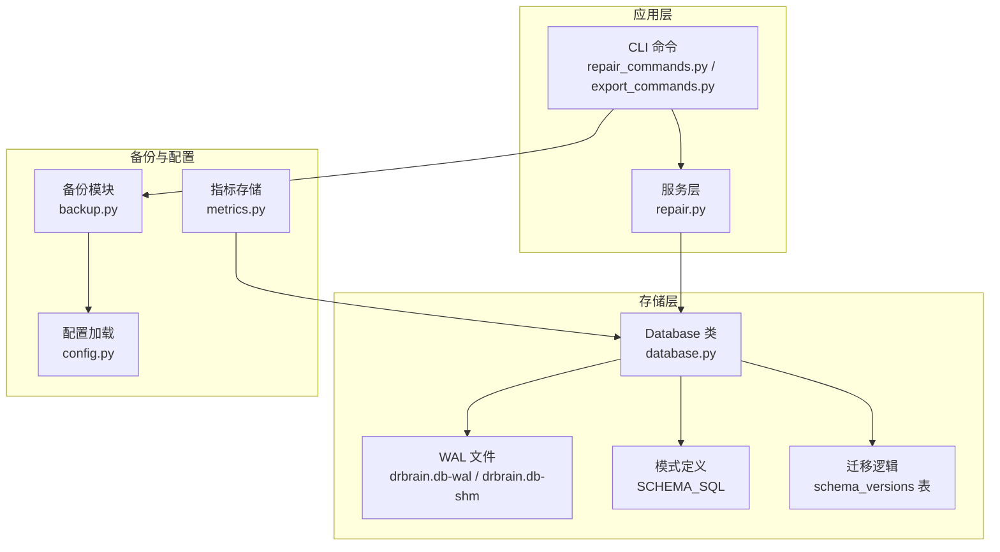
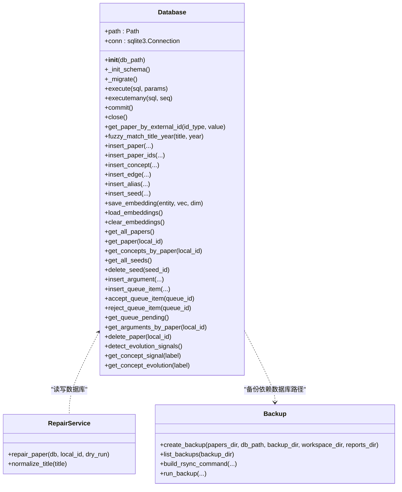
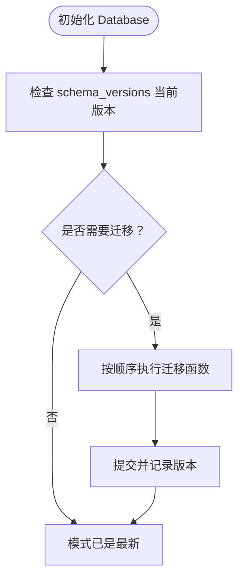
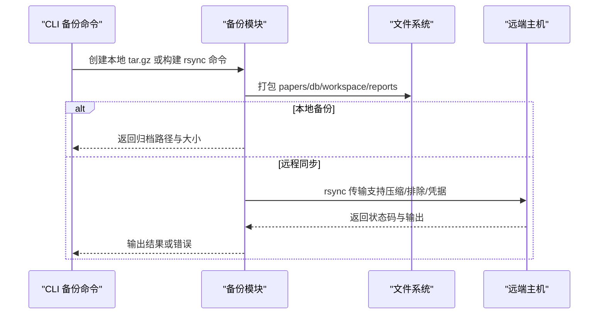
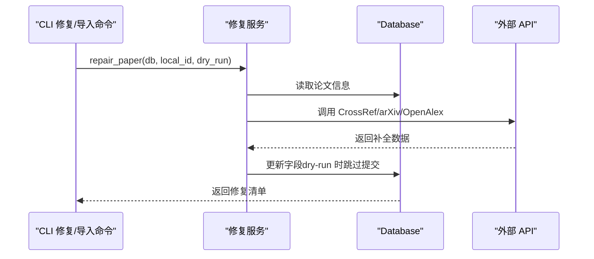
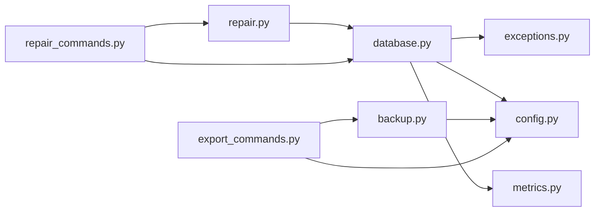

# 数据库问题

<cite>
**本文引用的文件**
- [database.py](file://src/drbrain/storage/database.py)
- [backup.py](file://src/drbrain/storage/backup.py)
- [repair.py](file://src/drbrain/services/repair.py)
- [repair_commands.py](file://src/drbrain/cli/repair_commands.py)
- [export_commands.py](file://src/drbrain/cli/export_commands.py)
- [config.py](file://src/drbrain/config.py)
- [exceptions.py](file://src/drbrain/exceptions.py)
- [metrics.py](file://src/drbrain/metrics.py)
- [paths.py](file://src/drbrain/storage/paths.py)
- [database-guidelines.md](file://.trellis/spec/backend/database-guidelines.md)
- [troubleshooting.md](file://docs/troubleshooting.md)
- [test_layer1_db_schema.py](file://tests/test_layer1_db_schema.py)
- [test_database_extended.py](file://tests/test_database_extended.py)
</cite>

## 目录
1. [简介](#简介)
2. [项目结构](#项目结构)
3. [核心组件](#核心组件)
4. [架构总览](#架构总览)
5. [详细组件分析](#详细组件分析)
6. [依赖分析](#依赖分析)
7. [性能考虑](#性能考虑)
8. [故障排除指南](#故障排除指南)
9. [结论](#结论)
10. [附录](#附录)

## 简介
本指南聚焦 DrBrain 的数据库相关问题与解决方案，覆盖以下主题：
- 数据库锁定（WAL 模式与并发读写）
- 模式迁移错误与版本管理
- SQLite WAL 文件处理与常见误解
- 备份与恢复流程（本地 tar.gz 与远程 rsync 同步）
- 进程冲突与锁清理
- 元数据修复与导入流程
- 性能优化与稳定性维护建议

本指南基于仓库中的实际实现与文档，提供可操作的诊断方法、恢复步骤与预防措施。

## 项目结构
DrBrain 使用单文件 SQLite 数据库（默认 data/drbrain.db），通过 WAL 模式提升并发读取能力；数据库模式在运行时自动初始化与迁移；备份模块支持本地压缩归档与远程 rsync 同步；元数据修复与导入通过 CLI 命令完成。

图示来源
- [database.py:159-258](file://src/drbrain/storage/database.py#L159-L258)
- [backup.py:26-63](file://src/drbrain/storage/backup.py#L26-L63)
- [repair.py:265-337](file://src/drbrain/services/repair.py#L265-L337)
- [repair_commands.py:14-76](file://src/drbrain/cli/repair_commands.py#L14-L76)
- [export_commands.py:283-392](file://src/drbrain/cli/export_commands.py#L283-L392)
- [config.py:80-82](file://src/drbrain/config.py#L80-L82)
- [metrics.py:49-95](file://src/drbrain/metrics.py#L49-L95)

章节来源
- [database.py:159-258](file://src/drbrain/storage/database.py#L159-L258)
- [backup.py:26-63](file://src/drbrain/storage/backup.py#L26-L63)
- [repair.py:265-337](file://src/drbrain/services/repair.py#L265-L337)
- [repair_commands.py:14-76](file://src/drbrain/cli/repair_commands.py#L14-L76)
- [export_commands.py:283-392](file://src/drbrain/cli/export_commands.py#L283-L392)
- [config.py:80-82](file://src/drbrain/config.py#L80-L82)
- [metrics.py:49-95](file://src/drbrain/metrics.py#L49-L95)

## 核心组件
- Database 类：封装 SQLite 连接、WAL 模式启用、外键约束、模式初始化与迁移、常用查询与写入接口。
- 备份模块：创建本地 tar.gz 归档与远程 rsync 同步，支持目标配置校验与命令构建。
- 元数据修复服务：基于 CrossRef、arXiv、OpenAlex 等源进行字段修复与增强。
- CLI 命令：提供 repair/import/enrich/backup 等子命令，串联数据库与外部服务。
- 配置系统：集中化路径与数据库位置配置，支持环境变量解析。
- 指标存储：独立 metrics.db 记录 LLM 调用与事件，同样使用 WAL 模式。

章节来源
- [database.py:159-775](file://src/drbrain/storage/database.py#L159-L775)
- [backup.py:26-240](file://src/drbrain/storage/backup.py#L26-L240)
- [repair.py:265-337](file://src/drbrain/services/repair.py#L265-L337)
- [repair_commands.py:14-76](file://src/drbrain/cli/repair_commands.py#L14-L76)
- [export_commands.py:283-392](file://src/drbrain/cli/export_commands.py#L283-L392)
- [config.py:80-82](file://src/drbrain/config.py#L80-L82)
- [metrics.py:49-95](file://src/drbrain/metrics.py#L49-L95)

## 架构总览
DrBrain 的数据库层采用“单文件 SQLite + WAL”设计，避免服务器依赖，适合个人研究工具。核心要点：
- WAL 模式：提升并发读取性能，减少写锁阻塞。
- 外键约束：开启 PRAGMA foreign_keys = ON，确保引用完整性。
- 自动迁移：schema_versions 表记录当前版本，按序执行增量迁移。
- 参数化查询：统一使用 ? 占位符，避免 SQL 注入。
- 并发策略：读多写少场景下，WAL 提供良好并发；仍需避免长时间事务与重复进程竞争。

图示来源
- [database.py:159-775](file://src/drbrain/storage/database.py#L159-L775)
- [backup.py:26-240](file://src/drbrain/storage/backup.py#L26-L240)
- [repair.py:265-337](file://src/drbrain/services/repair.py#L265-L337)

章节来源
- [database.py:159-775](file://src/drbrain/storage/database.py#L159-L775)
- [backup.py:26-240](file://src/drbrain/storage/backup.py#L26-L240)
- [repair.py:265-337](file://src/drbrain/services/repair.py#L265-L337)

## 详细组件分析

### 数据库类与模式管理
- 初始化与连接：构造函数中创建目录、建立连接、启用外键与 WAL 模式，并执行模式初始化与迁移。
- 模式定义：SCHEMA_SQL 中定义表结构与索引；迁移通过 schema_versions 版本号驱动，逐项增量添加列或索引。
- 查询与写入：提供参数化查询、批量插入、提交与关闭；包含论文、概念、论点、边、别名、种子、置信度队列等常用接口。
- 时间演化信号：基于年份与置信度统计，识别新兴、已建立、衰落、争议、复苏等信号。

图示来源
- [database.py:170-200](file://src/drbrain/storage/database.py#L170-L200)
- [database.py:181-198](file://src/drbrain/storage/database.py#L181-L198)

章节来源
- [database.py:159-775](file://src/drbrain/storage/database.py#L159-L775)
- [database-guidelines.md:22-34](file://.trellis/spec/backend/database-guidelines.md#L22-L34)
- [test_layer1_db_schema.py:115-178](file://tests/test_layer1_db_schema.py#L115-L178)

### 备份与恢复
- 本地备份：打包 papers、数据库、工作区与报告目录为 tar.gz，记录大小并输出日志。
- 远程同步：基于 rsync 与 SSH，支持压缩、排除规则、凭据注入与 dry-run 预演。
- 列表查看：按名称排序列出最近备份，便于选择恢复目标。
- 恢复流程：从 data/backups 下解压对应归档即可恢复。

图示来源
- [backup.py:26-63](file://src/drbrain/storage/backup.py#L26-L63)
- [backup.py:171-239](file://src/drbrain/storage/backup.py#L171-L239)
- [export_commands.py:283-392](file://src/drbrain/cli/export_commands.py#L283-L392)

章节来源
- [backup.py:26-240](file://src/drbrain/storage/backup.py#L26-L240)
- [export_commands.py:283-392](file://src/drbrain/cli/export_commands.py#L283-L392)

### 元数据修复与导入
- 修复流程：按 CrossRef → arXiv → 标题+年份 → OpenAlex 的顺序尝试修复标题、年份、DOI、期刊、摘要、引用数、作者、卷期页码等字段；支持 dry-run 预览。
- 导入流程：支持 Zotero、BibTeX、Endnote 三种源；先去重（基于 DOI），再写入数据库并复制 PDF；支持集合过滤与 API/本地两种模式。
- 增强流程：对缺失字段的论文进行 CrossRef 元数据补充与清洗可疑记录。

图示来源
- [repair.py:265-337](file://src/drbrain/services/repair.py#L265-L337)
- [repair_commands.py:14-76](file://src/drbrain/cli/repair_commands.py#L14-L76)

章节来源
- [repair.py:265-337](file://src/drbrain/services/repair.py#L265-L337)
- [repair_commands.py:77-341](file://src/drbrain/cli/repair_commands.py#L77-L341)

### 配置与路径
- 数据库路径：DBConfig.path 默认 data/drbrain.db，可通过配置覆盖。
- 目录路径：DirsConfig.papers、reports、cache、logs 等集中管理。
- 环境变量：配置加载时解析 ${VAR} 占位符，便于安全注入密钥与路径。

章节来源
- [config.py:80-82](file://src/drbrain/config.py#L80-L82)
- [config.py:70-77](file://src/drbrain/config.py#L70-L77)
- [config.py:283-292](file://src/drbrain/config.py#L283-L292)

### 指标存储与 WAL
- 独立 metrics.db：记录 LLM 调用与通用事件，同样启用 WAL 模式，保证并发写入稳定性。
- 迁移兼容：对旧版本列进行 idempotent 添加，避免重复迁移报错。

章节来源
- [metrics.py:49-95](file://src/drbrain/metrics.py#L49-L95)
- [test_metrics.py:217-227](file://tests/test_metrics.py#L217-L227)

## 依赖分析
- 组件耦合
  - Database 与各查询/写入接口高度内聚，对外暴露简洁方法。
  - 备份模块依赖配置中的路径与目标设置，CLI 命令负责编排。
  - 修复服务依赖外部 API 与数据库，遵循 dry-run 约定。
- 外部依赖
  - SQLite3（原生库）、Python 标准库（os、shlex、subprocess、tarfile、tempfile）。
  - 外部 API：CrossRef、arXiv、OpenAlex 等（由修复服务调用）。
- 循环依赖
  - 未发现循环导入；模块职责清晰。

图示来源
- [database.py:159-775](file://src/drbrain/storage/database.py#L159-L775)
- [backup.py:26-240](file://src/drbrain/storage/backup.py#L26-L240)
- [repair.py:265-337](file://src/drbrain/services/repair.py#L265-L337)
- [repair_commands.py:14-76](file://src/drbrain/cli/repair_commands.py#L14-L76)
- [export_commands.py:283-392](file://src/drbrain/cli/export_commands.py#L283-L392)
- [config.py:80-82](file://src/drbrain/config.py#L80-L82)
- [exceptions.py:6-28](file://src/drbrain/exceptions.py#L6-L28)
- [metrics.py:49-95](file://src/drbrain/metrics.py#L49-L95)

章节来源
- [database.py:159-775](file://src/drbrain/storage/database.py#L159-L775)
- [backup.py:26-240](file://src/drbrain/storage/backup.py#L26-L240)
- [repair.py:265-337](file://src/drbrain/services/repair.py#L265-L337)
- [repair_commands.py:14-76](file://src/drbrain/cli/repair_commands.py#L14-L76)
- [export_commands.py:283-392](file://src/drbrain/cli/export_commands.py#L283-L392)
- [config.py:80-82](file://src/drbrain/config.py#L80-L82)
- [exceptions.py:6-28](file://src/drbrain/exceptions.py#L6-L28)
- [metrics.py:49-95](file://src/drbrain/metrics.py#L49-L95)

## 性能考虑
- WAL 模式：并发读取友好，减少写锁争用；适合“读多写少”的研究工具场景。
- 索引策略：针对高频查询字段（如概念类型、标签、论点来源、边关系等）建立索引，降低扫描成本。
- 批量写入：使用 executemany 进行批量插入，减少往返开销。
- 事务边界：长流程拆分为多个小事务，避免长时间持有写锁。
- 外部 API 限流：合理配置并发与速率限制，避免触发外部服务限流导致的重试风暴。
- 指标存储：metrics.db 独立 WAL，避免与主库竞争；定期归档或清理历史事件以控制体积。

[本节为通用指导，无需特定文件引用]

## 故障排除指南

### 数据库锁定（WAL 模式）
- 症状：命令卡住、提示“数据库被锁定”。
- 根因：存在长时间事务、重复进程竞争写锁、或 WAL/共享内存文件异常。
- 解决步骤
  1) 确认 WAL 模式已启用（初始化时设置 PRAGMA journal_mode=WAL）。
  2) 不要删除 data/drbrain.db-wal 与 data/drbrain.db-shm，这些是正常 WAL 文件。
  3) 检查是否存在挂起的 drbrain 进程，结束它们后再试。
  4) 避免同时运行多个写入密集型任务；将导入/修复等写入操作串行化。
  5) 如仍失败，尝试重启应用并再次执行命令。

章节来源
- [troubleshooting.md:89-96](file://docs/troubleshooting.md#L89-L96)
- [database.py:166](file://src/drbrain/storage/database.py#L166)

### 模式迁移错误与版本管理
- 症状：启动时报错或功能异常，怀疑 schema 未正确升级。
- 根因：旧版本数据库缺少新字段或索引，迁移未成功。
- 解决步骤
  1) 检查 schema_versions 表当前版本号。
  2) 查看日志中的具体错误信息，定位失败的迁移步骤。
  3) 使用 drbrain backup 创建备份，然后恢复到上一个稳定版本。
  4) 若确认问题可复现，收集 schema 版本与错误日志并提交问题。
  5) 确保每次迁移后执行 commit，避免半途失败。

章节来源
- [troubleshooting.md:97-104](file://docs/troubleshooting.md#L97-L104)
- [database.py:175-200](file://src/drbrain/storage/database.py#L175-L200)
- [database-guidelines.md:22-34](file://.trellis/spec/backend/database-guidelines.md#L22-L34)
- [test_layer1_db_schema.py:115-178](file://tests/test_layer1_db_schema.py#L115-L178)

### SQLite WAL 文件处理
- 说明：data/drbrain.db-wal 与 data/drbrain.db-shm 是 SQLite WAL 的正常组成部分，不要手动删除。
- 排查：若出现异常，先确认 WAL 文件存在且大小合理；必要时重启应用释放锁。

章节来源
- [troubleshooting.md:94](file://docs/troubleshooting.md#L94)

### 备份与恢复
- 本地备份：drbrain backup 创建 data/backups/drbrain-<timestamp>.tar.gz，包含 papers、db、workspace、reports。
- 远程同步：drbrain backup --target <name> 使用 rsync 同步至配置的目标；支持 --dry-run 预演。
- 恢复：从 data/backups 解压对应归档，覆盖现有数据目录。

章节来源
- [backup.py:26-63](file://src/drbrain/storage/backup.py#L26-L63)
- [backup.py:171-239](file://src/drbrain/storage/backup.py#L171-L239)
- [export_commands.py:283-392](file://src/drbrain/cli/export_commands.py#L283-L392)
- [troubleshooting.md:177-184](file://docs/troubleshooting.md#L177-L184)

### 进程冲突与锁清理
- 症状：命令无法获取锁、数据库被占用。
- 步骤
  1) 结束所有 drbrain 相关进程。
  2) 检查 data/ 目录权限，确保应用有读写权限。
  3) 重启应用后重试命令。

章节来源
- [troubleshooting.md:95](file://docs/troubleshooting.md#L95)

### 元数据修复与导入问题
- 修复失败：检查网络连通性与 API 凭据；查看日志中异常堆栈；必要时使用 --dry-run 预览修复项。
- 导入失败：确认源文件存在且格式正确；Zotero API 模式需提供库 ID 与密钥；BibTeX/Endnote 需匹配扩展名。
- 去重策略：导入前会扫描现有 DOI，避免重复；如需强制导入，可先清理重复或调整策略。

章节来源
- [repair.py:265-337](file://src/drbrain/services/repair.py#L265-L337)
- [repair_commands.py:77-341](file://src/drbrain/cli/repair_commands.py#L77-L341)
- [troubleshooting.md:87-104](file://docs/troubleshooting.md#L87-L104)

### 性能优化与稳定性维护
- 使用 WAL：确保 PRAGMA journal_mode=WAL 已生效（初始化时设置）。
- 合理索引：根据查询模式增加必要索引，避免全表扫描。
- 控制并发：降低并发度或分批处理，避免外部 API 限流与内部锁竞争。
- 定期备份：建立自动化备份策略，确保可快速恢复。
- 日志与监控：利用 data/logs 与 metrics.db 观察异常与瓶颈。

章节来源
- [database.py:166](file://src/drbrain/storage/database.py#L166)
- [metrics.py:49-95](file://src/drbrain/metrics.py#L49-L95)
- [troubleshooting.md:154-172](file://docs/troubleshooting.md#L154-L172)

## 结论
DrBrain 的数据库层以 SQLite+WAL 为核心，结合自动迁移、参数化查询与完善的备份机制，满足个人研究工具的高可用与易维护需求。遇到数据库问题时，优先检查 WAL 文件、进程冲突与迁移状态；通过备份与恢复流程快速回滚；配合修复与导入命令完善元数据质量。遵循本文提供的诊断与优化建议，可显著提升系统稳定性与性能。

[本节为总结性内容，无需特定文件引用]

## 附录
- 常用命令参考
  - 修复元数据：drbrain repair [--all | --workspace | <local_id>] [--dry-run] [--json]
  - 导入文献：drbrain import <zotero|bibtex|endnote> <path> [--dry-run] [--json] [其他选项]
  - 增强元数据：drbrain enrich [--all | <local_id>] [--dry-run] [--json]
  - 备份：drbrain backup [--list | --output <path> | --target <name> | --dry-run | --json]
- 关键路径
  - 数据库文件：data/drbrain.db
  - 备份目录：data/backups/
  - 论文目录：data/papers/<local_id>/
  - 指标数据库：data/metrics.db

[本节为概览性内容，无需特定文件引用]