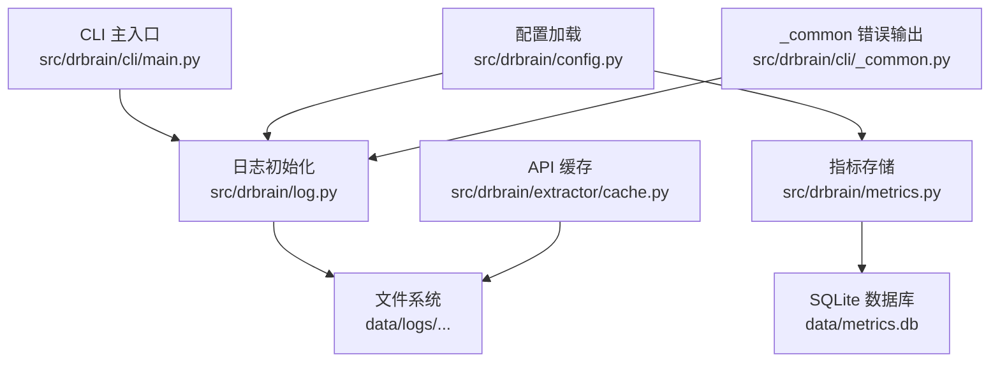
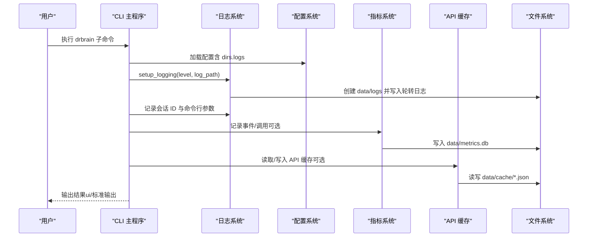
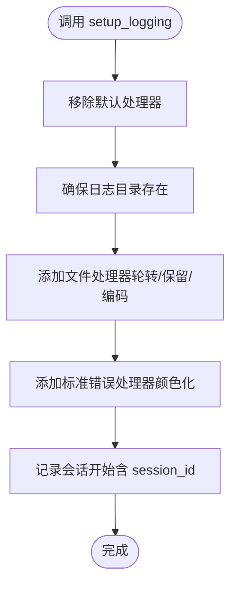
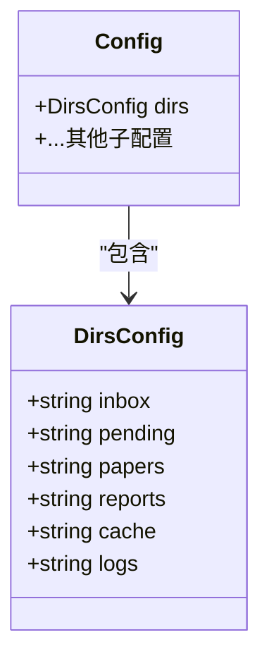
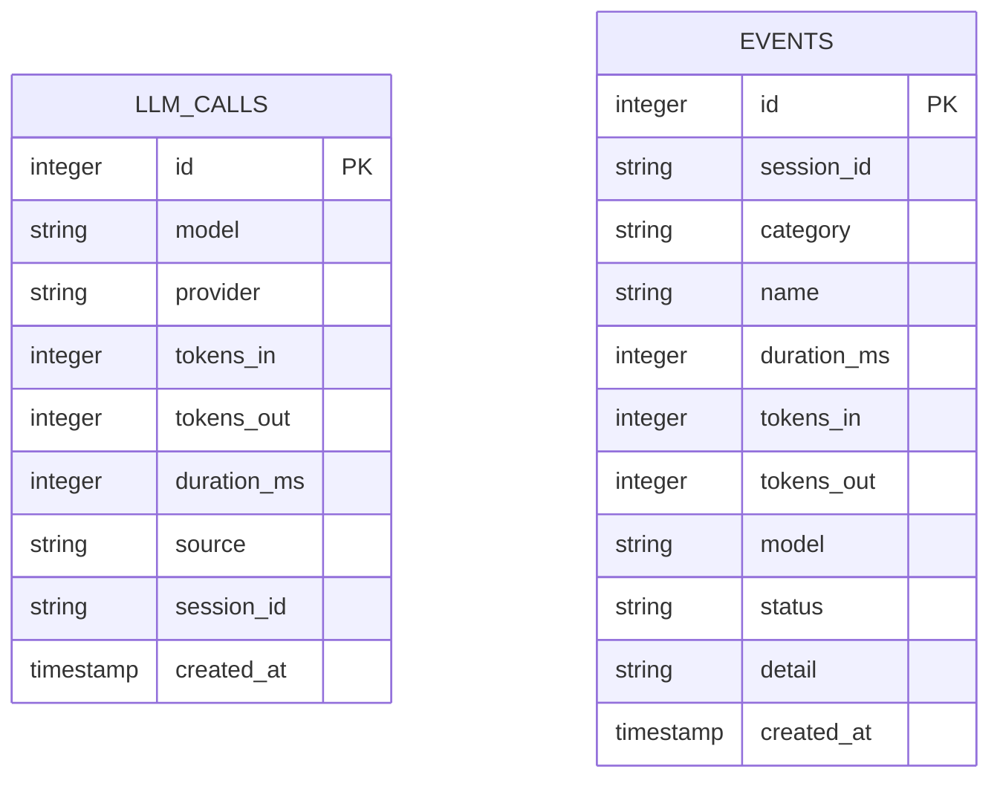
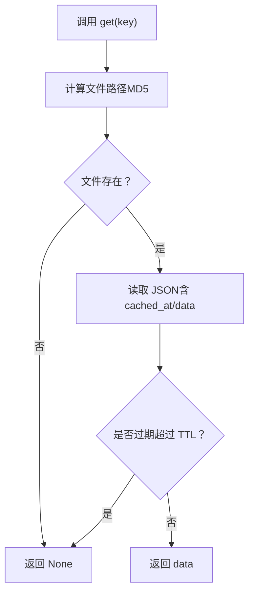
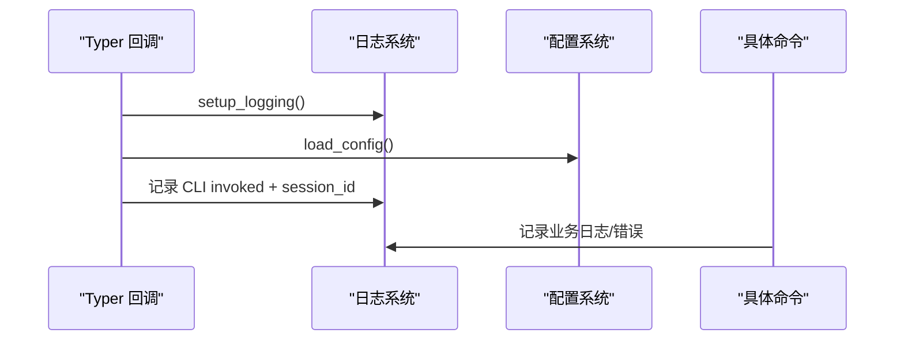
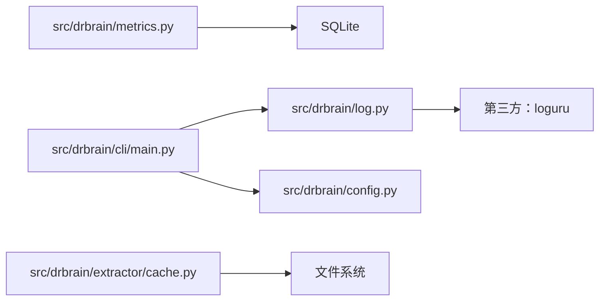

# 日志与调试

<cite>
**本文引用的文件**
- [src/drbrain/log.py](file://src/drbrain/log.py)
- [src/drbrain/config.py](file://src/drbrain/config.py)
- [config.yaml](file://config.yaml)
- [config.example.yaml](file://config.example.yaml)
- [.trellis/spec/backend/logging-guidelines.md](file://.trellis/spec/backend/logging-guidelines.md)
- [docs/troubleshooting.md](file://docs/troubleshooting.md)
- [src/drbrain/metrics.py](file://src/drbrain/metrics.py)
- [src/drbrain/extractor/cache.py](file://src/drbrain/extractor/cache.py)
- [src/drbrain/cli/main.py](file://src/drbrain/cli/main.py)
- [src/drbrain/cli/_common.py](file://src/drbrain/cli/_common.py)
- [tests/test_log.py](file://tests/test_log.py)
- [tests/test_metrics.py](file://tests/test_metrics.py)
- [tests/test_api_cache.py](file://tests/test_api_cache.py)
- [uv.lock](file://uv.lock)
</cite>

## 目录
1. [简介](#简介)
2. [项目结构](#项目结构)
3. [核心组件](#核心组件)
4. [架构总览](#架构总览)
5. [详细组件分析](#详细组件分析)
6. [依赖分析](#依赖分析)
7. [性能考虑](#性能考虑)
8. [故障排除指南](#故障排除指南)
9. [结论](#结论)
10. [附录](#附录)

## 简介
本指南面向 DrBrain 的开发者与运维人员，提供系统化的日志记录与调试方法。内容覆盖日志文件位置、日志级别配置、会话 ID 跟踪、结构化日志分析、LLM 调用跟踪、API 缓存检查、性能监控与问题定位等主题，并给出可操作的工具与实践建议。

## 项目结构
DrBrain 的日志与调试能力由以下模块协同实现：
- 日志初始化与格式：src/drbrain/log.py
- 配置加载与目录路径：src/drbrain/config.py、config.yaml、config.example.yaml
- 日志规范与模块前缀约定：.trellis/spec/backend/logging-guidelines.md
- 故障排除与日志位置指引：docs/troubleshooting.md
- LLM 调用与通用事件指标：src/drbrain/metrics.py
- API 响应缓存（含 TTL）：src/drbrain/extractor/cache.py
- CLI 入口与会话 ID 注入：src/drbrain/cli/main.py
- 错误输出与通用错误记录：src/drbrain/cli/_common.py
- 测试用例验证日志行为：tests/test_log.py、tests/test_metrics.py、tests/test_api_cache.py
- 第三方依赖版本：uv.lock（loguru）

图表来源
- [src/drbrain/cli/main.py:80-91](file://src/drbrain/cli/main.py#L80-L91)
- [src/drbrain/log.py:32-67](file://src/drbrain/log.py#L32-L67)
- [src/drbrain/config.py:182-194](file://src/drbrain/config.py#L182-L194)
- [src/drbrain/metrics.py:14-46](file://src/drbrain/metrics.py#L14-L46)
- [src/drbrain/extractor/cache.py:14-65](file://src/drbrain/extractor/cache.py#L14-L65)
- [src/drbrain/cli/_common.py:363-368](file://src/drbrain/cli/_common.py#L363-L368)

章节来源
- [src/drbrain/log.py:1-68](file://src/drbrain/log.py#L1-L68)
- [src/drbrain/config.py:182-194](file://src/drbrain/config.py#L182-L194)
- [config.yaml:25-31](file://config.yaml#L25-L31)
- [.trellis/spec/backend/logging-guidelines.md:1-36](file://.trellis/spec/backend/logging-guidelines.md#L1-L36)
- [docs/troubleshooting.md:154-173](file://docs/troubleshooting.md#L154-L173)

## 核心组件
- 日志系统（Loguru）
  - 初始化：setup_logging(level, log_path)，支持轮转与标准错误输出
  - 会话 ID：get_session_id() 返回进程生命周期内稳定的 UUID4
  - 结构化：get_logger(name) 绑定模块名；ui(message) 同步输出控制台与日志
- 配置系统
  - DirsConfig.dirs.logs 指定日志根目录，默认 data/logs
  - 支持环境变量注入与本地覆盖层
- 指标系统（SQLite）
  - 记录 LLM 调用与通用事件，带会话 ID 与时间戳
- API 缓存
  - 文件型 JSON 缓存，带 TTL 过期控制
- CLI 集成
  - 每个命令执行前自动设置日志并记录会话 ID 与命令行参数

章节来源
- [src/drbrain/log.py:18-67](file://src/drbrain/log.py#L18-L67)
- [src/drbrain/config.py:69-77](file://src/drbrain/config.py#L69-L77)
- [config.yaml:25-31](file://config.yaml#L25-L31)
- [src/drbrain/metrics.py:16-46](file://src/drbrain/metrics.py#L16-L46)
- [src/drbrain/extractor/cache.py:14-65](file://src/drbrain/extractor/cache.py#L14-L65)
- [src/drbrain/cli/main.py:80-91](file://src/drbrain/cli/main.py#L80-L91)

## 架构总览
下图展示日志与调试相关的关键交互：

图表来源
- [src/drbrain/cli/main.py:80-91](file://src/drbrain/cli/main.py#L80-L91)
- [src/drbrain/log.py:32-67](file://src/drbrain/log.py#L32-L67)
- [src/drbrain/config.py:182-194](file://src/drbrain/config.py#L182-L194)
- [src/drbrain/metrics.py:16-46](file://src/drbrain/metrics.py#L16-L46)
- [src/drbrain/extractor/cache.py:26-49](file://src/drbrain/extractor/cache.py#L26-L49)

## 详细组件分析

### 日志系统（Loguru）
- 初始化流程
  - 清除默认处理器，添加文件处理器（轮转 10MB，保留 5 份）与标准错误处理器（仅 WARNING 及以上）
  - 写入“会话开始”信息，包含稳定会话 ID
- 结构化与可追踪性
  - 使用 logger.bind(name=...) 为每个模块绑定上下文
  - 在辅助函数中使用 logger.opt(depth=1) 显示调用者位置
  - 异常使用 logger.exception() 输出完整堆栈
- 会话 ID
  - 进程生命周期内稳定返回同一 UUID4，便于跨模块聚合日志

图表来源
- [src/drbrain/log.py:32-67](file://src/drbrain/log.py#L32-L67)

章节来源
- [src/drbrain/log.py:18-67](file://src/drbrain/log.py#L18-L67)
- [.trellis/spec/backend/logging-guidelines.md:12-26](file://.trellis/spec/backend/logging-guidelines.md#L12-L26)
- [tests/test_log.py:12-106](file://tests/test_log.py#L12-L106)

### 配置与日志路径
- 日志根目录通过 DirsConfig.dirs.logs 指定，默认 data/logs
- config.yaml 提供默认值，config.example.yaml 展示可用键位与注释
- 支持环境变量注入（${ENV_VAR}），优先级：本地覆盖 > 基础配置 > 环境变量

图表来源
- [src/drbrain/config.py:69-77](file://src/drbrain/config.py#L69-L77)
- [src/drbrain/config.py:182-194](file://src/drbrain/config.py#L182-L194)
- [config.yaml:25-31](file://config.yaml#L25-L31)
- [config.example.yaml:82-88](file://config.example.yaml#L82-L88)

章节来源
- [src/drbrain/config.py:69-77](file://src/drbrain/config.py#L69-L77)
- [config.yaml:25-31](file://config.yaml#L25-L31)
- [config.example.yaml:82-88](file://config.example.yaml#L82-L88)

### 指标系统（LLM 调用与事件）
- 表结构
  - llm_calls：模型、提供商、输入/输出 token、耗时、来源、会话 ID、时间戳
  - events：分类、名称、状态、耗时、token、模型、详情、时间戳
- 会话 ID 关联
  - 通过 metrics 模块延迟导入 log.get_session_id()，保证记录一致性
- 性能与可观测性
  - timer 上下文管理器用于记录耗时与状态
  - WAL 模式与线程安全设计，适合并发场景

图表来源
- [src/drbrain/metrics.py:16-46](file://src/drbrain/metrics.py#L16-L46)
- [src/drbrain/metrics.py:183-202](file://src/drbrain/metrics.py#L183-L202)

章节来源
- [src/drbrain/metrics.py:16-46](file://src/drbrain/metrics.py#L16-L46)
- [tests/test_metrics.py:36-106](file://tests/test_metrics.py#L36-L106)

### API 缓存（TTL）
- 设计要点
  - 以 MD5(key) 命名文件，避免非法字符与路径冲突
  - 每条缓存记录包含 cached_at 时间戳，按 TTL 判断是否过期
  - 支持 get/set/delete/clear，异常时记录警告
- 调试建议
  - 缓存目录 data/cache 安全可删，用于复现与隔离问题
  - 结合日志中的请求标识与会话 ID 排查缓存命中情况

图表来源
- [src/drbrain/extractor/cache.py:26-49](file://src/drbrain/extractor/cache.py#L26-L49)

章节来源
- [src/drbrain/extractor/cache.py:14-65](file://src/drbrain/extractor/cache.py#L14-L65)
- [tests/test_api_cache.py:14-45](file://tests/test_api_cache.py#L14-L45)

### CLI 集成与会话 ID
- 每个命令在回调中统一设置日志并记录：
  - 会话 ID：get_session_id()
  - 命令行参数：ctx.obj["config"] 与实际命令组合
- 错误输出
  - _common.py 中统一使用 logger.error 记录错误消息

图表来源
- [src/drbrain/cli/main.py:80-91](file://src/drbrain/cli/main.py#L80-L91)
- [src/drbrain/cli/_common.py:363-368](file://src/drbrain/cli/_common.py#L363-L368)

章节来源
- [src/drbrain/cli/main.py:80-91](file://src/drbrain/cli/main.py#L80-L91)
- [src/drbrain/cli/_common.py:363-368](file://src/drbrain/cli/_common.py#L363-L368)

## 依赖分析
- 日志库：loguru（0.7.3）
- 日志系统对配置与 CLI 的耦合度低，通过模块导入与延迟初始化降低循环依赖风险
- 指标系统与日志系统解耦，通过会话 ID 字段关联

图表来源
- [uv.lock:957-968](file://uv.lock#L957-L968)
- [src/drbrain/log.py:9](file://src/drbrain/log.py#L9)
- [src/drbrain/metrics.py:12](file://src/drbrain/metrics.py#L12)
- [src/drbrain/cli/main.py:80-91](file://src/drbrain/cli/main.py#L80-L91)

章节来源
- [uv.lock:957-968](file://uv.lock#L957-L968)
- [src/drbrain/log.py:9](file://src/drbrain/log.py#L9)
- [src/drbrain/metrics.py:12](file://src/drbrain/metrics.py#L12)

## 性能考虑
- 日志轮转与保留策略：单文件 10MB，保留 5 份，平衡磁盘占用与历史保留
- 指标写入：SQLite WAL 模式与线程安全封装，适合高并发统计
- 缓存 TTL：合理设置（如 24 小时）减少外部 API 压力，同时允许快速失效
- 日志级别：生产环境建议 INFO/WARNING，开发调试可临时提升到 DEBUG

## 故障排除指南

### 日志文件位置与会话 ID 跟踪
- 应用日志（结构化）：data/logs/drbrain.log
- 每条日志包含模块名、函数名、行号与消息
- 会话 ID：UUID4，记录在“会话开始”信息中，贯穿整个进程生命周期
- LLM 调用跟踪：data/metrics.db 的 llm_calls 表
- API 缓存：data/cache/（可安全删除）

章节来源
- [docs/troubleshooting.md:154-173](file://docs/troubleshooting.md#L154-L173)
- [.trellis/spec/backend/logging-guidelines.md:6-10](file://.trellis/spec/backend/logging-guidelines.md#L6-L10)
- [src/drbrain/log.py:60](file://src/drbrain/log.py#L60)

### 日志级别配置与提升
- 临时提升：设置环境变量 LOGURU_LEVEL=DEBUG 后运行命令
- 长期调整：修改配置中的日志级别（通过环境变量或本地覆盖层）

章节来源
- [docs/troubleshooting.md:165-172](file://docs/troubleshooting.md#L165-L172)
- [.trellis/spec/backend/logging-guidelines.md:12-19](file://.trellis/spec/backend/logging-guidelines.md#L12-L19)

### 结构化日志分析
- 模块前缀：遵循约定的短标签（如 [ingest]、[llm]、[embed] 等），便于 grep/过滤
- 调用者定位：在辅助函数中使用 logger.opt(depth=1) 显示调用位置
- 异常处理：使用 logger.exception() 输出完整堆栈，避免仅记录字符串

章节来源
- [.trellis/spec/backend/logging-guidelines.md:27-36](file://.trellis/spec/backend/logging-guidelines.md#L27-L36)
- [src/drbrain/log.py:28](file://src/drbrain/log.py#L28)

### LLM 调用跟踪
- 指标表字段：模型、提供商、输入/输出 token、耗时、来源、会话 ID、时间戳
- 会话关联：通过 metrics 模块获取会话 ID，确保跨模块一致
- 建议：结合日志中的请求上下文（模块、函数、行号）定位具体调用

章节来源
- [src/drbrain/metrics.py:16-46](file://src/drbrain/metrics.py#L16-L46)
- [src/drbrain/metrics.py:183-202](file://src/drbrain/metrics.py#L183-L202)

### API 缓存检查
- 缓存目录：data/cache/
- 检查步骤：
  - 确认缓存文件存在且未过期
  - 若过期或异常，删除对应文件后重试
  - 对比 TTL 设置与当前网络状况
- 调试技巧：结合日志中的请求标识与会话 ID，确认缓存命中/未命中路径

章节来源
- [src/drbrain/extractor/cache.py:14-65](file://src/drbrain/extractor/cache.py#L14-L65)
- [tests/test_api_cache.py:14-45](file://tests/test_api_cache.py#L14-L45)

### 性能监控与问题定位
- 使用 metrics.timer 上下文管理器记录耗时与状态
- 通过会话 ID 聚合一次命令执行期间的所有日志与指标
- 生产环境建议：
  - 保持 INFO/WARNING 级别
  - 定期轮转与清理 data/logs 与 data/cache
  - 对高频外部 API 请求启用合理 TTL 与降级策略

章节来源
- [src/drbrain/metrics.py:92-106](file://src/drbrain/metrics.py#L92-L106)
- [src/drbrain/metrics.py:183-202](file://src/drbrain/metrics.py#L183-L202)

## 结论
DrBrain 的日志与调试体系以 Loguru 为核心，结合结构化日志、会话 ID、指标存储与 API 缓存，形成从问题发现到定位再到修复的闭环。通过合理的日志级别、模块前缀与会话聚合，配合指标与缓存的交叉验证，能够高效地诊断复杂流程中的异常与性能瓶颈。

## 附录

### 常用命令与路径速查
- 查看应用日志：data/logs/drbrain.log
- 查看 LLM 指标：data/metrics.db（llm_calls 表）
- 查看 API 缓存：data/cache/
- 升级日志级别：LOGURU_LEVEL=DEBUG drbrain <command>

章节来源
- [docs/troubleshooting.md:154-173](file://docs/troubleshooting.md#L154-L173)