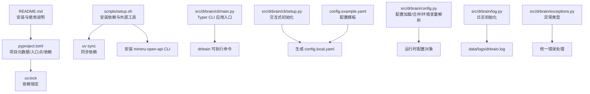
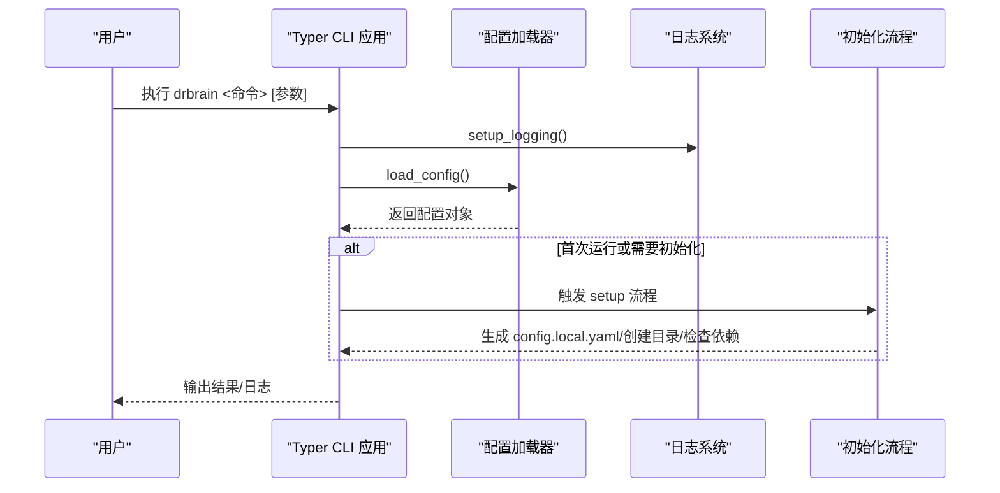
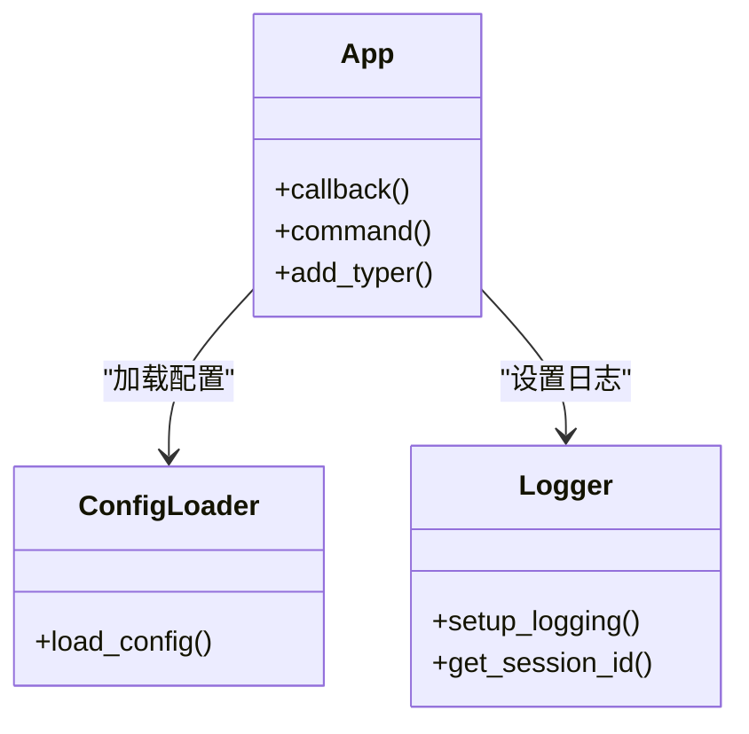
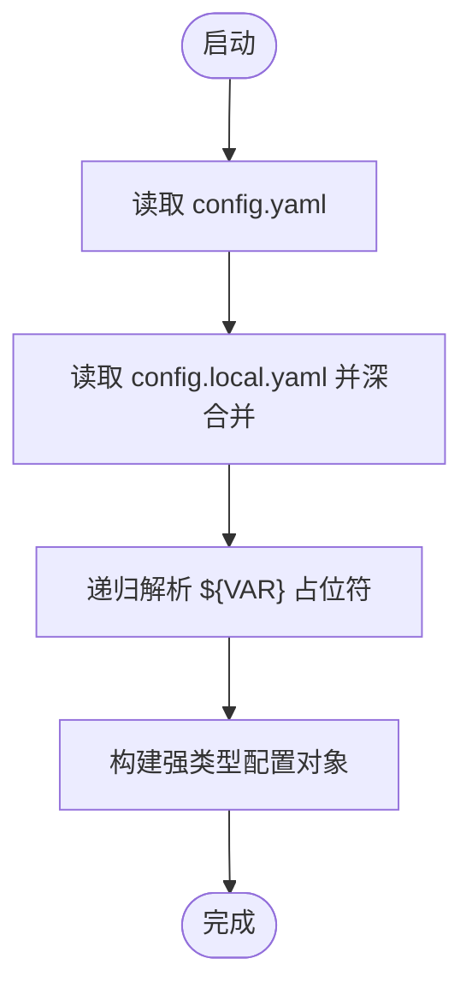
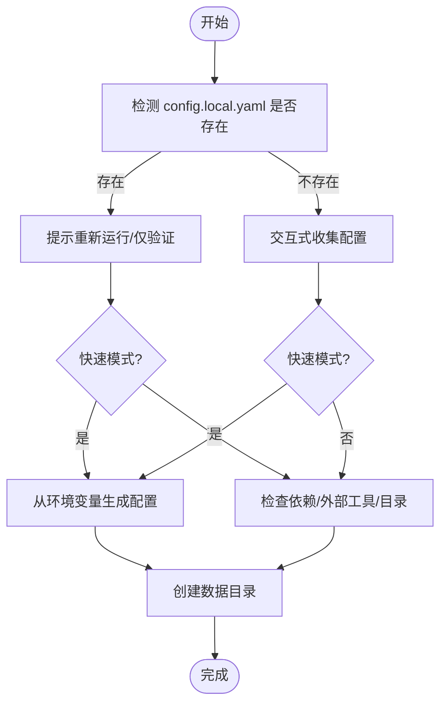
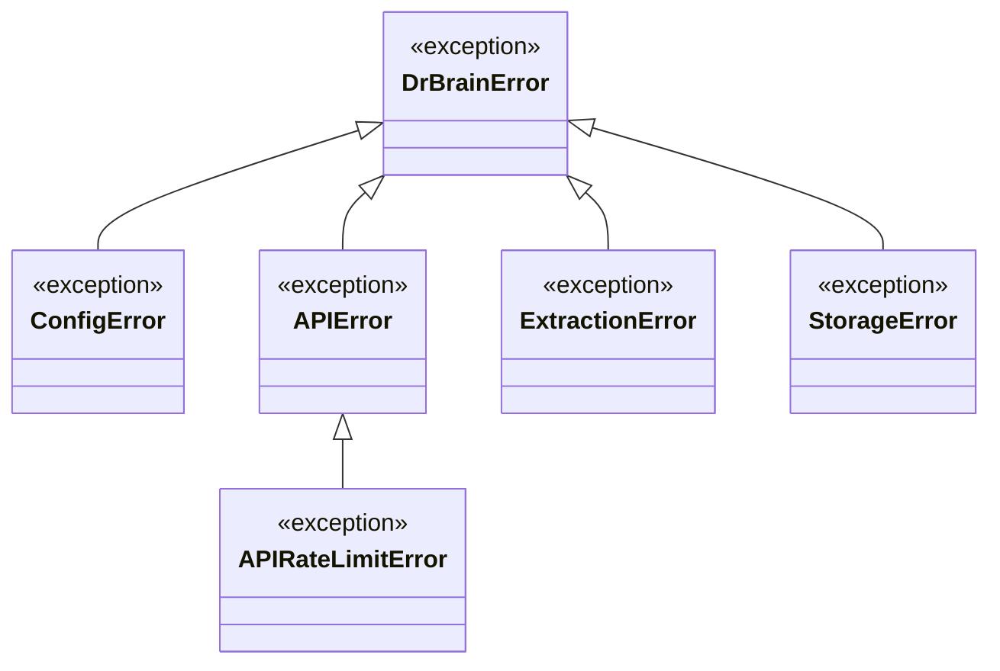
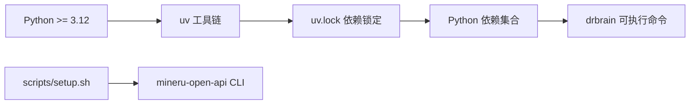

# 环境问题

<cite>
**本文档引用的文件**
- [README.md](file://README.md)
- [pyproject.toml](file://pyproject.toml)
- [uv.lock](file://uv.lock)
- [scripts/setup.sh](file://scripts/setup.sh)
- [docs/troubleshooting.md](file://docs/troubleshooting.md)
- [config.example.yaml](file://config.example.yaml)
- [src/drbrain/cli/main.py](file://src/drbrain/cli/main.py)
- [src/drbrain/cli/setup.py](file://src/drbrain/cli/setup.py)
- [src/drbrain/config.py](file://src/drbrain/config.py)
- [src/drbrain/cli/dependencies.py](file://src/drbrain/cli/dependencies.py)
- [src/drbrain/log.py](file://src/drbrain/log.py)
- [src/drbrain/exceptions.py](file://src/drbrain/exceptions.py)
- [main.py](file://main.py)
</cite>

## 目录
1. [简介](#简介)
2. [项目结构](#项目结构)
3. [核心组件](#核心组件)
4. [架构总览](#架构总览)
5. [详细组件分析](#详细组件分析)
6. [依赖关系分析](#依赖关系分析)
7. [性能考虑](#性能考虑)
8. [故障排除指南](#故障排除指南)
9. [结论](#结论)

## 简介
本指南聚焦 DrBrain 的环境问题排查与修复，覆盖 Python 环境配置、依赖安装、CLI 命令不可用、editable 安装缺失、模块导入错误、命令找不到等常见问题。文档基于仓库中的安装脚本、配置模板、CLI 入口与故障排除文档，提供可操作的诊断步骤与修复建议，并强调 uv pip 安装、环境变量配置、Python 版本兼容性等关键点。

## 项目结构
DrBrain 使用 uv 作为包管理与锁定工具，通过 pyproject.toml 声明项目元数据与入口点，通过 uv.lock 固化依赖版本。CLI 通过项目内可编辑安装提供 drbrain 可执行命令；setup 脚本负责初始化依赖与外部工具；配置系统支持 YAML 本地覆盖与环境变量解析。

**图表来源**
- [README.md](file://README.md)
- [pyproject.toml](file://pyproject.toml)
- [uv.lock](file://uv.lock)
- [scripts/setup.sh](file://scripts/setup.sh)
- [src/drbrain/cli/main.py](file://src/drbrain/cli/main.py)
- [src/drbrain/cli/setup.py](file://src/drbrain/cli/setup.py)
- [config.example.yaml](file://config.example.yaml)
- [src/drbrain/config.py](file://src/drbrain/config.py)
- [src/drbrain/log.py](file://src/drbrain/log.py)
- [src/drbrain/exceptions.py](file://src/drbrain/exceptions.py)

**章节来源**
- [README.md](file://README.md)
- [pyproject.toml](file://pyproject.toml)
- [uv.lock](file://uv.lock)
- [scripts/setup.sh](file://scripts/setup.sh)

## 核心组件
- CLI 入口与命令注册：Typer 应用在主入口中集中注册所有子命令与子应用（如 graph、ws），并通过回调在每次命令前加载配置与设置日志。
- 配置系统：支持 config.yaml 基础配置与 config.local.yaml 本地覆盖，优先级后者更高；支持环境变量占位符 ${VAR} 的解析。
- 初始化流程：setup 命令提供交互式初始化，生成本地配置、创建数据目录、检查环境依赖与外部工具。
- 日志系统：使用 loguru 进行零配置旋转日志输出，同时将警告及以上级别输出到标准错误。
- 锁定与版本：uv.lock 指定 requires-python >= 3.12，确保 Python 版本兼容性。

**章节来源**
- [src/drbrain/cli/main.py](file://src/drbrain/cli/main.py)
- [src/drbrain/config.py](file://src/drbrain/config.py)
- [src/drbrain/cli/setup.py](file://src/drbrain/cli/setup.py)
- [src/drbrain/log.py](file://src/drbrain/log.py)
- [uv.lock](file://uv.lock)

## 架构总览
DrBrain 的 CLI 以 Typer 为核心，通过入口模块集中注册命令；配置系统在回调阶段加载并解析；setup 流程负责生成本地配置与校验环境；日志系统贯穿整个生命周期。uv 用于依赖管理与锁定，确保跨平台一致性。

**图表来源**
- [src/drbrain/cli/main.py](file://src/drbrain/cli/main.py)
- [src/drbrain/config.py](file://src/drbrain/config.py)
- [src/drbrain/cli/setup.py](file://src/drbrain/cli/setup.py)
- [src/drbrain/log.py](file://src/drbrain/log.py)

## 详细组件分析

### CLI 入口与命令注册
- 入口模块集中注册所有命令与子应用（graph、ws），并在回调中加载配置与设置日志。
- 通过项目脚本条目将 drbrain 映射为可执行命令。

**图表来源**
- [src/drbrain/cli/main.py](file://src/drbrain/cli/main.py)
- [src/drbrain/config.py](file://src/drbrain/config.py)
- [src/drbrain/log.py](file://src/drbrain/log.py)

**章节来源**
- [src/drbrain/cli/main.py](file://src/drbrain/cli/main.py)
- [pyproject.toml](file://pyproject.toml)

### 配置系统与环境变量解析
- 支持基础配置与本地覆盖，优先级后者更高。
- 环境变量占位符 ${VAR} 在加载时被解析为实际值。
- 提供数据目录默认路径，便于首次运行自动创建。

**图表来源**
- [src/drbrain/config.py](file://src/drbrain/config.py)
- [config.example.yaml](file://config.example.yaml)

**章节来源**
- [src/drbrain/config.py](file://src/drbrain/config.py)
- [config.example.yaml](file://config.example.yaml)

### 初始化流程与环境检查
- 交互式初始化生成 config.local.yaml，创建数据目录，检查 Python 包与外部工具可用性。
- 支持快速模式，从环境变量读取配置项，减少交互成本。

**图表来源**
- [src/drbrain/cli/setup.py](file://src/drbrain/cli/setup.py)

**章节来源**
- [src/drbrain/cli/setup.py](file://src/drbrain/cli/setup.py)

### 日志与异常体系
- 日志系统提供会话级标识，支持文件与标准错误输出。
- 异常体系定义了配置、API、抽取、存储等错误类型，便于统一处理。

**图表来源**
- [src/drbrain/exceptions.py](file://src/drbrain/exceptions.py)

**章节来源**
- [src/drbrain/log.py](file://src/drbrain/log.py)
- [src/drbrain/exceptions.py](file://src/drbrain/exceptions.py)

## 依赖关系分析
- 项目要求 Python >= 3.12，uv.lock 明确该约束。
- CLI 入口通过项目脚本条目 drbrain 指向主入口模块。
- 外部工具（如 mineru-open-api）由安装脚本检测与安装。

**图表来源**
- [uv.lock](file://uv.lock)
- [pyproject.toml](file://pyproject.toml)
- [scripts/setup.sh](file://scripts/setup.sh)

**章节来源**
- [uv.lock](file://uv.lock)
- [pyproject.toml](file://pyproject.toml)
- [scripts/setup.sh](file://scripts/setup.sh)

## 性能考虑
- 依赖锁定与可重复安装：通过 uv.lock 固化依赖版本，避免环境漂移导致的性能波动。
- 日志轮转：日志文件按大小轮转并保留一定数量，避免磁盘占用过大影响 I/O。
- 并发与批处理：配置中提供最大并发与批处理参数，可根据硬件能力调整以平衡吞吐与资源占用。

[本节为通用指导，不直接分析具体文件]

## 故障排除指南

### 一、Python 环境与版本
- 症状：命令不可用、导入失败、运行时报错。
- 排查要点：
  - Python 版本是否满足 >= 3.12（由 uv.lock 指定）。
  - 当前 shell 的 Python 解释器是否为预期版本。
- 修复步骤：
  - 使用版本管理工具（如 pyenv）切换到 3.12+。
  - 确认 uv 与 pip 来源一致，避免混合使用不同工具链。

**章节来源**
- [uv.lock](file://uv.lock)

### 二、editable 安装缺失（ModuleNotFoundError: No module named 'drbrain'）
- 症状：Python 导入 drbrain 报错。
- 原因：未进行可编辑安装，导致 Python 无法找到包。
- 修复步骤：
  - 在项目根目录执行可编辑安装：uv pip install -e .
  - 验证安装后可 import drbrain 或运行 drbrain 命令。

**章节来源**
- [docs/troubleshooting.md](file://docs/troubleshooting.md)
- [pyproject.toml](file://pyproject.toml)

### 三、CLI 命令不可用（drbrain: command not found）
- 症状：终端提示命令未找到。
- 原因：可执行入口未正确安装或 PATH 未包含。
- 修复步骤：
  - 确保已执行可编辑安装 uv pip install -e .
  - 使用 which drbrain 检查命令路径。
  - 若仍不可用，确认项目脚本条目已生效（参见 pyproject.toml 的项目脚本部分）。

**章节来源**
- [docs/troubleshooting.md](file://docs/troubleshooting.md)
- [pyproject.toml](file://pyproject.toml)

### 四、配置文件缺失或加载失败
- 症状：运行报错提示配置未找到或加载失败。
- 原因：缺少 config.yaml 或 config.local.yaml，或两者均未生成。
- 修复步骤：
  - 使用 drbrain setup 生成 config.local.yaml（或复制示例配置文件）。
  - 确保 config.local.yaml 位于项目根目录且可读。
  - 如需从环境变量注入密钥，使用 ${ENV_VAR} 占位符并在运行前导出对应变量。

**章节来源**
- [docs/troubleshooting.md](file://docs/troubleshooting.md)
- [config.example.yaml](file://config.example.yaml)
- [src/drbrain/config.py](file://src/drbrain/config.py)

### 五、模块导入错误（缺失依赖）
- 症状：运行时报 ImportError。
- 原因：某些可选依赖未安装。
- 修复步骤：
  - 使用 setup 命令的简要验证功能检查缺失的 Python 包。
  - 根据提示安装缺失依赖（例如 litellm、typer、rich、pyyaml、pydantic、pyalex、arxiv、pymupdf、pymupdf4llm 等）。
  - 对于常见缺失，可参考依赖检查模块提供的友好提示。

**章节来源**
- [src/drbrain/cli/setup.py](file://src/drbrain/cli/setup.py)
- [src/drbrain/cli/dependencies.py](file://src/drbrain/cli/dependencies.py)

### 六、外部工具缺失（MinerU CLI）
- 症状：PDF 解析卡住或超时，或提示 MinerU API 不可达。
- 原因：未安装 mineru-open-api CLI。
- 修复步骤：
  - 使用安装脚本自动安装：./scripts/setup.sh
  - 或手动安装后验证版本：mineru-open-api version

**章节来源**
- [scripts/setup.sh](file://scripts/setup.sh)
- [src/drbrain/cli/setup.py](file://src/drbrain/cli/setup.py)

### 七、日志定位与调试
- 症状：难以定位问题原因。
- 修复步骤：
  - 查看应用日志：data/logs/drbrain.log
  - 设置更详细日志级别：LOGURU_LEVEL=DEBUG drbrain <命令>
  - 关注会话 ID，便于关联同一运行周期的日志片段。

**章节来源**
- [src/drbrain/log.py](file://src/drbrain/log.py)
- [docs/troubleshooting.md](file://docs/troubleshooting.md)

### 八、环境变量配置
- 症状：API 密钥或令牌未生效。
- 修复步骤：
  - 在 config.local.yaml 中使用 ${ENV_VAR} 占位符。
  - 在运行前导出对应环境变量（如 OPENAI_API_KEY、MINERU_TOKEN 等）。
  - 确保环境变量名与占位符一致。

**章节来源**
- [config.example.yaml](file://config.example.yaml)
- [src/drbrain/config.py](file://src/drbrain/config.py)

### 九、快速重置与恢复
- 症状：环境状态混乱，需要完全重置。
- 修复步骤：
  - 清理缓存与数据库：drbrain clean
  - 重新初始化：drbrain setup --quick
  - 重建索引：drbrain index

**章节来源**
- [docs/troubleshooting.md](file://docs/troubleshooting.md)

## 结论
DrBrain 的环境问题多源于 Python 版本不符、editable 安装缺失、配置文件未生成、外部工具未安装以及环境变量未正确注入。通过 uv 依赖锁定与可编辑安装、交互式初始化流程与配置解析机制、以及完善的日志与异常体系，可以系统性地定位并修复大多数环境问题。建议在首次安装后立即运行 drbrain setup，并在遇到问题时结合日志与故障排除文档进行针对性修复。