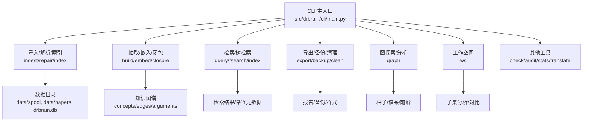
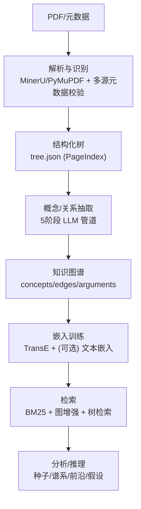
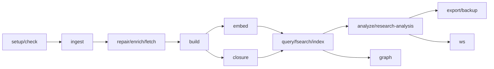

# 使用模式

<cite>
**本文引用的文件**
- [README.md](file://README.md)
- [docs/getting-started.md](file://docs/getting-started.md)
- [docs/architecture.md](file://docs/architecture.md)
- [docs/configuration.md](file://docs/configuration.md)
- [src/drbrain/cli/main.py](file://src/drbrain/cli/main.py)
- [skills/import/SKILL.md](file://skills/import/SKILL.md)
- [skills/paper-ingest/SKILL.md](file://skills/paper-ingest/SKILL.md)
- [skills/paper-query/SKILL.md](file://skills/paper-query/SKILL.md)
- [skills/pipeline/SKILL.md](file://skills/pipeline/SKILL.md)
- [skills/library-maintenance/SKILL.md](file://skills/library-maintenance/SKILL.md)
- [skills/workspace-analysis/SKILL.md](file://skills/workspace-analysis/SKILL.md)
- [skills/knowledge-cartography/SKILL.md](file://skills/knowledge-cartography/SKILL.md)
- [skills/research-analysis/SKILL.md](file://skills/research-analysis/SKILL.md)
- [scripts/batch_ingest.sh](file://scripts/batch_ingest.sh)
- [scripts/setup.sh](file://scripts/setup.sh)
</cite>

## 目录
1. [简介](#简介)
2. [项目结构](#项目结构)
3. [核心组件](#核心组件)
4. [架构总览](#架构总览)
5. [详细组件分析](#详细组件分析)
6. [依赖关系分析](#依赖关系分析)
7. [性能考量](#性能考量)
8. [故障排查指南](#故障排查指南)
9. [结论](#结论)
10. [附录](#附录)

## 简介
本指南面向研究人员、图书馆员与知识工作者，系统化阐述 DrBrain 的使用模式与最佳实践，覆盖从论文导入、知识抽取到检索查询的标准流程；并提供不同角色的典型工作流、批量处理与自动化脚本、定期维护流程，以及按研究领域与应用场景调整使用策略的方法。通过“技能”文档与 CLI 命令的结合，帮助用户建立高效、可重复、可扩展的知识管理与发现工作习惯。

## 项目结构
DrBrain 是一个以 CLI 为核心的学术知识图谱系统，围绕“轻量向量 + 符号推理”的设计哲学构建。其命令体系由主入口集中注册，按功能域拆分为多个子模块（如 ingest、query、build、graph、ws 等），并通过技能文档提供面向用户的使用模式说明。

图表来源
- [src/drbrain/cli/main.py:77-146](file://src/drbrain/cli/main.py#L77-L146)

章节来源
- [src/drbrain/cli/main.py:77-146](file://src/drbrain/cli/main.py#L77-L146)

## 核心组件
- 导入与初始化：支持从 Zotero、BibTeX、Endnote 等外部参考管理器导入元数据占位；随后可通过修复与抓取完善元数据或补充 PDF。
- 解析与识别：基于 MinerU/PyMuPDF 的 PDF 解析，跨源元数据校验，生成结构化树（PageIndex）。
- 抽取与建图：五阶段 LLM 管道（本体扩展、实体抽取、关系抽取、共指消解、迭代精炼），产出 typed 概念与关系。
- 嵌入与检索：训练 TransE 图嵌入与 PageIndex+RAPTOR 文本嵌入，结合 BM25、图增强与树检索实现多层检索。
- 推理与分析：规则闭包、因果链、置信传播、反事实、跨域同构等符号驱动推理，生成前沿报告与可行动假设。
- 工作空间与导出：对子集进行聚焦分析，并支持多种导出格式与样式。

章节来源
- [README.md:41-66](file://README.md#L41-L66)
- [docs/architecture.md:11-314](file://docs/architecture.md#L11-L314)

## 架构总览
DrBrain 的端到端流程分为两个阶段：轻量解析（Ingest）与结构化抽取（Build）。检索阶段融合 BM25、图增强与树检索；推理阶段通过三层栈（嵌入、闭包、LLM 代理）实现符号驱动的知识发现。

图表来源
- [docs/architecture.md:25-72](file://docs/architecture.md#L25-L72)
- [docs/architecture.md:188-210](file://docs/architecture.md#L188-L210)

章节来源
- [docs/architecture.md:25-72](file://docs/architecture.md#L25-L72)
- [docs/architecture.md:188-210](file://docs/architecture.md#L188-L210)

## 详细组件分析

### 论文导入（Import）
- 适用场景：从 Zotero、BibTeX、Endnote 迁移已有文献库；批量导入占位元数据以便后续抓取与补全。
- 关键步骤：选择源类型与参数（集合过滤、Dry-run 预览、是否导入集合为工作空间等）；导入后状态为占位（placeholder），需后续执行修复或抓取。
- 最佳实践：
  - 先预览再导入（--dry-run），确保字段映射与范围正确。
  - 若 Zotero 含本地 PDF，优先本地模式自动关联；否则走修复（repair）回填元数据。
  - 将大型集合导入为工作空间，便于后续分组分析。

章节来源
- [skills/import/SKILL.md:1-91](file://skills/import/SKILL.md#L1-L91)

### 论文解析与入库（Paper Ingest）
- 适用场景：将 PDF 放入收件箱，自动完成解析、元数据识别、树结构化与入库。
- 关键步骤：放置 PDF 至收件箱，运行 ingest；查看列表与详情；失败项进入待处理队列，定位原因并重试。
- 最佳实践：
  - 批量处理时先检查环境（drbrain check），确保 LLM 与外部服务可用。
  - 对扫描版或大体积 PDF，依赖 PyMuPDF 回退；必要时手动拆分。
  - 成功后立即执行构建、嵌入与闭包，保持数据新鲜度。

章节来源
- [skills/paper-ingest/SKILL.md:1-98](file://skills/paper-ingest/SKILL.md#L1-L98)

### 知识抽取与建图（KG Build）
- 适用场景：将论文内容转化为 typed 概念与关系，形成可查询的知识图谱。
- 关键步骤：本体扩展 → 实体抽取（并发） → 关系抽取 → 共指消解 → 迭代精炼（可跳过）。
- 最佳实践：
  - 并发参数与模型配置影响吞吐与成本，建议在快速模式下先跑小样本验证。
  - 跳过精炼可加速批处理，但需配合审计与置信队列复核。

章节来源
- [docs/getting-started.md:116-134](file://docs/getting-started.md#L116-L134)
- [docs/architecture.md:48-72](file://docs/architecture.md#L48-L72)

### 嵌入与检索（Embed & Query）
- 适用场景：提升检索质量与深度阅读体验，支持 BM25、图增强与树检索。
- 关键步骤：训练图嵌入（TransE）与文本嵌入（PageIndex+RAPTOR），启用 hybrid 排序与树检索。
- 最佳实践：
  - 文本嵌入可选（provider=none 时回退 BM25+树导航），按硬件与成本选择本地或兼容 API。
  - 结合图邻居扩展与类型/年份/置信度过滤，提高相关性与可控性。

章节来源
- [docs/getting-started.md:138-192](file://docs/getting-started.md#L138-L192)
- [docs/architecture.md:188-210](file://docs/architecture.md#L188-L210)

### 检索查询（Paper Query）
- 适用场景：关键词检索、图扩展检索、树级深读、混合排序与过滤。
- 关键步骤：BM25 查询 + 可选图邻居扩展；针对特定论文执行树检索；结合类型/论元/时间/置信度过滤。
- 最佳实践：
  - 搜索前确保索引与嵌入就绪；对结果附加距离/路径元数据，辅助溯源。
  - 深读时优先使用树检索，结合 RAPTOR 摘要与 PageIndex 层级导航。

章节来源
- [skills/paper-query/SKILL.md:1-96](file://skills/paper-query/SKILL.md#L1-L96)

### 管理与维护（Library Maintenance）
- 适用场景：首次设置、环境诊断、统计与报告、备份、删除、清理、置信队列处理、作者谱系追踪。
- 关键步骤：setup/check/audit/stats/report/delete/clean/backup/queue/lineage。
- 最佳实践：
  - 定期执行审计与统计，提前发现问题。
  - 备份先行再执行大规模构建或修复。
  - 清理前先评估磁盘占用与依赖，保留收件箱与配置。

章节来源
- [skills/library-maintenance/SKILL.md:1-166](file://skills/library-maintenance/SKILL.md#L1-L166)

### 工作空间与分析（Workspace & Research Analysis）
- 适用场景：聚焦特定主题的文献组织与分析，对比子集与全库差异，生成更可操作的前沿与假设。
- 关键步骤：创建工作空间 → 添加/移除论文 → 在工作空间内运行分析/查询/导出。
- 最佳实践：
  - 将成熟阅读清单固化为工作空间，便于复用与对比。
  - 分析输出中关注同时出现在工作空间与全库的关键节点，判断领域中心性。

章节来源
- [skills/workspace-analysis/SKILL.md:1-89](file://skills/workspace-analysis/SKILL.md#L1-L89)
- [skills/research-analysis/SKILL.md:1-110](file://skills/research-analysis/SKILL.md#L1-L110)

### 知识地图与前沿（Knowledge Cartography）
- 适用场景：探测研究信号、追踪概念谱系、检测范式转移、跨域方法迁移、难度评估与综合前沿报告。
- 关键步骤：种子扫描、谱系演化、后代追踪、领域时间线、范式转移、跨域同构、难度评分、综合前沿。
- 最佳实践：
  - 结合闭包与嵌入，提升谱系与同构检测的稳健性。
  - 工作空间内的前沿更聚焦，适合撰写综述或制定研究计划。

章节来源
- [skills/knowledge-cartography/SKILL.md:1-182](file://skills/knowledge-cartography/SKILL.md#L1-L182)

### 端到端流水线（Pipeline）
- 适用场景：一键串联 ingest/build/embed/closure，或自定义步骤序列。
- 关键步骤：preset（full/quick/embed）或自定义 steps 列表；支持 dry-run 预览。
- 最佳实践：
  - 批处理时优先使用 quick 或 embed preset，减少不必要的解析成本。
  - 将 pipeline 作为自动化脚本的基础单元。

章节来源
- [skills/pipeline/SKILL.md:1-51](file://skills/pipeline/SKILL.md#L1-L51)

## 依赖关系分析
DrBrain 的命令通过 CLI 主入口统一注册，各功能域相对独立又相互依赖：解析与识别是抽取的前提；抽取完成后方可进行嵌入与检索；分析与推理依赖于稳定的图结构与置信度。

图表来源
- [src/drbrain/cli/main.py:77-146](file://src/drbrain/cli/main.py#L77-L146)

章节来源
- [src/drbrain/cli/main.py:77-146](file://src/drbrain/cli/main.py#L77-L146)

## 性能考量
- 并发与成本平衡：实体抽取阶段支持并发调用，需权衡吞吐与 API 成本；可通过配置调整最大并发数。
- 嵌入策略：文本嵌入可选，provider=none 时完全依赖 BM25 与树检索；本地模型与兼容 API 在资源与延迟间折中。
- 索引与缓存：定期重建索引与清理缓存，避免陈旧数据影响检索质量。
- 批处理优化：使用脚本批量处理 PDF，统一模型与 API 基座，减少启动与切换开销。

章节来源
- [docs/configuration.md:179-191](file://docs/configuration.md#L179-L191)
- [docs/configuration.md:213-247](file://docs/configuration.md#L213-L247)
- [scripts/batch_ingest.sh:1-17](file://scripts/batch_ingest.sh#L1-L17)

## 故障排查指南
- 环境诊断：drbrain check 检查依赖、外部工具与 API 连通性；drbrain audit 执行数据质量扫描。
- 失败定位：查看待处理队列与日志，确认是 PDF 解析错误、LLM 调用失败还是无 DOI 识别。
- 数据恢复：drbrain backup 创建快照；drbrain clean 清理数据目录（保留收件箱与配置）；drbrain restore 可基于备份恢复。
- 置信队列：drbrain queue 列出低置信条目，交互式或批量解决，保证抽取质量。

章节来源
- [skills/library-maintenance/SKILL.md:29-84](file://skills/library-maintenance/SKILL.md#L29-L84)
- [skills/library-maintenance/SKILL.md:96-106](file://skills/library-maintenance/SKILL.md#L96-L106)
- [docs/getting-started.md:217-222](file://docs/getting-started.md#L217-L222)

## 结论
通过“导入—解析—抽取—嵌入—检索—分析—导出”的闭环工作流，DrBrain 为不同角色提供了可复制、可扩展的研究与知识管理工作模式。结合工作空间与前沿分析，用户可在各自领域建立高效的知识发现与决策支持体系。

## 附录

### 不同用户角色的最佳实践
- 研究人员
  - 以“问题—方法—结论—差距—争议—人物”为主线组织知识图谱。
  - 使用工作空间聚焦特定子领域，结合前沿扫描与假设生成指导选题。
  - 通过树检索进行深度阅读，结合图增强扩大发现边界。
- 图书馆员/信息员
  - 以“元数据标准化—占位导入—批量修复—抓取补全—质量审计”为主。
  - 建立定期备份与清理流程，保障长期可维护性。
  - 使用导出与样式功能支撑机构知识服务与共享。
- 知识工作者/分析师
  - 以“跨域同构—范式转移—难度评估—谱系追踪”为洞察工具。
  - 将工作空间作为“主题域”，对比全库与域内结果，提炼可操作机会点。
  - 结合批量脚本与 pipeline，实现自动化入库与增量更新。

### 常见任务组合与自动化
- 批量处理：使用脚本遍历 PDF 目录，统一模型与 API 基座，完成后汇总统计。
- 自动化工作流：将 pipeline preset 作为基础单元，结合定时任务与通知机制。
- 定期维护：每周/每月执行审计、统计与备份，清理待处理队列与缓存。

章节来源
- [scripts/batch_ingest.sh:1-17](file://scripts/batch_ingest.sh#L1-L17)
- [skills/pipeline/SKILL.md:14-34](file://skills/pipeline/SKILL.md#L14-L34)
- [skills/library-maintenance/SKILL.md:118-139](file://skills/library-maintenance/SKILL.md#L118-L139)

### 按研究领域与应用场景的策略调整
- 自然语言处理：聚焦“模型—任务—评估”谱系，使用树检索与混合排序定位关键方法。
- 生物医学：强调“疾病—靶点—药物”关系抽取与跨域同构，结合范式转移识别新治疗方向。
- 工程技术：重视“方法—系统—性能”链条，利用因果链与反事实分析评估方案稳健性。
- 学科交叉：通过跨域同构与转移分析，发现潜在迁移机会与整合点。

章节来源
- [skills/knowledge-cartography/SKILL.md:92-105](file://skills/knowledge-cartography/SKILL.md#L92-L105)
- [skills/research-analysis/SKILL.md:48-75](file://skills/research-analysis/SKILL.md#L48-L75)

### 实际使用案例与场景模拟
- 案例一：从 Zotero 迁移并补全文献
  - 步骤：导入 Zotero（含集合映射）→ 预览与 Dry-run → 导入集合为工作空间 → 修复缺失元数据 → 抓取 PDF → 构建/嵌入/闭包 → 检索与分析。
- 案例二：撰写综述的子域聚焦
  - 步骤：创建工作空间 → 采集相关论文 → 构建与嵌入 → 工作空间前沿扫描 → 生成假设与谱系图 → 导出参考文献。
- 案例三：日常增量维护
  - 步骤：每日 ingest 新论文 → 审计与统计 → 处理置信队列 → 备份 → 周检视与缓存清理。

章节来源
- [skills/import/SKILL.md:56-80](file://skills/import/SKILL.md#L56-L80)
- [skills/workspace-analysis/SKILL.md:63-76](file://skills/workspace-analysis/SKILL.md#L63-L76)
- [skills/library-maintenance/SKILL.md:126-139](file://skills/library-maintenance/SKILL.md#L126-L139)