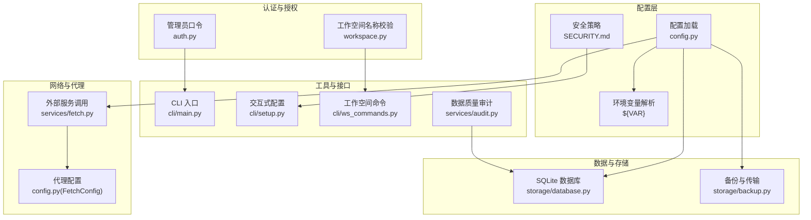
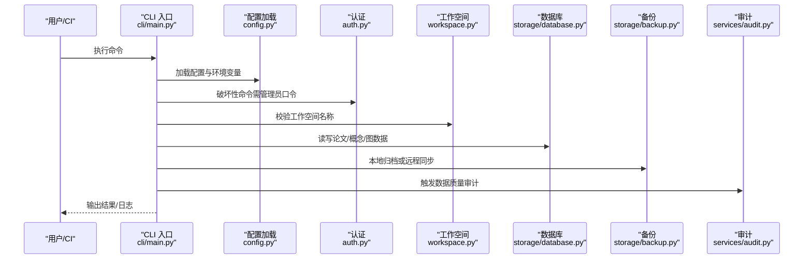
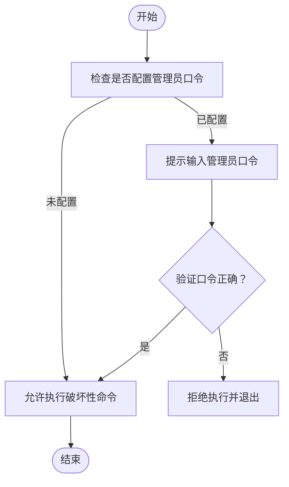
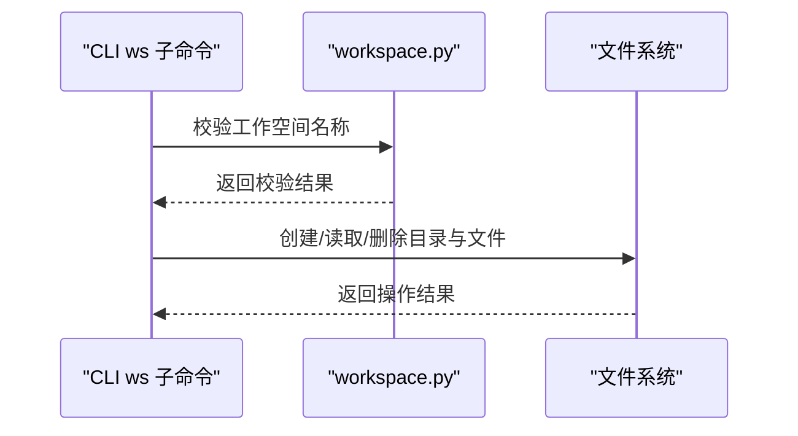
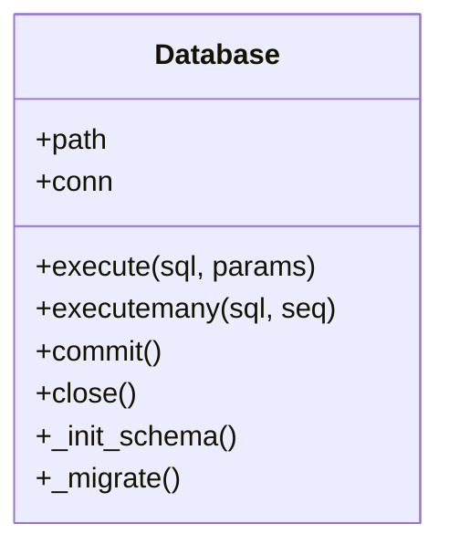
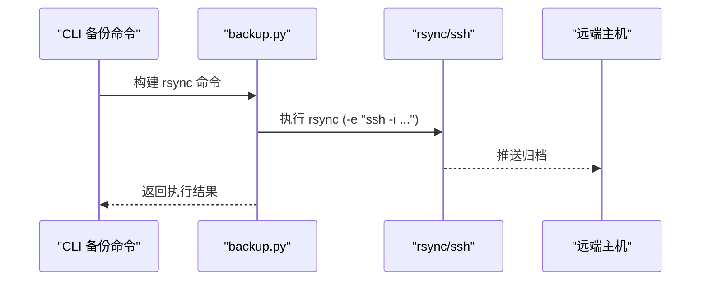
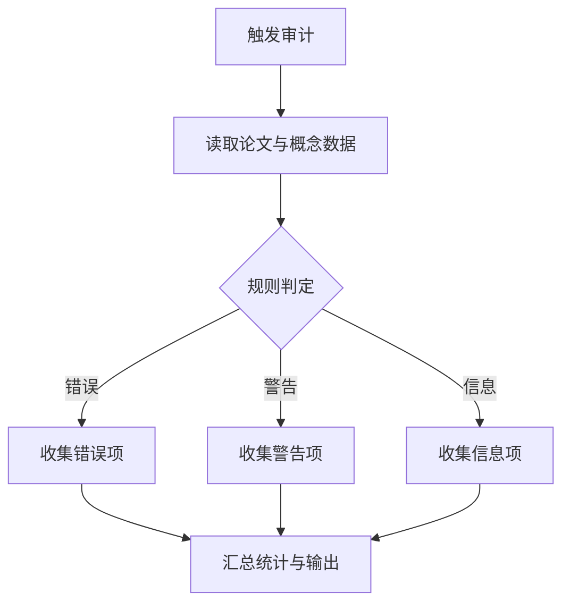
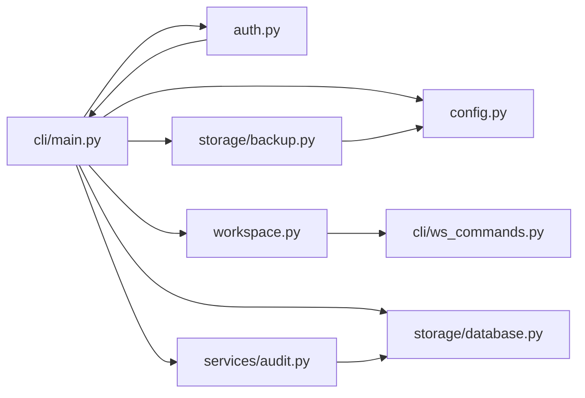

# 安全配置

<cite>
**本文引用的文件**
- [SECURITY.md](file://SECURITY.md)
- [config.yaml](file://config.yaml)
- [config.example.yaml](file://config.example.yaml)
- [src/drbrain/auth.py](file://src/drbrain/auth.py)
- [src/drbrain/config.py](file://src/drbrain/config.py)
- [src/drbrain/storage/database.py](file://src/drbrain/storage/database.py)
- [src/drbrain/storage/backup.py](file://src/drbrain/storage/backup.py)
- [src/drbrain/storage/workspace.py](file://src/drbrain/storage/workspace.py)
- [src/drbrain/cli/main.py](file://src/drbrain/cli/main.py)
- [src/drbrain/cli/setup.py](file://src/drbrain/cli/setup.py)
- [src/drbrain/cli/ws_commands.py](file://src/drbrain/cli/ws_commands.py)
- [src/drbrain/services/audit.py](file://src/drbrain/services/audit.py)
- [src/drbrain/services/fetch.py](file://src/drbrain/services/fetch.py)
- [.trellis/tasks/archive/2026-05/05-06-protect-clean/prd.md](file://.trellis/tasks/archive/2026-05/05-06-protect-clean/prd.md)
- [CLAUDE.md](file://CLAUDE.md)
</cite>

## 目录
1. [简介](#简介)
2. [项目结构](#项目结构)
3. [核心组件](#核心组件)
4. [架构总览](#架构总览)
5. [详细组件分析](#详细组件分析)
6. [依赖分析](#依赖分析)
7. [性能考量](#性能考量)
8. [故障排查指南](#故障排查指南)
9. [结论](#结论)
10. [附录](#附录)

## 简介
本指南面向运维与安全负责人，系统化阐述 DrBrain 的安全配置与最佳实践，覆盖认证与授权、工作空间权限管理、用户访问控制、数据库安全、数据加密、API 密钥与敏感信息保护、网络通信与代理安全、备份与传输安全、威胁建模与安全审计、以及合规与隐私保护等主题。文档以仓库现有实现为依据，结合配置模板与代码行为，给出可操作的安全加固建议。

## 项目结构
DrBrain 的安全相关能力主要分布在以下模块：
- 配置加载与密钥注入：通过 YAML 与环境变量解析，支持本地覆盖与运行时注入
- 认证与授权：管理员口令保护破坏性命令；工作空间命名校验防止路径穿越
- 数据库：SQLite 文件存储，WAL 模式与模式迁移
- 备份：本地压缩归档与 rsync 远程同步，支持凭据注入与非交互登录
- 审计：数据质量规则扫描，辅助发现潜在风险与异常
- 网络与代理：外部 API 调用与代理配置项，支持机构代理类型

**图表来源**
- [src/drbrain/config.py:195-244](file://src/drbrain/config.py#L195-L244)
- [src/drbrain/auth.py:7-28](file://src/drbrain/auth.py#L7-L28)
- [src/drbrain/storage/database.py:159-201](file://src/drbrain/storage/database.py#L159-L201)
- [src/drbrain/storage/backup.py:166-239](file://src/drbrain/storage/backup.py#L166-L239)
- [src/drbrain/services/fetch.py:81-122](file://src/drbrain/services/fetch.py#L81-L122)
- [src/drbrain/cli/main.py:80-92](file://src/drbrain/cli/main.py#L80-L92)
- [src/drbrain/cli/setup.py:411-441](file://src/drbrain/cli/setup.py#L411-L441)
- [src/drbrain/cli/ws_commands.py:12-170](file://src/drbrain/cli/ws_commands.py#L12-L170)
- [src/drbrain/services/audit.py:312-396](file://src/drbrain/services/audit.py#L312-L396)

**章节来源**
- [config.yaml:1-72](file://config.yaml#L1-L72)
- [config.example.yaml:1-145](file://config.example.yaml#L1-L145)
- [SECURITY.md:1-35](file://SECURITY.md#L1-L35)

## 核心组件
- 配置与密钥注入
  - 支持在基础配置中使用 ${ENV_VAR} 注入环境变量，优先级：本地覆盖 > 基础配置 > 环境变量
  - 敏感信息（如 API 密钥）应放入 git 忽略的本地配置或通过环境变量注入
- 认证与授权
  - 管理员口令采用随机盐值的 SHA-256 存储，破坏性命令需口令验证
  - 工作空间名称校验拒绝路径分隔符、相对路径段与非法字符，避免路径穿越
- 数据库与备份
  - SQLite 使用 WAL 模式提升并发写入稳定性；提供模式迁移与索引
  - 备份支持本地 tar.gz 归档与 rsync 远程同步，支持非交互 SSH 登录与凭据注入
- 审计与日志
  - 提供 15 条规则的数据质量审计，辅助识别缺失字段、低质量内容与异常状态
- 网络与代理
  - 外部服务调用支持 Unpaywall、DOI 直链、arXiv 等回退顺序；支持机构代理类型与自定义代理头

**章节来源**
- [src/drbrain/config.py:195-244](file://src/drbrain/config.py#L195-L244)
- [src/drbrain/auth.py:7-28](file://src/drbrain/auth.py#L7-L28)
- [src/drbrain/storage/workspace.py:22-40](file://src/drbrain/storage/workspace.py#L22-L40)
- [src/drbrain/storage/database.py:159-201](file://src/drbrain/storage/database.py#L159-L201)
- [src/drbrain/storage/backup.py:166-239](file://src/drbrain/storage/backup.py#L166-L239)
- [src/drbrain/services/audit.py:312-396](file://src/drbrain/services/audit.py#L312-L396)
- [src/drbrain/services/fetch.py:81-122](file://src/drbrain/services/fetch.py#L81-L122)

## 架构总览
下图展示安全相关的关键流程：配置加载与密钥注入、管理员口令保护、工作空间命名校验、数据库与备份、审计与日志、网络与代理。

**图表来源**
- [src/drbrain/cli/main.py:80-92](file://src/drbrain/cli/main.py#L80-L92)
- [src/drbrain/config.py:195-244](file://src/drbrain/config.py#L195-L244)
- [src/drbrain/auth.py:7-28](file://src/drbrain/auth.py#L7-L28)
- [src/drbrain/storage/workspace.py:22-40](file://src/drbrain/storage/workspace.py#L22-L40)
- [src/drbrain/storage/database.py:159-201](file://src/drbrain/storage/database.py#L159-L201)
- [src/drbrain/storage/backup.py:166-239](file://src/drbrain/storage/backup.py#L166-L239)
- [src/drbrain/services/audit.py:312-396](file://src/drbrain/services/audit.py#L312-L396)

## 详细组件分析

### 认证与授权机制
- 管理员口令
  - 口令以“随机盐值:哈希”的形式存储于本地配置；验证过程解析存储格式并比对期望哈希
  - 破坏性命令（如清理）在启用口令时需要交互式输入验证
- 工作空间权限与访问控制
  - 工作空间名称校验拒绝包含路径分隔符、相对路径段、冒号等字符，避免目录遍历
  - 工作空间目录位于 workspace/<name>/，由 YAML 描述与 papers.json 列表组成

**图表来源**
- [src/drbrain/auth.py:15-23](file://src/drbrain/auth.py#L15-L23)
- [src/drbrain/cli/setup.py:227-250](file://src/drbrain/cli/setup.py#L227-L250)
- [.trellis/tasks/archive/2026-05/05-06-protect-clean/prd.md:1-41](file://.trellis/tasks/archive/2026-05/05-06-protect-clean/prd.md#L1-L41)

**章节来源**
- [src/drbrain/auth.py:7-28](file://src/drbrain/auth.py#L7-L28)
- [src/drbrain/cli/setup.py:227-250](file://src/drbrain/cli/setup.py#L227-L250)
- [src/drbrain/storage/workspace.py:22-40](file://src/drbrain/storage/workspace.py#L22-L40)
- [.trellis/tasks/archive/2026-05/05-06-protect-clean/prd.md:1-41](file://.trellis/tasks/archive/2026-05/05-06-protect-clean/prd.md#L1-L41)

### 工作空间权限管理与用户访问控制
- 命名校验
  - 拒绝空名、首尾空白、绝对路径、包含“..”、包含 Windows 驱动器符号“:”
- 目录结构
  - workspace/<name>/workspace.yaml + refs/papers.json 组织元数据与论文清单
- 命令入口
  - CLI 子应用提供创建、添加、显示、删除、重命名等操作

**图表来源**
- [src/drbrain/cli/ws_commands.py:12-170](file://src/drbrain/cli/ws_commands.py#L12-L170)
- [src/drbrain/storage/workspace.py:22-40](file://src/drbrain/storage/workspace.py#L22-L40)

**章节来源**
- [src/drbrain/cli/ws_commands.py:12-170](file://src/drbrain/cli/ws_commands.py#L12-L170)
- [src/drbrain/storage/workspace.py:22-40](file://src/drbrain/storage/workspace.py#L22-L40)

### 数据库安全配置与数据加密
- 文件与模式
  - SQLite 数据库存放于 data/drbrain.db，采用 WAL 模式提升并发写入稳定性
  - 内置模式迁移与索引，确保结构演进与查询效率
- 加密建议
  - 本地文件系统层面：对存放 data/ 的磁盘进行全盘加密（如 LUKS）
  - 传输加密：备份到远端时使用 SSH 通道（rsync -e “ssh -i …”），确保端到端加密
  - 进一步加密：可考虑在数据库外层增加透明加密（TDE）方案（如 SQLCipher），但需评估性能与兼容性

**图表来源**
- [src/drbrain/storage/database.py:159-201](file://src/drbrain/storage/database.py#L159-L201)

**章节来源**
- [src/drbrain/storage/database.py:159-201](file://src/drbrain/storage/database.py#L159-L201)
- [CLAUDE.md:171-188](file://CLAUDE.md#L171-L188)

### API 密钥管理与敏感信息保护
- 配置优先级
  - 本地覆盖 config.local.yaml > 基础配置 config.yaml > 环境变量 ${ENV_VAR}
- 最佳实践
  - 将所有 API 密钥与令牌放入 config.local.yaml（已加入 .gitignore），避免提交到版本库
  - 在 CI/CD 环境中通过环境变量注入，避免硬编码
  - 对于高风险密钥（如数据库、远端 SSH 凭据），仅在受控环境中临时注入
- 配置项参考
  - LLM、MinerU、Semantic Scholar、CrossRef、OpenAlex 等密钥均支持通过 ${VAR} 注入

**章节来源**
- [SECURITY.md:21-34](file://SECURITY.md#L21-L34)
- [config.yaml:1-72](file://config.yaml#L1-L72)
- [config.example.yaml:1-145](file://config.example.yaml#L1-L145)
- [src/drbrain/config.py:195-244](file://src/drbrain/config.py#L195-L244)

### 网络通信安全与代理配置
- 外部服务调用
  - 支持 Unpaywall、直接 DOI 解析、arXiv 等回退顺序；可配置用户代理与超时
- 代理与机构访问
  - 支持机构代理类型（如 ezproxy 或 url_prefix）与自定义代理头
- 安全建议
  - 优先使用 HTTPS 与受信证书；在代理场景下确保代理服务器可信
  - 对外部请求设置合理超时与重试上限，避免资源耗尽

**章节来源**
- [src/drbrain/services/fetch.py:81-122](file://src/drbrain/services/fetch.py#L81-L122)
- [src/drbrain/config.py:102-111](file://src/drbrain/config.py#L102-L111)

### 备份数据的安全存储与传输
- 本地归档
  - 自动打包 papers、数据库、可选 workspace 与 reports，生成带时间戳的 tar.gz
- 远程同步
  - 通过 rsync + SSH 将归档推送到远端主机；支持压缩、排除模式、自定义端口与身份文件
  - 非交互登录：支持通过环境变量注入 SSH 密码（askpass 方案），避免明文口令出现在命令行
- 安全建议
  - 使用强密钥（Ed25519 或 ECDSA）与无口令私钥；限制 SSH 用户权限
  - 启用远程主机指纹校验与严格主机密钥检查
  - 对备份目标进行最小权限原则（只授予备份所需目录写权限）

**图表来源**
- [src/drbrain/storage/backup.py:171-239](file://src/drbrain/storage/backup.py#L171-L239)

**章节来源**
- [src/drbrain/storage/backup.py:26-63](file://src/drbrain/storage/backup.py#L26-L63)
- [src/drbrain/storage/backup.py:171-239](file://src/drbrain/storage/backup.py#L171-L239)
- [config.example.yaml:127-145](file://config.example.yaml#L127-L145)

### 威胁建模与安全审计
- 威胁建模要点
  - 本地文件系统泄露：通过磁盘加密与最小权限访问降低风险
  - 配置泄露：严格管理 config.local.yaml 与环境变量，避免误提交
  - 破坏性命令滥用：启用管理员口令保护
  - 路径穿越：工作空间名称校验与目录隔离
  - 外部 API 依赖：代理与超时控制，避免被恶意利用
- 安全审计
  - 数据质量审计覆盖标题、摘要、年份、期刊、作者、树结构、概念数量等规则
  - 支持按严重级别过滤与按工作空间筛选，输出富文本表格或 JSON

**图表来源**
- [src/drbrain/services/audit.py:312-396](file://src/drbrain/services/audit.py#L312-L396)

**章节来源**
- [src/drbrain/services/audit.py:312-396](file://src/drbrain/services/audit.py#L312-L396)

### 合规性与数据隐私
- 供应链与版本支持
  - 安全政策声明支持版本范围与漏洞上报渠道
- 数据处理
  - 外部 API 调用遵循提供商的使用条款；在机构代理场景下遵守访问策略
- 建议
  - 明确数据留存与删除策略；对个人可识别信息（PII）进行脱敏或匿名化
  - 定期审查备份保留周期与销毁流程，满足最小留存原则

**章节来源**
- [SECURITY.md:1-35](file://SECURITY.md#L1-L35)

## 依赖分析
- 配置加载链路
  - CLI 回调加载配置，随后各子系统按需读取配置键值
- 认证与授权耦合点
  - 破坏性命令依赖 auth.py 的口令验证；setup 流程负责口令设置与变更
- 工作空间与文件系统
  - workspace.py 通过路径拼接与文件读写组织工作空间；CLI ws 子命令驱动其行为
- 备份与传输
  - backup.py 依赖 BackupTargetConfig，构建 rsync 命令并通过 ssh 执行
- 审计与数据库
  - audit.py 依赖 Database 查询论文与图数据，形成闭环

**图表来源**
- [src/drbrain/cli/main.py:80-92](file://src/drbrain/cli/main.py#L80-L92)
- [src/drbrain/config.py:195-244](file://src/drbrain/config.py#L195-L244)
- [src/drbrain/auth.py:7-28](file://src/drbrain/auth.py#L7-L28)
- [src/drbrain/storage/workspace.py:22-40](file://src/drbrain/storage/workspace.py#L22-L40)
- [src/drbrain/cli/ws_commands.py:12-170](file://src/drbrain/cli/ws_commands.py#L12-L170)
- [src/drbrain/storage/database.py:159-201](file://src/drbrain/storage/database.py#L159-L201)
- [src/drbrain/storage/backup.py:166-239](file://src/drbrain/storage/backup.py#L166-L239)
- [src/drbrain/services/audit.py:312-396](file://src/drbrain/services/audit.py#L312-L396)

**章节来源**
- [src/drbrain/cli/main.py:80-92](file://src/drbrain/cli/main.py#L80-L92)
- [src/drbrain/config.py:195-244](file://src/drbrain/config.py#L195-L244)

## 性能考量
- 外部 API 调用
  - 合理设置并发与超时，避免阻塞与资源耗尽
- 数据库写入
  - WAL 模式提升吞吐；批量写入与事务合并可减少锁竞争
- 备份传输
  - 启用压缩与差异传输（append/append-verify）减少带宽占用

## 故障排查指南
- 破坏性命令被拒绝
  - 检查是否已设置管理员口令；确认输入口令正确
- 工作空间操作失败
  - 确认名称符合校验规则；检查目录权限与是否存在冲突
- 备份失败
  - 检查远端主机连通性、SSH 密钥与 askpass 环境变量；核对目标路径与权限
- 审计结果异常
  - 检查论文目录完整性与数据库一致性；按严重级别调整输出

**章节来源**
- [src/drbrain/auth.py:15-23](file://src/drbrain/auth.py#L15-L23)
- [src/drbrain/storage/workspace.py:22-40](file://src/drbrain/storage/workspace.py#L22-L40)
- [src/drbrain/storage/backup.py:166-239](file://src/drbrain/storage/backup.py#L166-L239)
- [src/drbrain/services/audit.py:312-396](file://src/drbrain/services/audit.py#L312-L396)

## 结论
通过在配置层强化密钥注入与覆盖优先级、在运行时引入管理员口令保护与工作空间命名校验、在存储层采用 WAL 模式与安全备份策略，并辅以数据质量审计与网络代理控制，DrBrain 能够在本地与云端部署场景下实现较为完善的安全基线。建议结合组织合规要求进一步细化密钥轮换、访问审计与事件响应流程。

## 附录
- 关键配置项速览
  - LLM/MinerU/API 密钥：通过 ${ENV_VAR} 注入
  - 数据库路径：data/drbrain.db
  - 外部 API 缓存 TTL、代理类型与机构代理地址
  - 备份目标：host/user/path/port/identity_file/password/mode/compress/exclude

**章节来源**
- [config.yaml:1-72](file://config.yaml#L1-L72)
- [config.example.yaml:1-145](file://config.example.yaml#L1-L145)
- [src/drbrain/config.py:102-111](file://src/drbrain/config.py#L102-L111)
- [src/drbrain/config.py:144-170](file://src/drbrain/config.py#L144-L170)