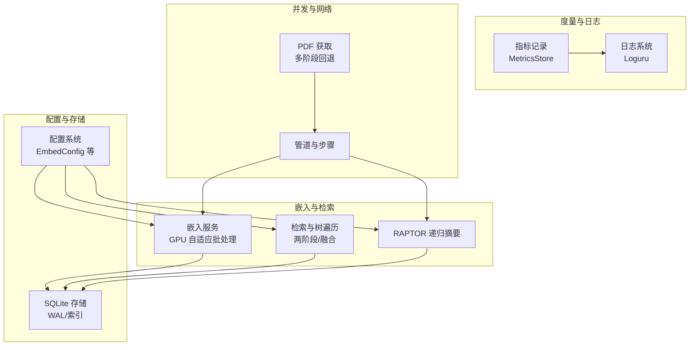
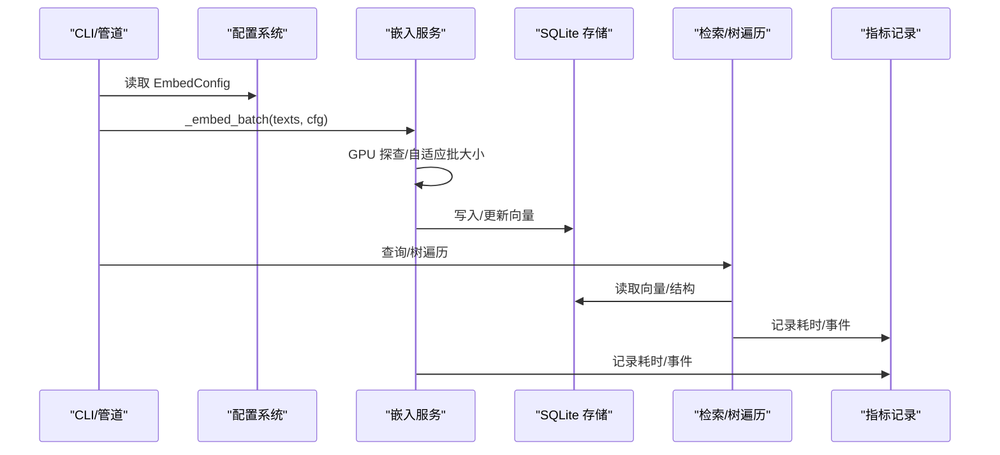
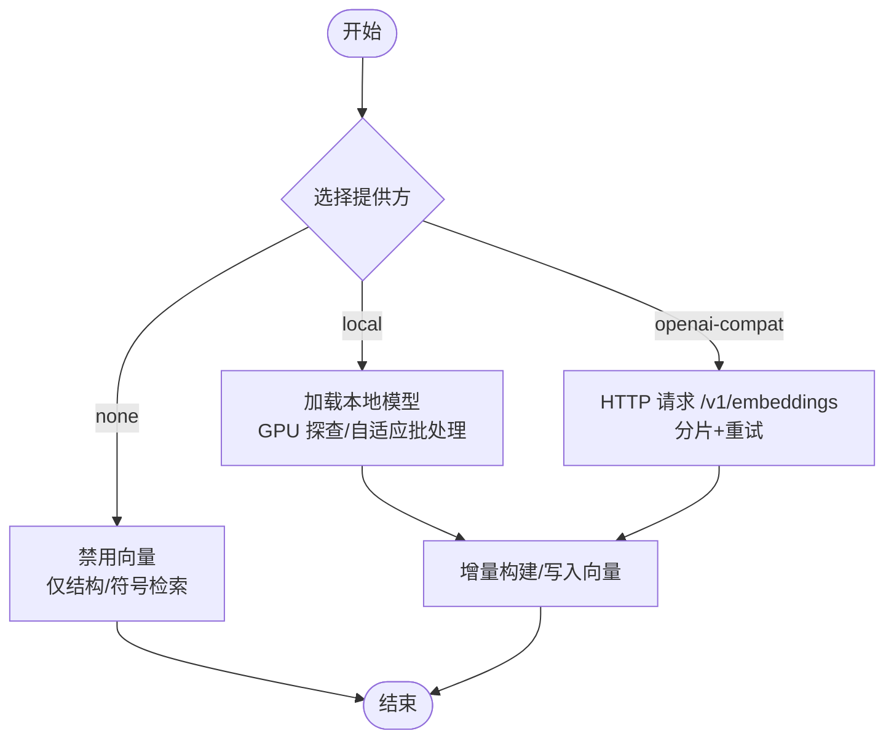
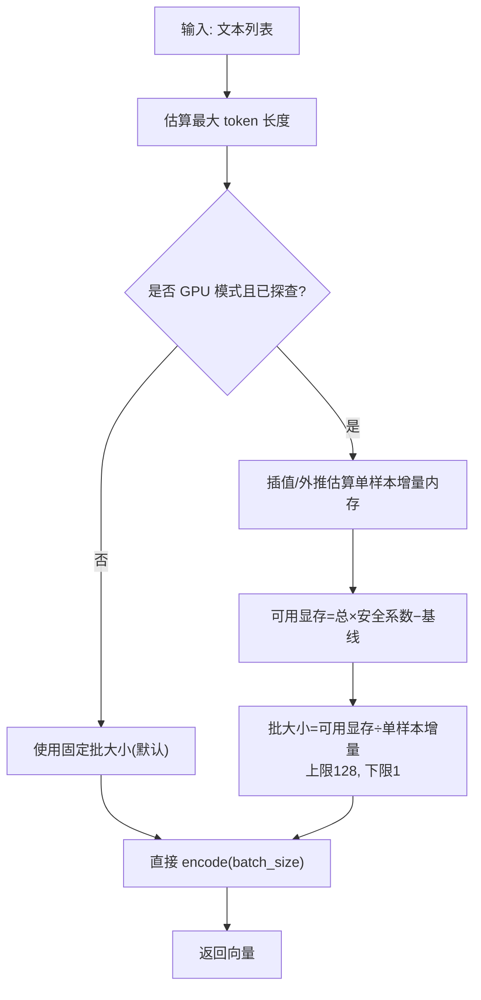
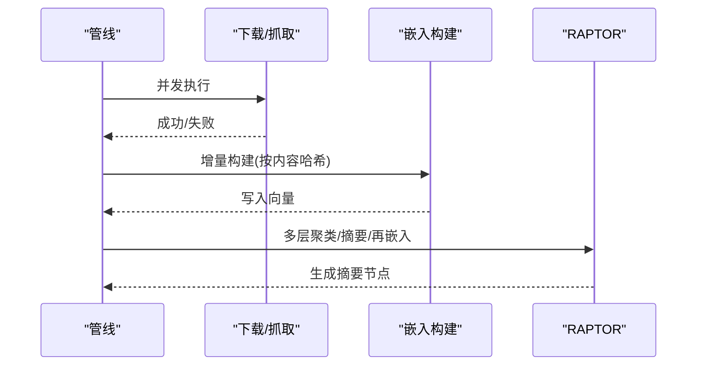
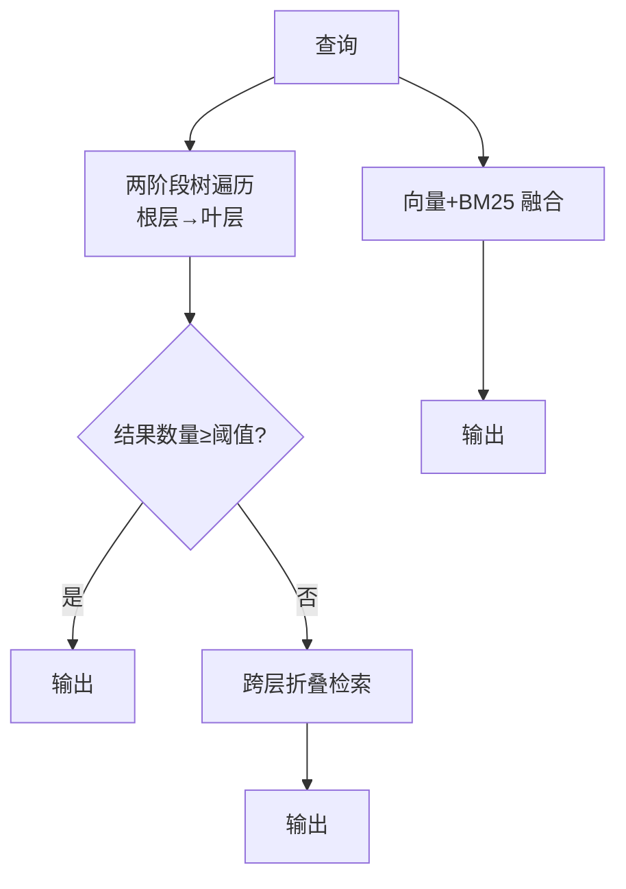
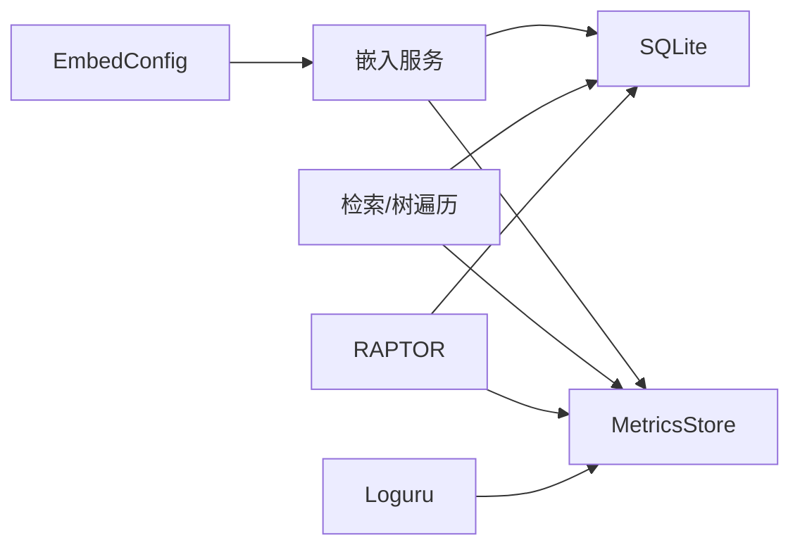

# 性能优化

<cite>
**本文引用的文件**
- [embedding.py](file://src/drbrain/services/embedding.py)
- [embedding.md](file://docs/embedding.md)
- [config.py](file://src/drbrain/config.py)
- [metrics.py](file://src/drbrain/metrics.py)
- [database.py](file://src/drbrain/storage/database.py)
- [raptor.py](file://src/drbrain/extractor/raptor.py)
- [tree_retrieval.py](file://src/drbrain/query/tree_retrieval.py)
- [log.py](file://src/drbrain/log.py)
- [exceptions.py](file://src/drbrain/exceptions.py)
- [pipeline.py](file://src/drbrain/services/pipeline.py)
- [fetch.py](file://src/drbrain/services/fetch.py)
- [llm_client.py](file://src/drbrain/extractor/llm_client.py)
- [test_services_embedding.py](file://tests/test_services_embedding.py)
</cite>

## 目录
1. [简介](#简介)
2. [项目结构](#项目结构)
3. [核心组件](#核心组件)
4. [架构总览](#架构总览)
5. [详细组件分析](#详细组件分析)
6. [依赖分析](#依赖分析)
7. [性能考量](#性能考量)
8. [故障排查指南](#故障排查指南)
9. [结论](#结论)
10. [附录](#附录)

## 简介
本指南面向 DrBrain 的性能优化需求，围绕嵌入模型选择与配置、GPU 加速与内存管理、并行与增量计算、性能监控与瓶颈定位、以及大规模数据处理与资源管理进行系统化说明。文档以代码为依据，结合配置项与运行时行为，给出可操作的优化建议与最佳实践。

## 项目结构
DrBrain 的性能相关能力主要分布在以下模块：
- 嵌入服务：负责本地/云端/禁用三种模式的向量化、GPU 内存自适应批处理、增量构建与检索。
- 配置系统：统一承载嵌入、数据库、日志等关键参数。
- 检索与树遍历：基于向量与结构的两阶段检索，支持跨论文融合与回退策略。
- RAPTOR 递归摘要：在向量基础上做聚类与 LLM 摘要，形成多层语义树。
- 度量与日志：SQLite 记录事件与耗时，Loguru 提供会话级日志。
- 管道与并发：命令行管道串联步骤，部分流程使用线程池并发执行。

图示来源
- [embedding.py:504-546](file://src/drbrain/services/embedding.py#L504-L546)
- [tree_retrieval.py:484-647](file://src/drbrain/query/tree_retrieval.py#L484-L647)
- [raptor.py:176-345](file://src/drbrain/extractor/raptor.py#L176-L345)
- [config.py:115-141](file://src/drbrain/config.py#L115-L141)
- [database.py:10-156](file://src/drbrain/storage/database.py#L10-L156)
- [metrics.py:49-191](file://src/drbrain/metrics.py#L49-L191)
- [log.py:32-61](file://src/drbrain/log.py#L32-L61)
- [pipeline.py:23-50](file://src/drbrain/services/pipeline.py#L23-L50)
- [fetch.py:13-264](file://src/drbrain/services/fetch.py#L13-L264)

章节来源
- [embedding.py:1-786](file://src/drbrain/services/embedding.py#L1-L786)
- [config.py:115-141](file://src/drbrain/config.py#L115-L141)
- [database.py:10-156](file://src/drbrain/storage/database.py#L10-L156)
- [metrics.py:49-191](file://src/drbrain/metrics.py#L49-L191)
- [log.py:32-61](file://src/drbrain/log.py#L32-L61)
- [pipeline.py:23-50](file://src/drbrain/services/pipeline.py#L23-L50)
- [fetch.py:13-264](file://src/drbrain/services/fetch.py#L13-L264)

## 核心组件
- 嵌入服务（向量化）：支持本地模型、OpenAI 兼容云服务、禁用模式；自动 GPU 内存探查与批大小自适应；增量构建与后过滤。
- 检索与树遍历：两阶段树遍历（按层级向下）+ 跨层折叠回退；支持向量与 BM25 的加权融合。
- RAPTOR 递归摘要：UMAP 降维 + BIC 自动选簇 + LLM 摘要 + 向量再编码迭代。
- 配置系统：EmbedConfig 统一管理 provider、模型、设备、批大小、源站等。
- 存储与索引：SQLite 使用 WAL、多表与索引，向量以 BLOB 存储，维度一致校验。
- 指标与日志：MetricsStore 记录事件与耗时，Loguru 提供会话标识与旋转日志。

章节来源
- [embedding.py:115-141](file://src/drbrain/services/embedding.py#L115-L141)
- [embedding.md:20-188](file://docs/embedding.md#L20-L188)
- [tree_retrieval.py:484-647](file://src/drbrain/query/tree_retrieval.py#L484-L647)
- [raptor.py:176-345](file://src/drbrain/extractor/raptor.py#L176-L345)
- [database.py:10-156](file://src/drbrain/storage/database.py#L10-L156)
- [metrics.py:49-191](file://src/drbrain/metrics.py#L49-L191)
- [log.py:32-61](file://src/drbrain/log.py#L32-L61)

## 架构总览
DrBrain 的性能相关路径由“配置 → 嵌入 → 存储/检索 → 指标/日志”构成闭环。嵌入服务在本地或云端之间切换，并在 GPU 上通过一次内存探查确定批大小上限；检索阶段优先使用结构化树遍历，必要时回退到跨层折叠与向量融合；指标与日志贯穿全流程，便于定位瓶颈。

图示来源
- [embedding.py:504-546](file://src/drbrain/services/embedding.py#L504-L546)
- [tree_retrieval.py:484-647](file://src/drbrain/query/tree_retrieval.py#L484-L647)
- [metrics.py:74-174](file://src/drbrain/metrics.py#L74-L174)
- [database.py:10-156](file://src/drbrain/storage/database.py#L10-L156)

## 详细组件分析

### 嵌入模型选择与配置策略
- 本地模式（推荐）
  - 自动检测 CUDA 并在 GPU 上运行；首次运行会进行 GPU 内存探查，生成缓存文件，后续按单样本增量内存估算动态调整批大小。
  - 支持 ModelScope/HuggingFace 模型源，可通过镜像地址适配内网环境。
  - 适合离线、高吞吐、隐私敏感场景。
- 云端模式（OpenAI 兼容）
  - 通过 /v1/embeddings 接口批量发送，支持指数回退与分片重试；适合无本地 GPU 或小批次场景。
- 禁用模式（provider=none）
  - 关闭所有向量；检索退化为 BM25 + LLM 导航；适合纯符号推理团队。

图示来源
- [embedding.py:441-498](file://src/drbrain/services/embedding.py#L441-L498)
- [embedding.py:504-546](file://src/drbrain/services/embedding.py#L504-L546)
- [embedding.md:20-137](file://docs/embedding.md#L20-L137)

章节来源
- [embedding.py:41-209](file://src/drbrain/services/embedding.py#L41-L209)
- [embedding.md:20-137](file://docs/embedding.md#L20-L137)
- [config.py:115-141](file://src/drbrain/config.py#L115-L141)

### GPU 加速与内存管理最佳实践
- 设备选择
  - device: auto（默认）→ 自动检测 CUDA；cuda 强制 GPU；cpu 强制 CPU。
- 批大小调优
  - 本地 GPU：通过一次内存探查（_run_profile）记录不同 token 数下的峰值增量内存，后续按可用显存安全系数计算最大批大小；超出范围外采用二次方外推。
  - 云端：固定 batch_size；注意服务端限流与重试。
- 缓存策略
  - 模型缓存：按 (model_name, cache_dir, device) 缓存句向量模型实例，避免重复加载。
  - GPU 探查缓存：按 (model_name + GPU 型号) 缓存至 ~/.cache/drbrain/gpu_profile.json，避免重复探查。
- 安全系数与上限
  - 可用显存 = 总显存 × 安全系数 − 模型权重基线；批大小上限 128，下限 1。

图示来源
- [embedding.py:215-305](file://src/drbrain/services/embedding.py#L215-L305)
- [embedding.py:308-356](file://src/drbrain/services/embedding.py#L308-L356)
- [embedding.py:359-411](file://src/drbrain/services/embedding.py#L359-L411)
- [embedding.py:528-546](file://src/drbrain/services/embedding.py#L528-L546)

章节来源
- [embedding.py:215-411](file://src/drbrain/services/embedding.py#L215-L411)
- [test_services_embedding.py:144-195](file://tests/test_services_embedding.py#L144-L195)

### 并行处理与增量计算
- 并行处理
  - 命令行管线中使用线程池并发执行下载/抓取等任务，提升吞吐。
  - LLM 调用具备回退链与异步接口，提高稳定性与响应速度。
- 增量计算
  - 嵌入构建：对内容哈希进行增量判断，未变更节点跳过；向量维度不一致时提示重建。
  - RAPTOR：每层聚类摘要后重新嵌入，直至收敛或层数上限；仅当节点数足够时才继续。

图示来源
- [pipeline.py:23-50](file://src/drbrain/services/pipeline.py#L23-L50)
- [fetch.py:219-264](file://src/drbrain/services/fetch.py#L219-L264)
- [embedding.py:624-666](file://src/drbrain/services/embedding.py#L624-L666)
- [raptor.py:176-345](file://src/drbrain/extractor/raptor.py#L176-L345)

章节来源
- [pipeline.py:23-50](file://src/drbrain/services/pipeline.py#L23-L50)
- [fetch.py:219-264](file://src/drbrain/services/fetch.py#L219-L264)
- [embedding.py:624-666](file://src/drbrain/services/embedding.py#L624-L666)
- [raptor.py:176-345](file://src/drbrain/extractor/raptor.py#L176-L345)

### 检索与融合策略
- 两阶段树遍历
  - 从最高 RAPTOR 层开始，逐层计算相似度并收集子节点，最终在 pageindex 叶层筛选；若结果不足阈值，回退到跨层折叠检索。
- 向量与 BM25 融合
  - 将 BM25 归一化分数与向量余弦分数按权重合并；也可使用倒数秩融合（RRF）合并多个排序列表。
- 结构化优先
  - 默认以 LLM 导航为主，向量用于预过滤候选，减少上下文开销。

图示来源
- [tree_retrieval.py:484-647](file://src/drbrain/query/tree_retrieval.py#L484-L647)
- [tree_retrieval.py:385-436](file://src/drbrain/query/tree_retrieval.py#L385-L436)

章节来源
- [tree_retrieval.py:484-647](file://src/drbrain/query/tree_retrieval.py#L484-L647)
- [tree_retrieval.py:385-436](file://src/drbrain/query/tree_retrieval.py#L385-L436)

### 数据存储与索引
- 表结构要点
  - tree_vectors：存储节点向量（BLOB）、所属论文、内容哈希、层级信息；用于检索与 RAPTOR 摘要。
  - embeddings：通用实体向量（TransE）存储。
  - 多索引：概念/边/队列等表建立常用字段索引，加速查询。
- WAL 与迁移
  - 使用 WAL 模式提升并发写入；schema_versions 追踪版本并有序迁移。
- 维度一致性
  - 检索前检查维度匹配，不一致需重建向量。

章节来源
- [database.py:10-156](file://src/drbrain/storage/database.py#L10-L156)
- [database.py:398-416](file://src/drbrain/storage/database.py#L398-L416)

## 依赖分析
- 嵌入服务依赖配置系统（EmbedConfig），根据 provider/device/batch_size 等决定运行路径。
- 检索模块依赖嵌入服务（向量）与数据库（tree_vectors）。
- RAPTOR 依赖嵌入服务（向量）与数据库（tree_summaries）。
- 指标与日志模块被各子系统调用，形成统一观测面。

图示来源
- [config.py:115-141](file://src/drbrain/config.py#L115-L141)
- [embedding.py:504-546](file://src/drbrain/services/embedding.py#L504-L546)
- [tree_retrieval.py:484-647](file://src/drbrain/query/tree_retrieval.py#L484-L647)
- [raptor.py:176-345](file://src/drbrain/extractor/raptor.py#L176-L345)
- [metrics.py:49-191](file://src/drbrain/metrics.py#L49-L191)
- [log.py:32-61](file://src/drbrain/log.py#L32-L61)

章节来源
- [config.py:115-141](file://src/drbrain/config.py#L115-L141)
- [metrics.py:49-191](file://src/drbrain/metrics.py#L49-L191)

## 性能考量
- 嵌入性能
  - 本地 GPU：优先使用 auto 设备；确保首次探查成功并生成缓存；合理设置安全系数与批大小上限。
  - 云端：控制 batch_size 与并发；关注服务端限流与重试策略。
  - 增量构建：保持内容哈希一致性，避免重复向量化。
- 检索性能
  - 两阶段树遍历减少无效比较；跨层回退作为兜底；向量与 BM25 融合提升召回质量。
  - 对大文档采用结构化导航，降低 LLM 上下文成本。
- RAPTOR 性能
  - UMAP 降维缓解高维距离退化；BIC 自动选簇；摘要后再次嵌入迭代，平衡质量与成本。
- 存储与索引
  - WAL 提升写入吞吐；多表多索引优化查询；定期清理与迁移保证稳定性。
- 日志与指标
  - 使用 MetricsStore 记录关键路径耗时；结合 Loguru 会话标识定位问题。

[本节为通用指导，无需列出章节来源]

## 故障排查指南
- 模型下载失败
  - 检查 source 与镜像地址；确认网络可达；首次下载体积较大。
- CUDA 显存不足
  - 设置 device: cpu 或降低 batch_size；等待下次运行自动探查缓存生效。
- 云端嵌入异常
  - 校验 api_base 末尾不含多余斜杠；确认 api_key；关注 429/5xx 的重试策略。
- 维度不匹配
  - 切换嵌入模型后需重新构建向量；确保模型维度一致。
- LLM 调用失败
  - 检查回退链配置；查看日志中的异常堆栈；必要时增加超时或重试次数。
- 并发写入冲突
  - MetricsStore 已内置锁与 WAL，避免并发写入崩溃；如仍出现异常，检查磁盘权限与空间。

章节来源
- [embedding.md:172-188](file://docs/embedding.md#L172-L188)
- [exceptions.py:6-28](file://src/drbrain/exceptions.py#L6-L28)
- [metrics.py:49-191](file://src/drbrain/metrics.py#L49-L191)
- [log.py:32-61](file://src/drbrain/log.py#L32-L61)

## 结论
通过合理的嵌入模式选择、GPU 内存自适应批处理、结构化检索与融合、递归摘要与增量构建，DrBrain 在大规模学术文本处理上实现了较好的性能与可维护性。建议在生产环境中启用 WAL、完善指标与日志、按硬件配置调优批大小与安全系数，并结合两阶段检索与向量融合获得更优的召回与效率平衡。

[本节为总结，无需列出章节来源]

## 附录
- 常用配置键位参考
  - provider: local | openai-compat | none
  - model: 模型名称或 ID
  - device: auto | cuda | cpu
  - batch_size: 批大小
  - source: modelscope | huggingface
  - hf_endpoint: HuggingFace 镜像地址
  - api_base/api_key: 云端嵌入端点与密钥
- 常见硬件配置建议
  - 低显存（<8GB）：设置较低安全系数与较小批大小；优先禁用向量或使用云端模式。
  - 中高显存（>12GB）：启用 auto 设备与 GPU 探查；适当提高批大小上限。
  - 无 GPU：使用云端模式或禁用向量；优化 LLM 回退链与并发参数。

章节来源
- [config.py:115-141](file://src/drbrain/config.py#L115-L141)
- [embedding.md:54-100](file://docs/embedding.md#L54-L100)
- [test_services_embedding.py:144-195](file://tests/test_services_embedding.py#L144-L195)