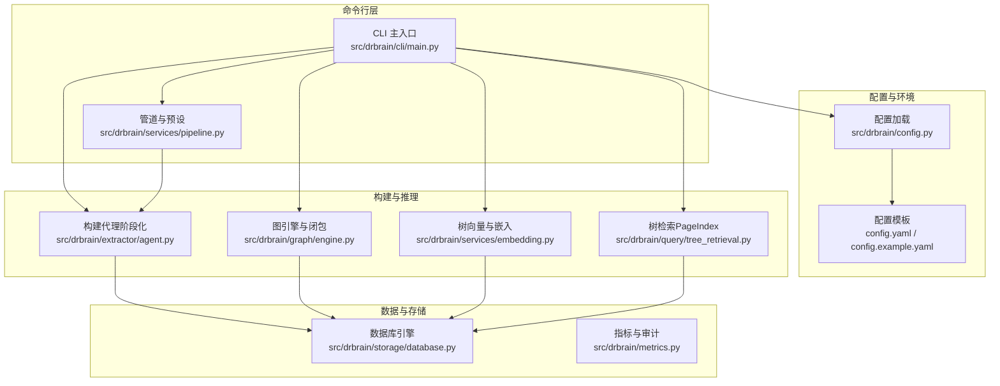
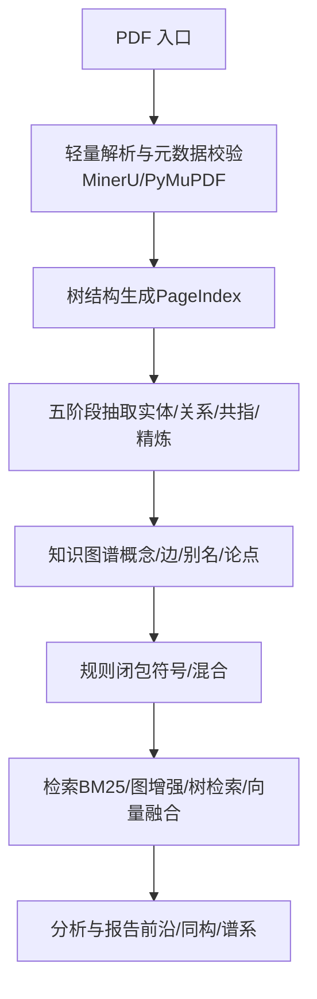
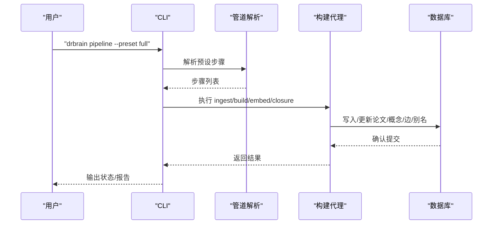
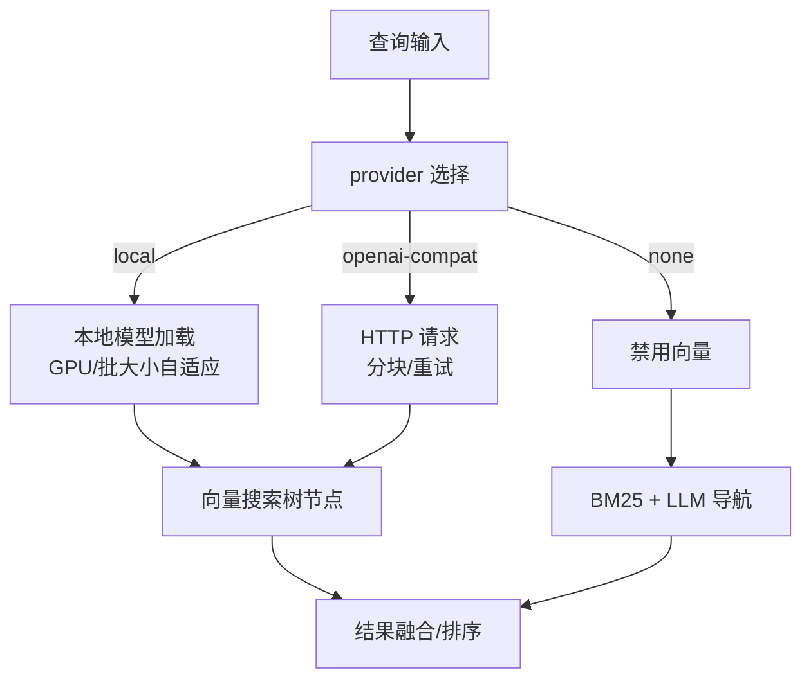
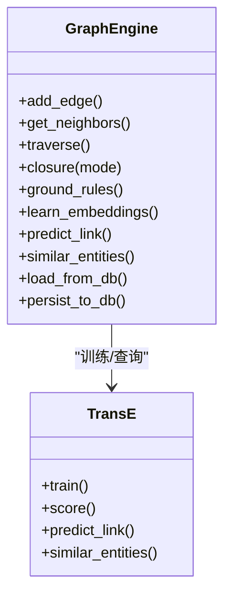
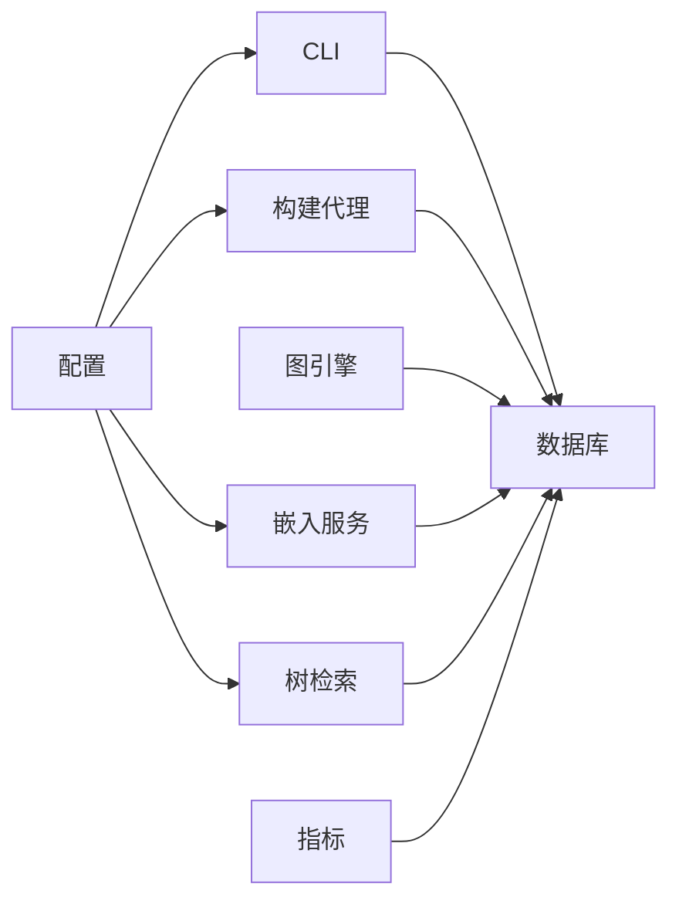

# 最佳实践

<cite>
**本文引用的文件**
- [README.md](file://README.md)
- [config.yaml](file://config.yaml)
- [config.example.yaml](file://config.example.yaml)
- [docs/configuration.md](file://docs/configuration.md)
- [docs/getting-started.md](file://docs/getting-started.md)
- [docs/architecture.md](file://docs/architecture.md)
- [docs/embedding.md](file://docs/embedding.md)
- [docs/troubleshooting.md](file://docs/troubleshooting.md)
- [src/drbrain/config.py](file://src/drbrain/config.py)
- [src/drbrain/cli/main.py](file://src/drbrain/cli/main.py)
- [src/drbrain/services/pipeline.py](file://src/drbrain/services/pipeline.py)
- [src/drbrain/storage/database.py](file://src/drbrain/storage/database.py)
- [src/drbrain/metrics.py](file://src/drbrain/metrics.py)
- [src/drbrain/extractor/agent.py](file://src/drbrain/extractor/agent.py)
- [src/drbrain/services/embedding.py](file://src/drbrain/services/embedding.py)
- [src/drbrain/graph/engine.py](file://src/drbrain/graph/engine.py)
- [src/drbrain/query/tree_retrieval.py](file://src/drbrain/query/tree_retrieval.py)
</cite>

## 目录
1. [简介](#简介)
2. [项目结构](#项目结构)
3. [核心组件](#核心组件)
4. [架构总览](#架构总览)
5. [详细组件分析](#详细组件分析)
6. [依赖关系分析](#依赖关系分析)
7. [性能考量](#性能考量)
8. [故障排查指南](#故障排查指南)
9. [结论](#结论)
10. [附录](#附录)

## 简介
本指南面向 DrBrain 的使用者与维护者，提供从安装配置、工作流设计、性能优化到安全与运维的系统化最佳实践。内容覆盖：
- 使用模式与推荐配置
- 性能优化与资源管理
- 安全与访问控制
- 维护与升级策略
- 监控与调优
- 故障预防与应急响应

## 项目结构
DrBrain 是一个以“符号驱动 + 轻量向量检索”为核心的学术知识图谱系统，CLI 驱动，支持本地/云端 LLM、可选向量嵌入与规则推理，数据持久化于 SQLite。

**图表来源**
- [src/drbrain/cli/main.py:1-150](file://src/drbrain/cli/main.py#L1-L150)
- [src/drbrain/services/pipeline.py:1-109](file://src/drbrain/services/pipeline.py#L1-L109)
- [src/drbrain/config.py:1-292](file://src/drbrain/config.py#L1-L292)
- [src/drbrain/storage/database.py:1-775](file://src/drbrain/storage/database.py#L1-L775)
- [src/drbrain/metrics.py:1-203](file://src/drbrain/metrics.py#L1-L203)
- [src/drbrain/extractor/agent.py:1-368](file://src/drbrain/extractor/agent.py#L1-L368)
- [src/drbrain/graph/engine.py:1-800](file://src/drbrain/graph/engine.py#L1-L800)
- [src/drbrain/services/embedding.py:1-786](file://src/drbrain/services/embedding.py#L1-L786)
- [src/drbrain/query/tree_retrieval.py:1-876](file://src/drbrain/query/tree_retrieval.py#L1-L876)

**章节来源**
- [README.md:1-112](file://README.md#L1-L112)
- [docs/getting-started.md:1-253](file://docs/getting-started.md#L1-L253)
- [docs/architecture.md:1-314](file://docs/architecture.md#L1-L314)

## 核心组件
- 配置系统：类型化配置类与多源合并（基础配置、本地覆盖、环境变量），支持 LLM、MinerU、API、目录、数据库、提取并发、BM25、队列阈值、下载与嵌入等。
- CLI 与管道：统一入口初始化日志与配置；提供 ingest/build/embed/closure/query 等命令与预设（full/quick/embed）。
- 数据库：SQLite WAL 模式，自动迁移，Schema 版本化，事务安全写入。
- 构建代理：五阶段抽取（本体扩展、实体、关系、共指、精炼），带幂等与重试。
- 图引擎：规则闭包、TransE 关系预测、路径规则、研究种子检测。
- 向量与检索：仅对 PageIndex 叶子节点与 RAPTOR 摘要进行向量化，支持本地/兼容 API/禁用三种后端。
- 指标与审计：LLM 调用与通用事件记录，WAL 模式线程安全。

**章节来源**
- [src/drbrain/config.py:1-292](file://src/drbrain/config.py#L1-L292)
- [src/drbrain/cli/main.py:1-150](file://src/drbrain/cli/main.py#L1-L150)
- [src/drbrain/services/pipeline.py:1-109](file://src/drbrain/services/pipeline.py#L1-L109)
- [src/drbrain/storage/database.py:1-775](file://src/drbrain/storage/database.py#L1-L775)
- [src/drbrain/extractor/agent.py:1-368](file://src/drbrain/extractor/agent.py#L1-L368)
- [src/drbrain/graph/engine.py:1-800](file://src/drbrain/graph/engine.py#L1-L800)
- [src/drbrain/services/embedding.py:1-786](file://src/drbrain/services/embedding.py#L1-L786)
- [src/drbrain/query/tree_retrieval.py:1-876](file://src/drbrain/query/tree_retrieval.py#L1-L876)
- [src/drbrain/metrics.py:1-203](file://src/drbrain/metrics.py#L1-L203)

## 架构总览
DrBrain 的核心是“知识图谱即真相”的符号驱动设计：检索以 BM25 与图增强为主，向量仅用于语义完整的树节点加速；推理由规则与可选嵌入共同完成。

**图表来源**
- [docs/architecture.md:25-210](file://docs/architecture.md#L25-L210)

**章节来源**
- [docs/architecture.md:1-314](file://docs/architecture.md#L1-L314)

## 详细组件分析

### 配置与部署最佳实践
- 配置优先级：config.yaml（基线）→ config.local.yaml（本地覆盖与密钥）→ 环境变量（${VAR} 占位解析）。建议将密钥与敏感项放入 config.local.yaml 并加入 .gitignore。
- LLM 提供商：支持 litellm 兼容生态（OpenAI、Anthropic、DeepSeek、Zhipu、Bailian、Moonshot、Ollama、vLLM 等），建议至少准备一个备用模型以防限流或失败。
- MinerU：优先使用 MinerU API（可选 Token），无 Token 时回退至 PyMuPDF；大文档建议启用分页拆分。
- 外部 API：合理设置缓存 TTL、请求速率限制与邮箱（CrossRef 慷慨池），必要时配置更高限额的 API Key。
- 数据目录：inbox/pending/papers/reports/cache/logs 等路径按需调整，确保磁盘空间与权限充足。
- 搜索参数：BM25 的 k1/b 控制词频饱和与文档长度归一化，建议在目标领域内微调。
- 提取并发：extract.max_concurrent 控制实体抽取并发度，平衡吞吐与成本/限流风险。
- 队列阈值：queue.weak_threshold/auto_accept 控制质量门控，减少人工复核负担。
- 下载与代理：fetch.max_concurrent/timeout/fallback_order 支持 Unpaywall、arXiv、OpenAlex、DOI 直链；机构代理与用户代理可按需配置。
- 嵌入：provider=local 默认使用 Qwen/Qwen3-Embedding-0.6B，GPU 自适应批大小；openai-compat 适合无本地 GPU 场景；provider=none 则纯 BM25 + LLM 导航。

**章节来源**
- [docs/configuration.md:1-342](file://docs/configuration.md#L1-L342)
- [config.yaml:1-72](file://config.yaml#L1-L72)
- [config.example.yaml:1-145](file://config.example.yaml#L1-L145)
- [src/drbrain/config.py:1-292](file://src/drbrain/config.py#L1-L292)

### 工作流与使用模式
- 快速上手：通过 drbrain setup 交互式配置，随后执行 ingest → build → embed → closure 的完整管线；也可使用预设（full/quick/embed）与自定义步骤串行。
- 逐步验证：drbrain check 进行环境诊断；drbrain audit 执行数据质量扫描。
- 查询策略：BM25 基础检索，结合 --neighbors 与 --hybrid 进行图增强；针对单篇使用 PageIndex 树检索；跨篇使用折叠树检索与向量融合。
- 分析与推理：利用研究前沿、因果链、假设生成、跨域同构等能力进行探索性分析。

**图表来源**
- [src/drbrain/services/pipeline.py:53-90](file://src/drbrain/services/pipeline.py#L53-L90)
- [src/drbrain/extractor/agent.py:73-135](file://src/drbrain/extractor/agent.py#L73-L135)
- [src/drbrain/storage/database.py:279-346](file://src/drbrain/storage/database.py#L279-L346)

**章节来源**
- [docs/getting-started.md:88-216](file://docs/getting-started.md#L88-L216)
- [src/drbrain/services/pipeline.py:1-109](file://src/drbrain/services/pipeline.py#L1-L109)
- [src/drbrain/extractor/agent.py:1-368](file://src/drbrain/extractor/agent.py#L1-L368)

### 检索与向量策略
- 仅对 PageIndex 叶子节点与 RAPTOR 摘要进行向量化，避免任意切片带来的语义漂移。
- 本地向量：自动下载模型、GPU 自适应批大小、内存档缓存；CPU 回退与镜像源支持。
- 兼容 API：统一 /v1/embeddings 接口，批量分块、指数退避重试。
- 禁用向量：provider=none 时，检索退化为 BM25 + LLM 导航，适合纯符号推理场景。
- 跨篇检索：折叠树检索与层序遍历（RAPTOR 层）结合，不足时回退到全局向量搜索。

**图表来源**
- [src/drbrain/services/embedding.py:504-546](file://src/drbrain/services/embedding.py#L504-L546)
- [src/drbrain/query/tree_retrieval.py:484-647](file://src/drbrain/query/tree_retrieval.py#L484-L647)

**章节来源**
- [docs/embedding.md:1-188](file://docs/embedding.md#L1-L188)
- [src/drbrain/services/embedding.py:1-786](file://src/drbrain/services/embedding.py#L1-L786)
- [src/drbrain/query/tree_retrieval.py:1-876](file://src/drbrain/query/tree_retrieval.py#L1-L876)

### 图推理与规则闭包
- 规则集：对称性检测、争议创建、缺口解决、间接演化、跨域网络、传递闭包等。
- 混合模式：基于 TransE 嵌入分数加权，路径规则复合，提升推断可靠性。
- 研究种子：技术悬崖、跨域同构、信心坍缩等模式识别，辅助发现前沿与机会点。

**图表来源**
- [src/drbrain/graph/engine.py:33-800](file://src/drbrain/graph/engine.py#L33-L800)

**章节来源**
- [src/drbrain/graph/engine.py:1-800](file://src/drbrain/graph/engine.py#L1-L800)

### 数据与文件布局
- 数据目录：spool/inbox、spool/pending、papers/<id>、drbrain.db、metrics.db、cache、logs、reports、workspaces 等。
- 文件写入采用原子替换（tmp → rename）策略，保证崩溃安全。
- 数据库 WAL 模式支持并发读写，Schema 版本化迁移。

**章节来源**
- [docs/architecture.md:212-265](file://docs/architecture.md#L212-L265)
- [src/drbrain/storage/database.py:159-258](file://src/drbrain/storage/database.py#L159-L258)

## 依赖关系分析
- 配置依赖：CLI 初始化时加载配置，贯穿所有子系统；配置类提供类型化访问与字典兼容。
- 存储依赖：数据库作为唯一持久化介质，被构建代理、图引擎、嵌入服务、检索模块广泛使用。
- 指标依赖：MetricsStore 记录 LLM 调用与事件，支持会话追踪与性能分析。
- 管道依赖：管道模块将多个步骤串联，Agent 在每步中进行幂等与重试，降低失败成本。

**图表来源**
- [src/drbrain/config.py:182-244](file://src/drbrain/config.py#L182-L244)
- [src/drbrain/cli/main.py:80-92](file://src/drbrain/cli/main.py#L80-L92)
- [src/drbrain/storage/database.py:159-258](file://src/drbrain/storage/database.py#L159-L258)
- [src/drbrain/metrics.py:49-181](file://src/drbrain/metrics.py#L49-L181)

**章节来源**
- [src/drbrain/config.py:1-292](file://src/drbrain/config.py#L1-L292)
- [src/drbrain/cli/main.py:1-150](file://src/drbrain/cli/main.py#L1-L150)
- [src/drbrain/storage/database.py:1-775](file://src/drbrain/storage/database.py#L1-L775)
- [src/drbrain/metrics.py:1-203](file://src/drbrain/metrics.py#L1-L203)

## 性能考量
- LLM 成本与限流
  - 合理设置 extract.max_concurrent，避免触发外部 API 限流。
  - 使用多模型回退链，提高成功率并降低整体延迟。
  - 对于高并发场景，优先使用 openai-compat 将计算卸载至云端。
- 向量性能
  - 本地向量：GPU 自适应批大小与内存档缓存，首次运行会下载模型（约 1.2GB），后续复用。
  - 批处理：根据序列长度估算最大样本数，避免 OOM；必要时降低 batch_size 或切换 CPU。
  - 维度一致性：更换模型后需重建向量（drbrain embed --tree）。
- 检索性能
  - BM25 参数（k1/b）在目标领域内微调；图增强（neighbors/hybrid）按需开启。
  - 树检索采用 LLM 引导 + 向量预过滤，减少上下文开销。
- 数据库与并发
  - WAL 模式支持并发读写；避免长时间持有写锁；定期备份与清理缓存。
- 指标与可观测性
  - 使用 metrics.db 记录 LLM token 与事件，结合日志定位瓶颈。

**章节来源**
- [docs/configuration.md:180-247](file://docs/configuration.md#L180-L247)
- [docs/embedding.md:10-188](file://docs/embedding.md#L10-L188)
- [src/drbrain/services/embedding.py:212-412](file://src/drbrain/services/embedding.py#L212-L412)
- [src/drbrain/metrics.py:1-203](file://src/drbrain/metrics.py#L1-L203)
- [src/drbrain/storage/database.py:159-201](file://src/drbrain/storage/database.py#L159-L201)

## 故障排查指南
- 环境问题
  - 缺少可编辑安装或 CLI 未找到：确认 uv pip install -e . 已执行。
  - 配置缺失：通过 drbrain setup 生成 config.local.yaml 或复制模板。
- PDF 解析
  - MinerU 不可达：检查 token 与网络；必要时启用 OCR 或回退到 PyMuPDF。
  - 加密/损坏 PDF：先进行预检与去 DRM；查看 data/logs/drbrain.log。
- LLM API
  - 全部模型失败：使用 drbrain check 检查连通性；核对模型列表与环境变量；适当增加超时。
  - 429 限流：增加备用模型、降低并发、调整速率限制。
  - JSON 解析错误：尝试不同模型或增加重试链。
- 数据库
  - 数据库锁定：确认无进程占用；保留 WAL/SHM 文件；必要时终止挂起进程。
  - 模式迁移失败：查看 schema_versions；从备份恢复；提交问题单。
- 向量
  - 首次下载卡住：检查网络与镜像源；GPU OOM：切换 CPU 或降低 batch_size。
  - openai-compat 返回空：确认 api_base 以 /v1 结尾；使用 curl 测试可用性。
  - 维度不匹配：重新运行 drbrain embed --tree。
- 日志与恢复
  - 日志位置：data/logs/drbrain.log；指标：data/metrics.db。
  - 提升日志级别：设置 LOGURU_LEVEL=DEBUG。
  - 恢复：drbrain backup 创建压缩包；drbrain clean 清理后重置；drbrain index 重建索引。

**章节来源**
- [docs/troubleshooting.md:1-198](file://docs/troubleshooting.md#L1-L198)

## 结论
DrBrain 的最佳实践围绕“配置清晰、流程可控、性能可调、安全可靠、可观测可恢复”展开。通过合理的配置与工作流设计、适度的向量与并发策略、完善的监控与备份机制，可在个人研究与团队协作中稳定高效地构建与使用学术知识图谱。

## 附录

### 推荐配置清单（要点）
- LLM
  - 至少两套模型（主备），支持 litellm 生态
  - API Key 通过环境变量或 config.local.yaml 注入
- MinerU
  - 有 Token 时优先使用；无 Token 时依赖 PyMuPDF
- 外部 API
  - 设置合理的缓存 TTL 与速率限制；CrossRef 建议填写邮箱
- 数据目录
  - 确保 inbox/papers/reports/cache/logs 有足够空间与权限
- 搜索与提取
  - BM25 参数在领域内微调；extract.max_concurrent 平衡吞吐与成本
- 队列与质量
  - queue.weak_threshold/auto_accept 用于自动化质量门控
- 下载与代理
  - fetch.max_concurrent/timeout/fallback_order；必要时配置代理
- 嵌入
  - provider=local 时注意 GPU 内存与批大小；openai-compat 需正确配置 api_base/api_key；provider=none 时纯 BM25

**章节来源**
- [docs/configuration.md:21-342](file://docs/configuration.md#L21-L342)
- [config.yaml:7-72](file://config.yaml#L7-L72)
- [config.example.yaml:9-145](file://config.example.yaml#L9-L145)