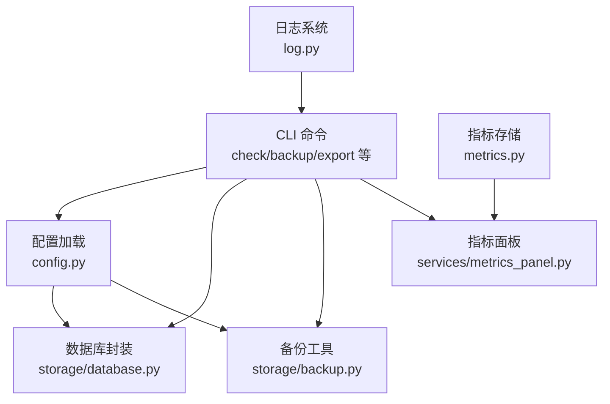
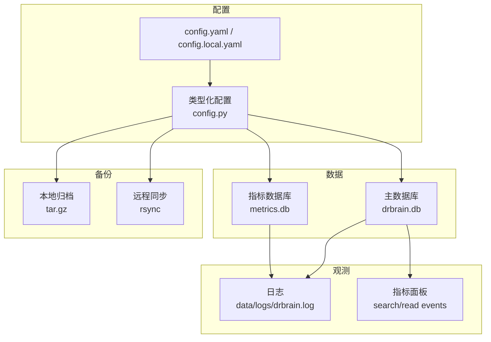
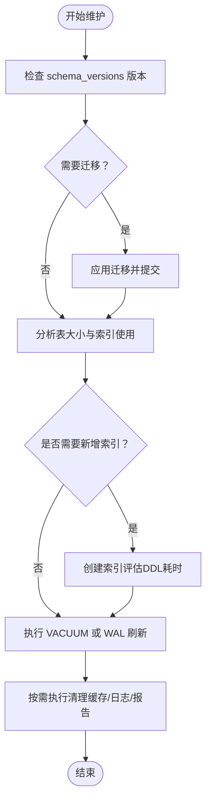
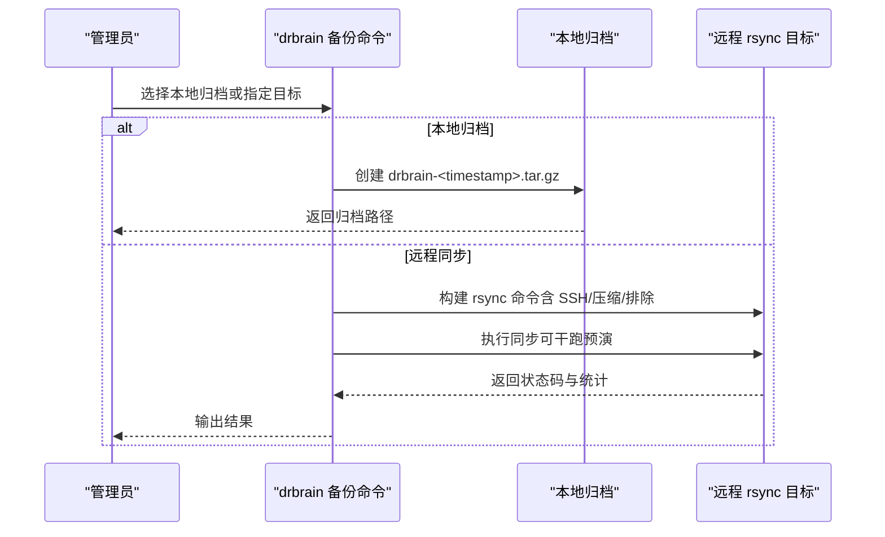
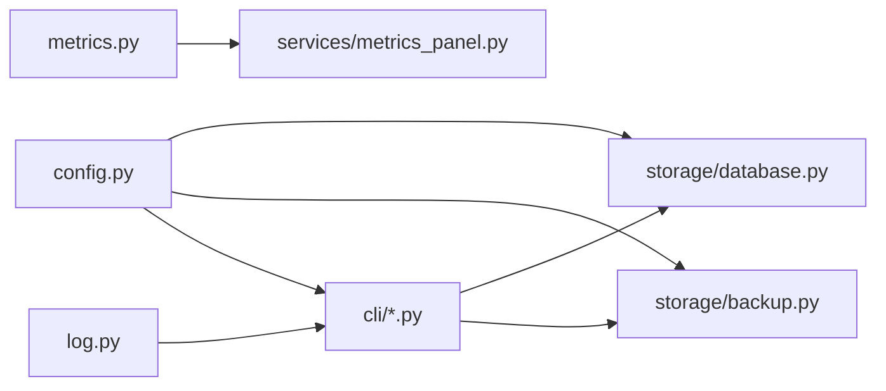

# 维护建议

<cite>
**本文引用的文件**
- [README.md](file://README.md)
- [config.yaml](file://config.yaml)
- [src/drbrain/storage/database.py](file://src/drbrain/storage/database.py)
- [src/drbrain/storage/backup.py](file://src/drbrain/storage/backup.py)
- [src/drbrain/cli/check_commands.py](file://src/drbrain/cli/check_commands.py)
- [src/drbrain/cli/export_commands.py](file://src/drbrain/cli/export_commands.py)
- [src/drbrain/config.py](file://src/drbrain/config.py)
- [docs/configuration.md](file://docs/configuration.md)
- [docs/troubleshooting.md](file://docs/troubleshooting.md)
- [src/drbrain/log.py](file://src/drbrain/log.py)
- [src/drbrain/metrics.py](file://src/drbrain/metrics.py)
- [src/drbrain/services/metrics_panel.py](file://src/drbrain/services/metrics_panel.py)
- [scripts/setup.sh](file://scripts/setup.sh)
</cite>

## 目录
1. [简介](#简介)
2. [项目结构](#项目结构)
3. [核心组件](#核心组件)
4. [架构总览](#架构总览)
5. [详细组件分析](#详细组件分析)
6. [依赖关系分析](#依赖关系分析)
7. [性能考量](#性能考量)
8. [故障排查指南](#故障排查指南)
9. [结论](#结论)
10. [附录](#附录)

## 简介
本指南面向 DrBrain 的系统管理员与运维工程师，提供数据库维护、备份与恢复、版本升级、日常巡检与健康监控、故障预防与应急响应、监控与日志管理以及容量规划与扩容策略的完整实践建议。内容基于仓库中的配置、命令实现与文档进行归纳总结，并结合 SQLite 数据库特性给出可操作的维护步骤。

## 项目结构
DrBrain 采用“命令行工具 + 存储层 + 配置驱动”的组织方式：
- 命令入口与子命令：CLI 模块按功能拆分，统一在 commands 中导出
- 存储层：SQLite 数据库封装与迁移、备份工具、指标存储
- 配置系统：类型化配置类，支持 YAML 合并与环境变量解析
- 文档与脚本：配置参考、故障排查、安装脚本等

图表来源
- [src/drbrain/cli/check_commands.py](file://src/drbrain/cli/check_commands.py)
- [src/drbrain/cli/export_commands.py](file://src/drbrain/cli/export_commands.py)
- [src/drbrain/storage/database.py](file://src/drbrain/storage/database.py)
- [src/drbrain/storage/backup.py](file://src/drbrain/storage/backup.py)
- [src/drbrain/config.py](file://src/drbrain/config.py)
- [src/drbrain/log.py](file://src/drbrain/log.py)
- [src/drbrain/metrics.py](file://src/drbrain/metrics.py)
- [src/drbrain/services/metrics_panel.py](file://src/drbrain/services/metrics_panel.py)

章节来源
- [README.md](file://README.md)
- [docs/configuration.md](file://docs/configuration.md)

## 核心组件
- 数据库（SQLite）：负责论文、概念、论点、图谱边、别名、向量、队列、种子等核心数据的持久化；内置模式迁移与 WAL 模式以提升并发写入稳定性
- 备份：本地 tar.gz 归档与 rsync 远程同步两种方式；支持目标校验、压缩、排除规则
- 配置：类型化配置类，支持多源合并与环境变量替换；覆盖 LLM、MinerU、API、目录、数据库、提取、BM25、队列、抓取、嵌入、备份等
- 日志：基于 loguru 的旋转日志与标准错误输出；会话级标识便于关联事件
- 指标：独立 SQLite 数据库记录 LLM 调用与通用事件；提供用户行为分析（搜索关键词、最读论文、周趋势）

章节来源
- [src/drbrain/storage/database.py](file://src/drbrain/storage/database.py)
- [src/drbrain/storage/backup.py](file://src/drbrain/storage/backup.py)
- [src/drbrain/config.py](file://src/drbrain/config.py)
- [src/drbrain/log.py](file://src/drbrain/log.py)
- [src/drbrain/metrics.py](file://src/drbrain/metrics.py)
- [src/drbrain/services/metrics_panel.py](file://src/drbrain/services/metrics_panel.py)

## 架构总览
DrBrain 的维护面主要围绕以下路径展开：
- 配置驱动：通过 config.yaml 与 config.local.yaml 决定运行参数与外部服务访问
- 数据面：SQLite 主库承载知识图谱数据；metrics.db 承载用户行为指标
- 备份面：本地归档与远程同步双轨制，确保可恢复性
- 观测面：日志与指标双通道，支撑健康监控与问题定位

图表来源
- [config.yaml](file://config.yaml)
- [src/drbrain/config.py](file://src/drbrain/config.py)
- [src/drbrain/storage/database.py](file://src/drbrain/storage/database.py)
- [src/drbrain/storage/backup.py](file://src/drbrain/storage/backup.py)
- [src/drbrain/log.py](file://src/drbrain/log.py)
- [src/drbrain/services/metrics_panel.py](file://src/drbrain/services/metrics_panel.py)

## 详细组件分析

### 数据库维护与性能调优
- 模式与迁移
  - 初始化时自动执行模式创建与迁移；迁移记录于 schema_versions 表
  - 建议在升级前先备份，若迁移失败可回滚到上一版本或从备份恢复
- 索引与查询
  - 已有常用字段索引（如概念类型、标签、时间、论点来源、边关系、队列状态等）
  - 建议根据实际查询模式评估是否需要补充复合索引或统计信息更新
- 并发与锁
  - 使用 WAL 模式降低写入阻塞概率；若仍出现“数据库被锁定”，需检查是否存在长时间事务或并发写入
- 清理与回收
  - 提供批量清理命令（保留 inbox，清理缓存、日志、论文、报告等），用于释放空间
  - 删除论文时会级联删除相关概念、论点、边、队列项、树向量与摘要等

图表来源
- [src/drbrain/storage/database.py](file://src/drbrain/storage/database.py)
- [src/drbrain/cli/check_commands.py](file://src/drbrain/cli/check_commands.py)

章节来源
- [src/drbrain/storage/database.py](file://src/drbrain/storage/database.py)
- [src/drbrain/cli/check_commands.py](file://src/drbrain/cli/check_commands.py)

### 备份策略与恢复流程
- 本地归档（tar.gz）
  - 包含 papers、drbrain.db、可选 workspace 与 reports
  - 输出文件名包含时间戳，便于识别与轮替
- 远程同步（rsync）
  - 支持多种传输模式（默认/追加/追加校验）、压缩、排除规则、SSH 密钥或密码认证
  - 可配置多个目标，支持干跑验证
- 恢复流程
  - 本地：解压 tar.gz 即可恢复
  - 远程：确认远端路径与权限，必要时使用干跑预演

图表来源
- [src/drbrain/cli/export_commands.py](file://src/drbrain/cli/export_commands.py)
- [src/drbrain/storage/backup.py](file://src/drbrain/storage/backup.py)

章节来源
- [src/drbrain/storage/backup.py](file://src/drbrain/storage/backup.py)
- [src/drbrain/cli/export_commands.py](file://src/drbrain/cli/export_commands.py)
- [docs/configuration.md](file://docs/configuration.md)

### 版本升级与迁移步骤
- 升级前准备
  - 备份当前数据（本地归档与/或远程同步）
  - 检查配置文件变更（参考配置文档），必要时生成新模板并合并
- 应用迁移
  - 启动后数据库初始化会自动执行迁移；若失败，检查 schema_versions 并从备份恢复
- 验证
  - 使用 drbrain check 检查依赖、配置与环境
  - 重建索引（如需要）并运行小规模查询验证

章节来源
- [src/drbrain/storage/database.py](file://src/drbrain/storage/database.py)
- [docs/configuration.md](file://docs/configuration.md)
- [docs/troubleshooting.md](file://docs/troubleshooting.md)

### 日常维护检查清单与健康监控
- 环境与依赖
  - Python 包、外部 CLI（MinerU、PyMuPDF）、配置文件存在性与关键令牌设置
- 目录与磁盘
  - data/* 目录存在且权限正确；剩余空间充足
- 数据库
  - 连接可用、无锁、WAL 文件正常；定期检查 schema 版本
- 外部服务
  - LLM、MinerU、DeepXiv、CrossRef、OpenAlex 等连通性与配额
- 指标与日志
  - 指标数据库存在并可写；日志轮转正常，级别合理

章节来源
- [src/drbrain/cli/check_commands.py](file://src/drbrain/cli/check_commands.py)
- [src/drbrain/log.py](file://src/drbrain/log.py)
- [src/drbrain/services/metrics_panel.py](file://src/drbrain/services/metrics_panel.py)

### 故障预防与应急响应
- 预防
  - 定期备份（本地+远程），验证恢复流程
  - 监控磁盘空间与日志体积，设置告警阈值
  - 控制并发与速率限制，避免外部 API 限流
- 应急
  - 数据库被锁定：终止异常进程，检查 WAL/共享内存文件
  - 迁移失败：从备份恢复，上报错误与版本信息
  - LLM 连接失败：切换模型、检查密钥与网络、增加超时
  - 恢复：使用 drbrain backup 创建归档，按需解压恢复

章节来源
- [docs/troubleshooting.md](file://docs/troubleshooting.md)
- [src/drbrain/storage/backup.py](file://src/drbrain/storage/backup.py)

### 监控与日志管理
- 日志
  - 输出到 data/logs/drbrain.log（轮转 10MB，保留 5 份）；警告及以上输出到 stderr
  - 通过 LOGURU_LEVEL 调整全局日志级别
- 指标
  - metrics.db 记录 LLM 调用与通用事件；提供搜索关键词、最读论文、周趋势分析
  - 可通过命令查看指标面板

章节来源
- [src/drbrain/log.py](file://src/drbrain/log.py)
- [src/drbrain/metrics.py](file://src/drbrain/metrics.py)
- [src/drbrain/services/metrics_panel.py](file://src/drbrain/services/metrics_panel.py)
- [src/drbrain/cli/export_commands.py](file://src/drbrain/cli/export_commands.py)

### 容量规划与资源扩容
- 存储
  - papers 目录随论文数量增长；建议定期清理不再使用的缓存与日志
  - WAL 文件与共享内存文件为 SQLite 正常现象，无需删除
- 计算
  - LLM 并发与速率限制：通过配置控制并发数与请求频率
  - 嵌入模型：GPU 显存不足时可降批大小或切换 CPU；更换模型需重新生成向量
- 外部服务
  - API 密钥与配额：为 CrossRef、OpenAlex、Semantic Scholar 等配置更高限额凭据
- 扩容建议
  - 独立部署：将 drbrain.db 与 metrics.db 放置于高性能磁盘
  - 远程备份：配置多目标与压缩，减少带宽占用
  - 监控：建立磁盘、日志、API 调用与 LLM 成本的监控告警

章节来源
- [config.yaml](file://config.yaml)
- [docs/configuration.md](file://docs/configuration.md)
- [src/drbrain/storage/database.py](file://src/drbrain/storage/database.py)

## 依赖关系分析
- 配置驱动：config.py 将 YAML 合并为类型化对象，供其他模块读取
- CLI 依赖：check/backup/export 等命令依赖配置、数据库与备份模块
- 数据库：封装了模式创建、迁移、查询与删除等能力
- 备份：提供本地归档与 rsync 同步能力
- 日志与指标：log.py 与 metrics.py 分别提供日志与指标记录

图表来源
- [src/drbrain/config.py](file://src/drbrain/config.py)
- [src/drbrain/storage/database.py](file://src/drbrain/storage/database.py)
- [src/drbrain/storage/backup.py](file://src/drbrain/storage/backup.py)
- [src/drbrain/cli/check_commands.py](file://src/drbrain/cli/check_commands.py)
- [src/drbrain/cli/export_commands.py](file://src/drbrain/cli/export_commands.py)
- [src/drbrain/log.py](file://src/drbrain/log.py)
- [src/drbrain/metrics.py](file://src/drbrain/metrics.py)
- [src/drbrain/services/metrics_panel.py](file://src/drbrain/services/metrics_panel.py)

## 性能考量
- SQLite 层
  - WAL 模式提升并发写入；定期检查 schema 与索引使用情况
  - 对高频查询字段保持索引，避免全表扫描
- 外部服务
  - 控制并发与速率限制，避免触发限流
  - 使用缓存与合理的 TTL，减少重复请求
- 指标与日志
  - 合理的日志级别与轮转策略，避免 IO 抖动
  - 指标数据库独立存放，避免与主库争用

## 故障排查指南
- 常见问题
  - 模块未找到、命令不可用：确认可编辑安装与 PATH
  - 配置缺失：使用 drbrain setup 生成 config.local.yaml
  - MinerU 不可达：检查令牌与网络，系统会自动回退至 PyMuPDF
  - LLM 超时/解析失败：检查密钥、网络与超时设置，切换模型
  - 数据库被锁定：终止异常进程，检查 WAL/共享内存文件
  - 迁移失败：从备份恢复，上报错误与版本
- 恢复步骤
  - 备份：drbrain backup
  - 重建索引：drbrain index
  - 重置：drbrain clean + drbrain setup --quick + drbrain index

章节来源
- [docs/troubleshooting.md](file://docs/troubleshooting.md)

## 结论
通过规范的备份策略（本地归档+远程同步）、严格的配置管理、持续的健康巡检与日志/指标观测，以及针对 SQLite 的索引与迁移管理，DrBrain 可以在稳定与可扩展的前提下长期运行。升级与扩容应遵循“先备份、再验证”的原则，确保业务连续性。

## 附录
- 快速安装与初始化
  - 使用安装脚本安装依赖与 MinerU CLI，随后运行 drbrain setup 与 drbrain check
- 配置参考
  - 参考配置文档了解各配置项的作用与默认值

章节来源
- [scripts/setup.sh](file://scripts/setup.sh)
- [docs/configuration.md](file://docs/configuration.md)