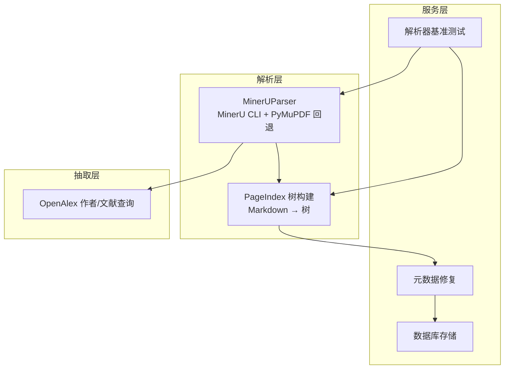
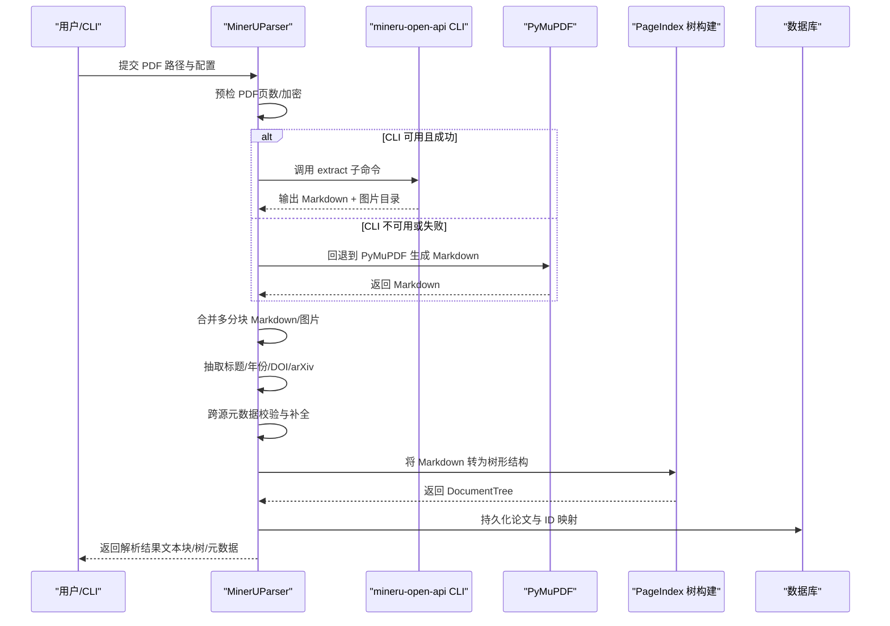
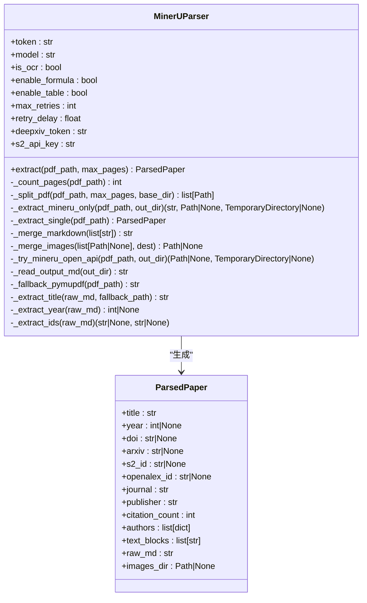
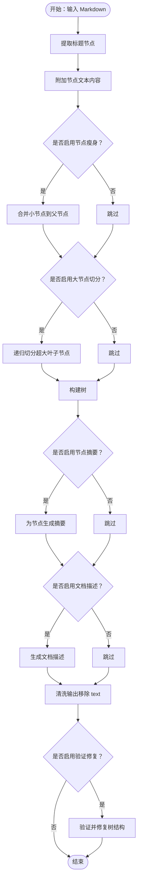
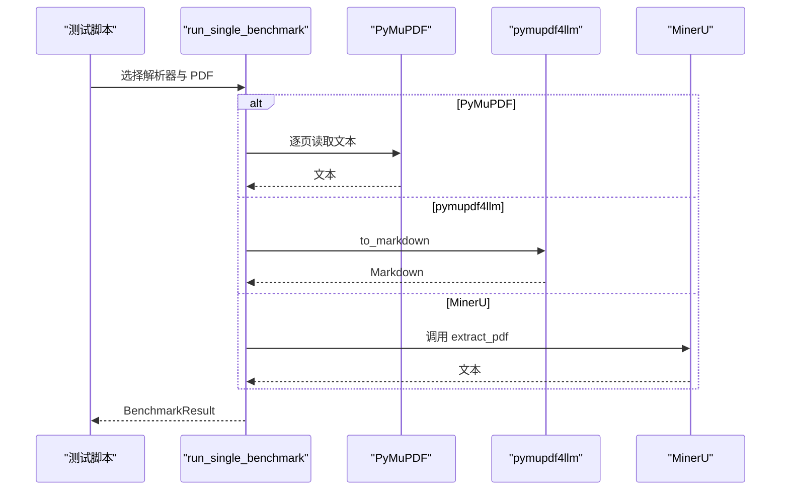
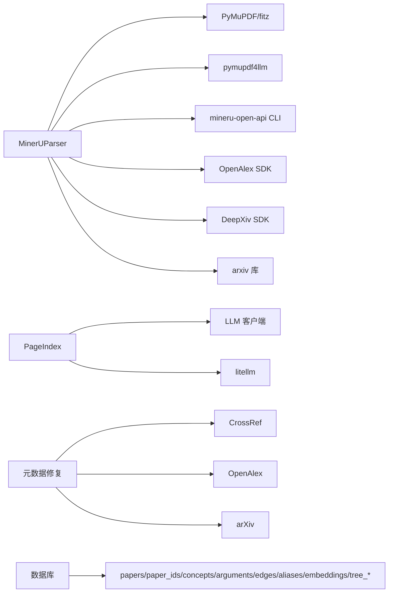

# PDF 处理模块

<cite>
**本文引用的文件**
- [mineru_parser.py](file://src/drbrain/parser/mineru_parser.py)
- [pageindex_parser.py](file://src/drbrain/parser/pageindex_parser.py)
- [parser_benchmark.py](file://src/drbrain/services/parser_benchmark.py)
- [database.py](file://src/drbrain/storage/database.py)
- [openalex.py](file://src/drbrain/extractor/openalex.py)
- [repair.py](file://src/drbrain/services/repair.py)
- [pipeline.py](file://src/drbrain/services/pipeline.py)
- [test_parser.py](file://tests/test_parser.py)
- [test_parser_mineru.py](file://tests/test_parser_mineru.py)
- [test_pageindex_parser.py](file://tests/test_pageindex_parser.py)
- [test_parser_benchmark.py](file://tests/test_parser_benchmark.py)
</cite>

## 目录
1. [简介](#简介)
2. [项目结构](#项目结构)
3. [核心组件](#核心组件)
4. [架构总览](#架构总览)
5. [详细组件分析](#详细组件分析)
6. [依赖分析](#依赖分析)
7. [性能考虑](#性能考虑)
8. [故障排除指南](#故障排除指南)
9. [结论](#结论)
10. [附录](#附录)

## 简介
本技术文档聚焦 DrBrain 的 PDF 处理模块，系统性阐述以下内容：
- MinerU 解析器的工作流程、页面结构提取、文本块识别与元数据处理
- 页面索引解析（PageIndex）的树形结构构建、节区识别与去重机制
- 性能基准测试方法与结果呈现
- 配置参数、错误处理与性能优化策略
- 与存储系统、知识抽取模块的集成关系
- 实际使用示例与最佳实践

## 项目结构
PDF 处理模块位于 src/drbrain/parser 下，主要由两部分组成：
- MinerU 解析器：负责调用外部 CLI 进行 PDF 结构化提取，并在失败时回退到 PyMuPDF
- 页面索引解析器：将 Markdown 转换为结构化树形文档，支持多级回退与验证修复

图示来源
- [mineru_parser.py:95-318](file://src/drbrain/parser/mineru_parser.py#L95-L318)
- [pageindex_parser.py:412-486](file://src/drbrain/parser/pageindex_parser.py#L412-L486)
- [parser_benchmark.py:39-119](file://src/drbrain/services/parser_benchmark.py#L39-L119)
- [repair.py:265-336](file://src/drbrain/services/repair.py#L265-L336)
- [database.py:159-200](file://src/drbrain/storage/database.py#L159-L200)
- [openalex.py:312-383](file://src/drbrain/extractor/openalex.py#L312-L383)

章节来源
- [mineru_parser.py:1-120](file://src/drbrain/parser/mineru_parser.py#L1-L120)
- [pageindex_parser.py:21-60](file://src/drbrain/parser/pageindex_parser.py#L21-L60)

## 核心组件
- MinerUParser：封装 MinerU CLI 调用、分页拆分、合并输出、元数据解析与跨源校验、作者信息抓取、图片合并等
- PageIndex 树构建：从 Markdown 提取标题节点，构建层级树，支持节区切分、摘要生成、文档描述生成、树验证与修复
- 解析器基准测试：统一对比不同解析器（PyMuPDF、MinerU、pymupdf4llm）的耗时与输出大小
- 元数据修复：基于 CrossRef、arXiv、OpenAlex 等源进行字段补全与规范化
- 数据库：持久化论文、ID 映射、概念、论点、边、别名、嵌入、树向量与摘要等

章节来源
- [mineru_parser.py:95-318](file://src/drbrain/parser/mineru_parser.py#L95-L318)
- [pageindex_parser.py:412-486](file://src/drbrain/parser/pageindex_parser.py#L412-L486)
- [parser_benchmark.py:39-119](file://src/drbrain/services/parser_benchmark.py#L39-L119)
- [repair.py:265-336](file://src/drbrain/services/repair.py#L265-L336)
- [database.py:159-200](file://src/drbrain/storage/database.py#L159-L200)

## 架构总览
MinerU 解析器负责“结构化提取 + 元数据增强”，PageIndex 解析器负责“结构化组织 + 内容定位”，二者协同完成从 PDF 到可检索树形结构的完整链路。

图示来源
- [mineru_parser.py:120-199](file://src/drbrain/parser/mineru_parser.py#L120-L199)
- [mineru_parser.py:347-423](file://src/drbrain/parser/mineru_parser.py#L347-L423)
- [mineru_parser.py:432-455](file://src/drbrain/parser/mineru_parser.py#L432-L455)
- [pageindex_parser.py:412-486](file://src/drbrain/parser/pageindex_parser.py#L412-L486)
- [database.py:279-318](file://src/drbrain/storage/database.py#L279-L318)

## 详细组件分析

### MinerU 解析器（MinerUParser）
- 初始化与配置
  - 支持 token、模型、OCR、公式/表格开关、最大重试次数与延迟、DeepXiv/S2 API Key
  - 通过 _try_mineru_open_api 执行 CLI 调用，带超时与重试逻辑
- 页面计数与分块
  - 使用 PyMuPDF 计算页数；超过阈值时按 max_pages 分块，避免单次解析过大
- 结构化提取与回退
  - 成功：读取输出 Markdown 与图片目录
  - 失败：回退到 PyMuPDF（优先生成 Markdown，否则纯文本）
- 合并与后处理
  - 多分块合并：去除后续块标题重复，用分隔线连接
  - 图片复制到统一目录
  - 标题/年份/ID 抽取，arXiv 名称推断
- 元数据解析与跨源校验
  - _resolve_metadata 综合 arXiv、CrossRef、OpenAlex、Semantic Scholar、DeepXiv
  - 年份一致性过滤、标题相似度匹配、优先级合并
- 作者信息抓取
  - 通过 OpenAlex 查询作者列表
- 输出结构
  - ParsedPaper 包含标题、年份、DOI、arXiv、S2/OpenAlex ID、期刊/出版商、引用数、作者、文本块、原始 Markdown、图片目录

图示来源
- [mineru_parser.py:95-318](file://src/drbrain/parser/mineru_parser.py#L95-L318)
- [mineru_parser.py:76-93](file://src/drbrain/parser/mineru_parser.py#L76-L93)

章节来源
- [mineru_parser.py:95-318](file://src/drbrain/parser/mineru_parser.py#L95-L318)
- [mineru_parser.py:319-423](file://src/drbrain/parser/mineru_parser.py#L319-L423)
- [mineru_parser.py:424-521](file://src/drbrain/parser/mineru_parser.py#L424-L521)
- [mineru_parser.py:514-692](file://src/drbrain/parser/mineru_parser.py#L514-L692)
- [mineru_parser.py:694-851](file://src/drbrain/parser/mineru_parser.py#L694-L851)
- [mineru_parser.py:853-932](file://src/drbrain/parser/mineru_parser.py#L853-L932)

### 页面索引解析器（PageIndex）
- 节区提取与树构建
  - 从 Markdown 中提取标题节点，按层级构建树
  - 为每个节点附加文本内容（从当前标题到下一个标题之间的段落）
- 节点瘦身与大节点切分
  - 基于 token 数阈值合并小节点，减少树深度
  - 对叶子节点（无子节点）且文本过长者按段落切分为多个子节点
- 节点 ID 与结构清洗
  - 为树节点分配顺序 ID
  - 输出 JSON 时移除 text 字段以节省 token
- 文档描述生成
  - 基于 LLM 生成文档级一句话描述
- 树验证与修复
  - 移除空叶子、扁平化单链、限制最大深度、单叶分裂
  - 可选地对结构进行采样验证并自动调整阈值重新提取
- 回退策略
  - 无标题：尝试 PDF 目录（Outline）构建树
  - 仍无标题：调用 LLM 识别段落边界并构建树

图示来源
- [pageindex_parser.py:412-486](file://src/drbrain/parser/pageindex_parser.py#L412-L486)
- [pageindex_parser.py:134-244](file://src/drbrain/parser/pageindex_parser.py#L134-L244)
- [pageindex_parser.py:278-291](file://src/drbrain/parser/pageindex_parser.py#L278-L291)
- [pageindex_parser.py:854-894](file://src/drbrain/parser/pageindex_parser.py#L854-L894)
- [pageindex_parser.py:897-928](file://src/drbrain/parser/pageindex_parser.py#L897-L928)

章节来源
- [pageindex_parser.py:412-486](file://src/drbrain/parser/pageindex_parser.py#L412-L486)
- [pageindex_parser.py:134-244](file://src/drbrain/parser/pageindex_parser.py#L134-L244)
- [pageindex_parser.py:278-291](file://src/drbrain/parser/pageindex_parser.py#L278-L291)
- [pageindex_parser.py:854-894](file://src/drbrain/parser/pageindex_parser.py#L854-L894)
- [pageindex_parser.py:897-928](file://src/drbrain/parser/pageindex_parser.py#L897-L928)

### 文本块过滤与去重机制
- 目标节区识别
  - 正则匹配标准学术节区（Abstract、Introduction、Related Work、Method、Results、Conclusion、Limitations、Future Work、Discussion、Supplementary Material）
  - 支持内联标记（如 “Introduction.—”）识别
- 去重与截断
  - 截断至 MAX_CHARS（默认 12000），避免单块过大
  - 若未检测到目标节区，则返回所有文本（去除思考行与标题行），必要时截断
- 与 Pipeline 的衔接
  - 过滤后的文本块进入抽取流水线（实体、关系、共指、精炼）

章节来源
- [mineru_parser.py:853-914](file://src/drbrain/parser/mineru_parser.py#L853-L914)
- [test_parser.py:43-90](file://tests/test_parser.py#L43-L90)

### 元数据处理与跨源校验
- 元数据来源与优先级
  - arXiv（权威获取 arXiv 论文标题/年份）
  - CrossRef（标题搜索，DOI/年份/期刊/出版商）
  - OpenAlex（标题搜索，OpenAlex ID、引用数、期刊）
  - Semantic Scholar（标题搜索，Paper ID、引用数、期刊）
  - DeepXiv（arXiv 论文，TL;DR、关键词、引用数）
- 年份一致性与标题相似度
  - 以文本提取的年份为锚点过滤 API 结果
  - 标题词重叠率阈值确保匹配质量
- 作者信息
  - 通过 OpenAlex 获取作者列表（显示名、ORCID、机构）

章节来源
- [mineru_parser.py:514-692](file://src/drbrain/parser/mineru_parser.py#L514-L692)
- [mineru_parser.py:694-851](file://src/drbrain/parser/mineru_parser.py#L694-L851)
- [openalex.py:312-383](file://src/drbrain/extractor/openalex.py#L312-L383)

### 性能基准测试
- 测试范围
  - PyMuPDF（逐页文本拼接）、pymupdf4llm（Markdown）、MinerU（CLI）
- 输出指标
  - 单次耗时、输出大小、成功状态、错误信息
- 结果汇总
  - 按解析器统计成功率与平均耗时

图示来源
- [parser_benchmark.py:39-119](file://src/drbrain/services/parser_benchmark.py#L39-L119)
- [parser_benchmark.py:122-153](file://src/drbrain/services/parser_benchmark.py#L122-L153)
- [test_parser_benchmark.py:46-77](file://tests/test_parser_benchmark.py#L46-L77)

章节来源
- [parser_benchmark.py:39-119](file://src/drbrain/services/parser_benchmark.py#L39-L119)
- [test_parser_benchmark.py:12-77](file://tests/test_parser_benchmark.py#L12-L77)

### 错误处理与回退策略
- MinerU CLI
  - 未找到 CLI 或预检失败（加密/空页/打开异常）直接回退
  - 超时与非零退出码按指数回退，最多重试 max_retries 次
- PyMuPDF 回退
  - 优先生成 Markdown，失败再转纯文本
- PageIndex
  - 无标题：尝试 PDF 目录回退
  - 仍失败：调用 LLM 识别段落边界
  - 验证修复：采样检查标题与行号一致性，低准确率时自动调整阈值重提

章节来源
- [mineru_parser.py:347-423](file://src/drbrain/parser/mineru_parser.py#L347-L423)
- [mineru_parser.py:432-455](file://src/drbrain/parser/mineru_parser.py#L432-L455)
- [pageindex_parser.py:897-928](file://src/drbrain/parser/pageindex_parser.py#L897-L928)
- [pageindex_parser.py:854-894](file://src/drbrain/parser/pageindex_parser.py#L854-L894)

### 配置参数与使用示例
- MinerUParser 配置
  - token、model、is_ocr、enable_formula、enable_table、max_retries、retry_delay、deepxiv_token、s2_api_key
  - 示例路径：[MinerUParser.__init__:98-118](file://src/drbrain/parser/mineru_parser.py#L98-L118)
- 提取入口
  - 单文件：[MinerUParser.extract:120-127](file://src/drbrain/parser/mineru_parser.py#L120-L127)
  - 多分块：[MinerUParser.extract（分块流程）:129-199](file://src/drbrain/parser/mineru_parser.py#L129-L199)
  - 快捷函数：[extract_pdf:917-932](file://src/drbrain/parser/mineru_parser.py#L917-L932)
- PageIndex 配置
  - TreeConfig：是否瘦身、最小 token 阈值、是否添加节点摘要/文档描述、是否保留节点文本、是否添加节点 ID、最大节点 token
  - 示例路径：[TreeConfig:21-33](file://src/drbrain/parser/pageindex_parser.py#L21-L33)
- PageIndex 使用
  - 基础树构建：[md_to_tree:412-486](file://src/drbrain/parser/pageindex_parser.py#L412-L486)
  - 多级回退：[md_to_tree_with_fallback:897-928](file://src/drbrain/parser/pageindex_parser.py#L897-L928)
- 基准测试
  - 单项测试：[run_single_benchmark:39-101](file://src/drbrain/services/parser_benchmark.py#L39-L101)
  - 批量测试：[run_benchmark:104-119](file://src/drbrain/services/parser_benchmark.py#L104-L119)
  - 表格格式化：[format_results_table:122-153](file://src/drbrain/services/parser_benchmark.py#L122-L153)

章节来源
- [mineru_parser.py:98-118](file://src/drbrain/parser/mineru_parser.py#L98-L118)
- [mineru_parser.py:120-199](file://src/drbrain/parser/mineru_parser.py#L120-L199)
- [mineru_parser.py:917-932](file://src/drbrain/parser/mineru_parser.py#L917-L932)
- [pageindex_parser.py:21-33](file://src/drbrain/parser/pageindex_parser.py#L21-L33)
- [pageindex_parser.py:412-486](file://src/drbrain/parser/pageindex_parser.py#L412-L486)
- [pageindex_parser.py:897-928](file://src/drbrain/parser/pageindex_parser.py#L897-L928)
- [parser_benchmark.py:39-119](file://src/drbrain/services/parser_benchmark.py#L39-L119)
- [parser_benchmark.py:122-153](file://src/drbrain/services/parser_benchmark.py#L122-L153)

## 依赖分析
- 组件耦合
  - MinerUParser 依赖 PyMuPDF（fitz）、pymupdf4llm、外部 CLI、OpenAlex SDK、DeepXiv SDK、arxiv 库
  - PageIndex 解析器依赖 litellm（token 计数）、LLM 客户端
  - 元数据修复依赖 CrossRef、OpenAlex、arXiv
- 外部依赖与集成点
  - 存储：SQLite（papers、paper_ids、concepts、arguments、edges、aliases、embeddings、tree_vectors、tree_summaries）
  - 知识抽取：Pipeline 步骤（ingest/build/embed/closure）
  - 作者信息：OpenAlex 作者查询

图示来源
- [mineru_parser.py:33-51](file://src/drbrain/parser/mineru_parser.py#L33-L51)
- [pageindex_parser.py:15-18](file://src/drbrain/parser/pageindex_parser.py#L15-L18)
- [repair.py:58-241](file://src/drbrain/services/repair.py#L58-L241)
- [database.py:159-200](file://src/drbrain/storage/database.py#L159-L200)

章节来源
- [mineru_parser.py:33-51](file://src/drbrain/parser/mineru_parser.py#L33-L51)
- [pageindex_parser.py:15-18](file://src/drbrain/parser/pageindex_parser.py#L15-L18)
- [repair.py:58-241](file://src/drbrain/services/repair.py#L58-L241)
- [database.py:159-200](file://src/drbrain/storage/database.py#L159-L200)

## 性能考虑
- 解析器选择
  - 对结构化需求高且有 MinerU CLI 的场景优先使用 MinerU；否则 PyMuPDF 是稳定回退
  - 对大文档采用分块策略，避免单次解析超时
- Token 控制
  - PageIndex 的节点瘦身与大节点切分降低 LLM 输入规模
  - 输出 JSON 时移除 text 字段，减少 token 消耗
- 重试与超时
  - MinerU CLI 设置合理的 max_retries 与指数回退，避免瞬时失败导致整体失败
- 数据库写入
  - WAL 模式与外键开启提升并发与一致性
  - 批量插入与索引优化（如 concepts/arguments/edges 等）

## 故障排除指南
- CLI 不可用或失败
  - 现象：MinerU CLI 未找到或返回非零码
  - 处理：检查安装与 PATH；确认 PDF 可打开；查看日志警告；自动回退到 PyMuPDF
  - 参考：[MinerUParser._try_mineru_open_api:347-423](file://src/drbrain/parser/mineru_parser.py#L347-L423)
- 加密/空页 PDF
  - 现象：预检失败（加密/0 页/打开异常）
  - 处理：提示并跳过该文件；回退到 PyMuPDF
  - 参考：[MinerUParser._validate_pdf:28-51](file://src/drbrain/parser/mineru_parser.py#L28-L51)
- 树结构不准确
  - 现象：标题与行号不一致
  - 处理：启用验证修复，自动调整阈值重提；或使用 PDF 目录回退
  - 参考：[md_to_tree_with_fallback:897-928](file://src/drbrain/parser/pageindex_parser.py#L897-L928)
- 元数据不一致
  - 现象：CrossRef 与 arXiv 标题/年份差异
  - 处理：启用年份一致性过滤与标题相似度匹配；必要时人工核验
  - 参考：[MinerUParser._resolve_metadata:514-692](file://src/drbrain/parser/mineru_parser.py#L514-L692)
- 数据库异常
  - 现象：迁移失败或约束冲突
  - 处理：查看迁移日志；确认 schema_versions；检查外键约束
  - 参考：[Database._migrate:175-200](file://src/drbrain/storage/database.py#L175-L200)

章节来源
- [mineru_parser.py:28-51](file://src/drbrain/parser/mineru_parser.py#L28-L51)
- [mineru_parser.py:347-423](file://src/drbrain/parser/mineru_parser.py#L347-L423)
- [pageindex_parser.py:897-928](file://src/drbrain/parser/pageindex_parser.py#L897-L928)
- [mineru_parser.py:514-692](file://src/drbrain/parser/mineru_parser.py#L514-L692)
- [database.py:175-200](file://src/drbrain/storage/database.py#L175-L200)

## 结论
PDF 处理模块通过 MinerU 解析器与 PageIndex 树构建实现了从 PDF 到结构化树的完整链路，结合多源元数据校验与回退策略，兼顾准确性与鲁棒性。配合数据库与抽取流水线，可高效支撑知识抽取与推理任务。建议在生产环境中启用分块、重试与验证修复，并根据文档类型选择合适的解析器与阈值。

## 附录
- 集成关系
  - Pipeline 步骤：ingest（解析、识别、树结构、注册）→ build（抽取）→ embed（嵌入）→ closure（推理）
  - 存储：papers、paper_ids、concepts、arguments、edges、aliases、embeddings、tree_vectors、tree_summaries
  - 元数据修复：基于 CrossRef、arXiv、OpenAlex 的字段补全与规范化
- 最佳实践
  - 大文档优先分块；启用年份一致性与标题相似度匹配；启用树验证修复；合理设置 PageIndex 阈值；定期运行元数据修复

章节来源
- [pipeline.py:23-50](file://src/drbrain/services/pipeline.py#L23-L50)
- [database.py:159-200](file://src/drbrain/storage/database.py#L159-L200)
- [repair.py:265-336](file://src/drbrain/services/repair.py#L265-L336)