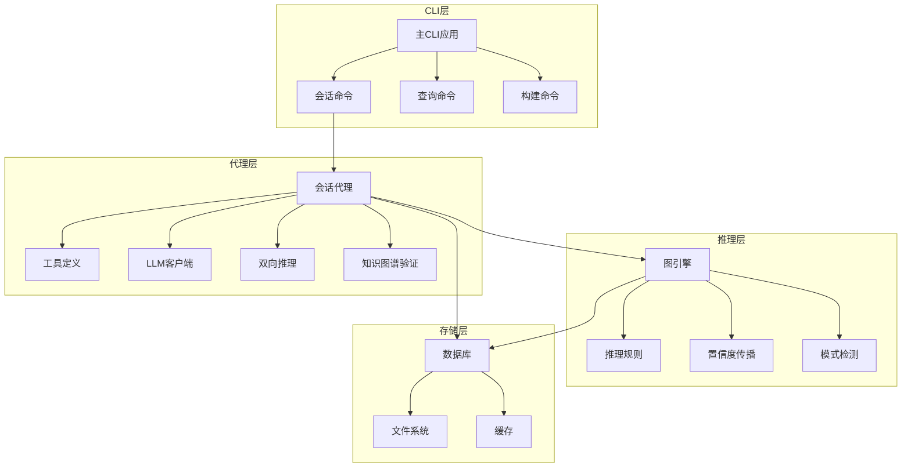
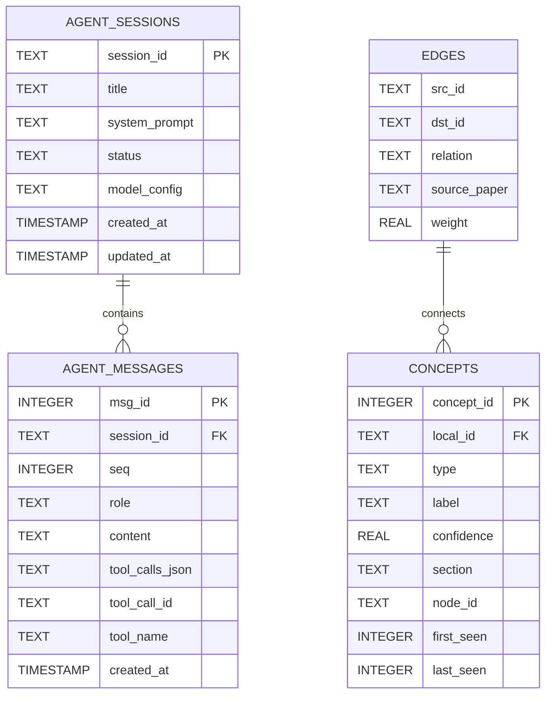
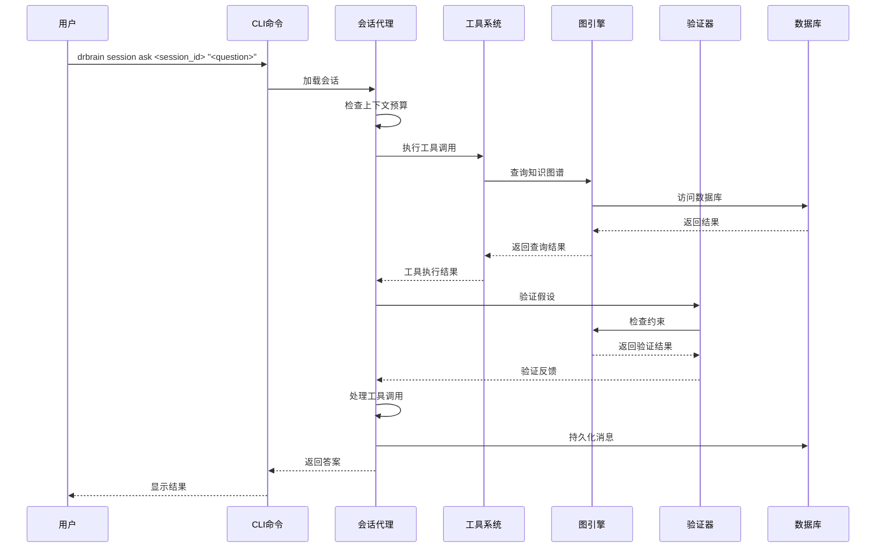
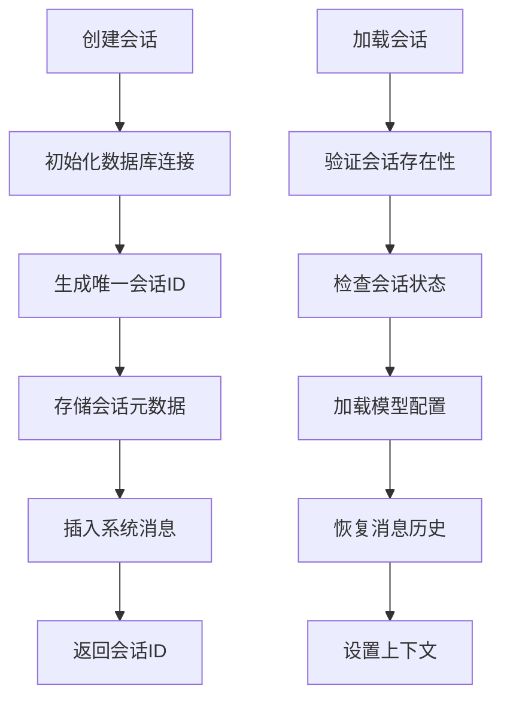
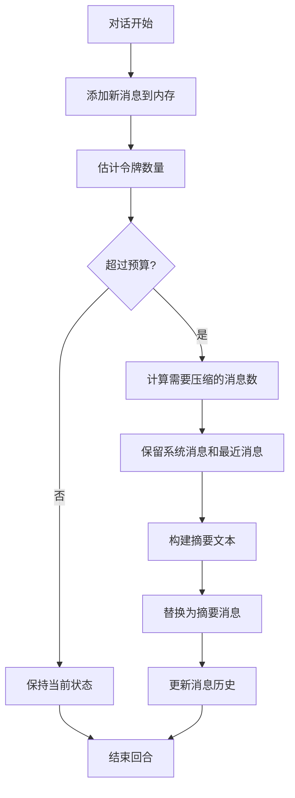
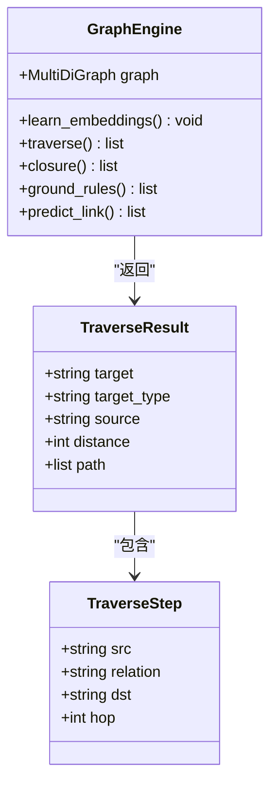
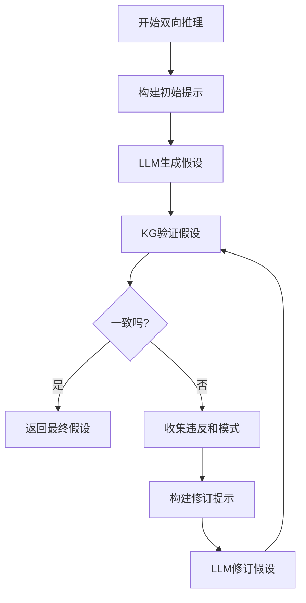
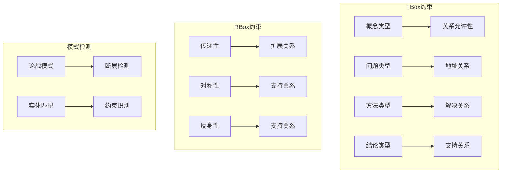
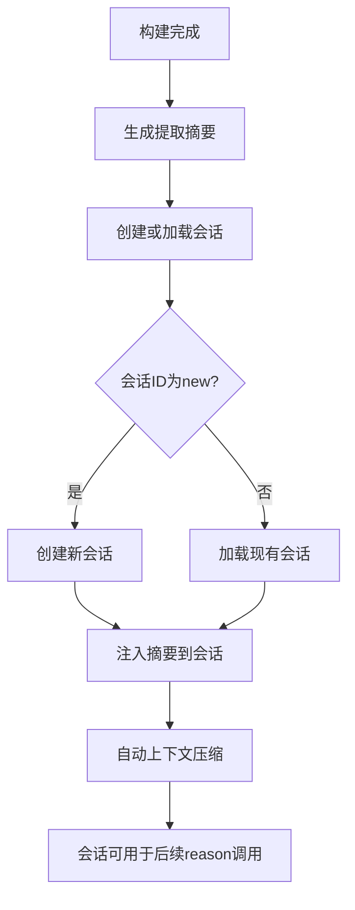
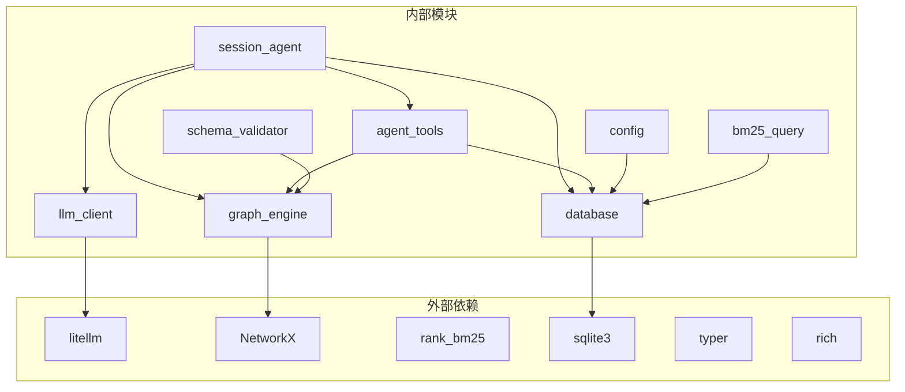

# 会话代理系统

<cite>
**本文档引用的文件**
- [session_agent.py](file://src/drbrain/extractor/session_agent.py)
- [session_commands.py](file://src/drbrain/cli/session_commands.py)
- [agent_tools.py](file://src/drbrain/extractor/agent_tools.py)
- [engine.py](file://src/drbrain/graph/engine.py)
- [database.py](file://src/drbrain/storage/database.py)
- [config.py](file://src/drbrain/config.py)
- [main.py](file://src/drbrain/cli/main.py)
- [llm_client.py](file://src/drbrain/extractor/llm_client.py)
- [bm25.py](file://src/drbrain/query/bm25.py)
- [tree_retrieval.py](file://src/drbrain/query/tree_retrieval.py)
- [test_session_agent.py](file://tests/test_session_agent.py)
- [schema.py](file://src/drbrain/validator/schema.py)
- [README.md](file://README.md)
- [getting-started.md](file://docs/getting-started.md)
- [CLAUDE.md](file://CLAUDE.md)
- [architecture.md](file://docs/architecture.md)
- [cli-reference.md](file://docs/cli-reference.md)
- [build_commands.py](file://src/drbrain/cli/build_commands.py)
- [reasoner.py](file://src/drbrain/extractor/reasoner.py)
</cite>

## 更新摘要
**变更内容**
- 新增双向推理功能（reason_bidirectional）实现
- 完善知识图谱验证机制（kg_validate）
- 增强上下文注入功能（inject_context）
- 优化会话生命周期管理
- 完善测试覆盖和文档示例
- 新增会话使用示例和CLI参考文档更新
- 扩展会话注入机制描述

## 目录
1. [简介](#简介)
2. [项目结构](#项目结构)
3. [核心组件](#核心组件)
4. [架构概览](#架构概览)
5. [详细组件分析](#详细组件分析)
6. [双向推理系统](#双向推理系统)
7. [知识图谱验证](#知识图谱验证)
8. [会话上下文注入机制](#会话上下文注入机制)
9. [依赖关系分析](#依赖关系分析)
10. [性能考虑](#性能考虑)
11. [故障排除指南](#故障排除指南)
12. [结论](#结论)

## 简介

DrBrain 会话代理系统是一个基于命令行界面的智能知识图谱推理平台，专门设计用于学术研究和文献分析。该系统的核心功能是提供持久化的会话式推理能力，允许用户与AI代理进行多轮对话，探索复杂的学术概念和研究关系。

系统采用符号驱动的知识图谱推理方法，结合轻量级向量检索技术，为AI代理提供了结构化的学术知识库。会话代理系统支持跨CLI调用的上下文连续性，自动处理长对话的历史压缩，并通过工具调用模式与知识图谱进行交互。

**更新** 新增了双向推理系统和知识图谱验证功能，实现了LLM假设与KG约束的迭代验证机制。会话代理系统现在支持持久化会话、跨CLI调用上下文连续性、自动上下文压缩等功能。

## 项目结构

DrBrain项目的整体架构采用模块化设计，主要分为以下几个核心层次：

**图表来源**
- [main.py:78-149](file://src/drbrain/cli/main.py#L78-L149)
- [session_commands.py:14-15](file://src/drbrain/cli/session_commands.py#L14-L15)
- [session_agent.py:38-50](file://src/drbrain/extractor/session_agent.py#L38-L50)

**章节来源**
- [README.md:1-112](file://README.md#L1-L112)
- [getting-started.md:1-253](file://docs/getting-started.md#L1-L253)

## 核心组件

### 会话代理系统架构

会话代理系统的核心组件包括：

1. **SessionAgent类**：负责管理持久化会话状态，处理多轮对话，执行工具调用
2. **工具系统**：提供搜索、导航、查询等知识图谱操作能力
3. **图引擎**：维护和操作知识图谱，执行推理规则
4. **数据库层**：存储会话历史、知识图谱数据和元信息
5. **LLM集成**：提供多模型支持和工具调用功能
6. **双向推理引擎**：实现LLM假设与知识图谱约束的迭代验证
7. **知识图谱验证器**：提供TBox/RBox一致性检查和模式检测

### 数据模型设计

系统使用SQLite作为主要存储后端，包含以下核心表结构：

**图表来源**
- [database.py:157-181](file://src/drbrain/storage/database.py#L157-L181)

**章节来源**
- [session_agent.py:38-105](file://src/drbrain/extractor/session_agent.py#L38-L105)
- [database.py:157-181](file://src/drbrain/storage/database.py#L157-L181)

## 架构概览

会话代理系统采用分层架构设计，确保各组件之间的职责分离和松耦合：

**图表来源**
- [session_commands.py:61-98](file://src/drbrain/cli/session_commands.py#L61-L98)
- [session_agent.py:195-297](file://src/drbrain/extractor/session_agent.py#L195-L297)

## 详细组件分析

### 会话代理核心实现

会话代理系统的核心功能通过SessionAgent类实现，该类提供了完整的会话生命周期管理：

#### 会话创建流程

**图表来源**
- [session_agent.py:64-105](file://src/drbrain/extractor/session_agent.py#L64-L105)
- [session_agent.py:107-179](file://src/drbrain/extractor/session_agent.py#L107-L179)

#### 工具调用机制

会话代理系统支持多种工具调用，每种工具都有特定的功能：

| 工具名称 | 功能描述 | 参数 | 返回值 |
|---------|---------|------|--------|
| search_concepts | 搜索知识图谱中的概念 | query, limit | 概念列表 |
| get_neighbors | 获取概念节点的邻居 | node, hops, direction | 邻居节点信息 |
| find_path | 查找两个概念间的最短路径 | src, dst | 路径信息 |
| get_document_structure | 获取论文的章节树结构 | paper_id | 结构信息 |
| get_section_content | 获取论文特定章节内容 | paper_id, node_id | 章节内容 |
| search_tree | 跨论文的语义搜索 | query | 相关章节 |
| get_raptor_summaries | 获取RAPTOR摘要 | paper_id | 摘要信息 |

**章节来源**
- [session_agent.py:195-297](file://src/drbrain/extractor/session_agent.py#L195-L297)
- [agent_tools.py:15-135](file://src/drbrain/extractor/agent_tools.py#L15-L135)

### 上下文管理与压缩

系统实现了智能的上下文管理机制，能够自动处理长对话的历史压缩：

**图表来源**
- [session_agent.py:341-374](file://src/drbrain/extractor/session_agent.py#L341-L374)

**章节来源**
- [session_agent.py:341-374](file://src/drbrain/extractor/session_agent.py#L341-L374)

### CLI命令接口

会话代理系统提供了完整的命令行接口：

| 命令 | 子命令 | 描述 | 选项 |
|------|--------|------|------|
| drbrain session | new | 创建新会话 | --title, --models |
| drbrain session | ask | 在现有会话中提问 | --max-turns, --json |
| drbrain session | chat | 进入交互式聊天模式 | --max-turns |
| drbrain session | list | 列出所有活动会话 | --all |
| drbrain session | delete | 删除会话 | --force |
| drbrain session | export | 导出会话历史 | --output, --format |

**章节来源**
- [session_commands.py:33-290](file://src/drbrain/cli/session_commands.py#L33-L290)

### 知识图谱推理引擎

图引擎是系统的核心推理组件，提供了丰富的图操作和规则推理能力：

**图表来源**
- [engine.py:33-315](file://src/drbrain/graph/engine.py#L33-L315)

**章节来源**
- [engine.py:124-315](file://src/drbrain/graph/engine.py#L124-L315)

## 双向推理系统

**新增** 双向推理系统是会话代理的核心创新功能，实现了LLM假设与知识图谱约束的迭代验证机制。

### 推理循环机制

**图表来源**
- [session_agent.py:359-453](file://src/drbrain/extractor/session_agent.py#L359-L453)

### 验证器功能

双向推理系统依赖于kg_validate函数进行知识图谱验证：

| 验证类型 | 功能描述 | 检测内容 |
|---------|---------|---------|
| TBox验证 | 类型约束检查 | 实体类型与关系的合法性 |
| RBox验证 | 关系约束检查 | 对称性、传递性等关系属性 |
| 模式检测 | 图模式识别 | 论战、断层等结构模式 |

**章节来源**
- [session_agent.py:359-453](file://src/drbrain/extractor/session_agent.py#L359-L453)
- [agent_tools.py:269-408](file://src/drbrain/extractor/agent_tools.py#L269-L408)

## 知识图谱验证

**新增** 知识图谱验证系统提供了全面的约束检查和模式识别能力。

### 验证规则体系

**图表来源**
- [schema.py:7-51](file://src/drbrain/validator/schema.py#L7-L51)
- [agent_tools.py:269-408](file://src/drbrain/extractor/agent_tools.py#L269-L408)

### 实体匹配机制

kg_validate函数实现了智能的实体匹配和验证：

1. **实体识别**：从假设文本中提取概念标签
2. **子图构建**：获取相关实体的子图
3. **约束检查**：验证TBox和RBox约束
4. **模式发现**：检测图中的特殊模式

**章节来源**
- [agent_tools.py:269-408](file://src/drbrain/extractor/agent_tools.py#L269-L408)
- [schema.py:63-95](file://src/drbrain/validator/schema.py#L63-L95)

## 会话上下文注入机制

**新增** 会话上下文注入机制是会话代理系统的重要功能，允许在构建过程中将提取结果注入到会话中，实现跨CLI调用的上下文连续性。

### 注入流程

**图表来源**
- [build_commands.py:312-325](file://src/drbrain/cli/build_commands.py#L312-L325)
- [session_agent.py:341-356](file://src/drbrain/extractor/session_agent.py#L341-L356)

### 注入功能特性

1. **结构化摘要**：将提取的概念、关系、合并和修正信息格式化为结构化文本
2. **标签标识**：为注入的内容添加标签，便于识别和管理
3. **自动压缩**：注入大量内容时触发上下文压缩机制
4. **跨调用连续性**：注入的内容在后续CLI调用中持续可用

**章节来源**
- [build_commands.py:97-139](file://src/drbrain/cli/build_commands.py#L97-L139)
- [session_agent.py:341-356](file://src/drbrain/extractor/session_agent.py#L341-L356)

## 依赖关系分析

会话代理系统的依赖关系体现了清晰的分层架构：

**图表来源**
- [session_agent.py:19-24](file://src/drbrain/extractor/session_agent.py#L19-L24)
- [engine.py:9-13](file://src/drbrain/graph/engine.py#L9-L13)

### 关键依赖说明

1. **litellm**：提供统一的LLM API抽象，支持多种AI服务提供商
2. **NetworkX**：用于知识图谱的图操作和算法实现
3. **rank_bm25**：实现BM25全文检索算法
4. **sqlite3**：作为主要的数据存储后端
5. **typer**：提供命令行接口框架
6. **rich**：提供富文本输出支持

**章节来源**
- [llm_client.py:117-289](file://src/drbrain/extractor/llm_client.py#L117-L289)
- [engine.py:1-14](file://src/drbrain/graph/engine.py#L1-L14)

## 性能考虑

会话代理系统在设计时充分考虑了性能优化：

### 内存管理
- 使用令牌预算机制控制上下文大小
- 实现智能的历史压缩策略
- 支持增量式图嵌入训练

### 存储优化
- SQLite WAL模式提高并发性能
- 合理的索引设计加速查询
- 分层存储策略优化大数据集访问

### 推理效率
- 图遍历算法的早期终止条件
- 向量化操作减少重复计算
- 缓存机制避免重复查询
- **新增** 双向推理的早期停止条件

### 验证优化
- **新增** 实体标签的高效匹配算法
- **新增** 子图构建的优化策略
- **新增** 模式检测的增量更新

## 故障排除指南

### 常见问题及解决方案

1. **会话加载失败**
   - 检查会话ID是否正确
   - 验证数据库连接状态
   - 确认会话未被软删除

2. **LLM调用超时**
   - 检查网络连接
   - 验证API密钥配置
   - 调整超时参数

3. **工具调用错误**
   - 确认工具名称正确
   - 检查参数格式
   - 验证依赖服务可用性

4. **双向推理失败**
   - **新增** 检查知识图谱完整性
   - **新增** 验证模型配置
   - **新增** 确认验证器依赖

**章节来源**
- [test_session_agent.py:81-101](file://tests/test_session_agent.py#L81-L101)

## 结论

DrBrain会话代理系统是一个功能完整、架构清晰的学术知识图谱推理平台。系统通过持久化的会话管理、智能的上下文压缩、丰富的工具调用机制，以及新增的双向推理和知识图谱验证功能，为用户提供了强大的AI辅助研究能力。

系统的主要优势包括：
- 完整的会话生命周期管理
- 符号驱动的知识图谱推理
- 轻量级向量检索优化
- 模块化的架构设计
- 完善的测试覆盖
- **新增** 双向推理机制
- **新增** 知识图谱验证系统
- **新增** 会话上下文注入机制
- **新增** 跨CLI调用上下文连续性

未来可以考虑的改进方向：
- 更高级的上下文压缩算法
- 分布式存储支持
- 实时协作功能
- 更丰富的可视化界面
- **新增** 推理过程的可解释性增强
- **新增** 验证结果的可视化展示
- **新增** 会话历史的版本控制功能