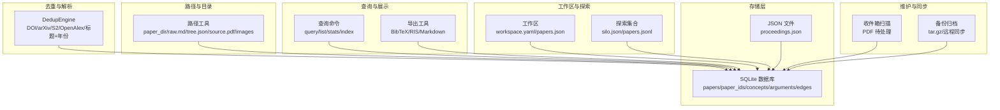
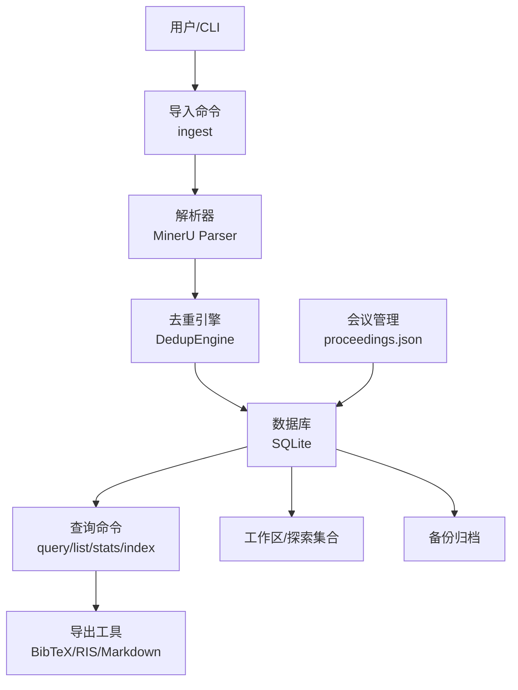
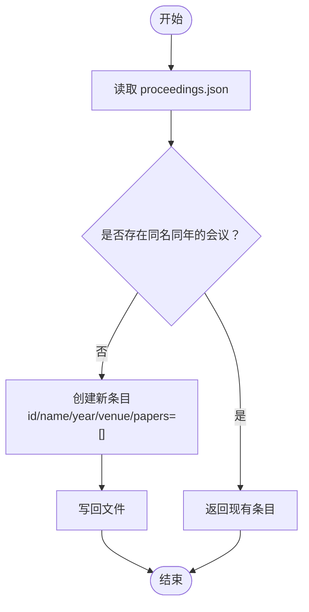
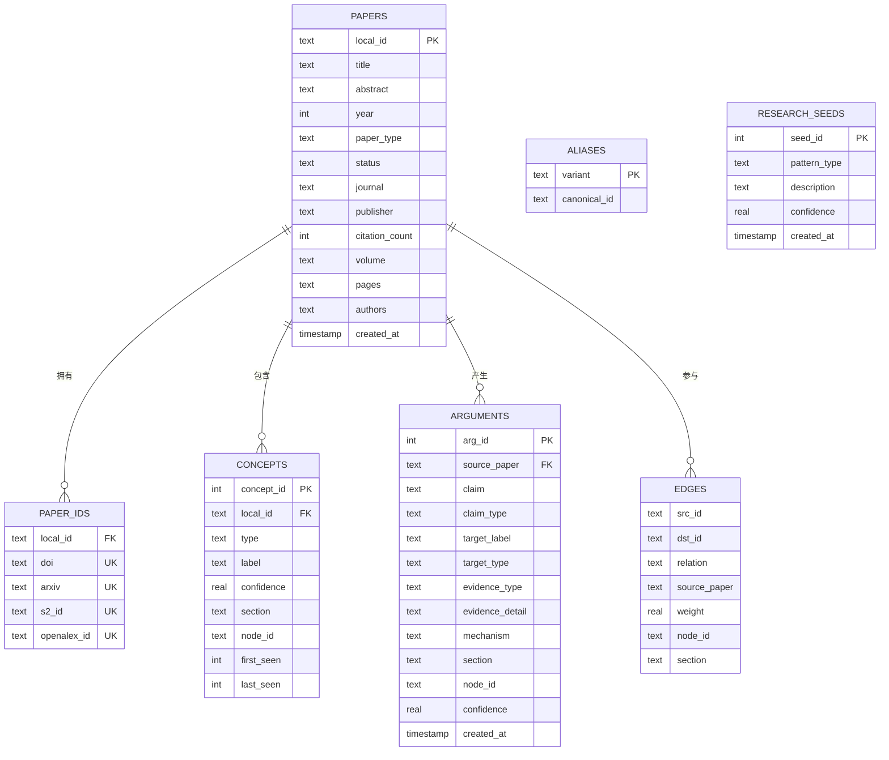
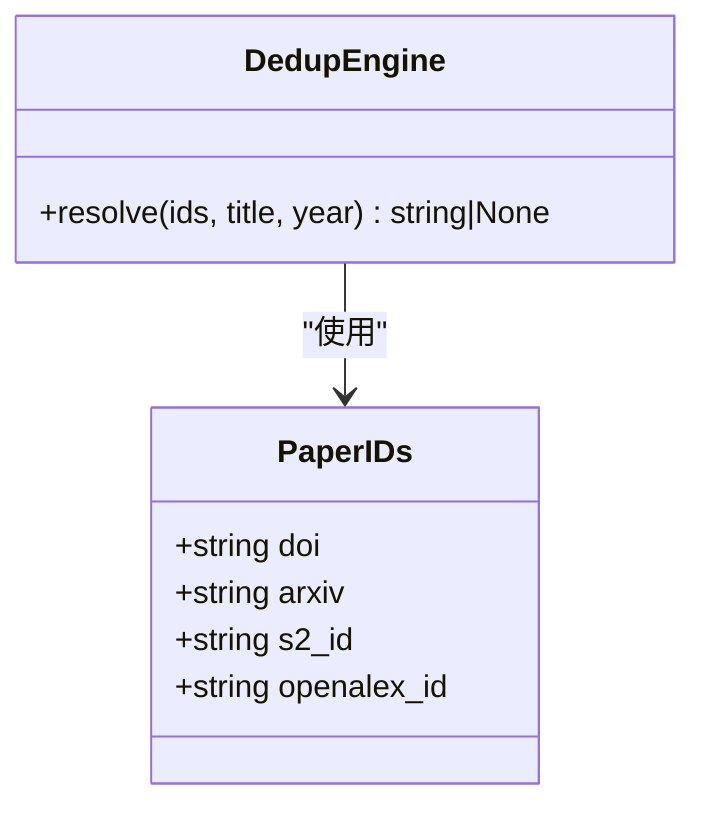
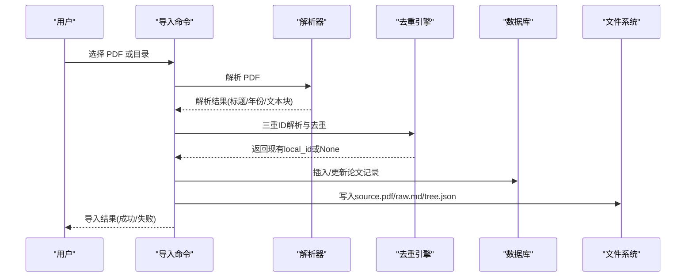
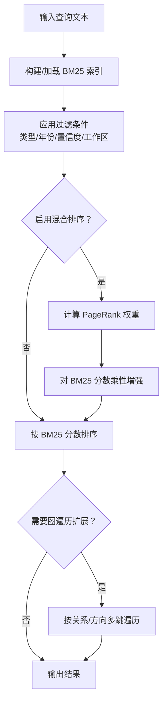
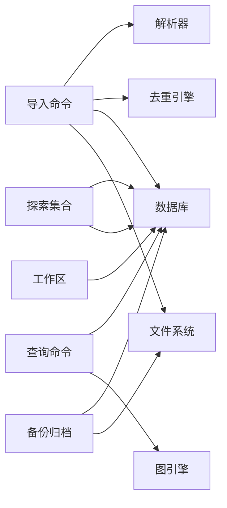

# 会议论文存储

<cite>
**本文引用的文件**
- [proceedings.py](file://src/drbrain/storage/proceedings.py)
- [database.py](file://src/drbrain/storage/database.py)
- [paths.py](file://src/drbrain/storage/paths.py)
- [inbox.py](file://src/drbrain/storage/inbox.py)
- [export.py](file://src/drbrain/storage/export.py)
- [explore.py](file://src/drbrain/storage/explore.py)
- [backup.py](file://src/drbrain/storage/backup.py)
- [workspace.py](file://src/drbrain/storage/workspace.py)
- [resolver.py](file://src/drbrain/dedup/resolver.py)
- [query_commands.py](file://src/drbrain/cli/query_commands.py)
- [ingest_commands.py](file://src/drbrain/cli/ingest_commands.py)
- [_common.py](file://src/drbrain/cli/_common.py)
- [CLAUDE.md](file://CLAUDE.md)
- [test_proceedings.py](file://tests/test_proceedings.py)
</cite>

## 目录
1. [简介](#简介)
2. [项目结构](#项目结构)
3. [核心组件](#核心组件)
4. [架构总览](#架构总览)
5. [详细组件分析](#详细组件分析)
6. [依赖关系分析](#依赖关系分析)
7. [性能考虑](#性能考虑)
8. [故障排除指南](#故障排除指南)
9. [结论](#结论)
10. [附录](#附录)

## 简介
本技术文档面向 DrBrain 的会议论文存储系统，围绕会议论文的数据模型、存储结构与管理机制展开，重点覆盖以下方面：
- 会议信息存储：会议名称、年份、地点等元数据的持久化与检索
- 论文集合管理：会议论文与会议的关联、论文集合的增删改查
- 元数据处理：论文标题、作者、期刊、卷期页码、DOI 等多源标识符的标准化与去重
- 导入流程：从 PDF 解析到论文记录建立的完整流水线，含数据标准化与去重
- 检索与索引：BM25 文本检索、图遍历扩展、混合排序与主题分类
- 批量操作与统计：批量导入、统计报表与工作区隔离
- 维护与迁移：备份归档、版本迁移、数据一致性保障

## 项目结构
DrBrain 将会议论文存储与管理能力分布在多个子模块中：
- 存储层：SQLite 数据库（papers、paper_ids、concepts、arguments、edges 等表）与轻量 JSON 文件（proceedings.json）
- 路径与目录：统一的论文目录结构与文件命名规范
- 去重与解析：三重标识符解析（DOI/arXiv/S2/OpenAlex）与标题规范化
- 查询与展示：CLI 查询命令、统计输出、导出格式（BibTeX/RIS/Markdown）
- 工作区与探索：论文子集管理与探索性集合
- 备份与同步：本地 tar.gz 备份与远程 rsync 同步

**图表来源**
- [database.py:10-156](file://src/drbrain/storage/database.py#L10-L156)
- [proceedings.py:1-122](file://src/drbrain/storage/proceedings.py#L1-L122)
- [paths.py:1-29](file://src/drbrain/storage/paths.py#L1-L29)
- [resolver.py:1-82](file://src/drbrain/dedup/resolver.py#L1-L82)
- [query_commands.py:1-738](file://src/drbrain/cli/query_commands.py#L1-L738)
- [export.py:1-180](file://src/drbrain/storage/export.py#L1-L180)
- [workspace.py:1-212](file://src/drbrain/storage/workspace.py#L1-L212)
- [explore.py:1-203](file://src/drbrain/storage/explore.py#L1-L203)
- [inbox.py:1-55](file://src/drbrain/storage/inbox.py#L1-L55)
- [backup.py:1-240](file://src/drbrain/storage/backup.py#L1-L240)

**章节来源**
- [CLAUDE.md:171-188](file://CLAUDE.md#L171-L188)

## 核心组件
- 会议论文数据库（SQLite）
  - 主表 papers：论文主记录（标题、摘要、年份、类型、状态、期刊、出版者、引用数、卷期页码、作者、创建时间）
  - 关联表 paper_ids：外部标识符（DOI/arXiv/S2/OpenAlex）唯一约束
  - 结构化实体：concepts（概念）、arguments（论点）、edges（关系边）、aliases（别名映射）、research_seeds（研究种子）
  - 索引与迁移：按类型/标签/年份等字段建立索引；支持 schema_versions 迁移
- 会议信息存储（JSON）
  - proceedings.json：会议条目（id/name/year/venue/papers），支持去重创建、添加论文、列表与查询
- 路径与目录
  - 统一的 per-paper 目录结构：source.pdf、raw.md、tree.json、images/
- 去重与解析
  - DedupEngine：优先级匹配（DOI > arXiv > S2 > OpenAlex > 标题+年份模糊匹配）
  - 标准化函数：DOI/arXiv 规范化、标题键生成与哈希
- 查询与展示
  - CLI 查询命令：支持 BM25 检索、图遍历扩展、混合排序、过滤条件、JSON/JSONL 输出
  - 导出工具：BibTeX、RIS、Markdown 格式转换
- 工作区与探索
  - 工作区：workspace.yaml + refs/papers.json，支持增删论文、重命名、删除
  - 探索集合：独立 silo.json + papers.jsonl，支持关键字检索
- 维护与同步
  - 收件箱扫描：待处理 PDF 移动与失败日志
  - 备份归档：本地 tar.gz 与远程 rsync 同步

**章节来源**
- [database.py:10-156](file://src/drbrain/storage/database.py#L10-L156)
- [proceedings.py:1-122](file://src/drbrain/storage/proceedings.py#L1-L122)
- [paths.py:1-29](file://src/drbrain/storage/paths.py#L1-L29)
- [resolver.py:1-82](file://src/drbrain/dedup/resolver.py#L1-L82)
- [query_commands.py:1-738](file://src/drbrain/cli/query_commands.py#L1-L738)
- [export.py:1-180](file://src/drbrain/storage/export.py#L1-L180)
- [workspace.py:1-212](file://src/drbrain/storage/workspace.py#L1-L212)
- [explore.py:1-203](file://src/drbrain/storage/explore.py#L1-L203)
- [inbox.py:1-55](file://src/drbrain/storage/inbox.py#L1-L55)
- [backup.py:1-240](file://src/drbrain/storage/backup.py#L1-L240)

## 架构总览
DrBrain 的会议论文存储采用“轻量 JSON + SQLite”的双轨存储模式：
- 会议层面：proceedings.json 以会议为单位组织论文清单，适合快速检索与人工维护
- 论文层面：SQLite 数据库存储论文元数据、结构化实体与图谱关系，支撑复杂查询与推理

**图表来源**
- [ingest_commands.py:26-110](file://src/drbrain/cli/ingest_commands.py#L26-L110)
- [_common.py:26-310](file://src/drbrain/cli/_common.py#L26-L310)
- [resolver.py:50-82](file://src/drbrain/dedup/resolver.py#L50-L82)
- [database.py:159-775](file://src/drbrain/storage/database.py#L159-L775)
- [query_commands.py:283-738](file://src/drbrain/cli/query_commands.py#L283-L738)
- [export.py:170-180](file://src/drbrain/storage/export.py#L170-L180)
- [workspace.py:103-168](file://src/drbrain/storage/workspace.py#L103-L168)
- [explore.py:89-144](file://src/drbrain/storage/explore.py#L89-L144)
- [backup.py:26-63](file://src/drbrain/storage/backup.py#L26-L63)
- [proceedings.py:31-64](file://src/drbrain/storage/proceedings.py#L31-L64)

## 详细组件分析

### 会议信息存储（proceedings.json）
- 设计目标：以轻量 JSON 数组保存会议条目，每个条目包含 id、name、year、venue、papers 列表
- 关键能力
  - 创建会议：去重检查（name+year），返回或创建新条目
  - 添加论文：向会议 papers 列表追加，自动去重
  - 列表与查询：按年份降序、名称排序列出；按 id 获取单个会议
- 使用场景：会议论文集合管理、批量标注与导出

**图表来源**
- [proceedings.py:17-64](file://src/drbrain/storage/proceedings.py#L17-L64)

**章节来源**
- [proceedings.py:1-122](file://src/drbrain/storage/proceedings.py#L1-L122)
- [test_proceedings.py:49-87](file://tests/test_proceedings.py#L49-L87)

### 论文数据库（SQLite）与数据模型
- 表结构概览
  - papers：主表，包含标题、摘要、年份、类型、状态、期刊、出版者、引用数、卷期页码、作者、创建时间
  - paper_ids：外部标识符唯一表，支持 DOI/arXiv/S2/OpenAlex
  - concepts/arguments/edges：结构化知识抽取与图谱关系
  - aliases/research_seeds/confidence_queue：别名映射、研究种子与置信度队列
  - embeddings/tree_vectors/tree_summaries/vector_metadata：嵌入与树向量
- 索引与查询
  - 概念类型/标签/首次出现时间等索引提升检索效率
  - 提供按外部 ID 查找、标题+年份模糊匹配、获取全部论文/单篇论文等常用查询
- 版本迁移
  - schema_versions 记录迁移版本，按顺序执行迁移脚本，确保历史数据库兼容

**图表来源**
- [database.py:10-156](file://src/drbrain/storage/database.py#L10-L156)

**章节来源**
- [database.py:159-775](file://src/drbrain/storage/database.py#L159-L775)

### 去重与解析（DedupEngine）
- 三重标识符解析
  - 规范化：DOI 去前缀、arXiv 去版本号
  - 优先级：DOI > arXiv > S2 > OpenAlex > 标题+年份模糊匹配
- 标题规范化
  - 去除冠词、标点与多余空白，生成标题键与短哈希用于缓存与比较
- 实践意义
  - 避免重复入库，合并同一论文的不同占位记录
  - 与外部数据库（CrossRef/OpenAlex）联动，提升匹配准确率

**图表来源**
- [resolver.py:10-82](file://src/drbrain/dedup/resolver.py#L10-L82)

**章节来源**
- [resolver.py:1-82](file://src/drbrain/dedup/resolver.py#L1-L82)
- [_common.py:312-329](file://src/drbrain/cli/_common.py#L312-L329)

### 导入流程与数据标准化
- 流程步骤
  - 扫描收件箱：发现待处理 PDF
  - 单篇导入：解析 PDF -> 识别外部 ID -> 生成树结构 -> 写入数据库与文件系统
  - 去重合并：通过 DedupEngine 匹配已存在记录，必要时合并
- 数据标准化
  - 外部 ID 规范化（DOI/arXiv）
  - 标题规范化与哈希
  - 论文状态流转：placeholder -> uploaded -> merged -> extracted
- 错误处理
  - 失败 PDF 移动至 pending 并记录原因
  - 可视化进度与统计输出

**图表来源**
- [ingest_commands.py:26-110](file://src/drbrain/cli/ingest_commands.py#L26-L110)
- [_common.py:26-310](file://src/drbrain/cli/_common.py#L26-L310)
- [resolver.py:50-82](file://src/drbrain/dedup/resolver.py#L50-L82)
- [database.py:279-347](file://src/drbrain/storage/database.py#L279-L347)
- [paths.py:6-29](file://src/drbrain/storage/paths.py#L6-L29)
- [inbox.py:12-31](file://src/drbrain/storage/inbox.py#L12-L31)

**章节来源**
- [ingest_commands.py:26-110](file://src/drbrain/cli/ingest_commands.py#L26-L110)
- [_common.py:26-310](file://src/drbrain/cli/_common.py#L26-L310)
- [inbox.py:1-55](file://src/drbrain/storage/inbox.py#L1-L55)

### 查询接口与检索优化
- 查询命令
  - list：列出所有论文
  - show：显示单篇论文及其概念/论点/边
  - stats：统计总数、上传数、占位数、概念/边/别名/种子/队列数量
  - index：重建 BM25 索引
  - query：BM25 检索 + 图遍历扩展 + 混合排序（PageRank 加权）
- 检索优化
  - BM25 索引：基于概念/论点标签与文本内容
  - 过滤：类型过滤、论点类型过滤、年份范围、置信度阈值、工作区限制
  - 扩展：按关系类型与方向进行多跳图遍历
  - 混合排序：基于图中心性（PageRank）对 BM25 分数进行乘性增强

**图表来源**
- [query_commands.py:283-738](file://src/drbrain/cli/query_commands.py#L283-L738)

**章节来源**
- [query_commands.py:1-738](file://src/drbrain/cli/query_commands.py#L1-L738)

### 批量操作与统计分析
- 批量导入
  - 支持单文件、多文件、目录扫描，默认从收件箱目录读取
  - JSON 输出模式便于自动化集成
- 统计分析
  - 统计总数、上传数、占位数、概念/边/别名/种子/队列数量
  - 可按工作区筛选统计范围
- 报告与导出
  - 单篇报告：覆盖率、引用/被引在图中的比例
  - 批量导出：BibTeX/RIS/Markdown，支持自定义样式

**章节来源**
- [ingest_commands.py:26-110](file://src/drbrain/cli/ingest_commands.py#L26-L110)
- [query_commands.py:77-178](file://src/drbrain/cli/query_commands.py#L77-L178)
- [export.py:170-180](file://src/drbrain/storage/export.py#L170-L180)

### 维护操作、数据迁移与版本管理
- 备份归档
  - 本地 tar.gz：打包 papers、数据库、工作区、报告目录
  - 远程同步：rsync + SSH，支持压缩、追加模式、凭据注入
- 数据迁移
  - schema_versions 记录迁移版本，逐项执行迁移脚本（新增列、索引、字段）
  - WAL 模式提升并发写入性能
- 数据一致性
  - 外键约束保证级联删除与引用完整性
  - 事务提交与异常捕获，确保写入原子性

**章节来源**
- [backup.py:26-240](file://src/drbrain/storage/backup.py#L26-L240)
- [database.py:175-246](file://src/drbrain/storage/database.py#L175-L246)
- [database.py:247-257](file://src/drbrain/storage/database.py#L247-L257)

## 依赖关系分析
- 组件耦合
  - 导入流程依赖解析器、去重引擎、数据库与文件系统
  - 查询命令依赖数据库与图引擎，受工作区与探索集合影响
  - 导出工具依赖数据库元数据与样式配置
- 外部依赖
  - LLM 服务（用于混合检索与树检索）
  - 外部 API（CrossRef/OpenAlex/USPTO 等）
  - 备份工具（tar/ssh/rsync）

**图表来源**
- [ingest_commands.py:26-110](file://src/drbrain/cli/ingest_commands.py#L26-L110)
- [query_commands.py:283-738](file://src/drbrain/cli/query_commands.py#L283-L738)
- [export.py:170-180](file://src/drbrain/storage/export.py#L170-L180)
- [workspace.py:103-168](file://src/drbrain/storage/workspace.py#L103-L168)
- [explore.py:89-144](file://src/drbrain/storage/explore.py#L89-L144)
- [backup.py:26-63](file://src/drbrain/storage/backup.py#L26-L63)

## 性能考虑
- 索引策略
  - 为概念类型/标签、首次出现时间、论点目标标签、边关系、队列状态建立索引，显著降低查询成本
- 查询优化
  - BM25 索引预构建，避免重复计算
  - 混合排序使用近似 PageRank，控制迭代次数与内存占用
- 存储优化
  - SQLite WAL 模式提升并发写入
  - JSON 文件小而精，适合会议清单类场景
- I/O 优化
  - 批量导入减少磁盘写入次数
  - 备份采用增量/追加模式，降低网络传输

## 故障排除指南
- 导入失败
  - 检查收件箱 PDF 是否存在、权限是否正确
  - 查看 pending 日志定位失败原因
  - 确认解析器与外部 API 可用性
- 去重不生效
  - 核对外部 ID 规范化（DOI/arXiv）是否一致
  - 检查数据库中是否已有相同标识符
- 查询无结果
  - 确认 BM25 索引已重建
  - 检查过滤条件（类型/年份/置信度/工作区）是否过于严格
- 备份异常
  - 检查 rsync/ssh 可达性与凭据配置
  - 确认目标路径权限与磁盘空间

**章节来源**
- [inbox.py:19-55](file://src/drbrain/storage/inbox.py#L19-L55)
- [resolver.py:20-47](file://src/drbrain/dedup/resolver.py#L20-L47)
- [query_commands.py:263-281](file://src/drbrain/cli/query_commands.py#L263-L281)
- [backup.py:199-240](file://src/drbrain/storage/backup.py#L199-L240)

## 结论
DrBrain 的会议论文存储系统通过“轻量 JSON + SQLite”的组合实现了高效、可维护的论文管理与检索体系。会议信息与论文元数据分别由 JSON 与数据库承载，既满足快速检索与人工维护，又具备强大的结构化查询与推理能力。配合完善的导入流程、去重机制、查询接口与维护工具，系统能够稳定支撑大规模会议论文的采集、组织与分析。

## 附录
- 数据布局参考
  - data/ 目录下包含 papers、drbrain.db、cache、logs、backups、reports、citation_styles、explore、proceedings.json 等
  - workspace/ 目录下包含工作区元数据与论文清单
- 常用 CLI 命令
  - 导入：ingest、fetch、pipeline
  - 查询：list、show、stats、index、query、fsearch
  - 维护：export、backup、repair、closure
  - 会议：proceedings

**章节来源**
- [CLAUDE.md:171-188](file://CLAUDE.md#L171-L188)