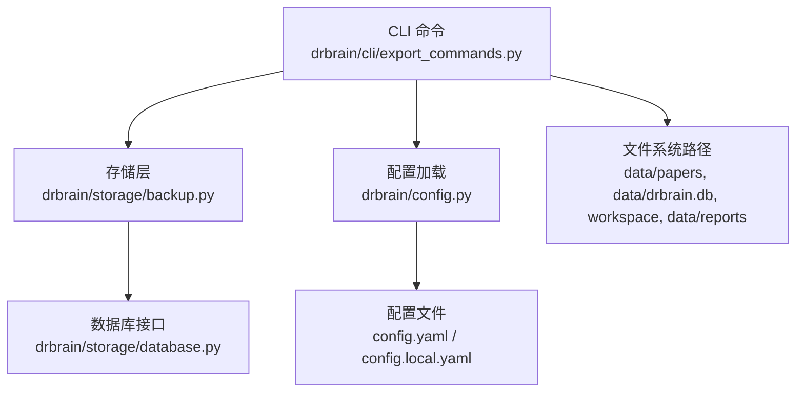
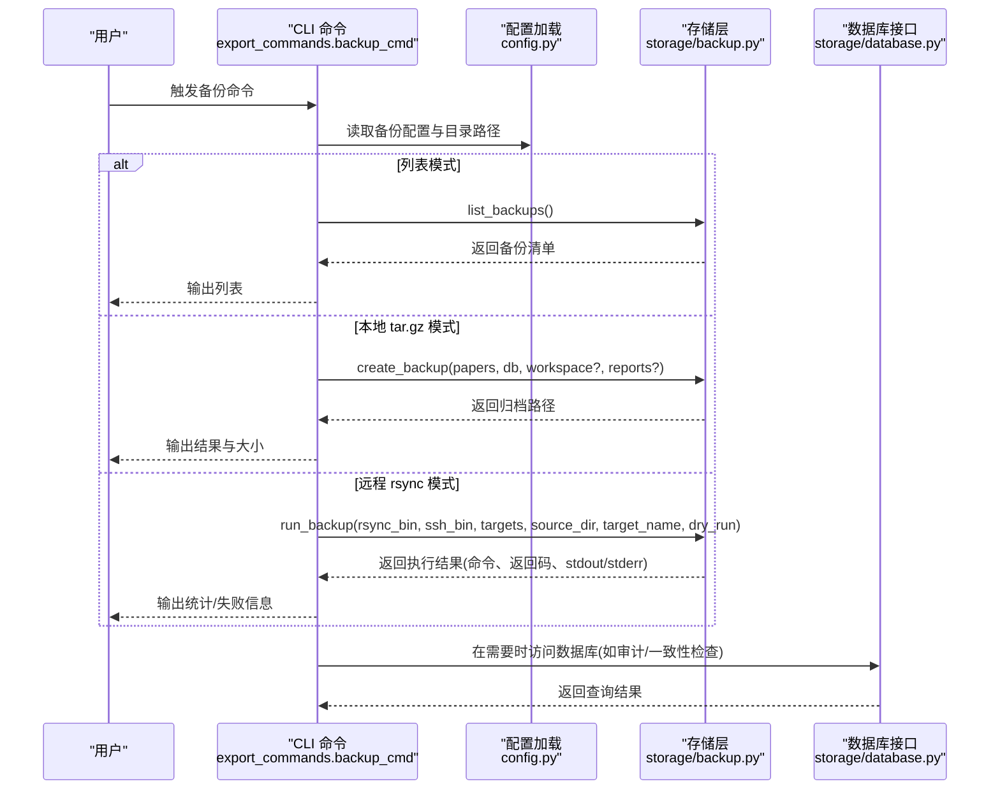
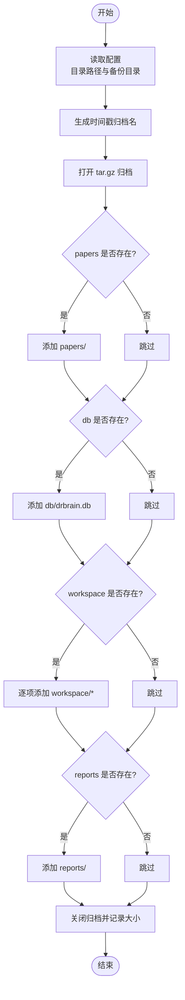
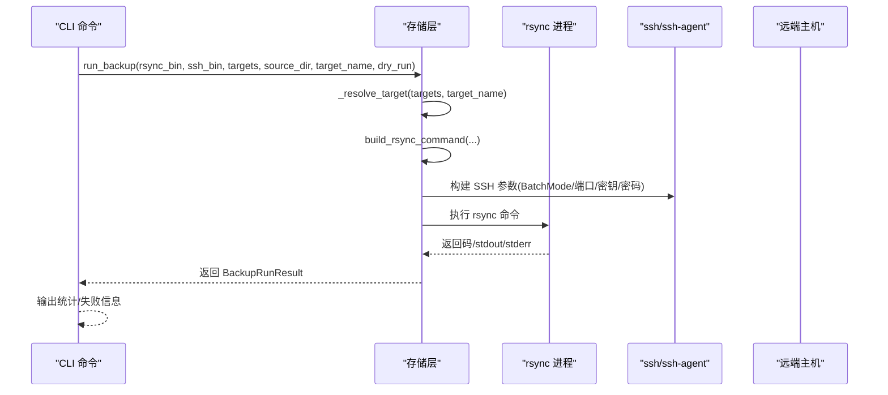
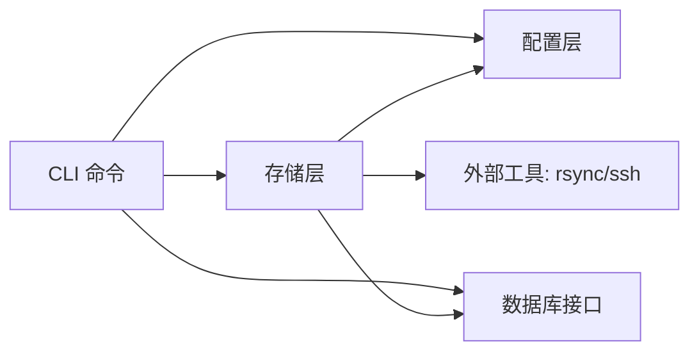

# 备份与恢复

<cite>
**本文引用的文件**
- [src/drbrain/storage/backup.py](file://src/drbrain/storage/backup.py)
- [src/drbrain/cli/export_commands.py](file://src/drbrain/cli/export_commands.py)
- [src/drbrain/config.py](file://src/drbrain/config.py)
- [src/drbrain/storage/database.py](file://src/drbrain/storage/database.py)
- [skills/backup/SKILL.md](file://skills/backup/SKILL.md)
- [config.example.yaml](file://config.example.yaml)
- [tests/test_backup.py](file://tests/test_backup.py)
- [tests/test_cli_commands.py](file://tests/test_cli_commands.py)
- [docs/configuration.md](file://docs/configuration.md)
</cite>

## 目录
1. [简介](#简介)
2. [项目结构](#项目结构)
3. [核心组件](#核心组件)
4. [架构总览](#架构总览)
5. [详细组件分析](#详细组件分析)
6. [依赖分析](#依赖分析)
7. [性能考虑](#性能考虑)
8. [故障排查指南](#故障排查指南)
9. [结论](#结论)
10. [附录](#附录)

## 简介
本文件面向 DrBrain 的备份与恢复系统，系统性阐述备份策略设计、数据备份流程与恢复机制，覆盖本地 tar.gz 全量归档与远程 rsync 同步两种模式；明确备份数据格式、压缩与传输特性、调度与存储管理、验证与恢复流程，并解释与数据库的集成关系、事务一致性与并发控制要点，以及性能优化与灾难恢复建议。

## 项目结构
备份子系统由以下模块协同组成：
- 命令层：CLI 命令入口负责解析参数、组织源目录、调用存储层并输出结果。
- 存储层：提供本地 tar.gz 归档与远程 rsync 同步能力，封装错误处理与结果返回。
- 配置层：定义备份目标与默认行为，支持从 YAML 加载与环境变量解析。
- 数据库层：提供 SQLite 数据库访问接口，用于备份内容的完整性与一致性保障（在备份窗口内）。

图表来源
- [src/drbrain/cli/export_commands.py:283-427](file://src/drbrain/cli/export_commands.py#L283-L427)
- [src/drbrain/storage/backup.py:26-63](file://src/drbrain/storage/backup.py#L26-L63)
- [src/drbrain/config.py:172-194](file://src/drbrain/config.py#L172-L194)
- [src/drbrain/storage/database.py:159-174](file://src/drbrain/storage/database.py#L159-L174)

章节来源
- [src/drbrain/cli/export_commands.py:283-427](file://src/drbrain/cli/export_commands.py#L283-L427)
- [src/drbrain/storage/backup.py:26-63](file://src/drbrain/storage/backup.py#L26-L63)
- [src/drbrain/config.py:172-194](file://src/drbrain/config.py#L172-L194)
- [src/drbrain/storage/database.py:159-174](file://src/drbrain/storage/database.py#L159-L174)

## 核心组件
- 本地 tar.gz 备份
  - 将 papers、drbrain.db、可选 workspace 与 reports 打包为单一归档，命名包含时间戳，便于检索与版本化管理。
- 远程 rsync 同步
  - 支持多种传输模式（默认、追加、追加校验），可配置压缩、排除规则、SSH 端口与密钥或密码认证。
- 备份配置
  - 通过配置对象加载目标列表、默认二进制路径与传输选项，支持本地覆盖与环境变量解析。
- CLI 命令
  - 提供创建、列出、远程同步与预演（dry-run）等能力，支持 JSON 输出与人类可读输出。

章节来源
- [src/drbrain/storage/backup.py:26-63](file://src/drbrain/storage/backup.py#L26-L63)
- [src/drbrain/storage/backup.py:171-239](file://src/drbrain/storage/backup.py#L171-L239)
- [src/drbrain/config.py:144-179](file://src/drbrain/config.py#L144-L179)
- [src/drbrain/cli/export_commands.py:283-427](file://src/drbrain/cli/export_commands.py#L283-L427)

## 架构总览
备份系统采用“命令层-存储层-配置层-数据层”的分层设计，CLI 负责用户交互与参数解析，存储层负责实际备份动作，配置层提供目标与传输参数，数据库层提供底层数据访问能力。

图表来源
- [src/drbrain/cli/export_commands.py:283-427](file://src/drbrain/cli/export_commands.py#L283-L427)
- [src/drbrain/storage/backup.py:66-76](file://src/drbrain/storage/backup.py#L66-L76)
- [src/drbrain/storage/backup.py:26-63](file://src/drbrain/storage/backup.py#L26-L63)
- [src/drbrain/storage/backup.py:199-239](file://src/drbrain/storage/backup.py#L199-L239)
- [src/drbrain/config.py:172-194](file://src/drbrain/config.py#L172-L194)
- [src/drbrain/storage/database.py:159-174](file://src/drbrain/storage/database.py#L159-L174)

## 详细组件分析

### 本地 tar.gz 备份
- 功能概述
  - 将 papers、drbrain.db、workspace（可选）、reports（可选）打包为单一 tar.gz 文件，文件名包含时间戳，便于版本化与检索。
- 关键流程
  - 解析配置中的目录路径（papers、db、backups、workspace、reports）。
  - 创建输出目录并生成带时间戳的归档文件名。
  - 使用 tarfile 将各目录/文件添加到归档中，记录归档大小并输出日志。
- 数据完整性
  - 通过单次打包减少并发写入带来的不一致风险；若需更强一致性，可在备份前暂停写入或使用只读快照（视部署环境而定）。

图表来源
- [src/drbrain/storage/backup.py:26-63](file://src/drbrain/storage/backup.py#L26-L63)

章节来源
- [src/drbrain/storage/backup.py:26-63](file://src/drbrain/storage/backup.py#L26-L63)
- [tests/test_backup.py:25-170](file://tests/test_backup.py#L25-L170)

### 远程 rsync 同步
- 功能概述
  - 将本地数据目录通过 rsync 同步至远端服务器，支持多种传输模式与安全选项。
- 关键流程
  - 解析目标配置（host、user、path、port、identity_file、password、mode、compress、exclude、enabled）。
  - 构建 rsync 命令行参数，包括归档、统计、人类可读、压缩、追加/追加校验、排除规则与 SSH 参数。
  - 可选使用密码认证（通过临时 askpass 脚本注入），或基于密钥的批处理模式。
  - 执行命令并捕获返回码、标准输出与错误输出，进行 dry-run 预演。
- 错误处理
  - 对缺失二进制、无效目标、禁用目标、缺少主机或路径等情况抛出配置错误。
  - 对进程执行异常进行包装并提示详细错误信息。

图表来源
- [src/drbrain/storage/backup.py:171-239](file://src/drbrain/storage/backup.py#L171-L239)
- [src/drbrain/storage/backup.py:96-106](file://src/drbrain/storage/backup.py#L96-L106)
- [src/drbrain/storage/backup.py:171-196](file://src/drbrain/storage/backup.py#L171-L196)
- [src/drbrain/storage/backup.py:199-239](file://src/drbrain/storage/backup.py#L199-L239)

章节来源
- [src/drbrain/storage/backup.py:96-106](file://src/drbrain/storage/backup.py#L96-L106)
- [src/drbrain/storage/backup.py:171-196](file://src/drbrain/storage/backup.py#L171-L196)
- [src/drbrain/storage/backup.py:199-239](file://src/drbrain/storage/backup.py#L199-L239)
- [tests/test_backup.py:185-390](file://tests/test_backup.py#L185-L390)

### 备份配置与目标
- 配置模型
  - BackupConfig：包含 ssh_bin、rsync_bin 与 targets 字典。
  - BackupTargetConfig：包含 host、user、path、port、identity_file、password、mode、compress、enabled、exclude 等字段。
- 加载与合并
  - 从基础 config.yaml 与可选的 config.local.yaml 深度合并，解析环境变量占位符。
- 默认值
  - ssh_bin 默认为 "ssh"，rsync_bin 默认为 "rsync"；目标默认启用、默认模式为 "default"、默认压缩开启。

章节来源
- [src/drbrain/config.py:144-179](file://src/drbrain/config.py#L144-L179)
- [src/drbrain/config.py:172-194](file://src/drbrain/config.py#L172-L194)
- [config.example.yaml:127-144](file://config.example.yaml#L127-L144)
- [docs/configuration.md:267-284](file://docs/configuration.md#L267-L284)

### CLI 命令与工作流
- 命令功能
  - 支持创建本地 tar.gz 备份、列出备份、远程同步、dry-run 预演与 JSON 输出。
  - 列表模式同时展示已配置的 rsync 目标状态与远程路径。
- 参数与行为
  - --list：输出本地与远程目标概览。
  - --output：自定义输出路径（仅本地模式）。
  - --target/--dry-run：远程模式与预演。
  - --json：以机器可读格式输出。
- 测试覆盖
  - 单元测试覆盖了命令构建、目标解析、错误场景与默认配置。

章节来源
- [src/drbrain/cli/export_commands.py:283-427](file://src/drbrain/cli/export_commands.py#L283-L427)
- [skills/backup/SKILL.md:10-58](file://skills/backup/SKILL.md#L10-L58)
- [tests/test_cli_commands.py:834-842](file://tests/test_cli_commands.py#L834-L842)
- [tests/test_backup.py:376-390](file://tests/test_backup.py#L376-L390)

### 数据库与备份集成
- 数据库接口
  - Database 类提供连接、模式初始化与迁移能力，确保表结构与索引就绪。
- 与备份的关系
  - 本地 tar.gz 备份直接打包 drbrain.db 文件，包含数据库文件本身；远程同步则通过 rsync 传输整个 data/ 目录树。
  - 为保证一致性，建议在备份窗口内避免数据库写入，或在支持的环境中使用只读快照。

章节来源
- [src/drbrain/storage/database.py:159-174](file://src/drbrain/storage/database.py#L159-L174)
- [src/drbrain/storage/database.py:10-156](file://src/drbrain/storage/database.py#L10-L156)

## 依赖分析
- 组件耦合
  - CLI 依赖存储层与配置层；存储层依赖配置层与外部工具（rsync/ssh）；数据库层被 CLI 或服务层间接使用。
- 外部依赖
  - rsync 与 ssh 二进制；tarfile 标准库；日志库；配置解析与环境变量替换。
- 潜在循环
  - 当前模块间为单向依赖，未见循环导入。

图表来源
- [src/drbrain/cli/export_commands.py:283-427](file://src/drbrain/cli/export_commands.py#L283-L427)
- [src/drbrain/storage/backup.py:16-18](file://src/drbrain/storage/backup.py#L16-L18)
- [src/drbrain/config.py:172-194](file://src/drbrain/config.py#L172-L194)
- [src/drbrain/storage/database.py:159-174](file://src/drbrain/storage/database.py#L159-L174)

章节来源
- [src/drbrain/cli/export_commands.py:283-427](file://src/drbrain/cli/export_commands.py#L283-L427)
- [src/drbrain/storage/backup.py:16-18](file://src/drbrain/storage/backup.py#L16-L18)
- [src/drbrain/config.py:172-194](file://src/drbrain/config.py#L172-L194)
- [src/drbrain/storage/database.py:159-174](file://src/drbrain/storage/database.py#L159-L174)

## 性能考虑
- 传输效率
  - rsync 默认启用压缩（compress: true），可显著降低网络带宽占用；根据网络条件可调整压缩级别或关闭以换取 CPU 时间。
  - 追加模式（append/append-verify）适合断点续传与增量同步，减少重复传输。
- 存储空间
  - 本地 tar.gz 归档按时间戳命名，便于清理旧版本；建议结合保留策略与磁盘配额管理。
  - 远程目标可通过排除规则（exclude）过滤缓存、日志等非关键目录，减少冗余数据。
- 并发与窗口
  - 备份期间建议暂停写入或使用只读快照，避免数据竞争导致的不一致。
  - 对大型数据集，优先选择 rsync 追加模式并配合排除规则，缩短同步时间。

[本节为通用指导，无需特定文件来源]

## 故障排查指南
- 常见问题与定位
  - 未知/禁用目标：检查配置 targets 中的名称与 enabled 状态。
  - 缺少主机或路径：确认 host 与 path 字段是否填写。
  - 二进制缺失：确认 rsync_bin/ssh_bin 路径正确且可执行。
  - 密码认证失败：确认 password 与 askpass 脚本权限设置。
  - 权限不足：检查 SSH 密钥/用户权限与远端目录写入权限。
- CLI 行为
  - --list 模式可快速确认本地归档与远程目标状态。
  - --dry-run 可在不传输的情况下预览 rsync 行为与统计信息。
- 日志与输出
  - 存储层会记录归档大小与执行结果；CLI 会输出返回码与标准输出/错误输出，便于定位问题。

章节来源
- [src/drbrain/storage/backup.py:96-106](file://src/drbrain/storage/backup.py#L96-L106)
- [src/drbrain/storage/backup.py:218-239](file://src/drbrain/storage/backup.py#L218-L239)
- [tests/test_backup.py:351-374](file://tests/test_backup.py#L351-L374)

## 结论
DrBrain 的备份与恢复系统提供了本地 tar.gz 全量归档与远程 rsync 同步两条路径，满足不同部署与合规需求。通过清晰的配置模型、健壮的错误处理与 CLI 工具链，用户可以便捷地创建、列出、预演与执行备份任务。为确保数据一致性与性能，建议在备份窗口内避免写入或使用只读快照，并结合压缩、排除规则与保留策略进行优化。

[本节为总结，无需特定文件来源]

## 附录

### 备份策略设计与实现要点
- 全量备份
  - 本地 tar.gz：将 papers、db、workspace、reports 打包为单一归档，适合离线归档与跨设备迁移。
  - 远程 rsync：默认模式下进行完整同步，适合首次建立远程仓库。
- 增量/差异备份
  - 当前实现未内置基于变更的增量/差异算法；推荐使用 rsync 的追加模式（append/append-verify）实现近似增量同步，结合排除规则减少传输量。
- 数据格式与压缩
  - 本地归档：tar.gz 格式，便于解压与跨平台兼容。
  - 远程传输：rsync 压缩可选，默认开启；可通过配置关闭以节省 CPU。
- 加密机制
  - 未内置端到端加密；建议在传输层使用 SSH（已支持密钥/密码认证），并在存储层对归档文件进行额外加密（如 GPG）或置于加密卷中。
- 调度与存储
  - 建议通过系统级定时任务（如 cron）定期触发 CLI 命令；结合保留策略清理旧归档。
- 验证与恢复
  - 验证：使用 tar -tzf 查看归档内容；对远程同步，可使用 dry-run 预演并比对统计信息。
  - 恢复：本地归档可直接解压覆盖；远程同步后在目标侧进行一致性核对。
- 与数据库的集成
  - 本地归档直接包含数据库文件；远程同步通过 rsync 传输目录树。为保证一致性，建议在备份窗口内暂停写入或使用只读快照。
- 并发控制与事务一致性
  - 未内置锁机制；建议在应用层面协调写入，或在支持的环境中使用只读快照。
- 性能优化与灾难恢复
  - 优先使用 rsync 追加模式与排除规则；合理设置压缩与并发；制定异地多副本与定期演练的灾备方案。

章节来源
- [src/drbrain/storage/backup.py:26-63](file://src/drbrain/storage/backup.py#L26-L63)
- [src/drbrain/storage/backup.py:171-196](file://src/drbrain/storage/backup.py#L171-L196)
- [src/drbrain/cli/export_commands.py:283-427](file://src/drbrain/cli/export_commands.py#L283-L427)
- [src/drbrain/config.py:144-179](file://src/drbrain/config.py#L144-L179)
- [config.example.yaml:127-144](file://config.example.yaml#L127-L144)
- [skills/backup/SKILL.md:10-58](file://skills/backup/SKILL.md#L10-L58)