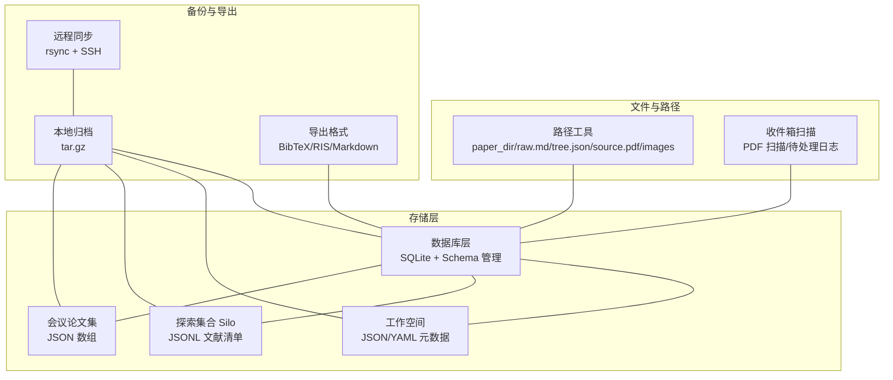
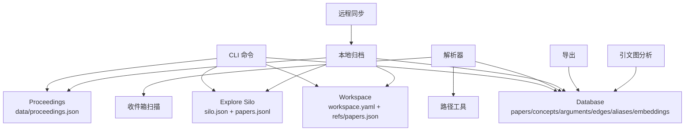
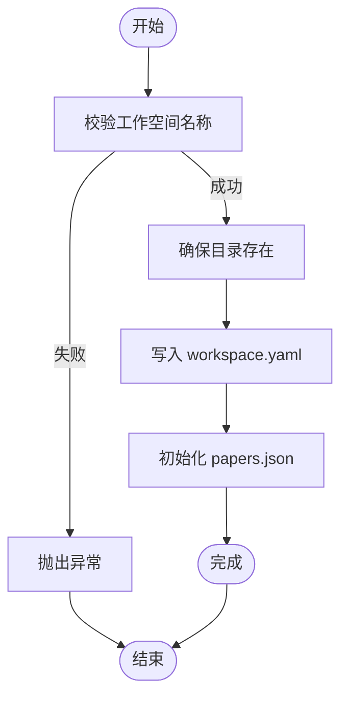
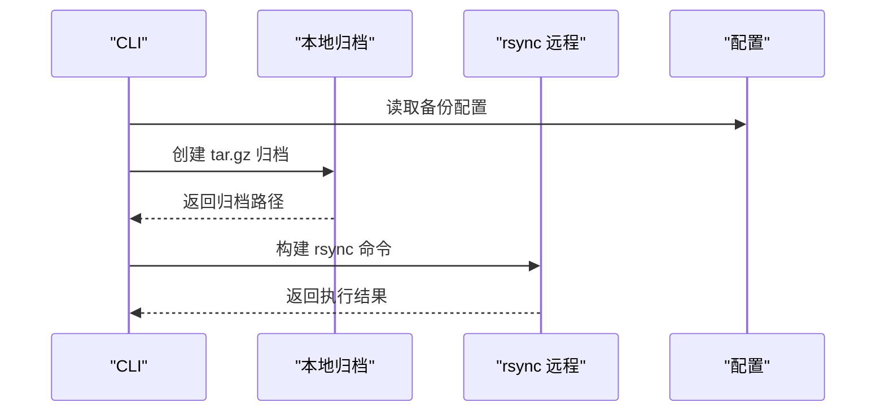
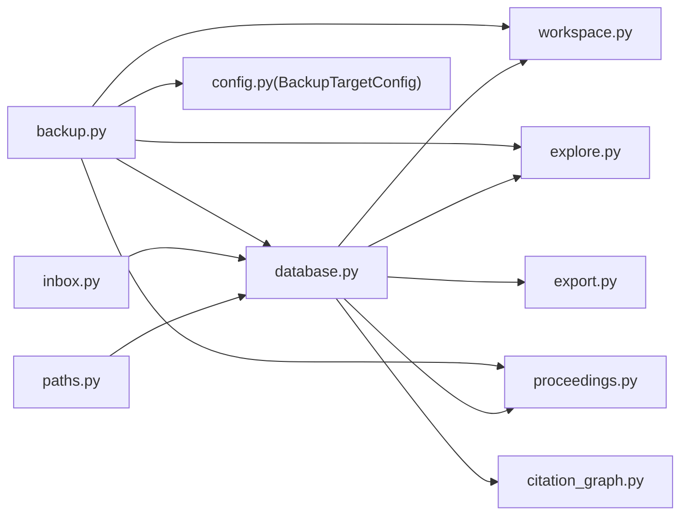

# 存储管理系统

<cite>
**本文引用的文件**
- [src/drbrain/storage/database.py](file://src/drbrain/storage/database.py)
- [src/drbrain/storage/workspace.py](file://src/drbrain/storage/workspace.py)
- [src/drbrain/storage/backup.py](file://src/drbrain/storage/backup.py)
- [src/drbrain/storage/paths.py](file://src/drbrain/storage/paths.py)
- [src/drbrain/storage/inbox.py](file://src/drbrain/storage/inbox.py)
- [src/drbrain/storage/explore.py](file://src/drbrain/storage/explore.py)
- [src/drbrain/storage/export.py](file://src/drbrain/storage/export.py)
- [src/drbrain/storage/proceedings.py](file://src/drbrain/storage/proceedings.py)
- [src/drbrain/storage/citation_graph.py](file://src/drbrain/storage/citation_graph.py)
- [src/drbrain/config.py](file://src/drbrain/config.py)
- [tests/test_database_extended.py](file://tests/test_database_extended.py)
- [tests/test_workspace.py](file://tests/test_workspace.py)
- [docs/configuration.md](file://docs/configuration.md)
</cite>

## 目录
1. [简介](#简介)
2. [项目结构](#项目结构)
3. [核心组件](#核心组件)
4. [架构总览](#架构总览)
5. [详细组件分析](#详细组件分析)
6. [依赖分析](#依赖分析)
7. [性能考虑](#性能考虑)
8. [故障排查指南](#故障排查指南)
9. [结论](#结论)
10. [附录](#附录)

## 简介
本文件面向 DrBrain 的存储管理系统，系统性阐述数据库设计与架构、工作空间管理、备份与恢复机制、文件路径管理以及与各模块的集成关系。内容覆盖数据模型设计、表结构关系、索引策略与约束、存储策略与版本管理、一致性保证、事务与并发控制、性能优化与容量规划，并提供可操作的配置指南与故障恢复方案。

## 项目结构
存储相关功能主要集中在 src/drbrain/storage 目录下，围绕“数据库层”“工作空间”“备份与远程同步”“文件路径与目录约定”“探索集合（Silo）”“导出格式化”“会议论文集”“引文图分析”等子模块协同工作，形成完整的本地化知识库存储与管理闭环。



图表来源
- [src/drbrain/storage/database.py:10-156](file://src/drbrain/storage/database.py#L10-L156)
- [src/drbrain/storage/workspace.py:43-52](file://src/drbrain/storage/workspace.py#L43-L52)
- [src/drbrain/storage/paths.py:6-29](file://src/drbrain/storage/paths.py#L6-L29)
- [src/drbrain/storage/inbox.py:12-31](file://src/drbrain/storage/inbox.py#L12-L31)
- [src/drbrain/storage/explore.py:28-38](file://src/drbrain/storage/explore.py#L28-L38)
- [src/drbrain/storage/proceedings.py:14-28](file://src/drbrain/storage/proceedings.py#L14-L28)
- [src/drbrain/storage/backup.py:26-63](file://src/drbrain/storage/backup.py#L26-L63)
- [src/drbrain/storage/export.py:68-105](file://src/drbrain/storage/export.py#L68-L105)

章节来源
- [src/drbrain/storage/database.py:10-156](file://src/drbrain/storage/database.py#L10-L156)
- [src/drbrain/storage/workspace.py:71-100](file://src/drbrain/storage/workspace.py#L71-L100)
- [src/drbrain/storage/paths.py:6-29](file://src/drbrain/storage/paths.py#L6-L29)
- [src/drbrain/storage/inbox.py:12-31](file://src/drbrain/storage/inbox.py#L12-L31)
- [src/drbrain/storage/explore.py:49-86](file://src/drbrain/storage/explore.py#L49-L86)
- [src/drbrain/storage/proceedings.py:31-64](file://src/drbrain/storage/proceedings.py#L31-L64)
- [src/drbrain/storage/backup.py:26-63](file://src/drbrain/storage/backup.py#L26-L63)
- [src/drbrain/storage/export.py:68-105](file://src/drbrain/storage/export.py#L68-L105)

## 核心组件
- 数据库层：基于 SQLite 的轻量级持久化，内置自动建表、迁移与版本管理；提供论文、概念、论点、边、别名、嵌入、树向量/摘要、置信度队列、引文缓存、构建阶段状态等表及查询接口。
- 工作空间：以目录形式组织“关注主题”的文献子集，采用 YAML 元数据与 JSON 列表维护，支持增删查改与重命名。
- 备份与恢复：本地 tar.gz 归档与 rsync 远程同步双通道；支持目标校验、排除模式、压缩与免交互认证。
- 文件路径与目录：统一的 per-paper 目录约定，便于解析器与导出流程复用。
- 探索集合（Silo）：轻量级探索式文献集合，独立于主库与工作空间，适合快速检索与临时整理。
- 导出：多格式导出（BibTeX、RIS、Markdown），含作者姓氏提取与引文键生成规则。
- 会议论文集：JSON 结构存储会议信息与论文映射，便于按会议维度聚合。
- 引文图分析：基于引用缓存与边表进行共享参考、被引统计与引文网络查询。

章节来源
- [src/drbrain/storage/database.py:159-258](file://src/drbrain/storage/database.py#L159-L258)
- [src/drbrain/storage/workspace.py:71-100](file://src/drbrain/storage/workspace.py#L71-L100)
- [src/drbrain/storage/backup.py:26-63](file://src/drbrain/storage/backup.py#L26-L63)
- [src/drbrain/storage/paths.py:6-29](file://src/drbrain/storage/paths.py#L6-L29)
- [src/drbrain/storage/explore.py:49-86](file://src/drbrain/storage/explore.py#L49-L86)
- [src/drbrain/storage/export.py:68-105](file://src/drbrain/storage/export.py#L68-L105)
- [src/drbrain/storage/proceedings.py:31-64](file://src/drbrain/storage/proceedings.py#L31-L64)
- [src/drbrain/storage/citation_graph.py:8-56](file://src/drbrain/storage/citation_graph.py#L8-L56)

## 架构总览
DrBrain 存储系统以“数据库为中心”，围绕论文实体与其语义结构（概念、论点、边、别名）构建知识图谱；通过工作空间与探索集合实现“主题化”与“探索式”两类文献组织；通过路径工具与收件箱扫描衔接解析与入库流程；通过本地归档与远程同步保障数据安全；通过导出模块满足外部引用与报告生成需求。



图表来源
- [src/drbrain/storage/database.py:159-258](file://src/drbrain/storage/database.py#L159-L258)
- [src/drbrain/storage/workspace.py:142-155](file://src/drbrain/storage/workspace.py#L142-L155)
- [src/drbrain/storage/explore.py:115-144](file://src/drbrain/storage/explore.py#L115-L144)
- [src/drbrain/storage/proceedings.py:90-101](file://src/drbrain/storage/proceedings.py#L90-L101)
- [src/drbrain/storage/paths.py:6-29](file://src/drbrain/storage/paths.py#L6-L29)
- [src/drbrain/storage/inbox.py:12-31](file://src/drbrain/storage/inbox.py#L12-L31)
- [src/drbrain/storage/backup.py:26-63](file://src/drbrain/storage/backup.py#L26-L63)
- [src/drbrain/storage/export.py:170-179](file://src/drbrain/storage/export.py#L170-L179)
- [src/drbrain/storage/citation_graph.py:74-128](file://src/drbrain/storage/citation_graph.py#L74-L128)

## 详细组件分析

### 数据库层（Schema、迁移与查询）
- 表结构概览
  - 论文表：主键 local_id，外键 paper_ids 关联多源 ID；包含类型、状态、元数据字段与时间戳。
  - 概念表：关联论文，记录类型、标签、置信度、首次/最后出现年份。
  - 论点表：主张、类型、目标标签/类型、证据类型/细节、机制、分节、置信度。
  - 边表：src_id/dst_id/relation/source_paper 组成复合主键，确保去重；新增 node_id/section 支持树溯源。
  - 别名表：variant->canonical_id 映射。
  - 嵌入表：实体向量与维度。
  - 树向量/摘要：按节点与论文维度存储层级向量与摘要。
  - 置信度队列：异步处理概念/别名/关系的置信度审核。
  - 引文缓存：source_paper + target_title 主键，记录引用/被引关系与缓存时间。
  - 构建阶段：paper_id + stage 复合主键，跟踪流水线各阶段状态。
  - 版本表：schema_versions 记录已应用迁移版本。
- 索引策略
  - 概念：type、label、first_seen
  - 论点：source_paper、target_label
  - 边：relation、src_id
  - 队列：status
- 约束与检查
  - 论文类型与状态枚举校验
  - 外键级联删除（paper_ids 与 papers）
  - 边表复合主键去重
- 迁移机制
  - 通过 schema_versions 顺序应用迁移，逐步补齐缺失列（如 paper_type、venue 字段、authors、node_id、edge_provenance 等）
- 查询与操作
  - 论文：插入、升级占位、更新元数据、模糊标题+年份匹配、按外部 ID 查找
  - 概念/论点/边/别名/种子：插入与读取
  - 嵌入：保存/加载/清空
  - 队列：插入、接受/拒绝、列出待处理
  - 删除：按论文级联删除相关实体
  - 时间演化信号：新兴/成熟/衰落/争议/复苏等信号检测
- 事务与并发
  - 使用 SQLite 连接对象执行事务；建议在批量写入时合并提交，减少 WAL 刷新开销
  - 并发访问建议通过 WAL 模式与只读连接规避写锁争用

```mermaid
erDiagram
PAPERS {
text local_id PK
text title
text abstract
int year
text paper_type CK
text status CK
text journal
text publisher
int citation_count
text volume
text pages
text authors
timestamp created_at
}
PAPER_IDS {
text local_id FK
text doi UK
text arxiv UK
text s2_id UK
text openalex_id UK
}
CONCEPTS {
int concept_id PK
text local_id FK
text type CK
text label
real confidence
text section
text node_id
int first_seen
int last_seen
}
ARGUMENTS {
int arg_id PK
text source_paper FK
text claim
text claim_type CK
text target_label
text target_type CK
text evidence_type CK
text evidence_detail
text mechanism
text section
text node_id
real confidence
timestamp created_at
}
EDGES {
text src_id
text dst_id
text relation
text source_paper
real weight
PK src_id,dst_id,relation,source_paper
}
ALIASES {
text variant PK
text canonical_id
}
EMBEDDINGS {
text entity PK
blob vec
int dim
}
TREE_VECTORS {
text node_id PK
text paper_id
blob embedding
text content_hash
text tree_layer
}
TREE_SUMMARIES {
text node_id PK
text paper_id
text summary_text
text source_node_ids
int tree_layer
}
CONFIDENCE_QUEUE {
int queue_id PK
text source_paper
text item_type CK
text item_data
real confidence
text status CK
timestamp created_at
}
CITATION_CACHE {
text source_paper
text target_title
int target_year
text relation CK
text target_doi
text target_s2_id
timestamp cached_at
PK source_paper,target_title
}
BUILD_STAGES {
text paper_id
text stage
text status
text result_json
timestamp updated_at
PK paper_id,stage
}
SCHEMA_VERSIONS {
int version PK
timestamp applied_at
}
PAPERS ||--o{ PAPER_IDS : "has"
PAPERS ||--o{ CONCEPTS : "contains"
PAPERS ||--o{ ARGUMENTS : "contains"
PAPERS ||--o{ EDGES : "originates_from"
PAPERS ||--o{ CONFIDENCE_QUEUE : "queued_by"
PAPERS ||--o{ CITATION_CACHE : "sources"
PAPERS ||--o{ BUILD_STAGES : "tracked_by"
```

图表来源
- [src/drbrain/storage/database.py:10-156](file://src/drbrain/storage/database.py#L10-L156)

章节来源
- [src/drbrain/storage/database.py:159-258](file://src/drbrain/storage/database.py#L159-L258)
- [src/drbrain/storage/database.py:279-347](file://src/drbrain/storage/database.py#L279-L347)
- [src/drbrain/storage/database.py:348-397](file://src/drbrain/storage/database.py#L348-L397)
- [src/drbrain/storage/database.py:398-416](file://src/drbrain/storage/database.py#L398-L416)
- [src/drbrain/storage/database.py:417-494](file://src/drbrain/storage/database.py#L417-L494)
- [src/drbrain/storage/database.py:500-532](file://src/drbrain/storage/database.py#L500-L532)
- [src/drbrain/storage/database.py:534-564](file://src/drbrain/storage/database.py#L534-L564)
- [src/drbrain/storage/database.py:566-585](file://src/drbrain/storage/database.py#L566-L585)
- [src/drbrain/storage/database.py:587-617](file://src/drbrain/storage/database.py#L587-L617)
- [src/drbrain/storage/database.py:621-774](file://src/drbrain/storage/database.py#L621-L774)

### 工作空间管理
- 目录结构：workspace/<name>/workspace.yaml + refs/papers.json
- 功能：创建、添加/移除论文、列出、获取详情、删除、重命名（含名称校验）
- 安全性：严格的名称校验，拒绝绝对路径、非法字符、父目录跳转等
- 原子性：使用临时文件写入后替换，避免部分写入导致的数据损坏



图表来源
- [src/drbrain/storage/workspace.py:22-40](file://src/drbrain/storage/workspace.py#L22-L40)
- [src/drbrain/storage/workspace.py:71-100](file://src/drbrain/storage/workspace.py#L71-L100)

章节来源
- [src/drbrain/storage/workspace.py:71-100](file://src/drbrain/storage/workspace.py#L71-L100)
- [src/drbrain/storage/workspace.py:103-128](file://src/drbrain/storage/workspace.py#L103-L128)
- [src/drbrain/storage/workspace.py:130-155](file://src/drbrain/storage/workspace.py#L130-L155)
- [src/drbrain/storage/workspace.py:158-168](file://src/drbrain/storage/workspace.py#L158-L168)
- [src/drbrain/storage/workspace.py:171-211](file://src/drbrain/storage/workspace.py#L171-L211)
- [tests/test_workspace.py:22-61](file://tests/test_workspace.py#L22-L61)

### 备份与恢复机制
- 本地归档：打包 papers、drbrain.db、workspace、reports 为 tar.gz，记录大小日志
- 远程同步：基于 rsync + SSH，支持压缩、追加模式、排除规则、免交互密码
- 配置项：ssh_bin、rsync_bin、targets.<name>（host/user/path/port/identity_file/password/mode/compress/enabled/exclude）



图表来源
- [src/drbrain/storage/backup.py:26-63](file://src/drbrain/storage/backup.py#L26-L63)
- [src/drbrain/storage/backup.py:171-196](file://src/drbrain/storage/backup.py#L171-L196)
- [src/drbrain/storage/backup.py:199-239](file://src/drbrain/storage/backup.py#L199-L239)
- [src/drbrain/config.py:143-178](file://src/drbrain/config.py#L143-L178)
- [docs/configuration.md:286-302](file://docs/configuration.md#L286-L302)

章节来源
- [src/drbrain/storage/backup.py:26-63](file://src/drbrain/storage/backup.py#L26-L63)
- [src/drbrain/storage/backup.py:171-196](file://src/drbrain/storage/backup.py#L171-L196)
- [src/drbrain/storage/backup.py:199-239](file://src/drbrain/storage/backup.py#L199-L239)
- [src/drbrain/config.py:143-178](file://src/drbrain/config.py#L143-L178)
- [docs/configuration.md:286-302](file://docs/configuration.md#L286-L302)

### 文件路径管理
- 统一 per-paper 目录约定：raw.md、tree.json、source.pdf、images/
- 便于解析器与导出流程直接定位资源，降低耦合

章节来源
- [src/drbrain/storage/paths.py:6-29](file://src/drbrain/storage/paths.py#L6-L29)

### 收件箱与待处理
- 扫描 inbox 目录中的 PDF
- 失败或待处理的 PDF 移动到 pending 目录并记录原因日志

章节来源
- [src/drbrain/storage/inbox.py:12-54](file://src/drbrain/storage/inbox.py#L12-L54)

### 探索集合（Silo）
- 轻量级探索式集合，独立于主库与工作空间
- 元数据：silo.json（name/description/created_at/paper_count）
- 文献：papers.jsonl（每行一条论文字典）
- 支持创建、添加、读取、搜索、列举、删除

章节来源
- [src/drbrain/storage/explore.py:49-86](file://src/drbrain/storage/explore.py#L49-L86)
- [src/drbrain/storage/explore.py:89-113](file://src/drbrain/storage/explore.py#L89-L113)
- [src/drbrain/storage/explore.py:115-144](file://src/drbrain/storage/explore.py#L115-L144)
- [src/drbrain/storage/explore.py:147-170](file://src/drbrain/storage/explore.py#L147-L170)
- [src/drbrain/storage/explore.py:173-190](file://src/drbrain/storage/explore.py#L173-L190)
- [src/drbrain/storage/explore.py:193-203](file://src/drbrain/storage/explore.py#L193-L203)

### 导出模块
- BibTeX：转义特殊字符、作者姓氏提取、引文键生成、条目类型映射
- RIS：条目类型映射、作者拆分、页码区间
- Markdown：APA 风格引用格式

章节来源
- [src/drbrain/storage/export.py:68-105](file://src/drbrain/storage/export.py#L68-L105)
- [src/drbrain/storage/export.py:108-149](file://src/drbrain/storage/export.py#L108-L149)
- [src/drbrain/storage/export.py:152-167](file://src/drbrain/storage/export.py#L152-L167)
- [src/drbrain/storage/export.py:170-179](file://src/drbrain/storage/export.py#L170-L179)

### 会议论文集
- JSON 数组存储会议条目（id/name/year/venue/papers[]）
- 去重创建、添加论文、列举、查询、加载

章节来源
- [src/drbrain/storage/proceedings.py:31-64](file://src/drbrain/storage/proceedings.py#L31-L64)
- [src/drbrain/storage/proceedings.py:67-87](file://src/drbrain/storage/proceedings.py#L67-L87)
- [src/drbrain/storage/proceedings.py:90-101](file://src/drbrain/storage/proceedings.py#L90-L101)
- [src/drbrain/storage/proceedings.py:103-116](file://src/drbrain/storage/proceedings.py#L103-L116)
- [src/drbrain/storage/proceedings.py:119-122](file://src/drbrain/storage/proceedings.py#L119-L122)

### 引文图分析
- 共享参考：统计与某篇论文共享参考的其他论文数量与未直接链接状态
- 引文计数：返回参考数与被引数
- 引文图查询：支持查询参考、被引、共享参考三类视图

章节来源
- [src/drbrain/storage/citation_graph.py:8-56](file://src/drbrain/storage/citation_graph.py#L8-L56)
- [src/drbrain/storage/citation_graph.py:59-71](file://src/drbrain/storage/citation_graph.py#L59-L71)
- [src/drbrain/storage/citation_graph.py:74-128](file://src/drbrain/storage/citation_graph.py#L74-L128)

## 依赖分析
- 内部依赖
  - database 作为中心枢纽，被 workspace、explore、proceedings、export、backup 等模块间接依赖
  - paths 与 inbox 为解析与入库流程提供路径与文件扫描能力
  - backup 依赖 config 中的 BackupTargetConfig
- 外部依赖
  - SQLite（原生）、numpy（向量序列化）、tarfile（归档）、subprocess（rsync/ssh）



图表来源
- [src/drbrain/storage/database.py:159-258](file://src/drbrain/storage/database.py#L159-L258)
- [src/drbrain/storage/workspace.py:142-155](file://src/drbrain/storage/workspace.py#L142-L155)
- [src/drbrain/storage/explore.py:115-144](file://src/drbrain/storage/explore.py#L115-L144)
- [src/drbrain/storage/proceedings.py:90-101](file://src/drbrain/storage/proceedings.py#L90-L101)
- [src/drbrain/storage/export.py:170-179](file://src/drbrain/storage/export.py#L170-L179)
- [src/drbrain/storage/citation_graph.py:74-128](file://src/drbrain/storage/citation_graph.py#L74-L128)
- [src/drbrain/storage/paths.py:6-29](file://src/drbrain/storage/paths.py#L6-L29)
- [src/drbrain/storage/inbox.py:12-31](file://src/drbrain/storage/inbox.py#L12-L31)
- [src/drbrain/storage/backup.py:171-196](file://src/drbrain/storage/backup.py#L171-L196)
- [src/drbrain/config.py:143-178](file://src/drbrain/config.py#L143-L178)

## 性能考虑
- 数据库层
  - 使用 WAL 模式提升并发读写性能
  - 合理批量写入（executemany）与合并提交，减少磁盘刷新
  - 为高频查询建立索引（概念类型/标签、论点来源/目标、边关系/起点、队列状态）
  - 对大字段（向量、摘要文本）采用 BLOB/TEXT 分离存储，必要时启用压缩
- 文件层
  - 将 PDF、图片等静态资源与数据库解耦，通过路径工具集中管理
  - 使用 tar.gz 归档时按需包含 workspace/reports，避免冗余
- 备份层
  - rsync 增量传输与压缩，结合排除规则减少带宽占用
  - 在高并发导入场景下优先本地归档，再择机同步远程

## 故障排查指南
- 数据库
  - 迁移失败：检查 schema_versions 是否正确写入；确认列是否存在后再执行 ALTER
  - 外键约束：删除论文前先清理相关实体，避免约束冲突
  - 查询异常：核对枚举值（paper_type/status/claim_type/target_type/evidence_type/relation）是否符合约束
- 工作空间
  - 名称非法：检查是否包含非法字符、相对路径、Windows 驱动器符号
  - 重命名失败：确认旧目录存在且新名称可用
- 备份
  - rsync 执行失败：检查 ssh_bin/rsync_bin 可执行权限与路径；验证目标 host/path/port/身份文件/密码配置
  - 权限问题：确保备份用户对源目录有读权限，对目标目录有写权限
- 导出
  - 引文键重复：调整作者姓氏提取逻辑或标题词选择策略
  - RIS/BibTeX 格式异常：检查字段转义与缺失值处理

章节来源
- [src/drbrain/storage/database.py:175-246](file://src/drbrain/storage/database.py#L175-L246)
- [src/drbrain/storage/workspace.py:185-197](file://src/drbrain/storage/workspace.py#L185-L197)
- [src/drbrain/storage/backup.py:199-239](file://src/drbrain/storage/backup.py#L199-L239)
- [src/drbrain/storage/export.py:8-11](file://src/drbrain/storage/export.py#L8-L11)

## 结论
DrBrain 存储系统以 SQLite 为核心，结合目录化的文件组织与完善的备份/导出能力，形成了轻量、可靠且可扩展的知识库管理方案。通过清晰的表结构、索引与约束、版本迁移与一致性策略，系统在中小规模知识库场景下具备良好的性能与可维护性。建议在生产环境中配合 WAL 模式、批量写入与增量备份策略，进一步提升稳定性与效率。

## 附录

### 存储策略与版本管理
- 数据库迁移：通过 schema_versions 有序应用，逐步补齐字段与索引
- 工作空间：schema_version 字段用于标识元数据格式版本
- 探索集合：每次变更均更新 paper_count，便于外部工具感知

章节来源
- [src/drbrain/storage/database.py:175-246](file://src/drbrain/storage/database.py#L175-L246)
- [src/drbrain/storage/workspace.py:196-209](file://src/drbrain/storage/workspace.py#L196-L209)
- [src/drbrain/storage/explore.py:109-112](file://src/drbrain/storage/explore.py#L109-L112)

### 一致性保证
- 外键级联删除：论文删除时级联清理相关概念/论点/边/别名/队列/树向量/摘要
- 插入去重：边表使用复合主键去重，别名表使用 INSERT OR IGNORE
- 事务边界：建议在批量写入时显式 commit，避免长事务阻塞

章节来源
- [src/drbrain/storage/database.py:587-617](file://src/drbrain/storage/database.py#L587-L617)
- [src/drbrain/storage/database.py:376-381](file://src/drbrain/storage/database.py#L376-L381)
- [src/drbrain/storage/database.py:383-388](file://src/drbrain/storage/database.py#L383-L388)

### 实际代码示例（路径指引）
- 数据库插入与查询
  - 插入论文与外部 ID：[src/drbrain/storage/database.py:279-318](file://src/drbrain/storage/database.py#L279-L318)
  - 插入概念/论点/边/别名/种子：[src/drbrain/storage/database.py:350-396](file://src/drbrain/storage/database.py#L350-L396)
  - 获取论文与概念列表：[src/drbrain/storage/database.py:448-494](file://src/drbrain/storage/database.py#L448-L494)
- 工作空间 CRUD
  - 创建/添加/移除/列举/获取/删除/重命名：[src/drbrain/storage/workspace.py:71-168](file://src/drbrain/storage/workspace.py#L71-L168)
- 备份与远程同步
  - 本地归档与列出：[src/drbrain/storage/backup.py:26-76](file://src/drbrain/storage/backup.py#L26-L76)
  - 构建与执行 rsync：[src/drbrain/storage/backup.py:171-239](file://src/drbrain/storage/backup.py#L171-L239)
- 文件路径与收件箱
  - 路径工具：[src/drbrain/storage/paths.py:6-29](file://src/drbrain/storage/paths.py#L6-L29)
  - 收件箱扫描与待处理：[src/drbrain/storage/inbox.py:12-54](file://src/drbrain/storage/inbox.py#L12-L54)
- 探索集合
  - 创建/添加/读取/搜索/列举/删除：[src/drbrain/storage/explore.py:49-203](file://src/drbrain/storage/explore.py#L49-L203)
- 导出
  - BibTeX/RIS/Markdown：[src/drbrain/storage/export.py:68-179](file://src/drbrain/storage/export.py#L68-L179)
- 会议论文集
  - 创建/添加/列举/查询/加载：[src/drbrain/storage/proceedings.py:31-122](file://src/drbrain/storage/proceedings.py#L31-L122)
- 引文图分析
  - 共享参考/计数/查询：[src/drbrain/storage/citation_graph.py:8-128](file://src/drbrain/storage/citation_graph.py#L8-L128)

### 配置指南与容量规划
- 配置项
  - 数据库路径：db.path
  - 目录结构：dirs.inbox/pending/papers/reports/cache/logs
  - 备份：backup.ssh_bin/rsync_bin/backup.targets.<name>.*
- 容量规划建议
  - SQLite：单库上限约 140TB（实际受平台限制），建议按年度/会议拆分归档
  - 向量与摘要：根据 top_k 与维度估算，预留 2-3 倍冗余空间
  - 备份：本地归档按月保留，远程按周保留，结合 rsync 增量策略

章节来源
- [src/drbrain/config.py:70-82](file://src/drbrain/config.py#L70-L82)
- [src/drbrain/config.py:70-77](file://src/drbrain/config.py#L70-L77)
- [src/drbrain/config.py:143-178](file://src/drbrain/config.py#L143-L178)
- [docs/configuration.md:286-302](file://docs/configuration.md#L286-L302)