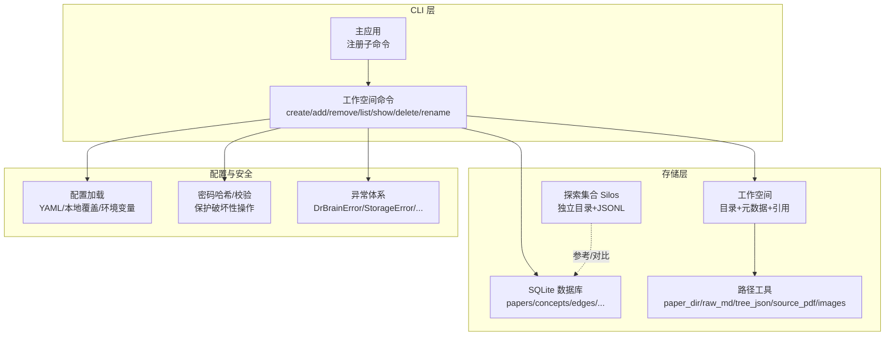
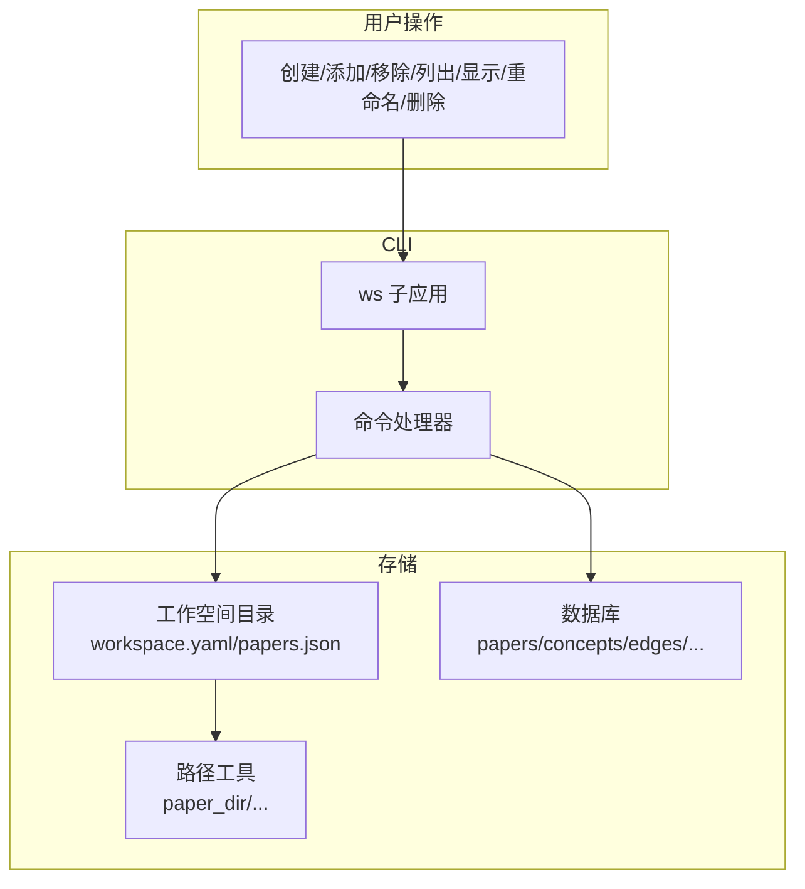
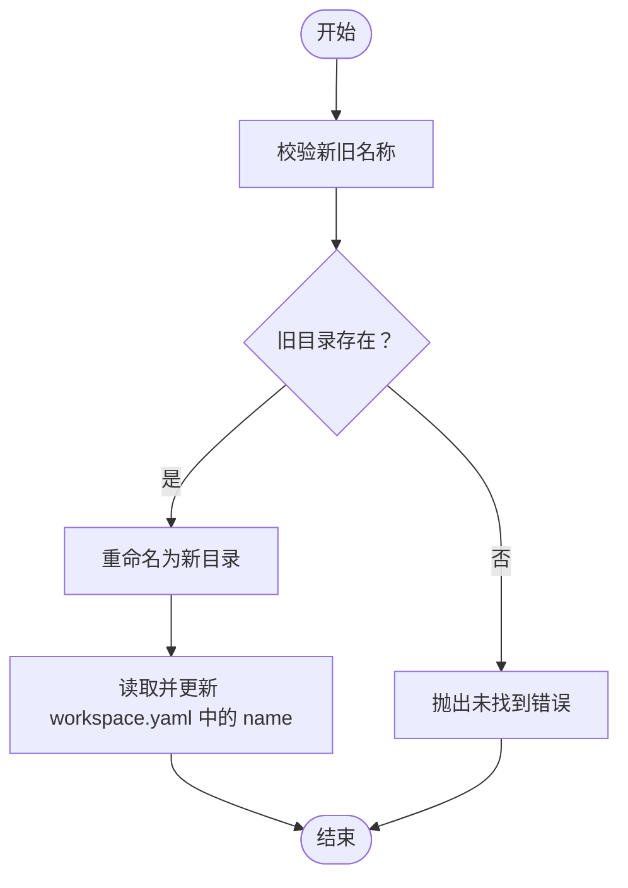
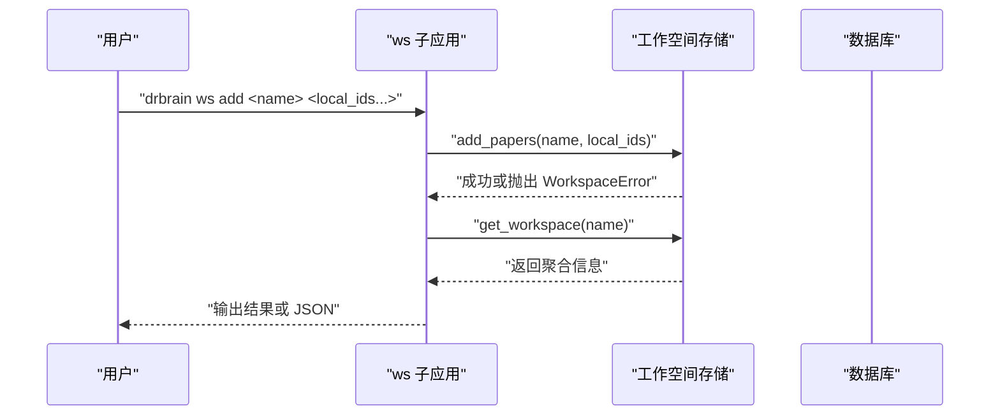
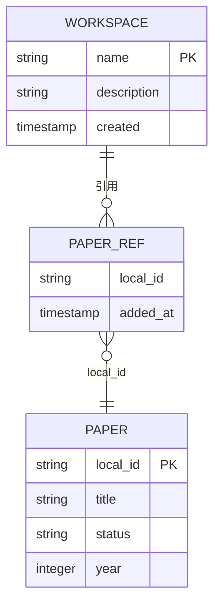
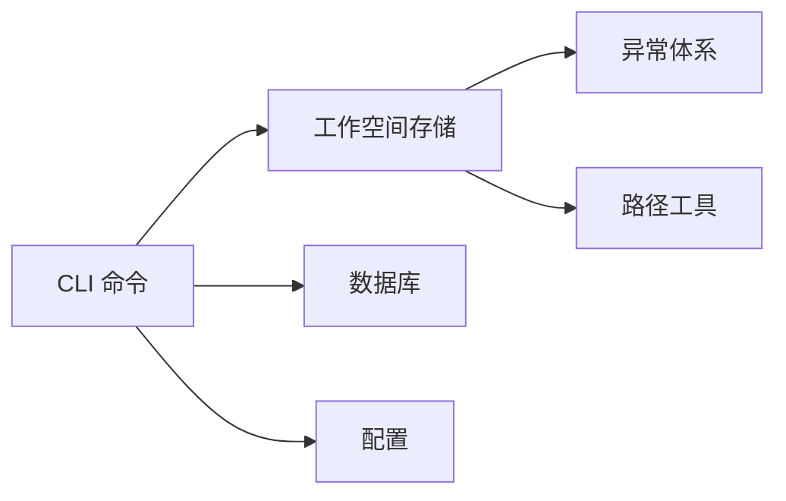

# 工作空间管理

<cite>
**本文引用的文件**
- [workspace.py](file://src/drbrain/storage/workspace.py)
- [ws_commands.py](file://src/drbrain/cli/ws_commands.py)
- [main.py](file://src/drbrain/cli/main.py)
- [database.py](file://src/drbrain/storage/database.py)
- [config.py](file://src/drbrain/config.py)
- [paths.py](file://src/drbrain/storage/paths.py)
- [explore.py](file://src/drbrain/storage/explore.py)
- [auth.py](file://src/drbrain/auth.py)
- [exceptions.py](file://src/drbrain/exceptions.py)
- [config.yaml](file://config.yaml)
- [test_workspace.py](file://tests/test_workspace.py)
- [SKILL.md](file://skills/workspace-analysis/SKILL.md)
</cite>

## 目录
1. [简介](#简介)
2. [项目结构](#项目结构)
3. [核心组件](#核心组件)
4. [架构总览](#架构总览)
5. [详细组件分析](#详细组件分析)
6. [依赖分析](#依赖分析)
7. [性能考虑](#性能考虑)
8. [故障排除指南](#故障排除指南)
9. [结论](#结论)
10. [附录](#附录)

## 简介
本文件面向 DrBrain 的工作空间管理系统，提供从多用户架构到 CLI 使用、权限与访问控制、数据隔离与命名空间、状态与持久化、与数据库关系及迁移、以及故障排除与性能容量规划的完整技术文档。工作空间用于聚焦特定研究主题的论文子集管理，通过轻量级文件系统元数据实现“引用式”组织，不复制论文内容；同时通过 SQLite 数据库存储结构化知识图谱（KG）数据，二者协同支撑从文献组织到深度分析的全流程。

## 项目结构
- 存储层
  - 工作空间：以目录为单位，包含元数据文件与引用列表，实现论文子集的轻量管理。
  - 探索型集合（Silos）：用于探索性检索的临时集合，独立于主库与工作空间。
  - 数据库：SQLite 承载论文、概念、论点、边、别名、向量等 KG 结构化数据。
- 命令行层
  - 主 CLI 应用注册工作空间子命令，并在回调中加载配置与日志。
  - 工作空间命令封装了创建、增删、列出、展示、重命名、删除等操作。
- 配置层
  - 统一的类型化配置对象，支持 YAML 加载、本地覆盖与环境变量解析。
- 安全与异常
  - 密码哈希与校验用于保护破坏性操作；自定义异常层次便于统一处理。

**图表来源**
- [main.py:77-146](file://src/drbrain/cli/main.py#L77-L146)
- [ws_commands.py:12-167](file://src/drbrain/cli/ws_commands.py#L12-L167)
- [workspace.py:43-52](file://src/drbrain/storage/workspace.py#L43-L52)
- [database.py:159-258](file://src/drbrain/storage/database.py#L159-L258)
- [config.py:195-291](file://src/drbrain/config.py#L195-L291)
- [auth.py:7-28](file://src/drbrain/auth.py#L7-L28)

**章节来源**
- [main.py:77-146](file://src/drbrain/cli/main.py#L77-L146)
- [ws_commands.py:12-167](file://src/drbrain/cli/ws_commands.py#L12-L167)
- [workspace.py:43-52](file://src/drbrain/storage/workspace.py#L43-L52)
- [database.py:159-258](file://src/drbrain/storage/database.py#L159-L258)
- [config.py:195-291](file://src/drbrain/config.py#L195-L291)
- [auth.py:7-28](file://src/drbrain/auth.py#L7-L28)

## 核心组件
- 工作空间存储模块
  - 提供名称校验、目录与文件路径解析、原子写入、CRUD 操作与重命名。
  - 通过 YAML 元数据与 JSON 引用列表实现“轻量引用式”组织。
- 工作空间 CLI 命令
  - create/add/remove/list/show/delete/rename，支持 JSON 输出与错误处理。
- 数据库模块
  - SQLite 封装，自动建表与迁移，提供论文、概念、论点、边、别名、向量等查询与写入接口。
- 配置模块
  - 类型化配置对象，支持深合并与环境变量解析，集中管理路径、API、嵌入等参数。
- 路径工具
  - 统一论文目录与文件路径生成，便于读取原始 Markdown、树 JSON、PDF、图片等。
- 探索集合 Silos
  - 独立的探索性集合，适合临时检索与快速标注，不参与 KG 构建。
- 安全与异常
  - 密码哈希/校验用于保护破坏性操作；自定义异常层次提升可维护性。

**章节来源**
- [workspace.py:22-211](file://src/drbrain/storage/workspace.py#L22-L211)
- [ws_commands.py:12-167](file://src/drbrain/cli/ws_commands.py#L12-L167)
- [database.py:159-774](file://src/drbrain/storage/database.py#L159-L774)
- [config.py:195-291](file://src/drbrain/config.py#L195-L291)
- [paths.py:6-28](file://src/drbrain/storage/paths.py#L6-L28)
- [explore.py:49-202](file://src/drbrain/storage/explore.py#L49-L202)
- [auth.py:7-28](file://src/drbrain/auth.py#L7-L28)
- [exceptions.py:6-27](file://src/drbrain/exceptions.py#L6-L27)

## 架构总览
工作空间管理采用“文件系统 + 关系数据库”的双轨架构：
- 文件系统层：工作空间目录作为轻量容器，保存元数据与引用列表，实现跨用户共享与版本控制友好。
- 数据库层：SQLite 承载 KG 数据，支持复杂查询与分析，与工作空间通过论文 local_id 关联。
- CLI 层：统一入口，注册子命令，加载配置与日志，调用存储与数据库模块完成业务操作。

**图表来源**
- [ws_commands.py:12-167](file://src/drbrain/cli/ws_commands.py#L12-L167)
- [workspace.py:71-100](file://src/drbrain/storage/workspace.py#L71-L100)
- [database.py:159-258](file://src/drbrain/storage/database.py#L159-L258)
- [paths.py:6-28](file://src/drbrain/storage/paths.py#L6-L28)

## 详细组件分析

### 工作空间存储模块
- 名称校验
  - 严格限制字符集与路径语义，避免路径穿越与非法命名。
- 目录与文件布局
  - 目录：workspace/{name}
  - 元数据：workspace.yaml（包含 schema_version、name、description、created）
  - 引用：refs/papers.json（每条记录含 local_id 与添加时间戳）
- 原子写入
  - 通过临时文件 + 原子替换，保证并发安全与崩溃恢复。
- 核心操作
  - 创建：初始化目录、元数据与空引用列表
  - 添加：去重批量追加，保持顺序稳定
  - 移除：按 local_id 过滤
  - 列表：扫描根目录下含元数据文件的目录
  - 查询：读取元数据与引用列表，返回聚合信息
  - 删除：整目录删除
  - 重命名：先改名再更新元数据中的 name 字段

**图表来源**
- [workspace.py:171-211](file://src/drbrain/storage/workspace.py#L171-L211)

**章节来源**
- [workspace.py:22-211](file://src/drbrain/storage/workspace.py#L22-L211)
- [test_workspace.py:22-277](file://tests/test_workspace.py#L22-L277)

### 工作空间 CLI 命令
- 子应用注册
  - 在主应用中注册 ws 子应用，统一入口与上下文注入。
- 命令行为
  - create：创建工作空间，支持描述与 JSON 输出
  - add：向工作空间添加论文，支持批量与 JSON 输出
  - remove：从工作空间移除论文
  - list：列出所有工作空间
  - show：展示工作空间详情与论文列表
  - delete：删除工作空间
  - rename：重命名工作空间，含名称校验与错误处理
- 错误处理
  - 对 WorkspaceError、值错误、文件不存在与已存在等进行分类处理与退出码设置

**图表来源**
- [ws_commands.py:35-56](file://src/drbrain/cli/ws_commands.py#L35-L56)
- [workspace.py:103-119](file://src/drbrain/storage/workspace.py#L103-L119)

**章节来源**
- [main.py:77-146](file://src/drbrain/cli/main.py#L77-L146)
- [ws_commands.py:12-167](file://src/drbrain/cli/ws_commands.py#L12-L167)
- [workspace.py:103-119](file://src/drbrain/storage/workspace.py#L103-L119)

### 数据库与工作空间关联
- 论文引用
  - 工作空间通过 local_id 引用数据库中的论文记录，不复制内容。
- 分析与查询
  - 多数分析命令支持通过工作空间选项限定查询范围，例如统计、转移发现等。
- 迁移与版本
  - 数据库具备迁移机制，按版本号顺序应用变更，确保历史数据兼容。

**图表来源**
- [workspace.py:47-48](file://src/drbrain/storage/workspace.py#L47-L48)
- [database.py:10-156](file://src/drbrain/storage/database.py#L10-L156)

**章节来源**
- [database.py:159-774](file://src/drbrain/storage/database.py#L159-L774)
- [query_commands.py:77-110](file://src/drbrain/cli/query_commands.py#L77-L110)

### 权限管理、用户角色与访问控制
- 当前实现
  - 工作空间目录默认基于文件系统权限（操作系统级），未内置细粒度角色与 ACL。
  - 破坏性操作（如删除）可通过密码校验进行保护，防止误操作。
- 建议
  - 若需多用户协作与细粒度权限，可在文件系统之上引入用户组映射与最小权限原则；对 CLI 的危险命令增加显式确认与审计日志。

**章节来源**
- [auth.py:7-28](file://src/drbrain/auth.py#L7-L28)
- [ws_commands.py:123-144](file://src/drbrain/cli/ws_commands.py#L123-L144)

### 数据隔离、命名空间与共享策略
- 隔离
  - 工作空间目录相互独立，天然隔离；数据库层面通过 local_id 与外键约束保证一致性。
- 命名空间
  - 工作空间名称经严格校验，避免路径穿越与冲突；数据库中论文 ID 为全局唯一键。
- 共享
  - 工作空间仅共享引用，不复制论文内容；可通过文件系统共享策略实现团队协作。
  - 探索集合 Silos 适合临时共享与快速标注，不参与 KG 构建。

**章节来源**
- [workspace.py:22-40](file://src/drbrain/storage/workspace.py#L22-L40)
- [explore.py:49-86](file://src/drbrain/storage/explore.py#L49-L86)

### 工作空间切换、状态管理与持久化
- 切换
  - 通过 CLI 选择目标工作空间参数（如 -w/--workspace）影响后续查询与分析范围。
- 状态
  - 工作空间状态由元数据与引用列表构成，不包含运行时状态；数据库状态由 papers/concepts/edges 等表反映。
- 持久化
  - 工作空间持久化为文件系统目录；数据库持久化为 SQLite 文件。

**章节来源**
- [query_commands.py:77-110](file://src/drbrain/cli/query_commands.py#L77-L110)
- [config.yaml:22-23](file://config.yaml#L22-L23)

### 工作空间 CLI 使用指南
- 基本命令
  - 创建：drbrain ws create <name> [--description/-d] [--json]
  - 添加：drbrain ws add <name> <local_id...> [--json]
  - 移除：drbrain ws remove <name> <local_id...> [--json]
  - 列表：drbrain ws list [--json]
  - 显示：drbrain ws show <name> [--json]
  - 删除：drbrain ws delete <name> [--json]
  - 重命名：drbrain ws rename <old> <new> [--json]
- 最佳实践
  - 使用描述字段记录研究主题与目标
  - 批量添加时注意去重与顺序
  - 使用 JSON 输出便于脚本集成
  - 对破坏性操作启用密码保护

**章节来源**
- [ws_commands.py:12-167](file://src/drbrain/cli/ws_commands.py#L12-L167)
- [SKILL.md:26-32](file://skills/workspace-analysis/SKILL.md#L26-L32)

### 与数据库的关系、迁移与版本管理
- 关系
  - 工作空间通过 local_id 引用数据库中的论文记录；分析命令可限定工作空间范围。
- 迁移
  - 数据库具备迁移机制，按版本号顺序应用列扩展与结构演进。
- 版本
  - 工作空间元数据包含 schema_version 字段，便于未来演进。

**章节来源**
- [database.py:175-246](file://src/drbrain/storage/database.py#L175-L246)
- [workspace.py:88-96](file://src/drbrain/storage/workspace.py#L88-L96)

## 依赖分析
- 组件耦合
  - CLI 命令依赖存储模块；存储模块依赖异常体系；数据库模块独立但被 CLI 与分析命令广泛使用。
- 外部依赖
  - CLI 使用 Typer；存储使用 YAML/JSON；数据库使用 SQLite；配置使用 YAML/环境变量。
- 潜在循环
  - 未见直接循环依赖；若后续扩展，应避免 CLI 与存储互相导入。

**图表来源**
- [ws_commands.py:12-167](file://src/drbrain/cli/ws_commands.py#L12-L167)
- [workspace.py:12-12](file://src/drbrain/storage/workspace.py#L12-L12)
- [database.py:159-258](file://src/drbrain/storage/database.py#L159-L258)
- [config.py:195-291](file://src/drbrain/config.py#L195-L291)
- [paths.py:6-28](file://src/drbrain/storage/paths.py#L6-L28)

**章节来源**
- [ws_commands.py:12-167](file://src/drbrain/cli/ws_commands.py#L12-L167)
- [workspace.py:12-12](file://src/drbrain/storage/workspace.py#L12-L12)
- [database.py:159-258](file://src/drbrain/storage/database.py#L159-L258)
- [config.py:195-291](file://src/drbrain/config.py#L195-L291)
- [paths.py:6-28](file://src/drbrain/storage/paths.py#L6-L28)

## 性能考虑
- I/O 优化
  - 工作空间引用列表为纯文本 JSON，读写简单；建议批量写入与原子替换减少碎片。
- 数据库性能
  - 合理使用索引（如 concepts/type、edges/relation 等）；分析查询时限定工作空间范围以减少扫描。
- 并发与一致性
  - 原子写入保障一致性；建议在高并发场景下引入锁或外部协调机制。
- 内存与缓存
  - 大型引用列表可按需加载；数据库连接池与 WAL 模式有助于吞吐。

[本节为通用指导，无需具体文件分析]

## 故障排除指南
- 常见问题
  - 工作空间不存在：检查名称与根目录；确认 workspace.yaml 是否存在。
  - 重复创建：确保名称唯一；查看 WorkspaceError。
  - 重命名失败：检查新旧名称是否通过校验；确认目标是否存在。
  - 破坏性操作被拒绝：配置管理员密码后再次执行。
- 调试建议
  - 使用 --json 输出便于定位问题；
  - 检查配置文件与环境变量解析；
  - 查看数据库迁移是否成功。

**章节来源**
- [workspace.py:71-82](file://src/drbrain/storage/workspace.py#L71-L82)
- [ws_commands.py:27-32](file://src/drbrain/cli/ws_commands.py#L27-L32)
- [auth.py:26-28](file://src/drbrain/auth.py#L26-L28)
- [exceptions.py:6-27](file://src/drbrain/exceptions.py#L6-L27)

## 结论
DrBrain 的工作空间管理以“文件系统 + 关系数据库”为核心，实现了轻量、可共享、可持久化的论文子集组织与分析基础。通过严格的名称校验、原子写入与 CLI 友好的操作，满足多用户协作与自动化脚本集成需求。建议在多用户场景下补充细粒度权限与审计机制，并持续关注数据库索引与查询优化以提升大规模分析性能。

[本节为总结，无需具体文件分析]

## 附录
- 配置要点
  - 数据库路径：db.path
  - 目录结构：dirs.*（inbox/pending/papers/reports/cache/logs）
  - 嵌入模型与设备：embed.*
- 测试参考
  - 单元测试覆盖了创建工作空间、引用列表、重命名、原子写入等关键路径。

**章节来源**
- [config.py:195-291](file://src/drbrain/config.py#L195-L291)
- [config.yaml:22-71](file://config.yaml#L22-L71)
- [test_workspace.py:22-277](file://tests/test_workspace.py#L22-L277)